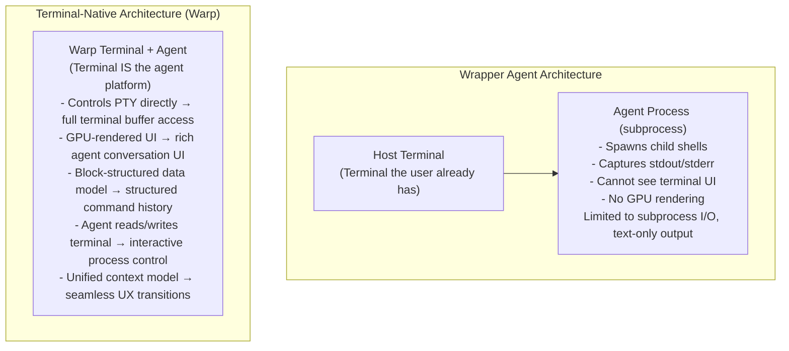
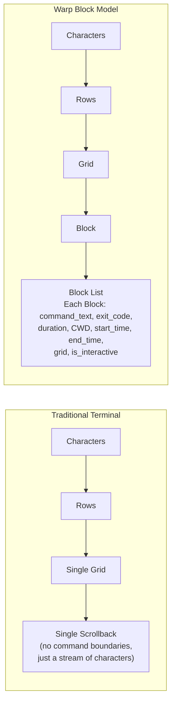
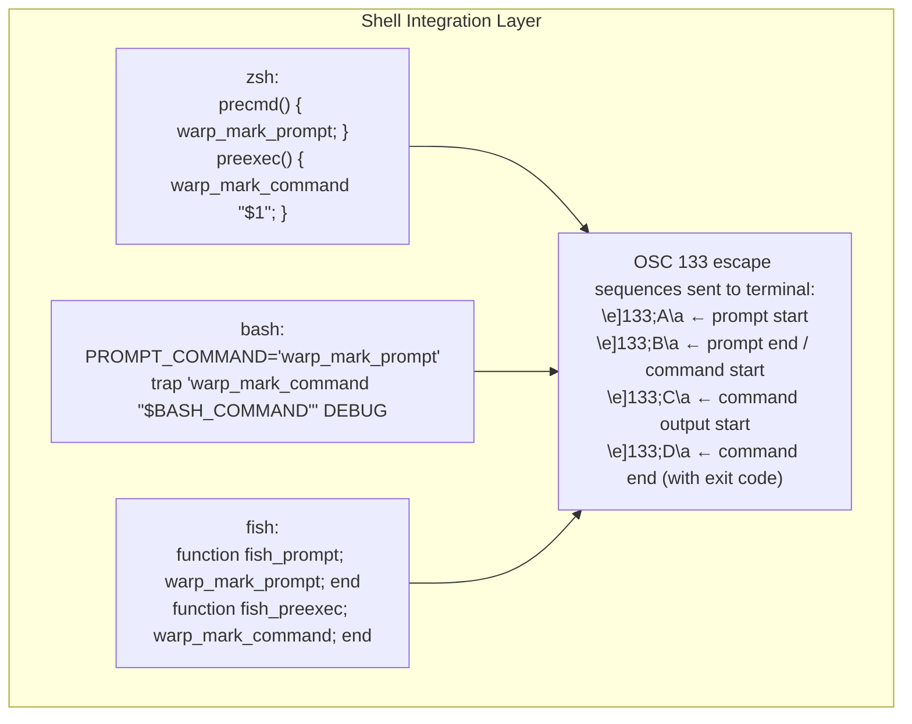
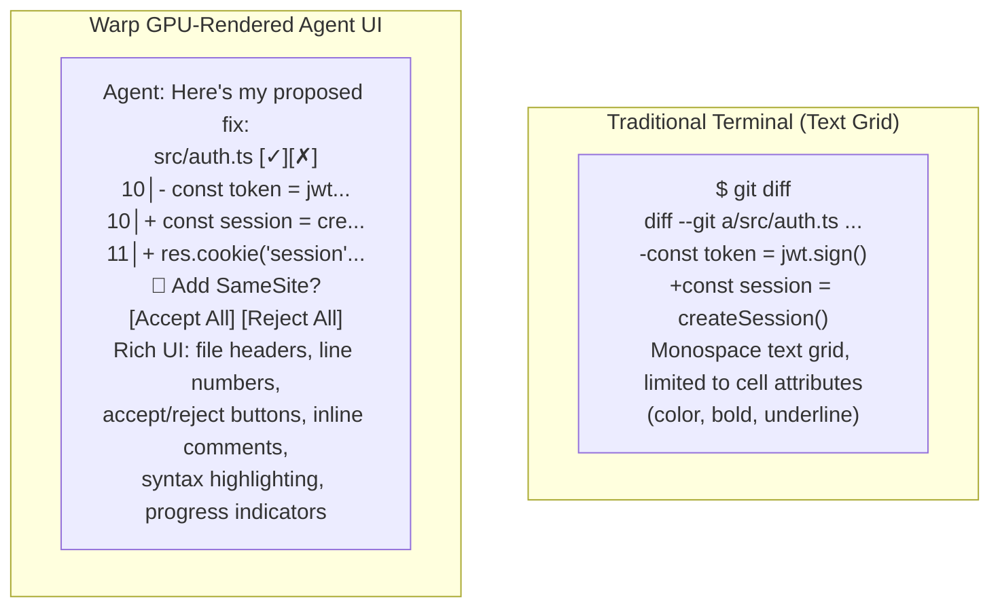
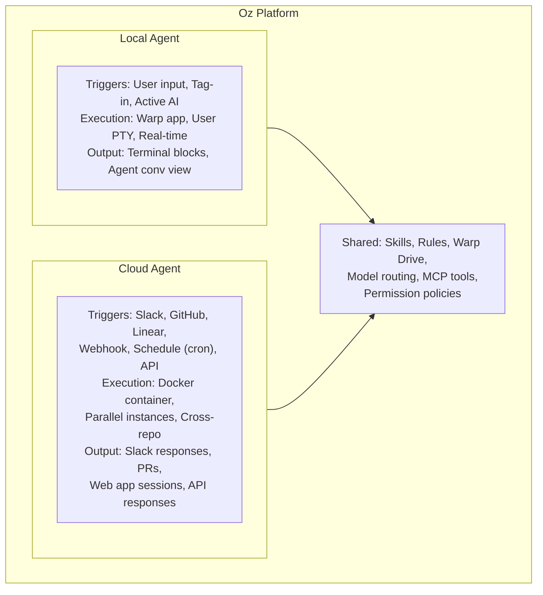
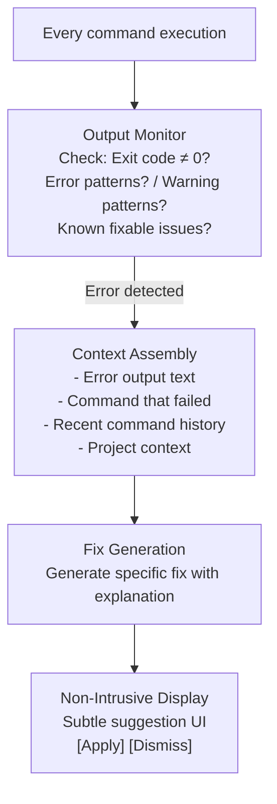

# Unique Patterns

> Warp introduces several architectural and UX patterns that are unique among coding agents,
> stemming from its fundamental decision to be the terminal rather than run inside one.
> These patterns offer lessons for any agent system designer.

## Pattern 1: Terminal-Native Agent Integration

### The Pattern

Instead of building an agent that runs inside a terminal (like Claude Code, Codex CLI,
or aider), build the terminal itself with agent capabilities as a first-class feature.

### Why It Matters



### Capabilities Unlocked

| Capability | Wrapper Agents | Terminal-Native (Warp) |
|------------|---------------|------------------------|
| Read running process output | ✗ | ✓ (buffer reading) |
| Write to running process | ✗ | ✓ (PTY writing) |
| Structured command history | ✗ (raw text) | ✓ (blocks with metadata) |
| Rich agent UI | ✗ (text only) | ✓ (GPU-rendered conversation) |
| Interactive code review | ✗ (text diffs) | ✓ (inline annotations) |
| Seamless modality switching | ✗ | ✓ (terminal ↔ conversation) |

### Trade-offs

- **Lock-in**: Users must switch their entire terminal, not just install a tool
- **Platform scope**: Must support macOS, Linux, Windows (massive engineering effort)
- **Adoption barrier**: Much higher than `pip install` or `npm install`
- **Ecosystem fragmentation**: Terminal extensions/plugins may not be compatible
- **Update dependency**: Agent capabilities tied to app update cycle

### Lesson for Agent Designers

The terminal-native approach demonstrates that the **execution environment** itself is a
rich source of context and capability. Any agent that can own its execution environment
(IDE plugin, browser extension, OS integration) can achieve capabilities impossible for
sandboxed subprocess agents.

## Pattern 2: Block-Based Data Model

### The Pattern

Replace the traditional terminal's single scrollback buffer with discrete, structured
"blocks" — one per command+output pair — each with its own grid, metadata, and identity.

### Implementation



### Benefits for Agents

1. **Precise reference**: "The output of block 3" vs. "the text around line 47 of scrollback"
2. **Structured metadata**: Exit codes, durations, CWDs without parsing
3. **Selective context**: Include only relevant blocks in agent context
4. **Error detection**: Instant identification of failed commands (exit code ≠ 0)
5. **Independent scroll**: Each block scrolls independently (useful for long outputs)
6. **Sharing**: Share specific blocks, not raw terminal dumps

### How Shell Hooks Enable Blocks



The escape sequences (OSC 133) are a standard used by several modern terminals (iTerm2,
Windows Terminal) but Warp goes further by building the entire data model around them.

### Lesson for Agent Designers

**Structure your execution history.** Even wrapper-based agents could benefit from
parsing command outputs into structured objects rather than treating them as raw text.
The metadata (exit codes, durations, working directories) is invaluable for agent
decision-making.

## Pattern 3: Full Terminal Use (PTY Attachment)

### The Pattern

Allow the agent to "attach" to a running interactive process by reading the terminal
buffer and writing to the PTY, enabling interaction with tools that have no API.

### Why This Is Novel

Most coding agents interact with the world through:
- **File reads/writes**: Static file content
- **Command execution**: Run command → capture output → parse
- **API calls**: HTTP requests to services

Warp adds a fourth modality:
- **PTY interaction**: Read live terminal buffer, write keystrokes to running process

### Example: Agent Debugging with GDB

```
Step 1: User starts GDB
  $ gdb ./myprogram

Step 2: User encounters complex state, tags in agent
  "Agent, find why the linked list is corrupted"

Step 3: Agent reads GDB prompt from terminal buffer
  (gdb) _

Step 4: Agent writes GDB commands
  Agent → PTY: "break list_insert\n"
  Agent → PTY: "run\n"
  Agent reads: "Breakpoint 1, list_insert(head=0x..., val=42)"
  Agent → PTY: "print *head\n"
  Agent reads: "$1 = {val = 0, next = 0x0}"
  Agent → PTY: "print head->next\n"
  Agent reads: "$2 = (Node *) 0x0"

Step 5: Agent analyzes
  "The head node has next=NULL but you're inserting as second
   element. The insert function doesn't handle the case where
   head->next is NULL. Here's the fix..."

Step 6: Agent hands back control
```

### Implementation Requirements

For PTY attachment to work, the agent needs:
1. **Buffer reading API**: Access to the current terminal buffer content
2. **PTY write API**: Ability to send bytes to the PTY input
3. **Process detection**: Know what process is running (via /proc or similar)
4. **Prompt detection**: Identify when the process is waiting for input
5. **State machine**: Track what the interactive tool is doing
6. **Timeout handling**: Handle unresponsive or slow processes
7. **Graceful exit**: Know how to cleanly exit each interactive tool

### Lesson for Agent Designers

**Interactive tools are an untapped capability space.** Most agents can only run commands
and read outputs. The ability to interact with REPLs, debuggers, and database shells
opens entirely new categories of tasks. Even without terminal ownership, agents could
achieve partial FTU through expect-style scripting or specialized tool integrations.

## Pattern 4: GPU Rendering Pipeline for Agent UX

### The Pattern

Use GPU-accelerated rendering to enable rich agent UI elements that go beyond what a
traditional text-grid terminal can display.

### What GPU Enables



### Specific GPU-Enabled Features

| Feature | Requires GPU? | Why |
|---------|---------------|-----|
| Syntax-highlighted diffs | Partial | Rich color beyond 256 |
| Inline action buttons | Yes | Non-text UI elements |
| Progress bars/indicators | Yes | Smooth animation |
| Image display (screenshots) | Yes | Image primitive rendering |
| Conversation view layout | Yes | Flexible non-grid layout |
| Smooth scrolling per block | Yes | Independent scroll regions |
| Animated transitions | Yes | State change feedback |
| Multi-font rendering | Yes | Mixed font sizes |

### Lesson for Agent Designers

**UX is a competitive advantage for agents.** The difference between text-only output
(wrapper agents) and rich rendered output (Warp) significantly affects how users interact
with and trust agent suggestions. IDE-based agents (Cursor, Windsurf) achieve similar
rich UX through the editor's rendering. Terminal agents are at a UX disadvantage unless
they own the rendering layer.

## Pattern 5: Cloud + Local Agent Unification

### The Pattern

Provide a single agent platform (Oz) that runs agents both locally (in the terminal app)
and in the cloud (on managed infrastructure), with shared context, skills, and tools.

### Architecture



### What Unification Enables

1. **Prototype locally, deploy to cloud**: Develop and test agent workflows in the terminal,
   then deploy the same workflow as a cloud agent
2. **Consistent behavior**: Same skills, rules, and tools apply everywhere
3. **Shared context**: Warp Drive provides shared artifacts between local and cloud
4. **Gradual automation**: Start with human-in-loop local, progressively automate to cloud
5. **Hybrid workflows**: Cloud agent does background work, human steers via web app

### Comparison with Other Approaches

| System | Local Agent | Cloud Agent | Unified? |
|--------|-------------|-------------|----------|
| **Warp** | Oz local (terminal) | Oz cloud | Yes — same platform |
| **Claude Code** | CLI tool | GitHub Actions | No — different systems |
| **Cursor** | IDE-based | None | N/A |
| **Devin** | None | Cloud-only | N/A |
| **GitHub Copilot** | IDE/CLI | Copilot Workspace | Partial |

### Lesson for Agent Designers

**Unifying local and cloud execution** reduces friction in the automation journey. Users
who invest in learning an agent's capabilities locally can leverage that knowledge for
cloud automation without learning a new system.

## Pattern 6: Agent Modality UX

### The Pattern

Provide two distinct interaction modes — terminal view (inline with commands) and
conversation view (dedicated agent workspace) — with seamless transitions between them.

### When Each Mode Is Used

```
Terminal View (Inline):                 Conversation View (Dedicated):
├── Quick commands                      ├── Multi-step refactoring
├── One-off questions                   ├── Complex debugging sessions
├── Error fix suggestions               ├── Architecture planning
├── Command generation                  ├── Code review workflows
├── File operations                     ├── Multi-file changes
└── Simple edits                        └── Learning/exploration
```

### Why Two Modes?

Single-mode agents face a UX dilemma:
- **Inline-only** (like shell aliases): Poor for complex, multi-turn tasks
- **Conversation-only** (like ChatGPT): Overhead for simple tasks

Warp resolves this by providing both and routing based on task complexity.

### Transition Behavior

```
User types "ls -la" in terminal
  → Terminal view (direct execution, no agent involvement)

User types "fix the failing test"
  → Agent evaluates: likely single-step fix
  → Terminal view (agent executes fix inline)

User types "refactor the auth system to use OAuth"
  → Agent evaluates: complex, multi-step
  → Conversation view (plan, discuss, execute)

User in conversation view clicks "run npm test"
  → Creates block in terminal view
  → Result visible in both views
```

### Lesson for Agent Designers

**Match the UX to the task complexity.** Simple tasks should feel like using a terminal.
Complex tasks should feel like working with a collaborator. The transition between these
modes should be seamless, not a context switch.

## Pattern 7: Proactive Agent Assistance (Active AI)

### The Pattern

Instead of waiting for explicit user requests, monitor terminal output and proactively
offer assistance when errors or opportunities are detected.

### Implementation



### Key Design Decisions

- **Non-intrusive**: Suggestions appear subtly, don't interrupt workflow
- **Dismissible**: Easy to ignore if not relevant
- **One-click apply**: Minimal friction to accept the fix
- **Contextual**: Fix considers project-specific patterns and rules
- **Learnable**: System improves relevance over time

### Lesson for Agent Designers

**Proactive assistance changes the interaction model** from "user asks → agent responds"
to "agent observes → agent offers." This is more natural but requires careful UX design
to avoid being annoying. The key is: only suggest when confidence is high, and make
dismissal effortless.

## Summary of Unique Patterns

| # | Pattern | Key Insight |
|---|---------|-------------|
| 1 | Terminal-native integration | Own the environment, unlock exclusive capabilities |
| 2 | Block-based data model | Structure execution history for better agent context |
| 3 | Full Terminal Use | Interactive process control opens new task categories |
| 4 | GPU rendering pipeline | Rich UX is a competitive advantage for agent trust |
| 5 | Cloud+local unification | Same platform everywhere reduces automation friction |
| 6 | Agent modality UX | Match interaction style to task complexity |
| 7 | Proactive assistance | Observe and offer, don't just wait for requests |

These patterns collectively demonstrate that the **execution environment** is not just a
place where agents run — it's a design space with enormous untapped potential. Warp's
approach of owning the entire stack enables patterns that wrapper-based agents cannot
achieve, at the cost of requiring users to adopt a new terminal.
