# Orchestrator-Workers

> Dynamic task decomposition and delegation

## Overview

The Orchestrator-Workers pattern is one of the five foundational agentic design
patterns identified in Anthropic's "Building Effective Agents" blog. It describes
an architecture where a central LLM (the orchestrator) dynamically analyzes a task,
breaks it into subtasks at runtime, delegates those subtasks to specialized or
general-purpose workers, and synthesizes the results into a coherent final output.

As Anthropic describes it, this pattern is "well-suited for complex tasks where you
can't predict the subtasks needed." This distinguishes it from prompt chaining (where
the sequence of steps is fixed at design time) and from parallelization (where the
decomposition is often structural and predetermined).

The orchestrator-workers pattern introduces **runtime intelligence** into task
decomposition. The orchestrator examines the specific input, reasons about what
subtasks are required, and adapts its plan as worker results come in.

### Why This Pattern Matters for Coding Agents

Software engineering tasks are inherently unpredictable in their decomposition:

- "Fix this bug" might require reading 2 files or 20, depending on the bug
- "Add this feature" might need database changes, API changes, UI changes, or
  only a configuration update
- "Refactor this module" might reveal cascading changes across the codebase

A coding agent cannot know upfront how many files to edit, what tools to use, or
what order to perform operations. The orchestrator-workers pattern gives the agent
the flexibility to figure this out at runtime.

Among the 17 CLI coding agents in this research library, the pattern appears in
remarkably diverse implementations — from Claude Code's sub-agent spawning to
Capy's Captain/Build worker architecture to Ante's self-organizing multi-agent system.

## Architecture

### Core Architecture Diagram

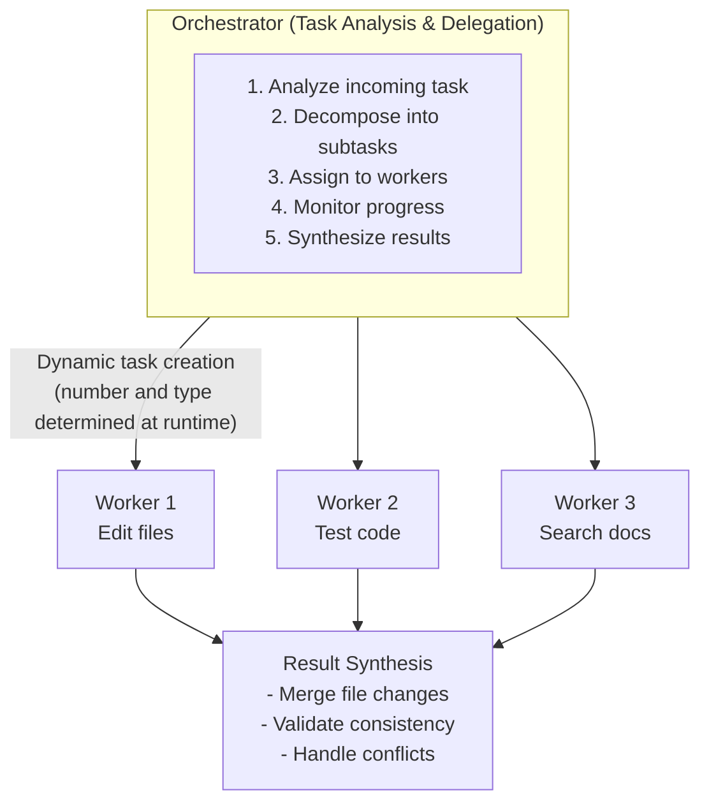

### Comparison with Other Patterns

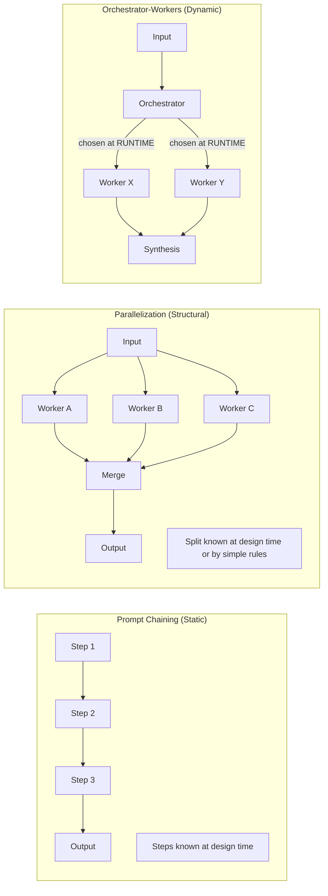

## Core Concepts

### Dynamic Task Decomposition

The defining feature: the orchestrator determines subtasks **at runtime** based on
the specific input.

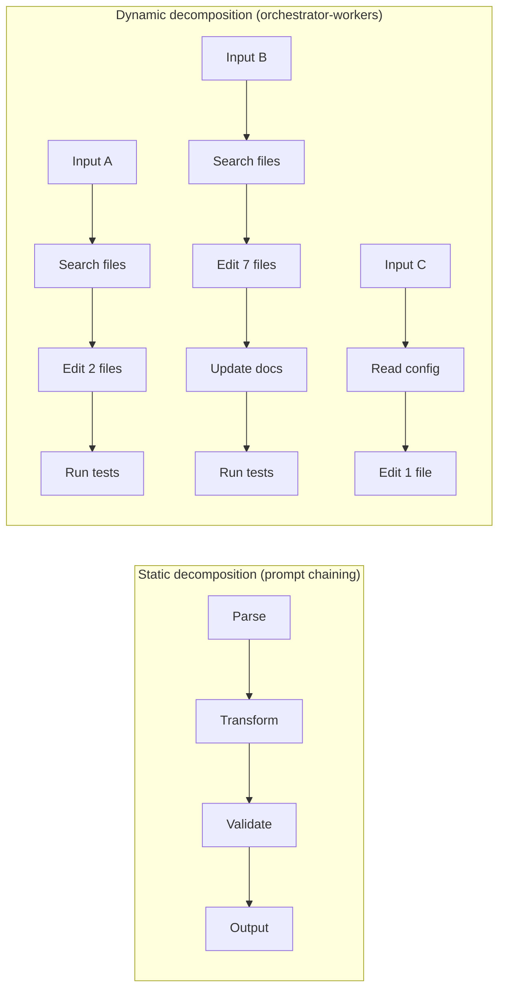

The orchestrator must: understand the task, assess the scope, identify dependencies
between subtasks, and allocate appropriate workers.

### Worker Specialization

Workers can be **specialized** or **generic**:

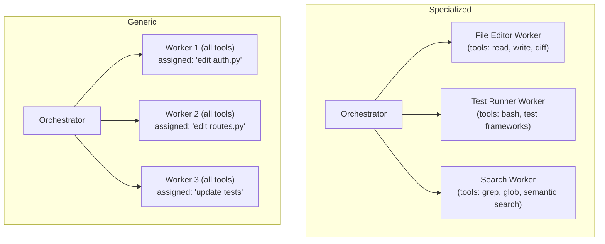

Specialized workers are more efficient (smaller tool sets, focused prompts) but
require the orchestrator to know what specialties exist.

### The Orchestrator Decides WHAT; Workers Decide HOW

A critical design principle: the orchestrator determines **what** needs to be done
(task decomposition), while workers determine **how** to accomplish their subtask.

```
Orchestrator: "Worker 2, add input validation to the /users endpoint"
                (WHAT to do)

Worker 2:     Reads the file, identifies the handler, adds validation
              middleware, updates error responses
                (HOW to do it)
```

This separation keeps the orchestrator lightweight (planning) while allowing
workers to be deeply capable (execution).

## Comparison with Static Pipelines

| Criterion                    | Prompt Chaining         | Orchestrator-Workers       |
|------------------------------|-------------------------|----------------------------|
| Task predictability          | High (known steps)      | Low (unknown steps)        |
| Number of subtasks           | Fixed                   | Variable                   |
| Subtask types                | Predetermined           | Determined at runtime      |
| Overhead                     | Low                     | Higher (planning step)     |
| Flexibility                  | Low                     | High                       |
| Error recovery               | Limited                 | Can re-plan                |
| Best for                     | ETL, formatting         | Bug fixes, features        |

## Orchestrator-Workers in the 17 Agents

### Claude Code — Main Agent as Orchestrator

Claude Code implements a single-loop agent that functions as both orchestrator and
primary worker, with the ability to spawn sub-agents as additional workers:

- **Orchestrator**: The main agent loop analyzes the task and decides what to do
- **Workers**: Sub-agents (Explore, Plan, custom) spawned via the task tool
- **Specialization**: Explore agents are read-only; the main agent handles writes

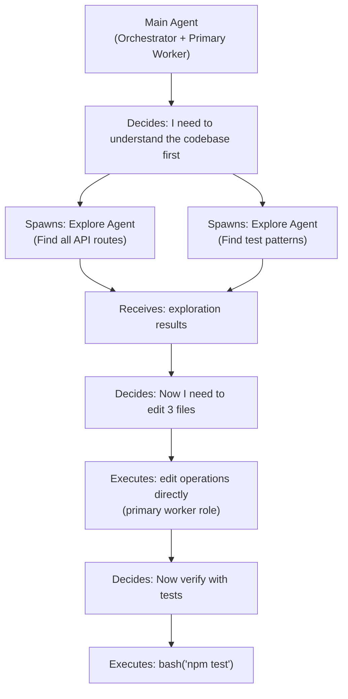

This hybrid approach — where the orchestrator is also a worker — is efficient for
tasks where most work can be done by the orchestrator itself.

### ForgeCode — Multi-Agent with Specialized Workers

ForgeCode employs three specialized sub-agents:

- **Forge**: Primary code generation and modification
- **Muse**: Creative problem-solving and design
- **Sage**: Knowledge retrieval and analysis

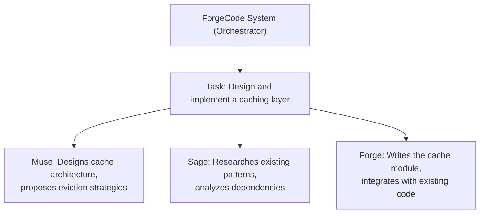

### Ante — Meta-Agent Orchestrator

Ante takes the pattern to its logical extreme with a self-organizing multi-agent
system. A meta-agent orchestrator analyzes tasks and creates new agents dynamically.
Even the worker architecture itself is determined at runtime — the most flexible
implementation among the 17 agents.

### Capy — Captain/Build Worker Architecture

Capy implements a clean separation between orchestration and execution:

- **Captain**: The orchestrator that analyzes tasks and creates work items
- **Build Workers**: Up to 25+ concurrent workers, each in its own git worktree

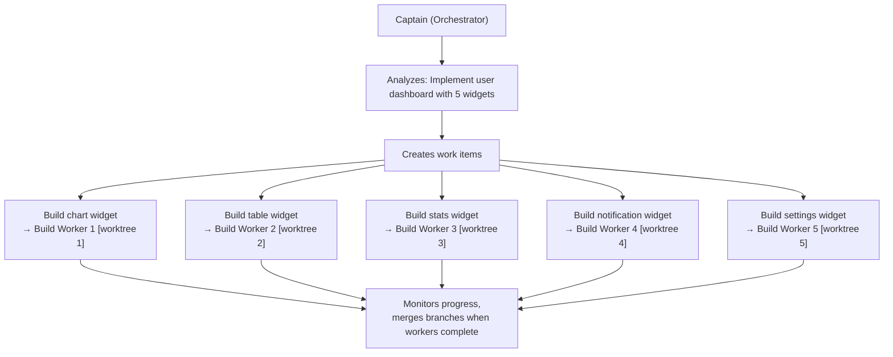

Capy's architecture is notable for its **scale** (25+ concurrent workers) and its
**isolation strategy** (git worktrees prevent inter-worker interference). The
Captain is a pure orchestrator — it plans and coordinates but does not execute.

### Sage Agent — 5-Agent Pipeline with Orchestration

Sage Agent implements a structured 5-agent pipeline — a hybrid of prompt chaining
(fixed pipeline structure) and orchestrator-workers (dynamic content within each
stage). Five specialized agents each handle a pipeline stage, with orchestration
determining what each stage needs for the specific task.

### Goose — Summon Sub-Agent Delegation

Goose uses the Summon pattern: the main agent actively "summons" specialized
sub-agents for specific tasks. Being MCP-native, worker delegation extends to
MCP server interactions.

### OpenHands — EventStream as Coordination Bus

Rather than an explicit orchestrator LLM, OpenHands uses the EventStream as a
decentralized coordination mechanism. The CodeAct action-observation loop
effectively orchestrates by publishing events that trigger appropriate handlers.

### Droid — Interface-Agnostic Core Orchestration

Droid's orchestration core works across multiple interfaces (IDE, Web, CLI, Slack).
This demonstrates that the orchestrator-workers pattern can be abstracted from its
interface — the same decomposition logic powers all interaction modes.

## Worker Design Patterns

### Specialized Workers

```python
class FileEditorWorker:
    """Worker specialized for file editing operations."""
    tools = ["read_file", "write_file", "diff", "patch"]

    async def execute(self, task: dict) -> dict:
        content = await self.read_file(task["filepath"])
        edited = await self.llm.complete(
            f"Edit {task['filepath']} per: {task['instructions']}\n{content}"
        )
        await self.write_file(task["filepath"], edited)
        return {"filepath": task["filepath"], "status": "edited"}


class TestRunnerWorker:
    """Worker specialized for running and analyzing tests."""
    tools = ["bash", "read_file"]

    async def execute(self, task: dict) -> dict:
        result = await self.bash(task["test_command"])
        analysis = await self.llm.complete(
            f"Analyze test output:\n{result}\n"
            f"Return: pass/fail, failing tests, suggested fixes."
        )
        return {"test_results": analysis}
```

### Worker Isolation Strategies

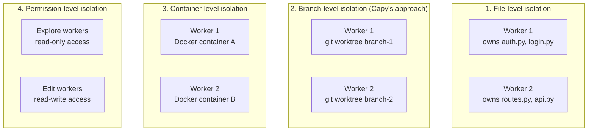

### Worker Communication Patterns

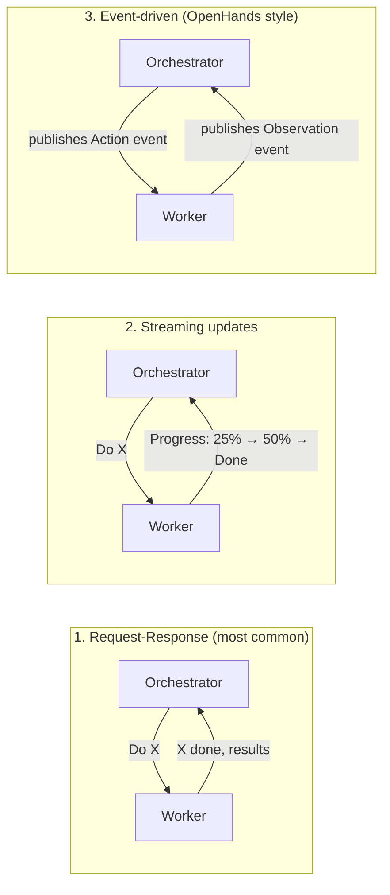

## Dynamic Task Decomposition

### Adjusting Plan Based on Intermediate Results

A key advantage over static pipelines: the orchestrator can adapt its plan.

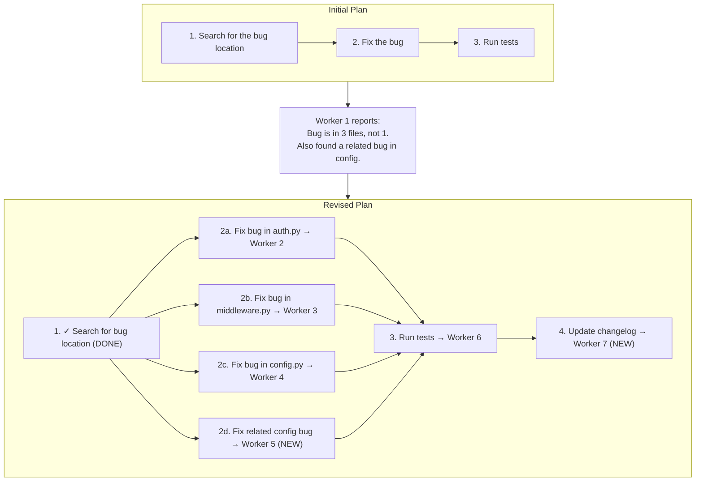

### Re-Planning When Workers Report Issues

```python
async def orchestrate_with_replanning(
    task: str, llm_client, max_replans: int = 3
) -> str:
    """Orchestrate with ability to re-plan based on worker results."""
    plan = await decompose_task(task, llm_client)
    completed_results = []
    replan_count = 0

    while plan and replan_count <= max_replans:
        ready = [t for t in plan if all(
            dep in [r["id"] for r in completed_results]
            for dep in t.get("dependencies", [])
        )]

        results = await asyncio.gather(
            *[execute_worker(t, llm_client) for t in ready]
        )

        issues = [r for r in results if r.get("needs_replan")]
        if issues:
            replan_count += 1
            plan = await replan(task, plan, completed_results, issues, llm_client)
        else:
            completed_results.extend(results)
            plan = [t for t in plan
                    if t["id"] not in [r["id"] for r in completed_results]]

    return await synthesize_results(completed_results, llm_client)
```

## Result Synthesis

### Merging File Changes from Multiple Workers

```python
async def merge_worker_changes(worker_results: list, llm_client) -> dict:
    """Merge file changes from multiple workers."""
    changes_by_file = {}
    for result in worker_results:
        for change in result.get("file_changes", []):
            filepath = change["filepath"]
            if filepath not in changes_by_file:
                changes_by_file[filepath] = []
            changes_by_file[filepath].append(change)

    merged = {}
    for filepath, changes in changes_by_file.items():
        if len(changes) == 1:
            merged[filepath] = changes[0]["new_content"]
        else:
            # Multiple workers modified the same file -- resolve conflict
            merged[filepath] = await resolve_conflict(
                filepath, changes, llm_client
            )
    return merged
```

### Conflict Detection and Resolution

```python
async def resolve_conflict(filepath, conflicting_changes, llm_client) -> str:
    """Resolve conflicting changes to the same file."""
    original = await read_file(filepath)
    changes_desc = "\n\n".join(
        f"Worker {c['worker_id']} changes:\n{c['diff']}"
        for c in conflicting_changes
    )
    return await llm_client.complete(
        f"Merge conflicting changes to {filepath}.\n"
        f"Original:\n{original}\n\nChanges:\n{changes_desc}\n"
        f"Produce the merged version incorporating all changes."
    )
```

## Implementation Patterns

### Simple Orchestrator

```python
import asyncio
from typing import List, Dict


async def simple_orchestrator(task: str, llm_client) -> str:
    """Decomposes, delegates, and synthesizes."""
    subtasks = await decompose_task(task, llm_client)

    completed = {}
    remaining = list(subtasks)

    while remaining:
        ready = [st for st in remaining
                 if all(d in completed for d in st.get("dependencies", []))]
        still_waiting = [st for st in remaining if st not in ready]

        if not ready:
            raise RuntimeError("Circular dependency detected")

        results = await asyncio.gather(
            *[execute_worker(st, llm_client) for st in ready]
        )

        for st, result in zip(ready, results):
            completed[st["id"]] = result

        remaining = still_waiting

    return await synthesize_results(list(completed.values()), llm_client)
```

### Hierarchical Orchestration

For very complex tasks, orchestrators can spawn other orchestrators:

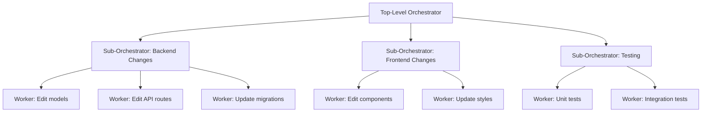

## Challenges

### Context Sharing Between Orchestrator and Workers

Workers only receive their subtask description, not the orchestrator's full context:

```
Problem:
  Orchestrator knows: "We're migrating from MySQL to PostgreSQL"
  Worker receives: "Update the query in users.py"
  Worker produces: MySQL-specific query (wrong!)

Solution:
  Include relevant global context in every worker prompt.
```

**Tradeoff**: More context improves accuracy but increases token cost per worker.

### Token Budget Management

With multiple workers, token usage multiplies rapidly:

```
Single agent:    1 call x 10,000 tokens = 10,000 tokens
Orchestrator:    planning (5K) + 3 workers (8K each) + synthesis (12K) = 41K tokens
```

**Mitigation**: Minimize shared context, use cheaper models for simple workers,
batch related subtasks into fewer workers.

### Coordination Overhead

- **Planning time**: Orchestrator must analyze and decompose before work begins
- **Communication**: Each worker dispatch and result collection adds latency
- **Synthesis**: Merging results is harder than sequential accumulation
- **Re-planning**: When plans change, previous work may be wasted

For simple tasks, this overhead may exceed the benefit.

### Error Handling Across Workers

```python
async def handle_worker_failure(failed_worker, llm_client) -> str:
    """Decide how to handle a worker failure."""
    return await llm_client.complete(f"""
    Worker failed on: {failed_worker['subtask']}
    Error: {failed_worker['error']}

    Options: RETRY (different approach), SKIP (continue without),
    REASSIGN (break into smaller pieces), ABORT (cancel all).
    Which is best?
    """)
```

## Code Examples

### Full Orchestrator Implementation

```python
import asyncio
import json
from dataclasses import dataclass, field
from typing import List, Dict, Optional
from enum import Enum


class SubtaskStatus(Enum):
    PENDING = "pending"
    IN_PROGRESS = "in_progress"
    COMPLETED = "completed"
    FAILED = "failed"


@dataclass
class Subtask:
    id: str
    description: str
    task_type: str
    dependencies: List[str] = field(default_factory=list)
    status: SubtaskStatus = SubtaskStatus.PENDING
    result: Optional[dict] = None


class Orchestrator:
    def __init__(self, llm_client, max_workers: int = 5):
        self.llm = llm_client
        self.max_workers = max_workers
        self.subtasks: Dict[str, Subtask] = {}

    async def run(self, task: str) -> str:
        # Phase 1: Decompose
        await self._decompose(task)

        # Phase 2: Execute with dependency-aware scheduling
        while self._has_pending():
            ready = self._get_ready()
            if not ready:
                if self._has_in_progress():
                    await asyncio.sleep(0.1)
                    continue
                raise RuntimeError("Deadlock detected")

            batch = ready[:self.max_workers]
            results = await asyncio.gather(
                *[self._execute_worker(st) for st in batch],
                return_exceptions=True
            )

            for subtask, result in zip(batch, results):
                if isinstance(result, Exception):
                    subtask.status = SubtaskStatus.FAILED
                    subtask.result = {"error": str(result)}
                else:
                    subtask.status = SubtaskStatus.COMPLETED
                    subtask.result = result

        # Phase 3: Synthesize
        return await self._synthesize(task)

    async def _decompose(self, task):
        plan = await self.llm.complete(
            f"Decompose into subtasks (JSON): {task}"
        )
        for item in json.loads(plan):
            st = Subtask(
                id=item["id"], description=item["description"],
                task_type=item["type"],
                dependencies=item.get("dependencies", [])
            )
            self.subtasks[st.id] = st

    def _has_pending(self):
        return any(s.status in (SubtaskStatus.PENDING, SubtaskStatus.IN_PROGRESS)
                   for s in self.subtasks.values())

    def _has_in_progress(self):
        return any(s.status == SubtaskStatus.IN_PROGRESS
                   for s in self.subtasks.values())

    def _get_ready(self):
        return [st for st in self.subtasks.values()
                if st.status == SubtaskStatus.PENDING
                and all(self.subtasks[d].status == SubtaskStatus.COMPLETED
                        for d in st.dependencies)]

    async def _execute_worker(self, subtask):
        subtask.status = SubtaskStatus.IN_PROGRESS
        dep_ctx = {d: self.subtasks[d].result for d in subtask.dependencies}
        result = await self.llm.complete(
            f"Execute: {subtask.description}\nDeps: {json.dumps(dep_ctx)}",
            tools=["read_file", "write_file", "bash", "grep"]
        )
        return {"subtask_id": subtask.id, "output": result}

    async def _synthesize(self, original_task):
        all_results = {sid: s.result for sid, s in self.subtasks.items()}
        return await self.llm.complete(
            f"Synthesize for: {original_task}\n"
            f"Results: {json.dumps(all_results)}"
        )
```

## Key Takeaways

1. **Essential for unpredictable tasks** — when you cannot know upfront how many
   steps or what types of work are needed, dynamic decomposition is the only
   viable approach.

2. **The orchestrator decides WHAT; workers decide HOW** — this separation keeps
   the orchestrator focused on planning and workers focused on execution.

3. **Capy's Captain/Build architecture is the purest implementation** — with a
   dedicated orchestrator, 25+ parallel workers, and git worktree isolation.

4. **Claude Code's hybrid approach is pragmatic** — serving as both orchestrator
   and primary worker avoids overhead for simple tasks while retaining sub-agent
   capability when needed.

5. **Re-planning is a superpower** — adjusting plans based on intermediate results
   is what makes this pattern superior to static pipelines for complex tasks.

6. **Token cost is the primary constraint** — every worker invocation multiplies
   the token budget. Efficient orchestrators minimize shared context.

7. **Result synthesis is the hardest part** — merging worker outputs coherently
   requires conflict detection, resolution, and validation.

8. **Hierarchical orchestration enables large-scale tasks** — sub-orchestrators
   create a tree of coordinated work for enterprise-scale changes.

9. **Worker isolation prevents interference** — whether through file locking,
   git worktrees, containers, or permission boundaries.

10. **Composes naturally with parallelization** — independent subtasks can execute
    in parallel, combining dynamic decomposition with speed benefits.

---

*This document is part of the research library studying 17 CLI coding agents
and the design patterns from Anthropic's "Building Effective Agents" blog.*
