# Parallelization

> Concurrent execution for speed and confidence

## Overview

Parallelization is one of the five foundational agentic design patterns identified in
Anthropic's "Building Effective Agents" blog. It addresses a fundamental limitation of
sequential processing: when tasks can be decomposed into independent units of work,
executing them one after another wastes time and misses opportunities for diverse
perspectives.

Anthropic identifies two key variations of parallelization:

1. **Sectioning** — Splitting a task into independent subtasks that run simultaneously,
   each handling a different portion of the work. The results are then aggregated into
   a final output.

2. **Voting** — Running the same task multiple times (often with identical prompts) to
   generate diverse outputs, then selecting or combining the best result through
   evaluation or majority vote.

Both variations share a common insight: LLM calls are stateless and can be executed
concurrently without interference. Unlike traditional software where shared mutable
state makes parallelism dangerous, each LLM invocation is a pure function — given an
input, it produces an output with no side effects on other invocations.

### Why Parallelization Matters for Coding Agents

Coding agents face unique pressures that make parallelization especially valuable:

- **Large codebases** have thousands of files that can be analyzed independently
- **Multiple perspectives** on code quality catch different classes of bugs
- **Speed is critical** — developers abandon tools that add minutes to their workflow
- **Confidence matters** — a single code review pass may miss critical issues

Among the 17 CLI coding agents studied in this research library, parallelization
manifests in diverse and revealing ways — from Claude Code's parallel sub-agent
spawning to Capy's 25+ concurrent git worktree tasks.

## Architecture

### Sectioning Architecture

The sectioning pattern splits work across multiple LLM instances, each responsible
for an independent portion of the task. An aggregator combines the results.

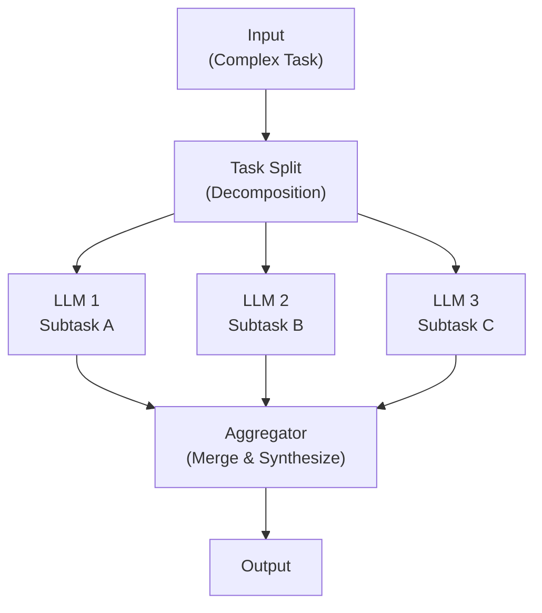

**Key properties:**
- Each LLM instance works on a different, non-overlapping portion of the task
- The subtasks are independent — LLM_2 does not need LLM_1's output
- The aggregator may be deterministic (concatenation) or intelligent (LLM-based merge)

### Voting Architecture

The voting pattern runs the same task multiple times and selects the best output.

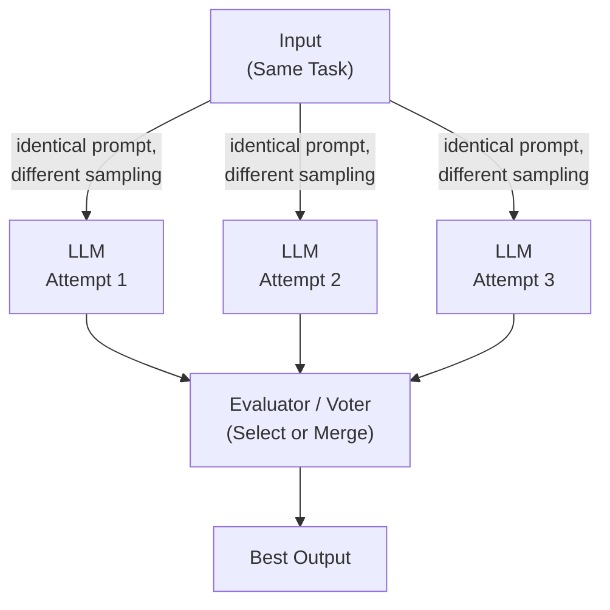

### Hybrid: Parallel Tool Execution

A third variation — common in coding agents — parallelizes tool calls rather than
LLM reasoning:

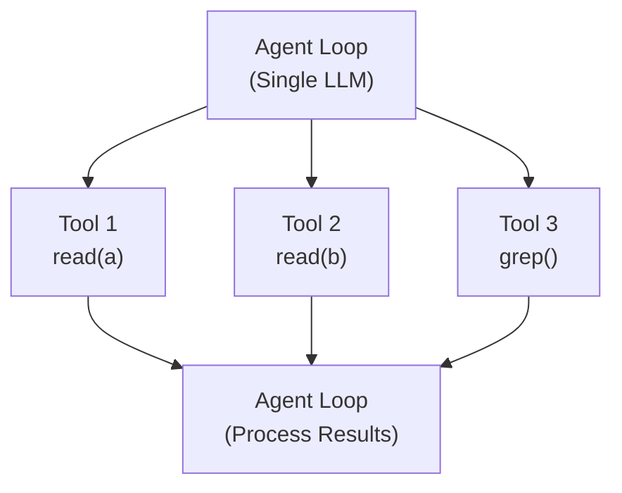

This is the most common form in practice — the agent is sequential, but it
dispatches multiple tool calls in a single turn.

## Sectioning Pattern

### Breaking Tasks into Independent Subtasks

The sectioning pattern's power comes from identifying truly independent units of work.
In coding contexts, independence is often structural:

| Granularity     | Independence Signal           | Example                           |
|-----------------|-------------------------------|-----------------------------------|
| File-level      | No cross-file dependencies    | Format 10 files independently     |
| Function-level  | No shared state mutations     | Analyze 5 pure functions          |
| Module-level    | Clean interfaces between them | Refactor 3 separate packages      |
| Concern-level   | Orthogonal responsibilities   | Security review in parallel with perf review |

The key insight: **the agent need not be certain of independence.** If two subtasks
have a 90% chance of being independent, running them in parallel and detecting
conflicts in the aggregation phase is often faster than running them sequentially.

### Guardrails as Parallel Processing

An often-overlooked application of sectioning: running safety guardrails in parallel
with the main generation task.

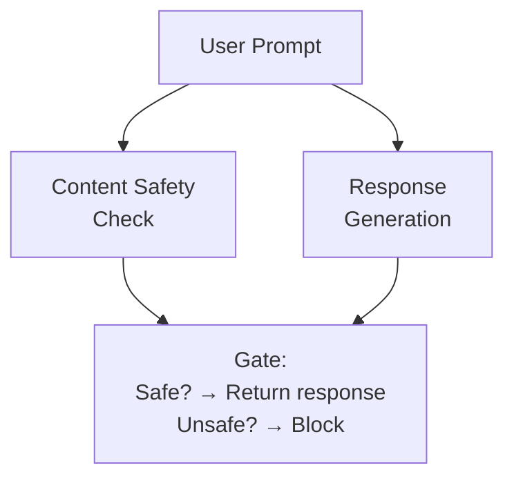

The safety check and the response generation are independent — neither needs the
other's output to proceed. If the safety check fails, the response is discarded.

## Voting Pattern

### Multiple Attempts at the Same Task

The voting pattern exploits a fundamental property of LLMs: with nonzero temperature,
the same prompt produces different outputs. These differences are not noise — they
represent genuine alternative approaches.

```
Prompt: "Write a function to find the longest palindromic substring"

Attempt 1: Dynamic programming approach (O(n^2) time, O(n^2) space)
Attempt 2: Expand-around-center approach (O(n^2) time, O(1) space)
Attempt 3: Manacher's algorithm (O(n) time, O(n) space)
```

### Majority Voting for Classification

For tasks with discrete outputs, majority voting is a powerful confidence booster:

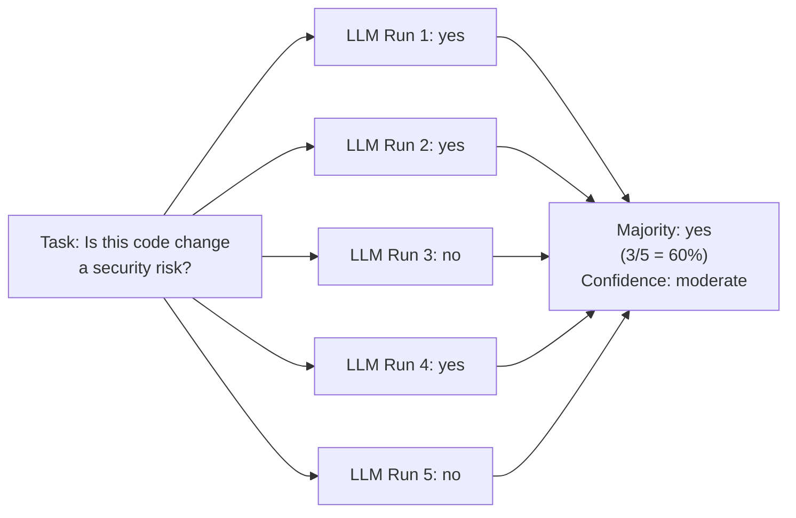

When confidence is low (e.g., 3/5), the system can escalate to a human reviewer.

### Best-of-N Sampling

A variant of voting where N outputs are generated and ranked by:
- **Compilation success** — does it compile/parse without errors?
- **Test passage** — does it pass the provided test cases?
- **Linting score** — how many style/quality warnings?
- **Cyclomatic complexity** — is it maintainable?

### Code Review with Multiple Reviewers

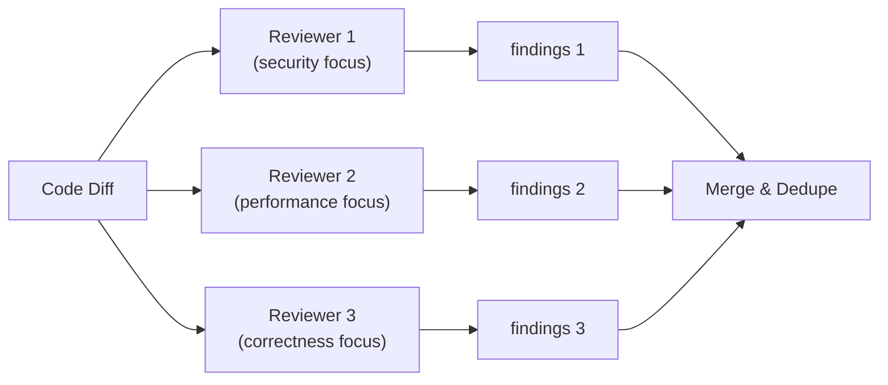

Each reviewer has the same diff but a different system prompt emphasizing their
specialty. The aggregator merges findings and deduplicates overlapping issues.

## Parallel Tool Execution

### Running Multiple Tool Calls Simultaneously

Most modern coding agents support dispatching multiple tool calls in a single turn:

```python
# Sequential (slow)
result_a = await read_file("src/auth.py")        # 50ms
result_b = await read_file("src/models.py")       # 50ms
result_c = await read_file("src/routes.py")       # 50ms
# Total: ~150ms

# Parallel (fast)
result_a, result_b, result_c = await asyncio.gather(
    read_file("src/auth.py"),                      # --+
    read_file("src/models.py"),                    # --+-- 50ms total
    read_file("src/routes.py"),                    # --+
)
```

### Claude Code's Parallel Sub-Agent Spawning

Claude Code can spawn multiple sub-agents — specifically "Explore" agents — that
run in parallel to investigate different aspects of a codebase simultaneously.

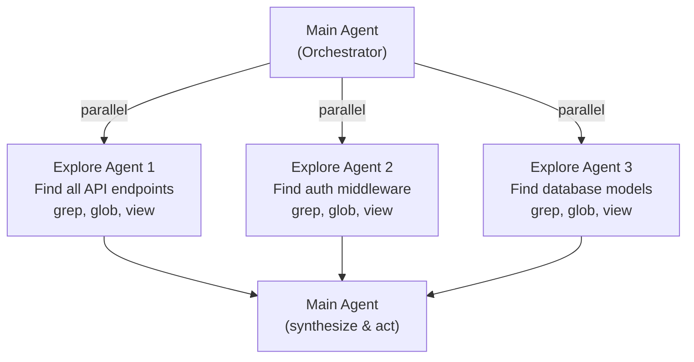

Key design decisions:
- **Explore agents are explicitly safe to parallelize** — they are read-only
- **Each sub-agent is stateless** — no shared context between them
- **The main agent aggregates** — sub-agent results feed back for decision-making

## Parallelization in the 17 Agents

### Claude Code — Parallel Explore Sub-Agents

- **Pattern**: Sectioning (each Explore agent investigates a different question)
- **Concurrency model**: Multiple sub-agents spawn in parallel via the task tool
- **Safety guarantee**: Explore agents are read-only (grep, glob, view, bash)
- **Best practice**: "Batch ALL related questions into ONE explore call" or
  "launch multiple explore agents IN PARALLEL"

### Capy — 25+ Concurrent Tasks with Git Worktrees

Capy represents the most aggressive parallelization strategy among the 17 agents:

- **Pattern**: Sectioning at the task level (not just tool level)
- **Concurrency model**: 25+ concurrent tasks, each in its own git worktree
- **Branch isolation**: Each task operates on a separate git branch

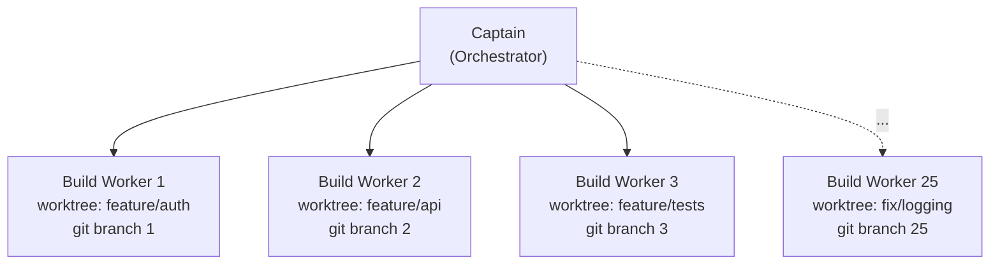

The git worktree strategy solves the fundamental tension in parallel code
modification: **two workers editing the same file.** By giving each worker its
own worktree, they can freely modify any file without interfering with each other.
Conflicts are detected and resolved at merge time, not execution time.

### ForgeCode — Multi-Agent Parallel Execution

ForgeCode employs three specialized sub-agents that can operate in parallel:

- **Forge**: Primary code generation and modification
- **Muse**: Creative problem-solving and design
- **Sage**: Knowledge retrieval and analysis

These ZSH-native agents can execute concurrently when their tasks are independent.

### OpenHands — Event-Driven Parallel Processing

OpenHands uses an event-driven pub/sub architecture (via EventStream) that
inherently supports parallel observation processing. The CodeAct paradigm generates
observations that can trigger parallel downstream processing without explicit
parallelization logic.

### Goose — Summon Sub-Agent Delegation

Goose uses the Summon pattern for sub-agent delegation — the main agent delegates
tasks to sub-agents that execute independently. Being MCP-native, parallelization
extends to MCP server interactions.

### Codex CLI — Decoupled Architecture

Codex CLI's Rust-based 3-layer sandbox with SQ/EQ decoupled architecture enables
parallel processing through separation of submission and event queues.

## Map-Reduce for Code Changes

### Map Phase: Analyze Each File Independently

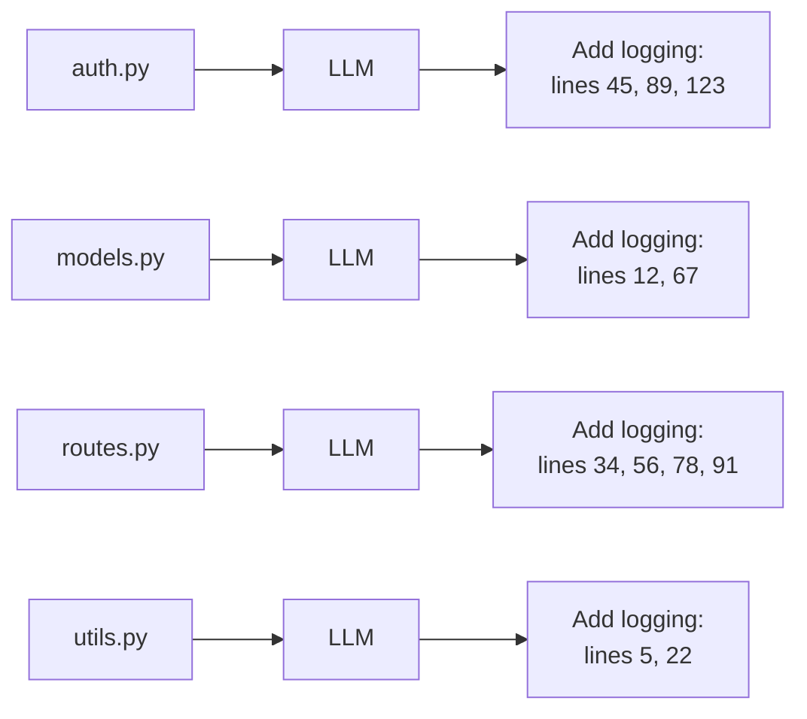

### Reduce Phase: Merge Changes, Resolve Conflicts

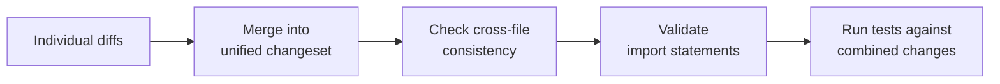

### Real-World Example: Multi-File Refactoring

Consider renaming a function used across 15 files:

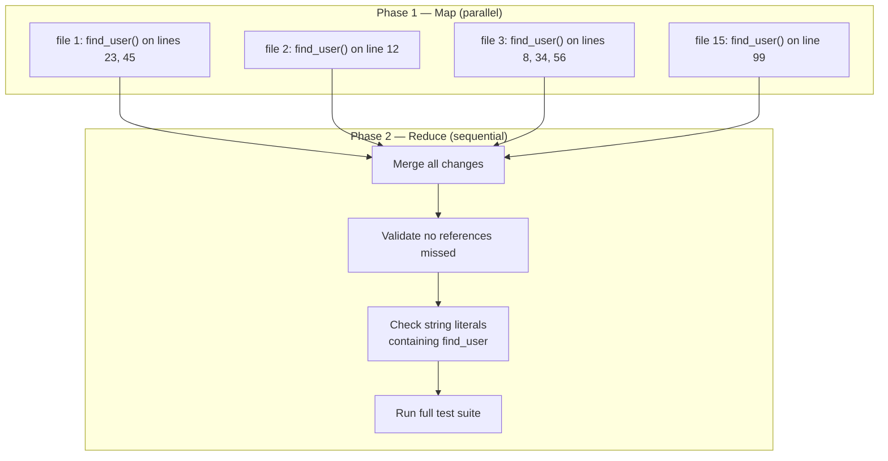

## Implementation Patterns

### Thread Pool / Async Execution

```python
import asyncio
from typing import List, Dict, Any


async def parallel_section(
    tasks: List[Dict[str, Any]],
    max_concurrency: int = 10
) -> List[Any]:
    """Execute independent tasks in parallel with bounded concurrency."""
    semaphore = asyncio.Semaphore(max_concurrency)

    async def bounded_task(task):
        async with semaphore:
            return await execute_llm_task(task)

    results = await asyncio.gather(
        *[bounded_task(t) for t in tasks],
        return_exceptions=True
    )

    successes = [r for r in results if not isinstance(r, Exception)]
    failures = [r for r in results if isinstance(r, Exception)]

    if failures:
        logger.warning(f"{len(failures)} tasks failed: {failures}")

    return successes
```

### Fan-Out / Fan-In with Aggregation

```python
async def fan_out_fan_in(
    input_data: str,
    num_workers: int = 3,
    aggregation_strategy: str = "merge"
) -> str:
    """Fan out to N workers, fan in with aggregation."""
    worker_tasks = []
    for i in range(num_workers):
        task = {
            "input": input_data,
            "worker_id": i,
            "system_prompt": f"You are worker {i}. Focus on aspect {i}."
        }
        worker_tasks.append(execute_llm_task(task))

    results = await asyncio.gather(*worker_tasks)

    if aggregation_strategy == "merge":
        return merge_results(results)
    elif aggregation_strategy == "vote":
        return majority_vote(results)
    elif aggregation_strategy == "best":
        return select_best(results)
```

### Error Handling in Parallel Execution

```python
async def resilient_parallel(
    tasks: List[Dict],
    max_retries: int = 2,
    timeout_seconds: float = 30.0
) -> List[Any]:
    """Parallel execution with retry and timeout."""

    async def execute_with_retry(task):
        for attempt in range(max_retries + 1):
            try:
                return await asyncio.wait_for(
                    execute_llm_task(task),
                    timeout=timeout_seconds
                )
            except asyncio.TimeoutError:
                if attempt == max_retries:
                    return {"error": "timeout", "task": task}
                await asyncio.sleep(2 ** attempt)
            except Exception as e:
                if attempt == max_retries:
                    return {"error": str(e), "task": task}
                await asyncio.sleep(1)

    return await asyncio.gather(
        *[execute_with_retry(t) for t in tasks]
    )
```

## Challenges

### Merge Conflicts Between Parallel Outputs

The most significant challenge in parallel code modification:

```
Worker A edits auth.py:  def login(user, password, session=None):
Worker B edits auth.py:  def login(username, pwd):

  --> Conflict! Both modified the same function signature.
```

**Mitigation strategies:**
- **File-level locking**: Assign each file to at most one worker
- **Git worktrees**: Capy's approach — each worker gets its own working directory
- **Optimistic concurrency**: Allow conflicts, detect at merge time
- **Dependency analysis**: Group interdependent files into sequential batches

### Resource Contention

Parallel LLM calls compete for API rate limits, token budgets, memory, and compute.
Beyond ~10 concurrent calls, throughput typically plateaus while costs continue
increasing linearly.

### Error Propagation

When one parallel task fails, the system must decide:
- **Fail fast**: Cancel all parallel tasks (appropriate for voting)
- **Fail isolated**: Continue other tasks, report the failure (for sectioning)
- **Retry**: Re-attempt the failed task (for transient failures)

### Context Sharing Between Parallel Tasks

Providing shared context to each worker duplicates tokens:

```
Shared context: 2,000 tokens  x  10 workers  =  20,000 tokens total
(vs. 2,000 tokens loaded once in sequential processing)
```

## When to Use

| Condition                          | Sectioning | Voting | Tool Parallel |
|------------------------------------|:----------:|:------:|:-------------:|
| Independent subtasks               |     Yes    |   --   |      Yes      |
| Need for speed                     |     Yes    |   Yes  |      Yes      |
| Multiple perspectives needed       |     --     |   Yes  |      --       |
| High-confidence results required   |     --     |   Yes  |      --       |
| Large number of files to process   |     Yes    |   --   |      Yes      |
| Classification/decision tasks      |     --     |   Yes  |      --       |
| Read-only exploration              |     Yes    |   --   |      Yes      |

### Anti-Patterns

- **Parallelizing dependent tasks**: If Task B needs Task A's output, they cannot
  be parallelized — this leads to stale data and inconsistent results.
- **Over-parallelizing small tasks**: Coordination overhead may exceed time saved.
- **Ignoring merge complexity**: Parallel code generation without a merge strategy
  produces unusable output.

## Code Examples

### Complete Sectioning: Parallel File Analysis

```python
import asyncio
from dataclasses import dataclass
from typing import List


@dataclass
class FileAnalysis:
    filepath: str
    issues: List[str]
    suggestions: List[str]
    complexity_score: float


async def analyze_file(filepath: str, llm_client) -> FileAnalysis:
    """Analyze a single file for code quality issues."""
    content = await read_file(filepath)
    response = await llm_client.complete(
        f"Analyze this code for quality issues:\n"
        f"File: {filepath}\n{content}\n"
        f"Return: issues, suggestions, complexity score (0-10)."
    )
    return parse_analysis(filepath, response)


async def parallel_codebase_analysis(
    filepaths: List[str],
    llm_client,
    max_concurrency: int = 10
) -> List[FileAnalysis]:
    """Analyze multiple files in parallel."""
    semaphore = asyncio.Semaphore(max_concurrency)

    async def bounded_analyze(fp):
        async with semaphore:
            return await analyze_file(fp, llm_client)

    results = await asyncio.gather(
        *[bounded_analyze(fp) for fp in filepaths],
        return_exceptions=True
    )

    analyses = [r for r in results if isinstance(r, FileAnalysis)]
    return sorted(analyses, key=lambda a: a.complexity_score, reverse=True)
```

### Complete Voting: Robust Code Generation

```python
async def generate_with_voting(
    specification: str,
    llm_client,
    num_candidates: int = 5,
    temperature: float = 0.8
) -> str:
    """Generate code using best-of-N voting strategy."""

    async def generate_candidate(attempt_id: int) -> dict:
        response = await llm_client.complete(
            f"Generate a Python implementation for:\n{specification}\n"
            f"Attempt {attempt_id}. Be creative with your approach.",
            temperature=temperature
        )
        return {"id": attempt_id, "code": response}

    candidates = await asyncio.gather(
        *[generate_candidate(i) for i in range(num_candidates)]
    )

    async def score_candidate(candidate: dict) -> dict:
        code = candidate["code"]
        score = 0.0
        try:
            compile(code, "<string>", "exec")
            score += 3.0
        except SyntaxError:
            pass
        if len(code.strip().split("\n")) < 50:
            score += 2.0
        if '"""' in code:
            score += 1.0
        if "->" in code:
            score += 1.0
        candidate["score"] = score
        return candidate

    scored = await asyncio.gather(*[score_candidate(c) for c in candidates])
    return max(scored, key=lambda c: c["score"])["code"]
```

## Key Takeaways

1. **Parallelization is the lowest-risk agentic pattern** — independent tasks
   cannot interfere with each other, making failures isolated and predictable.

2. **Sectioning and voting serve different goals**: sectioning optimizes for
   speed by dividing work; voting optimizes for quality by generating alternatives.

3. **Parallel tool execution is the most common real-world application** — even
   agents that don't support full LLM parallelization benefit from batching tool
   calls.

4. **Git worktrees (Capy's approach) solve the parallel file editing problem** —
   by giving each worker its own working directory, merge conflicts are deferred
   to a controlled merge phase rather than causing runtime errors.

5. **Claude Code's parallel Explore agents demonstrate safe parallelization** —
   read-only operations are inherently safe to parallelize; write operations
   require careful coordination.

6. **The cost multiplier is real** — parallel execution trades tokens (cost) for
   wall-clock time (speed). This tradeoff must be evaluated per use case.

7. **Aggregation is the hard part** — splitting work is straightforward; combining
   results coherently requires careful design, especially for conflicting code edits.

8. **Start with parallel tool calls** before investing in full LLM parallelization.
   The ROI of batching file reads and shell commands is immediate.

---

*This document is part of the research library studying 17 CLI coding agents
and the design patterns from Anthropic's "Building Effective Agents" blog.*
