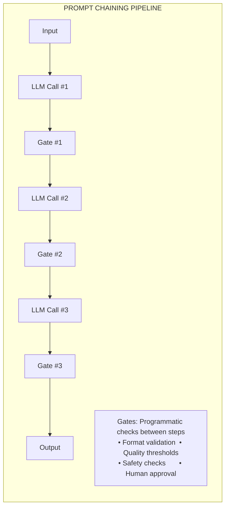
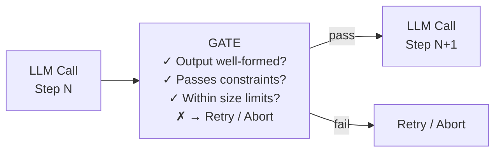
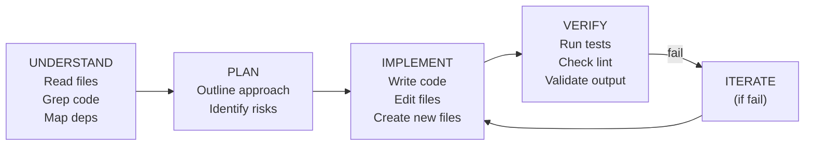
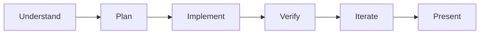
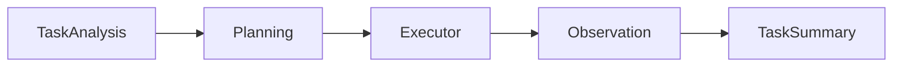
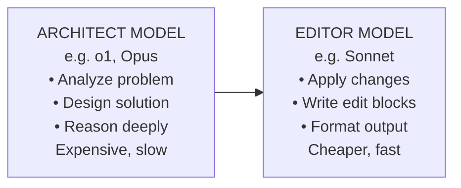
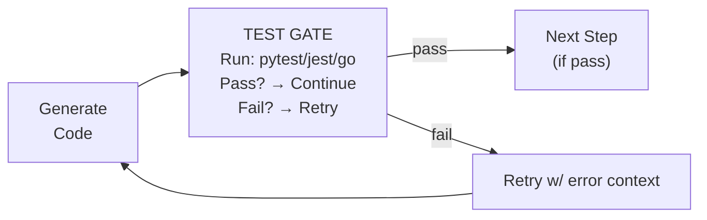
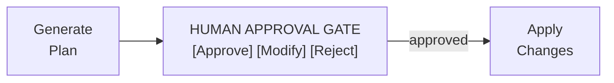

# Prompt Chaining

> Sequential workflow decomposition — breaking complex tasks into a pipeline of
> focused LLM calls connected by programmatic gates.

---

## Overview

Prompt chaining is the practice of **decomposing a complex task into a sequence
of discrete LLM calls**, where each call processes the output of the previous
one. Anthropic classifies this as a **workflow** pattern — meaning the
orchestration logic follows predefined code paths rather than being driven by
model decisions at runtime.

The key insight is simple: a single monolithic prompt that tries to do
everything at once is fragile. By breaking the task into smaller, focused steps,
each individual call becomes **more reliable**, **easier to debug**, and
**cheaper to retry** when something goes wrong. The tradeoff is increased
latency — you're making N sequential calls instead of one — but for many coding
tasks, accuracy matters far more than speed.

Anthropic's framing in *Building Effective Agents* (2024):

> "Prompt chaining decomposes a task into a sequence of steps, where each LLM
> call processes the output of the previous one. You can add programmatic checks
> (see 'gate' in the diagram below) on any intermediate steps to ensure that
> the process is still on track."

This makes prompt chaining the **second simplest pattern** on Anthropic's
spectrum, sitting just above augmented LLM and below routing. It introduces
multi-step orchestration but keeps the flow **deterministic** — the developer
decides the sequence at design time.

---

## Architecture



The architecture has three fundamental components:

1. **LLM Calls** — Each step is a focused prompt with a narrow responsibility
2. **Gates** — Programmatic checks that validate intermediate outputs
3. **Data Flow** — Output of step N becomes input to step N+1

The flow is **strictly sequential**. Unlike parallelization (where multiple
calls run concurrently) or orchestrator-workers (where the LLM decides what to
spawn), prompt chaining follows a fixed path through a known sequence of steps.

---

## Core Concepts

### Task Decomposition into Sequential Steps

The fundamental skill in prompt chaining is identifying how to **slice** a
complex task into smaller, independently solvable pieces. Each piece should:

- Have a **single, clear objective**
- Be completable with a **focused prompt**
- Produce output that is **structured enough** for the next step to consume
- Be **independently testable** and debuggable

For coding agents, this maps to natural phases of software development:

```
Understand the codebase
    → Plan the changes
        → Implement the code
            → Verify correctness
                → Present results
```

### Gates and Validation Between Steps

Gates are what distinguish prompt chaining from a naive sequence of API calls.
They are **programmatic checks** — not LLM calls — that validate intermediate
outputs before passing them downstream.



Gates serve multiple purposes:
- **Early failure detection** — catch problems before they propagate
- **Cost control** — don't waste expensive downstream calls on bad input
- **Debuggability** — when something fails, you know exactly where
- **Determinism** — programmatic checks are reproducible

### Trading Latency for Accuracy

Prompt chaining makes an explicit tradeoff:

| Approach | Latency | Accuracy | Debuggability |
|----------|---------|----------|---------------|
| Single monolithic prompt | Low | Lower | Poor |
| 2-step chain | Medium | Higher | Good |
| 5-step pipeline | High | Highest | Excellent |

The latency cost is acceptable in coding agents because:
1. Users expect code changes to take time (minutes, not milliseconds)
2. A wrong answer costs more to fix than a slow correct answer
3. Each step can be cached or memoized for similar future tasks

---

## The Coding Agent Pipeline

### The Universal Chain: Understand → Plan → Implement → Verify

Nearly every coding agent follows some variant of this four-phase cycle:



### Junie CLI's Explicit Pipeline

Junie CLI (JetBrains) is the most **explicitly chained** coding agent among
the 17. It implements a rigid 6-step pipeline:



Each phase is a **distinct mode** with its own system prompt, tool access, and
validation criteria:

| Phase | Activity | Tools Available | Gate Condition |
|-------|---------|-----------------|----------------|
| Understand | Read codebase | File read, search | Context gathered |
| Plan | Generate plan | None (reasoning) | Plan approved |
| Implement | Write/edit code | File write, shell | Code written |
| Verify | Run tests | Shell, test runner | Tests pass |
| Iterate | Fix issues | All tools | Issues resolved |
| Present | Summarize | None | — |

### Sage Agent's 5-Stage Pipeline

Sage Agent implements the most formalized pipeline with 5 explicitly named
stages:



Each stage is handled by a **dedicated agent**, making it a hybrid of prompt
chaining (fixed sequence) and orchestrator-workers (specialized agents per
step).

### Aider's Architect Mode: Two-Model Chain

Aider implements a two-step chain using **different models for each step**:



Step 1 (Architect): A powerful reasoning model produces a plan. Step 2
(Editor): A faster model translates the plan into concrete code edits.

---

## Gate Patterns

### Output Validation Gate

```python
def output_validation_gate(llm_output: str) -> bool:
    """Check that the output is well-formed."""
    if "```" not in llm_output:
        return False  # Expected code block not found
    try:
        parsed = json.loads(llm_output)
    except json.JSONDecodeError:
        return False
    required = ["file_path", "changes", "reasoning"]
    return all(key in parsed for key in required)
```

### Compilation/Syntax Gate

```python
def compilation_gate(code: str, language: str) -> GateResult:
    """Check that generated code is syntactically valid."""
    if language == "python":
        try:
            ast.parse(code)
            return GateResult(passed=True)
        except SyntaxError as e:
            return GateResult(
                passed=False,
                error=f"Syntax error at line {e.lineno}: {e.msg}"
            )
```

### Test Execution Gate

The strongest gate in the coding domain:



Used by: Junie CLI (verify phase), Codex CLI (sandbox validation), Claude Code
(sub-agents can run tests), Goose (MCP-enabled test execution).

### Safety Gate

```python
def safety_gate(proposed_changes: list[FileChange]) -> GateResult:
    for change in proposed_changes:
        if change.path in PROTECTED_FILES:
            return GateResult(passed=False, error=f"Protected: {change.path}")
        if change.deletions > MAX_DELETIONS:
            return GateResult(passed=False, requires_human_approval=True)
        if contains_secrets(change.new_content):
            return GateResult(passed=False, error="Secrets detected")
    return GateResult(passed=True)
```

### Human-in-the-Loop Gate



Common in: Claude Code (permission prompts), Codex CLI (auto/suggest/safe
modes), Goose (multi-layered security pipeline).

---

## Implementation Patterns

### Simple Sequential Chain

```python
class SimpleChain:
    def __init__(self, steps: list[ChainStep]):
        self.steps = steps

    async def execute(self, initial_input: str) -> ChainResult:
        current_input = initial_input
        results = []

        for step in self.steps:
            output = await step.llm_call(current_input)
            gate_result = step.gate(output)

            if not gate_result.passed:
                return ChainResult(
                    success=False, failed_at=step.name,
                    error=gate_result.error, partial_results=results
                )

            results.append(StepResult(step.name, output))
            current_input = output

        return ChainResult(success=True, results=results)
```

### Chain with Retry Logic

```python
class RetryChain:
    def __init__(self, steps: list[ChainStep], max_retries: int = 3):
        self.steps = steps
        self.max_retries = max_retries

    async def execute(self, initial_input: str) -> ChainResult:
        current_input = initial_input

        for step in self.steps:
            for attempt in range(self.max_retries):
                output = await step.llm_call(
                    current_input,
                    previous_error=step.last_error if attempt > 0 else None
                )
                gate_result = step.gate(output)
                if gate_result.passed:
                    break
                step.last_error = gate_result.error
            else:
                return ChainResult(success=False, failed_at=step.name)

            current_input = output

        return ChainResult(success=True, final_output=current_input)
```

### Chain with Conditional Branching

```python
class BranchingChain:
    async def execute(self, task_input: str) -> ChainResult:
        analysis = await self.analyze(task_input)
        complexity = self.assess_complexity(analysis)

        if complexity == "simple":
            code = await self.implement_simple(analysis)
            return await self.verify_and_return(code)
        elif complexity == "moderate":
            plan = await self.create_plan(analysis)
            code = await self.implement_from_plan(plan)
            return await self.verify_and_return(code)
        else:
            plan = await self.create_detailed_plan(analysis)
            subtasks = await self.decompose(plan)
            results = []
            for subtask in subtasks:
                result = await self.implement_subtask(subtask)
                gate = self.verify_subtask(result)
                if not gate.passed:
                    result = await self.fix_subtask(result, gate.error)
                results.append(result)
            return await self.verify_and_return(await self.integrate(results))
```

### Coding Agent Pipeline Example

```python
class CodingAgentChain:
    async def solve(self, user_request: str, codebase: Codebase) -> Solution:
        # Step 1: Understand
        context = await self.llm_call(
            system="You are a code analyst. Identify relevant files.",
            user=f"Task: {user_request}\nCodebase:\n{codebase.summary}",
            tools=[ReadFile, GrepCode, ListDir]
        )
        if len(context.files_read) < 1:
            raise InsufficientContext("No relevant files identified")

        # Step 2: Plan
        plan = await self.llm_call(
            system="Create a detailed implementation plan.",
            user=f"Task: {user_request}\nContext:\n{context.summary}"
        )
        if not plan.has_concrete_steps():
            raise InvalidPlan("Plan lacks concrete steps")

        # Step 3: Implement
        changes = await self.llm_call(
            system="Implement the plan with exact file edits.",
            user=f"Plan:\n{plan.text}\nFiles:\n{context.file_contents}"
        )
        compile_result = await codebase.check_syntax(changes)
        if not compile_result.success:
            changes = await self.llm_call(
                system="Fix the compilation errors.",
                user=f"Errors:\n{compile_result.errors}\nChanges:\n{changes}"
            )

        # Step 4: Verify
        test_result = await codebase.run_tests(changes)
        if not test_result.all_passed:
            changes = await self.llm_call(
                system="Fix the failing tests.",
                user=f"Failures:\n{test_result.failures}\nChanges:\n{changes}"
            )

        return Solution(changes=changes, plan=plan, context=context)
```

---

## When to Use Prompt Chaining

### Tasks That Decompose into Fixed Subtasks

- **Code review**: Parse diff → Identify issues → Categorize → Report
- **Migration**: Analyze old code → Plan migration → Transform → Validate
- **Documentation**: Read code → Extract API surface → Generate docs

### Each Step Benefits from Focused Attention

```
Single prompt (fragile):
  "Read this code, find the bug, fix it, write a test, update the docs"

Chained prompts (robust):
  Step 1: "Identify potential bugs"
  Step 2: "Write a fix for this bug"
  Step 3: "Write a test that verifies the fix"
  Step 4: "Update relevant documentation"
```

### Intermediate Validation Is Valuable

If you can check intermediate results programmatically, chaining lets you fail
fast instead of discovering errors after a long generation.

### Anthropic's Canonical Examples

- **Generate → Translate**: translation is simpler with clean, finalized input
- **Outline → Validate → Write**: validation catches structural issues early

---

## When NOT to Use Prompt Chaining

### Dynamic Decision-Making Required

If the agent needs to decide **what to do next** based on evolving context,
chaining is too rigid. You need the autonomous agent loop:

```
Prompt chaining: Step A → Step B → Step C  (always this order)
Autonomous loop: Observe → Think → Act → (repeat until done)
```

Claude Code and OpenHands use autonomous loops precisely because coding tasks
often require dynamic exploration.

### Subtasks Can't Be Predetermined

If you don't know the steps until you see the input, you need routing or
orchestrator-workers, not a fixed chain.

### Latency Is Critical

Each step adds a full LLM round-trip. For sub-second interactive scenarios,
chaining introduces unacceptable delay.

### The Task Is Simple Enough

Don't force a 5-step pipeline on a trivial task. Over-engineering adds latency
and complexity without improving accuracy.

---

## Prompt Chaining in the 17 Agents

| Agent | Chaining Type | Description |
|-------|--------------|-------------|
| **Junie CLI** | **Explicit** | 6-phase: understand→plan→implement→verify→iterate→present |
| **Sage Agent** | **Explicit** | 5-stage: TaskAnalysis→Planning→Executor→Observation→TaskSummary |
| **Aider** | **Explicit** | Architect mode: reasoning model → editing model |
| **Capy** | **Semi-explicit** | Captain (plan) → Build (execute) two-agent split |
| **Claude Code** | Implicit | Autonomous loop, tends to understand→plan→implement→verify |
| **ForgeCode** | Implicit | Multi-agent with sequential coordination |
| **Codex CLI** | Implicit | Single loop, sandbox enforces verify step |
| **Gemini CLI** | Implicit | Large context reduces need for explicit chaining |
| **Goose** | Implicit | MCP-native; tool calls form natural chains |
| **OpenHands** | Implicit | Event-driven CodeAct actions form implicit chains |
| **Ante** | Implicit | Self-organizing agents may chain dynamically |
| **Droid** | Implicit | Enterprise multi-interface approach |
| **OpenCode** | Implicit | Go TUI with standard agent loop |
| **Warp** | Implicit | Terminal-as-agent, processes form natural sequences |
| **mini-SWE-agent** | Implicit | 100-line bash script, implicit read→edit→test loop |
| **Pi Coding Agent** | Implicit | 4-tool minimalist with simple sequential behavior |
| **TongAgents** | Unknown | Closed system |

**Key observation:** Agents with explicit chaining (Junie CLI, Sage Agent,
Aider) prioritize **predictability and debuggability**. Agents optimized for
**flexibility** (Claude Code, OpenHands, ForgeCode) prefer autonomous loops.

---

## Comparison with Other Patterns

### vs Orchestrator-Workers

```
Chaining (static):       Step 1 → Step 2 → Step 3 → Step 4
Orchestrator (dynamic):  Orchestrator → [Worker A, Worker B, Worker C]
```

| Dimension | Prompt Chaining | Orchestrator-Workers |
|-----------|----------------|---------------------|
| Sequence | Fixed at design time | Dynamic at runtime |
| Flexibility | Low | High |
| Predictability | High | Medium |
| Debuggability | Excellent | Good |

### vs Evaluator-Optimizer

```
Chaining (linear):       A → B → C → D → Output
Evaluator-Optimizer:     Generate → Evaluate → Improve → (loop until good)
```

Some agents combine both: Junie CLI's implement→verify→iterate cycle is an
eval-opt loop embedded within a larger chain.

### vs Routing

Routing chooses **which path** to take. Chaining **executes a known path**.
They combine naturally: a router selects which chain to execute based on input.

---

## Key Takeaways

1. **Prompt chaining is the simplest multi-step pattern.** It trades latency
   for accuracy by breaking tasks into focused sequential steps connected by
   programmatic gates.

2. **Gates are the differentiator.** Without validation between steps, you just
   have sequential prompts. Gates provide quality control, early failure
   detection, and error recovery.

3. **Few coding agents use explicit chaining.** Most prefer autonomous loops.
   The exceptions — Junie CLI, Sage Agent, Aider — prioritize predictability.

4. **Chaining combines with other patterns.** A chain step can contain routing,
   parallelization, or an eval-opt loop. Real agents rarely use pure patterns.

5. **The understand→plan→implement→verify cycle is universal.** Whether explicit
   or implicit, every coding agent follows this chain-like pattern. The
   difference is whether the sequence is enforced by code or emerges from
   model behavior.

6. **Know when not to chain.** If the task requires dynamic exploration or
   subtasks can't be predetermined, don't force a chain.

7. **Start simple, add gates incrementally.** Begin with a basic sequential
   flow, add gates where you observe failure modes.

---

*Part of the [Agent Design Patterns](../agent-design-patterns/) research
series, analyzing patterns from Anthropic's "Building Effective Agents" across
17 CLI coding agents.*
