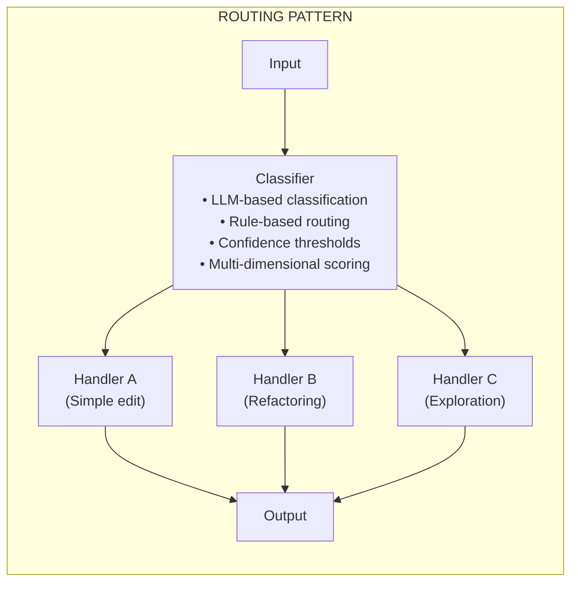
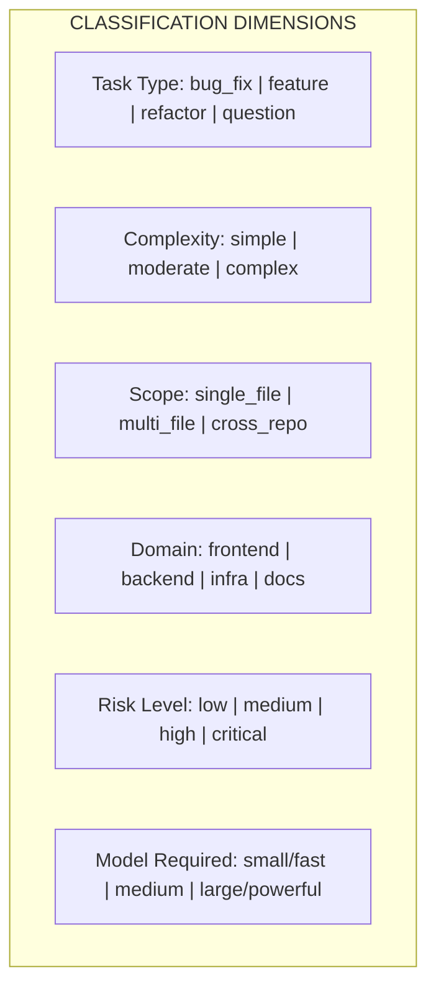
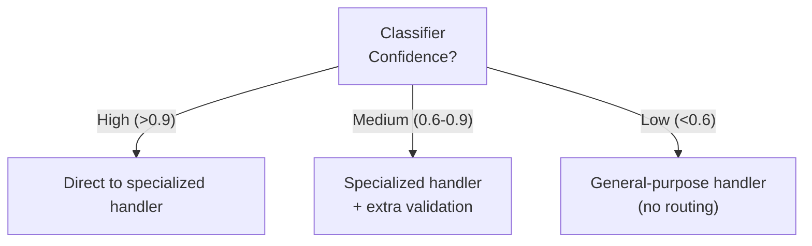
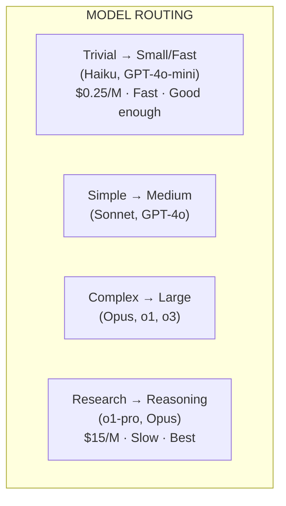
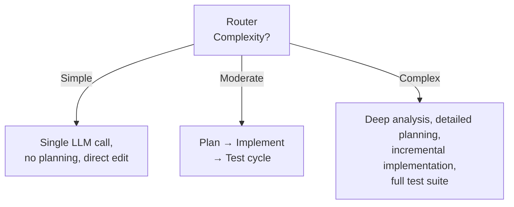
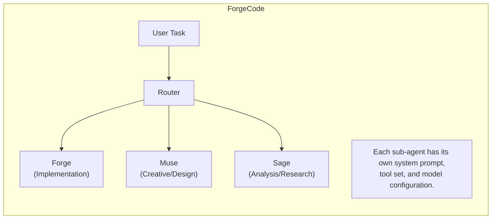
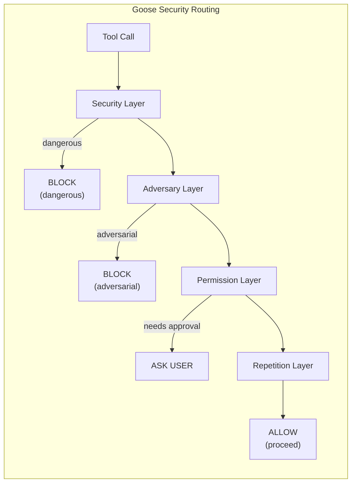
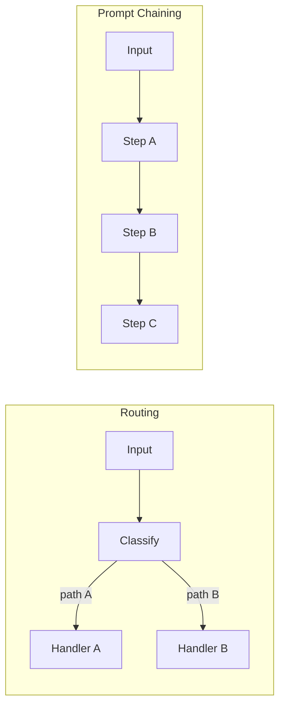
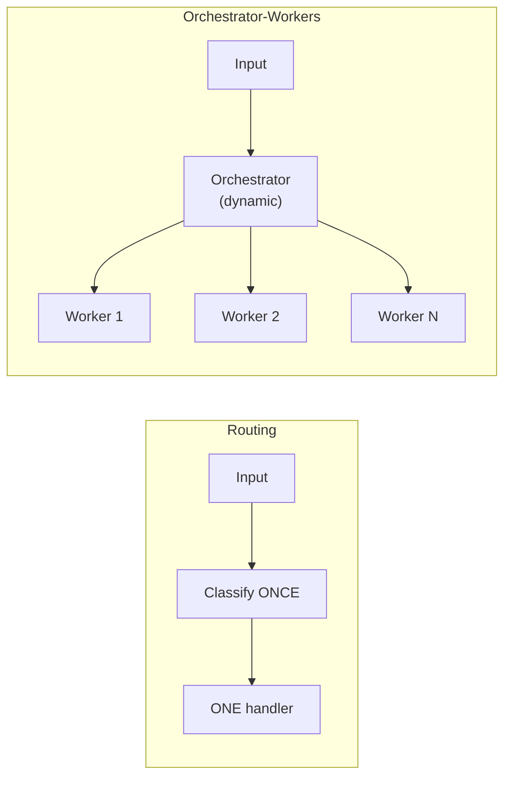
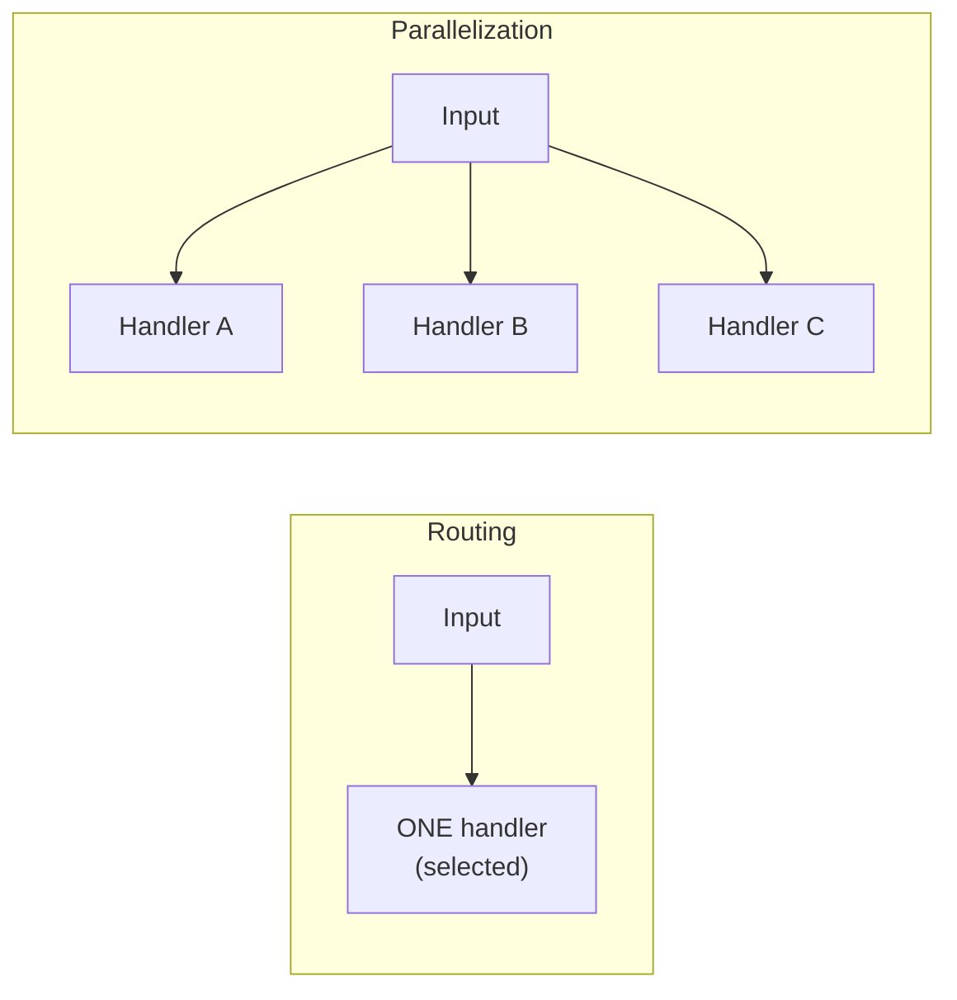

# Routing

> Intelligent task classification and dispatch — directing inputs to
> specialized handlers optimized for specific task types.

---

## Overview

Routing is the pattern of **classifying an input and directing it to a
specialized handler** designed for that particular type of task. Anthropic
describes routing as a workflow pattern that "allows for separation of concerns
and building more specialized prompts" — recognizing that a single monolithic
prompt cannot optimally handle every type of input.

The core insight: **different tasks demand different treatment.** A simple
variable rename doesn't need the same computational resources, prompt
engineering, or tool access as a complex multi-file refactoring. By routing
tasks to specialized handlers, you optimize each handler for its specific
domain without compromising on others.

From Anthropic's *Building Effective Agents* (2024):

> "Routing classifies an input and directs it to a specialized followup task.
> This workflow allows for separation of concerns, and building more specialized
> prompts. Without this workflow, optimizing for one kind of input can hurt
> performance on other inputs."

On Anthropic's pattern spectrum, routing sits **above prompt chaining and below
parallelization**. It introduces **conditional branching** — the first pattern
where the system makes a non-trivial decision about which path to follow. But
unlike orchestrator-workers, the routing decision is made **once** at the
beginning, not dynamically throughout execution.

---

## Architecture



The architecture has three components:

1. **Classifier** — Analyzes the input and selects a route
2. **Specialized Handlers** — Purpose-built processors for each task type
3. **Output Aggregation** — Collects handler output into a unified response

---

## Core Concepts

### Input Classification

The foundation of routing is **accurate classification**. The classifier must
examine the input and determine which handler will produce the best result.
Classification can happen along multiple dimensions:



### Specialized Handler Selection

Once classified, the input is directed to a handler **optimized for that
specific class**. Specialization can mean:

- **Different system prompts** tuned for the task type
- **Different tool sets** available to the handler
- **Different models** (cheaper for simple, more powerful for complex)
- **Different execution strategies** (single-pass vs iterative)

### Separation of Concerns

Routing enforces **modularity** in agent design:

1. **Independent optimization** — improve refactoring handler without
   affecting bug-fix handler
2. **Independent testing** — test each handler with its own benchmarks
3. **Independent scaling** — expensive resources only when needed
4. **Easier debugging** — failures traceable to specific handlers

---

## Classification Methods

### LLM-Based Classification

```python
CLASSIFICATION_PROMPT = """Classify the following coding task into exactly
one category:

Categories:
- SIMPLE_EDIT: Single-file changes, variable renames, small fixes
- BUG_FIX: Debugging and fixing broken behavior
- REFACTOR: Restructuring code without changing behavior
- FEATURE: Adding new functionality
- EXPLORATION: Understanding code, answering questions

Task: {task_description}

Respond with just the category name."""

async def classify_with_llm(task: str) -> TaskCategory:
    response = await llm(
        CLASSIFICATION_PROMPT.format(task_description=task),
        model="fast-classifier",  # Use a cheap/fast model
        max_tokens=20
    )
    return TaskCategory(response.strip())
```

**Advantages:** Handles nuanced, ambiguous inputs well.
**Disadvantages:** Adds latency, can misclassify, costs money.

### Rule-Based Routing

```python
def classify_with_rules(task: str) -> TaskCategory:
    task_lower = task.lower()

    if any(kw in task_lower for kw in ["fix", "bug", "error", "broken"]):
        return TaskCategory.BUG_FIX
    if any(kw in task_lower for kw in ["refactor", "restructure", "clean up"]):
        return TaskCategory.REFACTOR
    if any(kw in task_lower for kw in ["explain", "what does", "how does"]):
        return TaskCategory.EXPLORATION

    return TaskCategory.FEATURE  # Default
```

**Advantages:** Zero latency, zero cost, deterministic.
**Disadvantages:** Brittle, can't handle ambiguity.

### Hybrid Approaches

```python
async def classify_hybrid(task: str, context: TaskContext) -> TaskCategory:
    rule_result = classify_with_rules(task)
    if rule_result.confidence > 0.9:
        return rule_result.category  # Fast path
    return await classify_with_llm(task)  # Slow path for ambiguous cases
```

### Confidence-Based Routing with Fallbacks



---

## Model Routing

One of the most impactful forms of routing: **selecting which AI model to use
based on task complexity.**

### The Model Spectrum



### ForgeCode's Model Routing

ForgeCode implements **phase-based model routing** where different workflow
phases use different models. It also routes to different sub-agents — Forge
(implementation), Muse (creative/exploratory), Sage (analysis/research) —
each potentially using different model configurations.

### Junie CLI's Dynamic Per-Task Model Routing

Junie CLI routes to different models based on the specific task within its
pipeline phases, adapting model selection to the complexity encountered at
each phase rather than using a fixed assignment.

### Droid's Model/Vendor Agnostic Routing

Droid routes across **multiple providers**, incorporating cost constraints,
latency requirements, capability matching, and availability for failover.

### Cost Optimization Through Model Routing

```
Without routing (always best model):  1000 tasks × $0.50 = $500
With routing:
  700 simple   × $0.05 = $35
  200 moderate × $0.20 = $40
  100 complex  × $0.50 = $50     Total: $125  (75% savings)
```

---

## Task Complexity Routing

Beyond model selection, routing determines the **entire execution strategy**.

### Simple Edit vs Complex Refactor



### Routing by Task Type

```python
async def route_by_task_type(task: str, classification: TaskType):
    if classification == TaskType.BUG_FIX:
        return BugFixHandler(
            strategy="reproduce_first",
            tools=["debugger", "test_runner", "log_analyzer"],
            model="reasoning_model"
        )
    elif classification == TaskType.FEATURE:
        return FeatureHandler(
            strategy="design_then_build",
            tools=["file_creator", "test_writer", "doc_generator"],
            model="coding_model"
        )
    elif classification == TaskType.EXPLORATION:
        return ExplorationHandler(
            strategy="read_and_summarize",
            tools=["file_reader", "grep", "symbol_search"],
            model="fast_model"  # Reading doesn't need premium
        )
```

---

## Routing in Coding Agents

### ForgeCode: Multi-Agent Routing

ForgeCode routes tasks to different specialized sub-agents:



### Claude Code: Implicit LLM-Native Routing

Claude Code's model performs **implicit routing** at each turn — deciding
whether to answer directly, use tools, or spawn sub-agents. The classifier
and router are the same model.

### Goose: Multi-Layered Security Routing

Goose implements a **security-focused routing pipeline**:



### Gemini CLI: Progressive Skill Disclosure

Gemini CLI routes based on **context availability** — capabilities expand as
the system gains confidence in user intent and task requirements.

### Capy: Hard Capability Boundaries

Capy implements **binary routing** with its two-agent split: every aspect of
a task is either a planning concern (Captain) or an execution concern (Build),
with hard boundaries preventing role overlap.

---

## Implementation Patterns

### Router with Enum Classification

```python
from enum import Enum

class TaskRoute(Enum):
    SIMPLE_EDIT = "simple_edit"
    BUG_FIX = "bug_fix"
    FEATURE = "feature"
    REFACTOR = "refactor"
    EXPLORATION = "exploration"

class Router:
    def __init__(self, handlers: dict[TaskRoute, Handler]):
        self.handlers = handlers

    async def route(self, task: str, context: CodebaseContext) -> Result:
        route = await self.classify(task, context)
        return await self.handlers[route].execute(task, context)

router = Router({
    TaskRoute.SIMPLE_EDIT: SimpleEditHandler(model="haiku"),
    TaskRoute.BUG_FIX: BugFixHandler(model="sonnet"),
    TaskRoute.FEATURE: FeatureHandler(model="opus"),
    TaskRoute.REFACTOR: RefactorHandler(model="sonnet"),
    TaskRoute.EXPLORATION: ExplorationHandler(model="haiku"),
})
```

### Confidence Threshold Routing

```python
class ConfidenceRouter:
    async def route(self, task: str) -> Result:
        scores = await self.classify_with_scores(task)
        ranked = sorted(scores.items(), key=lambda x: x[1], reverse=True)
        top_route, top_confidence = ranked[0]

        if top_confidence > 0.9:
            return await self.handlers[top_route].execute(task)
        elif top_confidence > 0.6:
            result = await self.handlers[top_route].execute(task)
            if (await self.validate_result(result, task)).passed:
                return result
            return await self.handlers[ranked[1][0]].execute(task)
        else:
            return await self.general_handler.execute(task)
```

### Multi-Dimensional Routing

```python
class MultiDimensionalRouter:
    async def route(self, task: str, context: Context) -> Result:
        complexity = await self.assess_complexity(task)
        domain = await self.assess_domain(task, context)
        urgency = await self.assess_urgency(task)

        model = {"simple": "haiku", "moderate": "sonnet", "complex": "opus"}[complexity]

        tools = {
            "frontend": [BrowserTool, CSSLinter],
            "backend": [DatabaseTool, APITester],
            "infra": [DockerTool, TerraformValidator],
        }[domain]

        strategy = {
            "immediate": SinglePassStrategy(max_iterations=1),
            "normal": IterativeStrategy(max_iterations=3),
            "batch": ThoroughStrategy(max_iterations=10),
        }[urgency]

        handler = DynamicHandler(model=model, tools=tools, strategy=strategy)
        return await handler.execute(task, context)
```

---

## When to Use Routing

### Distinct Task Categories

Routing shines when inputs fall into **clearly separable categories**:

```
Coding assistant that handles:
├── Questions about code     → Read-only, fast model, search tools
├── Bug fixes                → Debugging tools, reasoning model
├── New features             → Full tool suite, planning phase
├── Code reviews             → Diff analysis, quality checklist
└── Documentation updates    → Doc templates, lighter model
```

### Cost Optimization

Model routing delivers **immediate cost savings**:

```
Before routing (always Opus):   Avg $0.45/task
After routing (model selection): Avg $0.10/task  (78% reduction)
```

### Performance Across Diverse Inputs

When a single approach produces uneven quality:

```
Single handler:    Simple 95% ✓ Complex 60% ✓
Routed handlers:   Simple 95% ✓ (fast) Complex 85% ✓ (thorough)
```

---

## Anti-Patterns

### Over-Routing

```
❌  20 categories with subtle distinctions → 60% accuracy
✓   4-5 categories with clear boundaries  → 95% accuracy
```

Start with 3-5 categories. Only add more with clear evidence.

### Misclassification Without Recovery

```
❌  Misclassified task goes to wrong handler, fails silently
✓   Handler detects mismatch → falls back to general handler
```

Always implement fallback paths for misrouted tasks.

### Router as Bottleneck

```
❌  Expensive LLM classification on every request (+2-5s)
✓   Rules first, LLM only for ambiguous cases (~20% of requests)
```

The router should be **lightweight** — sub-100ms for clear-cut cases.

---

## Routing in the 17 Agents: Summary Table

| Agent | Routing Type | What Gets Routed |
|-------|-------------|------------------|
| **ForgeCode** | Explicit multi-agent | Tasks → Forge/Muse/Sage |
| **Claude Code** | Implicit LLM-native | Turns → response/tool/sub-agent |
| **Codex CLI** | Mode-based | User config → auto/suggest/safe |
| **Droid** | Model/vendor routing | Tasks → optimal model+provider |
| **Ante** | Self-organizing | Tasks → self-selected agents |
| **OpenHands** | Event-based | Events → handlers by type |
| **Warp** | Terminal routing | Commands → AI vs local execution |
| **Gemini CLI** | Progressive | Context → skill disclosure level |
| **Goose** | Security routing | Tool calls → 4-layer security pipeline |
| **Junie CLI** | Phase + model routing | Pipeline phases → models |
| **Aider** | Architect/Editor | Reasoning → writing (two-model) |
| **Sage Agent** | Pipeline routing | Stages → dedicated agents |
| **Capy** | Binary split | Planning (Captain) vs execution (Build) |
| **OpenCode** | Implicit | Minimal routing in Go TUI |
| **mini-SWE-agent** | None | 100-line script, no routing |
| **Pi Coding Agent** | None | 4-tool minimalist, no routing |
| **TongAgents** | Unknown | Closed system |

---

## Comparison with Other Patterns

### Routing vs Prompt Chaining



Routing introduces **branching**; chaining is strictly sequential.
They combine naturally: the router selects which chain to execute.

### Routing vs Orchestrator-Workers



### Routing vs Parallelization



---

## Key Takeaways

1. **Routing is the first branching pattern** on Anthropic's spectrum, sitting
   between linear patterns and parallel/dynamic patterns.

2. **Model routing delivers the highest ROI.** Routing cheap tasks to cheap
   models can cut costs by 70-80% with minimal implementation effort.

3. **Keep classification fast.** Use rules for clear-cut cases, LLM only for
   ambiguous ones. Start with 3-5 categories, not 20.

4. **Always design for misclassification.** No classifier is perfect. Handlers
   should detect misrouted tasks and fall back gracefully.

5. **ForgeCode exemplifies explicit routing** — its Forge/Muse/Sage system is
   the clearest implementation. Claude Code shows how routing can be
   **implicit** — the model itself acts as the router.

6. **Security routing is underexplored.** Goose's multi-layer pipeline shows
   routing isn't just for performance — it's powerful for safety too.

7. **Routing combines with every other pattern.** Route to different chains,
   different orchestrators, different eval-opt loops. It's a **multiplier**.

8. **The 80/20 rule applies.** Route the common 80% of simple tasks to fast,
   cheap handlers. Invest complexity only in the 20% that needs it.

---

*Part of the [Agent Design Patterns](../agent-design-patterns/) research
series, analyzing patterns from Anthropic's "Building Effective Agents" across
17 CLI coding agents.*
