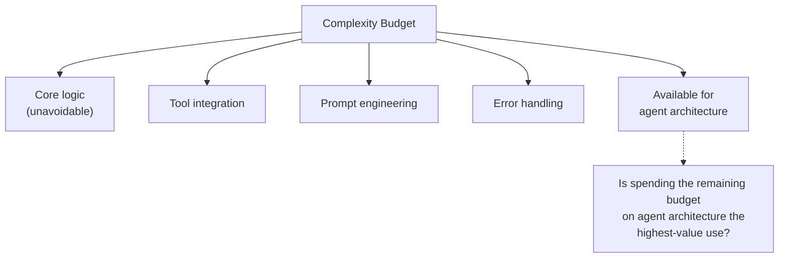
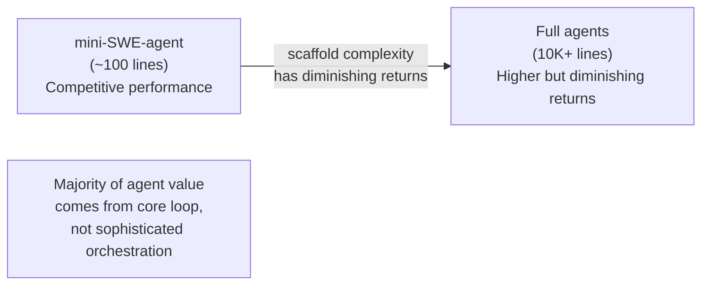
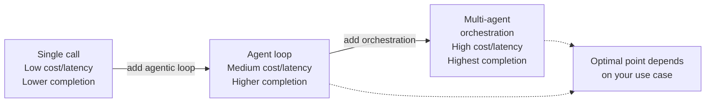
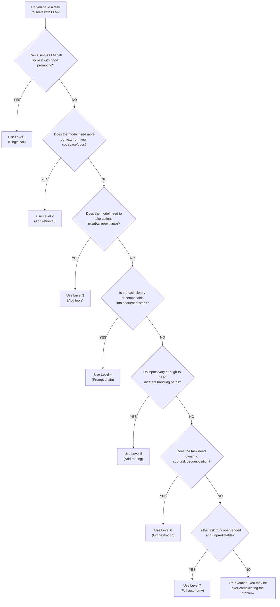

# The Simplicity Principle

> When NOT to use agents — Anthropic's case for starting simple

## Overview

This document is the counter-argument to agent hype. While the rest of this
research library analyzes sophisticated agent architectures — multi-agent
orchestration, evaluator-optimizer loops, dynamic routing — this file asks
the uncomfortable question: **do you actually need any of that?**

Anthropic's core advice from "Building Effective Agents" is unambiguous:

> "We recommend finding the simplest solution possible, and only increasing
> complexity when needed."

This isn't a footnote or caveat. It is the **opening position** of their
framework for building agentic systems. Before describing any pattern —
prompt chaining, routing, orchestrator-worker, evaluator-optimizer — they
argue that most problems don't need these patterns at all.

The simplicity principle is the most important design pattern in this library
because it is the one that prevents you from building the wrong thing. Every
other pattern has a cost: latency, tokens, debugging complexity, maintenance
burden. The simplicity principle asks: **is the benefit worth the cost?**

Among the 17 agents studied, the strongest evidence for this principle comes
from agents that achieve competitive results with minimal architecture:

- **mini-SWE-agent**: ~100 lines of bash achieves surprisingly good results
  on SWE-bench, demonstrating that scaffold complexity has diminishing returns
- **Pi Coding Agent**: "primitives over features" philosophy with only 4
  tools and an extension API instead of built-in features
- **Aider**: started as a simple pair-programming tool and added complexity
  incrementally, driven by benchmark data rather than architectural ambition

---

## Anthropic's Position

### The Blog's Core Argument

Anthropic's "Building Effective Agents" blog post is structured as a
progression from simple to complex, but the rhetorical emphasis is on the
simple end. The first substantive recommendation is:

> "We suggest that developers start by using LLM APIs directly: many patterns
> can be implemented in a few lines of code."

This is deliberately positioned before any discussion of frameworks, agents,
or agentic patterns. The message is clear: reach for simplicity first.

### Direct Quotes and Analysis

**Quote 1**: "Optimizing single LLM calls with retrieval and in-context
examples is usually enough for most applications."

Analysis: "Usually enough" is a strong claim. It implies that the majority
of applications being built with complex agent architectures could be
served by a well-optimized single LLM call. This challenges the dominant
narrative in the AI engineering community where "agent" has become the
default architecture.

**Quote 2**: "Agentic systems often trade latency and cost for better task
performance."

Analysis: Anthropic frames agency as a **trade-off**, not an upgrade. You
are not "improving" your system by making it agentic — you are trading one
set of properties (speed, cost, predictability) for another (task performance
on complex problems). This framing is crucial because it forces an explicit
cost-benefit analysis.

**Quote 3**: "Success in the LLM space isn't about building the most
sophisticated system. It's about building the right system for your needs."

Analysis: This is the closing argument. The word "sophisticated" is
deliberately positioned as a potential trap — something developers might
pursue for its own sake rather than because the problem demands it.

### Three Core Principles

Anthropic identifies three principles for building effective agents:

1. **Simplicity** — maintain simplicity in agent design
2. **Transparency** — show the agent's planning steps
3. **Careful ACI (Agent-Computer Interface) design** — tool design matters
   as much as agent architecture

Note that simplicity is listed first. This is not accidental.

### The Framework Warning

Anthropic explicitly warns against over-reliance on frameworks:

> "Incorrect assumptions about what's under the hood are a common source of
> customer error."

Frameworks abstract away implementation details, but those details matter
when things go wrong. A developer using a framework may not understand why
their agent is making 47 LLM calls for a simple task, because the framework's
orchestration logic is hidden behind a clean API.

This warning applies directly to agent frameworks like LangChain, CrewAI, and
AutoGen — tools that make it easy to build complex agent systems but can
obscure the cost of that complexity.

---

## The Cost of Complexity

Every layer of agentic behavior adds measurable cost. Understanding these
costs is essential for making informed architecture decisions.

### Latency Overhead

Each agentic step adds at minimum one LLM call's worth of latency. For a
system using GPT-4 class models, that's typically 2-10 seconds per step:

```
Simple approach (1 LLM call):
  User request -> LLM -> Response
  Latency: ~3 seconds

Prompt chain (3 steps):
  User request -> LLM -> LLM -> LLM -> Response
  Latency: ~9 seconds

Agent loop (5 iterations average):
  User request -> [LLM -> Tool -> LLM -> Tool -> ...] -> Response
  Latency: ~30-60 seconds

Multi-agent orchestration:
  User request -> Orchestrator -> [Agent1, Agent2, Agent3] -> Merge -> Response
  Latency: ~60-180 seconds
```

For coding agents specifically, tool execution (running tests, compiling)
adds additional latency on top of LLM calls. A typical coding agent task
might involve 5-15 LLM calls plus test execution, totaling 2-5 minutes for
what a simple code generation call handles in 5 seconds.

### Token/Cost Overhead

Multi-turn conversations consume tokens cumulatively. Each turn includes the
full conversation history plus new content:

```
Turn 1: 1,000 tokens (prompt) + 500 tokens (response)
Turn 2: 1,500 tokens (history) + 800 tokens (new prompt) + 600 tokens (response)
Turn 3: 2,900 tokens (history) + 500 tokens (new prompt) + 400 tokens (response)
...

By turn 10: Conversation history alone is ~8,000+ tokens
```

A single LLM call might cost $0.01-0.05. An agent loop solving the same
problem might cost $0.50-2.00 — a 10-100x multiplier.

### Error Compounding

Each step in an agentic system can fail. If each step has a 95% success rate:

```
1 step:  0.95   = 95.0% overall success
3 steps: 0.95^3 = 85.7% overall success
5 steps: 0.95^5 = 77.4% overall success
10 steps: 0.95^10 = 59.9% overall success
```

This is the **compounding error problem**. Even highly reliable individual
steps produce unreliable systems when chained. Agents mitigate this through
error recovery (retry, self-correction), but error recovery itself adds
complexity, latency, and cost.

### Debugging Difficulty

Debugging a single LLM call: look at the prompt and the response.

Debugging a multi-step agent: trace through 10-20 LLM calls, each with
different context, to find where the reasoning went wrong. This is
qualitatively harder:

```
Single call debugging:
  "Why did the LLM output X?" -> Read prompt -> Answer obvious

Multi-step debugging:
  "Why did the agent fail?"
    -> Which step failed?
    -> What was in the context at that step?
    -> Was the failure caused by a previous step's output?
    -> Would a different routing decision have avoided this?
    -> Is the evaluation criteria correct?
    -> ...
```

Agents like Claude Code and OpenHands invest significant engineering effort
in logging and traceability specifically because multi-step debugging is so
hard. This investment is itself a cost of complexity.

### Maintenance Burden

Complex systems require more maintenance:

- More components to update when models change
- More interaction patterns to test
- More failure modes to handle
- More documentation to maintain
- More onboarding time for new developers

A single-prompt solution might be maintained by anyone who can read a prompt.
A multi-agent orchestration system requires understanding of the routing
logic, agent specializations, handoff protocols, and failure recovery — a
much higher maintenance burden.

---

## When Simple Beats Complex

### Single-Turn Code Generation

If the task is well-defined and the model is capable, a single LLM call
often produces correct code:

```python
# Simple approach — often sufficient
response = call_llm("""
Write a Python function that takes a list of integers
and returns the two numbers that sum to a target value.
Include error handling for no-solution case.
""")

# vs. Agent approach — unnecessary overhead for this task
# Agent would: plan, implement, test, iterate...
# All useful steps, but overkill for a well-defined function.
```

For well-defined algorithmic problems, the simple approach is faster,
cheaper, and equally correct. The agent approach adds value only when the
task is ambiguous, complex, or requires interaction with external systems.

### Template-Based Tasks

Tasks that follow a predictable pattern don't benefit from autonomous
decision-making:

```python
# Generating API endpoints from a schema
for model in schema.models:
    code = call_llm(f"""
    Generate a REST API endpoint for the {model.name} model
    with fields: {model.fields}
    Follow this template: {template}
    """)
    write_file(f"routes/{model.name}.py", code)
```

This is a simple loop with a single LLM call per iteration. An agent
architecture would add routing, planning, and evaluation overhead for
a fundamentally repetitive task.

### Well-Defined Transformations

Code migration, format conversion, and refactoring tasks with clear rules:

```python
# Convert JavaScript to TypeScript
typescript_code = call_llm(f"""
Convert this JavaScript to TypeScript with proper type
annotations:

{javascript_code}
""")
```

The transformation is well-defined. The model either gets it right or it
doesn't. An evaluation loop might help catch edge cases, but for most
files, the single-call approach is sufficient and dramatically faster.

### Tasks with Clear Input-to-Output Mappings

When the expected output is precisely specifiable, a single call with clear
instructions often suffices:

- Generate a docstring for a function
- Convert between data formats (JSON to YAML, CSV to SQL)
- Write unit tests for existing code
- Extract structured data from unstructured text

---

## The Complexity Budget

### Every System Has a Budget

Think of system complexity like a budget. You have a finite amount of
complexity that your team can build, maintain, debug, and reason about.
Every architectural choice spends from this budget:



### Measuring Agent Value-Add vs Overhead

To decide whether an agentic approach is justified, measure:

```
Value-Add = (Task success rate with agent) - (Task success rate without)
Overhead  = Additional latency + Additional cost + Maintenance burden

ROI = Value-Add / Overhead
```

If a single LLM call achieves 90% success and an agent achieves 95%, but
the agent is 10x slower and 20x more expensive, the ROI may be negative
for most use cases.

### ROI Calculation

```
Simple approach:
  Success rate: 85%
  Latency: 3 seconds
  Cost per task: $0.02
  Monthly volume: 10,000 tasks
  Monthly cost: $200

Agent approach:
  Success rate: 95%
  Latency: 45 seconds
  Cost per task: $0.40
  Monthly volume: 10,000 tasks
  Monthly cost: $4,000

Improvement: 10% more tasks succeed (1,000 additional successes)
Additional cost: $3,800/month
Cost per additional success: $3.80

Question: Is each additional successful task worth $3.80?
```

### When the Overhead Exceeds the Benefit

Common scenarios where agent overhead isn't justified:

- **Internal tools with tolerant users** — if users can retry or fix minor
  issues themselves, 85% accuracy at 3 seconds beats 95% accuracy at 45
  seconds
- **High-volume, low-stakes tasks** — the cumulative cost of agent overhead
  on 10,000+ daily tasks is substantial
- **Latency-critical paths** — user-facing features where 45 seconds is
  unacceptable regardless of accuracy

---

## Evidence from the 17 Agents

### mini-SWE-agent: The 100-Line Existence Proof

mini-SWE-agent is perhaps the most important data point in this research
library. At approximately 100 lines of bash, it demonstrates that agent
scaffold complexity has **sharply diminishing returns**:



The gap between mini-SWE-agent and full agents is significant, but the gap
between mini-SWE-agent and doing nothing is much larger. The **majority of
agent value** comes from the core loop (read-think-edit-test), not from
sophisticated orchestration.

This suggests that the first 100 lines of an agent provide the most value
per line, and each additional line of scaffold code provides diminishing
marginal returns.

### Pi Coding Agent: Primitives Over Features

Pi Coding Agent explicitly embraces simplicity through its "primitives over
features" philosophy:

- Only 4 tools (compared to 20+ in some agents)
- Extension API instead of built-in features
- Philosophy: let users compose primitives rather than anticipating every
  possible workflow with pre-built features

This mirrors the Unix philosophy of small, composable tools. Rather than
building a complex agent that handles every case, Pi builds a simple agent
with extension points.

The anti-feature-creep stance is a direct application of Anthropic's
simplicity principle. Every built-in feature adds:
- Code to maintain
- Edge cases to handle
- Documentation to write
- Interactions to test

Pi's approach: provide the minimal set of primitives and let users extend
when they need more.

### Aider: Incremental Complexity

Aider provides the best example of **graduated complexity** among the 17
agents. Rather than designing a complex architecture upfront, Aider:

1. Started as a simple pair-programming tool (human types instructions, LLM
   edits code)
2. Added edit format optimization based on benchmark results
3. Added repository mapping for context management
4. Added test-driven iteration when benchmarks showed it helped
5. Added multi-model support when different models proved better at
   different tasks

Each addition was **justified by data**. Aider's approach to SWE-bench
benchmarking means that every feature must demonstrate measurable improvement
on standardized tasks before being incorporated.

This is the simplicity principle in action: start simple, add complexity
only when measured evidence shows it helps.

### When Complexity IS Justified

The simplicity principle doesn't mean "never build complex systems." Some
of the 17 agents have legitimate reasons for complexity:

**ForgeCode** — Multi-agent architecture with ZSH-native execution. The
complexity is justified by the target use case: enterprise-scale coding
tasks that genuinely require parallel agent coordination. A single agent
cannot effectively manage a large-scale refactoring across hundreds of files.

**Ante** — Self-organizing multi-agent system. The complexity targets tasks
where the decomposition itself is non-obvious and requires autonomous
discovery. Fixed pipelines can't handle this.

**Droid** — Enterprise multi-interface platform. The complexity addresses
enterprise requirements (audit trails, access control, multi-team
coordination) that simple agents cannot satisfy.

**OpenHands** — Event-driven architecture with CodeAct. The complexity
enables research into novel agent interaction patterns that simpler
architectures cannot express.

The pattern: complexity is justified when the **problem space** demands it,
not when the **technology** enables it.

---

## When Prompt Chaining Beats Autonomous Agents

### Predictable Task Sequences

When the sequence of steps is known in advance, a prompt chain (fixed
pipeline) outperforms an autonomous agent:

```python
# Prompt chain — predictable, debuggable, efficient
def generate_feature(spec: str) -> str:
    # Step 1: Design the API
    api_design = call_llm(f"Design a REST API for: {spec}")

    # Step 2: Generate implementation
    code = call_llm(f"Implement this API design: {api_design}")

    # Step 3: Generate tests
    tests = call_llm(f"Write tests for this implementation: {code}")

    return code, tests
```

The autonomous alternative would take variable paths, making it harder
to predict duration, cost, and behavior across runs.

### When You Need Consistency and Reliability

Prompt chains produce consistent behavior because they follow a fixed path.
Autonomous agents may take different paths for similar inputs, making them
harder to test and debug:

```
Prompt chain behavior across 100 runs:
  Always: Step1 -> Step2 -> Step3 -> Output
  Latency variance: low (3 LLM calls + tool execution)
  Cost variance: low (predictable token usage)

Autonomous agent behavior across 100 runs:
  Sometimes: Plan -> Implement -> Test -> Done (4 steps)
  Sometimes: Plan -> Implement -> Test -> Fix -> Test -> Done (6 steps)
  Sometimes: Explore -> Plan -> Implement -> Test -> Fix -> Fix -> Test (8 steps)
  Latency variance: high (4-15 LLM calls + variable tool execution)
  Cost variance: high (unpredictable token usage)
```

### Junie CLI vs Claude Code

This contrast is visible in the 17 agents:

**Junie CLI** uses a fixed pipeline: understand-plan-implement-verify-iterate.
Every task follows this sequence. The behavior is predictable and debuggable.

**Claude Code** uses a dynamic single-loop agent that decides at each step
what to do next. It might explore the codebase, spawn sub-agents, run tests,
or edit code — in any order, for any number of iterations.

For straightforward coding tasks ("add a function that does X"), Junie's
fixed pipeline is more efficient. For open-ended tasks ("investigate why
the tests are flaky and fix the root cause"), Claude Code's flexibility
is necessary.

The choice depends on the **task distribution** you expect to serve.

### Sage Agent's Structured Pipeline

Sage Agent takes the pipeline approach further with a 5-agent pipeline where
each agent has a specific role. This is a prompt chain at the architectural
level — the sequence of agents is fixed, even though each agent may have
some internal autonomy.

This hybrid approach (fixed orchestration with flexible sub-agents) captures
some benefits of both approaches: predictable overall behavior with adaptive
individual steps.

---

## The Framework Trap

### Anthropic's Warning

Anthropic explicitly cautions against framework adoption without understanding:

> "Incorrect assumptions about what's under the hood are a common source
> of customer error."

Frameworks make it easy to build complex agent systems. LangChain, CrewAI,
and AutoGen let you define multi-agent workflows in a few lines of code. But
this ease of construction masks the underlying complexity:

- How many LLM calls does each "step" make?
- What's in the context window at each point?
- How does error handling work?
- What's the token budget for a typical task?

When things go wrong — and with agents, things go wrong regularly — debugging
through a framework's abstraction layers is significantly harder than debugging
a few direct API calls.

### "Start by using LLM APIs directly"

Anthropic's recommendation to use APIs directly is practical advice:

```python
# Framework approach (what's happening under the hood?)
# agent = SomeFramework.Agent(model, tools, pipeline)
# result = agent.run("Fix the login bug")
# How many LLM calls? What prompts? What context management?
# The developer often doesn't know.

# Direct API approach (transparent)
import anthropic

client = anthropic.Client()

# Step 1: Understand the bug
analysis = client.messages.create(
    model="claude-sonnet-4-20250514",
    messages=[{"role": "user", "content": f"Analyze this bug: ..."}]
)

# Step 2: Generate fix
fix = client.messages.create(
    model="claude-sonnet-4-20250514",
    messages=[{"role": "user", "content": f"Fix based on analysis: ..."}]
)
# Every call is visible. Prompts are explicit. Cost is predictable.
```

### The 100-Line Agent Challenge

Inspired by mini-SWE-agent, a useful exercise for any agent project:

**Can you build a useful version of your agent in 100 lines?**

If yes: your core value is in the prompt engineering and tool design, not
in the scaffold. Build on the 100-line version incrementally.

If no: your agent may be solving a genuinely complex orchestration problem
that justifies the complexity. Proceed, but validate that each component
earns its place.

This challenge forces clarity about where value actually resides. Often,
developers discover that 80% of their agent's value comes from 20% of
its code — and the rest is handling edge cases that may not matter in
practice.

---

## Measuring Agent Value-Add

### A/B Testing Simple vs Complex

The gold standard for validating agent complexity:

```
Experiment Design:
  Control: Single LLM call with optimized prompt
  Treatment A: Prompt chain (3 steps)
  Treatment B: Agent loop (up to 5 iterations)
  Treatment C: Multi-agent system

  Metrics:
    - Task completion rate
    - Output quality score (human-rated)
    - Latency (p50, p95, p99)
    - Cost per task
    - User satisfaction

  Decision: Which treatment maximizes
    (quality x completion rate) / (latency x cost)?
```

### Benchmark-Driven Development

Aider's approach is the exemplar: every architectural decision is validated
against standardized benchmarks (SWE-bench, HumanEval, etc.).

```
Feature proposal: Add repository-wide context retrieval
Hypothesis: Better context -> higher task completion rate

Benchmark results:
  Without feature: 42% on SWE-bench
  With feature: 48% on SWE-bench
  Cost increase: 30% more tokens per task
  Latency increase: 15% more time per task

Decision: +6% completion for +30% cost = positive ROI -> ship it

Feature proposal: Add multi-agent code review
Benchmark results:
  Without feature: 48% on SWE-bench
  With feature: 49% on SWE-bench
  Cost increase: 200% more tokens per task
  Latency increase: 150% more time per task

Decision: +1% completion for +200% cost = negative ROI -> reject
```

This data-driven approach prevents the common failure mode of adding
complexity because it "should" help without evidence that it does.

### Task Completion Rate vs Latency vs Cost

The three key metrics form a trade-off surface:



The optimal point depends on your use case. For a developer tool used
interactively, latency matters more than completion rate. For a batch
processing system, completion rate matters more than latency.

---

## The Graduated Complexity Approach

Rather than choosing between "simple" and "complex," Anthropic recommends a
graduated approach. Start at level 1 and move up only when evidence shows
the current level is insufficient:

### Level 1: Optimized Single LLM Call

```python
# Start here. Seriously.
response = call_llm(
    system="You are an expert Python developer.",
    prompt=f"""
    Task: {task}
    Context: {relevant_code}
    Requirements: {requirements}

    Write the implementation. Include error handling and docstrings.
    """
)
```

Many tasks are fully solved at this level. If your success rate is
acceptable, stop here.

### Level 2: Add Retrieval

```python
# Add retrieval when the model needs more context
relevant_files = search_codebase(task)
relevant_docs = search_documentation(task)

response = call_llm(
    system="You are an expert Python developer.",
    prompt=f"""
    Task: {task}
    Relevant code: {relevant_files}
    Relevant docs: {relevant_docs}

    Write the implementation.
    """
)
```

Retrieval-augmented generation (RAG) addresses the context problem without
adding agentic complexity.

### Level 3: Add Tools

```python
# Add tools when the model needs to take actions
tools = [
    {"name": "read_file", "fn": read_file},
    {"name": "write_file", "fn": write_file},
    {"name": "run_tests", "fn": run_tests},
]

response = call_llm_with_tools(
    prompt=f"Implement: {task}",
    tools=tools
)
```

Tool use adds a layer of autonomy — the model decides which tools to call.
But the overall interaction is still a single LLM call (with tool use).

### Level 4: Add Prompt Chaining

```python
# Add chaining when the task has distinct sequential phases
design = call_llm(f"Design the approach for: {task}")
code = call_llm(f"Implement this design: {design}")
tests = call_llm(f"Write tests for: {code}")
```

Prompt chaining decomposes the task but keeps the flow predictable.

### Level 5: Add Routing

```python
# Add routing when inputs are diverse
task_type = classify(task)  # "bug_fix", "new_feature", "refactor"

if task_type == "bug_fix":
    result = bug_fix_chain(task)
elif task_type == "new_feature":
    result = feature_chain(task)
else:
    result = refactor_chain(task)
```

Routing optimizes for different task types without full autonomy.

### Level 6: Add Orchestration

```python
# Add orchestration only for genuinely multi-part tasks
subtasks = decompose(task)
results = []
for subtask in subtasks:
    result = call_agent(subtask)
    results.append(result)
final = synthesize(results)
```

Orchestration adds dynamic decomposition — the system decides how to
break down the task. This is significantly more complex to debug.

### Level 7: Add Full Autonomy

```python
# Add autonomy only for open-ended, unpredictable tasks
agent = AutonomousAgent(
    tools=all_tools,
    max_iterations=20,
    evaluation_criteria=criteria
)
result = agent.run(task)
```

Full autonomy is the most powerful and the most expensive/unpredictable.
Reserve it for tasks where you genuinely cannot predict the sequence of
steps in advance.

---

## Decision Flowchart

Use this flowchart to determine the appropriate level of complexity:



---

## Code Examples

### Comparing Simple vs Complex Approaches

**Task**: Generate a Python function from a docstring.

**Simple approach (Level 1)**:

```python
def generate_from_docstring(docstring: str) -> str:
    """Generate a function from its docstring. Single LLM call."""
    response = call_llm(f"""
    Write a Python function that matches this docstring:

    {docstring}

    Return only the function code.
    """)
    return response
```

Time: ~3 seconds. Cost: ~$0.02. Success rate: ~85%.

**Medium approach (Level 3 — with tools)**:

```python
def generate_with_validation(docstring: str) -> str:
    """Generate and validate with compilation check."""
    code = call_llm(f"Write a function for: {docstring}")

    # Programmatic validation
    try:
        compile(code, "<string>", "exec")
        return code
    except SyntaxError as e:
        # One retry with error context
        code = call_llm(f"""
        Fix this syntax error in the code.
        Error: {e}
        """)
        return code
```

Time: ~5 seconds. Cost: ~$0.04. Success rate: ~92%.

**Complex approach (Level 7 — full agent)**:

```python
def generate_with_agent(docstring: str) -> str:
    """Full agent with testing and iteration."""
    agent = CodingAgent(
        tools=["write_file", "run_tests", "read_file", "lint"],
        max_iterations=10
    )
    result = agent.run(f"""
    1. Write a function matching this docstring: {docstring}
    2. Write comprehensive tests for it
    3. Run the tests and fix any failures
    4. Run the linter and fix any issues
    5. Return the final implementation
    """)
    return result
```

Time: ~60 seconds. Cost: ~$0.50. Success rate: ~95%.

**Analysis**: The jump from simple to medium (85% to 92%) costs very little.
The jump from medium to complex (92% to 95%) costs 10x more. Is the extra
3% worth it? For most use cases, no.

### When the Complex Approach IS Worth It

**Task**: Fix a bug that spans multiple files in a large codebase.

```python
# Simple approach — fails because it lacks context
code = call_llm(f"Fix this bug: {bug_report}")
# Model doesn't know the codebase structure -> likely wrong

# Medium approach — still insufficient
relevant_files = search_codebase(bug_report)
code = call_llm(f"Fix the bug.\nContext: {relevant_files}")
# May identify the right file but can't navigate dependencies

# Complex approach — necessary for this task
agent = CodingAgent(tools=all_tools, max_iterations=15)
result = agent.run(f"""
  Investigate and fix this bug: {bug_report}
  The codebase is in /src. Use tools to explore,
  understand the code, identify the root cause,
  implement a fix, and verify with tests.
""")
# Agent can explore, trace dependencies, test hypotheses
```

For codebase-scale bugs, the agent approach isn't optional — it's necessary.
The simple approach physically cannot access the information needed.

---

## Key Takeaways

1. **Start simple, add complexity only with evidence** — Anthropic's core
   advice is validated by the 17 agents studied. mini-SWE-agent and Pi
   Coding Agent demonstrate that simplicity is competitive.

2. **The first 100 lines provide the most value** — mini-SWE-agent shows
   that the basic agent loop (read-think-edit-test) captures the majority
   of agent value. Everything beyond that has diminishing returns.

3. **Measure before you complicate** — Aider's benchmark-driven development
   is the gold standard. Never add complexity without evidence that it
   measurably improves outcomes.

4. **Frameworks can obscure costs** — Anthropic's warning about incorrect
   assumptions under the hood is practical, not theoretical. Understand
   what your agent is doing before trusting a framework to do it.

5. **The graduated approach works** — moving from Level 1 to Level 7
   incrementally, with evidence at each step, prevents over-engineering
   while ensuring the system grows to meet genuine needs.

6. **Complexity is justified for complex problems** — the simplicity
   principle is not anti-complexity. ForgeCode, Ante, and OpenHands are
   complex because their target problems are complex. The principle asks:
   does the problem justify the complexity?

7. **"Success in the LLM space isn't about building the most sophisticated
   system. It's about building the right system for your needs."** —
   Anthropic's closing argument is the simplest and most important
   takeaway. Build what you need, not what's technically impressive.

8. **The best agent architecture is the simplest one that solves your
   problem** — if a single LLM call works, use it. If a prompt chain works,
   use it. Reach for full agent autonomy only when simpler approaches have
   demonstrably failed.
