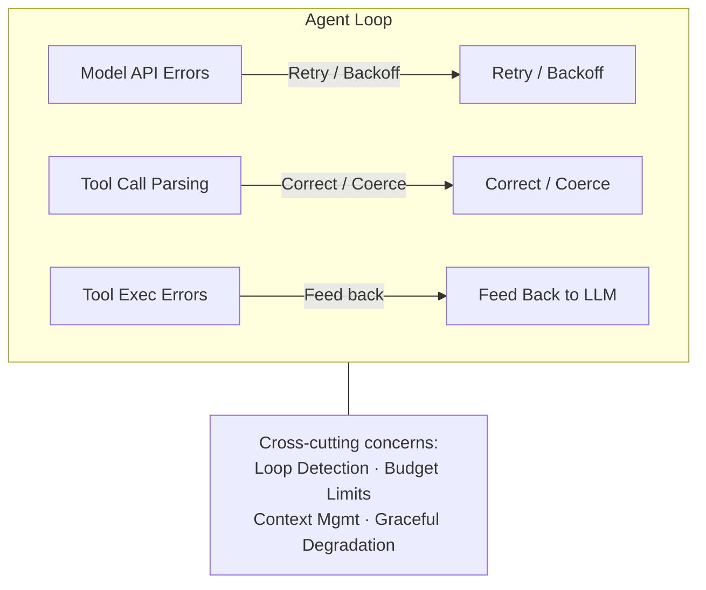
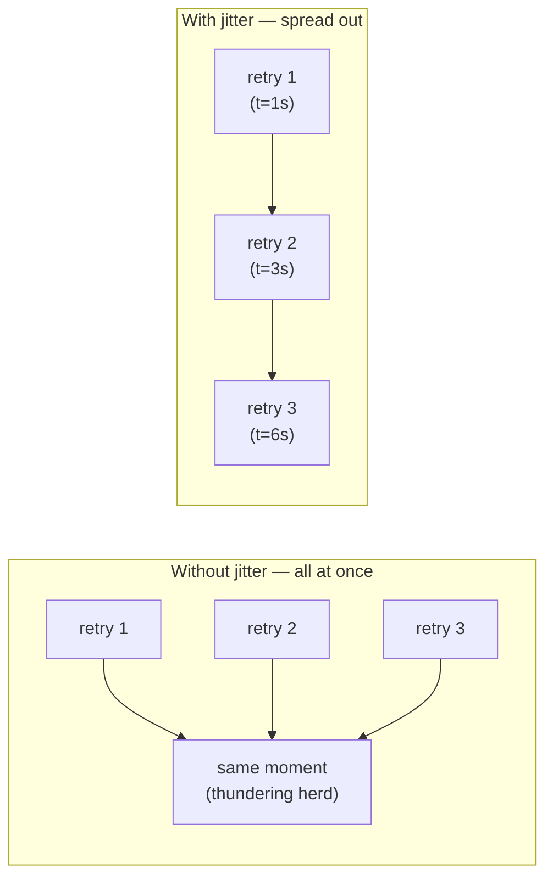
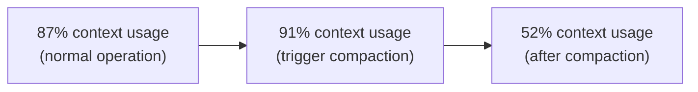
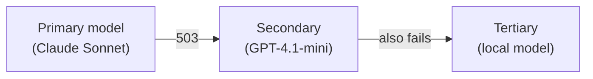
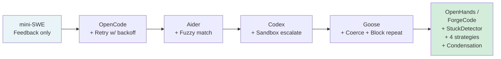

# Error Recovery in Agentic Loops

## Overview

Things **will** go wrong in agentic loops. Tools fail, APIs timeout, models hallucinate,
sandboxes crash, and context windows overflow. The difference between a toy demo and a
production-grade agent is almost entirely defined by how it handles these failures.

Error recovery strategies range from the trivially simple — feed the error message back
to the LLM and hope it self-corrects — to sophisticated multi-layered systems with
retry policies, circuit breakers, loop detectors, and graceful degradation paths.

A robust agent must handle errors at every layer of the stack:



The key insight: **most errors are recoverable if the agent has the right strategy**.
Studies on agentic coding benchmarks show that agents with proper error recovery solve
15–30% more tasks than those without, even when using the same underlying model.

---

## The Error Taxonomy

Understanding the types of errors an agent encounters is essential before designing
recovery strategies. Errors fall into four broad categories, each requiring different
handling approaches.

### 1. Tool Execution Failures

These are the most common errors by far — the bread and butter of error recovery.
They occur when a tool is invoked correctly but the underlying operation fails.

**Common examples:**
- **File system errors**: `FileNotFoundError`, `PermissionError`, `IsADirectoryError`
- **Command failures**: `command not found`, non-zero exit codes, segfaults
- **Network errors**: `ConnectionRefusedError`, `TimeoutError`, DNS resolution failures
- **Resource exhaustion**: `MemoryError`, disk full, too many open files
- **Environment issues**: missing dependencies, wrong Python version, missing env vars

**Characteristics:**
- Error messages are usually descriptive and actionable
- The LLM can often self-correct by interpreting the error text
- Some are transient (network blip) and some are persistent (wrong path)
- They compose: one failure can cascade into others

```python
# Example: A tool execution failure in the agentic loop
try:
    result = subprocess.run(
        ["python", "test_suite.py"],
        capture_output=True, timeout=120
    )
    if result.returncode != 0:
        return ToolResult(
            is_error=True,
            error_message=result.stderr.decode("utf-8")[-2000:]  # Truncate
        )
except subprocess.TimeoutExpired:
    return ToolResult(is_error=True, error_message="Command timed out after 120s")
except FileNotFoundError:
    return ToolResult(is_error=True, error_message="python: command not found")
```

### 2. Model API Errors

These happen between the agent orchestrator and the LLM provider. They are never
the model's "fault" — they are infrastructure issues.

| HTTP Code | Meaning | Recovery Strategy |
|-----------|---------|-------------------|
| 429 | Rate limited | Exponential backoff, respect `Retry-After` |
| 500 | Internal server error | Retry with backoff |
| 502 | Bad gateway | Retry with backoff |
| 503 | Service unavailable | Retry with longer backoff |
| 408 | Request timeout | Retry, possibly with shorter prompt |
| 400 | Bad request (context overflow) | Truncate/condense history, retry |

**Key distinction**: these errors are invisible to the LLM. The agent orchestrator must
handle them entirely on its own — the model never sees a 429 error because the 429
prevents the model from being called at all.

### 3. Malformed Tool Calls

The model generates a tool call, but the arguments are invalid. This is a surprisingly
common failure mode, especially with smaller or less capable models.

**Common patterns:**
```json
// Missing required field
{"tool": "file_edit", "args": {"new_content": "..."}}
// ↑ Missing "path" parameter

// Wrong type
{"tool": "bash", "args": {"command": 42}}
// ↑ Number where string expected

// Invalid enum value  
{"tool": "file_edit", "args": {"mode": "repplace"}}
// ↑ Typo in enum value

// Completely hallucinated tool
{"tool": "deploy_to_production", "args": {...}}
// ↑ Tool doesn't exist

// Malformed JSON
{"tool": "bash", "args": {"command": "echo 'hello}
// ↑ Unterminated string
```

**Why this happens:**
- The model's internal representation of tool schemas is lossy
- Long conversations cause the model to "forget" exact parameter names
- Models sometimes confuse parameters across different tools
- JSON generation is imperfect, especially for nested structures

### 4. Logic Errors (Semantic Failures)

The most insidious category. The tool executes successfully, returns no error, but
the agent's behavior is wrong at a higher level.

**Examples:**
- **Infinite loops**: agent edits a file, tests fail, agent reverts, edits again identically
- **Circular fixes**: agent fixes bug A by introducing bug B, then fixes B by reintroducing A
- **Wrong target**: agent edits `src/utils.py` when it should edit `src/util.py`
- **False success**: tests pass but the solution hardcodes expected outputs
- **Scope creep**: agent starts "fixing" unrelated code, introducing new bugs

These require fundamentally different detection strategies because no single step
produces an error — the pattern itself is the problem.

---

## Strategy 1: Feed Error Back to LLM (Universal)

The simplest and most universally implemented strategy. When a tool execution fails,
the error message is sent back to the model as the tool result. The model sees the
error and (usually) self-corrects.

### Core Implementation

```python
def execute_and_handle(tool_call, messages):
    """Execute a tool call and handle errors by feeding them back."""
    try:
        result = dispatch_tool(tool_call.name, tool_call.arguments)
        return {
            "role": "tool",
            "tool_call_id": tool_call.id,
            "content": result.output
        }
    except ToolExecutionError as e:
        return {
            "role": "tool",
            "tool_call_id": tool_call.id,
            "content": f"Error: {e.message}",
            "is_error": True  # Some APIs support this flag
        }
    # The message is appended to history; the LLM sees it next turn
```

### How Real Agents Implement This

**OpenCode** — Uses `ToolResult.IsError = true` in the tool response. The error content
is sent back verbatim to the model, which then reasons about what went wrong:

```go
// OpenCode's tool result handling (simplified)
type ToolResult struct {
    Content string
    IsError bool
}

if err != nil {
    return ToolResult{
        Content: fmt.Sprintf("Error executing %s: %s", toolName, err.Error()),
        IsError: true,
    }
}
```

**mini-SWE-agent** — The simplest implementation. Error output from command execution
goes directly into the observation message, indistinguishable from normal output
except by content:

```python
# mini-SWE-agent's approach
observation = run_command(action)  # Includes stderr
messages.append({"role": "user", "content": f"OBSERVATION:\n{observation}"})
# The LLM processes the error naturally as part of the conversation
```

**Goose** — Errors are captured in structured `ToolResponse` messages. Goose adds
an `enhanced_model_error()` wrapper that enriches raw errors with suggestions:

```rust
// Goose enriches error messages before sending to LLM
fn enhanced_model_error(error: &ProviderError) -> String {
    match error {
        ProviderError::ContextLengthExceeded(_) =>
            "Context length exceeded. Consider summarizing the conversation.",
        ProviderError::RateLimitExceeded(_) =>
            "Rate limit hit. The system will retry automatically.",
        _ => &error.to_string(),
    }
}
```

**OpenHands** — Uses a typed `ErrorObservation` that flows through the event stream.
This enables structured handling downstream:

```python
# OpenHands event stream approach
class ErrorObservation(Observation):
    content: str          # The error message
    tool_call_id: str     # Links back to the action that caused it

# Added to the event stream just like any other observation
event_stream.add(ErrorObservation(
    content=f"Command failed with exit code {exit_code}: {stderr}",
    tool_call_id=action.tool_call_id
))
```

### Why This Works

Modern LLMs are remarkably good at interpreting error messages. They have been trained
on millions of Stack Overflow posts, GitHub issues, and documentation pages that contain
error messages and their solutions. The error-to-fix mapping is deeply embedded in the
model's weights.

**Common self-correction patterns:**
```
Error: FileNotFoundError: /src/foo/bar.py
→ LLM: "Let me search for the correct path..."
→ Action: find command or glob search

Error: ModuleNotFoundError: No module named 'requests'
→ LLM: "I need to install the dependency..."
→ Action: pip install requests

Error: SyntaxError: unexpected indent (line 42)
→ LLM: "I made an indentation error, let me fix line 42..."
→ Action: re-edit with correct indentation

Error: AssertionError: expected 5, got 3
→ LLM: "My logic is wrong, the calculation should..."
→ Action: fix the algorithm
```

### Limitations

- **Ambiguous errors**: `Segmentation fault` gives the LLM almost nothing to work with
- **Cascading failures**: fixing one error reveals another, and another, and another
- **Persistent errors**: if the same error recurs, feed-back alone creates a loop
- **Missing context**: error says "config invalid" but doesn't say which field or why
- **Model confusion**: after many errors, the LLM may lose track of the original goal

---

## Strategy 2: Retry with Backoff (API Errors)

For transient model API errors, retry with exponential backoff is the standard approach.
This handles the orchestrator-to-model communication layer.

### Exponential Backoff with Jitter

```python
import random
import time

def call_model_with_retry(messages, max_retries=8, base_delay=1.0, max_delay=60.0):
    """Call the model API with exponential backoff and jitter."""
    for attempt in range(max_retries):
        try:
            response = model.complete(messages)
            return response
        except RateLimitError as e:
            if attempt == max_retries - 1:
                raise
            # Respect Retry-After header if present
            retry_after = e.headers.get("Retry-After")
            if retry_after:
                wait = float(retry_after)
            else:
                wait = min(base_delay * (2 ** attempt), max_delay)
                wait += random.uniform(0, wait * 0.1)  # Add jitter
            time.sleep(wait)
        except ServerError:
            if attempt == max_retries - 1:
                raise
            wait = min(base_delay * (2 ** attempt), max_delay)
            time.sleep(wait)
        except ContextWindowExceededError:
            # Don't retry — must truncate/condense first
            raise
```

**Why jitter matters**: Without jitter, multiple clients that hit a rate limit
simultaneously will all retry at the exact same time, causing a "thundering herd"
that triggers another rate limit. Adding randomness spreads the retries out.



### Implementation Examples Across Agents

**OpenCode's provider layer:**
```go
// OpenCode configures retries at the provider level
config := ProviderConfig{
    MaxRetries:    8,          // Up to 8 retry attempts
    RetryDelay:    time.Second, // Starting delay
    RetryStrategy: "exponential_backoff",
}
```

**OpenHands' retry logic:**
```python
# OpenHands implements per-error-type retry with backoff
@retry(
    stop=stop_after_attempt(8),
    wait=wait_exponential(multiplier=1, min=4, max=60),
    retry=retry_if_exception_type((RateLimitError, ServerError)),
    before_sleep=before_sleep_log(logger, logging.WARNING)
)
async def call_model(self, messages):
    return await self.provider.complete(messages)
```

**Aider's exponential backoff:**
```python
# Aider uses litellm's built-in retry with exponential backoff
response = litellm.completion(
    model=self.model,
    messages=messages,
    num_retries=5,           # LiteLLM handles the backoff internally
    request_timeout=600,     # 10-minute timeout per request
)
```

### Rate Limit Handling — Advanced Patterns

Simple retry is not always enough. Production agents need:

```python
class RateLimitManager:
    """Track and respect multiple rate limit dimensions."""

    def __init__(self):
        self.requests_per_minute = TokenBucket(rate=60, capacity=60)
        self.tokens_per_minute = TokenBucket(rate=90_000, capacity=90_000)
        self.requests_per_day = TokenBucket(rate=10_000, capacity=10_000)

    def wait_if_needed(self, estimated_tokens):
        """Block until all rate limits allow the request."""
        self.requests_per_minute.acquire(1)
        self.tokens_per_minute.acquire(estimated_tokens)
        self.requests_per_day.acquire(1)

    def handle_429(self, retry_after_header):
        """Adjust internal state when we get rate-limited anyway."""
        # The server is the authority — respect its Retry-After
        self.requests_per_minute.drain()
        time.sleep(float(retry_after_header))
```

**Model fallback on rate limit:**
Some agents fall back to a cheaper/less-loaded model when the primary is rate-limited:
```python
try:
    response = call_model("claude-sonnet-4-20250514", messages)
except RateLimitError:
    logger.warning("Primary model rate-limited, falling back")
    response = call_model("gpt-4.1-mini", messages)  # Cheaper fallback
```

---

## Strategy 3: Malformed Tool Call Correction

When the model generates invalid tool calls, agents can either reject them (feeding
the error back) or proactively correct them before execution.

### ForgeCode's Tool Correction Layer

ForgeCode implements a dedicated correction layer that intercepts tool calls **before**
they are dispatched to the actual tool. This is cheaper and faster than asking the
model to regenerate.

```python
class ToolCallCorrector:
    """Intercept and correct malformed tool calls before execution."""

    def correct(self, tool_name: str, arguments: dict, schema: dict) -> dict:
        corrected = {}
        for param, param_schema in schema["properties"].items():
            value = arguments.get(param)
            expected_type = param_schema.get("type")

            if value is None and param in schema.get("required", []):
                # Missing required field — try to infer from context
                if param == "path" and "file_path" in arguments:
                    corrected[param] = arguments["file_path"]  # Common alias
                    self.log_correction(param, "inferred from alias")
                    continue
                raise CorrectionFailed(f"Missing required: {param}")

            if expected_type == "number" and isinstance(value, str):
                try:
                    corrected[param] = float(value)
                    self.log_correction(param, f"string→number: '{value}'→{corrected[param]}")
                    continue
                except ValueError:
                    raise CorrectionFailed(f"Cannot coerce '{value}' to number")

            if expected_type == "string" and param_schema.get("enum"):
                valid = param_schema["enum"]
                if value not in valid:
                    match = fuzzy_match(value, valid, threshold=0.8)
                    if match:
                        corrected[param] = match
                        self.log_correction(param, f"fuzzy: '{value}'→'{match}'")
                        continue
                    raise CorrectionFailed(f"'{value}' not in {valid}")

            corrected[param] = value
        return corrected
```

**Key insight**: fixing a tool call at the correction layer costs ~0 tokens and ~0 ms.
Feeding the error back to the model costs 1000+ tokens (the full re-generation) and
1–5 seconds of latency. Correction-first is strictly better when possible.

### Goose's Argument Coercion

Goose implements type coercion at the tool dispatch layer in Rust:

```rust
/// Coerce tool arguments to match the expected schema types.
/// Handles common LLM mistakes like sending "42" (string) when
/// the schema expects 42 (number).
fn coerce_arguments(args: &Value, schema: &Schema) -> Result<Value> {
    match (args, &schema.type_) {
        // String "42" → Number 42
        (Value::String(s), SchemaType::Number) => {
            s.parse::<f64>()
                .map(Value::Number)
                .map_err(|_| CoercionError::InvalidNumber(s.clone()))
        }
        // Number 42 → String "42"
        (Value::Number(n), SchemaType::String) => {
            Ok(Value::String(n.to_string()))
        }
        // String "true" → Boolean true
        (Value::String(s), SchemaType::Boolean) => {
            match s.to_lowercase().as_str() {
                "true" | "1" | "yes" => Ok(Value::Bool(true)),
                "false" | "0" | "no" => Ok(Value::Bool(false)),
                _ => Err(CoercionError::InvalidBool(s.clone())),
            }
        }
        // Already correct type
        _ => Ok(args.clone()),
    }
}
```

### Error Message as Structured Correction

When correction fails and the error must go back to the model, a well-structured
error message dramatically improves the model's ability to self-correct:

```python
# Bad: vague error
"Error: invalid arguments"

# Good: structured error with schema information
f"""Error: Invalid arguments for tool '{tool_name}'.

Parameter '{param_name}':
  Expected: {expected_type} (one of: {enum_values})
  Received: {actual_value} ({type(actual_value).__name__})

Full schema:
{json.dumps(schema, indent=2)}

Please retry with corrected arguments."""
```

The difference in correction success rate between vague and structured errors is
significant — structured errors lead to successful self-correction ~90% of the time
vs ~50% for vague errors.

---

## Strategy 4: Infinite Loop Detection

Loop detection is critical for unattended agent operation. Without it, an agent can
burn through an entire API budget repeating the same failed action indefinitely.

### OpenHands StuckDetector — Four Detection Strategies

OpenHands implements the most sophisticated loop detection system across the agents
studied. It uses four independent heuristics, any of which can trigger recovery:

```python
class StuckDetector:
    """Detect when an agent is stuck in a loop."""

    def __init__(self, max_repeats=3, max_errors=5, max_empty=3):
        self.max_repeats = max_repeats
        self.max_errors = max_errors
        self.max_empty = max_empty

    def check(self, history: list[Event]) -> StuckReason | None:
        # Strategy 1: Identical repetition
        # Same action repeated N times in a row
        if self._check_identical_actions(history, self.max_repeats):
            return StuckReason.IDENTICAL_REPETITION

        # Strategy 2: Alternating pattern (ping-pong)
        # Agent alternates between action A and action B
        if self._check_alternating_pattern(history):
            return StuckReason.ALTERNATING_ACTIONS

        # Strategy 3: Consecutive errors
        # K consecutive ErrorObservations with no success
        if self._check_consecutive_errors(history, self.max_errors):
            return StuckReason.ERROR_LOOP

        # Strategy 4: Empty responses
        # K consecutive empty/no-op actions
        if self._check_empty_actions(history, self.max_empty):
            return StuckReason.EMPTY_RESPONSES

        return None  # Not stuck

    def _check_identical_actions(self, history, threshold):
        """Check if the last N actions are identical."""
        recent = [e for e in history[-threshold:] if isinstance(e, Action)]
        if len(recent) < threshold:
            return False
        return all(a.equivalent_to(recent[0]) for a in recent[1:])

    def _check_alternating_pattern(self, history):
        """Check for A-B-A-B ping-pong pattern."""
        actions = [e for e in history[-6:] if isinstance(e, Action)]
        if len(actions) < 4:
            return False
        # Check: a[0]==a[2]==a[4] and a[1]==a[3]==a[5]
        evens_same = all(a.equivalent_to(actions[0]) for a in actions[::2])
        odds_same = all(a.equivalent_to(actions[1]) for a in actions[1::2])
        return evens_same and odds_same
```

### Recovery Actions

When a loop is detected, the system must break the pattern. Different agents use
different recovery strategies:

**1. Inject a recovery message:**
```python
def inject_recovery(stuck_reason: StuckReason) -> Action:
    """Create a message that forces the agent out of its loop."""
    prompts = {
        StuckReason.IDENTICAL_REPETITION:
            "You have repeated the same action 3 times. It is not working. "
            "Try a COMPLETELY DIFFERENT approach to solve the problem.",
        StuckReason.ALTERNATING_ACTIONS:
            "You are alternating between two actions without progress. "
            "Step back and reconsider your approach from scratch.",
        StuckReason.ERROR_LOOP:
            "You have encountered multiple consecutive errors. "
            "The current approach is failing. Consider: "
            "1) Is the environment set up correctly? "
            "2) Are you using the right tool? "
            "3) Should you ask for help?",
        StuckReason.EMPTY_RESPONSES:
            "You have produced multiple empty responses. "
            "Please take a concrete action toward solving the problem.",
    }
    return LoopRecoveryAction(content=prompts[stuck_reason])
```

**2. Force history condensation:**
```python
# Break the loop by compressing history — the agent "forgets" the loop
if stuck_reason in (StuckReason.IDENTICAL_REPETITION, StuckReason.ALTERNATING_ACTIONS):
    condensed = condense_history(history)
    # Agent now sees a summary instead of the repetitive actions
    # This often breaks the pattern because the trigger is gone
```

**3. Hard termination:**
```python
# Last resort — stop the agent entirely
if recovery_attempts >= 3:
    agent.set_state(AgentState.STOPPED)
    agent.final_message = (
        "Agent terminated: stuck in an unrecoverable loop after "
        f"{recovery_attempts} recovery attempts."
    )
```

### Goose's RepetitionInspector

Goose takes a different approach — it monitors tool usage patterns and can **block**
specific tools that are being called repeatedly without progress:

```rust
struct RepetitionInspector {
    tool_call_counts: HashMap<String, usize>,
    progress_marker: usize,  // Event stream position at last "progress"
}

impl RepetitionInspector {
    fn inspect(&mut self, tool_name: &str) -> Verdict {
        let count = self.tool_call_counts
            .entry(tool_name.to_string())
            .or_insert(0);
        *count += 1;

        if *count > self.threshold && !self.has_progress_since_last_call() {
            Verdict::Block {
                reason: format!(
                    "Tool '{}' called {} times without progress. Try a different approach.",
                    tool_name, count
                ),
            }
        } else {
            Verdict::Allow
        }
    }
}
```

### Prevention Patterns

Beyond detection, well-designed agents prevent loops proactively:

```python
class LoopPrevention:
    """Prevent common loop patterns before they start."""

    def __init__(self, window_size=5):
        self.recent_actions = deque(maxlen=window_size)
        self.consecutive_repeats = 0
        self.action_fingerprints = set()

    def check_and_record(self, action) -> bool:
        """Returns True if action should proceed, False to block."""
        fingerprint = self._fingerprint(action)

        # Block exact duplicates of the most recent action
        if self.recent_actions and fingerprint == self._fingerprint(self.recent_actions[-1]):
            self.consecutive_repeats += 1
            if self.consecutive_repeats >= 3:
                return False  # Block this action
        else:
            self.consecutive_repeats = 0

        self.recent_actions.append(action)
        self.action_fingerprints.add(fingerprint)
        return True

    def _fingerprint(self, action) -> str:
        """Create a hashable fingerprint of an action for comparison."""
        return hashlib.md5(
            json.dumps(action, sort_keys=True).encode()
        ).hexdigest()
```

---

## Strategy 5: Graceful Degradation

When the agent cannot proceed normally, graceful degradation preserves as much
progress as possible while falling back to simpler strategies.

### Context Window Overflow

The most common degradation trigger. As conversation history grows, it eventually
exceeds the model's context window limit.

**OpenHands — Triggered condensation:**
```python
class ContextManager:
    def handle_overflow(self, history, max_tokens):
        """Condense history when approaching context limit."""
        current_tokens = count_tokens(history)
        if current_tokens > max_tokens * 0.9:  # 90% threshold
            # Summarize older events, keep recent ones intact
            split_point = len(history) // 2
            old_events = history[:split_point]
            recent_events = history[split_point:]

            summary = self.summarize(old_events)
            return [SystemMessage(content=summary)] + recent_events
        return history
```

**Codex — Auto-compaction at 90%:**


**Goose — Emergency compaction with escalation:**
```rust
fn handle_context_overflow(&mut self) -> Result<()> {
    // Attempt 1: Standard compaction
    if let Ok(()) = self.compact_history() {
        return Ok(());
    }
    // Attempt 2: Aggressive compaction (keep only last 5 turns)
    if let Ok(()) = self.aggressive_compact() {
        return Ok(());
    }
    // Attempt 3: Give up — save state and terminate
    self.save_checkpoint()?;
    Err(AgentError::UnrecoverableContextOverflow)
}
```

**OpenCode — Summary message replacement:**
```go
// OpenCode replaces the entire conversation with a summary
func (a *Agent) condenseHistory() error {
    summary, err := a.model.Summarize(a.messages)
    if err != nil {
        return err
    }
    a.messages = []Message{
        {Role: "system", Content: a.systemPrompt},
        {Role: "user", Content: summary},
    }
    return nil
}
```

### Fallback to Simpler Strategy

When a complex approach fails, agents can fall back to simpler alternatives:

```python
class FallbackChain:
    """Try progressively simpler strategies."""

    async def edit_file(self, path, changes):
        # Strategy 1: Precise line-level edit
        try:
            return await self.tools.line_edit(path, changes)
        except EditConflictError:
            pass

        # Strategy 2: Block-level replacement
        try:
            return await self.tools.block_replace(path, changes)
        except EditFailedError:
            pass

        # Strategy 3: Whole-file rewrite (last resort)
        content = await self.tools.read_file(path)
        new_content = self.apply_changes_to_string(content, changes)
        return await self.tools.write_file(path, new_content)
```

**Model degradation** — fall back to a cheaper/faster model when the primary is unavailable:



### Search Result Degradation

```python
# If search returns too many results, progressively narrow
results = search("error handling")          # 5000 results
if len(results) > 100:
    results = search("error handling python agentic")  # 200 results
if len(results) > 100:
    results = search("error handling python agentic loop recovery")  # 15 results
```

---

## Strategy 6: Sandbox Escape Handling

Agents running in sandboxes face a unique class of errors: operations that are
technically correct but blocked by the sandbox policy.

### Codex's Sandbox Escalation Pattern

Codex implements a layered execution model where tools first run in a sandbox, and
on failure, can request escalation to run without restrictions:

```rust
/// Execute a tool call with sandbox escalation support.
async fn execute_with_escalation(
    tool: &dyn Tool,
    request: &ToolRequest,
    policy: &Policy,
) -> Result<ToolOutput> {
    // Attempt 1: Run in sandbox
    let sandboxed = SandboxAttempt {
        sandbox: Some(Sandbox::new(policy)),
        ..Default::default()
    };

    match Self::run_attempt(tool, request, sandboxed).await {
        Ok(output) => Ok(output),
        Err(SandboxErr::Denied { operation, reason }) if tool.escalate_on_failure() => {
            // Sandbox denied the operation — ask user for approval
            let approved = prompt_user(&format!(
                "Tool '{}' was denied: {} ({}). Allow without sandbox?",
                tool.name(), operation, reason
            )).await?;

            if approved {
                // Attempt 2: Run without sandbox
                let escalated = SandboxAttempt {
                    sandbox: None,
                    ..Default::default()
                };
                Self::run_attempt(tool, request, escalated).await
            } else {
                Err(SandboxErr::UserDenied)
            }
        }
        Err(e) => Err(e),
    }
}
```

### OpenHands Sandbox Recovery

OpenHands runs tools in Docker containers, which can crash or timeout:

```python
class SandboxRecovery:
    """Handle sandbox failures with automatic recovery."""

    async def execute_in_sandbox(self, action):
        try:
            result = await self.sandbox.run(action, timeout=120)
            return result
        except SandboxTimeoutError:
            # Timeout → kill the process, report error, let agent retry
            await self.sandbox.kill_running_process()
            return ErrorObservation(
                content=f"Command timed out after 120s. "
                        f"Consider: is there an infinite loop? "
                        f"Try a shorter test or add a timeout."
            )
        except SandboxCrashError:
            # Container crashed → restart it, preserving filesystem state
            await self.sandbox.restart()
            return ErrorObservation(
                content="Sandbox crashed and was restarted. "
                        "Your files are preserved. Please retry."
            )
```

---

## Error Recovery Comparison Table

| Agent | Feed Back | Retry/Backoff | Tool Correction | Loop Detection | Degradation |
|-------|-----------|---------------|-----------------|----------------|-------------|
| mini-SWE-agent | ✓ (basic) | — | — | — | — |
| OpenCode | ✓ | ✓ (8 retries) | — | — | Condensation |
| OpenHands | ✓ (typed) | ✓ (exp. backoff) | Via ErrorObservation | StuckDetector (4 strategies) | Condensation |
| Codex | ✓ | ✓ | — | — | Compaction + sandbox escalation |
| Goose | ✓ (enriched) | ✓ | Type coercion | RepetitionInspector | Emergency compaction |
| ForgeCode | ✓ | ✓ | Full correction layer | Budget limits | Skill-level fallback |
| Aider | ✓ | ✓ (exp. backoff) | Fuzzy matching | Bounded retries | — |

**Sophistication spectrum:**



---

## OpenHands Error Hierarchy

OpenHands defines a comprehensive exception hierarchy that maps each error type
to a specific recovery handler:

| Exception | Handler | Result |
|-----------|---------|--------|
| `ContextWindowExceededError` | Trigger condensation | Retry with shorter context |
| `RateLimitError` | Exponential backoff (4–60s) | Retry after delay |
| `FunctionCallValidationError` | ErrorObservation to agent | Agent self-corrects |
| `AgentStuckInLoopError` | LoopRecoveryAction or terminate | Break pattern |
| `AgentBudgetExceededError` | Set STOPPED state | Terminate gracefully |
| `SandboxTimeoutError` | Kill process, ErrorObservation | Agent can retry |
| `SandboxCrashError` | Restart container | Agent retries from checkpoint |
| `LLMResponseError` | Log + retry once | Usually succeeds |
| `ToolNotFoundError` | ErrorObservation with available tools | Agent picks valid tool |
| `MaxIterationsError` | Set STOPPED state | Terminate with summary |

The hierarchy enables targeted handling — each error type has a specific, optimized
recovery path rather than a one-size-fits-all approach.

```python
# OpenHands error handling dispatch (simplified)
async def handle_error(self, error: Exception, state: AgentState):
    match error:
        case ContextWindowExceededError():
            await self.condense_history()
            return ContinueLoop()
        case RateLimitError(retry_after=delay):
            await asyncio.sleep(delay or self.calculate_backoff())
            return RetryLastAction()
        case AgentStuckInLoopError(reason=reason):
            if self.recovery_attempts < 3:
                self.recovery_attempts += 1
                return InjectRecoveryMessage(reason)
            else:
                return TerminateAgent("Unrecoverable loop")
        case AgentBudgetExceededError():
            return TerminateAgent("Budget exhausted")
        case _:
            # Unknown error — feed back to agent as last resort
            return FeedBackToAgent(str(error))
```

---

## Best Practices

### 1. Always Feed Errors Back to the LLM

The simplest strategy is also the most universally applicable. Modern LLMs self-correct
from error messages with ~70–80% success rate on the first attempt.

### 2. Implement Exponential Backoff with Jitter

For API errors, this is non-negotiable. Without it, transient failures become permanent
ones, and rate limits cascade into quota exhaustion.

```python
wait = min(base_delay * (2 ** attempt) + random.uniform(0, 0.1 * base_delay), max_delay)
```

### 3. Add Loop Detection for Unattended Operation

If the agent runs without human supervision, loop detection is critical. The
OpenHands 4-strategy approach is the gold standard, but even simple "same action 3x"
detection prevents the worst cases.

### 4. Bound Total Retries

Never let any single error consume the entire budget. Set hard limits:
- Max retries per tool call: 3
- Max consecutive errors: 5
- Max total errors per session: 20
- Max cost per session: configurable budget cap

### 5. Log All Errors with Context

Error logs are essential for debugging agent behavior and improving recovery strategies:
```python
logger.warning(
    "Tool execution failed",
    extra={
        "tool": tool_name,
        "arguments": arguments,
        "error_type": type(error).__name__,
        "error_message": str(error),
        "attempt": attempt_number,
        "session_id": session_id,
        "total_errors_this_session": error_count,
    }
)
```

### 6. Distinguish Recoverable from Fatal Errors Early

Not all errors deserve retries. Classify early to save budget:

| Recoverable | Fatal |
|-------------|-------|
| Rate limit (429) | Invalid API key (401) |
| Server error (500) | Model not found (404) |
| Timeout | Context window exceeded (without condensation) |
| File not found | Out of disk space |
| Network blip | Configuration error |

### 7. Consider Tool Call Correction Before Execution

Fixing a malformed tool call at the parsing layer costs nothing. Feeding the error
back to the model for re-generation costs 1000+ tokens and seconds of latency.
Always try correction first.

### 8. Preserve Context on Error

Never discard work when an error occurs. Save checkpoints, preserve file state,
and maintain the conversation history. The agent (or a human) should be able to
resume from where the error occurred.

```python
class CheckpointOnError:
    """Automatically save state when errors occur."""

    def on_error(self, error, state):
        checkpoint = {
            "timestamp": datetime.now().isoformat(),
            "error": str(error),
            "messages": state.messages[-10:],  # Last 10 messages
            "modified_files": state.get_modified_files(),
            "progress": state.get_progress_summary(),
        }
        save_checkpoint(checkpoint, path=f"checkpoints/{state.session_id}.json")
```

---

## Summary

Error recovery is not a feature — it is a fundamental architectural concern that
must be designed into every layer of an agentic system. The progression from basic
to sophisticated recovery looks like:

1. **Baseline**: Feed errors back to LLM (every agent does this)
2. **Reliability**: Add retry with backoff for API errors
3. **Robustness**: Add tool call correction/coercion
4. **Safety**: Add loop detection and budget limits
5. **Resilience**: Add graceful degradation and context management
6. **Production-grade**: Add checkpoint/resume, sandbox escalation, model fallback

The agents that score highest on real-world benchmarks (SWE-bench, HumanEval, etc.)
are consistently those with the most mature error recovery systems. The model matters,
but the error recovery infrastructure is what lets the model's capabilities shine
through in the messy reality of tool execution.