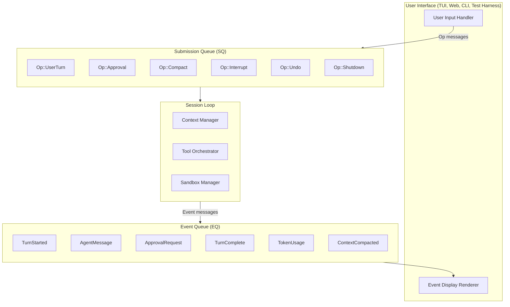
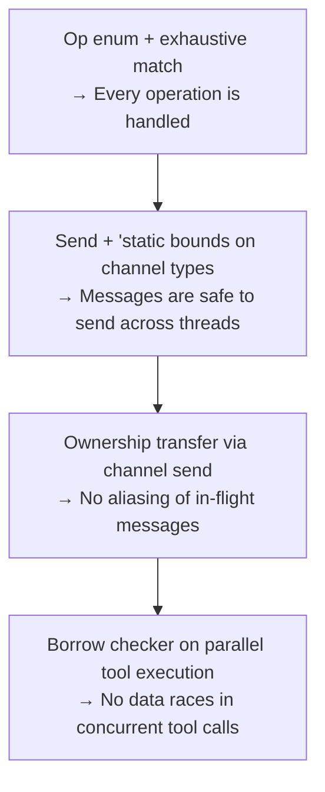
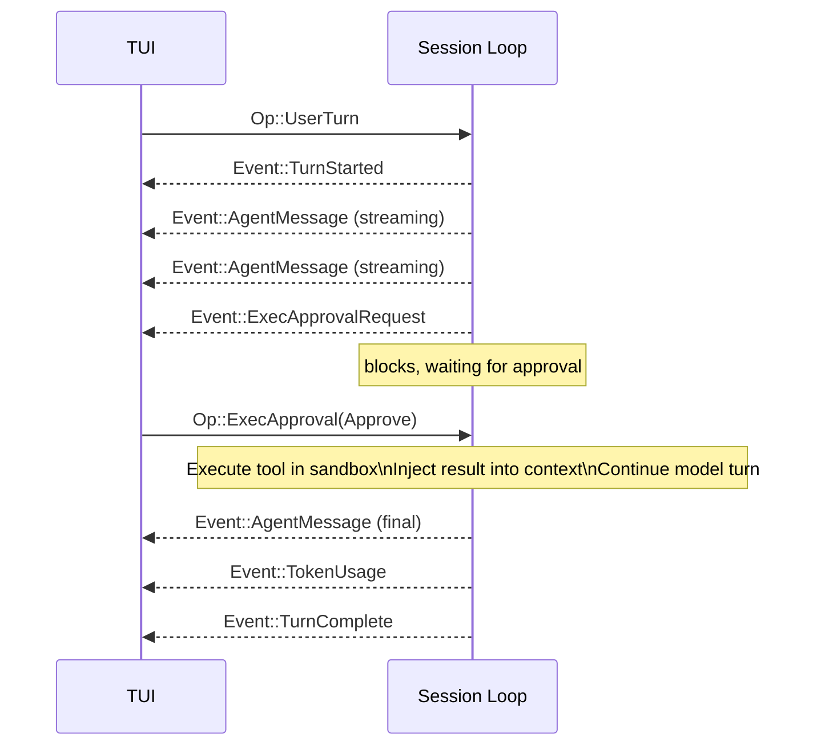
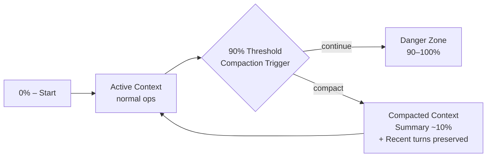
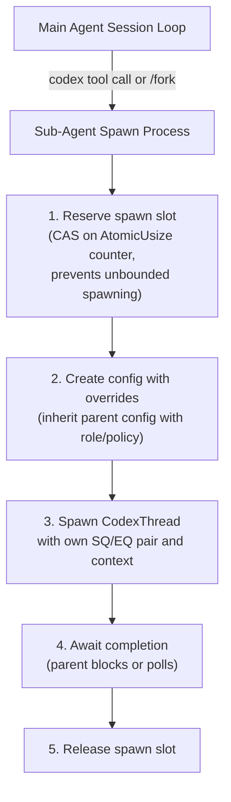
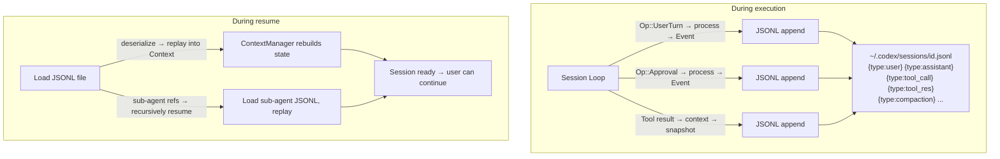

# Message-Passing Loops

## Overview

Message-passing loops represent the most architecturally mature pattern for building
agentic systems. Rather than a simple `while True → call_model → execute_tools` cycle,
a message-passing loop decouples the agentic loop from its callers entirely. The loop
becomes a standalone process that communicates exclusively through typed message channels.

The canonical example is **Codex CLI's SQ/EQ (Submission Queue / Event Queue)** pattern,
written in Rust with Tokio for async execution. In this architecture:

- The **core loop** processes not just "run the next turn" but a rich vocabulary of
  operations: user turns, approval resolutions, compaction, interruption, undo, rollback,
  and shutdown.
- The **UI layer** is completely decoupled: it submits `Op` messages into the Submission
  Queue and reads `Event` messages from the Event Queue. The UI could be a TUI, a web
  frontend, a test harness, or a headless batch runner — the loop doesn't know or care.
- **Concurrency** is first-class: tool calls run in parallel, streaming responses overlap
  with tool execution, and the approval gate suspends the loop without blocking the UI.

This design draws from the Actor model tradition (Erlang, Akka) and from operating system
kernel design (io_uring's submission/completion queues). The result is a system where
every interaction is a message, every side effect is observable, and the entire execution
history is replayable.



---

## The SQ/EQ Architecture

The two queues form the backbone of the entire system. Every interaction between the
outside world and the agent loop passes through one of these two channels. This is not
merely a design preference — it is a correctness guarantee. Because all mutation flows
through the SQ and all observation flows through the EQ, the system is inherently free
of data races between the UI and the core loop.

### Submission Queue (SQ)

The Submission Queue is a bounded async channel (`tokio::sync::mpsc`) that receives
`Op` (operation) messages. Each `Op` variant represents a discrete, well-typed command
that the loop knows how to handle.

```rust
/// Operations submitted to the session loop via the Submission Queue.
#[derive(Debug)]
pub enum Op {
    /// Start a new model turn with the given user-provided items.
    UserTurn {
        items: Vec<InputItem>,
        model: ModelConfig,
        effort: ReasoningEffort,
    },

    /// Resolve a blocked tool-call approval gate.
    ExecApproval {
        id: ApprovalId,
        decision: ApprovalDecision,  // Approve | Deny | AlwaysApprove
    },

    /// Trigger context compaction (summarize + truncate).
    Compact,

    /// Cancel the current streaming response and abort in-flight tools.
    Interrupt,

    /// Rollback the last N turns from the conversation.
    Undo { num_turns: usize },

    /// Deep rollback from a persisted rollout checkpoint.
    ThreadRollback,

    /// Gracefully terminate the session loop.
    Shutdown,
}
```

**Key design decisions:**

- **`UserTurn` carries the model config** — this allows mid-conversation model switching
  (e.g., switching from `o3` to `o4-mini` for simple follow-ups).
- **`ExecApproval` references an `ApprovalId`** — this ID correlates back to a specific
  `ExecApprovalRequest` event, enabling out-of-order approval resolution.
- **`Interrupt` is distinct from `Shutdown`** — interruption cancels the current turn but
  keeps the session alive; shutdown terminates the loop entirely.
- **`Undo` takes a count** — supporting multi-turn undo, not just single-step.

Each submission is wrapped in a `Submission` struct that may include a oneshot channel
for the caller to await acknowledgment:

```rust
pub struct Submission {
    pub op: Op,
    pub ack: Option<oneshot::Sender<OpAck>>,
}
```

### Event Queue (EQ)

The Event Queue is a broadcast channel (`tokio::sync::broadcast` or a multi-consumer
`mpsc`) that emits `Event` messages. Every observable side effect of the session loop
is surfaced as an event.

```rust
/// Events emitted by the session loop via the Event Queue.
#[derive(Debug, Clone)]
pub enum Event {
    /// A new model turn has begun.
    TurnStarted { turn_id: TurnId },

    /// A chunk of streaming text from the model.
    AgentMessage {
        turn_id: TurnId,
        content: String,
        is_final: bool,
    },

    /// Reasoning trace from a reasoning-capable model (o3, o4-mini).
    Reasoning {
        turn_id: TurnId,
        content: String,
    },

    /// A tool call requires user approval before execution.
    ExecApprovalRequest {
        id: ApprovalId,
        tool_call: ToolCallSummary,
        risk_level: RiskLevel,
    },

    /// Token usage statistics for the completed turn.
    TokenUsage {
        turn_id: TurnId,
        input_tokens: u64,
        output_tokens: u64,
        reasoning_tokens: Option<u64>,
    },

    /// Context was compacted (summarized and truncated).
    ContextCompacted {
        original_tokens: u64,
        compacted_tokens: u64,
        summary_preview: String,
    },

    /// The current turn completed successfully.
    TurnComplete { turn_id: TurnId },

    /// The current turn was aborted (via Op::Interrupt or error).
    TurnAborted {
        turn_id: TurnId,
        reason: AbortReason,
    },
}
```

**Why broadcast?** Multiple consumers may observe the same event stream: the TUI renders
events to the terminal, a logger writes them to disk, and a metrics collector tracks
token usage. The broadcast channel allows fan-out without the session loop knowing about
its consumers.

---

## The Session Loop

The session loop is the heart of the system. It is a single `async fn` that owns the
`Session` state and processes operations sequentially from the SQ, emitting events to
the EQ as side effects.

```rust
async fn session_loop(
    mut rx_sub: Receiver<Submission>,
    tx_event: Sender<Event>,
    session: Arc<Mutex<Session>>,
) {
    while let Some(submission) = rx_sub.recv().await {
        match submission.op {
            Op::UserTurn { items, model, effort } => {
                tx_event.send(Event::TurnStarted { turn_id: session.next_turn_id() }).ok();

                // 1. Append user items to the context manager
                let mut ctx = session.lock().await;
                ctx.context_manager.append_user_items(&items);

                // 2. Build the prompt payload
                let prompt = ctx.context_manager.build_prompt(&model, effort);

                // 3. Stream the model response
                let mut stream = ctx.model_client.stream_response(prompt).await;

                while let Some(chunk) = stream.next().await {
                    match chunk {
                        StreamChunk::Text(text) => {
                            tx_event.send(Event::AgentMessage {
                                turn_id: ctx.current_turn_id(),
                                content: text,
                                is_final: false,
                            }).ok();
                        }
                        StreamChunk::Reasoning(text) => {
                            tx_event.send(Event::Reasoning {
                                turn_id: ctx.current_turn_id(),
                                content: text,
                            }).ok();
                        }
                        StreamChunk::ToolCall(tc) => {
                            // Route through tool orchestrator (see below)
                            ctx.pending_tool_calls.push(tc);
                        }
                        StreamChunk::Done(usage) => {
                            tx_event.send(Event::TokenUsage {
                                turn_id: ctx.current_turn_id(),
                                input_tokens: usage.input,
                                output_tokens: usage.output,
                                reasoning_tokens: usage.reasoning,
                            }).ok();
                        }
                    }
                }

                // 4. Execute pending tool calls (may block on approval)
                let results = ctx.tool_orchestrator.execute_all(
                    &ctx.pending_tool_calls,
                    &tx_event,
                    &mut rx_sub,  // for receiving approval Ops
                ).await;

                // 5. Inject tool results into context
                ctx.context_manager.append_tool_results(&results);

                // 6. Check compaction threshold
                if ctx.context_manager.token_count() > ctx.compaction_threshold() {
                    // Auto-compact (see compaction section)
                    ctx.auto_compact(&tx_event).await;
                }

                // 7. If tool calls were made, loop back for model's next response
                if !results.is_empty() {
                    // Re-submit as an internal turn (model processes tool results)
                    // This is the agentic loop — it continues until the model
                    // emits a final text response with no tool calls.
                }

                tx_event.send(Event::TurnComplete {
                    turn_id: ctx.current_turn_id(),
                }).ok();
            }

            Op::ExecApproval { id, decision } => {
                // Resolve a blocked approval gate. The tool orchestrator holds
                // a map of pending approvals (ApprovalId → oneshot::Sender).
                session.lock().await
                    .tool_orchestrator
                    .resolve_approval(id, decision);
            }

            Op::Compact => {
                let mut ctx = session.lock().await;
                ctx.auto_compact(&tx_event).await;
            }

            Op::Interrupt => {
                // 1. Cancel the active SSE/WebSocket stream
                session.lock().await.model_client.cancel_stream();

                // 2. Abort all in-flight tool executions
                session.lock().await.tool_orchestrator.abort_all();

                tx_event.send(Event::TurnAborted {
                    turn_id: session.lock().await.current_turn_id(),
                    reason: AbortReason::UserInterrupt,
                }).ok();
            }

            Op::Undo { num_turns } => {
                let mut ctx = session.lock().await;
                // Remove the last N turns from the context, preserving
                // GhostSnapshot entries for potential re-rollback.
                ctx.context_manager.rollback(num_turns);
            }

            Op::ThreadRollback => {
                let mut ctx = session.lock().await;
                // Reload from the last persisted rollout checkpoint
                ctx.context_manager.reload_from_rollout();
            }

            Op::Shutdown => break,
        }

        // Acknowledge the submission if caller is waiting
        if let Some(ack) = submission.ack {
            ack.send(OpAck::Ok).ok();
        }
    }
}
```

**Critical observation:** The session loop is single-threaded with respect to operation
processing. Operations are handled one at a time, in order. This eliminates an entire
class of concurrency bugs. Parallelism exists *within* a single operation (e.g., parallel
tool execution inside `Op::UserTurn`), but the operations themselves are sequential.

---

## Why Message-Passing in Rust

The choice of Rust with Tokio channels for this architecture is deliberate and provides
several guarantees that would be difficult to achieve in other languages:

**Safety: No Shared Mutable State**
The session state is owned by the session loop. The UI cannot directly mutate it. All
mutation flows through `Op` messages. The Rust compiler enforces this at compile time —
you literally cannot write code that accesses session state from the UI thread without
going through the channel.

**Concurrency: Backpressure via Bounded Channels**
Tokio's `mpsc` channels can be bounded, meaning that if the session loop falls behind,
the UI will naturally slow down when submitting operations. This prevents unbounded
queue growth and provides flow control without explicit rate limiting.

**Performance: Zero-Cost Abstractions**
The `async/await` machinery in Rust compiles down to state machines with no heap
allocation for the futures themselves. Channel operations are lock-free in the common
case. The overhead of the message-passing architecture is negligible compared to the
cost of model API calls.

**Correctness: Exhaustive Pattern Matching**
The `match submission.op { ... }` in the session loop must handle every `Op` variant.
If a new operation is added to the enum, the compiler will refuse to compile until
every match arm is updated. This eliminates the "forgot to handle the new message type"
class of bugs entirely.

**The Borrow Checker Prevents Data Races**
When tool calls execute in parallel (via `join_all`), the borrow checker ensures that
no two tasks hold mutable references to the same data. Shared state must go through
`Arc<Mutex<_>>` or `Arc<RwLock<_>>`, making the synchronization explicit and auditable.



---

## How Turns Flow Through the System

A complete turn involves multiple message exchanges between the UI and the session loop.
Here is the full lifecycle:



**Step-by-step walkthrough:**

1. **User types a prompt** → The TUI packages the input into `InputItem`s and sends
   `Op::UserTurn { items, model, effort }` through the SQ.

2. **Session loop receives the Op** → Emits `Event::TurnStarted`. The ContextManager
   appends the user items and builds the full prompt (system instructions + conversation
   history + user input).

3. **Model streaming begins** → The loop opens an SSE or WebSocket connection to the
   model API. As tokens arrive, they are emitted as `Event::AgentMessage` chunks.

4. **ResponseItems are processed** as the stream completes:
   - **Text content** → Emitted as `Event::AgentMessage` with `is_final: true`
   - **Tool calls** → Routed through the `ToolRouter` to the `ToolOrchestrator`

5. **Tool needs approval** → The orchestrator emits `Event::ExecApprovalRequest` with
   the tool call details and risk level. The orchestrator then **blocks** on a oneshot
   channel, waiting for the approval decision.

6. **TUI shows approval dialog** → The user sees the command and approves. The TUI sends
   `Op::ExecApproval { id, decision: Approve }` through the SQ.

7. **Tool executes in sandbox** → The sandbox manager selects the appropriate isolation
   level (none, `landlock`, container) and runs the tool. The result is injected back
   into the ContextManager.

8. **Compaction check** → If the context has grown past 90% of the model's context window
   (~272K tokens for a 300K window), auto-compaction triggers.

9. **Agentic loop continues** → If the model emitted tool calls, their results are
   fed back and the model is called again. This inner loop continues until the model
   produces a final text response with no tool calls.

10. **Turn completes** → `Event::TurnComplete` is emitted. The TUI updates its state.

---

## Tool Router and Orchestrator

The tool execution pipeline has two distinct layers: routing and orchestration.

### ToolRouter: Dispatch Logic

The ToolRouter maps raw `ResponseItem`s from the model into executable `ToolCall`
structures. It maintains a registry of available tools and handles dispatch:

```rust
impl ToolRouter {
    pub fn route(&self, item: &ResponseItem) -> Option<ToolCall> {
        match item {
            ResponseItem::LocalShellCall { command, .. } => {
                Some(ToolCall::Shell { command: command.clone() })
            }
            ResponseItem::FunctionCall { name, arguments, .. } => {
                // Check MCP tools first (dynamic, registered at runtime)
                if let Some(mcp_tool) = self.mcp_registry.get(name) {
                    Some(ToolCall::Mcp {
                        server: mcp_tool.server.clone(),
                        name: name.clone(),
                        arguments: arguments.clone(),
                    })
                }
                // Then check built-in functions
                else if let Some(builtin) = self.builtins.get(name) {
                    Some(ToolCall::Builtin {
                        handler: builtin.clone(),
                        arguments: arguments.clone(),
                    })
                } else {
                    None // Unknown tool — will be reported as error
                }
            }
            ResponseItem::McpCall { server, name, arguments, .. } => {
                Some(ToolCall::Mcp {
                    server: server.clone(),
                    name: name.clone(),
                    arguments: arguments.clone(),
                })
            }
            _ => None,
        }
    }
}
```

**Routing priority:** MCP tools take precedence over built-in functions. This allows
external tool servers to override default behavior, which is essential for extensibility.

### ToolOrchestrator: Approval → Sandbox → Execute

The ToolOrchestrator manages the full lifecycle of a tool call:

```rust
impl ToolOrchestrator {
    pub async fn execute(
        &self,
        tool_call: ToolCall,
        tx_event: &Sender<Event>,
    ) -> ToolResult {
        // 1. Check approval requirement based on policy + risk level
        let risk = self.assess_risk(&tool_call);
        let decision = match self.approval_policy.check(&tool_call, risk) {
            ApprovalPolicy::AutoApprove => ApprovalDecision::Approve,
            ApprovalPolicy::RequireApproval => {
                // Emit approval request event
                let id = ApprovalId::new();
                tx_event.send(Event::ExecApprovalRequest {
                    id,
                    tool_call: tool_call.summary(),
                    risk_level: risk,
                }).ok();

                // Block until approval comes back via Op::ExecApproval
                self.wait_for_approval(id).await
            }
        };

        if decision == ApprovalDecision::Deny {
            return ToolResult::Denied;
        }

        // 2. Select sandbox level based on tool type + config
        let sandbox = self.sandbox_manager.select_sandbox(&tool_call);

        // 3. First execution attempt
        match sandbox.execute(&tool_call).await {
            Ok(output) => ToolResult::Success(output),

            // 4. Handle sandbox denial → retry with escalated privileges
            Err(SandboxError::PermissionDenied(detail)) => {
                // Some sandboxes (e.g., landlock) may deny access to
                // paths that the tool legitimately needs. In this case,
                // escalate to a less restrictive sandbox and retry.
                let escalated = self.sandbox_manager.escalate(&sandbox);
                match escalated.execute(&tool_call).await {
                    Ok(output) => ToolResult::Success(output),
                    Err(e) => ToolResult::Error(e.to_string()),
                }
            }
            Err(e) => ToolResult::Error(e.to_string()),
        }
    }
}
```

---

## Parallel Tool Calls

When the model emits multiple tool calls in a single response (common with capable
models like `o3` and `gpt-4.1`), the orchestrator processes them concurrently:

```rust
pub async fn execute_all(
    &self,
    tool_calls: &[ToolCall],
    tx_event: &Sender<Event>,
) -> Vec<ToolResult> {
    if self.model_config.supports_parallel_tool_calls && tool_calls.len() > 1 {
        // Launch all tool calls concurrently
        let futures: Vec<_> = tool_calls.iter()
            .map(|tc| self.execute(tc.clone(), tx_event))
            .collect();

        futures::future::join_all(futures).await
    } else {
        // Sequential execution for models that don't support parallel calls
        let mut results = Vec::new();
        for tc in tool_calls {
            results.push(self.execute(tc.clone(), tx_event).await);
        }
        results
    }
}
```

**Concurrency control:** Each parallel tool call runs in its own Tokio task. The sandbox
manager ensures isolation between concurrent executions — each tool call gets its own
sandbox instance (or at minimum, its own working directory within a shared sandbox).

**Approval serialization:** Even with parallel tool calls, approval requests are
serialized from the user's perspective. The TUI presents them one at a time. However,
the approval *waits* happen concurrently — all tool calls that need approval emit their
requests simultaneously, and approvals can be resolved in any order.

---

## Auto-Compaction

Context compaction is critical for long-running agentic sessions that may accumulate
hundreds of thousands of tokens across many turns.



**How it works:**

1. **Trigger:** After each turn, the ContextManager checks if `token_count() > 0.9 *
   context_window_size`. For a 300K-token model, this threshold is ~272K tokens.

2. **Remote compaction:** The conversation history is sent to a compaction endpoint that
   produces a structured summary. This summary captures the key decisions, file changes,
   and context established during the conversation.

3. **GhostSnapshot preservation:** Before compaction replaces the old context, critical
   items are preserved as `GhostSnapshot` entries. These are lightweight references that
   enable undo/rollback to reach back past a compaction boundary.

4. **Context replacement:** `ContextManager::replace_with_compacted()` swaps the old
   conversation history with `[system_prompt, compaction_summary, recent_turns]`.

5. **Event emission:** `Event::ContextCompacted` is emitted with statistics so the UI
   can inform the user.

```rust
impl ContextManager {
    pub async fn auto_compact(&mut self, tx_event: &Sender<Event>) {
        let original_tokens = self.token_count();

        // Preserve snapshots for undo support
        self.create_ghost_snapshots();

        // Call remote compaction service
        let summary = self.compaction_client
            .compact(&self.conversation_history)
            .await;

        // Replace context with compacted version
        self.replace_with_compacted(summary.clone());

        let compacted_tokens = self.token_count();

        tx_event.send(Event::ContextCompacted {
            original_tokens,
            compacted_tokens,
            summary_preview: summary.preview(200),
        }).ok();
    }
}
```

---

## Comparison with Direct Function Call Loops

| Aspect | Message-Passing (Codex CLI) | Direct Call (mini-SWE-agent) |
|---|---|---|
| **Coupling** | Fully decoupled — UI and loop communicate only via channels | Tight — caller invokes loop functions directly |
| **Concurrency** | Full async with Tokio — parallel tool calls, non-blocking approval | Single-threaded, synchronous execution |
| **Operation vocabulary** | Rich: UserTurn, Approval, Compact, Interrupt, Undo, Rollback, Shutdown | Minimal: only "run the next turn" |
| **Undo/Rollback** | First-class via `Op::Undo` and `Op::ThreadRollback` with GhostSnapshots | Not supported without external checkpointing |
| **Interruption** | Clean cancellation via `Op::Interrupt` — stream cancelled, tools aborted | Exception-based — may leave state inconsistent |
| **Observability** | Complete event stream — every state change is an event | Trajectory log — append-only, post-hoc |
| **Testability** | Inject Ops, assert Events — no UI needed | Requires mocking the entire environment |
| **Multi-consumer** | Broadcast EQ supports TUI + logger + metrics simultaneously | Single consumer (the caller) |
| **Persistence** | JSONL rollout of Ops + Events enables resume | Manual checkpoint/restore if any |
| **Complexity** | High — channels, enums, async state machines | Minimal — a while loop with function calls |
| **Debugging** | Event trace provides full replay capability | Simple trajectory is easy to read |
| **Best for** | Production-grade, multi-modal, long-running agents | Prototypes, research, simple automation |

---

## Actor Model Influences

The SQ/EQ pattern is a specialized application of the **Actor model**, a concurrency
paradigm where:

- Each **actor** has a private mailbox and processes messages sequentially
- Communication happens exclusively through **message passing**
- There is **no shared state** between actors
- Actors can **spawn** child actors

In the Codex CLI architecture:

| Actor Model Concept | Codex CLI Equivalent |
|---|---|
| Actor | Session loop |
| Mailbox | Submission Queue (SQ) |
| Messages sent to actor | `Op` variants |
| Messages sent from actor | `Event` variants (via EQ) |
| Actor state | `Session` struct (context, tools, config) |
| Spawning child actors | Sub-agent spawning via `codex` tool |
| Supervisor hierarchy | Main agent → sub-agents (with slot limits) |

**Erlang/OTP influences:**
- The "let it crash" philosophy maps to the interrupt/restart pattern — if a turn fails,
  the loop emits `TurnAborted` and continues processing the next operation.
- Supervision trees map to the main-agent → sub-agent hierarchy, where the parent
  manages lifecycle and resource limits.

**Akka influences:**
- Typed actors (Akka Typed) are analogous to Rust's typed `Op` enum — you cannot send
  an invalid message to the session loop.
- The ask pattern (send message + await response) maps to `Submission { op, ack }`.

---

## Sub-Agent Spawning

When a task is too complex for a single agent or requires isolated exploration, the
main agent can spawn sub-agents via the `codex` tool or the `/fork` command.



**Spawn slot reservation** uses compare-and-swap (CAS) on an atomic counter to prevent
unbounded sub-agent creation. This is critical because each sub-agent consumes a model
API connection and sandbox resources.

```rust
pub fn reserve_spawn_slot(&self) -> Result<SpawnGuard, SpawnError> {
    let current = self.active_spawns.load(Ordering::SeqCst);
    if current >= self.max_spawns {
        return Err(SpawnError::AtCapacity);
    }
    match self.active_spawns.compare_exchange(
        current, current + 1,
        Ordering::SeqCst, Ordering::SeqCst,
    ) {
        Ok(_) => Ok(SpawnGuard { counter: &self.active_spawns }),
        Err(_) => Err(SpawnError::RaceCondition), // retry
    }
}
```

**Sub-agents share resources:** The sandbox manager and approval policy are shared
(via `Arc`) between parent and child agents. This ensures consistent security policy
and sandbox reuse. Each sub-agent gets its own ContextManager and SQ/EQ pair.

---

## Non-Interactive Execution (`codex exec`)

The same session loop powers both the interactive TUI and the non-interactive `codex exec`
command. The difference is entirely in the event consumer:

```rust
// Interactive TUI event processor
async fn tui_event_loop(mut rx: Receiver<Event>, terminal: &mut Terminal) {
    while let Some(event) = rx.recv().await {
        match event {
            Event::AgentMessage { content, .. } => terminal.render_markdown(&content),
            Event::ExecApprovalRequest { .. } => terminal.show_approval_dialog(..),
            Event::TurnComplete { .. } => terminal.show_prompt(),
            // ... handle all events with rich TUI rendering
        }
    }
}

// Non-interactive event processor
async fn exec_event_loop(
    mut rx: Receiver<Event>,
    output_mode: OutputMode,
    auto_approve: bool,
    tx_sub: Sender<Submission>,
) {
    while let Some(event) = rx.recv().await {
        match output_mode {
            OutputMode::HumanReadable => {
                match event {
                    Event::AgentMessage { content, .. } => print!("{content}"),
                    Event::TurnComplete { .. } => println!("\n--- done ---"),
                    _ => {}
                }
            }
            OutputMode::Jsonl => {
                // Serialize every event as a JSON line for machine consumption
                println!("{}", serde_json::to_string(&event).unwrap());
            }
            OutputMode::Ephemeral => {
                // Suppress all output except final result
            }
        }

        // Auto-approve tool calls based on --ask-for-approval flag
        if auto_approve {
            if let Event::ExecApprovalRequest { id, .. } = &event {
                tx_sub.send(Submission {
                    op: Op::ExecApproval {
                        id: *id,
                        decision: ApprovalDecision::Approve,
                    },
                    ack: None,
                }).await.ok();
            }
        }
    }
}
```

This demonstrates the power of the decoupled architecture: the **exact same session loop**
runs regardless of whether a human is watching. The only difference is who consumes
the events and how approval decisions are made.

---

## Resume Flow

Long-running sessions can be persisted to disk and resumed later. The persistence format
is JSONL (one JSON object per line), stored in `~/.codex/sessions/`.



```rust
pub async fn resume_session(session_id: &str) -> Result<Session> {
    let path = format!("{}/.codex/sessions/{}.jsonl", home_dir(), session_id);
    let file = File::open(&path)?;
    let reader = BufReader::new(file);

    let mut context_manager = ContextManager::new();

    for line in reader.lines() {
        let item: RolloutItem = serde_json::from_str(&line?)?;
        match item {
            RolloutItem::UserMessage(msg) => {
                context_manager.append_user_items(&msg.items);
            }
            RolloutItem::AssistantMessage(msg) => {
                context_manager.append_assistant_response(&msg);
            }
            RolloutItem::ToolCall(tc) => {
                context_manager.append_tool_call(&tc);
            }
            RolloutItem::ToolResult(tr) => {
                context_manager.append_tool_result(&tr);
            }
            RolloutItem::Compaction(summary) => {
                context_manager.replace_with_compacted(summary);
            }
            RolloutItem::SubAgentRef(ref_id) => {
                // Recursively resume the sub-agent's session
                let sub = resume_session(&ref_id).await?;
                context_manager.append_sub_agent_result(&sub);
            }
        }
    }

    Ok(Session::from_context(context_manager))
}
```

---

## When Message-Passing is Worth the Complexity

The SQ/EQ architecture introduces significant complexity compared to a simple function
call loop. Here is a decision framework for when the investment pays off:

**Use message-passing when:**

- **Rich operation vocabulary is needed.** If your agent needs undo, interrupt, compaction,
  and rollback — operations that are fundamentally different from "run the next turn" —
  the typed `Op` enum provides a clean, extensible vocabulary.

- **UI must be fully decoupled.** If you need to support multiple frontends (TUI, web,
  API, test harness) against the same agent loop, message-passing is the natural boundary.

- **Parallel tool execution with approval gates.** The combination of concurrent tool
  calls and blocking approval requests is extremely difficult to implement correctly
  without message-passing channels.

- **Sessions must persist and resume.** The JSONL rollout of events provides a natural
  persistence format that enables session resume without custom serialization logic.

- **Sub-agents need dynamic spawning.** The actor-like architecture naturally supports
  spawning child agents with their own SQ/EQ pairs and shared resources.

- **Observability is critical.** The event stream provides a complete, machine-readable
  trace of everything the agent did — invaluable for debugging and auditing.

**Stick with direct function calls when:**

- You are building a prototype or research tool
- The agent runs a fixed number of turns with no user interaction
- There is no need for undo, interrupt, or persistence
- A single consumer processes the agent's output
- Simplicity and debuggability outweigh architectural purity

---

## Summary

The message-passing loop, as exemplified by Codex CLI's SQ/EQ architecture, represents
the state of the art in agentic loop design. By treating every interaction as a typed
message flowing through async channels, it achieves:

1. **Complete decoupling** between the agent core and its consumers
2. **Type-safe operation handling** via Rust's exhaustive pattern matching
3. **First-class concurrency** for parallel tool execution
4. **Rich lifecycle management** with undo, interrupt, compaction, and resume
5. **Production-grade observability** through the event stream

The complexity cost is real, but for systems that need to run reliably in production
with multiple frontends, long-running sessions, and dynamic tool ecosystems, the
message-passing architecture is unmatched.