# Multi-Agent Orchestration

Instead of one agent running one loop, multiple specialized agents coordinate to solve a task. This is the most complex variation of the agentic loop — and the one with the widest design space. Each agent may have different tools, thinking budgets, model tiers, and access levels. The key challenge is not making agents work, but making agents work **together**: how they communicate, how they share state, and how they avoid stepping on each other.

---

## Why Multi-Agent?

A single agent with a single context window hits fundamental limits:

1. **Context exhaustion**: Complex tasks fill the window before the work is done.
2. **Role confusion**: An agent asked to plan, execute, and verify tends to do all three poorly.
3. **Capability mismatch**: Some sub-tasks need expensive reasoning; others need cheap, fast execution.
4. **Verification independence**: An agent checking its own work has obvious conflict of interest.

Multi-agent architectures address these by splitting responsibilities across **isolated context windows**, each optimized for its role. The cost: orchestration complexity.

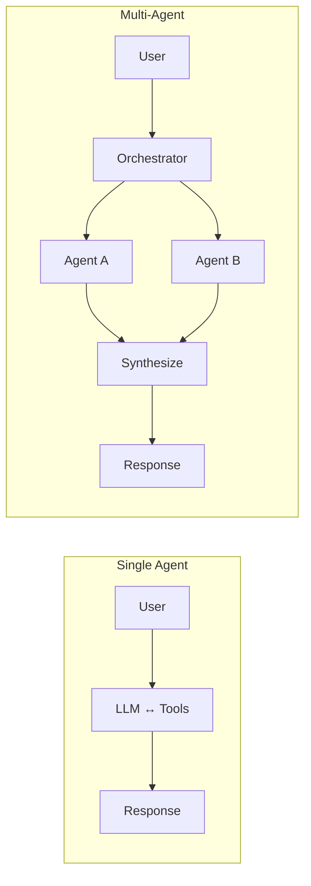

---

## ForgeCode: Forge/Muse/Sage — Three Named Agents

ForgeCode (the TermBench #1 agent) is the clearest example of purpose-built multi-agent orchestration. Three agents with hard capability boundaries:

### Architecture

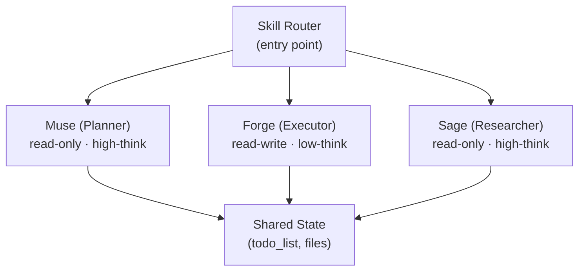

- **Muse**: Read-only planning agent. High thinking budget. Produces structured implementation plans with TODO lists. **Cannot modify files.** This hard constraint means Muse can think freely without accidentally breaking anything.

- **Forge**: Read-write execution agent. Low thinking budget during execution (it's following a plan, not inventing one). Has all file-modification tools. Follows Muse's plans step-by-step.

- **Sage**: Read-only research agent. Delegated to by Forge or Muse when deep codebase analysis is needed. Returns findings to the calling agent. High thinking budget because research requires synthesis.

### The Orchestration Flow

The flow is a 5-step pipeline that wraps every user request:

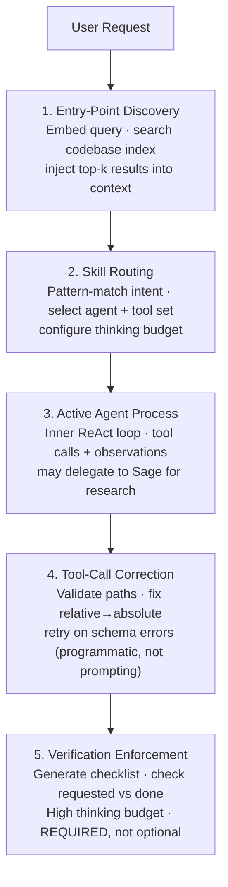

### Progressive Thinking Policy

ForgeCode dynamically adjusts the model's thinking budget based on conversation phase:

```python
# Pseudocode for ForgeCode's thinking budget policy
def get_thinking_budget(message_count, phase):
    if phase == "verification":
        return HIGH      # always reason carefully when verifying
    elif message_count <= 10:
        return HIGH      # planning phase — think deeply
    else:
        return LOW       # execution phase — follow the plan

# In practice, this maps to the "thinking" parameter in Claude API:
# HIGH = budget_tokens: 10000+
# LOW  = budget_tokens: 1024
```

The insight: **planning requires reasoning; execution requires speed.** A model following a detailed plan doesn't need to think hard about what to do — it needs to do it quickly and correctly. But verification demands full reasoning again, because the model must evaluate whether the changes actually satisfy the requirements.

### Verification Enforcement

This is the single most important architectural decision in ForgeCode. The key insight:

> Prompting "please verify your work" doesn't work under pressure. When the model is deep in execution, it treats verification as a formality and rubber-stamps its own output.

ForgeCode's solution: **the runtime programmatically requires a verification pass.** The agent cannot return a response to the user until verification completes.

```python
# Pseudocode for verification enforcement
def run_agent_loop(agent, task):
    result = agent.execute(task)

    # NOT a suggestion — a hard requirement
    verification = agent.verify(
        requested=task.requirements,
        produced=result.changes,
        thinking_budget=HIGH  # force deep reasoning
    )

    checklist = {
        "requested": task.requirements,
        "done": verification.completed_items,
        "evidence": verification.evidence,
        "missing": verification.gaps
    }

    if checklist["missing"]:
        # Re-enter execution loop with gap analysis
        return run_agent_loop(agent, task.with_gaps(checklist["missing"]))

    return result
```

This pattern — mandatory verification with elevated thinking budget — drove a **significant score improvement on TermBench**. The improvement came not from better planning or better tools, but from catching the agent's own mistakes before they reached the user.

### Plan-and-Act Pattern

The standard ForgeCode workflow for complex tasks:

```
User: "Refactor the authentication module to use JWT"

Step 1: :muse (Plan)
  → Muse reads entire auth module (read-only)
  → Produces TODO list with 12 items
  → Each item: description, files to modify, approach
  → Writes plan to shared state (todo_write)

Step 2: User reviews plan
  → Modify, reorder, or approve items

Step 3: :forge (Execute)
  → Forge reads plan from shared state
  → Executes items sequentially
  → For each: modify files → run tests → mark done
  → May call :sage for "how does the session middleware work?"

Step 4: Verification (automatic)
  → Checklist: all 12 items done?
  → Evidence: test results, file diffs
  → Missing: item #8 incomplete → re-execute
```

---

## Claude Code: Sub-Agent Spawning

Claude Code takes a different approach: a single main agent that **spawns specialized sub-agents** as needed. No pre-defined pipeline — the main agent decides dynamically when to delegate.

### Three-Phase Loop

The main agent follows a fluid three-phase pattern:

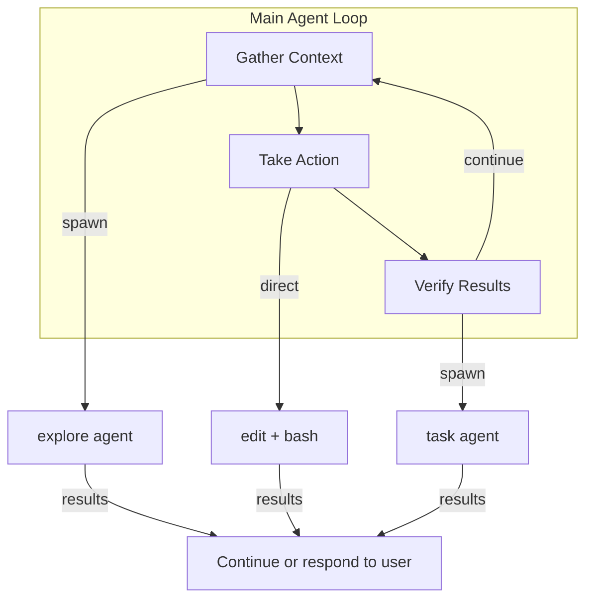

Phases blend fluidly. A simple `fix the typo in README.md` might skip gathering and go straight to action. A complex refactor might spend 10 turns gathering before any action.

### Sub-Agent Types

| Agent | Default Model | Purpose | Tools Available | Context |
|-------|--------------|---------|-----------------|---------|
| **Explore** | Haiku (fast/cheap) | Codebase search, find files, answer questions | `grep`, `glob`, `view`, `bash` (read-only) | Own window |
| **Task** | Haiku | Execute commands, run tests/builds | All CLI tools | Own window |
| **General-purpose** | Sonnet (same as parent) | Complex multi-step work | All tools | Own window |
| **Code-review** | Sonnet | Review diffs, find bugs | All CLI tools (read-only) | Own window |

### Spawning Mechanics

```typescript
// Pseudocode for Claude Code's sub-agent spawning
interface SubAgent {
  type: "explore" | "task" | "general-purpose" | "code-review";
  prompt: string;           // complete task description
  mode: "sync" | "background";
  model?: string;           // optional override
}

// Main agent calls this as a tool
function spawnSubAgent(agent: SubAgent): string {
  const context = createFreshContext();  // new, empty context window
  const result = runAgentLoop(context, agent.prompt, {
    tools: getToolsForType(agent.type),
    model: agent.model ?? getDefaultModel(agent.type),
  });
  return summarize(result);  // only summary returns to main context
}
```

### Key Constraint: No Recursive Spawning

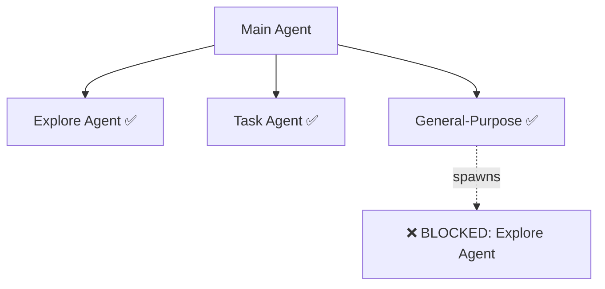

Sub-agents **cannot spawn other sub-agents.** This prevents:
- Infinite nesting (agent spawns agent spawns agent...)
- Context explosion (each spawn doubles memory usage)
- Debugging nightmares (5 levels deep, which agent broke?)

Each sub-agent runs in its **own isolated context window**. When it finishes, only a summary returns to the main agent's context. This is critical: a sub-agent might consume 50K tokens exploring the codebase, but only 200 tokens of findings flow back.

### Parallel Exploration

Claude Code can spawn multiple explore agents in parallel:

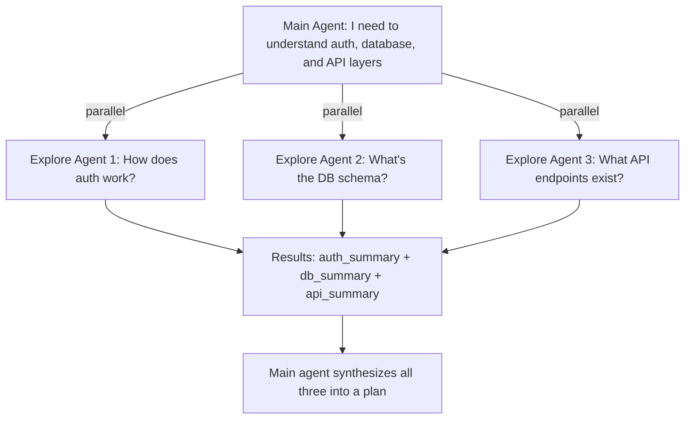

This is safe because explore agents are read-only. No race conditions, no conflicting writes.

---

## Ante: Two-Tier Fan-Out/Fan-In

Ante (built in Rust) takes multi-agent to its logical extreme: a **meta-agent** that decomposes tasks and delegates to **concurrent sub-agents** running in genuine parallel.

### Meta-Agent Orchestrator

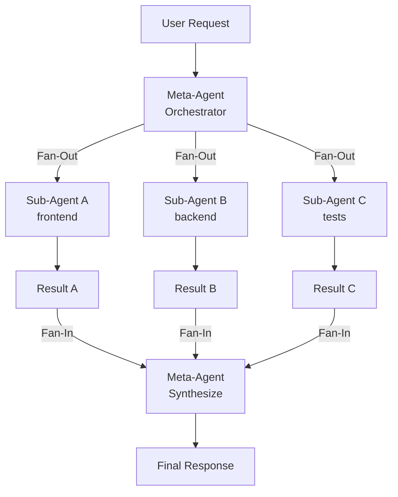

The meta-agent's job:

1. **Receive** user request
2. **Decompose** into independent sub-tasks
3. **Delegate** to concurrent sub-agents (fan-out)
4. **Monitor** progress of each sub-agent
5. **Collect** results as sub-agents complete (fan-in)
6. **Synthesize** unified response from all results

### Sub-Agent Inner Loop

Each sub-agent runs its own agentic loop independently:

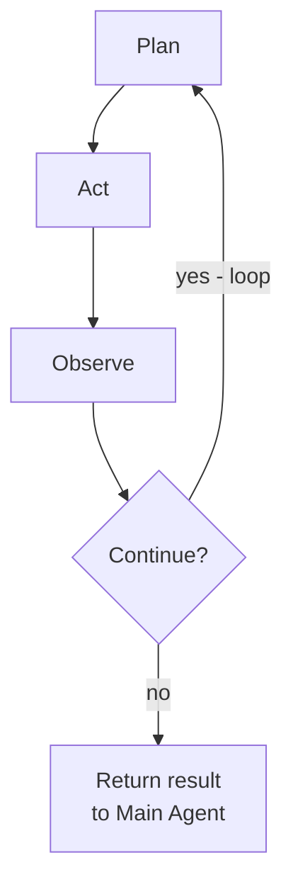

### Key Implementation: Rust + Lock-Free Scheduling

```rust
// Conceptual Ante architecture (simplified)
struct MetaAgent {
    scheduler: LockFreeScheduler,
    sub_agents: Vec<SubAgent>,
}

impl MetaAgent {
    async fn execute(&self, task: Task) -> Result<Response> {
        // Decompose
        let sub_tasks = self.decompose(task).await?;

        // Fan-out: spawn genuinely concurrent sub-agents
        let handles: Vec<_> = sub_tasks
            .into_iter()
            .map(|st| {
                let agent = SubAgent::new(st.clone());
                self.scheduler.spawn(async move {
                    agent.run_loop().await  // each has own context
                })
            })
            .collect();

        // Fan-in: collect results as they complete
        let results = join_all(handles).await;

        // Synthesize
        self.synthesize(results).await
    }
}
```

**Why Rust matters here**: Genuine concurrency with a lock-free scheduler. Python-based agents use `asyncio`, which is concurrent but single-threaded. Ante's sub-agents run on separate OS threads, achieving true parallel LLM calls.

### Independent Contexts

Each sub-agent gets a **focused, smaller context window**:

```
Meta-Agent Context:     [full task description, sub-task allocation, results]
Sub-Agent A Context:    [sub-task A only, relevant files only, own history]
Sub-Agent B Context:    [sub-task B only, relevant files only, own history]
Sub-Agent C Context:    [sub-task C only, relevant files only, own history]
```

This prevents context exhaustion. A task that would fill a single agent's 128K window gets split across three agents, each using only 30K. Only the relevant findings from each sub-agent flow back to the meta-agent.

The sub-agents are **self-organizing**: they adapt autonomously based on observations. If Sub-Agent A discovers its sub-task is simpler than expected, it completes early. No central coordinator micromanages the inner loops.

---

## SageAgent: 5-Agent Pipeline

SageAgent uses a **linear pipeline** with a single feedback loop — the simplest multi-agent architecture that still qualifies as "multi-agent."

### Linear Pipeline with Feedback

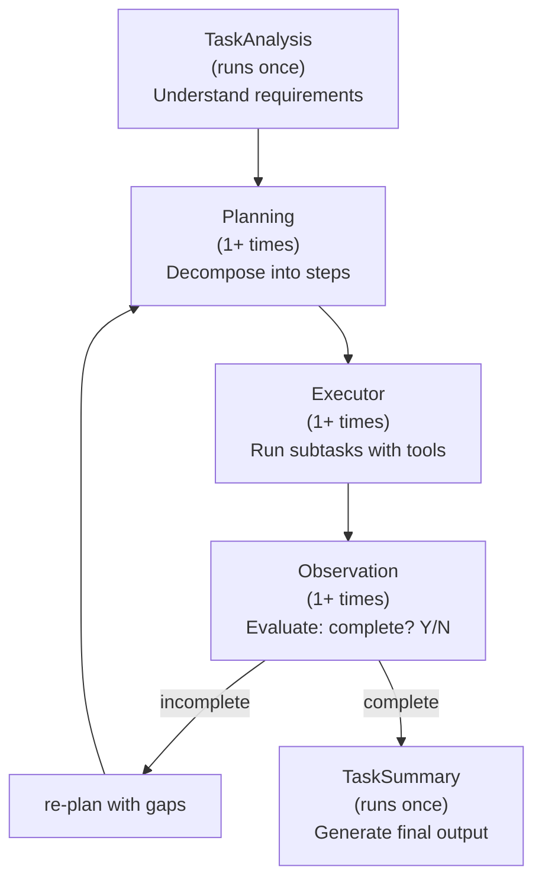

### Agent Roles

| Agent | Runs | Input | Output | Thinking |
|-------|------|-------|--------|----------|
| **TaskAnalysis** | Once | User request | Structured requirements | High |
| **Planning** | 1+ times | Requirements + gap analysis | Ordered subtask list | High |
| **Executor** | 1+ times | Subtask list | Tool results, file changes | Low |
| **Observation** | 1+ times | Executor's output | Binary: complete / incomplete | Medium |
| **TaskSummary** | Once | All results | Final response to user | Medium |

### The Single Feedback Loop

The only cycle in the pipeline: **Observation → Planning**.

```python
# SageAgent pipeline (pseudocode)
def sage_pipeline(user_request):
    # Phase 1: Understand (runs once)
    requirements = task_analysis_agent.analyze(user_request)

    while True:
        # Phase 2: Plan
        plan = planning_agent.plan(requirements, previous_gaps=gaps)

        # Phase 3: Execute
        results = executor_agent.execute(plan)

        # Phase 4: Observe
        evaluation = observation_agent.evaluate(
            requirements=requirements,
            results=results
        )

        if evaluation.complete:
            break

        # Feed gaps back to planning
        gaps = evaluation.missing_items

    # Phase 5: Summarize
    return summary_agent.summarize(results)
```

### Execution Modes

- **Deep Research Mode**: Multiple cycles through the feedback loop. Observation keeps finding gaps, planning keeps refining. Useful for complex, ambiguous tasks.
- **Rapid Execution Mode**: Single pass through the pipeline, no feedback. Observation confirms completion on first try. Used for straightforward tasks.

The mode isn't configured — it emerges naturally from whether the Observation agent finds gaps.

---

## TongAgents: Multi-Agent Approach (BIGAI)

TongAgents (from BIGAI — Beijing Institute for General AI Intelligence) scored 80.2% on Terminal-Bench. The architecture is inferred from the plural name, the research group's focus, and their performance characteristics:

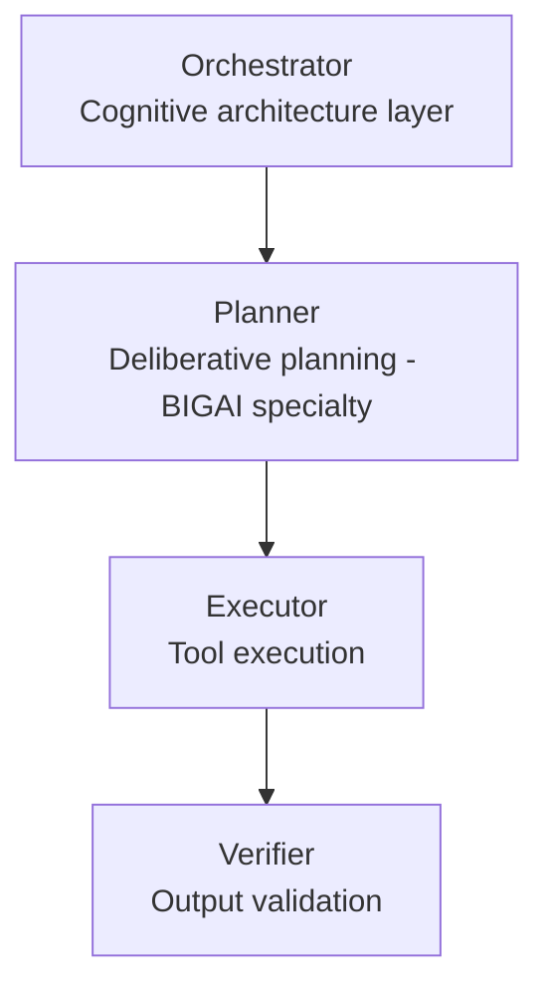

BIGAI's research emphasis on **cognitive architecture** and **deliberative planning** suggests:
- The multi-agent structure mirrors cognitive processes (perception, planning, action, evaluation)
- Agents may use different models or prompting strategies per role
- The plural name ("TongAgents") explicitly signals multiple cooperating agents

---

## Capy: Captain/Build Two-Phase Handoff

Capy uses the cleanest multi-agent architecture: exactly two agents with a hard handoff boundary.

### Architecture

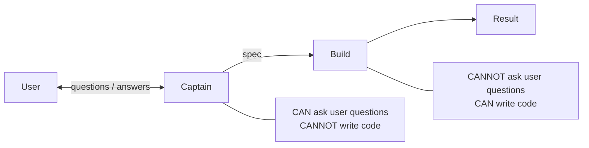

- **Captain**: Planning agent. **CAN** ask the user questions for clarification. **CANNOT** write code or modify files. Produces a specification (spec) as output.

- **Build**: Execution agent. **CANNOT** ask questions (fully autonomous once started). **CAN** write code, run commands, modify files. Takes the Captain's spec as sole input.

### Why Hard Constraints Work

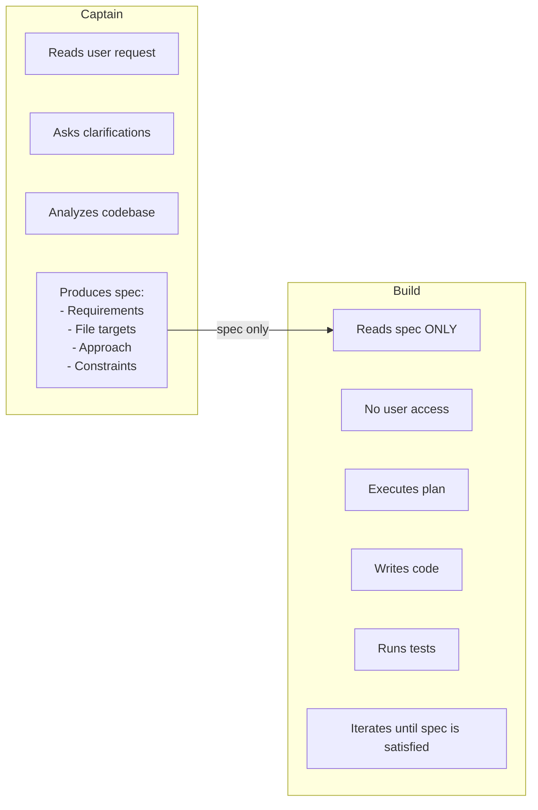

The hard constraints create **natural quality gates**:
1. Captain can't rush to coding — it literally can't write files
2. Build can't ask for help — it must make the spec work
3. The spec is the contract — ambiguity in the spec means ambiguity in the output
4. Strict isolation forces Captain to be thorough (it won't get another chance)

---

## Droid: Delegation-Oriented Loop

Droid works across interfaces (CLI, Slack, Linear, CI) and emphasizes **autonomy measurement**.

### Multi-Interface Architecture

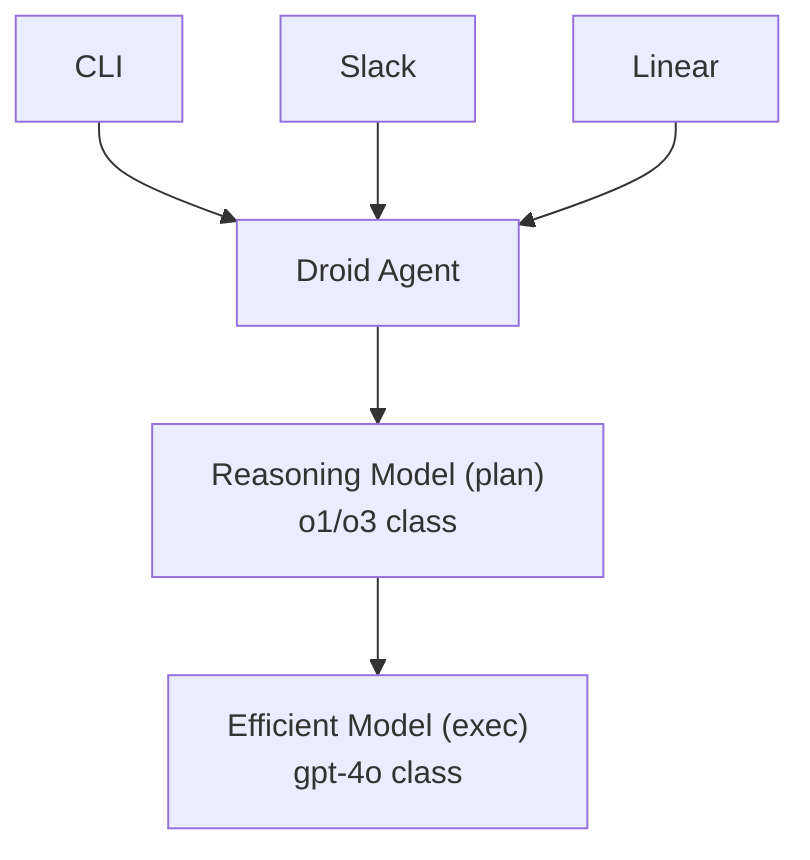

### Autonomy Ratio

Droid tracks the **autonomy ratio**: tool calls per user message. Target: **13x** — for every message from the user, the agent should make ~13 tool calls autonomously. This metric drives architectural decisions toward less human intervention.

### Specification Mode

A two-model variant of the plan-and-execute pattern:
1. **Reasoning model** (expensive, slow): analyzes the task, produces a detailed spec
2. **Efficient model** (cheap, fast): executes the spec, makes tool calls

This is not two agents — it's two models within one agent loop. But it mirrors the multi-agent pattern: separate the thinking from the doing.

---

## Orchestration Patterns

Across all systems, four fundamental orchestration patterns emerge:

### 1. Orchestrator-Worker

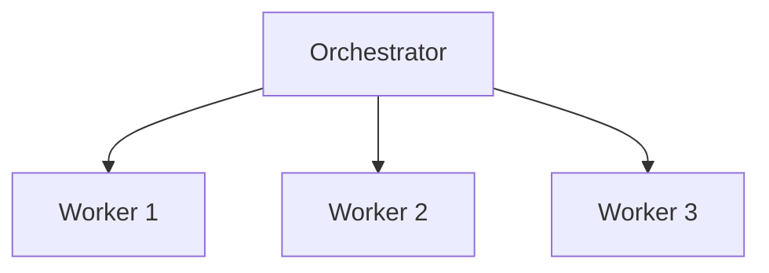

One controller agent delegates to specialized workers. The most common pattern.

| Aspect | Detail |
|--------|--------|
| **Examples** | ForgeCode (Muse/Forge/Sage), Ante (Meta→Sub), Claude Code (Main→Explore/Task) |
| **Advantages** | Centralized coordination, clear hierarchy, easy to reason about |
| **Disadvantages** | Orchestrator is single point of failure, can become bottleneck |
| **Best for** | Tasks with clear sub-task decomposition, parallel workloads |

### 2. Pipeline

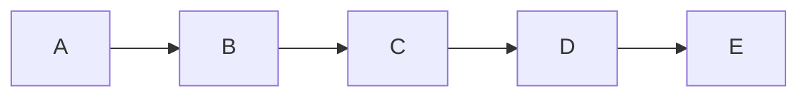

Agents arranged in sequence, each processing and passing forward.

| Aspect | Detail |
|--------|--------|
| **Examples** | SageAgent (TaskAnalysis→Planning→Executor→Observation→Summary) |
| **Advantages** | Simple flow, each agent has clear responsibility, easy to debug |
| **Disadvantages** | Rigid, no parallelism, latency scales linearly with agent count |
| **Best for** | Well-defined workflows, tasks with natural sequential phases |

### 3. Peer-to-Peer

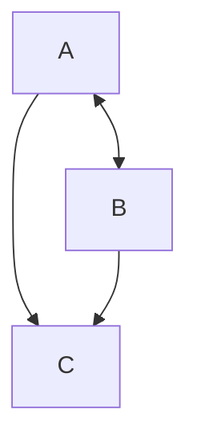

Agents communicate directly with each other, no central controller.

| Aspect | Detail |
|--------|--------|
| **Examples** | OpenAI Swarm's handoff pattern, AutoGen group chat |
| **Advantages** | Flexible, emergent coordination, no single point of failure |
| **Disadvantages** | Complex communication, harder to debug, potential infinite loops |
| **Best for** | Collaborative reasoning, tasks where leadership should shift dynamically |

### 4. Hierarchical

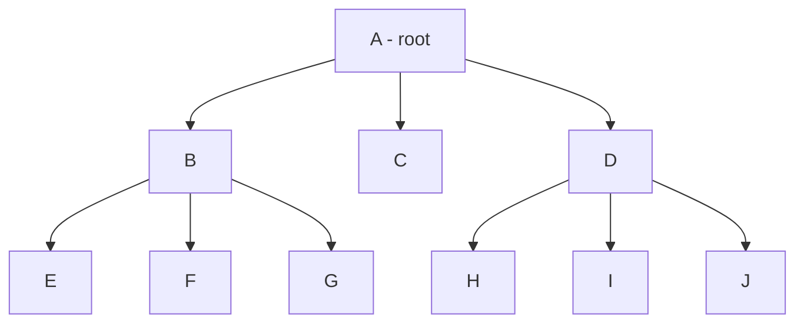

Tree of agents: parent delegates to children, children may delegate further.

| Aspect | Detail |
|--------|--------|
| **Examples** | Google ADK (parent→child routing), LangGraph hierarchical teams |
| **Advantages** | Scalable, natural for complex organizations, domain isolation |
| **Disadvantages** | Deep hierarchies increase latency, harder to coordinate across branches |
| **Best for** | Large-scale tasks, multi-domain problems, organizational mirroring |

---

## Context Distribution Across Agents

How agents share (or isolate) context is the most consequential architectural decision:

### Strategies

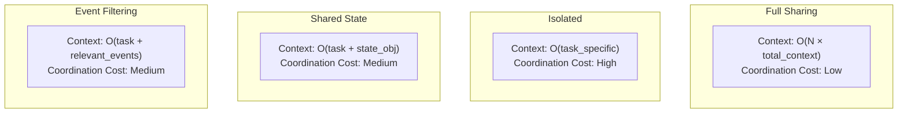

**Full context sharing**: All agents see everything. Simple but wasteful — each agent pays the full context cost even if 90% is irrelevant.

**Isolated contexts**: Each agent sees only its task. Efficient but requires explicit communication — agents can miss important cross-task information.

**Shared state objects**: Agents read/write shared structures like TODO lists, plans, and results. ForgeCode's approach with `todo_write` and `todo_read` tools. Balances isolation with coordination.

**Event stream filtering**: Each agent subscribes to relevant events from a shared stream. OpenHands' `NestedEventStore` filters parent events so sub-agents only see what matters:

```python
# OpenHands NestedEventStore (conceptual)
class NestedEventStore:
    def __init__(self, parent_store, filter_fn):
        self.parent = parent_store
        self.filter = filter_fn  # only pass relevant events

    def get_events(self):
        # Sub-agent sees filtered parent events + own events
        parent_events = [e for e in self.parent.get_events()
                        if self.filter(e)]
        return parent_events + self.own_events
```

---

## Communication Protocols

How agents send results to each other:

### 1. Direct Return

The simplest protocol. Sub-agent returns its result as the tool call response.

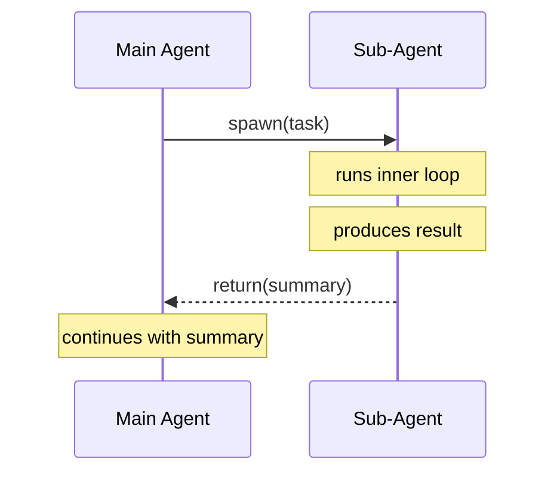

**Used by**: Claude Code (explore agent returns summary), OpenCode (`AgentTool` returns result)

**Advantage**: Zero coordination overhead. The sub-agent's result is just a tool response.
**Disadvantage**: One-shot — the main agent can't steer the sub-agent mid-execution.

### 2. Shared State

Agents read/write shared objects asynchronously.

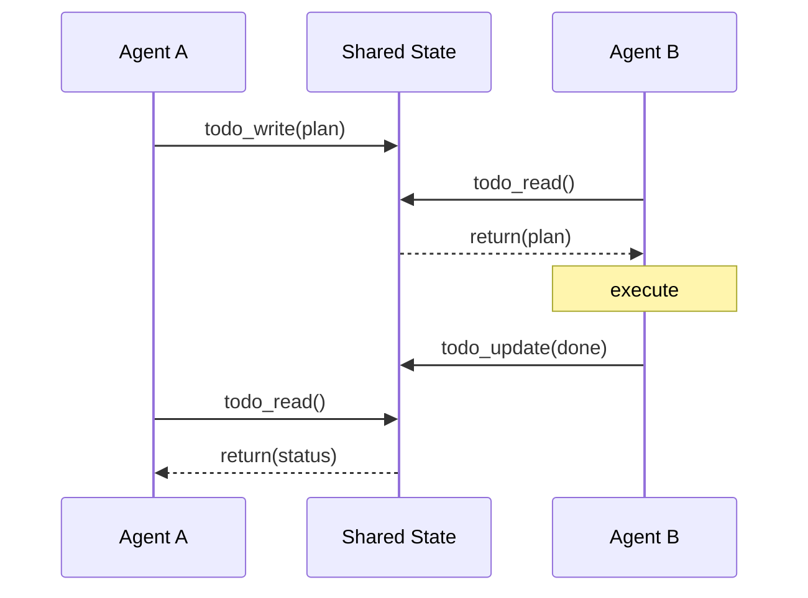

**Used by**: ForgeCode (`todo_write`, `todo_read` tools), CrewAI (shared memory)

**Advantage**: Enables async coordination. Agents don't need to be running simultaneously.
**Disadvantage**: Requires careful state management. Race conditions possible with concurrent writes.

### 3. Event Bus

Agents publish/subscribe to events on a shared stream.

```mermaid
flowchart TD
    ES["Event Stream\n[FileEdit, CmdRun, AgentMsg, …]"]
    A["Agent A"] -->|publish| ES
    C["Agent C"] -->|publish| ES
    ES -->|subscribe| B["Agent B"]
    ES -->|subscribe| D["Agent D"]
```

**Used by**: OpenHands (`EventStream` with `EventSource` tagging), SWE-agent (event-based observation)

**Advantage**: Maximum decoupling. Agents don't need to know about each other.
**Disadvantage**: Debugging is hard — tracing event causality across agents requires sophisticated tooling.

### 4. Handoff (Swarm Pattern)

Agent A returns Agent B as the next handler. Control transfers completely.

```mermaid
sequenceDiagram
    participant A as Agent A
    participant B as Agent B
    A->>B: "I can't handle this"\nreturns {agent: "Agent B", context: {...}}
    Note over A: done
    Note over B: takes over
    Note over B: runs full loop
    Note over B: returns to user
```

**Used by**: OpenAI Swarm, OpenAI Agents SDK (built-in handoff primitive)

**Advantage**: Stateless between calls. Each agent is a pure function.
**Disadvantage**: No multi-agent concurrency — only one agent active at a time.

```python
# OpenAI Swarm handoff pattern
from swarm import Agent

triage_agent = Agent(
    name="Triage",
    instructions="Route to the right specialist.",
    functions=[transfer_to_billing, transfer_to_support],
)

def transfer_to_billing():
    """Transfer to billing specialist."""
    return billing_agent  # handoff: return another agent

billing_agent = Agent(
    name="Billing",
    instructions="Handle billing inquiries.",
    functions=[transfer_to_triage],  # can hand back
)
```

---

## Framework Patterns

### OpenAI Swarm / Agents SDK

The handoff pattern, productionized:

```python
from openai.agents import Agent, Runner, handoff

support_agent = Agent(
    name="Support",
    instructions="Handle support tickets.",
    handoffs=[handoff(target=billing_agent, description="billing issues")],
    tools=[search_docs, create_ticket],
)

# Built-in: guardrails, tracing, tool validation
result = Runner.run(support_agent, messages=[...])
```

Key features:
- **Handoff as first-class primitive**: Agent returns another agent
- **Minimal abstraction**: Agents are just instructions + tools + handoffs
- **Built-in tracing**: Every agent interaction is logged
- **Guardrails**: Input/output validation per agent

### CrewAI

Role-based agent "crews" with configurable process flows:

```yaml
# CrewAI YAML configuration
crew:
  agents:
    - role: "Senior Developer"
      goal: "Write clean, tested code"
      tools: [code_editor, test_runner]
    - role: "Code Reviewer"
      goal: "Find bugs and suggest improvements"
      tools: [code_reader, linter]

  process: sequential  # or hierarchical
  tasks:
    - description: "Implement the feature"
      agent: "Senior Developer"
    - description: "Review the implementation"
      agent: "Code Reviewer"
```

Key features:
- **Role-based**: Agents defined by role, goal, and backstory
- **Process types**: Sequential (pipeline) or hierarchical (orchestrator-worker)
- **YAML configuration**: Agent teams defined declaratively
- **Memory**: Shared memory across crew members

### AutoGen

Multi-agent conversation patterns:

```python
from autogen import AssistantAgent, UserProxyAgent, GroupChat

coder = AssistantAgent("coder", llm_config=llm_config)
reviewer = AssistantAgent("reviewer", llm_config=llm_config)
executor = UserProxyAgent("executor", code_execution_config={...})

# Group chat: agents take turns in a conversation
group_chat = GroupChat(
    agents=[coder, reviewer, executor],
    messages=[],
    max_round=12,
)

# AgentTool pattern: wrap an agent as a tool for another agent
from autogen import AgentTool
coder_tool = AgentTool(agent=coder)
orchestrator = AssistantAgent("orchestrator", tools=[coder_tool])
```

Key features:
- **Conversation-based**: Agents communicate through a shared chat
- **AgentTool**: Wrap any agent as a callable tool for another agent
- **Group chat**: Multiple agents in a round-robin or dynamic-speaker conversation
- **Code execution**: Built-in sandboxed execution for generated code

---

## Comparison Table

| System | Pattern | # Agents | Language | Parallelism | Context Sharing | Verification |
|--------|---------|----------|----------|-------------|-----------------|--------------|
| **ForgeCode** | Orchestrator-Worker | 3 (Muse/Forge/Sage) | TypeScript | Sequential | Shared state (todos) | Mandatory (runtime-enforced) |
| **Claude Code** | Sub-agent Spawning | 1 + N sub-agents | TypeScript | Parallel (explore) | Isolated (summary return) | Main agent decides |
| **Ante** | Fan-Out/Fan-In | 1 meta + N sub | Rust | True parallel (threads) | Isolated per sub-agent | Meta-agent synthesizes |
| **SageAgent** | Pipeline | 5 (linear) | Python | None | Sequential pass-through | Observation agent |
| **TongAgents** | Likely hierarchical | Multiple | Unknown | Unknown | Unknown | Likely dedicated verifier |
| **Capy** | Two-phase Handoff | 2 (Captain/Build) | Unknown | None | Spec as interface | Implicit in Build |
| **Droid** | Specification Mode | 1 (two models) | Unknown | None | Single context | Autonomy ratio tracking |
| **OpenAI Swarm** | Peer handoff | N (dynamic) | Python | None (sequential handoff) | Transferred on handoff | Per-agent |
| **CrewAI** | Role-based crews | N (configured) | Python | Optional | Shared memory | Review agent role |
| **AutoGen** | Group conversation | N (dynamic) | Python | Optional | Shared chat history | Conversation consensus |
| **OpenHands** | Event-driven | 1 + delegates | Python | Async | Event stream (filtered) | Observation events |
| **Google ADK** | Hierarchical routing | N (tree) | Python | Per-branch | Parent↔child only | Per-agent |

---

## When Multi-Agent Is Worth It

Multi-agent orchestration is not always the right choice. It adds complexity, latency, and failure modes. Use it when:

### Strong Signals FOR Multi-Agent

1. **Clear sub-task decomposition**: The task naturally splits into independent parts (frontend + backend + tests). Ante's fan-out excels here.

2. **Different expertise levels needed**: Planning needs expensive reasoning; execution needs cheap speed. ForgeCode's progressive thinking policy exploits this.

3. **Context window is the bottleneck**: A single agent can't hold enough context. Split across agents so each has a focused, smaller window.

4. **Verification must be independent**: An agent checking its own work has conflict of interest. A separate verification agent (ForgeCode, SageAgent) provides genuine oversight.

5. **Parallel execution provides real speedup**: If sub-tasks are truly independent, parallel agents finish faster. Ante's lock-free scheduler makes this practical.

### Strong Signals AGAINST Multi-Agent

1. **Simple, sequential task**: "Fix the typo in line 42" doesn't need three agents.

2. **Tight coupling between sub-tasks**: If every sub-task depends on the output of the previous one, pipeline overhead adds latency without benefit.

3. **Debugging difficulty**: More agents = more places things can go wrong. If reliability matters more than capability, keep it simple.

4. **Latency sensitivity**: Each agent handoff adds LLM call overhead. For interactive use cases where response time matters, single-agent is faster.

### The Decision Framework

```mermaid
flowchart TD
    Q1{"Complex enough to\nfill context window?"}
    Q1 -->|No| R1["Single agent"]
    Q1 -->|Yes| Q2{"Decomposable into\nindependent sub-tasks?"}
    Q2 -->|No| R2["Pipeline\n(SageAgent pattern)"]
    Q2 -->|Yes| Q3{"Sub-tasks need different\ncapabilities?"}
    Q3 -->|No| R3["Fan-out / fan-in\n(Ante pattern)"]
    Q3 -->|Yes| Q4{"Verification critical?"}
    Q4 -->|No| R4["Orchestrator-worker\n(Claude Code pattern)"]
    Q4 -->|Yes| R5["Named agents with\nhard constraints\n(ForgeCode pattern)"]
```

---

## Key Takeaways

1. **Hard constraints beat soft prompts.** ForgeCode's Muse literally cannot write files. Capy's Build literally cannot ask questions. These aren't "please don't" instructions — they're capability restrictions in the runtime. This is more reliable than any prompt.

2. **Verification must be enforced, not requested.** Prompting "please verify" fails under pressure. Runtime-enforced verification (ForgeCode) drove the biggest score improvements.

3. **Context isolation is the primary benefit.** The #1 reason to use multiple agents isn't specialization — it's keeping each agent's context focused and manageable.

4. **Summary return prevents context pollution.** Sub-agents should return summaries, not raw output. A 50K-token exploration compressed to 200 tokens keeps the main agent's context clean (Claude Code pattern).

5. **The simplest multi-agent pattern that works is the right one.** Capy's two-agent handoff outperforms many more complex architectures. Don't add agents you don't need.