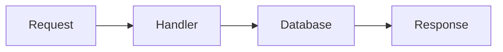
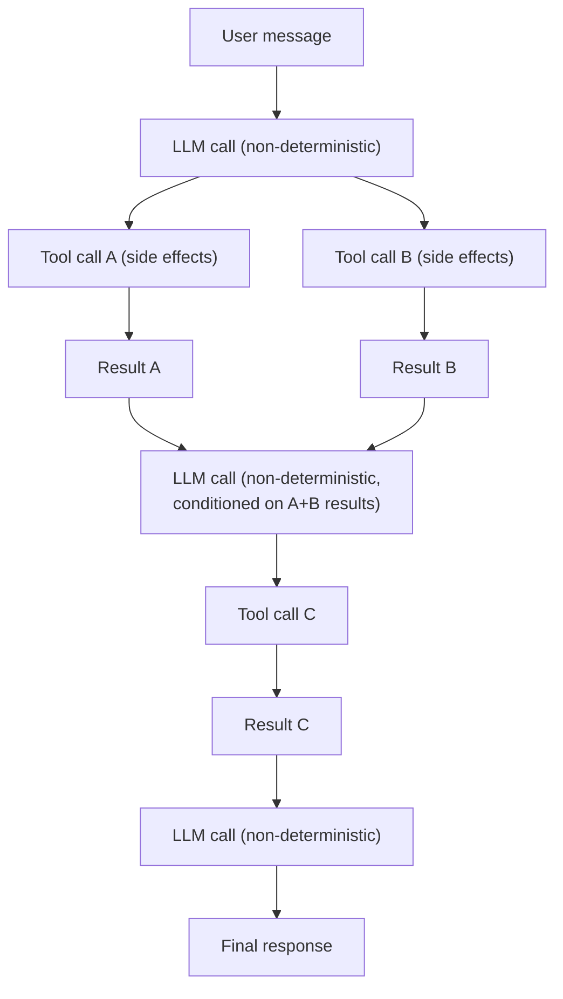
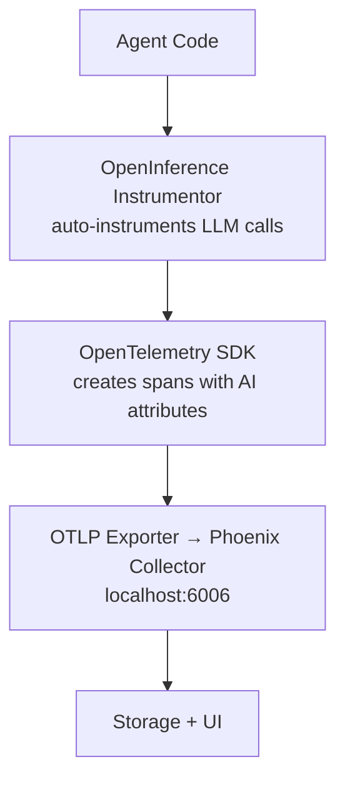
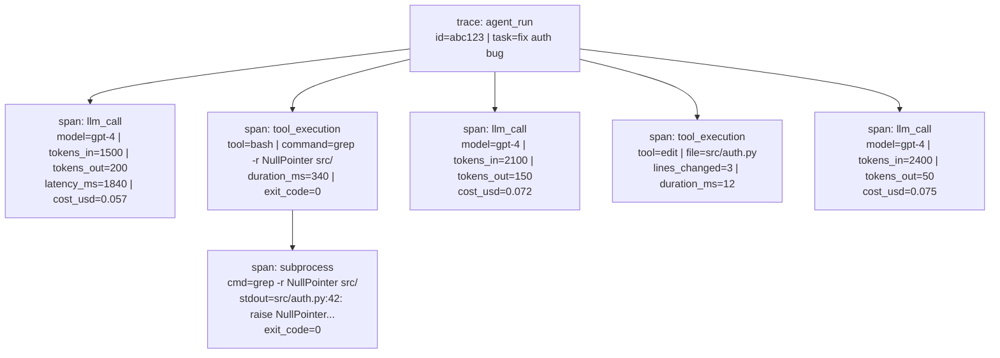
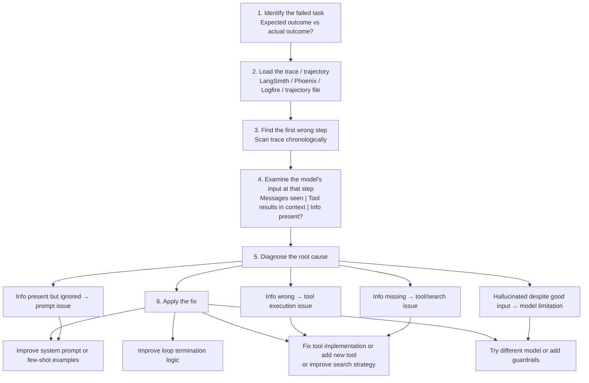

# Observability

## Overview

Agents are black boxes without observability. Unlike traditional software where
execution follows deterministic, well-understood code paths, agent behavior is
fundamentally non-deterministic. The same prompt fed to the same model can
produce wildly different trajectories — different tool calls, different files
edited, different reasoning chains.

Observability answers two critical questions:

1. **"Why did the agent do that?"** — tracing the causal chain from input to action
2. **"Where did it go wrong?"** — pinpointing the first divergence from correct behavior

The three pillars of traditional observability — **traces**, **metrics**, and
**logs** — all apply to agentic loops, but each requires rethinking. A trace
isn't just a request/response pair; it's a multi-turn conversation with
branching tool calls. Metrics aren't just latency and throughput; they include
token consumption, cost, and success rate. Logs aren't just text lines; they're
structured records of LLM inputs, outputs, and tool execution results.

Without observability, debugging an agent that edited the wrong file or entered
an infinite loop is like debugging a distributed system with no logging — you're
left guessing.

---

## Why Agent Observability is Different

### Traditional Observability

In traditional software, observability is built around deterministic paths:



Each step is predictable. The same input produces the same output. Tracing tools
like Jaeger or Zipkin instrument these paths with spans, and you get a clear
picture of what happened.

### Agent Observability

Agent execution is fundamentally different:



Key differences that make agent observability harder:

| Aspect | Traditional Software | Agentic Loops |
|--------|---------------------|---------------|
| Path length | Fixed or bounded | Variable (1 to 100+ turns) |
| Determinism | Same input → same output | Same input → different trajectories |
| Cost model | Compute time | Token consumption ($) |
| Side effects | Database writes | File edits, shell commands, API calls |
| Failure mode | Exceptions, timeouts | Wrong actions, hallucinations, loops |
| State | Explicit (DB, cache) | Implicit (conversation history) |

Each turn in an agentic loop produces three things that need tracing:

1. **LLM call**: the prompt sent, the completion received, token counts, latency
2. **Tool calls**: which tools were invoked, with what arguments, and what they returned
3. **State changes**: how the conversation history and external state changed

Token usage directly correlates with cost — a runaway agent consuming 200k tokens
on a single task is a billing incident. Model selection affects behavior in ways
that are hard to predict without traces. And because the same prompt can produce
wildly different trajectories, you need observability not just for debugging but
for understanding the distribution of agent behavior.

---

## LangSmith (LangChain's Observability Platform)

### Overview

LangSmith is LangChain's full-lifecycle observability platform. It covers the
entire development workflow: trace, debug, evaluate, and monitor LLM
applications. It is tightly integrated with LangGraph (LangChain's agent
framework), making it the natural choice for teams already in that ecosystem.

LangSmith is a commercial product, but the SDK (`langsmith`) and the tracing
protocol are open source. The hosted platform provides the visualization,
evaluation, and monitoring features.

### Key Features

- **`@traceable` decorator**: Automatic instrumentation of any Python function.
  Wraps the function in a span that captures inputs, outputs, latency, and errors.
  Supports nested calls — a traceable function calling another traceable function
  produces a parent-child span relationship.

- **Run trees**: Hierarchical visualization of agent execution. Each run (trace)
  is a tree where the root is the top-level call, and children are LLM calls,
  tool executions, and sub-chains. This mirrors the actual execution structure.

- **Feedback**: Attach human or automated feedback to any run. This enables
  building evaluation datasets from production data — mark a run as "correct" or
  "incorrect" and use those labels for regression testing.

- **Datasets & Evaluations**: Create curated datasets of (input, expected_output)
  pairs and run agents against them. Supports custom evaluators, LLM-as-judge,
  and reference-based evaluation.

- **Monitoring dashboards**: Production metrics including latency distributions,
  token usage, error rates, and cost tracking over time.

### Tracing Example

```python
from langsmith import traceable
from langsmith.run_helpers import get_current_run_tree

@traceable(run_type="chain")
def agent_loop(messages):
    """Main agent loop with full LangSmith tracing."""
    while True:
        # Each LLM call is automatically traced as a child span
        response = llm.generate(messages)
        tool_calls = parse_tools(response)

        if not tool_calls:
            break

        for call in tool_calls:
            # Tool executions are traced with inputs and outputs
            result = execute_tool(call)
            messages.append(result)

    return messages[-1]

@traceable(run_type="tool")
def execute_tool(call):
    """Execute a tool call with tracing."""
    if call.name == "bash":
        return run_bash(call.args["command"])
    elif call.name == "edit":
        return edit_file(call.args["path"], call.args["content"])
    elif call.name == "read":
        return read_file(call.args["path"])

@traceable(run_type="llm")
def llm_generate(messages):
    """Traced LLM call capturing tokens, latency, model."""
    response = openai.chat.completions.create(
        model="gpt-4",
        messages=messages,
    )
    return response
```

### What the Trace Shows

For each agent run, LangSmith captures:

- **Each LLM call** with full input messages and output completion
- **Token counts** per call (prompt tokens, completion tokens, total)
- **Latency** per step (LLM call time, tool execution time, total time)
- **Tool execution results** including stdout/stderr for shell commands
- **Error traces** with full stack traces when tools or LLM calls fail
- **Full trajectory visualization** as an interactive tree

### For Coding Agents

LangSmith is particularly valuable for coding agents because:

- You can trace back from a bad file edit to the exact LLM call that produced it
- Compare successful vs failed runs on similar coding tasks side by side
- Understand why an agent searched for the wrong file or misunderstood an error
- Measure how many turns different types of coding tasks require
- Track cost per task type (bug fixes vs features vs refactors)

---

## Phoenix (Arize, Open-Source)

### Overview

Phoenix is an open-source AI observability platform built on **OpenTelemetry**.
Developed by Arize AI, it is vendor-agnostic and works with any LLM framework.
Phoenix uses the **OpenInference** specification — a set of semantic conventions
for AI/ML traces that extend OpenTelemetry with AI-specific attributes.

### Key Features

- **15+ integrations**: OpenAI, Anthropic, LangChain, LangGraph, CrewAI, Mastra,
  AutoGen, LlamaIndex, Haystack, Instructor, and more
- **Trace visualization**: Interactive trace viewer similar to LangSmith, but
  fully open source and self-hostable
- **Evaluations**: Built-in evaluation framework with LLM-as-judge, code-based
  evaluators, and custom evaluation functions
- **Retrieval analysis**: Specialized tooling for RAG-based agents — analyze
  retrieval quality, chunk relevance, and embedding drift
- **Export to Pandas**: Analyze traces as DataFrames for custom analysis,
  statistical testing, and visualization

### Architecture

Phoenix follows the OpenTelemetry collector pattern:



Setup is minimal:

```python
from phoenix.otel import register

# Connect to Phoenix collector
tracer_provider = register(
    project_name="coding-agent",
    endpoint="http://localhost:6006/v1/traces"
)

# Automatic instrumentation — no code changes needed in your agent
from openinference.instrumentation.openai import OpenAIInstrumentor
OpenAIInstrumentor().instrument(tracer_provider=tracer_provider)

# Now every OpenAI call is automatically traced
# with model name, token counts, prompts, and completions
```

For LangGraph agents:

```python
from openinference.instrumentation.langchain import LangChainInstrumentor
LangChainInstrumentor().instrument(tracer_provider=tracer_provider)

# All LangGraph nodes, edges, and tool calls are traced
```

### Why Open-Source Matters

For coding agents specifically, open-source observability is critical:

- **No vendor lock-in**: Switch between Phoenix, Jaeger, or any OTel-compatible
  backend without changing instrumentation code
- **Self-hosting for security**: Coding agents see source code, credentials, and
  internal architecture — sending traces to a third-party SaaS raises security
  concerns. Self-hosted Phoenix keeps all data on your infrastructure.
- **Extensibility**: Write custom instrumentors for your own tools and frameworks
- **Community-driven**: Integrations for new frameworks are contributed by users
- **Cost**: Free to run, no per-trace pricing

---

## Logfire (Pydantic)

### Overview

Logfire is Pydantic's observability platform, built on OpenTelemetry. It has deep
integration with PydanticAI (Pydantic's agent framework) and provides real-time
debugging capabilities that are particularly useful during agent development.

### Key Features

- **Live view**: See agent execution in real time as it happens — each LLM call,
  tool execution, and decision appears as it occurs
- **Structured data**: Pydantic models are automatically serialized and displayed
  in traces. Since PydanticAI uses Pydantic models for tool parameters and
  results, this means rich, typed trace data
- **Cost tracking**: Automatic token usage and cost calculation per operation,
  with support for different model pricing tiers
- **SQL queries**: Query your traces using SQL — powerful for custom analysis
  like "show me all runs where token usage exceeded 10k" or "find all tool
  failures in the last hour"
- **Dashboards**: Customizable monitoring dashboards with alerting

### PydanticAI Integration

```python
from pydantic_ai import Agent
import logfire

# One-time setup
logfire.configure()
logfire.instrument_pydantic_ai()

# Define agent as normal
agent = Agent(
    "openai:gpt-4",
    system_prompt="You are a coding assistant. Fix bugs in Python code."
)

# Run the agent — all internals are automatically traced
result = agent.run("Fix the NullPointerException in auth.py")

# Logfire captures:
# - System prompt content
# - User message
# - Each LLM call (model, tokens, latency, cost)
# - Tool calls and results
# - Final response
# - Total cost for the entire run
```

### Querying Traces with SQL

One of Logfire's unique features is SQL-based trace analysis:

```sql
-- Find the most expensive agent runs
SELECT
    span_name,
    attributes->>'total_tokens' as tokens,
    attributes->>'cost_usd' as cost,
    duration_ms
FROM spans
WHERE span_name = 'agent_run'
ORDER BY cost DESC
LIMIT 10;

-- Find runs where the agent got stuck in a loop
SELECT trace_id, COUNT(*) as turn_count
FROM spans
WHERE span_name = 'llm_call'
GROUP BY trace_id
HAVING COUNT(*) > 20;
```

---

## OpenTelemetry for Agents

### The Standard

OpenTelemetry (OTel) is the industry standard for observability. It provides a
vendor-neutral specification for traces, metrics, and logs. Both Phoenix and
Logfire are built on OTel, which means traces from either can be exported to
any OTel-compatible backend (Jaeger, Grafana Tempo, Datadog, etc.).

For agents, OTel provides the foundational primitives:

- **Trace**: A complete agent run from start to finish
- **Span**: A single operation within the trace (LLM call, tool execution)
- **Attributes**: Key-value metadata on spans (model name, token count)
- **Events**: Point-in-time occurrences within a span (errors, state changes)
- **Links**: Connections between spans across traces (agent-to-agent calls)

### Agent-Specific Spans

A typical coding agent trace looks like this:



### OpenInference Specification

OpenInference is a set of semantic conventions that standardize how AI/ML traces
are recorded. It defines:

- **Span kinds**: `LLM`, `CHAIN`, `TOOL`, `AGENT`, `RETRIEVER`, `EMBEDDING`
- **Span attributes**: `llm.model_name`, `llm.token_count.prompt`,
  `llm.token_count.completion`, `llm.input_messages`, `llm.output_messages`
- **Tool attributes**: `tool.name`, `tool.parameters`, `tool.description`

This standardization means traces from different frameworks (LangChain, CrewAI,
PydanticAI) can be visualized and analyzed in the same way.

---

## Trace Formats and Visualization

### Hierarchical Traces

The most natural way to represent agent execution is as a tree:

- **Root span**: The entire agent run (user message → final response)
- **Child spans (level 1)**: Individual turns (LLM call + resulting tool calls)
- **Child spans (level 2)**: Individual tool executions within a turn
- **Child spans (level 3)**: Sub-operations within tools (subprocesses, API calls)

This mirrors the actual execution structure and is visualized as flame charts
or collapsible tree views in tools like LangSmith, Phoenix, and Logfire.

### Waterfall View

The waterfall view shows time on the x-axis, making it easy to see parallelism
and bottlenecks:

```
Time →
|===== LLM Call 1 (1.8s) =====|
                                |== Tool: grep (0.3s) ==|
                                |=== Tool: read (0.1s) ==|
                                                          |======= LLM Call 2 (2.1s) =======|
                                                                                              |== Tool: edit (0.01s) =|
                                                                                              |==== Tool: bash (3.2s) ====|
                                                                                                                          |=== LLM Call 3 (0.9s) ===|
```

This view immediately reveals that:
- LLM calls dominate wall-clock time
- Tool executions (except bash/tests) are fast
- There's no parallelism — everything is sequential

### Trajectory Replay

Several agent frameworks support trajectory replay — recording the complete
execution history and replaying it to reproduce behavior:

- **mini-SWE-agent**: Trajectory files are JSON records of every action and
  observation. The trajectory IS the complete trace — human-readable and
  directly replayable.

- **OpenHands**: The EventStream records every event (actions, observations,
  state changes) and can be replayed to reproduce the exact agent behavior.

- **Codex**: JSONL rollout files record the full conversation and enable
  resuming from any point in the execution.

- **Claude Code**: Checkpoints capture both conversation state and code state,
  enabling rollback to any previous point.

- **LangGraph**: Time-travel debugging lets you inspect and modify state at any
  node in the graph, then resume execution from that point.

---

## What to Measure

### Per-Turn Metrics

Each turn in the agentic loop should track:

| Metric | Description | Why It Matters |
|--------|-------------|----------------|
| Latency | Time from sending prompt to receiving completion | User experience, timeout detection |
| Tokens in | Prompt token count | Cost tracking, context window usage |
| Tokens out | Completion token count | Cost tracking, verbosity detection |
| Cost | Calculated from tokens × model pricing | Budget management |
| Tool success rate | % of tool calls that succeed | Reliability measurement |
| Tool latency | Time in tool execution vs LLM | Bottleneck identification |
| Context utilization | % of context window used | Overflow prediction |

### Per-Session Metrics

Aggregate across all turns in a single agent session:

| Metric | Description | Typical Range |
|--------|-------------|---------------|
| Total turns | Number of LLM calls to complete task | 3–50 |
| Total cost | Sum of all LLM call costs | $0.01–$5.00 |
| Wall-clock time | Total time from start to finish | 10s–10min |
| Tool distribution | Which tools used and how often | Varies by task |
| Errors encountered | Count and types of errors | 0–10 |
| Stuck events | Times agent repeated actions | 0 (ideally) |
| Context resets | Times context was truncated/summarized | 0–3 |

### Aggregate Metrics (Fleet-Level)

When running agents at scale:

- **Success rate by task type**: Bug fixes might succeed 70%, new features 40%
- **Average cost per task**: Understand unit economics
- **P50/P95/P99 latency**: Tail latency reveals worst-case behavior
- **Error rate by category**: Tool failures, hallucinations, timeouts
- **Model comparison**: Same tasks run on different models — cost vs quality
- **Turn count distribution**: Bimodal? (easy tasks vs hard tasks)

---

## Debugging Agent Failures

### Common Failure Modes

| # | Failure Mode | Root Cause | How to Debug |
|---|-------------|------------|--------------|
| 1 | Wrong file edited | Bad search results or hallucinated path | Trace the search tool calls that led to file selection |
| 2 | Infinite loop | Agent repeating the same actions | Check trace for repeated tool calls with identical args |
| 3 | Context overflow | Too much data accumulated in history | Monitor token counts per turn, find the spike |
| 4 | Tool failure cascade | One tool failure causes subsequent failures | Check error propagation: does the agent handle errors? |
| 5 | Model hallucination | Model generates non-existent APIs/files | Compare model output to the actual context it received |
| 6 | Premature termination | Agent declares success before task is done | Check final LLM call — did it misinterpret results? |
| 7 | Cost blowup | Agent takes too many turns or uses too much context | Track cumulative cost curve — where does it spike? |

### Debugging Workflow

A systematic approach to debugging agent failures:



### Agent-Specific Debug Tools

Each major agent framework provides its own debugging primitives:

- **mini-SWE-agent**: Trajectory files are plain JSON — grep through them,
  load into Python, or view in any JSON viewer. Simple and effective.

- **OpenHands**: EventStream replay lets you step through events one by one.
  The web UI provides a visual timeline of agent actions.

- **Codex**: JSONL rollout files record everything. The `--resume` flag lets
  you restart from a checkpoint after fixing an issue.

- **Claude Code**: Conversation checkpoints include both the message history
  and the state of the working directory. Roll back to any checkpoint.

- **LangGraph**: Time-travel debugging is built into the framework. Inspect
  the state at any node, modify it, and resume execution from that point.
  This is uniquely powerful for graph-based agents.

---

## Comparison Table

| Feature | LangSmith | Phoenix (Arize) | Logfire (Pydantic) |
|---------|-----------|-----------------|---------------------|
| **Open Source** | SDK only | Fully open source | No |
| **OTel-Based** | No (proprietary) | Yes | Yes |
| **Multi-Framework** | LangChain/LangGraph | 15+ frameworks | PydanticAI focus |
| **Self-Hostable** | No (SaaS only) | Yes | No (SaaS only) |
| **Real-Time View** | Yes | Yes | Yes |
| **Cost Tracking** | Yes | Via attributes | Built-in |
| **SQL Queries** | No | Export to Pandas | Yes (native SQL) |
| **Evaluations** | Yes (built-in) | Yes (built-in) | Via integrations |
| **Pricing** | Free tier + paid | Free (self-host) | Free tier + paid |
| **Best For** | LangChain teams | Vendor-agnostic needs | PydanticAI teams |

### Choosing the Right Tool

- **Already using LangGraph?** → LangSmith is the path of least resistance
- **Need open-source / self-hosted?** → Phoenix is the clear choice
- **Using PydanticAI?** → Logfire provides the tightest integration
- **Want vendor flexibility?** → Phoenix (OTel-based, swap backends freely)
- **Enterprise with compliance needs?** → Phoenix self-hosted or Logfire with
  data residency guarantees

---

## Best Practices

### 1. Instrument from Day One

Adding observability after the fact is painful. Start with tracing enabled from
the first prototype. Even a simple `print()` trace is better than nothing, but
structured tracing (OTel spans) is only marginally more effort and vastly more
useful.

### 2. Track Cost per Turn, Not Just per Session

Session-level cost hides important information. A 20-turn session that costs $2
might have 18 cheap turns and 2 expensive ones. Per-turn cost tracking reveals
which operations are expensive and where optimization matters.

### 3. Save Full Trajectories

Don't just save summaries — save the complete trace with all inputs, outputs,
and tool results. Disk is cheap. When debugging a failure months later, you'll
need the full context. Trajectories are also essential for building evaluation
datasets.

### 4. Compare Successful vs Failed Runs

The most powerful debugging technique is diff-based: take a successful run and
a failed run on similar tasks, and compare them step by step. Where do they
diverge? This immediately reveals the root cause.

### 5. Alert on Anomalous Patterns

Set up alerts for:
- **Stuck loops**: More than N turns without progress
- **Cost spikes**: Single run exceeding cost threshold
- **High error rates**: Tool failure rate above baseline
- **Latency outliers**: P99 latency exceeding SLA

### 6. Use Structured Logging

Replace `print(f"Tool result: {result}")` with structured spans:

```python
with tracer.start_as_current_span("tool_execution") as span:
    span.set_attribute("tool.name", tool_name)
    span.set_attribute("tool.args", json.dumps(args))
    result = execute(tool_name, args)
    span.set_attribute("tool.result_length", len(str(result)))
    span.set_attribute("tool.success", result.success)
```

### 7. Keep Trace Data for Evaluation and Fine-Tuning

Production traces are the best source of training data. Successful runs become
positive examples. Failed runs (once diagnosed) become negative examples or
test cases. Over time, your trace database becomes your most valuable asset
for improving agent quality.

---

## Summary

Observability is not optional for agentic systems. The non-deterministic,
multi-turn, tool-using nature of agents makes them fundamentally harder to
debug than traditional software. The ecosystem is converging on OpenTelemetry
as the standard, with Phoenix (open-source) and Logfire (commercial) leading
the OTel-native approach, and LangSmith providing deep integration for the
LangChain ecosystem. Regardless of which tool you choose, the principles are
the same: trace everything, measure cost, save trajectories, and build your
debugging workflow around comparing successful and failed runs.