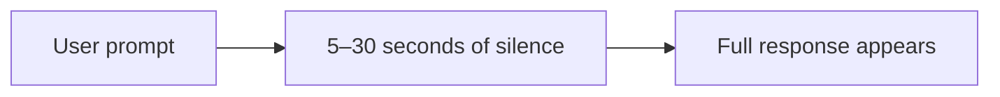
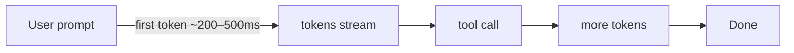
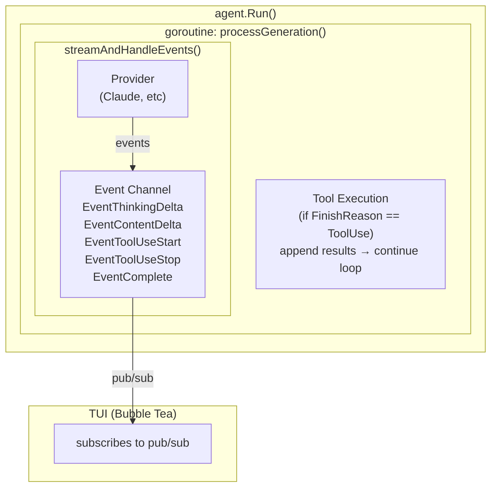
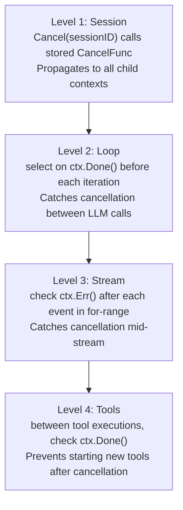
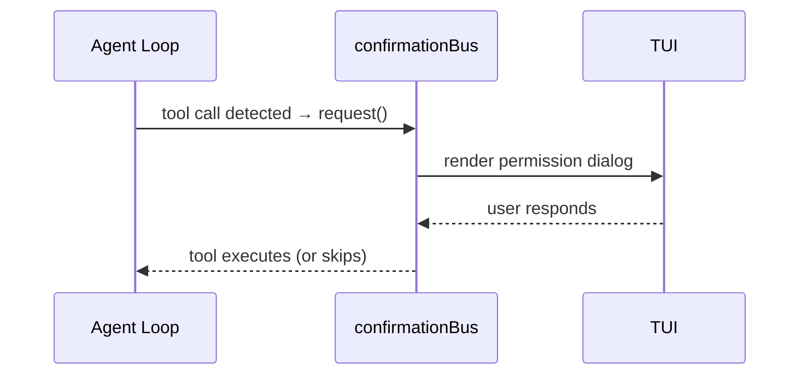
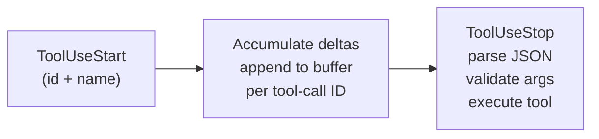
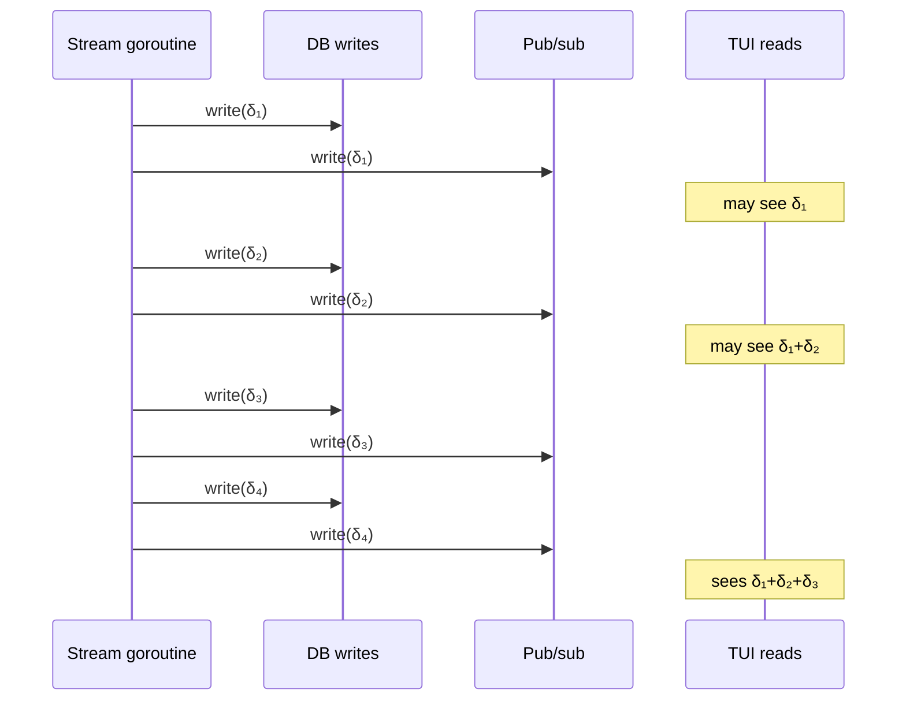
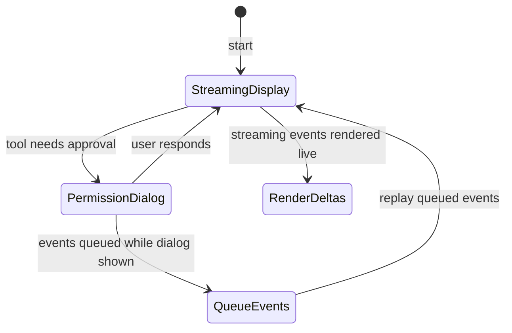
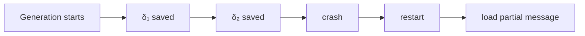
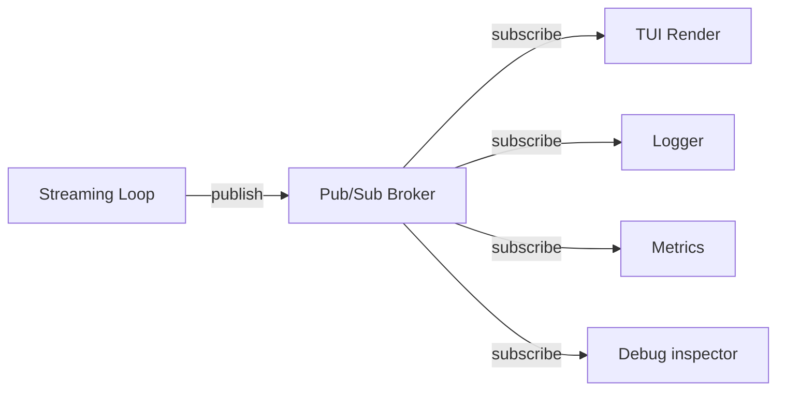

# Streaming Loops

> How agentic coding tools deliver real-time feedback while maintaining the
> tool-use loop — deep dive into OpenCode (Go), Goose (Rust), Gemini CLI
> (TypeScript), and the common patterns that emerge.

---

## Why Streaming Matters

### The Latency Problem

Without streaming, the user experience of an agentic coding tool looks like this:



The model may be generating hundreds of tokens, reasoning through a multi-step
plan, and assembling tool calls — but the user sees **nothing**. In a terminal
context, this feels broken. Users wonder if the tool crashed.

With streaming, the experience transforms:



Perceived latency drops from "seconds to minutes" to "fraction of a second to
first token." This is the difference between a tool that feels alive and one
that feels dead.

### Beyond UX: Functional Benefits

Streaming isn't just cosmetic. It enables critical capabilities:

1. **Mid-generation cancellation** — The user can press Ctrl+C or Esc *while
   the model is still generating*. Without streaming, you must wait for the
   entire response before you can act on it (or forcibly kill the connection and
   lose everything).

2. **Incremental tool call assembly** — Tool call arguments arrive token by
   token. Streaming lets the agent begin *preparing* for execution (validating
   the tool name, setting up sandbox) before the full JSON is received.

3. **Progressive rendering** — TUI frameworks like Bubble Tea can render
   markdown, syntax-highlighted code, and diff views incrementally, giving users
   a typewriter-like experience that conveys progress.

4. **Concurrent background work** — While the model streams its response, the
   agent can run background tasks: conversation title generation, context
   compaction, message summarization.

5. **Observability** — Streaming events create a natural audit trail. Each event
   can be logged, timed, and inspected for debugging.

---

## OpenCode's Go Streaming Loop

OpenCode implements streaming with Go's native concurrency primitives:
goroutines, channels, and `context.Context`. The architecture cleanly separates
the agent loop from the TUI rendering layer via a pub/sub system.

### Architecture Overview



### Entry Point: agent.Run()

```go
func (a *Agent) Run(ctx context.Context, sessionID string, content ...message.Content) <-chan AgentEvent {
    ch := make(chan AgentEvent, 64) // buffered channel for backpressure
    go func() {
        defer close(ch)
        // Enforce one active generation per session
        if _, loaded := a.active.LoadOrStore(sessionID, struct{}{}); loaded {
            ch <- a.err(errors.New("generation already in progress"))
            return
        }
        defer a.active.Delete(sessionID)

        // Store cancel func so TUI can call Cancel(sessionID)
        ctx, cancel := context.WithCancel(ctx)
        a.cancels.Store(sessionID, cancel)
        defer a.cancels.Delete(sessionID)
        defer cancel()

        // Run the generation loop
        for event := range a.processGeneration(ctx, sessionID, msgHistory) {
            ch <- event
        }
    }()
    return ch
}
```

Key design decisions:

- **`<-chan AgentEvent` return type** — The caller receives events as they
  happen. This is the idiomatic Go pattern for streaming results from a
  goroutine.
- **`sync.Map` for active sessions** — Prevents duplicate generations for the
  same session. The `LoadOrStore` atomic operation eliminates race conditions.
- **`CancelFunc` stored by session ID** — The TUI can call `Cancel(sessionID)`
  at any time, which propagates cancellation through the entire chain.
- **Buffered channel (capacity 64)** — Prevents the generation goroutine from
  blocking if the TUI is slow to consume events.

### The Core Loop: processGeneration()

This is the heart of the agentic loop, adapted for streaming:

```go
func (a *Agent) processGeneration(ctx context.Context, sessionID string, msgHistory []message.Message) <-chan AgentEvent {
    ch := make(chan AgentEvent)
    go func() {
        defer close(ch)
        for {
            // Check cancellation before each iteration
            select {
            case <-ctx.Done():
                ch <- a.err(ctx.Err())
                return
            default:
            }

            // Stream the LLM response and handle events in real-time
            agentMessage, toolResults, err := a.streamAndHandleEvents(ctx, sessionID, msgHistory)
            if err != nil {
                ch <- a.err(err)
                return
            }

            // The tool-use continuation decision
            if agentMessage.FinishReason() == message.FinishReasonToolUse && toolResults != nil {
                msgHistory = append(msgHistory, agentMessage, *toolResults)
                ch <- AgentEvent{Type: AgentEventTypeToolResult, ToolResults: toolResults}
                continue // ◄── back to top of loop for next LLM call
            }

            // No more tool calls — we're done
            ch <- AgentEvent{Type: AgentEventTypeResponse, Message: agentMessage, Done: true}
            return
        }
    }()
    return ch
}
```

The structure mirrors the classic agentic loop (call LLM → check for tool use →
execute tools → loop), but every step is wrapped in streaming infrastructure.
The `select` on `ctx.Done()` before each iteration is critical — it ensures
cancellation is checked even if the LLM call itself doesn't respect context.

### streamAndHandleEvents()

This function is where streaming actually happens:

```go
func (a *Agent) streamAndHandleEvents(
    ctx context.Context,
    sessionID string,
    msgHistory []message.Message,
) (message.Message, *message.Message, error) {

    // Start streaming from the provider (returns a channel)
    eventCh, err := a.provider.Stream(ctx, msgHistory, a.tools)
    if err != nil {
        return message.Message{}, nil, err
    }

    // Create an empty assistant message in the database
    assistantMsg := a.db.CreateMessage(sessionID, message.RoleAssistant)

    // Process events as they arrive
    for event := range eventCh {
        if ctx.Err() != nil {
            break // Cancelled — stop processing
        }

        switch event.Type {
        case provider.EventThinkingDelta:
            assistantMsg.AppendThinking(event.Content)
        case provider.EventContentDelta:
            assistantMsg.AppendContent(event.Content)
        case provider.EventToolUseStart:
            assistantMsg.StartToolUse(event.ToolID, event.ToolName)
        case provider.EventToolUseDelta:
            assistantMsg.AppendToolInput(event.ToolID, event.Content)
        case provider.EventToolUseStop:
            assistantMsg.FinalizeToolUse(event.ToolID)
        case provider.EventComplete:
            assistantMsg.SetUsage(event.Usage)
            assistantMsg.SetFinishReason(event.FinishReason)
        case provider.EventError:
            return message.Message{}, nil, event.Error
        }

        // Persist the updated message AND publish for TUI
        a.db.UpdateMessage(assistantMsg)
        a.pubsub.Publish(sessionID, assistantMsg)
    }

    // Execute any tool calls
    if assistantMsg.FinishReason() == message.FinishReasonToolUse {
        toolResults := a.executeTools(ctx, sessionID, assistantMsg.ToolCalls())
        return assistantMsg, &toolResults, nil
    }

    return assistantMsg, nil, nil
}
```

The dual-write pattern — update DB **and** publish to pub/sub on every event —
is what allows the TUI to render in real-time while maintaining crash recovery
capability. If the process dies mid-stream, the partial message is preserved in
the database.

### Context Cancellation at Every Level

OpenCode implements cancellation as a four-level defense:



A subtle detail: after cancellation, OpenCode uses `context.Background()` for
cleanup operations (saving the partial message, updating session state). This
prevents the cancelled context from interfering with necessary persistence.

---

## Goose's reply() → reply_internal() Streaming Pattern

Goose (Rust) takes a different approach using Rust's async streams (`BoxStream`)
and the `tokio` runtime. Where OpenCode uses goroutines and channels, Goose uses
Rust's `Stream` trait and `yield`-based generation.

### The reply() Pre-Loop

Before entering the streaming loop, `reply()` handles several short-circuit
paths:

```rust
pub async fn reply(&self, messages: &[Message]) -> Result<BoxStream<'_, Result<AgentEvent>>> {
    // 1. Handle elicitation responses — no LLM call needed
    if let Some(elicitation) = self.pending_elicitation.take() {
        return Ok(self.handle_elicitation(elicitation, messages).boxed());
    }

    // 2. Handle slash commands — processed locally
    if let Some(slash_cmd) = self.parse_slash_command(messages.last()) {
        return Ok(self.handle_slash_command(slash_cmd).boxed());
    }

    // 3. Persist the user message
    self.conversation.persist(messages).await?;

    // 4. Auto-compaction check
    //    If context usage > 80%, trigger compaction before the LLM call
    if self.context_usage() > 0.8 {
        self.compact_history().await?;
    }

    // 5. Delegate to the streaming internal loop
    Ok(self.reply_internal(messages).await?.boxed())
}
```

### reply_internal() — The Streaming Loop

```rust
async fn reply_internal(
    &self,
    messages: &[Message],
) -> Result<BoxStream<'_, Result<AgentEvent>>> {
    let stream = stream! {
        let mut history = messages.to_vec();

        loop {
            // Inject MOIM (Model-Oriented Instruction Messages) from extensions
            let moim_context = self.gather_moim_context().await;
            let augmented = self.inject_moim(history.clone(), moim_context);

            // Stream the LLM response
            let mut response_stream = self.provider.stream(&augmented, &self.tools).await?;

            // Background: spawn tool-pair summarization task
            let summarize_handle = tokio::spawn(
                self.summarize_tool_pairs(history.clone())
            );

            // Accumulate the response while yielding events
            let mut assistant_msg = Message::assistant();
            let mut tool_calls = Vec::new();

            while let Some(event) = response_stream.next().await {
                match event? {
                    StreamEvent::TextDelta(delta) => {
                        assistant_msg.append_text(&delta);
                        yield Ok(AgentEvent::Message(assistant_msg.clone()));
                    }
                    StreamEvent::ToolCallStart { id, name } => {
                        tool_calls.push(ToolCall::new(id, name));
                    }
                    StreamEvent::ToolCallDelta { id, content } => {
                        if let Some(tc) = tool_calls.iter_mut().find(|t| t.id == id) {
                            tc.append_input(&content);
                        }
                    }
                    StreamEvent::ToolCallEnd { id } => {
                        // Tool is fully assembled — categorize and maybe execute
                    }
                    StreamEvent::Done(usage) => {
                        assistant_msg.set_usage(usage);
                    }
                }
            }

            history.push(assistant_msg);

            // Execute tool calls if any
            if tool_calls.is_empty() {
                break;
            }

            let results = self.execute_tools_streaming(&tool_calls).await;

            // Merge tool results, yielding each as an event
            for result in &results {
                yield Ok(AgentEvent::Message(result.clone()));
            }

            history.push(Message::tool_results(results));

            // Await background summarization (non-blocking for the loop)
            let _ = summarize_handle.await;
        }
    };

    Ok(stream.boxed())
}
```

### The AgentEvent Stream

Goose's event type is minimal but covers all inter-layer communication:

```rust
pub enum AgentEvent {
    /// A message to display — text deltas, tool results, errors
    Message(Message),

    /// An MCP server sent a notification (logging, progress, etc.)
    McpNotification((String, ServerNotification)),

    /// The entire conversation history was replaced (compaction happened)
    HistoryReplaced(Conversation),
}
```

The `HistoryReplaced` variant is notable — when context compaction occurs
mid-session, the TUI needs to know that the entire conversation view should
refresh, not just append.

### Tool Execution with tokio::select!

Goose uses `tokio::select!` to merge multiple async streams during tool
execution, enabling concurrent tool runs with a unified output stream:

```rust
async fn execute_tools_streaming(&self, calls: &[ToolCall]) -> Vec<Message> {
    let (read_only, mutating): (Vec<_>, Vec<_>) = calls.iter()
        .partition(|tc| self.is_read_only(tc));

    // Read-only tools run in parallel
    let parallel_results = futures::future::join_all(
        read_only.iter().map(|tc| self.execute_tool(tc))
    ).await;

    // Mutating tools run sequentially
    let mut sequential_results = Vec::new();
    for tc in &mutating {
        // Check cancellation token before each mutating tool
        if self.cancellation_token.is_cancelled() {
            break;
        }
        sequential_results.push(self.execute_tool(tc).await);
    }

    [parallel_results, sequential_results].concat()
}
```

---

## Gemini CLI's TypeScript Streaming

Gemini CLI uses a different streaming architecture shaped by the Gemini API's
native features and TypeScript's async iteration.

### Content Generator with Token Caching

```typescript
async function* streamResponse(
  messages: Message[],
  tools: Tool[],
  systemInstruction: string
): AsyncGenerator<StreamEvent> {
  // Gemini-specific: system instructions are cached server-side
  // This avoids re-sending the full system prompt on every turn
  const cachedContent = await cacheSystemInstruction(systemInstruction);

  const response = await model.generateContentStream({
    contents: messages,
    tools: tools,
    cachedContent: cachedContent.name,
  });

  for await (const chunk of response.stream) {
    for (const candidate of chunk.candidates ?? []) {
      for (const part of candidate.content.parts ?? []) {
        if (part.text) {
          yield { type: 'text-delta', content: part.text };
        }
        if (part.functionCall) {
          yield {
            type: 'tool-call',
            name: part.functionCall.name,
            args: part.functionCall.args,
          };
        }
      }
    }
  }

  yield { type: 'done', usage: response.usageMetadata };
}
```

### Tool Scheduler: Parallel Read-Only Execution

Gemini CLI batches read-only tool calls for parallel execution:

```typescript
async function executeTools(
  toolCalls: ToolCall[],
  confirmationBus: ConfirmationBus
): Promise<ToolResult[]> {
  const readOnly = toolCalls.filter(tc => isReadOnly(tc.name));
  const mutating = toolCalls.filter(tc => !isReadOnly(tc.name));

  // Read-only tools run concurrently
  const readResults = await Promise.all(
    readOnly.map(tc => executeTool(tc))
  );

  // Mutating tools need confirmation and run sequentially
  const mutatingResults: ToolResult[] = [];
  for (const tc of mutating) {
    const approved = await confirmationBus.requestPermission(tc);
    if (!approved) {
      mutatingResults.push({ id: tc.id, error: 'User denied permission' });
      continue;
    }
    mutatingResults.push(await executeTool(tc));
  }

  return [...readResults, ...mutatingResults];
}
```

### Confirmation Bus for Permission Gates

The confirmation bus is a streaming-aware pattern that pauses the agent loop
while waiting for user input without breaking the stream:



---

## Challenges of Streaming Loops

### Tool Calls Arrive Incrementally

This is perhaps the trickiest aspect of streaming agentic loops. Unlike text
content (which can be displayed token-by-token), tool calls must be **fully
assembled** before execution.

```
Stream timeline:
  t0: EventToolUseStart { id: "tc_1", name: "edit_file" }
  t1: EventToolUseDelta { id: "tc_1", content: '{"path":' }
  t2: EventToolUseDelta { id: "tc_1", content: ' "/src/ma' }
  t3: EventToolUseDelta { id: "tc_1", content: 'in.go", "' }
  t4: EventToolUseDelta { id: "tc_1", content: 'old_str":' }
  ...
  tN: EventToolUseStop  { id: "tc_1" }

  Only at tN can you parse the full JSON and execute the tool.
```

The accumulation pattern is consistent across all implementations:



**Risk: malformed JSON** — If the stream is interrupted (network error, context
cancellation, rate limit), the accumulated JSON may be incomplete. Robust
implementations wrap the parse in error handling and treat partial tool calls as
failed:

```go
func (m *Message) FinalizeToolUse(toolID string) error {
    tc := m.GetToolCall(toolID)
    var args map[string]interface{}
    if err := json.Unmarshal([]byte(tc.RawInput), &args); err != nil {
        tc.Status = ToolCallStatusFailed
        tc.Error = fmt.Sprintf("malformed tool call JSON: %v", err)
        return err
    }
    tc.ParsedArgs = args
    tc.Status = ToolCallStatusReady
    return nil
}
```

### Cancellation During Streaming

Cancellation is harder than it appears because you must handle **partial state
gracefully**:

| Agent    | Cancellation Mechanism              | Cleanup Strategy                          |
|----------|-------------------------------------|-------------------------------------------|
| OpenCode | `context.CancelFunc` per session    | `context.Background()` for DB writes      |
| Goose    | `CancellationToken` checked at loop | Save partial message, mark as interrupted |
| Codex    | `Op::Interrupt` enum variant        | Cancel stream + abort running tools       |

The critical insight: **cancellation must not lose data**. Whatever the model
has generated so far should be preserved. OpenCode's approach of switching to
`context.Background()` for cleanup is elegant — it says "the generation is
cancelled, but the save operation is not."

```go
// After ctx is cancelled, use a fresh context for cleanup
cleanupCtx := context.Background()
a.db.UpdateMessage(cleanupCtx, partialMessage) // Must succeed
a.pubsub.Publish(sessionID, AgentEvent{Type: AgentEventTypeCancelled})
```

### State Consistency Under Concurrent Updates

Streaming creates a challenging concurrency scenario:



Each delta updates the DB immediately. In theory, a TUI read could see a
partially-updated message (e.g., tool call started but not finished). Mitigations:

- **Immutable snapshots**: Clone the message before publishing so the TUI always
  sees a consistent snapshot.
- **Sequence numbers**: Attach monotonically increasing sequence numbers to
  events so the TUI can detect out-of-order delivery.
- **Eventual consistency**: Accept that the TUI may briefly show stale state;
  the next event will correct it.

---

## Bubble Tea Integration with Streaming

OpenCode and similar TUI-based agents use [Bubble Tea](https://github.com/charmbracelet/bubbletea),
a Go framework based on The Elm Architecture. Integrating streaming events with
Bubble Tea requires a bridge between the agent's pub/sub system and Bubble Tea's
message-based update loop.

### The Bridge Pattern

```go
// In the TUI initialization, subscribe to agent events
func (m Model) Init() tea.Cmd {
    return func() tea.Msg {
        // Subscribe to the agent's pub/sub
        sub := m.pubsub.Subscribe(m.sessionID)
        for event := range sub {
            m.program.Send(event) // Forward to Bubble Tea's event loop
        }
        return nil
    }
}

// In the Update function, handle agent events
func (m Model) Update(msg tea.Msg) (tea.Model, tea.Cmd) {
    switch msg := msg.(type) {
    case AgentEvent:
        switch msg.Type {
        case AgentEventTypeContentDelta:
            m.currentMessage.Append(msg.Content)
            // Re-render the message view
        case AgentEventTypeToolUseStart:
            m.toolStatus[msg.ToolID] = "running"
            // Show tool execution indicator
        case AgentEventTypeToolResult:
            m.toolStatus[msg.ToolID] = "complete"
            // Show tool result
        case AgentEventTypeDone:
            m.isGenerating = false
            // Show input prompt
        }
    case tea.KeyMsg:
        if msg.String() == "ctrl+c" && m.isGenerating {
            m.agent.Cancel(m.sessionID) // ◄── triggers cancellation chain
            return m, nil
        }
    }
    return m, nil
}
```

### Permission Dialogs Must Interrupt Streaming

When a tool requires user approval, the streaming display must pause to show a
permission dialog. This creates a state machine within the TUI:



Events that arrive while the permission dialog is showing must be queued, not
dropped. Once the user responds, the queued events are replayed and rendering
resumes.

---

## Streaming vs Non-Streaming: Trade-offs

| Aspect                  | Non-Streaming                      | Streaming                                |
|-------------------------|------------------------------------|------------------------------------------|
| Perceived latency       | High (wait for full response)      | Low (first token in ~200ms)              |
| Implementation          | Simple — one request/response      | Complex — event loop, state machine      |
| Cancellation            | Must wait or kill connection       | Graceful mid-generation cancel           |
| Tool call handling      | Full JSON available immediately    | Incremental assembly required            |
| Error handling          | Clean — atomic success/failure     | Must handle partial state, partial JSON  |
| Debugging               | Easy — inspect full request/resp   | Hard — state spread across many events   |
| Memory usage            | Full response buffered             | Can process incrementally                |
| Crash recovery          | Lost if not saved                  | Partial state saved to DB on each event  |
| TUI integration         | Simple — render once               | Complex — incremental rendering          |
| Background concurrency  | None until response complete       | Background tasks during generation       |

---

## Patterns and Best Practices

### 1. Always Save Partial State on Cancellation

Never discard what the model has generated. Use a separate context for cleanup:

```go
// Pattern: detach cleanup from the cancelled context
func saveOnCancel(ctx context.Context, db DB, msg Message) {
    <-ctx.Done()
    cleanupCtx, cancel := context.WithTimeout(context.Background(), 5*time.Second)
    defer cancel()
    db.Save(cleanupCtx, msg)
}
```

### 2. Use Event Types to Distinguish Content from Tool Calls

A single stream carries multiple semantic types. Use explicit event
discriminators rather than heuristics:

```go
type EventType int
const (
    EventThinkingDelta EventType = iota  // Extended thinking / reasoning
    EventContentDelta                     // Visible text content
    EventToolUseStart                     // Tool call begins
    EventToolUseDelta                     // Tool call argument fragment
    EventToolUseStop                      // Tool call fully received
    EventComplete                         // Generation finished
    EventError                            // Error occurred
)
```

### 3. Database-Backed Message Accumulation

Write every delta to the database. This provides crash recovery and enables the
"resume after restart" pattern:



### 4. Pub/Sub for Decoupling Streaming from Rendering

Never have the streaming goroutine directly update TUI state. Use a pub/sub
layer to decouple the producer (streaming) from the consumer (rendering):



This also enables multiple subscribers: a logger, a metrics collector, a debug
tool — all receiving the same events without the streaming loop knowing about
them.

### 5. Background Tasks Concurrent with Streaming

While the model generates, run housekeeping tasks in parallel:

```go
// Start background tasks before streaming
go a.generateTitle(ctx, sessionID, userMessage)           // conversation title
go a.summarizeOldToolPairs(ctx, sessionID, msgHistory)    // context management
go a.checkContextUsage(ctx, sessionID)                    // compaction trigger

// Stream the response (these run concurrently)
for event := range provider.Stream(ctx, messages, tools) {
    handleEvent(event)
}
```

### 6. Backpressure-Aware Channel Sizing

Choose buffer sizes carefully. Too small: the streaming goroutine blocks waiting
for the TUI to consume. Too large: memory waste and delayed cancellation
response.

```go
// Rule of thumb: buffer enough for ~1 second of events
// At ~50 tokens/sec, each producing 1-2 events: buffer of 64-128
ch := make(chan AgentEvent, 64)
```

### 7. Graceful Degradation on Stream Errors

If the stream fails mid-generation, save what you have and surface the error
clearly:

```go
for event := range eventCh {
    if event.Type == provider.EventError {
        // Save partial message
        assistantMsg.SetFinishReason(message.FinishReasonError)
        assistantMsg.AppendContent("\n\n[Stream error: " + event.Error.Error() + "]")
        a.db.UpdateMessage(assistantMsg)
        return assistantMsg, nil, event.Error
    }
    // ... normal processing
}
```

---

## Summary

Streaming transforms the agentic loop from a synchronous call-and-response
pattern into an event-driven architecture. The core loop remains the same —
call LLM, check for tools, execute, repeat — but every step now emits events
that flow through channels (Go), async streams (Rust), or async generators
(TypeScript) to reach the user interface in real-time.

The key architectural decisions are:

1. **How events flow**: channels vs streams vs generators
2. **How cancellation propagates**: context vs tokens vs signals
3. **How state persists**: DB writes on every delta vs periodic checkpoints
4. **How rendering decouples**: pub/sub vs direct callbacks vs message passing

Every production agentic coding tool has converged on streaming as a
requirement, not an optimization. The perceived latency improvement alone
justifies the complexity, and the additional capabilities (cancellation,
progressive rendering, concurrent background work) make it indispensable.
