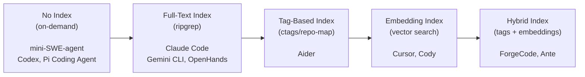
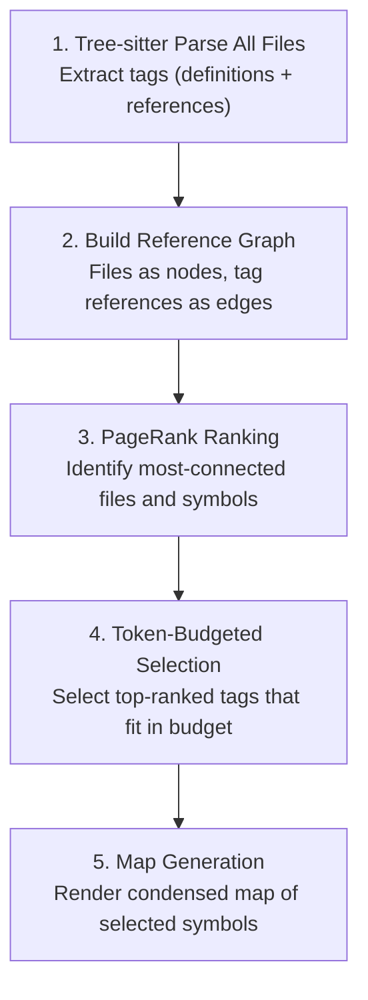
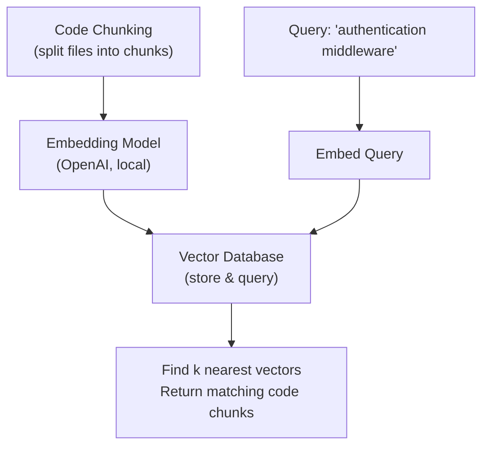
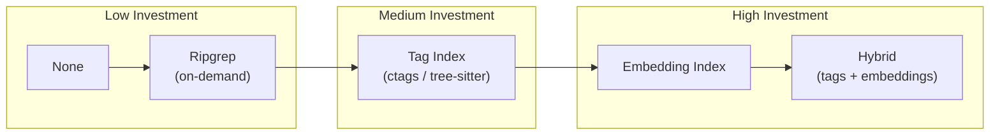

# Codebase Indexing

> How coding agents build searchable indexes over codebases — from full-text search to embedding-based semantic search to Aider's tag-based repo map with graph ranking.

## Overview

Codebase indexing is the infrastructure that enables agents to find relevant code quickly. Without an index, agents must search the codebase linearly — reading files one by one or running text searches that may miss semantically related code. With a good index, agents can jump directly to the most relevant code, dramatically improving both speed and accuracy.

The indexing strategies used by coding agents fall along a spectrum:



| Strategy | Startup Cost | Query Speed | Semantic Awareness | Storage |
|---|---|---|---|---|
| **No Index** | None | Slow (linear scan) | None | None |
| **Full-Text Index** | None (ripgrep) | Fast | None (literal matching) | None |
| **Tag-Based Index** | Seconds | Fast | Structural only | Small (KB) |
| **Embedding Index** | Minutes | Fast | Full semantic | Large (MB-GB) |
| **Hybrid** | Seconds-Minutes | Fast | Structural + Semantic | Medium |

---

## Full-Text Search Indexes

### Ripgrep as the Universal Search Tool

Ripgrep (rg) is the most widely used search tool across all 17 agents. It's not technically an index — it performs on-demand full-text search — but its speed (searching gigabytes in seconds) makes it functionally equivalent to an index for many use cases.

```bash
# How agents typically invoke ripgrep
rg --type py "class UserService" --json --max-count 20
rg --glob "*.ts" "export function" -l
rg "TODO|FIXME|HACK" --count-matches
```

**Agents using ripgrep as primary search:**
- Claude Code (`Grep` tool — wraps ripgrep)
- Codex (shell-based ripgrep)
- OpenHands (ripgrep through shell)
- Gemini CLI (ripgrep through shell)
- OpenCode (integrated ripgrep)
- ForgeCode (ripgrep + semantic layer)

**Why ripgrep works well enough for many agents:**
1. **No startup cost** — no index to build, immediately available
2. **Always current** — searches the actual filesystem, never stale
3. **Configurable** — supports regex, file type filtering, context lines
4. **Fast** — uses memory-mapped I/O, SIMD acceleration, parallel directory walking

**Limitations of ripgrep for agents:**
1. **No semantic understanding** — `rg "process"` returns every occurrence, including comments, strings, and unrelated identifiers
2. **No ranking** — results are ordered by file path, not relevance
3. **No relationship awareness** — cannot find "all callers of this function" without regex heuristics
4. **Query formulation burden** — the LLM must formulate good search queries, which it often does poorly

### Custom Full-Text Indexes

Some agents build lightweight inverted indexes for faster repeated searches:

```python
# Simplified inverted index for code search
class CodeIndex:
    def __init__(self):
        self.index = defaultdict(set)  # token -> set of (file, line) pairs

    def add_file(self, filepath, content):
        for line_num, line in enumerate(content.splitlines()):
            tokens = self.tokenize(line)
            for token in tokens:
                self.index[token].add((filepath, line_num))

    def search(self, query):
        tokens = self.tokenize(query)
        if not tokens:
            return set()
        results = self.index[tokens[0]]
        for token in tokens[1:]:
            results &= self.index[token]
        return results

    def tokenize(self, text):
        # Split on word boundaries, lowercase, filter noise
        return [w.lower() for w in re.findall(r'\b\w+\b', text)
                if len(w) > 2 and w not in STOP_WORDS]
```

---

## Tag-Based Indexing

### Universal Ctags

Universal Ctags (successor to Exuberant Ctags) generates tag files that map symbol names to file locations. It's been the standard code navigation tool for decades:

```bash
# Generate tags for a project
ctags -R --fields=+lnS --extras=+q .

# Output format (tags file)
# TAG_NAME    FILE_PATH    LINE_NUMBER;"    KIND    EXTRAS
UserService   src/services/user.ts    15;"    c    class
createUser    src/services/user.ts    23;"    m    method
handleRequest src/api/routes.ts       45;"    f    function
```

**Ctags strengths:**
- Extremely fast generation (seconds for large codebases)
- Supports 100+ languages
- Simple file format, easy to parse
- Low memory footprint

**Ctags limitations:**
- No reference tracking (only definitions)
- Limited semantic information (no types, no call relationships)
- No incremental updates (must regenerate for changes)
- Coarse granularity (line-level, not byte-level)

### Tree-sitter Tags

Tree-sitter provides a more modern alternative to ctags, with finer granularity and reference tracking:

```python
# Tree-sitter tag extraction (used by Aider)
def get_tags(filename, content, language):
    parser = get_parser(language)
    tree = parser.parse(content.encode())

    query = get_tag_query(language)  # Language-specific .scm file
    captures = query.captures(tree.root_node)

    tags = []
    for node, capture_name in captures:
        tag = Tag(
            name=node.text.decode(),
            fname=filename,
            line=node.start_point[0],
            kind="def" if "definition" in capture_name else "ref",
            category=capture_name.split(".")[1],  # function, class, etc.
        )
        tags.append(tag)
    return tags
```

**Tree-sitter advantages over ctags:**
- Tracks both definitions AND references
- Byte-level precision (exact character positions)
- Incremental parsing support
- Richer structural information (node types, parent context)
- Better handling of modern syntax (JSX, decorators, generics)

---

## Aider's Repo Map: The Gold Standard

Aider's repo map is the most sophisticated indexing approach among CLI coding agents. It deserves detailed analysis because it demonstrates how much can be achieved with relatively simple techniques combined cleverly.

### Architecture



### Step 1: Tag Extraction

Aider parses every file in the repository using tree-sitter and extracts two types of tags:

- **Definition tags**: Where a symbol is defined (function def, class def, variable assignment)
- **Reference tags**: Where a symbol is used (function call, attribute access, import)

```python
# Simplified from aider/repomap.py
def get_tags(self, fname, rel_fname):
    content = self.io.read_text(fname)
    if not content:
        return []

    language = filename_to_lang(fname)
    if not language:
        return []

    parser = self.get_parser(language)
    tree = parser.parse(bytes(content, "utf-8"))

    query = self.get_query(language)
    captures = query.captures(tree.root_node)

    tags = []
    for node, tag_name in captures:
        kind = "def" if "definition" in tag_name else "ref"
        tags.append(Tag(
            rel_fname=rel_fname,
            fname=fname,
            name=node.text.decode("utf-8"),
            kind=kind,
            line=node.start_point[0],
        ))
    return tags
```

### Step 2: Graph Construction

Tags are assembled into a directed graph:
- **Nodes**: Files in the repository
- **Edges**: File A → File B when File A references a symbol defined in File B

```python
def build_graph(self, tags_by_file):
    G = nx.MultiDiGraph()

    defines = defaultdict(set)    # symbol_name -> set of files defining it
    references = defaultdict(set) # symbol_name -> set of files referencing it

    for fname, tags in tags_by_file.items():
        for tag in tags:
            if tag.kind == "def":
                defines[tag.name].add(fname)
            else:
                references[tag.name].add(fname)

    for symbol_name in defines:
        for definer in defines[symbol_name]:
            for referencer in references.get(symbol_name, []):
                if definer != referencer:
                    G.add_edge(referencer, definer)

    return G
```

### Step 3: PageRank Ranking

The graph is analyzed with PageRank to find the most important files and symbols. Files that are referenced by many other files rank highest — they are the core of the codebase.

```python
def rank_files(self, graph, chat_fnames):
    # Personalization vector boosts files mentioned in the chat
    personalization = {}
    for fname in graph.nodes:
        if fname in chat_fnames:
            personalization[fname] = 10.0  # Boost chat files
        else:
            personalization[fname] = 1.0

    ranked = nx.pagerank(
        graph,
        personalization=personalization,
        weight="weight"
    )
    return sorted(ranked.items(), key=lambda x: -x[1])
```

### Step 4: Token-Budgeted Selection

The ranked tags are selected to fit within a token budget (default 1024 tokens, dynamically adjusted):

```python
def get_repo_map(self, chat_fnames, other_fnames):
    ranked_tags = self.get_ranked_tags(chat_fnames, other_fnames)

    map_text = ""
    token_count = 0
    max_tokens = self.max_map_tokens

    for tag in ranked_tags:
        tag_text = self.render_tag(tag)
        tag_tokens = self.token_count(tag_text)
        if token_count + tag_tokens > max_tokens:
            break
        map_text += tag_text
        token_count += tag_tokens

    return map_text
```

### Step 5: Map Rendering

The selected symbols are rendered in a condensed format:

```
src/auth/middleware.ts:
⋮...
│export function authMiddleware(req: Request, res: Response, next: NextFunction):
⋮...
│export function validateToken(token: string): Promise<User>:
⋮...

src/models/user.ts:
⋮...
│export class User:
│    id: string
│    email: string
│    name: string
⋮...
│    toJSON(): UserDTO
⋮...

src/api/routes.ts:
⋮...
│export function registerRoutes(app: Express):
⋮...
│    app.post('/users', createUser)
│    app.get('/users/:id', getUser)
⋮...
```

### Dynamic Token Budget

Aider adjusts the repo map size based on context:

- **No chat files selected**: Map expands significantly to give the LLM broad codebase awareness
- **Many chat files selected**: Map shrinks because the LLM already has detailed file content
- **Configurable via `--map-tokens`**: Default 1024 tokens, can be increased for large context models

---

## Embedding-Based Semantic Search

### How Embedding Search Works

Embedding-based search converts code into high-dimensional vectors that capture semantic meaning. Similar code produces similar vectors, enabling "fuzzy" search that finds conceptually related code even when the exact words differ.

```
Code Snippet                    Embedding Vector
────────────────                ──────────────────
"def authenticate(user)"  →    [0.23, -0.45, 0.67, ..., 0.12]
"function login(creds)"   →    [0.21, -0.42, 0.65, ..., 0.14]  ← Similar!
"def parse_csv(path)"     →    [0.78, 0.33, -0.22, ..., 0.56]  ← Different
```

### Architecture of Embedding-Based Code Search



### Code Chunking Strategies

How code is split into chunks dramatically affects search quality:

| Strategy | Description | Pros | Cons |
|---|---|---|---|
| **Fixed-size** | Split every N tokens | Simple | Breaks mid-function |
| **Line-based** | Split every N lines | Preserves readability | Arbitrary boundaries |
| **Function-level** | One chunk per function | Semantically meaningful | Functions vary wildly in size |
| **AST-aware** | Split at AST boundaries | Best semantic units | Requires parsing |
| **Sliding window** | Overlapping fixed-size chunks | No information loss | Redundant storage |

The best approach is **AST-aware chunking** — using tree-sitter to split code at function and class boundaries:

```python
def chunk_file_by_ast(filepath, content, language):
    parser = get_parser(language)
    tree = parser.parse(content.encode())

    chunks = []
    for node in tree.root_node.children:
        if node.type in ('function_definition', 'class_definition',
                          'function_declaration', 'class_declaration'):
            chunk_text = content[node.start_byte:node.end_byte]
            chunks.append(CodeChunk(
                filepath=filepath,
                content=chunk_text,
                start_line=node.start_point[0],
                end_line=node.end_point[0],
                symbol_type=node.type,
            ))

    # Also create a chunk for module-level code
    module_chunk = extract_module_level(tree.root_node, content)
    if module_chunk:
        chunks.append(module_chunk)

    return chunks
```

### Embedding Models for Code

| Model | Dimensions | Context | Code-Optimized | Access |
|---|---|---|---|---|
| **OpenAI text-embedding-3-small** | 1536 | 8K tokens | Partial | API |
| **OpenAI text-embedding-3-large** | 3072 | 8K tokens | Partial | API |
| **Voyage Code 3** | 1024 | 16K tokens | Yes | API |
| **CodeBERT** | 768 | 512 tokens | Yes | Local |
| **StarEncoder** | 768 | 8K tokens | Yes | Local |
| **Nomic Embed Code** | 768 | 8K tokens | Yes | Local |

**Trade-offs:**
- API models (OpenAI, Voyage) offer better quality but require network access and incur costs
- Local models (CodeBERT, Nomic) work offline but may have lower quality for niche languages
- Code-specific models outperform general-purpose models on code search tasks

### IDE Agents Using Embedding Search

**Cursor** uses embedding-based indexing as a core feature:
- Indexes the entire codebase on project open
- Uses custom embedding models optimized for code
- Stores embeddings locally for fast retrieval
- Supports hybrid search (embeddings + keyword)

**Sourcegraph Cody** uses a multi-layered approach:
- Keyword search via Sourcegraph's code search infrastructure
- Code graph analysis for structural context
- Embedding-based search for semantic queries

**Why most CLI agents don't use embeddings:**
1. **Startup cost**: Embedding a large codebase takes minutes (API calls or local model inference)
2. **Storage**: Embedding vectors require persistent storage (MB-GB depending on codebase size)
3. **Dependency**: API-based embeddings require network access; local models require GPU or large CPU
4. **Staleness**: Embeddings must be updated when code changes, adding complexity

---

## Incremental Indexing

For agents that maintain persistent indexes, incremental updates are crucial — re-indexing the entire codebase after every edit is wasteful.

### File-Level Incremental Updates

The simplest approach: track file modification times and re-index only changed files:

```python
class IncrementalIndex:
    def __init__(self, cache_path):
        self.cache = self.load_cache(cache_path)
        # cache = {filepath: {"mtime": float, "tags": [...], "embedding": [...]}}

    def update(self, repo_root):
        changed_files = []
        for filepath in walk_repo(repo_root):
            mtime = os.path.getmtime(filepath)
            cached = self.cache.get(filepath)
            if not cached or cached["mtime"] < mtime:
                changed_files.append(filepath)

        for filepath in changed_files:
            tags = extract_tags(filepath)
            self.cache[filepath] = {
                "mtime": os.path.getmtime(filepath),
                "tags": tags,
            }

        # Remove deleted files
        existing = set(walk_repo(repo_root))
        for cached_path in list(self.cache.keys()):
            if cached_path not in existing:
                del self.cache[cached_path]

        self.save_cache()
```

### Git-Based Change Detection

A more efficient approach: use `git diff` to identify changed files since the last index update:

```python
def get_changed_files_since(last_commit_sha):
    result = subprocess.run(
        ["git", "diff", "--name-only", last_commit_sha, "HEAD"],
        capture_output=True, text=True
    )
    changed = result.stdout.strip().splitlines()

    # Also include untracked/modified files in working directory
    result = subprocess.run(
        ["git", "status", "--porcelain"],
        capture_output=True, text=True
    )
    for line in result.stdout.strip().splitlines():
        status, filepath = line[:2], line[3:]
        changed.append(filepath)

    return list(set(changed))
```

### Aider's Cache Strategy

Aider caches its repo map and invalidates based on file changes:

```python
class RepoMap:
    def __init__(self):
        self.TAGS_CACHE = {}  # (filename, mtime) -> tags

    def get_tags(self, fname, rel_fname):
        mtime = os.path.getmtime(fname)
        cache_key = (fname, mtime)

        if cache_key in self.TAGS_CACHE:
            return self.TAGS_CACHE[cache_key]

        tags = self.compute_tags(fname)
        self.TAGS_CACHE[cache_key] = tags
        return tags
```

---

## Index Persistence

### Where to Store Indexes

| Location | Pros | Cons |
|---|---|---|
| **In-memory only** | No disk I/O, always fresh | Lost on restart, must rebuild |
| **Project directory (.aider/)** | Shared across sessions, git-ignorable | Pollutes project directory |
| **User cache (~/.cache/agent/)** | Clean project directory | Not shared between machines |
| **Database (SQLite)** | Queryable, ACID, efficient | Additional dependency |
| **Cloud storage** | Shared across machines | Requires network, privacy concerns |

Most CLI agents use in-memory-only indexes (rebuilt on every session start) or lightweight file caches:

```python
# SQLite-based index persistence
import sqlite3

class PersistentIndex:
    def __init__(self, db_path):
        self.conn = sqlite3.connect(db_path)
        self.conn.execute("""
            CREATE TABLE IF NOT EXISTS file_tags (
                filepath TEXT,
                symbol_name TEXT,
                symbol_kind TEXT,
                line_number INTEGER,
                mtime REAL,
                PRIMARY KEY (filepath, symbol_name, line_number)
            )
        """)
        self.conn.execute("""
            CREATE INDEX IF NOT EXISTS idx_symbol_name
            ON file_tags(symbol_name)
        """)

    def search_symbol(self, name):
        cursor = self.conn.execute(
            "SELECT * FROM file_tags WHERE symbol_name LIKE ?",
            (f"%{name}%",)
        )
        return cursor.fetchall()

    def update_file(self, filepath, tags, mtime):
        self.conn.execute("DELETE FROM file_tags WHERE filepath = ?", (filepath,))
        for tag in tags:
            self.conn.execute(
                "INSERT INTO file_tags VALUES (?, ?, ?, ?, ?)",
                (filepath, tag.name, tag.kind, tag.line, mtime)
            )
        self.conn.commit()
```

---

## Comparative Analysis: Indexing Approaches

### When to Use Which Approach

| Scenario | Best Approach | Rationale |
|---|---|---|
| Small project (< 100 files) | No index (ripgrep) | Overhead not justified |
| Medium project, single session | Tag-based (tree-sitter) | Fast to build, good structural awareness |
| Large project, repeated sessions | Persistent tag index | Amortize build cost across sessions |
| Semantic queries ("find auth code") | Embedding index | Keyword search insufficient |
| IDE integration | Hybrid (tags + embeddings) | Best of both worlds |
| CI/CD pipeline | Pre-built index | Build once, use many times |

### Cost-Benefit Analysis



---

## Key Takeaways

1. **Ripgrep is good enough for most CLI agents.** Its zero-startup-cost model and fast search make it the pragmatic default. Don't build an index unless you've proven ripgrep is insufficient.

2. **Aider's repo map is the gold standard for tag-based indexing.** The combination of tree-sitter, graph construction, and PageRank ranking is elegant and effective.

3. **Embedding search is overkill for most CLI agent use cases.** The startup cost, storage requirements, and staleness management make it better suited for IDE integrations.

4. **Incremental updates are essential for any persistent index.** Rebuilding from scratch on every session is acceptable for small projects but doesn't scale.

5. **The future is hybrid.** As models get larger context windows, the role of indexing shifts from "what to include" to "what to prioritize" — and that requires both structural (tag-based) and semantic (embedding-based) signals.