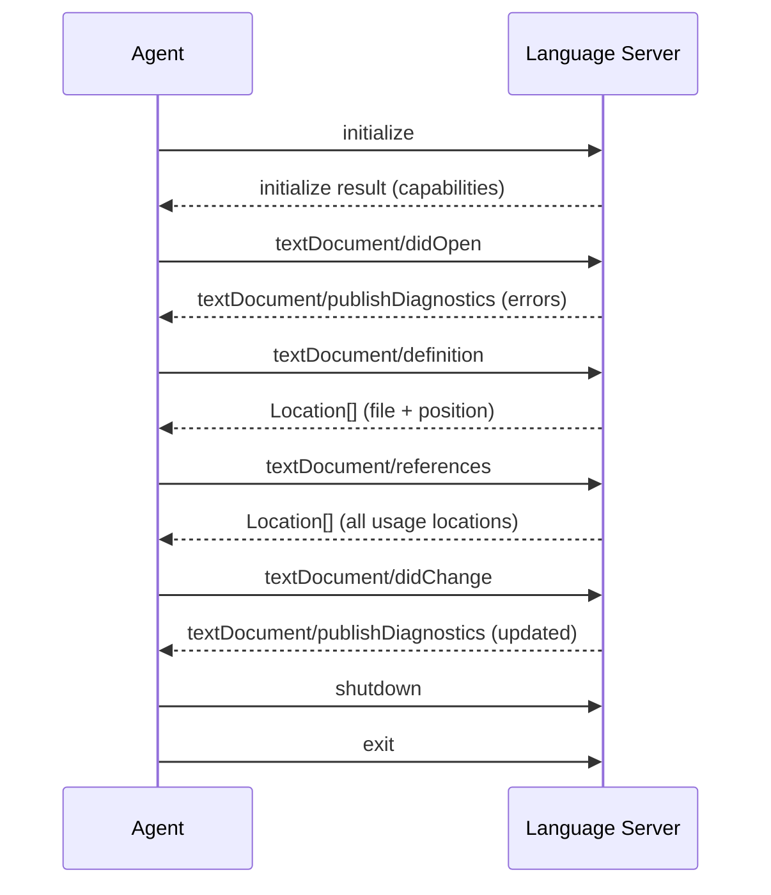
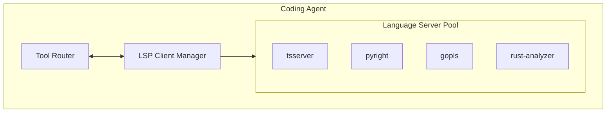

# Language Server Protocol (LSP) Integration

> How coding agents can leverage the Language Server Protocol for compiler-grade code understanding — go-to-definition, find-references, hover info, diagnostics — and why most CLI agents don't.

## Overview

The Language Server Protocol is the most powerful code understanding tool available to coding agents, yet it's also the most underutilized. LSP provides **compiler-grade** understanding of code: exact type information, precise symbol resolution, complete reference graphs, and real-time error detection. No other technique — not tree-sitter, not ripgrep, not embeddings — comes close to the accuracy LSP provides.

Despite this, only 2 of the 17 agents studied use LSP meaningfully:

| Agent | LSP Usage | Details |
|---|---|---|
| **Junie CLI** | Full integration | Inherits JetBrains platform's complete LSP-like system (PSI) |
| **OpenCode** | Partial integration | Uses LSP for Go-focused development |
| **Claude Code** | Diagnostics only | Can read compiler/linter diagnostics but doesn't use go-to-def |
| **Warp** | Via IDE | Inherits IDE's LSP when embedded |
| **All others** | None | No LSP integration |

This represents the largest opportunity gap in the CLI coding agent ecosystem.

---

## LSP Fundamentals

### What LSP Provides

The Language Server Protocol, created by Microsoft for VS Code, standardizes the communication between development tools and language-specific intelligence servers. A language server runs as a separate process and provides:

| Capability | LSP Method | What It Gives Agents |
|---|---|---|
| **Go to Definition** | `textDocument/definition` | Find where a symbol is defined |
| **Find References** | `textDocument/references` | Find all usages of a symbol |
| **Hover Information** | `textDocument/hover` | Get type info and documentation |
| **Completions** | `textDocument/completion` | Context-aware code completions |
| **Diagnostics** | `textDocument/publishDiagnostics` | Errors, warnings, type mismatches |
| **Symbol Search** | `workspace/symbol` | Find symbols by name across workspace |
| **Rename** | `textDocument/rename` | Rename a symbol across all files |
| **Call Hierarchy** | `callHierarchy/incomingCalls` | Who calls this function? |
| **Type Hierarchy** | `typeHierarchy/supertypes` | Inheritance chain |
| **Semantic Tokens** | `textDocument/semanticTokens` | Rich syntax classification |
| **Code Actions** | `textDocument/codeAction` | Quick fixes, refactorings |

### The LSP Communication Protocol

LSP uses JSON-RPC over stdio or TCP. The protocol is stateful — the client (agent) must maintain a session with the server:



### JSON-RPC Examples

**Go to Definition request:**
```json
{
  "jsonrpc": "2.0",
  "id": 1,
  "method": "textDocument/definition",
  "params": {
    "textDocument": {
      "uri": "file:///project/src/api/routes.ts"
    },
    "position": {
      "line": 15,
      "character": 22
    }
  }
}
```

**Response:**
```json
{
  "jsonrpc": "2.0",
  "id": 1,
  "result": {
    "uri": "file:///project/src/services/user.ts",
    "range": {
      "start": { "line": 42, "character": 16 },
      "end": { "line": 42, "character": 30 }
    }
  }
}
```

**Find References request:**
```json
{
  "jsonrpc": "2.0",
  "id": 2,
  "method": "textDocument/references",
  "params": {
    "textDocument": {
      "uri": "file:///project/src/services/user.ts"
    },
    "position": {
      "line": 42,
      "character": 22
    },
    "context": {
      "includeDeclaration": true
    }
  }
}
```

**Hover request (get type info):**
```json
{
  "jsonrpc": "2.0",
  "id": 3,
  "method": "textDocument/hover",
  "params": {
    "textDocument": {
      "uri": "file:///project/src/api/routes.ts"
    },
    "position": {
      "line": 15,
      "character": 22
    }
  }
}
```

**Hover response:**
```json
{
  "jsonrpc": "2.0",
  "id": 3,
  "result": {
    "contents": {
      "kind": "markdown",
      "value": "```typescript\n(method) UserService.createUser(data: CreateUserDTO): Promise<User>\n```\nCreates a new user with the given data.\n@param data - The user creation data\n@returns The created user"
    }
  }
}
```

---

## Major Language Servers

### TypeScript: tsserver / typescript-language-server

The TypeScript language server provides the deepest language intelligence available:

| Feature | Support Level | Notes |
|---|---|---|
| Go to Definition | Excellent | Handles JS, TS, JSX, TSX |
| Find References | Excellent | Cross-file, includes imports |
| Hover / Type Info | Excellent | Full inferred types, JSDoc |
| Completions | Excellent | Context-aware, auto-imports |
| Diagnostics | Excellent | Type errors, unused variables |
| Call Hierarchy | Good | Incoming and outgoing calls |
| Rename | Excellent | Project-wide rename |
| Semantic Tokens | Good | Full semantic classification |

**Starting tsserver for an agent:**
```bash
# Using typescript-language-server (wrapper around tsserver)
npx typescript-language-server --stdio

# Or directly using tsserver
npx tsserver --stdio
```

**Configuration for agent use:**
```json
{
  "typescript.suggest.autoImports": true,
  "typescript.inlayHints.parameterNames.enabled": "all",
  "typescript.preferences.includePackageJsonAutoImports": "on"
}
```

### Python: Pyright / Pylsp

**Pyright** (Microsoft) is the fastest and most accurate Python language server:

| Feature | Pyright | Pylsp (Jedi-based) |
|---|---|---|
| Type Checking | Excellent (strict mode) | Good (inference only) |
| Go to Definition | Excellent | Good |
| Find References | Excellent | Good |
| Performance | Fast (Node.js) | Slower (Python) |
| Type Inference | Deep (full narrowing) | Basic |
| Stub Support | Excellent (typeshed) | Limited |

```bash
# Start Pyright language server
npx pyright-langserver --stdio

# Or use pylsp
pylsp --stdio
```

### Go: gopls

gopls is the official Go language server, maintained by the Go team:

```bash
# Start gopls
gopls serve -listen=stdio

# Or for TCP
gopls serve -listen=:8080
```

**Key features for agents:**
- **Go to Definition**: Handles interface implementations (finds the concrete method)
- **Find References**: Tracks interface satisfaction across packages
- **Diagnostics**: Reports type errors, unused imports, unreachable code
- **Organize Imports**: Automatically fixes import ordering (goimports behavior)

### Rust: rust-analyzer

rust-analyzer provides exceptional Rust language intelligence:

```bash
# Start rust-analyzer
rust-analyzer --stdio
```

**Unique capabilities:**
- **Macro expansion**: Shows what macros expand to (e.g., `#[derive(Debug)]`)
- **Trait resolution**: Finds all types implementing a trait
- **Lifetime analysis**: Reports borrow checker errors before compilation
- **Inlay hints**: Shows inferred types, parameter names, chaining hints

### Java: Eclipse JDT LS / IntelliJ

```bash
# Eclipse JDT Language Server
java -jar plugins/org.eclipse.equinox.launcher_*.jar \
  -configuration ./config_linux \
  -data /path/to/workspace
```

---

## Implementing LSP Integration in a Coding Agent

### Architecture Pattern



### Minimal LSP Client Implementation

```python
import json
import subprocess
import threading
from typing import Optional

class LSPClient:
    """Minimal LSP client for coding agent integration."""

    def __init__(self, command: list[str], root_uri: str):
        self.process = subprocess.Popen(
            command,
            stdin=subprocess.PIPE,
            stdout=subprocess.PIPE,
            stderr=subprocess.PIPE,
        )
        self.request_id = 0
        self.root_uri = root_uri
        self.pending = {}
        self._reader_thread = threading.Thread(target=self._read_responses)
        self._reader_thread.daemon = True
        self._reader_thread.start()

    def _send(self, method: str, params: dict) -> int:
        self.request_id += 1
        message = {
            "jsonrpc": "2.0",
            "id": self.request_id,
            "method": method,
            "params": params,
        }
        body = json.dumps(message)
        header = f"Content-Length: {len(body)}\r\n\r\n"
        self.process.stdin.write(header.encode() + body.encode())
        self.process.stdin.flush()
        return self.request_id

    def _read_responses(self):
        while True:
            header = self.process.stdout.readline().decode()
            if not header:
                break
            content_length = int(header.split(": ")[1])
            self.process.stdout.readline()  # empty line
            body = self.process.stdout.read(content_length).decode()
            message = json.loads(body)
            if "id" in message:
                self.pending[message["id"]] = message

    def initialize(self):
        return self._send("initialize", {
            "rootUri": self.root_uri,
            "capabilities": {
                "textDocument": {
                    "definition": {"dynamicRegistration": False},
                    "references": {"dynamicRegistration": False},
                    "hover": {"contentFormat": ["markdown", "plaintext"]},
                }
            }
        })

    def goto_definition(self, file_uri: str, line: int, character: int):
        return self._send("textDocument/definition", {
            "textDocument": {"uri": file_uri},
            "position": {"line": line, "character": character},
        })

    def find_references(self, file_uri: str, line: int, character: int):
        return self._send("textDocument/references", {
            "textDocument": {"uri": file_uri},
            "position": {"line": line, "character": character},
            "context": {"includeDeclaration": True},
        })

    def hover(self, file_uri: str, line: int, character: int):
        return self._send("textDocument/hover", {
            "textDocument": {"uri": file_uri},
            "position": {"line": line, "character": character},
        })

    def did_open(self, file_uri: str, language_id: str, content: str):
        self._send("textDocument/didOpen", {
            "textDocument": {
                "uri": file_uri,
                "languageId": language_id,
                "version": 1,
                "text": content,
            }
        })
```

### Using LSP in an Agent Tool

```python
class GotoDefinitionTool:
    """Agent tool that wraps LSP go-to-definition."""

    name = "goto_definition"
    description = "Find where a symbol is defined. Returns the file and line."

    def __init__(self, lsp_manager):
        self.lsp = lsp_manager

    def execute(self, file_path: str, line: int, column: int) -> str:
        file_uri = f"file://{os.path.abspath(file_path)}"
        language = detect_language(file_path)
        client = self.lsp.get_client(language)

        if not client:
            return f"No language server available for {language}"

        result = client.goto_definition(file_uri, line, column)

        if not result:
            return "No definition found"

        def_uri = result["uri"]
        def_line = result["range"]["start"]["line"]
        def_file = uri_to_path(def_uri)

        # Read context around the definition
        content = read_file(def_file)
        lines = content.splitlines()
        start = max(0, def_line - 2)
        end = min(len(lines), def_line + 10)
        context = "\n".join(
            f"{i+1}: {lines[i]}" for i in range(start, end)
        )

        return f"Defined in {def_file}:{def_line+1}\n\n{context}"
```

---

## Agent-Specific LSP Usage Patterns

### Claude Code: Diagnostics-Only Pattern

Claude Code uses LSP diagnostics indirectly — it can read compiler/linter output to detect errors after edits:


This is a limited form of LSP integration: the agent benefits from language server intelligence but only reactively (after errors occur), not proactively (to understand code before editing).

### Junie CLI: Full IDE Integration

Junie CLI, built on the JetBrains platform, has the deepest code understanding of any coding agent through JetBrains' PSI (Program Structure Interface):

- **Full AST access** with semantic annotations
- **Cross-language understanding** (e.g., Java + Kotlin interop)
- **Refactoring engine** (rename, extract method, inline, move)
- **Framework-specific intelligence** (Spring, React, Django)
- **Run configuration detection** (knows how to build and test)

This represents the ceiling of what's possible when a coding agent has full IDE integration.

### OpenCode: Go-Focused LSP

OpenCode (a Go-based agent) integrates with gopls for Go-specific intelligence:

```go
// OpenCode's LSP integration pattern
type LSPProvider struct {
    client   *lsp.Client
    rootPath string
}

func (p *LSPProvider) GetDefinition(file string, line, col int) (*Location, error) {
    uri := lsp.DocumentURI("file://" + filepath.Join(p.rootPath, file))
    result, err := p.client.Definition(context.Background(), &lsp.TextDocumentPositionParams{
        TextDocument: lsp.TextDocumentIdentifier{URI: uri},
        Position:     lsp.Position{Line: uint32(line), Character: uint32(col)},
    })
    if err != nil {
        return nil, err
    }
    return convertLocation(result), nil
}
```

---

## Why Most CLI Agents Don't Use LSP

Despite LSP's power, most CLI agents avoid it. The reasons reveal important architectural trade-offs:

### 1. Startup Latency

Language servers take seconds to minutes to start and index a project:

| Language Server | Cold Start (medium project) | Hot Start (cached) |
|---|---|---|
| tsserver | 2-5 seconds | < 1 second |
| pyright | 3-8 seconds | 1-2 seconds |
| gopls | 5-15 seconds | 1-3 seconds |
| rust-analyzer | 10-60 seconds | 2-5 seconds |
| eclipse.jdt.ls | 15-60 seconds | 5-10 seconds |

For a CLI agent that's expected to start instantly and complete tasks in seconds, a 10-60 second LSP startup is unacceptable. This is the primary blocker.

### 2. Complexity

Managing language server lifecycle (start, configure, open files, handle notifications, shutdown) adds significant implementation complexity. The agent must:
- Detect which language servers are needed
- Install them if not present
- Start them with correct configuration
- Keep file state synchronized
- Handle crashes and restarts
- Manage multiple servers for polyglot projects

### 3. Multi-Language Overhead

A typical project might use TypeScript, Python, Go, Rust, JSON, YAML, Markdown, and shell scripts. Running 4-5 language servers simultaneously consumes significant memory (2-8 GB) and CPU.

### 4. Diminishing Returns for Short Tasks

Many agent tasks are simple enough that tree-sitter + ripgrep provide sufficient understanding. LSP's precision advantages matter most for complex refactoring and cross-file changes — a subset of agent tasks.

---

## Practical Integration Strategies

### Strategy 1: Lazy LSP (Start on Demand)

Only start a language server when the agent needs precise information (e.g., find-all-references for a rename):

```python
class LazyLSPManager:
    def __init__(self, project_root):
        self.project_root = project_root
        self.clients = {}  # language -> LSPClient

    def get_client(self, language: str) -> Optional[LSPClient]:
        if language not in self.clients:
            server_cmd = self.find_server(language)
            if server_cmd:
                client = LSPClient(server_cmd, self.project_root)
                client.initialize()
                self.clients[language] = client
        return self.clients.get(language)

    def find_server(self, language: str) -> Optional[list]:
        servers = {
            "typescript": ["npx", "typescript-language-server", "--stdio"],
            "python": ["pyright-langserver", "--stdio"],
            "go": ["gopls", "serve", "-listen=stdio"],
            "rust": ["rust-analyzer"],
        }
        cmd = servers.get(language)
        if cmd and shutil.which(cmd[0]):
            return cmd
        return None
```

### Strategy 2: Diagnostics-First

Use LSP only for diagnostics — start the server, send the edited file, check for errors:

```python
class DiagnosticsChecker:
    """Use LSP to verify edits don't introduce errors."""

    def check_after_edit(self, file_path: str, new_content: str) -> list[str]:
        language = detect_language(file_path)
        client = self.lsp_manager.get_client(language)
        if not client:
            return []  # Fall back to CLI linter

        client.did_open(file_path, language, new_content)

        # Wait for diagnostics (with timeout)
        diagnostics = client.wait_for_diagnostics(file_path, timeout=5.0)

        errors = [
            f"Line {d['range']['start']['line']+1}: {d['message']}"
            for d in diagnostics
            if d['severity'] == 1  # Error
        ]
        return errors
```

### Strategy 3: Pre-Warmed Servers

For interactive sessions, start language servers in the background during the first few turns while the agent is exploring:

```python
class PrewarmedLSP:
    def __init__(self, project_root):
        self.project_root = project_root
        self.warmup_thread = threading.Thread(
            target=self._warmup, daemon=True
        )
        self.warmup_thread.start()

    def _warmup(self):
        # Detect project languages
        languages = detect_project_languages(self.project_root)
        for lang in languages[:3]:  # Top 3 languages only
            client = LSPClient(
                get_server_command(lang),
                self.project_root
            )
            client.initialize()
            self.clients[lang] = client
```

---

## The Future of LSP in Coding Agents

### MCP as a Bridge

The Model Context Protocol (MCP) could serve as a bridge between agents and language servers. An MCP server could wrap LSP functionality, presenting it as standard tools:

```json
{
  "tools": [
    {
      "name": "goto_definition",
      "description": "Find where a symbol is defined",
      "inputSchema": {
        "type": "object",
        "properties": {
          "file": { "type": "string" },
          "line": { "type": "integer" },
          "column": { "type": "integer" }
        }
      }
    },
    {
      "name": "find_references",
      "description": "Find all usages of a symbol",
      "inputSchema": {
        "type": "object",
        "properties": {
          "file": { "type": "string" },
          "line": { "type": "integer" },
          "column": { "type": "integer" }
        }
      }
    }
  ]
}
```

This would allow any MCP-compatible agent (Claude Code, Goose, etc.) to use LSP without implementing LSP client logic directly.

### Lightweight Language Intelligence

New projects are exploring lighter-weight alternatives to full LSP for agent use cases:
- **Scip** (Sourcegraph Code Intelligence Protocol): Pre-indexed code intelligence data
- **LSIF** (Language Server Index Format): Dump LSP data to a file for offline use
- **Stack Graphs** (GitHub): Cross-file name resolution without a running server

---

## Key Takeaways

1. **LSP is the highest-quality code understanding available.** Nothing else provides compiler-grade type information, precise symbol resolution, and complete reference graphs.

2. **Startup latency is the primary blocker.** Language servers take seconds to minutes to start, which conflicts with CLI agents' expectation of instant availability.

3. **Diagnostics are the lowest-hanging fruit.** Even agents that don't use go-to-definition or find-references can benefit from LSP diagnostics to verify edits.

4. **The first CLI agent with deep LSP integration will have a significant advantage.** The quality gap between tree-sitter-level understanding and LSP-level understanding is enormous.

5. **MCP could democratize LSP access.** Wrapping LSP as MCP tools would make language intelligence available to any agent that supports MCP, without each agent implementing LSP client logic.