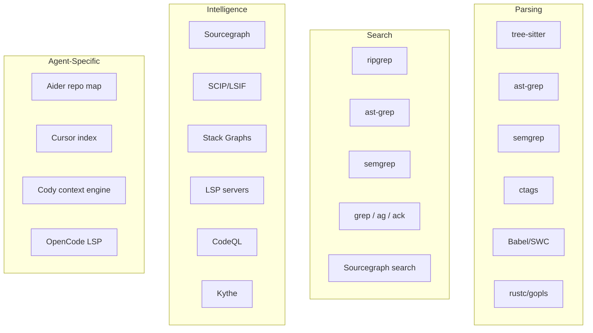
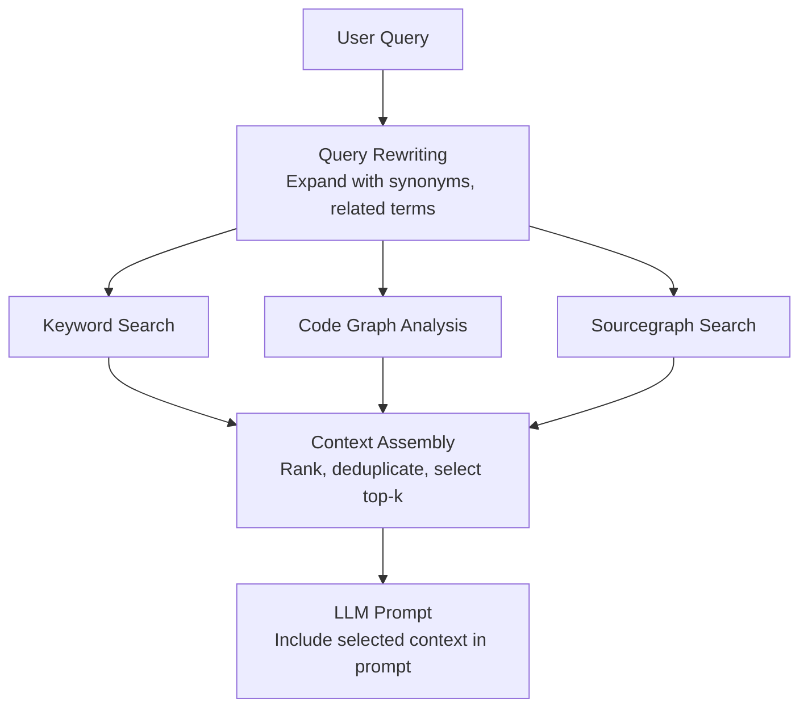

# Tools and Projects

> A comprehensive catalog of tools, libraries, and projects that enable code understanding in coding agents — from tree-sitter parsers to Sourcegraph's code intelligence to Aider's repo map.

## Overview

Code understanding in coding agents relies on a rich ecosystem of tools. Some are general-purpose (tree-sitter, ripgrep), some are purpose-built for code intelligence (Sourcegraph, SCIP), and some are specific to individual agents (Aider's repo map, Cursor's indexing). This document catalogs the major tools and how they're used.

### Tool Landscape



---

## Tree-sitter

### Overview

Tree-sitter is the foundational tool for code understanding in coding agents. It's a parser generator and incremental parsing library that can build concrete syntax trees for source files and efficiently update them as files change.

**Repository:** [github.com/tree-sitter/tree-sitter](https://github.com/tree-sitter/tree-sitter)
**License:** MIT
**Language:** C (core), with bindings for Python, JavaScript, Rust, Go, and more

### Key Features for Agents

| Feature | Description | Agent Value |
|---|---|---|
| **Multi-language** | 50+ language grammars available | Single tool for all languages |
| **Error-tolerant** | Produces valid ASTs for broken code | Essential for in-progress edits |
| **Incremental** | Re-parses only changed regions | Fast updates after edits |
| **Fast** | Millisecond parsing times | Real-time analysis feasible |
| **Query system** | S-expression pattern matching | Structured code extraction |

### Agent Usage

**Aider**: Core dependency. Uses tree-sitter for tag extraction (definitions and references) that powers the repo map. Maintains language-specific `.scm` query files for tag extraction:

```scheme
;; Aider's Python tag query (simplified)
(function_definition name: (identifier) @name) @definition.function
(class_definition name: (identifier) @name) @definition.class
(call function: (identifier) @name) @reference.call
(call function: (attribute attribute: (identifier) @name)) @reference.call
```

**Claude Code**: Uses tree-sitter for file summarization in its View tool — extracting function signatures and class definitions to provide structural overviews without reading full file contents.

**Droid**: Uses tree-sitter for incremental indexing — parsing files as they change and updating the symbol index.

**Ante**: Uses tree-sitter for symbol extraction before embedding generation.

### Getting Started

```python
# Python binding
import tree_sitter_python as tspython
from tree_sitter import Language, Parser

PY_LANGUAGE = Language(tspython.language())
parser = Parser(PY_LANGUAGE)

source = b"""
def hello(name):
    print(f"Hello, {name}!")

class Greeter:
    def greet(self, name):
        return f"Hi, {name}"
"""

tree = parser.parse(source)
root = tree.root_node

# Walk the tree
def walk(node, depth=0):
    print("  " * depth + f"{node.type}: {node.text[:50]}")
    for child in node.children:
        walk(child, depth + 1)

walk(root)
```

```bash
# Node.js binding
npm install tree-sitter tree-sitter-python

# Rust binding
# In Cargo.toml:
# [dependencies]
# tree-sitter = "0.22"
# tree-sitter-python = "0.21"
```

### Language Grammars

Popular grammars maintained by the tree-sitter organization:

| Language | Grammar Package | Maturity |
|---|---|---|
| Python | tree-sitter-python | Stable |
| JavaScript | tree-sitter-javascript | Stable |
| TypeScript | tree-sitter-typescript | Stable |
| Rust | tree-sitter-rust | Stable |
| Go | tree-sitter-go | Stable |
| Java | tree-sitter-java | Stable |
| C | tree-sitter-c | Stable |
| C++ | tree-sitter-cpp | Stable |
| Ruby | tree-sitter-ruby | Stable |
| PHP | tree-sitter-php | Stable |
| C# | tree-sitter-c-sharp | Stable |
| Bash | tree-sitter-bash | Stable |
| HTML | tree-sitter-html | Stable |
| CSS | tree-sitter-css | Stable |
| JSON | tree-sitter-json | Stable |

---

## ast-grep

### Overview

ast-grep is a fast, polyglot tool for searching, linting, and rewriting code using AST patterns. It uses tree-sitter under the hood but provides a much more ergonomic interface for structural code search.

**Repository:** [github.com/ast-grep/ast-grep](https://github.com/ast-grep/ast-grep)
**License:** MIT
**Language:** Rust

### Key Features

- **Pattern matching**: Write patterns that look like code — `console.log($$$ARGS)` matches all console.log calls
- **Multi-language**: Supports all tree-sitter languages
- **YAML rules**: Write linting rules in simple YAML
- **Language server**: Built-in LSP for IDE integration
- **Performance**: Rust-based, handles thousands of files in seconds

### Usage Examples

```bash
# Find all useState calls in React
ast-grep --pattern 'const [$STATE, $SETTER] = useState($INIT)' --lang tsx

# Find all async functions
ast-grep --pattern 'async function $NAME($$$PARAMS) { $$$BODY }' --lang ts

# Find all try-catch blocks
ast-grep --pattern 'try { $$$BODY } catch ($ERR) { $$$HANDLER }' --lang ts

# Rewrite: replace var with let
ast-grep --pattern 'var $NAME = $VALUE' --rewrite 'let $NAME = $VALUE' --lang js

# Rewrite: convert require to import
ast-grep --pattern 'const $NAME = require($PATH)' \
  --rewrite 'import $NAME from $PATH' --lang js
```

### YAML Rule Example

```yaml
# Rule to find potential security issues
id: no-eval
language: javascript
rule:
  pattern: eval($CODE)
message: "Avoid using eval() — it's a security risk"
severity: error
note: "Consider using JSON.parse() for data or Function() for dynamic code"
```

### Agent Integration Opportunity

ast-grep is significantly underutilized by coding agents. Its pattern-based search would allow agents to:

1. **Find structural patterns**: "All Express route handlers" → `app.$METHOD($PATH, $$$MIDDLEWARE, $HANDLER)`
2. **Verify conventions**: "Ensure all async functions have try-catch" → YAML rule
3. **Safe refactoring**: "Rename this pattern across all files" → pattern + rewrite

---

## Semgrep

### Overview

Semgrep is a fast, open-source static analysis tool that finds bugs, vulnerabilities, and anti-patterns using lightweight rules. It's more mature than ast-grep and has a large community rule library.

**Repository:** [github.com/semgrep/semgrep](https://github.com/semgrep/semgrep)
**License:** LGPL 2.1 (OSS engine), proprietary (cloud platform)
**Language:** OCaml (core), Python (CLI)

### Key Features

| Feature | Description |
|---|---|
| **Pattern matching** | Code patterns with metavariables |
| **Cross-file analysis** | Track data flow across files (Pro) |
| **Rule registry** | 3000+ community rules |
| **CI integration** | GitHub Actions, GitLab CI |
| **Multi-language** | 30+ languages supported |

### Usage for Code Understanding

```bash
# Find SQL injection vulnerabilities
semgrep --config "p/owasp-top-ten" .

# Find hardcoded secrets
semgrep --config "p/secrets" .

# Custom pattern: find all database queries
semgrep --pattern 'db.query($SQL)' --lang python .

# Custom pattern: find unhandled promises
semgrep --pattern 'await $PROMISE' --lang typescript .
```

### Semgrep Rule Example

```yaml
rules:
  - id: unsafe-deserialization
    pattern: |
      pickle.loads($DATA)
    message: "Unsafe deserialization with pickle — use json.loads() for untrusted data"
    languages: [python]
    severity: ERROR
    metadata:
      cwe: "CWE-502"
      owasp: "A8: Insecure Deserialization"
```

---

## Universal Ctags

### Overview

Universal Ctags is the modern successor to Exuberant Ctags, a tool that generates tag files mapping symbol names to their locations in source files. While older than tree-sitter, ctags is still widely used and supports over 100 languages.

**Repository:** [github.com/universal-ctags/ctags](https://github.com/universal-ctags/ctags)
**License:** GPL v2
**Language:** C

### Usage

```bash
# Generate tags for a project
ctags -R --fields=+lnS --extras=+q .

# Output format
# TagName<TAB>FileName<TAB>ExCommand;"<TAB>Kind<TAB>Extras
# UserService  src/services/user.ts  /^export class UserService/;"  c

# Generate tags with specific languages
ctags --languages=TypeScript,JavaScript -R .

# JSON output
ctags --output-format=json -R .
```

### Comparison with Tree-sitter Tags

| Feature | Universal Ctags | Tree-sitter Tags |
|---|---|---|
| **Languages** | 100+ | 50+ |
| **References** | Definitions only | Definitions AND references |
| **Precision** | Line-level | Character-level |
| **Incremental** | No (regenerate all) | Yes (incremental parsing) |
| **Error tolerance** | Limited | Full (produces ASTs for broken code) |
| **Speed** | Fast | Faster |
| **Graph building** | Not possible (no references) | Possible (definition-reference links) |

---

## Sourcegraph and Code Intelligence

### Sourcegraph Overview

Sourcegraph is a code intelligence platform that provides search, navigation, and insights across all codebases. While primarily a hosted service, its code intelligence capabilities are highly relevant to coding agents.

**Website:** [sourcegraph.com](https://sourcegraph.com)
**Key projects:** Cody (AI assistant), SCIP, Zoekt

### SCIP (Sourcegraph Code Intelligence Protocol)

SCIP is a language-agnostic protocol for indexing source code. Unlike LSP (which requires a running server), SCIP produces a static index that can be queried offline.

```protobuf
// SCIP index structure (simplified)
message Index {
  repeated Document documents = 1;
}

message Document {
  string relative_path = 1;
  repeated Occurrence occurrences = 2;
  repeated SymbolInformation symbols = 3;
}

message Occurrence {
  Range range = 1;
  string symbol = 2;
  SymbolRole symbol_roles = 3;  // Definition, Reference, Import, etc.
}
```

**SCIP indexers available:**
- scip-typescript (TypeScript/JavaScript)
- scip-python (Python)
- scip-java (Java/Kotlin)
- scip-go (Go)
- scip-rust (Rust via rust-analyzer)
- scip-ruby (Ruby)
- scip-dotnet (C#/F#)

### LSIF (Language Server Index Format)

LSIF is the predecessor to SCIP — a format for dumping LSP data to a file:

```bash
# Generate LSIF index for TypeScript
npx lsif-tsc -p tsconfig.json --out index.lsif

# Generate LSIF index for Go
lsif-go --out index.lsif

# Upload to Sourcegraph
src lsif upload -file=index.lsif
```

**Agent opportunity:** SCIP/LSIF indexes could provide offline code intelligence to agents without the startup cost of running a language server.

### Zoekt (Search Engine)

Zoekt is Sourcegraph's code search engine, optimized for searching across millions of repositories:

```bash
# Install zoekt
go install github.com/sourcegraph/zoekt/cmd/...@latest

# Index a repository
zoekt-index /path/to/repo

# Search
zoekt "class.*Service.*implements" -r
```

---

## Cody's Context Engine

### Architecture

Sourcegraph Cody uses a multi-layered context retrieval system:



### Context Sources

1. **Keyword Search**: Traditional text matching with query rewriting
2. **Code Graph**: Structural analysis of imports, definitions, references
3. **Sourcegraph Search**: Powerful cross-repository search via the Sourcegraph API
4. **@-mentions**: User-specified files, symbols, or repositories

---

## Aider's Repo Map

### Deep Dive

Aider's repo map is the most influential code understanding tool specific to CLI coding agents. It deserves detailed analysis because it demonstrates what's possible with relatively simple techniques.

**Repository:** [github.com/Aider-AI/aider](https://github.com/Aider-AI/aider)
**Key file:** `aider/repomap.py`

### Architecture

```python
# Simplified RepoMap pipeline
class RepoMap:
    def get_repo_map(self, chat_fnames, other_fnames):
        # 1. Get tags for all files
        all_tags = {}
        for fname in chain(chat_fnames, other_fnames):
            all_tags[fname] = self.get_tags(fname)  # tree-sitter

        # 2. Build reference graph
        G = self.build_reference_graph(all_tags)

        # 3. Rank with PageRank (personalized to chat files)
        ranked = self.rank_with_pagerank(G, chat_fnames)

        # 4. Select top-ranked tags within token budget
        selected = self.select_within_budget(ranked, self.max_map_tokens)

        # 5. Render as text
        return self.render_map(selected)
```

### Key Design Decisions

1. **PageRank, not frequency**: Aider doesn't just count references — it uses PageRank to find symbols that are *important* (referenced by many important files), not just *frequent*.

2. **Personalization**: The PageRank is personalized toward files the user has added to the chat, boosting symbols relevant to the current task.

3. **Token budgeting**: The map is constrained to a token budget (default 1024 tokens), dynamically expanded when no files are in the chat.

4. **Definition-focused output**: The map shows function signatures and class definitions, not full implementations — maximizing information density.

### Example Output

```
src/services/auth.ts:
⋮...
│export class AuthService:
│    constructor(private db: Database, private jwt: JwtService)
⋮...
│    async authenticate(email: string, password: string): Promise<User>
⋮...
│    async refreshToken(token: string): Promise<TokenPair>
⋮...

src/models/user.ts:
⋮...
│export interface User:
│    id: string
│    email: string
│    role: UserRole
⋮...

src/middleware/auth.ts:
⋮...
│export function requireAuth(roles?: UserRole[]):
⋮...
```

---

## Cursor's Codebase Indexing

### Overview

Cursor (the AI-native code editor) uses embedding-based indexing as a core feature:

1. **On project open**: Cursor indexes the entire codebase, generating embeddings for code chunks
2. **Semantic search**: When the user asks a question, Cursor searches the embedding index for relevant code
3. **Context injection**: Relevant code chunks are automatically included in LLM prompts
4. **Incremental updates**: As files change, embeddings are updated incrementally

### Technical Details

- **Embedding model**: Custom model optimized for code (details not public)
- **Chunking strategy**: Function-level chunks with AST awareness
- **Storage**: Local embedding database (not sent to cloud)
- **Hybrid search**: Combines embedding similarity with keyword matching

### Relevance to CLI Agents

Cursor's approach works well for an IDE (always running, persistent state) but faces challenges for CLI agents:
- **Startup cost**: Embedding generation takes minutes
- **Storage**: Embeddings require persistent local storage
- **Dependencies**: Requires an embedding model (API or local)

---

## GitHub's Stack Graphs

### Overview

Stack Graphs is a library from GitHub for implementing name resolution without a running language server. It defines a graph structure where names are resolved by finding paths through the graph.

**Repository:** [github.com/github/stack-graphs](https://github.com/github/stack-graphs)
**License:** MIT/Apache 2.0
**Language:** Rust

### Key Innovation

Stack Graphs separate name resolution into per-file partial graphs that can be computed independently and composed later. This enables:
- **Incremental computation**: Only re-process changed files
- **Parallel processing**: Files can be analyzed independently
- **Offline usage**: No running server needed

```rust
// Stack Graphs concept (simplified)
// Each file contributes partial name resolution information:

// File: src/models.py
// Exports: User, Post
// No imports

// File: src/api.py
// Imports: User from models
// Exports: create_user, get_user

// Stack Graphs connects these:
// api.py::User → models.py::User (resolved)
// api.py::create_user → returns models.py::User (type flow)
```

### Agent Opportunity

Stack Graphs could provide precise name resolution for agents without the overhead of running language servers — filling the gap between tree-sitter's structural analysis and LSP's semantic understanding.

---

## CodeQL

### Overview

CodeQL is GitHub's semantic code analysis engine. It treats code as data, allowing SQL-like queries over code structures.

**Repository:** [github.com/github/codeql](https://github.com/github/codeql)
**License:** MIT (queries), proprietary (engine)

```ql
// Find all SQL injection vulnerabilities in Python
import python
import semmle.python.security.dataflow.SqlInjectionQuery

from SqlInjectionConfiguration config, DataFlow::PathNode source, DataFlow::PathNode sink
where config.hasFlowPath(source, sink)
select sink.getNode(), source, sink, "SQL injection from $@.", source.getNode(), "user input"
```

### Relevance to Agents

CodeQL is too heavy for real-time agent use (database creation takes minutes to hours for large codebases). However, its approach — querying code as data — inspires lighter-weight alternatives that agents could use.

---

## Comparison Matrix

| Tool | Type | Languages | Speed | Agent Usage | Best For |
|---|---|---|---|---|---|
| **tree-sitter** | Parser | 50+ | Very Fast | High (Aider, Claude Code, Droid) | AST construction, tag extraction |
| **ast-grep** | Search/Lint | 20+ | Fast | Very Low | Structural code search |
| **semgrep** | Search/SAST | 30+ | Moderate | Very Low | Security analysis, pattern matching |
| **Universal Ctags** | Tag generator | 100+ | Fast | Low | Symbol indexing |
| **ripgrep** | Text search | All | Very Fast | Universal | Text search across files |
| **Sourcegraph** | Platform | All | Fast | Indirect (Cody) | Cross-repo code intelligence |
| **SCIP/LSIF** | Index format | 10+ | N/A (pre-built) | None yet | Offline code intelligence |
| **Stack Graphs** | Name resolver | 3 | Fast | None yet | Cross-file name resolution |
| **CodeQL** | Analysis engine | 10+ | Slow | None | Deep security analysis |
| **Aider repo map** | Agent feature | 50+ | Fast | Aider only | Codebase overview for LLMs |
| **Cursor indexing** | IDE feature | All | Moderate | Cursor only | Embedding-based code search |
| **Cody context** | Platform feature | All | Fast | Cody only | Multi-source context retrieval |

---

## Emerging Tools and Trends

### Moatless Tools
Repository-level code editing tools that combine search, context, and editing into a unified workflow. These are building on the foundation of tree-sitter and embedding search.

### Greptile
An API for understanding codebases — provides semantic search and code intelligence as a service. Could enable agents to outsource code understanding.

### Continue.dev
An open-source AI coding assistant that integrates multiple context providers, demonstrating how to combine different code understanding tools into a unified system.

### Bloop (now acquired by Sourcegraph)
Was a code search engine using AI for natural language code search. Its approach of combining embedding search with code graph analysis influenced Cody's architecture.

---

## Key Takeaways

1. **Tree-sitter is the foundation.** Every sophisticated code understanding system starts with tree-sitter. Its combination of speed, multi-language support, error tolerance, and incremental parsing makes it irreplaceable.

2. **ast-grep is the most underutilized tool.** Its code-pattern-based search is perfect for agents that need structural code understanding, yet almost no agent uses it.

3. **SCIP/LSIF could bridge the LSP gap.** Pre-computed code intelligence indexes would give CLI agents compiler-grade understanding without the startup cost of running language servers.

4. **Aider's repo map proves simple techniques work.** Tree-sitter tags + PageRank ranking produces a codebase overview that dramatically improves LLM editing quality.

5. **The trend is toward composition.** The best code understanding systems combine multiple tools — tree-sitter for parsing, ripgrep for search, embeddings for semantic matching, git for temporal context — rather than relying on any single tool.