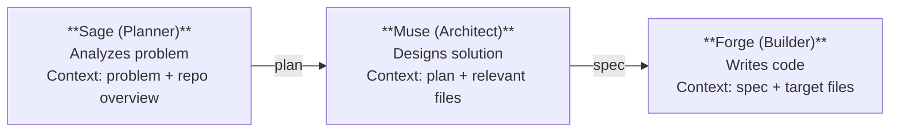
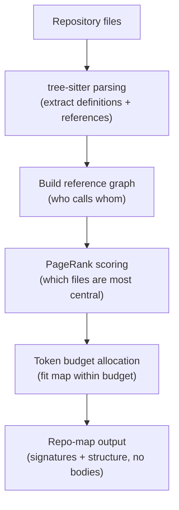
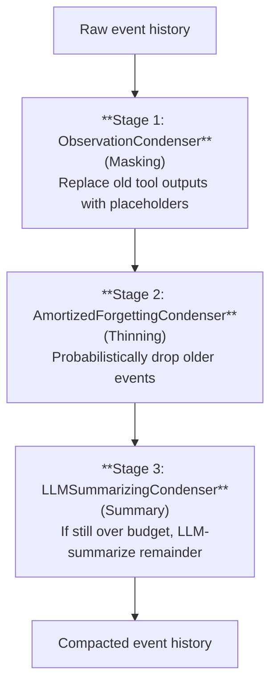
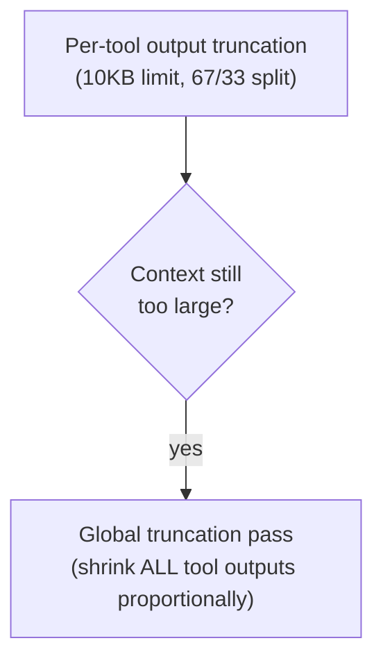
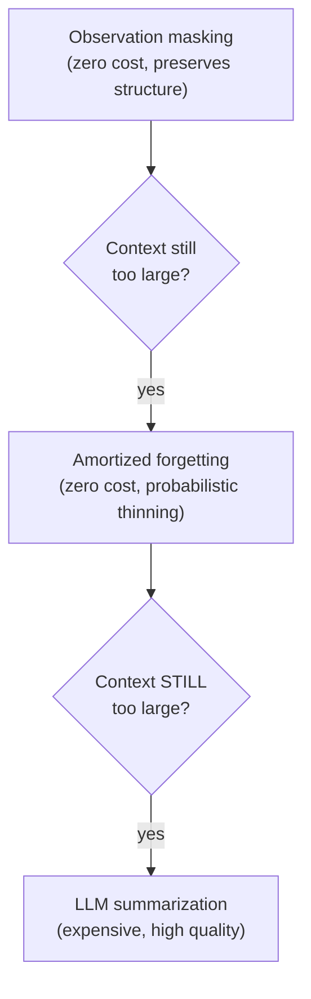
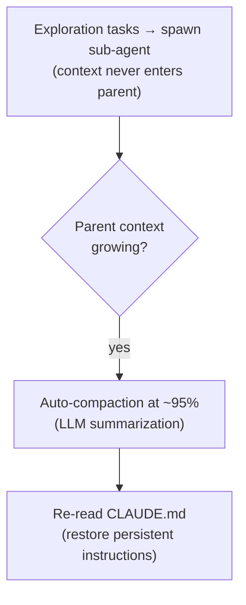
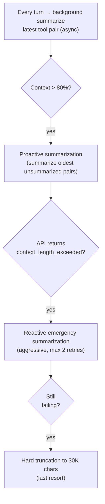
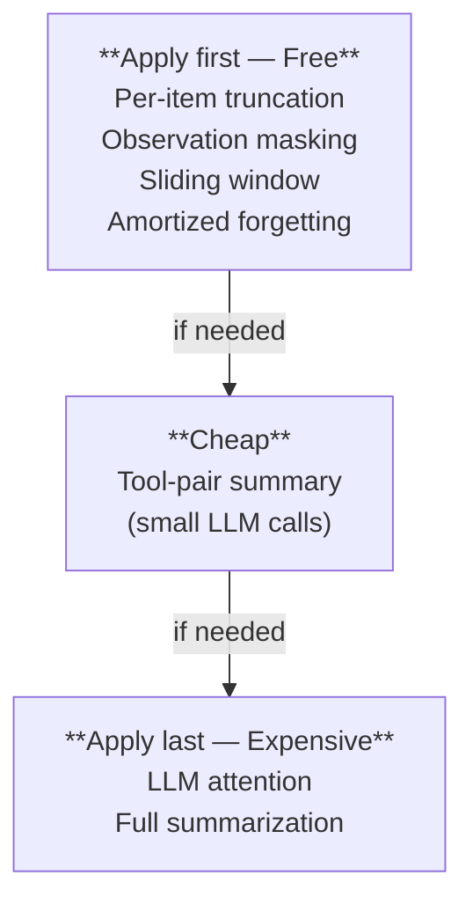
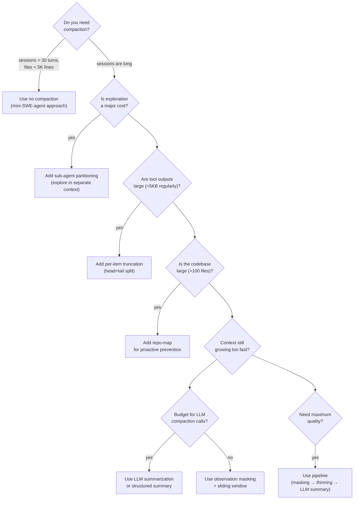

# Compaction Strategies for Coding Agents

## 1. Introduction: Why Compaction Matters

Every coding agent eventually hits the same wall: the context window is finite, but the
work is not. A complex debugging session can generate hundreds of tool calls, each returning
thousands of tokens of file contents, command output, and search results. Left unchecked,
context grows until the model either refuses to continue or silently loses coherence as
critical information scrolls past its effective attention span.

**Compaction** is the process of reducing context size while preserving essential information.
It is the single most important architectural decision in any long-running agent, because it
determines what the agent remembers, what it forgets, and how gracefully it degrades.

### The Fundamental Trade-Off

```
Information Fidelity ◄─────────────────────► Token Efficiency

  Full history                                 Empty context
  (perfect recall,                             (zero cost,
   maximum tokens)                              zero knowledge)

  Every agent lives somewhere on this spectrum.
  Compaction is the mechanism that moves the cursor.
```

**Three failure modes when compaction goes wrong:**

1. **Too aggressive** — Agent forgets critical context, re-explores files it already read,
   contradicts earlier decisions, or silently drops user requirements.
2. **Too conservative** — Context fills up, agent hits token limits, responses degrade as
   attention is diluted across thousands of tokens of stale observations.
3. **Wrong granularity** — Agent remembers the shape of what happened but loses the specific
   details it needs (exact file paths, error messages, line numbers).

---

## 2. Strategy Taxonomy

All compaction strategies fall into three meta-categories based on *when* they act relative
to context bloat:

```
Context too large?
│
├── Can we PREVENT bloat? (Proactive)
│   ├── Repo-map: structural view without function bodies
│   ├── Semantic entry-point discovery: only load relevant files
│   ├── Pre-computed token budgets: allocate per-tool limits upfront
│   └── Selective file loading: read ranges, not entire files
│
├── Can we COMPRESS what's there? (Reactive)
│   │
│   ├── LLM-Based (expensive, high quality)
│   │   ├── Free-form summarization (ask LLM to summarize)
│   │   ├── Structured summarization (categorized sections)
│   │   ├── LLM attention selection (LLM rates event importance)
│   │   └── Tool-pair summarization (summarize call+result pairs)
│   │
│   ├── Non-LLM (cheap, mechanical)
│   │   ├── Per-item truncation (head + tail with elision)
│   │   ├── Sliding window (drop oldest messages)
│   │   ├── Amortized forgetting (probabilistic gradual decay)
│   │   └── Observation masking (replace content with placeholders)
│   │
│   └── Hybrid
│       └── Condenser pipelines (chain multiple strategies sequentially)
│
└── Can we PARTITION the work? (Structural)
    ├── Sub-agent spawning (explore in separate context, return summary)
    ├── Three-agent pipeline (planner → coder → executor)
    └── Spec-document boundary (compress plan into spec, fresh context)
```

The most effective agents combine strategies from all three categories. Proactive strategies
reduce the rate of context growth. Reactive strategies compress when growth exceeds capacity.
Structural strategies reset the problem entirely by distributing work across contexts.

---

## 3. Detailed Strategy Descriptions

### 3.1 LLM Free-Form Summarization

**Mechanism:** When context exceeds a threshold, send the conversation history to an LLM
with instructions to produce a condensed summary. Replace the original history with the
summary and continue.

**OpenCode's approach:**

```
Prompt: "Provide a detailed but concise summary of this conversation so far.
Focus on:
  - What has been accomplished
  - What we are currently working on
  - Which files have been examined or modified
  - What the next steps are
  - Any important decisions or findings"
```

The summary replaces all prior messages. The system prompt is preserved, and the summary
is injected as a synthetic assistant message at the start of the new context.

**Claude Code's approach:**

- Manual trigger via `/compact` command, with optional focus instructions:
  `/compact focus on the authentication refactoring`
- Auto-compaction fires when context reaches ~95% of window
- After compaction, re-reads `CLAUDE.md` to restore persistent instructions
- The re-read step is critical — it ensures project conventions survive compaction

**OpenHands LLMSummarizingCondenser:**

```python
class LLMSummarizingCondenser(Condenser):
    """Uses an LLM to generate a free-form summary of events."""

    def condense(self, events: list[Event]) -> list[Event]:
        # Build a text representation of all events
        text = self._format_events(events)
        # Ask LLM to summarize
        summary = self.llm.completion(
            messages=[{"role": "user", "content": SUMMARIZE_PROMPT + text}]
        )
        # Return synthetic event containing the summary
        return [CondensationAction(summary=summary)]
```

**Droid's incremental compression:**

Droid adds sophistication with anchor points and confidence scores. Rather than summarizing
everything at once, it identifies critical moments (test failures, successful edits, user
corrections) and preserves them as anchors. Lower-confidence segments between anchors are
compressed more aggressively.

| Aspect        | Strength                        | Weakness                           |
|---------------|----------------------------------|------------------------------------|
| Quality       | High if summarization LLM good   | Hallucinated details possible      |
| Cost          | 1 LLM call per compaction        | Expensive for frequent triggers    |
| Latency       | Noticeable pause during compact  | Blocks agent loop                  |
| Info loss     | Moderate — LLM chooses what matters | May drop details that matter later |

---

### 3.2 Structured Summarization

**Mechanism:** Like free-form summarization, but the LLM is constrained to produce output
in predefined categories. This prevents the "wall of text" problem where important details
get buried in prose.

**OpenHands StructuredSummaryCondenser:**

```python
STRUCTURED_SUMMARY_PROMPT = """Summarize the following events into these sections:

## Key Findings
- Important discoveries about the codebase or problem

## Files Modified
- List of files changed and what was done to each

## Current Approach
- The strategy currently being pursued

## Open Issues
- Unresolved problems or questions

## Next Steps
- What should happen next

Be specific. Include file paths, function names, and error messages."""
```

**Why structure helps:**

1. **Predictable format** — The agent knows where to look for specific information
2. **Section-level attention** — Less chance of key details drowning in narrative
3. **Composable** — Multiple structured summaries can be merged by section
4. **Auditable** — Humans can quickly verify what was preserved vs lost

**Template-based extraction** is a non-LLM variant: use regex or structured parsing to
extract specific fields (modified files, error messages, test results) from history without
invoking an LLM. Cheaper but less flexible.

---

### 3.3 Per-Item Truncation

**Mechanism:** Cap the size of individual tool outputs at a fixed byte/character limit.
When output exceeds the limit, keep the beginning and end, inserting an elision marker.

**Codex's implementation (Rust):**

```rust
const MAX_TOOL_OUTPUT_BYTES: usize = 10_000;  // ~10KB per tool call

fn truncate_output(content: &str, limit: usize) -> String {
    if content.len() <= limit {
        return content.to_string();
    }
    let prefix_size = limit * 2 / 3;   // 67% from the start
    let suffix_size = limit / 3;        // 33% from the end
    let prefix = &content[..prefix_size];
    let suffix = &content[content.len() - suffix_size..];
    let truncated_chars = content.len() - prefix_size - suffix_size;
    format!("{prefix}\n\n…{truncated_chars} chars truncated…\n\n{suffix}")
}
```

**Why the 67/33 asymmetric split:**

- **Start of output** typically contains: function signatures, file headers, import
  statements, command banners — structural information about *what* was returned
- **End of output** typically contains: error messages, final status lines, compilation
  results — *outcome* information about what went wrong
- The **middle** is usually the least information-dense: intermediate lines of large files,
  verbose log output, repetitive search results

**Codex global truncation pass:**

When the total context (not just one item) exceeds limits, Codex runs a second pass that
truncates ALL function-call outputs more aggressively:

```rust
fn apply_global_truncation(messages: &mut Vec<Message>, target_tokens: usize) {
    let current = count_tokens(messages);
    if current <= target_tokens { return; }

    // Calculate per-output budget
    let function_outputs: Vec<&mut Message> = messages.iter_mut()
        .filter(|m| m.role == "tool")
        .collect();
    let budget_per_output = (target_tokens - system_tokens) / function_outputs.len();

    for output in function_outputs {
        truncate_to(&mut output.content, budget_per_output);
    }
}
```

**Other implementations:**

| Agent          | Limit     | Split      | Notes                           |
|----------------|-----------|------------|---------------------------------|
| Codex          | ~10KB     | 67/33      | Plus global pass                |
| mini-SWE-agent | 10K chars | 50/50      | Symmetric head + tail           |
| ForgeCode      | 10KB      | Configurable | `FORGE_MAX_SEARCH_RESULT_BYTES` |
| SWE-agent      | 8K chars  | 50/50      | Per-observation limit           |

---

### 3.4 Sliding Window

**Mechanism:** Drop the oldest messages from context, keeping only the most recent N
messages or events.

**OpenHands ConversationWindowCondenser:**

```python
class ConversationWindowCondenser(Condenser):
    """Keeps first K events + last (max_events - K) events."""

    def __init__(self, max_events: int = 100, keep_first: int = 5):
        self.max_events = max_events
        self.keep_first = keep_first

    def condense(self, events: list[Event]) -> list[Event]:
        if len(events) <= self.max_events:
            return events
        # Always preserve initial context (system setup, task description)
        head = events[:self.keep_first]
        # Fill remaining budget with most recent events
        tail_budget = self.max_events - self.keep_first
        tail = events[-tail_budget:]
        return head + tail
```

**OpenHands RecentEventsCondenser:**

A simpler variant that keeps only the last N events (default 50), discarding everything
else including initial setup. This is riskier — losing the original task description can
cause the agent to go off-track.

**Key design insight:** The `keep_first` parameter is essential. Initial context typically
contains the system prompt, task description, and repository overview. Losing this is
catastrophic — the agent forgets what it was asked to do.

```
Before:  [sys, task, obs1, obs2, ..., obs98, obs99, obs100]
                                        │
After:   [sys, task, obs96, obs97, obs98, obs99, obs100]
          ──────── ──────────────────────────────────────
          keep_first=2        last 5 events
```

**Trade-offs:**

- Zero LLM cost
- Instant (no latency)
- Harsh information cliff — everything between `keep_first` and the window is gone entirely
- No semantic awareness: may drop a critical error message just because it's old

---

### 3.5 Amortized Forgetting

**Mechanism:** Rather than a hard cutoff between "remembered" and "forgotten," use
probability-based selection to gradually forget older events. More recent events have
higher probability of survival.

**OpenHands AmortizedForgettingCondenser:**

```python
class AmortizedForgettingCondenser(Condenser):
    """Preserves progressively more recent events using probability."""

    def __init__(self, max_events: int = 100, keep_first: int = 5):
        self.max_events = max_events
        self.keep_first = keep_first

    def condense(self, events: list[Event]) -> list[Event]:
        if len(events) <= self.max_events:
            return events

        head = events[:self.keep_first]
        candidates = events[self.keep_first:]

        # Assign survival probability based on recency
        # Recent events: ~100% chance; old events: ~20% chance
        selected = []
        for i, event in enumerate(candidates):
            recency = i / len(candidates)  # 0.0 (oldest) to 1.0 (newest)
            keep_prob = 0.2 + 0.8 * recency
            if random.random() < keep_prob or i >= len(candidates) - 10:
                selected.append(event)

        return head + selected[-self.max_events + self.keep_first:]
```

**Why amortized forgetting over sliding window:**

```
Sliding window:    [████████████░░░░░░░░░░░░████████████]
                    preserved    GONE        preserved
                    (head)       (hard cliff) (tail)

Amortized:         [████████████▓▓▒▒░░░▒▒▓▓████████████]
                    preserved   gradual      preserved
                    (head)      thinning     (tail)
```

The gradual thinning means an important event from the middle of the session has a chance
of surviving. With a sliding window, it is guaranteed to be lost.

**Trade-offs:**

- Non-deterministic: same input can produce different outputs
- Still no semantic awareness (important events can be randomly dropped)
- Very cheap (no LLM calls)
- Smoother degradation curve than hard window

---

### 3.6 Observation Masking

**Mechanism:** Replace the content of old tool outputs with short placeholder messages
while preserving the structure of the conversation. The agent knows that a tool was called
and what type of output it produced, but the verbose content is gone.

**OpenHands ObservationCondenser:**

```python
class ObservationCondenser(Condenser):
    """Replaces old observation content with truncation notices."""

    def condense(self, events: list[Event]) -> list[Event]:
        result = []
        for i, event in enumerate(events):
            if isinstance(event, Observation) and i < len(events) - self.recent:
                # Replace content but keep metadata
                masked = event.copy()
                masked.content = "[Previous observation truncated]"
                result.append(masked)
            else:
                result.append(event)
        return result
```

**What's preserved vs lost:**

```
Before masking:
  User: "Read the file src/auth.py"
  Tool call: read_file(path="src/auth.py")
  Tool result: "import jwt\nimport bcrypt\n\nclass AuthManager:\n    def __init__..."
               (2000 tokens of file content)

After masking:
  User: "Read the file src/auth.py"
  Tool call: read_file(path="src/auth.py")
  Tool result: "[Previous observation truncated]"
               (5 tokens)
```

The agent retains the knowledge that it read `src/auth.py` and can re-read it if needed.
This is dramatically cheaper than a full summary while preserving conversation structure.

**OpenHands BrowserOutputCondenser:**

A specialized variant for browser observations, which are particularly large (full DOM
snapshots, screenshots as base64). Browser content is almost always stale by the next
action, making it ideal for aggressive masking.

**Trade-offs:**

- Zero LLM cost
- Preserves conversation structure perfectly
- Agent can re-read files if it needs the content again
- Complete loss of tool output details — no partial preservation

---

### 3.7 LLM Attention Selection

**Mechanism:** Instead of the LLM summarizing events, it *selects* which events to keep.
Each event is rated for importance, and only the highest-rated events survive.

**OpenHands LLMAttentionCondenser:**

```python
ATTENTION_PROMPT = """You are evaluating conversation events for importance.
Rate each event from 1-10 based on:
- Does it contain information needed for the current task?
- Does it record a decision or discovery?
- Would losing it cause the agent to repeat work?

Events rated 7+ will be kept. Events rated below 7 will be discarded.
Rate conservatively — when in doubt, rate higher."""
```

**How it differs from summarization:**

| Aspect            | Summarization              | Attention Selection           |
|-------------------|----------------------------|-------------------------------|
| Output            | New synthetic text         | Subset of original events     |
| Fidelity          | Paraphrased (may distort)  | Original text preserved       |
| Granularity       | Whole-history level        | Per-event level               |
| Cost              | 1 LLM call                | 1 LLM call (but longer prompt)|
| Risk              | Hallucinated details       | Important events mis-rated    |

**Key advantage:** No hallucination risk. The kept events are verbatim originals. The only
risk is that the LLM rates an important event too low and it gets dropped.

---

### 3.8 Tool-Pair Summarization (Goose)

**Mechanism:** Summarize individual `tool_call` + `tool_result` pairs independently, in the
background, rather than summarizing the entire conversation at once.

**Goose's three-level approach:**

```
Level 1: PROACTIVE (80% context usage)
  └── Summarize old tool pairs before hitting limits
      └── Background process, non-blocking

Level 2: REACTIVE (on context overflow error)
  └── Aggressively summarize when API returns context_length_exceeded
      └── Max 2 retry attempts
      └── Truncates to 30K chars if summarization fails

Level 3: BACKGROUND (every turn)
  └── Async summarization of latest tool pair
      └── Ready for next compaction trigger
```

**The mark-invisible pattern:**

```python
def summarize_tool_pair(messages, pair_index):
    tool_call = messages[pair_index]
    tool_result = messages[pair_index + 1]

    # Generate summary
    summary = llm.summarize(f"Summarize this tool interaction:\n"
                            f"Call: {tool_call}\n"
                            f"Result: {tool_result}")

    # Mark originals as invisible to the model (but preserved for UI/logs)
    tool_call.metadata["agent_visible"] = False
    tool_result.metadata["agent_visible"] = False

    # Insert summary as a new visible message
    summary_msg = Message(
        role="assistant",
        content=f"[Summary of {tool_call.function.name}]: {summary}",
        metadata={"is_summary": True, "agent_visible": True}
    )
    messages.insert(pair_index + 2, summary_msg)
```

**Why per-pair summarization is powerful:**

1. **Incremental** — No need to re-summarize the entire history
2. **Parallelizable** — Multiple pairs can be summarized concurrently
3. **Reversible** — Originals are preserved, just hidden
4. **Granular** — Each tool interaction gets a right-sized summary

---

### 3.9 Sub-Agent Partitioning

**Mechanism:** Instead of compacting within a single context, distribute work across
multiple independent contexts. Each sub-agent operates in its own window and returns
only a summary to the parent.

**Claude Code's philosophy:**

> "Sub-agents are the most powerful context management tool."

When a task requires reading many files or exploring a large codebase, Claude Code spawns
a sub-agent (via the Task tool) to do the exploration. The sub-agent's full context —
potentially hundreds of file reads — never enters the parent's context. Only the final
summary returns.

```
┌─────────────────────────────────────────────────────────┐
│                    PARENT CONTEXT                        │
│                                                         │
│  User: "Refactor the auth module"                       │
│  Assistant: "I'll explore the codebase first."          │
│  [spawn sub-agent: "Find all auth-related files"]       │
│  Sub-agent result: "Found 12 files:                     │
│    src/auth/*.py, src/middleware/auth.py, ..."           │
│    (50 tokens returned from 5000 tokens explored)       │
│                                                         │
│  Context used: ~200 tokens                              │
│  Context saved: ~4800 tokens                            │
└─────────────────────────────────────────────────────────┘

┌─────────────────────────────────────────────────────────┐
│                  SUB-AGENT CONTEXT                       │
│  (separate window, discarded after completion)          │
│                                                         │
│  System: "Find all auth-related files"                  │
│  [read_file: src/auth/manager.py]    → 1200 tokens      │
│  [read_file: src/auth/tokens.py]     → 800 tokens       │
│  [grep: "authenticate" in src/]      → 2000 tokens      │
│  [read_file: src/middleware/auth.py]  → 1000 tokens      │
│  Summary: "Found 12 files: ..."      → 50 tokens        │
│                                                         │
│  Total context used: ~5000 tokens (all discarded)       │
└─────────────────────────────────────────────────────────┘
```

**ForgeCode three-agent pipeline:**



Each agent has a FRESH context containing only what it needs.
No agent carries the full accumulated history.

**Capy's Captain-Build boundary:**

The Captain agent analyzes the problem, explores the codebase, and produces a specification
document. The Build agent receives ONLY the spec and the relevant file contents — it has
zero knowledge of the Captain's exploration process.

**Trade-offs:**

- Excellent context efficiency — exploration costs don't accumulate
- Natural parallelism — sub-agents can run concurrently
- Information bottleneck — parent only sees what sub-agent chose to report
- Overhead — spawning sub-agents has latency and API cost
- Coordination complexity — sub-agents can't easily share discoveries

---

### 3.10 Repo-Map (Proactive Prevention)

**Mechanism:** Instead of loading entire files into context, provide a structural overview
of the repository — file tree, class names, function signatures — that lets the agent
navigate without reading full contents upfront.

*(See `repo-map.md` for comprehensive treatment of this strategy.)*

**Aider's pipeline:**



**Why it prevents compaction:**

A repo-map of a 100-file project might use 2,000 tokens. Reading those 100 files would
use 200,000 tokens. The agent gets enough information to make targeted reads, dramatically
reducing the total context consumed during exploration.

---

### 3.11 No Compaction (The Anti-Pattern That Works)

**Mechanism:** Simply don't compact. Append every observation to context, let it grow
linearly, and rely on large context windows to handle it.

**mini-SWE-agent's approach:**

```python
# That's it. No compaction logic at all.
# Context grows linearly with each tool call.
history.append({"role": "tool", "content": full_output})
```

**Why this works (sometimes):**

1. **Modern context windows are huge** — 128K-1M tokens is common
2. **Typical SWE-bench tasks are small** — Most can be solved in <30 tool calls
3. **No information loss** — Perfect recall of everything that happened
4. **Fine-tuning friendly** — Raw trajectories are directly usable as training data

**When it breaks:**

- Multi-file refactoring across large codebases
- Tasks requiring extensive exploration before editing
- Sessions lasting more than ~50 turns
- Repositories with large files (>5000 lines)

**The pragmatic argument:**

> "Start with linear history and no compaction. Add compaction only when you have
> empirical evidence that context overflow is causing failures. Premature compaction
> optimization introduces complexity and information loss for problems you may not have."

---

## 4. The Compaction Pipeline Pattern (OpenHands Deep-Dive)

OpenHands has the most sophisticated compaction architecture in the ecosystem: a
configurable pipeline that chains multiple condenser stages sequentially.

### Architecture



### Configuration (TOML)

```toml
[condenser]
type = "pipeline"

[[condenser.stages]]
type = "observation"
keep_recent = 5

[[condenser.stages]]
type = "amortized_forgetting"
max_events = 100
keep_first = 5

[[condenser.stages]]
type = "llm_summarizing"
model = "gpt-4o-mini"
max_summary_tokens = 1000
```

### All 10 Condenser Implementations

| #  | Condenser                     | Type       | LLM? | Description                                    |
|----|-------------------------------|------------|------|------------------------------------------------|
| 1  | NoOpCondenser                 | Identity   | No   | Pass-through, no modification                  |
| 2  | ObservationCondenser          | Masking    | No   | Replace old observation content with notice     |
| 3  | RecentEventsCondenser         | Window     | No   | Keep last N events only                         |
| 4  | ConversationWindowCondenser   | Window     | No   | Keep first K + last (max-K) events              |
| 5  | AmortizedForgettingCondenser  | Thinning   | No   | Probabilistic gradual forgetting                |
| 6  | BrowserOutputCondenser        | Masking    | No   | Specialized for large browser observations      |
| 7  | LLMSummarizingCondenser       | Summary    | Yes  | Free-form LLM summary                          |
| 8  | StructuredSummaryCondenser    | Summary    | Yes  | Categorized section-based summary               |
| 9  | LLMAttentionCondenser         | Selection  | Yes  | LLM rates and selects events to keep            |
| 10 | PipelineCondenser             | Meta       | Mixed| Chains any combination of the above             |

### Self-Directed Condensation

OpenHands allows the agent itself to request condensation:

```python
class CondensationRequestTool:
    """Agent can invoke this when it feels context is getting unwieldy."""

    name = "condense_context"
    description = "Request that the conversation history be compacted."

    def execute(self):
        # Triggers the configured condenser pipeline
        return CondensationAction(trigger="agent_request")
```

The controller detects the `CondensationAction` and runs the condenser pipeline. This lets
the agent choose WHEN to compact based on its own assessment, rather than relying solely
on token-count triggers.

---

## 5. Compaction Triggers — When Does It Fire?

Different agents take fundamentally different stances on when to compact:

| Agent      | Trigger                          | Threshold | Philosophy      |
|------------|----------------------------------|-----------|-----------------|
| Goose      | % of context window used         | 80%       | Conservative    |
| Codex      | % of context window used         | 90%       | Moderate        |
| OpenCode   | % of context window used         | 95%       | Aggressive      |
| OpenHands  | Event count                      | 100 events| Event-based     |
| Claude Code| Auto (% based) + manual /compact | ~95% + manual | Dual        |
| Warp       | Manual /fork-and-compact         | User only | User-initiated  |
| Aider      | Per-message (repo-map refresh)   | Token budget | Continuous   |
| Droid      | Token count + anchor detection   | Dynamic   | Adaptive        |

**Conservative (80%) philosophy:**

> "Compact early to maintain headroom. The agent should always have room to receive
> a large tool output without hitting limits."

**Aggressive (95%) philosophy:**

> "Every compaction loses information. Delay as long as possible to preserve maximum
> context. Only compact when absolutely necessary."

**Event-based philosophy:**

> "Token counting is an implementation detail. What matters is the number of
> conversational turns — after 100 turns, older turns are almost certainly stale."

---

## 6. Master Comparison Table

| Strategy                | Info Loss  | LLM Cost | Latency   | Deterministic | Best For                          | Used By                          |
|-------------------------|-----------|----------|-----------|---------------|-----------------------------------|----------------------------------|
| Free-form summary       | Medium    | High     | High      | No            | General long sessions             | Claude Code, OpenCode, OpenHands |
| Structured summary      | Medium    | High     | High      | No            | Multi-phase complex tasks         | OpenHands                        |
| Per-item truncation     | Low-Med   | None     | None      | Yes           | Large tool outputs                | Codex, mini-SWE, ForgeCode      |
| Sliding window          | High      | None     | None      | Yes           | Simple short tasks                | OpenHands                        |
| Amortized forgetting    | Med-High  | None     | None      | No            | Medium-length sessions            | OpenHands                        |
| Observation masking     | High      | None     | None      | Yes           | Verbose tool outputs              | OpenHands                        |
| LLM attention           | Low-Med   | High     | High      | No            | Critical long sessions            | OpenHands                        |
| Tool-pair summary       | Low       | Medium   | Low*      | No            | Tool-heavy workflows              | Goose                            |
| Sub-agent partitioning  | Low**     | Medium   | Medium    | N/A           | Exploration-heavy tasks           | Claude Code, ForgeCode, Capy     |
| Repo-map (proactive)    | N/A***    | None     | Low       | Yes           | Large codebases                   | Aider, ForgeCode                 |
| No compaction           | None      | None     | None      | Yes           | Short tasks, fine-tuning data     | mini-SWE-agent                   |
| Pipeline (multi-stage)  | Tunable   | Varies   | Varies    | Varies        | Production systems                | OpenHands                        |

```
*   Tool-pair summarization runs in background, so perceived latency is low
**  Sub-agent partitioning loses only what the sub-agent omits from its summary
*** Repo-map doesn't lose information — it prevents it from entering context
```

---

## 7. How Agents Combine Strategies

No production agent uses a single compaction strategy. The most effective systems layer
multiple approaches:

### Codex: Truncation + Global Pass



Simple, deterministic, zero LLM cost. Works because Codex sessions tend to be focused
and relatively short.

### OpenHands: Multi-Stage Pipeline



Each stage is a fallback for the previous. Cheap mechanical strategies handle most cases;
the expensive LLM strategy only fires when necessary.

### Claude Code: Sub-Agents + Compaction



Sub-agents prevent the MAJORITY of context growth. Compaction is a safety net for what
remains.

### Goose: Three-Level Background Summarization



### Design Principle: Cheap First, Expensive as Fallback



---

## 8. Choosing a Strategy: Decision Guide

### Flowchart



### Quick Reference by Use Case

| Use Case                              | Recommended Strategy                              |
|---------------------------------------|---------------------------------------------------|
| Simple bug fix agent                  | Per-item truncation only                          |
| Multi-file refactoring                | Sub-agents + per-item truncation                  |
| Long interactive session              | LLM summarization with auto-trigger               |
| SWE-bench evaluation                  | No compaction (maximize recall for short tasks)   |
| Production coding assistant           | Pipeline (masking → forgetting → LLM summary)    |
| Codebase exploration tool             | Repo-map + sub-agent partitioning                 |
| Fine-tuning data generation           | No compaction (preserve raw trajectories)         |
| Cost-sensitive deployment             | Observation masking + sliding window (zero LLM)   |

### The Golden Rule

> **Compaction is not a feature — it's a tax.** Every compaction event loses information.
> The best compaction strategy is the one that fires least often because the agent was
> designed to minimize context consumption in the first place. Invest in proactive
> strategies (repo-maps, sub-agents, selective file loading) before optimizing reactive
> ones.

---

## Summary

The landscape of compaction strategies reflects the fundamental tension in agent design:
agents need broad context to make good decisions, but context windows are finite. The
ecosystem has converged on a layered approach:

1. **Prevent** context bloat with structural tools (repo-maps, sub-agents)
2. **Truncate** individual items mechanically (per-item head+tail)
3. **Thin** the history cheaply (masking, windowing, forgetting)
4. **Summarize** with LLMs as a last resort (free-form or structured)

The most sophisticated systems (OpenHands' pipeline) make this layering explicit and
configurable. The simplest systems (mini-SWE-agent) skip it entirely and rely on large
context windows. Both approaches work — the right choice depends on task complexity,
session length, and tolerance for information loss.
