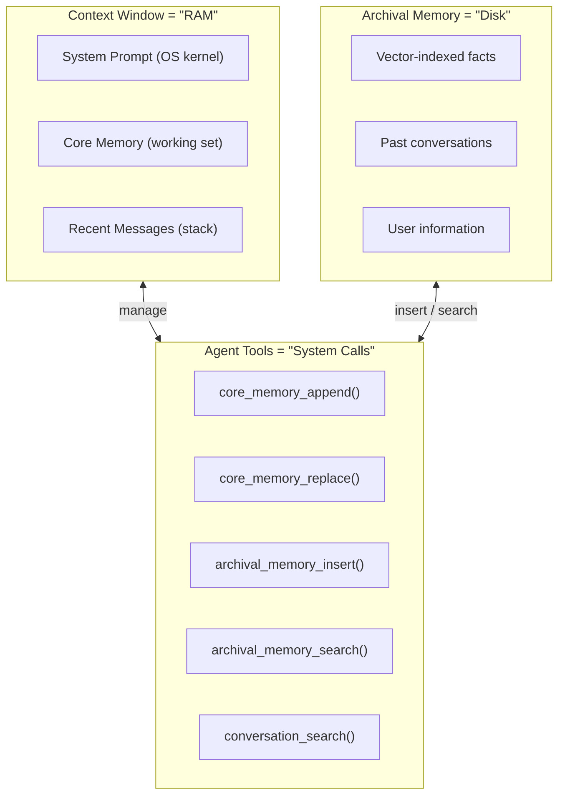

# Memory Systems in Coding Agents

## 1. Introduction

Memory in coding agents refers to persistent information that survives across sessions and
context compaction events. Unlike raw conversation history, memory is curated, structured,
and deliberately maintained — it represents what the agent (or its human operator) has
decided is worth retaining.

When a context window fills up, older messages get compacted or dropped. Memory persists
through these events — either by being re-injected after compaction or by living outside
the context window entirely and being retrieved on demand.

Two broad categories of memory exist in modern coding agents:

1. **Explicit memory files** — human-authored instruction files that tell the agent about
   the project. Examples: CLAUDE.md, .goosehints, AGENTS.md, GEMINI.md. Version-controlled,
   shared across team members, representing institutional knowledge.

2. **Auto-memory** — agent-maintained memory created and updated based on learned
   interactions. Examples: Claude Code's MEMORY.md, Letta/MemGPT's archival memory,
   Mem0's extracted facts. Typically machine-local, personalized, evolving over time.

---

## 2. CLAUDE.md (Claude Code)

CLAUDE.md is Claude Code's project-level instruction file, loaded at session start. It
serves as persistent project context the agent relies on regardless of conversation state.

### Hierarchical Loading

CLAUDE.md files load in a specific hierarchy, with later files taking precedence:

1. **User-level** (`~/.claude/CLAUDE.md`) — personal preferences and global conventions
2. **Parent directories** — walking up from project root toward filesystem root
3. **Project root** (`./CLAUDE.md`) — primary project-level instructions
4. **Child directories** (JIT discovery) — loaded only when agent accesses files in those subdirectories

### JIT (Just-In-Time) Discovery

Child directory CLAUDE.md files are NOT loaded at startup. They are discovered just-in-time
when the agent first touches a file in that directory. In a large monorepo with dozens of
subdirectories, this keeps initial token usage low while allowing directory-specific instructions.

### Modular Imports

CLAUDE.md supports importing other files via `@path/to/file` syntax:

```markdown
# Project Guidelines
@docs/api-spec.md
@docs/database-schema.md
```

Referenced files are loaded and included in context, enabling modular documentation.

### Compaction Survival

CLAUDE.md content survives context compaction. When the context window fills up and older
messages are compressed, CLAUDE.md is re-read from disk and re-injected. Project
instructions are never lost, even in very long sessions.

### What Goes in CLAUDE.md

- **Project conventions**: coding style, naming patterns, architectural decisions
- **Build/test commands**: exact commands to build, test, lint, deploy
- **Architecture overview**: directory structure, key modules, data flow
- **Files to avoid**: generated files, migrations, vendor directories
- **Common gotchas**: known issues, non-obvious behaviors

### Example CLAUDE.md

```markdown
# Project Guidelines

## Build & Test
- Run tests with: npm test
- Lint with: npm run lint
- Type check: npx tsc --noEmit

## Architecture
- src/api/ — Express route handlers
- src/services/ — Business logic layer
- src/models/ — Prisma schema and generated client

## Conventions
- Use TypeScript strict mode
- Prefer named exports over default exports
- Error handling: use Result<T, E> pattern, not try/catch

## Warnings
- Never modify migration files directly — use `prisma migrate dev`
- @docs/api-spec.md for API specification
```

---

## 3. Auto-Memory (Claude Code)

Beyond human-authored CLAUDE.md files, Claude Code maintains its own autonomous memory.

### Storage and Loading

Auto-memory is stored at `~/.claude/projects/<project-hash>/memory/MEMORY.md`. This is
machine-local and NOT committed to the repository. Only the first 200 lines are loaded at
startup — a practical token budget threshold that forces the agent to be selective.

### What Gets Auto-Remembered

- **User preferences** discovered during conversation ("user prefers functional style")
- **Project patterns** learned through exploration ("tests use vitest, not jest")
- **Common workflows** the user repeats ("always run lint before committing")
- **Error patterns and solutions** ("prisma generate must run after schema changes")

### Machine-Local Nature

Each developer accumulates their own memory. This is intentional — auto-memory captures
personal preferences and local environment quirks. Shared knowledge belongs in CLAUDE.md;
personal knowledge belongs in auto-memory.

---

## 4. GooseHints (Goose)

Goose uses `.goosehints` files at the project root for agent guidance.

- Contains project hints: build commands, conventions, warnings, architecture notes
- Format is flexible — plain text or markdown
- Injected into agent context at session start
- Also reads `AGENTS.md` files for cross-agent compatibility
- Follows global → project → directory hierarchy

---

## 5. AGENTS.md (ForgeCode, Warp)

AGENTS.md is an agent configuration file used by multiple tools, notably ForgeCode and Warp.

### Warp's Hierarchy

- **Global** — organization or user-level defaults
- **Project** — project root AGENTS.md
- **Directory** — subdirectory-specific overrides

### Content

- Technology stack description (languages, frameworks, versions)
- File organization and directory structure conventions
- Build, test, lint, and deployment commands
- Testing patterns and coverage requirements
- Deployment notes and environment variables
- Warnings about security-sensitive or fragile areas

ForgeCode uses AGENTS.md for bounded context guidance — helping the agent understand
project scope and constraints without discovering everything from scratch.

---

## 6. GEMINI.md (Gemini CLI)

GEMINI.md serves the same purpose as CLAUDE.md but for Google's Gemini CLI agent.

- **Global** (`~/.gemini/GEMINI.md`) → **workspace** (project root) → **JIT discovery** (subdirectories)
- Supports `@path/to/file` imports for modular documentation
- Survives compaction by re-reading from disk after context compression

The convergence of CLAUDE.md, GEMINI.md, and AGENTS.md toward similar hierarchical,
file-based memory systems suggests this pattern is becoming a de facto standard.

---

## 7. MOIM: Goose's Model-Oriented Information Management

Goose implements a dynamic memory injection system (MOIM) that differs from static
file-based approaches.

### Per-Turn Injection

Each turn, before calling the LLM, Goose runs `inject_moim()` — collecting context from
all active extensions and injecting it into the prompt. The context available to the model
can change on every single turn.

### Extension-Driven Context

MOIM is driven by Goose's extension ecosystem. Each extension provides per-turn context it
determines is relevant RIGHT NOW. Conceptually similar to RAG, but instead of searching a
vector store, context is provided by active extensions based on their own logic.

### Top of Mind Extension

The "Top of Mind" extension injects persistent user instructions — things the user always
wants the agent to consider. This bridges static memory files and dynamic per-turn context.

### Dynamic Nature

Unlike CLAUDE.md (same content every turn), MOIM injects different content each turn based
on what extensions determine is relevant. This is dynamic memory that adapts to the agent's
evolving needs within a session.

---

## 8. Letta/MemGPT Memory Architecture

Letta (formerly MemGPT) takes the most radical approach: it treats the context window like
RAM in an operating system, giving the agent tools to manage its own memory explicitly.

### The OS Analogy



### Memory Types

**Core Memory** — always visible in context, limited to ~2K tokens. Divided into blocks:
- **Human block**: information about the user (name, preferences, background)
- **Persona block**: agent's identity, instructions, behavioral guidelines

Modified via `core_memory_append()` and `core_memory_replace()`.

**Archival Memory** — unlimited external storage backed by a vector database. The agent
stores and retrieves via `archival_memory_insert()` and `archival_memory_search()`.
Equivalent to disk storage — vast capacity but requires explicit access.

**Recall Memory** — past conversation turns in searchable format. The agent searches
prior conversations using `conversation_search()`, recalling details from interactions
that have long since left the context window.

### Self-Managed Memory

The agent itself decides what to remember and forget. No external system summarizes
conversations — the agent uses memory tools as part of its reasoning. This creates a
feedback loop: memory management improves as the model improves.

---

## 9. Short-Term vs Long-Term Memory Patterns

### Short-Term Memory
- **What**: conversation history, tool results, current task state
- **Where**: context window
- **Duration**: single session or task; subject to compaction

### Medium-Term Memory
- **What**: session summaries, checkpoint states, compacted conversation
- **Where**: session storage (SQLite, JSONL)
- **Duration**: session lifetime; persists across compactions

### Long-Term Memory
- **What**: project knowledge, user preferences, learned patterns
- **Where**: files (CLAUDE.md, MEMORY.md), databases, vector stores
- **Duration**: project lifetime or beyond

### The Computer Architecture Parallel

| Computer Architecture | Agent Memory | Characteristics |
|---|---|---|
| Registers | Current message/turn | Always available, tiny capacity |
| L1 Cache | Recent messages | Fast access, frequently evicted |
| L2/L3 Cache | Compaction summaries | Compressed representation |
| RAM | Context window | Limited size, everything "visible" |
| SSD/Disk | Persistent files, databases | Unlimited, requires explicit access |
| Network | External APIs, RAG stores | Highest latency, virtually unlimited |

This parallel has real design implications — just as computer architects optimize cache hit
rates, agent architects must optimize for having the right information in context at the
right time.

---

## 10. Mem0 — Self-Improving Memory

Mem0 is a standalone memory layer for any AI application, providing automatic fact
extraction and retrieval.

### Core Mechanism

Automatically extracts facts from conversations, deduplicates against existing memories,
and resolves conflicts when new information contradicts old. This happens transparently.

### Multi-Level Memory

- **User memory**: facts about specific users, persisted across all sessions
- **Session memory**: context within a specific conversation session
- **Agent memory**: knowledge the agent accumulates about its own patterns

### Storage and Performance

Hybrid approach using vector storage (semantic search) and graph storage (relationship
tracking). Claims: +26% accuracy over OpenAI Memory, 91% faster, 90% fewer tokens.

### Usage Example

```python
from mem0 import Memory
memory = Memory()

messages = [
    {"role": "user", "content": "I prefer using pytest over unittest"},
    {"role": "assistant", "content": "Noted! I'll use pytest for your projects."}
]
memory.add(messages, user_id="user123")

# Later, search relevant memories
results = memory.search("testing preferences", user_id="user123")
# Returns: [{"memory": "User prefers pytest over unittest", "score": 0.95}]
```

License: Apache 2.0.

---

## 11. Zep — Long-Term Memory Store

Zep provides a purpose-built memory store for AI assistants.

- **Auto-summarization**: compresses conversations as they grow, maintaining bounded
  representations of long interaction histories
- **Named entity extraction**: tracks people, organizations, tools, concepts across sessions
- **Temporal awareness**: knows WHEN things happened; handles information that changes over
  time ("user switched from Jest to Vitest in March")
- **Hybrid search**: vector similarity + metadata filtering for both semantic and structured queries
- **Native LangChain integration** for straightforward adoption
- License: Apache 2.0

---

## 12. Comparison Table

| System | Type | Auto-Extract | Survives Compaction | Hierarchy | Agent-Authored | Shared (VCS) |
|---|---|---|---|---|---|---|
| CLAUDE.md | File | No | Yes (re-read) | User→parent→root→child | No | Yes |
| Auto-Memory | File | Yes | Yes (re-read) | Project-specific | Yes | No |
| GooseHints | File | No | Session-scoped | Global→project→dir | No | Yes |
| AGENTS.md | File | No | Session-scoped | Global→project→dir | No | Yes |
| GEMINI.md | File | No | Yes (re-read) | Global→workspace→JIT | No | Yes |
| MOIM | Dynamic | No | N/A (per-turn) | Extension-driven | No | No |
| Letta/MemGPT | Agent-managed | Yes (agent) | Yes (external) | Core→archival→recall | Yes | No |
| Mem0 | Service | Yes (auto) | Yes (external) | User→session→agent | Partial | No |
| Zep | Service | Yes (auto) | Yes (external) | Session-based | No | No |

### Key Observations

- **File-based systems** are converging on similar hierarchical designs — this works and
  is becoming standard.
- **Agent-authored memory** represents the frontier — more powerful but harder to control.
- **External memory services** are framework-agnostic but add operational complexity.
- **Dynamic injection** (MOIM) treats memory as per-turn computation, not a static store.

---

## 13. Best Practices

### Layer Multiple Memory Systems

No single system covers all needs. Combine:
- **Human-authored project docs** (CLAUDE.md / AGENTS.md) for shared team knowledge
- **Agent-maintained auto-memory** for personal preferences and discovered patterns
- **Structured project docs** (@-imported specs, architecture docs) for detail on demand

### Respect Token Budgets

Memory competes with conversation for context space. Keep files concise:
- CLAUDE.md: under 200 lines of high-signal content
- Auto-memory: prune regularly (the 200-line cap exists for a reason)
- Use @-imports to load detailed docs only when needed

### Review Auto-Memory Periodically

Agent-authored memory accumulates outdated or incorrect information. Review to:
- Remove stale entries (old patterns, deprecated workflows)
- Correct inaccuracies (wrong lessons learned)
- Consolidate redundant entries

### Use Structured Formats

- Consistent headings and bullet points
- Explicit commands over prose descriptions
- Code blocks for commands and examples

### Separate Shared vs Personal Knowledge

- **Shared** (conventions, architecture, commands) → version-controlled files in repo
- **Personal** (preferences, local environment) → machine-local auto-memory

### Design for Compaction Survival

Assume memory content will be the ONLY context after compaction:
- Self-contained instructions (don't reference conversation history)
- Explicit commands (`npm test`, not "the usual test command")
- Complete file paths (`src/config/database.ts`, not "the config file")

### Start Minimal, Grow Deliberately

Begin with build/test/lint commands, top 3-5 conventions, and a one-paragraph architecture
overview. Add more as you discover what the agent gets wrong or asks about repeatedly.
