# Multi-Agent Context Management

## 1. Introduction

The fundamental insight behind multi-agent context management is deceptively simple:
instead of trying to compress everything into a single context window, **partition the
work across multiple independent context windows**.

Every strategy we have examined so far — sliding windows, summarization, RAG retrieval,
hierarchical memory — operates within the constraint of a single context window. They
all ask the same question: "How do we fit more into less?" Multi-agent systems ask a
different question entirely: "Why fit everything into one window at all?"

The architecture works like this:

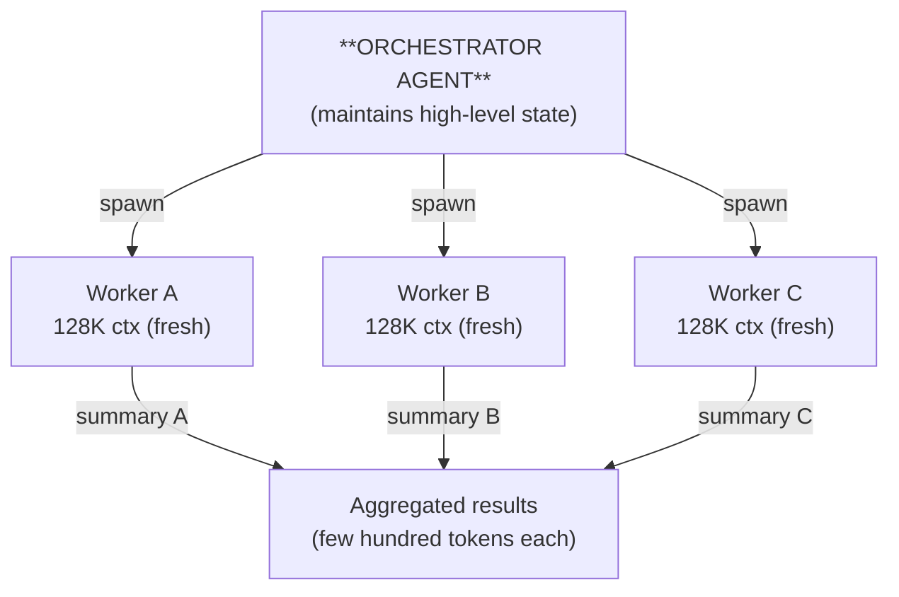

Each sub-agent gets its own **fresh** context window. It can consume 50K, 80K, even
100K tokens of file contents, search results, and analysis — and when it finishes,
all of that is discarded. Only the distilled summary crosses the boundary back to
the orchestrator.

The effective total context available to the system becomes the **sum of all agent
windows**, not the size of any single one. A system with 5 agents each having 128K
context effectively operates with 640K tokens of working memory — while each
individual agent maintains clean, focused context.

This is arguably the most powerful context management strategy available today.

---

## 2. The "Orchestrator Knows All, Workers Know Little" Pattern

The core organizational pattern in multi-agent context management is asymmetric
knowledge distribution:

```
Orchestrator Knowledge:
  ✓ Full conversation history with user
  ✓ High-level task understanding
  ✓ Summaries from all previous worker outputs
  ✓ Global state and progress tracking
  ✗ Raw file contents (delegated to workers)
  ✗ Detailed exploration results (only summaries)

Worker Knowledge:
  ✓ Specific task description (a few sentences)
  ✓ Relevant file paths or search queries
  ✓ Minimal necessary context from orchestrator
  ✗ Full conversation history
  ✗ Other workers' results
  ✗ Global state or progress
  ✗ Why this task matters in the broader picture
```

Workers receive **minimal context**: just their specific task plus whatever files or
information they need to complete it. They do not see the full conversation history,
they do not see other workers' results, and they do not know the global state of the
system.

**Benefits:**
- Each worker operates with clean, focused context — no irrelevant noise
- Total effective context equals the sum of all windows
- Workers can be parallelized (independent contexts mean no conflicts)
- Failed workers can be retried without polluting the orchestrator's context

**Drawbacks:**
- Communication overhead: every spawn costs tokens for task description
- Information loss at boundaries: summaries inevitably discard details
- Coordination complexity: the orchestrator must track what each worker knows
- Latency: sequential worker chains add round-trip time per stage

The quality of this pattern depends almost entirely on how well the orchestrator
formulates task descriptions and how effectively it synthesizes worker outputs.

---

## 3. Claude Code's Sub-Agent Architecture

Claude Code's documentation is explicit about its philosophy:

> "Sub-agents are the most powerful context management tool."

The architecture is built around a single principle: **expensive exploration should
never happen in the main context window**. Instead, exploration is delegated to
sub-agents that operate in separate context windows.

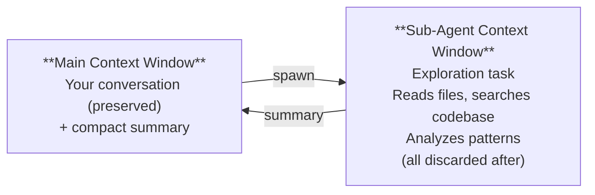

The key insight is quantitative. Consider what happens when you explore a codebase
directly in the main context:

```
Direct exploration in main context:
  Read file 1:   3,000 tokens  →  cumulative: 3,000
  Read file 2:   2,500 tokens  →  cumulative: 5,500
  Read file 3:   4,000 tokens  →  cumulative: 9,500
  ...
  Read file 20:  2,000 tokens  →  cumulative: 50,000+

  All 50K tokens remain in context for EVERY subsequent turn.
  Over 30 turns: 50K × 30 = 1.5M input tokens processed.
```

Now consider the sub-agent approach:

```
Sub-agent exploration:
  Sub-agent reads 20 files:     50,000 tokens (consumed once)
  Sub-agent returns summary:       500 tokens (to main context)
  Sub-agent context discarded:  50,000 tokens freed

  Main context grows by only 500 tokens.
  Over 30 turns: 500 × 30 = 15K input tokens processed.
  Savings: ~1.485M tokens (99% reduction in carried context)
```

**Use cases for sub-agent exploration:**
- Codebase exploration: "Find all files related to authentication"
- Test analysis: "What test patterns does this project use?"
- Documentation search: "How is the API versioned?"
- Dependency analysis: "What depends on this module?"

**Cost of sub-agent spawning:**
- Task description to sub-agent: ~500 tokens
- Sub-agent's own processing: ~50K tokens (but in isolated context)
- Summary returned: ~500 tokens
- Total main context cost: ~1,000 tokens

**Compared to direct exploration:**
- 20+ tool calls filling main context: ~50K tokens permanently added
- Each subsequent turn re-processes those 50K tokens
- Break-even point: sub-agent spawning saves tokens after just 2 turns

Claude Code uses different sub-agent types optimized for different tasks:
- **Explore agents**: lightweight, fast model, read-only (safe to parallelize)
- **Task agents**: heavier, can execute commands, returns brief success/failure
- **General-purpose agents**: full capability, separate context window

The critical design choice: explore agents use a cheaper, faster model (Haiku-class)
because their job is information gathering, not complex reasoning. This makes
sub-agent spawning both token-efficient and cost-efficient.

---

## 4. ForgeCode's Three-Agent Pipeline

ForgeCode implements a strict three-stage pipeline where each agent receives only
the distilled output of the previous stage:

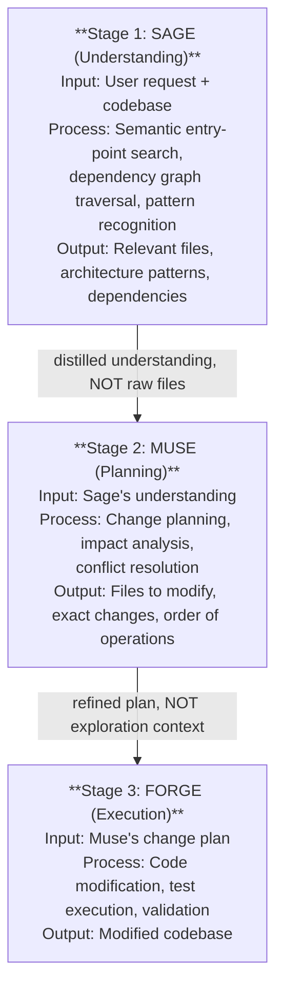

Each stage acts as a **compression boundary**. Sage might read 40 files and analyze
thousands of lines of code, but Muse only receives a structured summary of what
Sage found. Muse might consider dozens of possible change strategies, but Forge
only receives the final plan.

**Semantic entry-point discovery** is particularly interesting: before Sage even
starts exploring, the system identifies the most relevant starting points in the
codebase using semantic search. This narrows context before any agent begins
processing, avoiding the "read everything" trap.

ForgeCode claims "up to 93% fewer tokens" compared to naive single-agent exploration.
The math supports this: if a single agent would need to carry 100K tokens of context
through a full task, a three-stage pipeline where each stage receives only ~7K tokens
of distilled context achieves roughly that reduction.

The trade-off is rigidity. The pipeline is strictly sequential — you cannot go back
from Forge to Sage if new information emerges during execution. Some systems address
this with feedback loops, but ForgeCode opts for the simpler linear design.

---

## 5. Ante's Meta-Agent + Sub-Agent Distribution

Ante takes a more dynamic approach to multi-agent coordination. Rather than a fixed
pipeline, it uses a meta-agent that spawns sub-agents on demand based on the task
requirements.

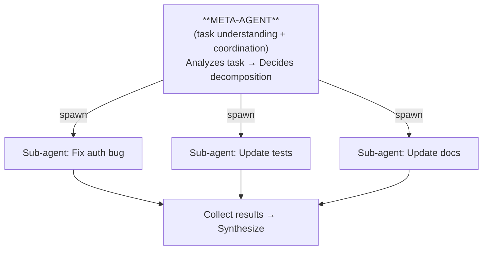

**Key characteristics:**
- **Dynamic spawning**: the number and type of sub-agents is determined at runtime
  based on task complexity, not predefined
- **Effective total context**: if the meta-agent has 128K and spawns 4 sub-agents
  each with 128K, the system has 640K tokens of working memory
- **Result aggregation**: the meta-agent collects outputs from all sub-agents and
  synthesizes a coherent result
- **Failure isolation**: if one sub-agent fails, the meta-agent can retry it without
  affecting others

The meta-agent maintains a lightweight representation of the overall task state —
which sub-tasks are complete, which are pending, what dependencies exist. Sub-agents
are stateless from the meta-agent's perspective: they receive a task, produce a
result, and their context is discarded.

This architecture scales naturally. A simple task might need one sub-agent. A complex
refactoring might spawn a dozen. The meta-agent's context grows only by the size of
each sub-agent's summary, not by the raw exploration each performed.

---

## 6. Capy's Spec Document Boundary

Capy implements a two-agent system with a particularly clean compression boundary:
a structured specification document.

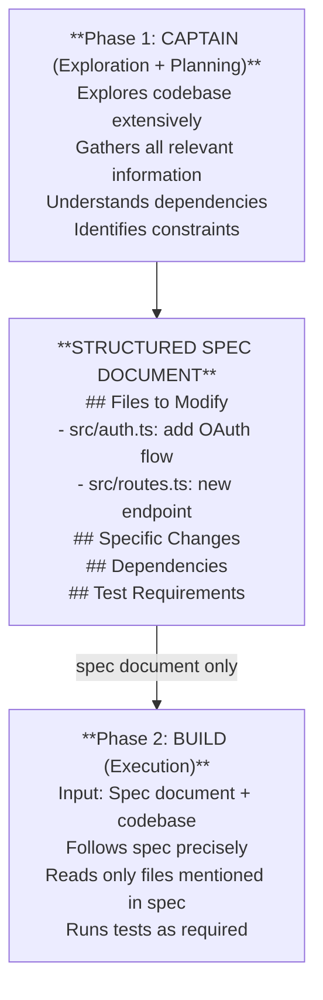

The spec document serves as a **"lossless summary"** — more structured than a
free-form summary, with explicit sections for different types of information. This
structure makes it harder to accidentally omit critical details.

**What goes in the spec:**
- Files to modify and the rationale for each change
- Specific changes needed (as precise as possible)
- Dependencies and ordering constraints
- Test requirements and acceptance criteria
- Warnings about fragile areas or edge cases

**Why a spec document beats a free-form summary:**
- Structure forces completeness (empty sections are visible)
- Build agent can reference specific sections
- Easier to validate before handing off
- Acts as documentation of the change plan

The Build agent starts with a **completely clean context** — no exploration history,
no false starts, no abandoned approaches. It sees only the spec and the codebase.
This means its entire context budget is available for the actual work of making
changes, not for understanding what changes to make.

---

## 7. TongAgents' Multi-Agent Framework

TongAgents takes multi-agent architecture in a different direction: rather than a
fixed pipeline or orchestrator pattern, it uses multiple specialized agents that
collaborate on tasks based on their individual capabilities.

**Key design principles:**
- **Role specialization**: each agent has a defined role (code reader, test writer,
  refactoring expert) with corresponding system prompts and tool access
- **Task decomposition**: complex tasks are broken into subtasks matched to agent
  specializations
- **Proportional complexity**: simple subtasks get simple agents (shorter prompts,
  fewer tools), complex subtasks get more capable agents
- **Shared state boundaries**: agents communicate through defined output formats,
  not raw context sharing

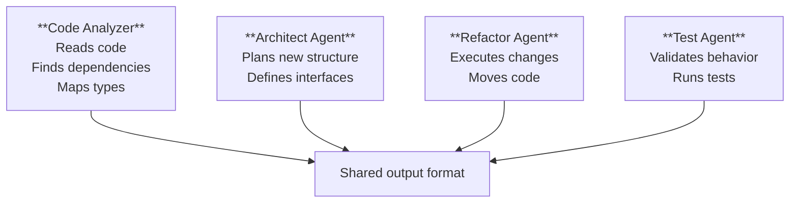

The important context management insight from TongAgents is **proportional resource
allocation**: not every subtask needs a full 128K context window with an expensive
model. A simple file-reading task can use a smaller, faster agent with minimal
context, while a complex architectural decision gets a more capable agent with
richer context.

---

## 8. Context Handoff Patterns

How context moves between agents is the defining characteristic of any multi-agent
system. Four primary patterns emerge across the tools we have studied:

### 8.1 Summary Handoff

The simplest and most common pattern. Agent A completes its work and produces a
natural-language summary. Agent B receives this summary as part of its initial prompt.

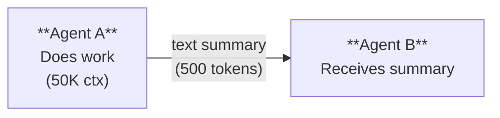

**Used by:** Claude Code sub-agents, most exploration patterns
**Strength:** Simple, flexible, works with any agent
**Weakness:** Summary quality is the bottleneck — critical details can be lost
**Risk:** The summarizing agent might not know what will be important to Agent B

### 8.2 Structured Handoff

Agent A produces a structured document (spec, plan, JSON schema) rather than
free-form text. Agent B parses and follows the structure.

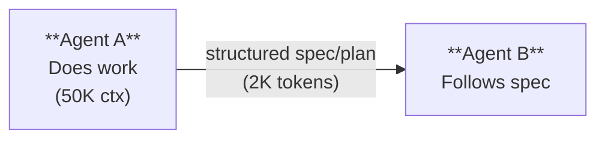

**Used by:** Capy (spec document), ForgeCode (change plans)
**Strength:** More reliable, forces completeness, acts as documentation
**Weakness:** Requires predefined structure, less flexible
**Risk:** Rigid structure may not capture all task types well

### 8.3 Shared State Handoff

Agents do not directly pass context to each other. Instead, they communicate through
a shared external state — a file system, database, or event log.

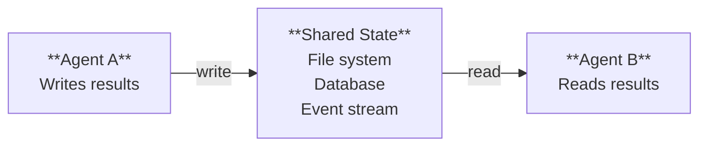

**Used by:** OpenHands (EventStream), most file-system-based tools
**Strength:** Loose coupling, agents don't need to know about each other
**Weakness:** Implicit communication is harder to debug and reason about
**Risk:** Race conditions, stale reads, ordering issues

### 8.4 Progressive Refinement

Each agent in a pipeline takes the previous agent's output and refines it further.
Context narrows at each stage — from broad understanding to specific plan to
concrete execution.

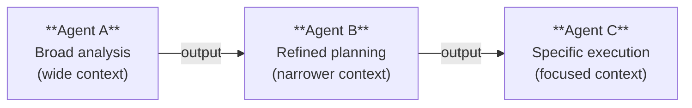

Context breadth narrows at each stage.

**Used by:** ForgeCode (Sage → Muse → Forge)
**Strength:** Natural compression at each stage, clear separation of concerns
**Weakness:** Strictly sequential, no backtracking without full restart
**Risk:** Early-stage errors propagate and amplify through the pipeline

---

## 9. Shared State vs. Isolated State Patterns

### 9.1 Fully Isolated

Each agent has completely independent context. No shared memory, no shared files,
no implicit communication. All information transfer is explicit through messages
or summaries.

**Pros:** Clean contexts, no cross-contamination, easy to reason about, trivially
parallelizable
**Cons:** Information loss at every boundary, high coordination overhead
**Example:** Claude Code's explore sub-agents — they receive a task, return a
summary, and their context is completely discarded

### 9.2 Shared File System

Agents share access to the same codebase and file system. They read source files
directly and write their outputs (code changes, test files) to the shared file
system. Communication happens implicitly through file modifications.

**Pros:** Natural for coding tasks, agents can see each other's changes, no
explicit serialization needed
**Cons:** Ordering matters (Agent B must wait for Agent A to finish writing),
merge conflicts possible, harder to isolate failures
**Example:** Nearly all multi-agent coding tools — the codebase is inherently shared

### 9.3 Shared Database

Agents share a structured database for coordination. More organized than a file
system, enables queries across agent outputs, supports transactions.

**Pros:** Structured queries, ACID properties, natural for tracking state
**Cons:** Schema design overhead, not natural for all tasks
**Example:** Task tracking databases, build status coordination, test result
aggregation

### 9.4 Event Stream

A shared append-only log of events that all agents can read. Each agent subscribes
to relevant event types and publishes its own events. Enables loose coupling —
agents do not need to know about each other, only about event types.

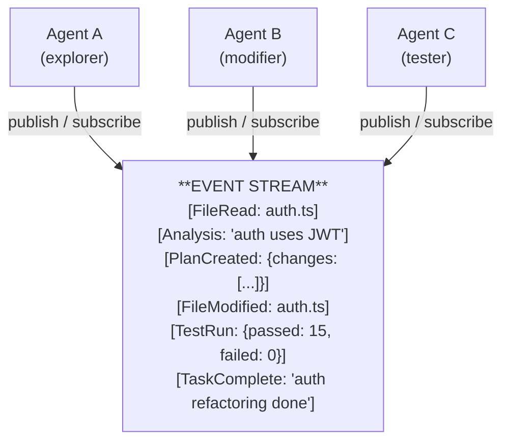

**Pros:** Loose coupling, full audit trail, enables replay, agents can join/leave
**Cons:** Agents must filter relevant events (context management within the stream),
ordering and consistency challenges
**Example:** OpenHands' EventStream architecture

---

## 10. Token Savings from Multi-Agent Architecture

The token economics of multi-agent systems reveal why this pattern is so compelling.

### Single-Agent Scenario

A coding task requires exploring 20 files (averaging 2,500 tokens each = 50,000
tokens total). The task takes 30 turns to complete.

```
Turn  1: Read 20 files          →  context: 50,000 tokens
Turn  2: Analyze + plan         →  context: 52,000 tokens
Turn  3: Edit file 1            →  context: 54,000 tokens
...
Turn 30: Final validation       →  context: 80,000 tokens

Total input tokens processed across all turns:
  50K + 52K + 54K + ... + 80K ≈ 1,950,000 tokens
  (every turn re-reads all previous context)
```

### Multi-Agent Scenario

An orchestrator spawns a sub-agent for exploration. The sub-agent reads the 20 files,
analyzes them, and returns a 500-token summary. The orchestrator then proceeds with
the 30-turn task using only the summary.

```
Sub-agent (1 turn):
  Read 20 files + analyze       →  context: 55,000 tokens
  Return summary                →  500 tokens to orchestrator

Orchestrator:
  Turn  1: Receive summary      →  context: 2,500 tokens
  Turn  2: Plan from summary    →  context: 4,500 tokens
  ...
  Turn 29: Final validation     →  context: 32,000 tokens

Total input tokens processed:
  Sub-agent: 55,000 (one-time cost)
  Orchestrator: 2.5K + 4.5K + ... + 32K ≈ 500,000 tokens
  Total: ~555,000 tokens
```

### Savings Summary

```
┌────────────────────┬─────────────┬──────────────┬──────────┐
│ Metric             │ Single-Agent│ Multi-Agent   │ Savings  │
├────────────────────┼─────────────┼──────────────┼──────────┤
│ Exploration cost   │ 50K (kept)  │ 55K (discard) │ -5K     │
│ Per-turn overhead  │ +50K/turn   │ +500/turn     │ 49.5K   │
│ Total (30 turns)   │ ~1,950K     │ ~555K         │ ~71%    │
│ Peak context       │ 80K         │ 32K           │ 60%     │
└────────────────────┴─────────────┴──────────────┴──────────┘
```

### Scaling with Task Complexity

The savings amplify as tasks become more complex:

```
┌──────────────────┬────────────┬─────────────┬──────────────┐
│ Task Complexity  │ Files Read │ Task Turns  │ Token Savings │
├──────────────────┼────────────┼─────────────┼──────────────┤
│ Simple (bug fix) │ 5          │ 10          │ ~45%         │
│ Medium (feature) │ 20         │ 30          │ ~71%         │
│ Large (refactor) │ 50         │ 60          │ ~85%         │
│ Massive (rewrite)│ 100+       │ 100+        │ ~93%         │
└──────────────────┴────────────┴─────────────┴──────────────┘
```

The pattern is clear: **the more exploration a task requires, the more multi-agent
architectures save**. For massive tasks, the savings approach the theoretical
maximum — essentially the ratio of summary size to raw exploration size.

### Break-Even Analysis

Sub-agent spawning is not free. Each spawn costs:
- Task description to sub-agent: ~500 tokens
- Sub-agent system prompt: ~2,000 tokens
- Sub-agent processing: billed separately (but context is smaller)
- Summary returned to orchestrator: ~500 tokens

Total overhead per spawn: ~3,000-5,000 tokens in the orchestrator's context.

A sub-agent that reads 10 files (~25K tokens) and returns a 500-token summary
saves ~24,500 tokens of carried context per subsequent turn. After just **one
additional turn**, the spawn has paid for itself.

---

## 11. Challenges and Trade-offs

### Information Loss at Boundaries

The greatest risk of multi-agent systems is that summaries lose critical details.
A sub-agent might explore 20 files and summarize: "Authentication uses JWT tokens
with 24-hour expiry." But the main agent might later need to know that the JWT
signing key is loaded from an environment variable — a detail the summary omitted.

**Mitigation strategies:**
- Use structured summaries that force inclusion of specific detail categories
- Allow the orchestrator to ask follow-up questions or spawn additional sub-agents
- Include "notable details" sections in summaries for edge cases and gotchas
- Let the orchestrator specify what details matter before spawning

### Coordination Overhead

Every agent spawn requires tokens for:
- Formulating the task description
- The sub-agent's system prompt and tool descriptions
- Processing the returned summary
- Deciding what to do with the results

For trivial tasks, this overhead can exceed the work itself. Spawning a sub-agent
to read a single short file is wasteful — just read it directly.

### Latency

Multi-agent systems add latency at every boundary:
- Spawning a sub-agent: 1 LLM call to formulate the task
- Sub-agent processing: N LLM calls for the sub-agent's work
- Result processing: 1 LLM call to process the summary

A three-stage pipeline like ForgeCode adds at least 3× the minimum latency compared
to a single agent that starts working immediately. Sequential pipelines are
especially affected; parallel spawning helps but only when subtasks are independent.

### Debugging Complexity

When something goes wrong in a multi-agent system, tracing the failure is harder:
- Which agent made the wrong decision?
- Was the information lost in a handoff?
- Did the orchestrator formulate the task poorly?
- Did the sub-agent misunderstand the task?

Each boundary is a potential failure point, and the discarded context of sub-agents
makes post-hoc analysis difficult.

### When NOT to Use Multi-Agent

Multi-agent is not always the right answer:
- **Simple tasks**: a one-file bug fix does not need agent coordination
- **Short sessions**: if the task completes in 5 turns, overhead exceeds savings
- **Full-history tasks**: some tasks genuinely require the full conversation context
  (e.g., iterating on a design with the user)
- **Tightly coupled changes**: when every part of the task depends on every other
  part, partitioning provides little benefit

---

## 12. Design Principles

Based on the patterns observed across all the systems studied, these principles
emerge for effective multi-agent context management:

**1. Give each agent the MINIMUM context it needs.**
Do not pass "everything just in case." Every extra token in an agent's context is
a token that competes with the agent's actual work for attention and processing.

**2. Use structured handoffs over free-form summaries.**
A spec document with explicit sections (files, changes, dependencies, tests) loses
less information than a paragraph of prose. Structure forces completeness.

**3. Prefer isolated contexts to reduce cross-contamination.**
When Agent A's exploration context leaks into Agent B's execution context, Agent B
has less room for its own work and may be distracted by irrelevant details.

**4. Put expensive exploration in sub-agents to protect main context.**
The main context is the most valuable resource — it carries the conversation with
the user and the high-level task understanding. Protect it aggressively.

**5. Design clear boundaries between agent responsibilities.**
Ambiguous boundaries lead to duplicated work or gaps. Each agent should have a
well-defined input, process, and output.

**6. Monitor total cost — spawning agents is not free.**
The token savings from multi-agent are real but not automatic. Track spawning
overhead and ensure each sub-agent justifies its cost.

**7. Design for sub-agent failure.**
Sub-agents can fail, produce poor results, or misunderstand their tasks. The
orchestrator must be able to detect failures and retry or compensate.

**8. Batch related exploration into single sub-agents.**
Spawning 5 sub-agents to read 5 related files is less efficient than spawning 1
sub-agent to read all 5 and synthesize the results.

---

## 13. Comparison Table

| System       | Architecture          | # Agents | Handoff Type       | Isolation Level  | Token Savings Claim |
|--------------|-----------------------|----------|--------------------|------------------|---------------------|
| Claude Code  | Orchestrator + Workers| Dynamic  | Summary            | Fully isolated   | ~70-90% (estimated) |
| ForgeCode    | 3-Stage Pipeline      | 3        | Progressive refine | Stage-isolated   | Up to 93%           |
| Ante         | Meta + Sub-agents     | Dynamic  | Summary            | Fully isolated   | Scales with agents  |
| Capy         | 2-Phase (Captain/Build)| 2       | Structured spec    | Phase-isolated   | ~60-80% (estimated) |
| TongAgents   | Role-specialized      | Variable | Shared output fmt  | Role-isolated    | Proportional        |
| OpenHands    | Event-driven          | Variable | Event stream       | Loosely coupled  | Varies by task      |

### Architecture Trade-offs

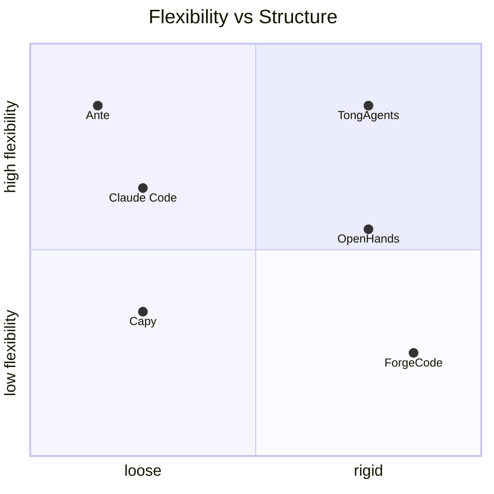

**Choosing the right architecture depends on the task:**
- Fixed, well-understood workflows → Pipeline (ForgeCode)
- Variable, exploratory tasks → Dynamic spawning (Claude Code, Ante)
- Tasks requiring audit trails → Event stream (OpenHands)
- Tasks with clear planning/execution split → Two-phase (Capy)
- Tasks with diverse subtask types → Role-specialized (TongAgents)

The multi-agent approach to context management transforms the fundamental constraint
of LLM systems. Instead of fighting to fit everything into one window, it embraces
distribution — giving each piece of work the clean, focused context it deserves,
and keeping the orchestrator's view high-level and manageable. The cost is complexity
and coordination overhead, but for any task beyond trivial complexity, the token
savings and context quality improvements make multi-agent the dominant strategy.
