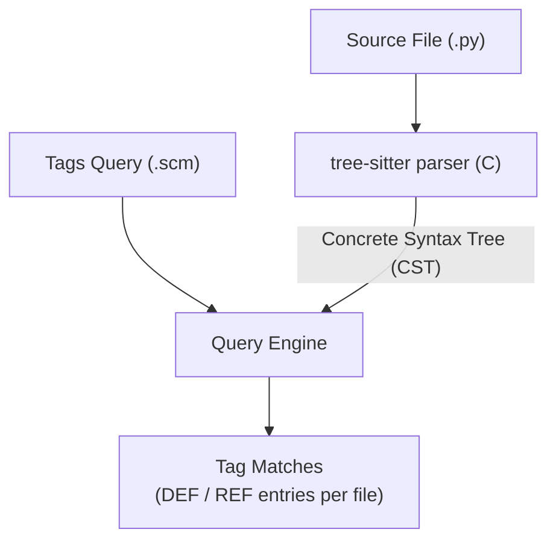
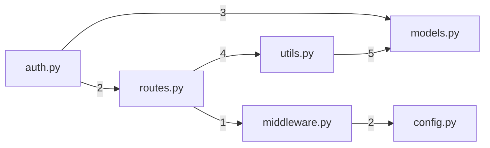
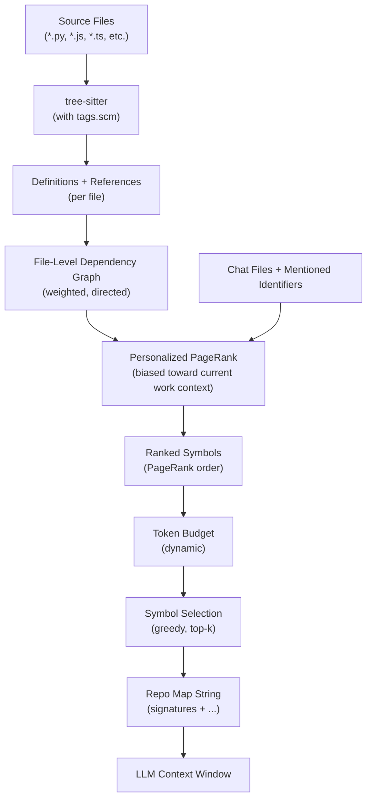

# Repo-Map: Structural Code Understanding for LLM Context

## 1. Introduction: Why Repo-Map Matters

The fundamental problem in AI-assisted coding is deceptively simple: the LLM needs to
understand not just the code it's editing, but how that code relates to everything else
in the repository. Every function call, every import, every class hierarchy — the LLM
needs enough context to make changes that are consistent with the broader codebase.

The naive approaches both fail:

**Send the entire codebase** — Won't fit. A medium-sized project (50K lines) easily
exceeds context windows. Even with million-token models, filling context with raw code
is wasteful — most of it is irrelevant to the current task.

**Send individual files** — Loses relationships. The LLM can edit `auth.py` perfectly
in isolation and still break everything because it didn't know `routes.py` calls
`auth.validate()` with three arguments, not two.

**Repo-map is the solution**: send a COMPACT STRUCTURAL MAP showing definitions,
signatures, and relationships across the entire codebase. The LLM sees the shape of
everything without the bulk of implementation details.

This is **proactive context management** — it prevents context bloat rather than trying
to compress after the fact. Instead of stuffing the context window and then summarizing,
repo-map curates what goes in from the start. The LLM gets exactly the structural
information it needs to understand how pieces fit together, while leaving room in the
context window for the actual files being edited.

Aider (by Paul Gauthier) pioneered this approach, and it remains one of the most
elegant solutions to the code context problem.

---

## 2. What Repo-Map Shows

The repo-map is a compact text representation of the codebase's structure. It includes:

- **Class definitions** and their inheritance
- **Function/method signatures** (parameters, return types) — NOT bodies
- **Key attributes and constants** (class-level variables)
- **Import relationships** (which files depend on which)

Here's what actual repo-map output looks like:

```
aider/coders/base_coder.py:
⋮...
│class Coder:
│    abs_fnames = None
│    cur_messages = None
│    done_messages = None
⋮...
│    @classmethod
│    def create(self, main_model, edit_format, io, **kwargs):
⋮...
│    def get_repo_map(self):
⋮...
│    def run(self, with_message=None):
⋮...
│    def send(self, messages, model=None, functions=None):
⋮...

aider/commands.py:
⋮...
│class Commands:
│    voice = None
⋮...
│    def get_commands(self):
⋮...
│    def run(self, inp):
⋮...
│    def cmd_add(self, args):
⋮...
│    def cmd_drop(self, args):
⋮...

aider/models.py:
⋮...
│class Model:
│    name = None
│    edit_format = None
⋮...
│    def create(self, model_name, **kwargs):
⋮...
│    def token_count(self, text):
⋮...
```

Key elements of the format:

- **File paths** as headers — groups symbols by source file
- **`⋮...` markers** — indicate elided content (implementation bodies, irrelevant code)
- **`│` line prefix** — visual indicator that this is a structural excerpt
- **Indentation preserved** — shows class membership and nesting
- **Signatures only** — `def run(self, with_message=None):` but NOT the function body

This gives the LLM a "table of contents" for the entire codebase. It can see that
`Coder.run()` exists, what arguments it takes, and that it lives in `base_coder.py` —
without consuming tokens on the 200-line implementation.

---

## 3. Tree-Sitter Parsing Deep-Dive

### What is Tree-Sitter?

Tree-sitter is an incremental parsing library originally built for the Atom editor
(now used by Neovim, Helix, Zed, GitHub, and many others). It has grammars for 100+
programming languages.

Key properties:

| Property | Description |
|---|---|
| **General** | Works with any language that has a grammar definition |
| **Fast** | Designed to parse on every keystroke in an editor |
| **Robust** | Handles syntax errors gracefully (partial parses) |
| **Incremental** | Updates the parse tree on edits without full reparse |
| **Dependency-free** | Grammars compile to C; no runtime language toolchain needed |

Tree-sitter is written in C with bindings for Python, Rust, JavaScript, Go, Java,
Swift, and more. It builds a **concrete syntax tree** (CST) — a full structural
representation of the source code including every token, whitespace detail, and
syntactic element.

### How Aider Uses Tree-Sitter

Aider doesn't need a full CST. It uses tree-sitter to extract two things from every
source file:

1. **Definitions** — where symbols (functions, classes, methods, variables) are defined
2. **References** — where symbols are used/called

This extraction is driven by **tags queries** — tree-sitter query files (`.scm` files)
that define what constitutes a "definition" and "reference" in each language.

### Tags Query Example (Python)

```scheme
;; Function definitions
(function_definition
  name: (identifier) @name.definition.function)

;; Class definitions
(class_definition
  name: (identifier) @name.definition.class)

;; Decorated definitions (captures the decorator too)
(decorated_definition
  definition: (function_definition
    name: (identifier) @name.definition.function))

;; Assignments at module level (constants, variables)
(module
  (expression_statement
    (assignment
      left: (identifier) @name.definition.variable)))

;; References — any identifier usage
(identifier) @name.reference
```

For a TypeScript file, the tags query would additionally capture:

```scheme
;; Interface definitions
(interface_declaration
  name: (type_identifier) @name.definition.interface)

;; Type alias definitions
(type_alias_declaration
  name: (type_identifier) @name.definition.type)

;; Method signatures in interfaces
(method_signature
  name: (property_identifier) @name.definition.method)
```

### The Parsing Pipeline



Aider maintains custom `tags.scm` files for many languages, optimized for extracting
the most useful structural information. The `py-tree-sitter-languages` package provides
pip-installable pre-compiled binaries for all supported grammars, so users don't need
to compile anything.

---

## 4. Building the Dependency Graph

Once tree-sitter has extracted definitions and references from every file, Aider builds
a **file-level dependency graph**.

### Step 1: Collect Tags

For every file in the repository, run tree-sitter to get:
- Which symbols are **defined** in this file
- Which symbols are **referenced** in this file

### Step 2: Match References to Definitions

For each reference in file A, find which file B defines that symbol. This creates a
directed edge: A → B (A depends on B).

### Step 3: Weight the Edges

The edge weight is the number of cross-references. If `routes.py` references 5 symbols
defined in `models.py`, the edge weight is 5. More references = stronger dependency.

### The Resulting Graph



Numbers on edges represent reference counts. This graph captures the structural
relationships of the codebase:

- `routes.py` depends heavily on `utils.py` (4 references)
- `auth.py` depends on `models.py` (3 references)
- `middleware.py` has a light dependency on `config.py` (2 references)

This is a **static analysis** graph — built from the actual code structure, not from
runtime behavior or heuristics.

---

## 5. PageRank Applied to Code

### The Insight

Google's PageRank algorithm ranks web pages by "importance": a page is important if
many important pages link to it. The same logic applies to code:

- A file that many other files depend on is structurally important
- A file that important files depend on is even more important
- `utils.py` imported by 30 files is more important than `test_helpers.py` imported by 2

### The Algorithm

Standard PageRank:

```
PR(A) = (1 - d) + d × Σ (PR(Tᵢ) / C(Tᵢ))
```

Where:
- `PR(A)` = PageRank score of file A
- `d` = damping factor (typically 0.85)
- `Tᵢ` = files that reference symbols in A (files that "link to" A)
- `C(Tᵢ)` = total outgoing references from file Tᵢ

### Personalization: The Key Innovation

Standard PageRank gives a global importance ranking. But Aider needs a
**context-sensitive** ranking — what's important RIGHT NOW given what the user is
working on.

**Personalized PageRank** adds a bias vector. Instead of the uniform `(1 - d)` term,
probability mass is concentrated on:

1. **Files currently in the chat** — the user explicitly added these
2. **Files containing mentioned identifiers** — symbols the user or LLM discussed

```
PR(A) = (1 - d) × p(A) + d × Σ (PR(Tᵢ) / C(Tᵢ))
```

Where `p(A)` is the personalization vector:
- `p(chat_file) = high` (files in chat get large probability mass)
- `p(mentioned_file) = medium` (files with mentioned symbols)
- `p(other_file) = low` (everything else gets minimal mass)

The result: if you're working on `auth.py`, the PageRank is biased so that files
closely connected to `auth.py` rank highest — its direct dependencies, files that
depend on it, and files that share dependencies with it.

Aider uses the NetworkX library's `pagerank` implementation with the personalization
parameter to compute this efficiently.

---

## 6. Token Budget Allocation

### Default Budget

The default repo-map token budget is **1,024 tokens**, configurable via `--map-tokens`.
This is deliberately small — the map should be a concise reference, not a context hog.

### Dynamic Resizing

The budget isn't static. Aider adjusts it based on what else is in the context:

| Chat State | Repo-Map Budget | Rationale |
|---|---|---|
| No files in chat | Up to **8× default** (8,192 tokens) | Maximize codebase awareness when LLM has no file content |
| Few files in chat | **~2-4× default** | Balance between map and file content |
| Many files in chat | **1× default** or less | Leave room for the actual files being edited |

This is smart resource allocation. When the LLM has no files open, the repo-map
expands to give maximum structural awareness. As files are added and consume context
space, the map shrinks to make room.

### Selection Algorithm

Given a token budget, Aider selects symbols greedily:

```
ranked_symbols = personalized_pagerank(dependency_graph, chat_context)
map_content = []
tokens_used = 0

for symbol in ranked_symbols:  # highest rank first
    symbol_text = format_symbol(symbol)  # signature + context
    symbol_tokens = count_tokens(symbol_text)
    if tokens_used + symbol_tokens > budget:
        break
    map_content.append(symbol_text)
    tokens_used += symbol_tokens

return render_map(map_content)
```

The highest-ranked symbols (most relevant to current work) always make it in. Lower-
ranked symbols get included only if budget allows.

---

## 7. Incremental Updates and Caching

### The Performance Problem

Re-parsing an entire codebase with tree-sitter on every LLM turn would be slow for
large repositories. A repo with 10,000 files could take several seconds to fully parse.

### Aider's Caching Strategy

Aider uses **diskcache** (a SQLite-backed persistent cache) to store tree-sitter tags:

```
Cache Key: (file_path, file_mtime)
Cache Value: List of (symbol_name, symbol_kind, line_number, is_definition)
```

**mtime-based invalidation**: on each turn, Aider checks file modification times.
Only files that changed since the last parse get re-parsed. Unchanged files use
cached tags directly.

### Tree-Sitter's Native Incrementality

Tree-sitter itself supports incremental parsing at the character level — you can tell
it "bytes 100-105 changed" and it updates the syntax tree without reparsing the whole
file. Aider doesn't use this fine-grained incrementality (it reparses changed files
fully) but benefits from caching at the file level.

### Result

For a typical edit-test cycle:
- User changes 1-2 files
- Aider reparses those 1-2 files (~milliseconds)
- All other files use cached tags
- Graph construction and PageRank run on the full (cached) tag set
- Total repo-map generation: well under a second, even for large repos

---

## 8. End-to-End Pipeline

Here's the complete repo-map pipeline from source files to LLM context:



The pipeline runs on every LLM turn, but steps 1-2 are largely cached so the
effective cost is steps 3-6 (graph algorithms + string formatting).

---

## 9. Benefits for the LLM

The repo-map gives the LLM several critical capabilities:

**1. API Surface Awareness**
The LLM sees class definitions, method signatures, and function parameters from across
the entire repo. It can write code that correctly calls existing functions without
needing to see their implementations.

**2. Dependency Understanding**
The LLM knows which files depend on which. If it changes a function signature in
`models.py`, the repo-map shows that `routes.py`, `auth.py`, and `admin.py` all
reference it — suggesting those files may need updates too.

**3. File Discovery**
The LLM can identify WHICH files it needs to see in detail. If the repo-map shows
`DatabasePool.get_connection()` exists in `db/pool.py`, the LLM can request that file
be added to chat context for detailed editing.

**4. Correct Abstractions**
New code uses existing utilities and patterns. The LLM sees `utils.validate_email()`
exists and uses it instead of writing a new validation function.

**5. Rename/Refactor Awareness**
When renaming a symbol, the repo-map helps the LLM understand the blast radius — every
file that references the old name is visible in the structural map.

---

## 10. Comparison with Other Code Understanding Approaches

### ForgeCode: Semantic Entry-Point Discovery

ForgeCode takes a fundamentally different approach — semantic matching rather than
structural analysis.

- **Index**: Embed the entire project into vector embeddings (code chunks → vectors)
- **Analyze**: Parse the task description semantically (what is the user trying to do?)
- **Match**: Vector similarity search to find the most relevant code chunks
- **Return**: Ranked entry-point files and functions where the agent should start

ForgeCode claims "up to 93% fewer tokens" compared to naive exploration, because the
agent starts exactly where it needs to be rather than wandering through the codebase.

**Key difference from repo-map**: ForgeCode answers "where should I start?" while
repo-map answers "how does everything connect?" They're complementary — you could use
ForgeCode to find entry points and repo-map to understand the surrounding structure.

### Cursor's Codebase Indexing

Cursor implements the most successful consumer-facing code understanding system:

- **Embedding-based indexing** — chunks of code embedded into vectors, stored locally
- **Automatic re-indexing** — watches for file changes and updates embeddings
- **Hybrid retrieval** — combines vector similarity with structural code understanding
- **`.cursorignore`** — lets users scope what gets indexed (exclude vendor, generated)
- Likely uses a combination of embeddings AND structural analysis (not purely one or
  the other)

Cursor's approach is more resource-intensive than repo-map but also more flexible —
it can match on semantic meaning, not just structural relationships.

### Sourcegraph / SCIP

Sourcegraph's Code Intelligence Platform uses a layered approach:

```
Layer 1: Precise indexers (language servers, SCIP indexers)
         → Full type information, cross-repo references
         → Expensive to generate, very accurate

Layer 2: Tree-sitter heuristics (syntactic analysis)
         → Fast, language-general, less precise
         → Falls back here when precise indexers unavailable

Layer 3: Text search (ripgrep-based)
         → Fastest, least precise
         → Catches what structural analysis misses
```

This is production-grade code understanding at scale (millions of repos). More
heavyweight than repo-map but designed for a different use case (code navigation in
a web UI, not LLM context management).

### ast-grep

ast-grep is a structural code search/replace tool built on tree-sitter:

```bash
# Find all functions that call console.log
ast-grep -p 'function $FUNC($_) { $$$ console.log($MSG) $$$ }'

# Find all React components that use useState
ast-grep -p 'const [$STATE, $SETTER] = useState($INIT)'
```

Key features:
- **Pattern syntax** with `$MATCH` wildcards instead of regex
- **Language-aware** — matches on AST structure, not text
- **Fast** — tree-sitter parsing is near-instant
- Useful for automated refactoring and linting rules

ast-grep doesn't build a repo-wide map but is valuable for targeted structural
queries — "find every place this pattern appears."

---

## 11. Limitations and Trade-offs

### Structure Without Semantics

Repo-map shows that `def process(data, mode='fast'):` exists but nothing about what
it actually does. Complex algorithms, business logic, and subtle invariants are
invisible in signatures alone. The LLM must request the full file to understand
implementation details.

### Language Support Variance

Tree-sitter grammar quality varies by language:

| Tier | Languages | Grammar Quality |
|---|---|---|
| Excellent | Python, JavaScript, TypeScript, Rust, Go, C, C++ | Mature, well-tested |
| Good | Java, C#, Ruby, PHP, Swift, Kotlin | Solid, occasional edge cases |
| Adequate | Haskell, Elixir, Scala, Lua | Usable but less complete |
| Limited | Niche/new languages | May lack grammars entirely |

### Monorepo Scale

Even a compact structural map can be large for monorepos. A repo with 50,000 files
might produce a repo-map that exceeds any reasonable token budget. Aider handles this
through aggressive PageRank-based pruning, but some structural relationships will
inevitably be lost.

### Dynamic Languages

In Python, JavaScript, and Ruby, types flow at runtime. Tree-sitter extracts syntax
but can't determine:
- What type `data` is in `def process(data):`
- Which class a method call resolves to
- Dynamic attribute access via `getattr()`

Static languages (Go, Rust, Java) produce more reliable dependency graphs because
imports and types are explicit.

### Reference Ambiguity

If both `auth.py` and `admin.py` define a function called `validate()`, and `routes.py`
calls `validate()`, the reference graph may create edges to both definitions. The
repo-map uses heuristics (import analysis, call context) to disambiguate, but it's
not perfect.

---

## 12. Implementation Notes

### Tree-Sitter Grammars in Aider

Aider supports 30+ languages through tree-sitter, including: Python, JavaScript,
TypeScript, TSX, JSX, Java, C, C++, C#, Ruby, Go, Rust, PHP, Swift, Kotlin, Scala,
Haskell, Lua, Elixir, Elm, Dart, R, OCaml, Zig, and more.

### The grep-ast Library

Aider's companion tool `grep-ast` provides AST-aware code search:

```bash
# Regular grep: finds "class" anywhere (comments, strings, etc.)
grep -n "class" myfile.py

# grep-ast: finds only class DEFINITIONS
grep-ast "class" myfile.py
```

It uses tree-sitter to understand code structure, showing results with surrounding
context (the enclosing function or class) rather than just matching lines.

### Evolution from ctags

Aider originally used **universal-ctags** for symbol extraction. Tree-sitter replaced
it because:

- **Richer output** — tree-sitter captures references, not just definitions
- **No external dependency** — ctags requires system installation; tree-sitter ships
  as a Python package
- **Better language support** — tree-sitter grammars are more actively maintained
- **Incremental parsing** — ctags reparses entire files; tree-sitter can do incremental
- **Robustness** — tree-sitter handles syntax errors; ctags often fails on broken code

### Key Source Files in Aider

The repo-map implementation lives primarily in:

- `aider/repomap.py` — core repo-map generation (graph building, PageRank, formatting)
- `aider/repo.py` — git integration, file tracking
- Tags query files in `aider/queries/` — per-language `.scm` files

---

## 13. Key Takeaways

1. **Repo-map solves the context window problem** by providing a compact structural
   summary instead of raw code
2. **Tree-sitter enables language-general parsing** — one system handles 100+ languages
3. **PageRank with personalization** ranks symbols by relevance to current work
4. **Dynamic token budgets** adapt to what else is in the context window
5. **Caching makes it fast** — only changed files get reparsed
6. **The approach is complementary** to embedding-based retrieval (ForgeCode, Cursor)
   — structural analysis and semantic matching serve different purposes

The repo-map is arguably Aider's most innovative architectural decision. It transforms
the "how does the LLM understand my codebase?" problem from an intractable context
window challenge into an elegant graph algorithm problem.
