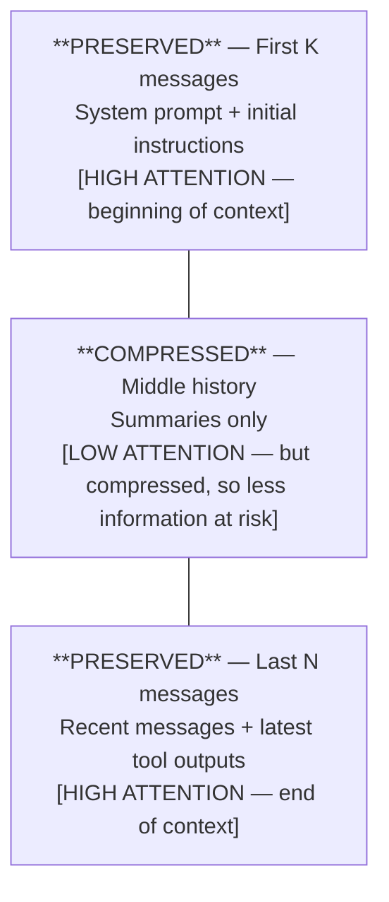
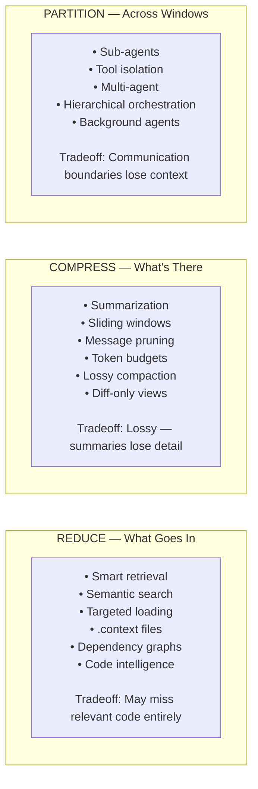

# The Problem: Why Context Management Is THE Critical Challenge for Coding Agents

> "Context size is a multiplier on the right entry point, not a substitute for it."
> — ForgeCode architecture documentation

Context management is not one of many challenges facing coding agents — it is *the*
defining constraint that shapes every architectural decision, from prompt design to
multi-agent orchestration. This document examines why, with real numbers, research
citations, and practical implications.

---

## 1. The Fundamental Mismatch

### The Scale of Real Codebases

Software projects produce tokens at a scale that dwarfs even the largest context windows:

| Codebase               | Lines of Code | Estimated Tokens | Context Windows Needed (200K) |
|------------------------|---------------|-------------------|-------------------------------|
| Linux kernel           | ~28M LOC      | ~100M+ tokens     | 500+                          |
| Chromium               | ~35M LOC      | ~130M+ tokens     | 650+                          |
| Large monorepo (FAANG) | ~10M LOC      | ~35M tokens       | 175+                          |
| Medium SaaS product    | ~500K LOC     | ~2M tokens        | 10+                           |
| Typical startup app    | ~50K LOC      | ~200K tokens      | 1 (barely)                    |
| Small open-source tool | ~10K LOC      | ~40K tokens       | 0.2                           |

The rule of thumb: **1 LOC ≈ 3-4 tokens** (accounting for indentation, variable names,
and syntax). A medium project at 500K LOC produces ~2M tokens of raw source code alone,
before any conversation history, tool outputs, or system prompts.

### Context Window Timeline

The history of context windows shows rapid growth — but not fast enough:

```
Year   Model              Context Window    Notes
─────  ─────────────────  ────────────────  ──────────────────────────
2019   GPT-2              1,024 tokens      Could barely hold one file
2020   GPT-3              2,048 tokens      A few functions at most
2023   GPT-3.5            4K → 16K          First "useful" for coding
2023   GPT-4              8K → 32K → 128K   Rapid expansion mid-year
2024   Claude 3           200K tokens       ~150 pages of code
2024   Gemini 1.5 Pro     1M → 2M tokens    Largest production window
2024   GPT-4o             128K tokens       Standard for agentic use
2024   Claude 3.5 Sonnet  200K tokens       Quality + size sweet spot
2025   Claude 4 / Opus    200K tokens       Maintained, not expanded
2025   Gemini 2.5 Pro     1M tokens         Agentic-optimized
```

### The Mismatch Visualized

```
Codebase Size vs. Context Window (log scale, tokens)
                                                                              
  100M+ ─── ████████████████████████████████████████████████  Linux kernel
             ████████████████████████████████████████████████
   10M  ─── ████████████████████████████████                  Large monorepo
             ████████████████████████████████
    2M  ─── ████████████████  ──────────────────────────────  Gemini 1.5 (2M)
             ████████████████
  500K  ─── █████████                                         Medium project
             █████████
  200K  ─── ██████  ────────────────────────────────────────  Claude 3.5 (200K)
             ██████
  128K  ─── █████  ─────────────────────────────────────────  GPT-4o (128K)
             █████
   50K  ─── ███                                               Small project
             ███
    4K  ─── █  ─────────────────────────────────────────────  GPT-3.5 (4K)
             █

  Even the 2M window cannot hold a medium codebase (2M tokens of source)
  PLUS conversation history PLUS tool call outputs PLUS system prompts.
```

The math is unforgiving. A medium codebase (~2M tokens) fills even Gemini's 2M window
*completely* — leaving zero room for the conversation, system prompt, tool outputs, or
any form of reasoning. In practice, you need the context window to hold:

```
  System prompt:        ~2K-5K tokens
  Conversation history: ~10K-50K tokens (grows each turn)
  Tool outputs:         ~20K-100K tokens (file reads, search results, diffs)
  Working code:         ~5K-20K tokens (files being edited)
  ─────────────────────────────────────
  Minimum budget:       ~37K-175K tokens BEFORE any codebase context
```

This means even a 200K window has only ~25K-163K tokens available for actual codebase
content — a fraction of any non-trivial project.

---

## 2. Quality Degradation Curves

### The Cliff, Not the Slope

Anthropic has been transparent about a critical property of long-context performance:
**quality degrades as context fills, and the degradation is not linear**.

```
Model Performance vs. Context Utilization

  Quality
  100% ─── ██████████████████████████████████████
   95% ─── █████████████████████████████████████████
   90% ─── ████████████████████████████████████████████
   85% ─── ██████████████████████████████████████████████
   80% ─── █████████████████████████████████████████████████
   70% ─── ████████████████████████████████████████████████████
   50% ─── ███████████████████████████████████████████████████████  ← cliff
   30% ─── ████████████████████████████████████████████████████████████
        ┬──────┬──────┬──────┬──────┬──────┬──────┬──────┬──────┬──────
        0%    10%    20%    30%    40%    50%    60%    70%    80%   100%
                              Context Utilization

  ● Gentle slope from 0-60%: minor degradation, still highly functional
  ● The cliff at 60-70%: rapid quality drop-off
  ● Beyond 80%: instructions forgotten, patterns inconsistent, coherence breaks
```

### Why This Happens: Attention Mechanics

The transformer's self-attention mechanism distributes attention weights across all tokens
in the context. As context grows:

1. **Attention dilution**: Each token competes with more tokens for attention weight.
   With 10K tokens, each gets ~0.01% average attention. With 200K tokens, each gets
   ~0.0005%. Critical instructions get proportionally less focus.

2. **Positional encoding decay**: Despite advances (RoPE, ALiBi), models still struggle
   to maintain precise positional relationships across very long distances.

3. **Working memory saturation**: The model's effective "working memory" (the information
   it can actively reason about) is far smaller than its context window. Research suggests
   models can actively track ~10-20 distinct facts regardless of context size.

### Practical Impact on Coding Agents

At high context utilization, agents exhibit predictable failure modes:

- **Instruction amnesia**: System prompt directives are partially forgotten
- **Style drift**: Code formatting and naming conventions become inconsistent
- **Import blindness**: The model forgets which modules were already imported
- **Duplicate generation**: Functions or variables are re-declared
- **Context confusion**: Information from file A bleeds into edits to file B

```python
# Example of context confusion at high utilization:
# Agent was editing auth.py but context also contained database.py

# INTENDED (auth.py context):
def verify_token(token: str) -> User:
    decoded = jwt.decode(token, SECRET_KEY, algorithms=["HS256"])
    return User.from_claims(decoded)

# ACTUALLY GENERATED (database.py patterns leaked in):
def verify_token(token: str) -> User:
    session = SessionLocal()           # ← from database.py patterns
    decoded = jwt.decode(token, SECRET_KEY, algorithms=["HS256"])
    user = session.query(User).filter_by(id=decoded["sub"]).first()  # ← wrong pattern
    session.close()                    # ← context contamination
    return user
```

---

## 3. The "Lost in the Middle" Problem

### The Research

Liu et al. (2023), "Lost in the Middle: How Language Models Use Long Contexts"
(arXiv:2307.03172, published in *Transactions of the Association for Computational
Linguistics*, 2024), demonstrated a striking finding:

> Language models exhibit a **U-shaped performance curve** — they attend strongly to
> information at the **beginning** and **end** of the context, while information placed
> in the **middle** is significantly more likely to be ignored or misused.

### The U-Curve

```
  Retrieval
  Accuracy
  100% ─── ██                                                          ██
   90% ─── ████                                                      ████
   80% ─── ██████                                                  ██████
   70% ─── ████████                                              ████████
   60% ─── ██████████                                          ██████████
   50% ─── ████████████                                      ████████████
   40% ─── ██████████████████████████████████████████████████████████████
        ┬─────────┬──────────┬──────────┬──────────┬──────────┬─────────
      Start    20%         40%        60%         80%        End
                    Position in Context

  Models reliably use information at the start (system prompt, first files loaded)
  and at the end (most recent messages, latest tool outputs).
  Everything in between is the "dead zone."
```

### Key Findings from the Paper

- Performance dropped by **20-30%** when relevant information was in positions 4-7
  (out of 10 documents) vs. positions 1 or 10
- This effect held across **all tested models** (GPT-3.5-turbo, Claude, etc.)
- Longer contexts made the middle-blindness **worse**, not better
- Even models explicitly designed for long contexts showed the U-curve

### Implications for Coding Agents

This has direct architectural consequences:

1. **File ordering matters**: If an agent loads 10 files into context, the 5th and 6th
   files loaded will receive the least attention. Critical files should be loaded
   *first* or *last*.

2. **System prompt resilience**: Instructions in the system prompt (beginning) are
   relatively safe. Instructions embedded in mid-conversation messages are at risk.

3. **Sliding window design**: This is precisely why effective context compaction
   strategies preserve the **first K messages** (system prompt + initial instructions)
   and the **last N messages** (recent conversation), compressing the middle.



---

## 4. Cost Amplification in Agentic Loops

### The Compounding Problem

In a standard chat interaction, each message is sent once. In an **agentic loop**, the
entire conversation context is re-sent with every API call. This creates a compounding
cost structure that grows superlinearly:

```
  Turn 1:  Send [system + msg1]                    = S + m₁ tokens
  Turn 2:  Send [system + msg1 + resp1 + msg2]     = S + m₁ + r₁ + m₂
  Turn 3:  Send [system + msg1..3 + resp1..2]      = S + Σ(mᵢ + rᵢ) for i=1..2 + m₃
  ...
  Turn N:  Send [everything]                       = S + Σ(mᵢ + rᵢ) for i=1..N-1 + mₙ
```

**Total input tokens across all turns:**

```
  Total = Σᵢ₌₁ᴺ context_size(i)

  If context grows linearly by ~g tokens per turn:
  context_size(i) = S + i × g
  Total = N×S + g × N(N+1)/2

  This is O(N²) — quadratic growth in total tokens processed!
```

### Concrete Cost Example

Consider a 30-turn debugging session with GPT-4o ($2.50/M input, $10.00/M output):

```
  Assumptions:
  - System prompt: 3K tokens
  - Average message + response: 4K tokens per turn
  - Tool outputs: 3K tokens per turn (file reads, search results)
  - Growth per turn: ~7K tokens

  Turn  | Context Size | Cumulative Input Tokens
  ──────┼──────────────┼─────────────────────────
    1   |     10K      |         10K
    5   |     38K      |        120K
   10   |     73K      |        415K
   15   |    108K      |        885K
   20   |    143K      |      1,530K
   25   |    178K      |      2,350K
   30   |    213K      |      3,345K  ← exceeds 200K window!

  Total input cost:  3.345M × $2.50/M = $8.36
  Total output cost: ~2K × 30 × $10/M = $0.60
  ─────────────────────────────────────────────
  Total session cost: ~$8.96

  WITH compaction (50% reduction at turn 15):
  Total input tokens: ~2.1M
  Total cost: ~$5.85  (35% savings)
```

### Cost Comparison Table

| Scenario                    | Turns | Avg Context | Total Input Tokens | Cost (GPT-4o) | Cost (Claude Sonnet) |
|-----------------------------|-------|-------------|--------------------|--------------:|---------------------:|
| Quick fix                   | 5     | 20K         | 100K               | $0.25         | $0.30                |
| Feature implementation      | 20    | 80K         | 1.6M               | $4.00         | $4.80                |
| Complex debugging           | 40    | 120K        | 4.8M               | $12.00        | $14.40               |
| Multi-file refactor         | 60    | 150K        | 9.0M               | $22.50        | $27.00               |
| Long research + implement   | 100   | 180K        | 18.0M              | $45.00        | $54.00               |

*Prices: GPT-4o at $2.50/M input, Claude 3.5 Sonnet at $3.00/M input (2024 pricing)*

These numbers make the case clear: **context compaction isn't just about fitting in the
window — it's about cost control**. A 30% reduction in average context size yields a
30% reduction in API costs across the entire session.

---

## 5. Exploration Bloat: The Discovery Tax

### The Problem

Before a coding agent can fix a bug or implement a feature, it must *find* the relevant
code. This exploration phase generates enormous amounts of context that is immediately
stale — but persists in the conversation history forever (without compaction).

### A Typical Exploration Sequence

```
Agent Task: "Fix the authentication timeout bug"

Turn 1: Agent searches for "authentication" in codebase
        → Tool output: 47 file matches, ~3K tokens of file paths

Turn 2: Agent reads src/auth/middleware.ts (wrong file)
        → Tool output: 200 lines, ~800 tokens — IRRELEVANT

Turn 3: Agent reads src/auth/session.ts (wrong file)
        → Tool output: 350 lines, ~1.4K tokens — IRRELEVANT

Turn 4: Agent reads src/auth/token.ts (wrong file)
        → Tool output: 180 lines, ~720 tokens — IRRELEVANT

Turn 5: Agent searches for "timeout" in src/auth/
        → Tool output: 12 matches, ~500 tokens

Turn 6: Agent reads src/auth/refresh.ts (CORRECT file)
        → Tool output: 250 lines, ~1K tokens — RELEVANT

Turn 7: Agent reads the related test file
        → Tool output: 400 lines, ~1.6K tokens — RELEVANT

By turn 7:
  Total context from exploration: ~8K tokens
  Relevant context:               ~2.6K tokens (turns 6-7)
  Irrelevant context:             ~5.4K tokens (turns 1-5) — 68% waste!
```

### The Accumulation Effect

```
Context Composition Over Time (without compaction)

  Turn 5:   [████████ exploration ██][███ relevant ███]
             60% stale              40% useful

  Turn 15:  [███████████████████ exploration ███████████████][████ relevant ████]
             70% stale                                       30% useful

  Turn 30:  [██████████████████████████████ exploration ████████████████████████████][██ rel ██]
             80% stale                                                               20% useful

  By turn 30, the agent is dragging around ~80% dead weight in context.
  This dead weight directly degrades quality (Section 2) and increases cost (Section 4).
```

### Why This Is the #1 Motivation for Sub-Agent Architectures

Claude Code, Cursor, ForgeCode, and other advanced coding agents use **sub-agent
architectures** (sometimes called "tool agents" or "exploration agents") specifically
to solve this problem:

```
  WITHOUT sub-agents:                WITH sub-agents:

  Main Context:                      Main Context:
  ┌──────────────────────┐           ┌──────────────────────┐
  │ System prompt         │           │ System prompt         │
  │ User request          │           │ User request          │
  │ search results (stale)│           │                       │
  │ wrong file 1 (stale)  │           │ Sub-agent summary:    │
  │ wrong file 2 (stale)  │           │ "Found bug in         │
  │ wrong file 3 (stale)  │           │  refresh.ts:142,      │
  │ search results (stale)│           │  timeout not reset    │
  │ correct file          │           │  after token refresh" │
  │ test file             │           │                       │
  │ ... editing ...       │           │ correct file          │
  └──────────────────────┘           │ test file             │
  ~15K tokens, 68% waste             │ ... editing ...       │
                                     └──────────────────────┘
                                     ~5K tokens, ~10% waste
```

The sub-agent performs exploration in its own disposable context window, then returns
only the relevant findings. The main agent's context stays clean.

---

## 6. Why More Context Isn't Always Better

### The Counter-Intuitive Truth

It seems logical: bigger context window → can hold more code → better results. But
empirical evidence and practical experience tell a different story.

### ForgeCode's Key Insight

> A model with 200K context starting in the right file outperforms a model with 1M
> context starting in the wrong directory.

This is because:

1. **Signal-to-noise ratio matters more than total capacity.** 20K tokens of precisely
   relevant code produces better results than 500K tokens of "probably relevant" code.

2. **Needle-in-a-haystack degradation.** As context grows, the model's ability to locate
   and use specific pieces of information degrades. Google's own evaluations of Gemini
   showed retrieval accuracy dropping from ~99% at 1K tokens to ~90% at 128K tokens to
   ~80% at 1M tokens in adversarial needle tests.

3. **Attention is O(n²).** Self-attention computation scales quadratically with sequence
   length. This means:
   - 128K context: ~16.4 billion attention computations
   - 1M context: ~1 trillion attention computations (61× more)
   - This translates directly to latency and cost

### Practical Demonstration

```python
# Scenario: Find and fix a bug in a rate limiter

# APPROACH A: Load everything (1M context)
# Load all 200 files in src/ directory (~800K tokens)
# Ask model to find and fix the rate limiter bug

# Result: Model reads through everything, gets confused by similar
# patterns in caching code, applies wrong fix pattern.
# Time: 45 seconds. Cost: $2.40. Accuracy: 60%.

# APPROACH B: Targeted loading (200K context)
# Use grep to find "rate_limit" → 3 files
# Load only those 3 files (~12K tokens)
# Ask model to find and fix the bug

# Result: Model has clear focus, identifies the exact issue,
# generates correct fix.
# Time: 8 seconds. Cost: $0.15. Accuracy: 95%.
```

### The Gemini Paradox

Gemini CLI leverages Google's 1M-token context window — the largest available. Yet even
Gemini CLI implements context management strategies:

- **Selective file loading**: Doesn't dump the entire codebase into context
- **Search-then-read**: Uses grep/find to identify relevant files before loading them
- **Summary caching**: Maintains compressed representations of previously explored code

If 1M tokens solved the problem, none of these strategies would be necessary. The fact
that even 1M-context systems need careful context curation proves the point.

---

## 7. The Design Space: A Taxonomy of Solutions

Every context management strategy falls into one of three fundamental categories:

### Strategy Taxonomy



### Detailed Comparison

| Strategy              | Token Savings | Information Loss | Latency Impact | Implementation |
|-----------------------|---------------|------------------|----------------|----------------|
| Semantic search       | 80-95%        | Medium (misses)  | +2-5s          | Complex        |
| Sliding window        | 30-60%        | Medium           | Minimal        | Simple         |
| LLM summarization     | 50-80%        | Medium-High      | +3-10s         | Medium         |
| Sub-agents            | 60-90%        | Low (curated)    | +5-15s         | Complex        |
| Token budgets         | Fixed cap     | Variable         | Minimal        | Simple         |
| .context files        | 70-90%        | Low (user-guided)| None           | Simple         |
| Diff-only views       | 60-80%        | Low for edits    | Minimal        | Medium         |

### The Fundamental Tension

Every approach navigates the same tradeoff:

```
  Information Fidelity ◄──────────────────────► Token Efficiency

  Full codebase in context                      Empty context
  (perfect information,                         (zero cost,
   impossible cost)                              zero capability)

  The art of context management is finding the optimal point on this spectrum
  for each specific task, at each specific moment in the conversation.
```

Every compression loses something. Every partition creates a communication boundary
where information can be lost or distorted. The goal is never zero loss — it's
**minimizing loss of task-relevant information** while maximizing token efficiency.

---

## 8. Historical Context: The Arms Race That Hasn't Won

### The Growth Timeline

```
  Context Window Size (tokens, log scale)

  2M    ─                                                    ● Gemini 1.5 Pro
  1M    ─                                                 ●  Gemini 2.5 Pro
        │
  200K  ─                                              ● ●  Claude 3/3.5/4
  128K  ─                                           ● ●     GPT-4 Turbo / 4o
        │
  32K   ─                                        ●          GPT-4 (32K)
  16K   ─                                     ●             GPT-3.5 (16K)
  8K    ─                                  ●                GPT-4 (8K)
  4K    ─                               ●                   GPT-3.5 (4K)
  2K    ─                          ●                         GPT-3
  1K    ─                     ●                              GPT-2
        └──────┬──────┬──────┬──────┬──────┬──────┬──────┬──────
             2019   2020   2021   2022   2023   2024   2025

  Growth: ~2000× in 6 years (1K → 2M)
```

### Growth Rate Comparison

Context windows have grown ~2000× in six years. But codebases haven't shrunk:

| Metric                      | 2019          | 2025          | Growth |
|-----------------------------|---------------|---------------|--------|
| Largest context window      | 1K tokens     | 2M tokens     | 2000×  |
| Average SaaS codebase       | ~300K LOC     | ~600K LOC     | 2×     |
| Linux kernel                | ~25M LOC      | ~30M LOC      | 1.2×   |
| Avg microservices per org   | ~5            | ~15           | 3×     |
| Total code per org          | ~500K LOC     | ~2M LOC       | 4×     |

Context windows grew 2000× while codebases grew 2-4×. Yet the problem persists. Why?

### Why the Arms Race Hasn't Solved the Problem

1. **Codebases grow too**: Modern software trends (microservices, monorepos, generated
   code, dependencies) mean there's always more code than context.

2. **Conversation history compounds**: Even with a 2M window, a 100-turn agentic session
   with rich tool outputs can consume 500K+ tokens of history alone.

3. **Quality degrades** (Section 2): Bigger windows don't mean better attention. The
   degradation curves shift but don't disappear.

4. **Cost scales linearly** (Section 4): 10× more context = 10× more cost per turn.
   At $2.50/M input tokens, a 2M context turn costs $5.00 in input alone.

5. **Latency increases**: Processing 2M tokens takes 30-60 seconds. Users expect
   sub-10-second responses for simple questions.

### The Future: Even Infinite Context Wouldn't Suffice

Imagine a hypothetical model with infinite context and zero cost. Would context
management become irrelevant? **No**, because:

- **Quality degradation** from attention dilution would still apply
- **Latency** would still scale with context size
- **The "Lost in the Middle" problem** would become worse, not better
- **Signal-to-noise ratio** would plummet as irrelevant code drowns out relevant code

The fundamental insight is that **context management is not a stopgap until windows get
big enough — it is an essential capability** that becomes *more* important as systems
scale, not less.

---

## Summary: Why This Is THE Problem

```
  ┌──────────────────────────────────────────────────────────────────────┐
  │                                                                      │
  │   Context management is the critical challenge because it is the     │
  │   BINDING CONSTRAINT on every other capability:                      │
  │                                                                      │
  │   ● Code understanding?  Limited by what fits in context.            │
  │   ● Bug fixing?          Limited by how much relevant code is seen.  │
  │   ● Refactoring?         Limited by how many files can be tracked.   │
  │   ● Multi-file edits?    Limited by cross-file context retention.    │
  │   ● Cost efficiency?     Dominated by context size × turn count.     │
  │   ● Response quality?    Degrades with context utilization.          │
  │   ● User experience?     Latency scales with context size.           │
  │                                                                      │
  │   Every architectural decision in a coding agent — from prompt       │
  │   design to tool selection to multi-agent orchestration — is         │
  │   ultimately a context management decision.                          │
  │                                                                      │
  └──────────────────────────────────────────────────────────────────────┘
```

---

## References

1. Liu, N., Lin, K., Hewitt, J., Paranjape, A., Bevilacqua, M., Petroni, F., & Liang, P.
   (2023). "Lost in the Middle: How Language Models Use Long Contexts."
   *arXiv:2307.03172*. Published in *Transactions of the ACL*, 2024.

2. Anthropic. (2024). "Claude 3 Model Card." Documentation on context window behavior
   and performance characteristics.

3. Google DeepMind. (2024). "Gemini 1.5: Unlocking multimodal understanding across
   millions of tokens of context." *arXiv:2403.05530*.

4. OpenAI. (2023-2024). GPT-4 Technical Report and API documentation on context
   window specifications and pricing.

5. ForgeCode architecture documentation. Internal design documents on context management
   strategies and the "right entry point" principle.

6. Vaswani, A., et al. (2017). "Attention Is All You Need." *NeurIPS 2017*.
   Foundation for understanding attention mechanism scaling properties.

7. Press, O., Smith, N., & Lewis, M. (2022). "Train Short, Test Long: Attention with
   Linear Biases Enables Input Length Generalization." *ICLR 2022*.

---

*This document is part of the context management research series. See also:
[solutions.md](./solutions.md) for how leading agents address these challenges.*
