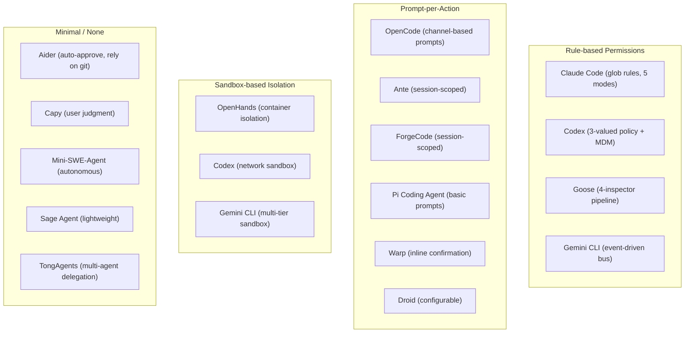
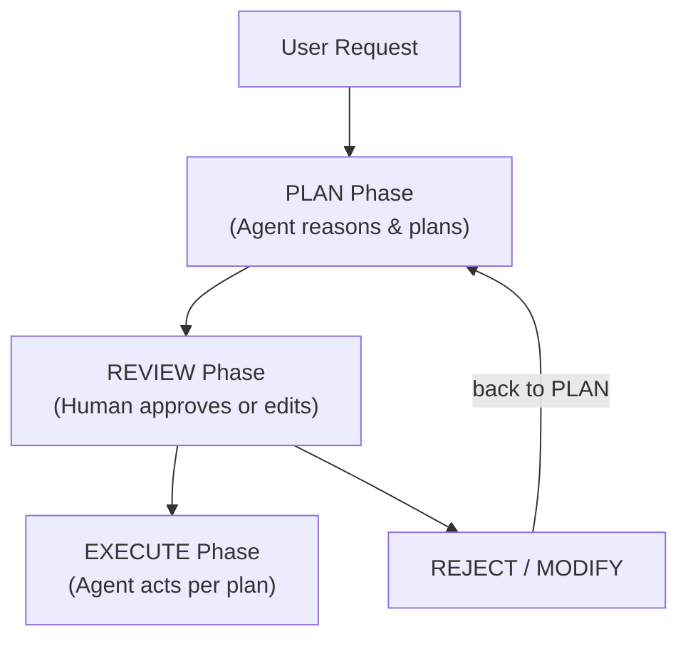
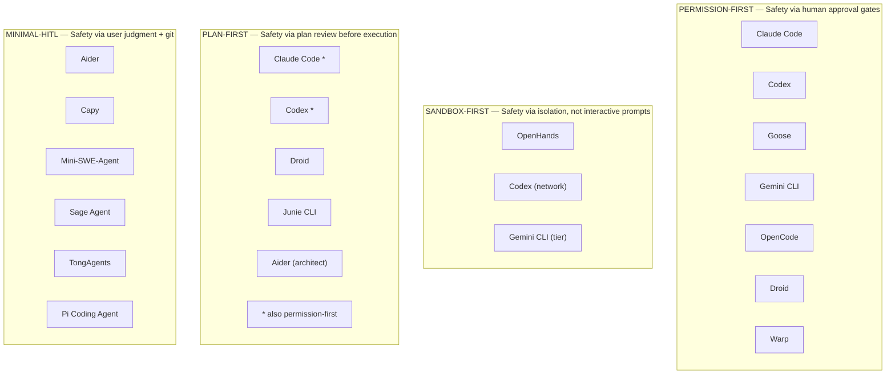

# Cross-Agent Comparison of Human-in-the-Loop Approaches

> A systematic comparison of how 17 CLI coding agents implement human oversight—permission
> models, trust levels, planning, undo, and UX—revealing the fundamental trade-offs that
> shape the HITL landscape.

---

## Overview

This document is the **master comparison** for human-in-the-loop (HITL) features across
all 17 agents studied in this research library. Where the sibling documents dive deep into
individual dimensions—[permission prompts](./permission-prompts.md), [trust levels](./trust-levels.md),
[plan-and-confirm](./plan-and-confirm.md), [undo and rollback](./undo-and-rollback.md),
[feedback loops](./feedback-loops.md), [interactive debugging](./interactive-debugging.md),
and [UX patterns](./ux-patterns.md)—this document provides the cross-cutting view.

The agents span five implementation languages, four TUI frameworks, and radically different
philosophies on when (and whether) to involve the human. Some agents treat every file write
as a moment requiring approval. Others wrap the entire execution environment in a container
and let the agent run freely inside. Most fall somewhere in between.

The comparison reveals three macro-level patterns:

1. **Permission-first agents** build safety around prompt-and-approve workflows
2. **Sandbox-first agents** substitute isolation for interactive confirmation
3. **Minimal-HITL agents** trust the user to review output and rely on external tooling

Understanding which pattern an agent follows is more useful than comparing individual
features, because the pattern determines which trade-offs are structurally available.

---

## Master Comparison Table

The following table summarizes every major HITL dimension for all 17 agents. See the
linked documents for deeper analysis of each column.

| Agent | Lang | Permission Model | Trust Levels | Plan-and-Confirm | Undo Mechanism | Feedback Loops | TUI Framework | Sandbox | Headless/CI |
|-------|------|------------------|--------------|------------------|----------------|----------------|---------------|---------|-------------|
| [aider](../../agents/aider/) | Python | Minimal; auto-approves most actions | None (binary) | Architect mode for planning | Git auto-commit | Lint/test output | Prompt Toolkit | None | ✅ `--yes` flag |
| [ante](../../agents/ante/) | TypeScript | Session-scoped approval | Binary (allow/deny) | No | None (manual) | Basic result display | Ink (minimal) | None | Partial |
| [capy](../../agents/capy/) | Python | Minimal; relies on user judgment | None | No | None | Minimal | None | None | ✅ Script mode |
| [claude-code](../../agents/claude-code/) | TypeScript | 5-mode system with glob rules | 5 modes + allowlists | Full plan mode | Git checkpoints | Lint, test, hooks | Ink | Docker optional | ✅ `--dangerously-skip-permissions` |
| [codex](../../agents/codex/) | TypeScript | 3-valued policy engine | 3 tiers (suggest/approve/auto) | Plan-and-confirm built in | Git checkpoint | Test output | Ink | Network sandbox | ✅ Full auto mode |
| [droid](../../agents/droid/) | TypeScript | Configurable plan-act split | Binary + plan mode | Full plan-and-act | None (manual) | Streaming diff view | Custom TUI | None | Partial |
| [forgecode](../../agents/forgecode/) | TypeScript | Session-scoped approval | Binary (per-session) | No | Git stash | Basic result display | Ink | None | Partial |
| [gemini-cli](../../agents/gemini-cli/) | TypeScript | Event-driven confirmation bus | Binary + sandbox tiers | No | Git checkpoint | Streaming + events | Ink | Multi-tier | ✅ Non-interactive |
| [goose](../../agents/goose/) | Rust | 4-inspector pipeline | 4 levels (Smart/Auto/Ask/Block) | Plan via tool use | None (manual) | Rich inspector chain | Ratatui | None | ✅ Headless mode |
| [junie-cli](../../agents/junie-cli/) | Kotlin | IDE-integrated permissions | IDE trust model | Full plan mode | IDE undo stack | IDE diagnostics | Web/IDE UI | JVM sandbox | ✅ CI plugin |
| [mini-swe-agent](../../agents/mini-swe-agent/) | Python | None; fully autonomous | None | No | None | Script output | None | None | ✅ Script-only |
| [opencode](../../agents/opencode/) | Go | Channel-based prompts | Binary (per-action) | No | None (manual) | Rich TUI panels | Bubble Tea | None | Partial |
| [openhands](../../agents/openhands/) | Python | Container isolation replaces prompts | Sandbox trust | No | Container snapshot | Web dashboard | Web UI | ✅ Full container | ✅ API mode |
| [pi-coding-agent](../../agents/pi-coding-agent/) | Python | Basic prompt-per-action | Binary | No | None | Minimal | Minimal CLI | None | Partial |
| [sage-agent](../../agents/sage-agent/) | Python | Lightweight approval | Binary | No | None | Basic output | None | None | ✅ Script mode |
| [tongagents](../../agents/tongagents/) | Python | Multi-agent delegation | None (per-agent) | No | None | Agent-to-agent msgs | None | None | ✅ Batch mode |
| [warp](../../agents/warp/) | Rust | Inline terminal confirmation | Binary + auto-approve | Plan via tool use | None (manual) | Inline terminal | Custom Rust TUI | None | Partial |

> **Reading guide:** "Binary" trust means a simple allow/deny model with no graduated
> levels. "None" under sandbox means the agent runs directly on the host filesystem.
> See [trust-levels.md](./trust-levels.md) and [ux-patterns.md](./ux-patterns.md)
> for detailed breakdowns of each column.

---

## Permission Model Comparison

Permission models define **when and how** the agent asks for human approval. The spectrum
runs from no permissions at all (fully autonomous) to rich, configurable rule engines.
See [permission-prompts.md](./permission-prompts.md) for architecture deep-dives.

### Classification



### Permission Sophistication Scoring

Each agent is scored 1–5 on permission model sophistication:

| Agent | Score | Rationale |
|-------|-------|-----------|
| [claude-code](../../agents/claude-code/) | 5 | 5 modes, glob rules, allowlists, hooks, layered defense |
| [codex](../../agents/codex/) | 5 | 3-valued policy, MDM enterprise control, sandbox integration |
| [goose](../../agents/goose/) | 4 | 4-inspector pipeline with AI-driven Smart mode |
| [gemini-cli](../../agents/gemini-cli/) | 4 | Event-driven bus, multi-tier sandbox fallback |
| [opencode](../../agents/opencode/) | 3 | Channel-based per-action prompts, clean Go architecture |
| [droid](../../agents/droid/) | 3 | Configurable plan-act split with approval gates |
| [warp](../../agents/warp/) | 3 | Inline confirmation with auto-approve for trusted commands |
| [junie-cli](../../agents/junie-cli/) | 3 | IDE-integrated model delegates to IntelliJ trust |
| [ante](../../agents/ante/) | 2 | Session-scoped binary approval |
| [forgecode](../../agents/forgecode/) | 2 | Session-scoped binary approval |
| [pi-coding-agent](../../agents/pi-coding-agent/) | 2 | Basic prompt-per-action |
| [openhands](../../agents/openhands/) | 2 | Replaces permissions with sandbox; few interactive prompts |
| [aider](../../agents/aider/) | 1 | Minimal prompts; trusts user + git history |
| [sage-agent](../../agents/sage-agent/) | 1 | Lightweight approval, minimal gates |
| [capy](../../agents/capy/) | 1 | No formal permission model |
| [tongagents](../../agents/tongagents/) | 1 | Multi-agent system; no per-action human approval |
| [mini-swe-agent](../../agents/mini-swe-agent/) | 1 | Fully autonomous; no interactive prompts |

---

## Trust Level Comparison

Trust levels determine **how much autonomy** the agent receives. Graduated trust systems
allow users to dial autonomy up or down depending on context. Binary systems force an
all-or-nothing choice. See [trust-levels.md](./trust-levels.md) for implementation details.

### Trust Architecture by Agent

| Agent | Trust Type | Levels | Configuration Mechanism | Persistence |
|-------|-----------|--------|------------------------|-------------|
| [claude-code](../../agents/claude-code/) | Graduated | 5 | CLI flags, config files, glob rules | Project + user scope |
| [codex](../../agents/codex/) | Graduated | 3 | Policy flag (`suggest`/`auto-edit`/`full-auto`) | Per-session |
| [goose](../../agents/goose/) | Graduated | 4 | Inspector pipeline config | Per-session |
| [gemini-cli](../../agents/gemini-cli/) | Tiered | 2 + sandbox | Sandbox tier selection | Per-session |
| [junie-cli](../../agents/junie-cli/) | IDE-delegated | IDE-defined | IntelliJ trust settings | IDE workspace |
| [opencode](../../agents/opencode/) | Binary | 2 | Per-action prompt response | Transient |
| [droid](../../agents/droid/) | Binary + plan | 2 | Plan mode toggle | Per-session |
| [warp](../../agents/warp/) | Binary + auto | 2 | Auto-approve flag | Per-session |
| [ante](../../agents/ante/) | Binary | 2 | Session-scoped allow/deny | Per-session |
| [forgecode](../../agents/forgecode/) | Binary | 2 | Session-scoped allow/deny | Per-session |
| [pi-coding-agent](../../agents/pi-coding-agent/) | Binary | 2 | Per-action prompt | Transient |
| [aider](../../agents/aider/) | Implicit | 1 | `--yes` flag for auto-approve | Per-invocation |
| [openhands](../../agents/openhands/) | Sandbox | 1 | Container security config | Per-session |
| [sage-agent](../../agents/sage-agent/) | Implicit | 1 | None | None |
| [capy](../../agents/capy/) | None | 0 | None | None |
| [tongagents](../../agents/tongagents/) | None | 0 | None | None |
| [mini-swe-agent](../../agents/mini-swe-agent/) | None | 0 | None | None |

### Trust Escalation Patterns

Agents with graduated trust implement escalation differently:

```typescript
// Claude Code: mode-based trust escalation
// User starts in "default" mode (max oversight) and can escalate
type PermissionMode = "plan" | "default" | "acceptEdits" | "dontAsk" | "bypassPermissions";

// Each mode auto-approves a broader set of tools:
// plan:              read-only tools only
// default:          read-only auto, writes prompt
// acceptEdits:      file edits auto, bash prompts
// dontAsk:          rules-based auto, rest denied
// bypassPermissions: everything auto (CI only)
```

```python
# Goose: inspector-based trust pipeline
# Each action passes through up to 4 inspectors in sequence

class InspectorPipeline:
    inspectors = [
        PermissionInspector(),    # checks static rules
        SmartInspector(),         # AI evaluates risk
        AutoApproveInspector(),   # auto-approves known-safe
        ManualInspector(),        # fallback: ask the user
    ]

    def evaluate(self, action: Action) -> Decision:
        for inspector in self.inspectors:
            decision = inspector.check(action)
            if decision is not Decision.PASS:
                return decision
        return Decision.DENY  # default deny
```

```go
// OpenCode: channel-based binary trust
// Every write operation sends a permission request through a Go channel

type PermissionRequest struct {
    Tool        string
    Description string
    Response    chan bool  // single yes/no response
}

func (p *PermissionManager) RequestApproval(req PermissionRequest) bool {
    p.requests <- req
    return <-req.Response  // blocks until user responds in TUI
}
```

---

## Plan-and-Confirm Comparison

Plan-and-confirm workflows separate **thinking from acting**, giving the user a chance to
review the agent's intended approach before execution begins. See
[plan-and-confirm.md](./plan-and-confirm.md) for architectural details.

### Planning Support by Agent

| Agent | Plan Support | Plan Type | User Editable | Plan Persistence | Execution Tracking |
|-------|-------------|-----------|---------------|------------------|--------------------|
| [claude-code](../../agents/claude-code/) | ✅ Full | Dedicated plan mode | Yes (edit plan text) | In-memory + tool | Step-by-step display |
| [codex](../../agents/codex/) | ✅ Full | Plan-then-execute | Yes (approve/reject) | In-memory | Diff preview |
| [droid](../../agents/droid/) | ✅ Full | Configurable plan-act | Yes (modify plan) | In-memory | Phase display |
| [junie-cli](../../agents/junie-cli/) | ✅ Full | IDE-integrated plan | Yes (IDE editor) | IDE workspace | IDE progress |
| [aider](../../agents/aider/) | ⚡ Partial | Architect mode (separate model) | No (read-only) | Transient | None |
| [goose](../../agents/goose/) | ⚡ Partial | Plan via tool use | No | Transient | None |
| [warp](../../agents/warp/) | ⚡ Partial | Plan via tool use | No | Transient | None |
| [ante](../../agents/ante/) | ❌ None | — | — | — | — |
| [capy](../../agents/capy/) | ❌ None | — | — | — | — |
| [forgecode](../../agents/forgecode/) | ❌ None | — | — | — | — |
| [gemini-cli](../../agents/gemini-cli/) | ❌ None | — | — | — | — |
| [mini-swe-agent](../../agents/mini-swe-agent/) | ❌ None | — | — | — | — |
| [opencode](../../agents/opencode/) | ❌ None | — | — | — | — |
| [openhands](../../agents/openhands/) | ❌ None | — | — | — | — |
| [pi-coding-agent](../../agents/pi-coding-agent/) | ❌ None | — | — | — | — |
| [sage-agent](../../agents/sage-agent/) | ❌ None | — | — | — | — |
| [tongagents](../../agents/tongagents/) | ❌ None | — | — | — | — |

### Plan Mode Architecture

The agents with full planning support share a common architectural pattern:



Agents with partial planning (Aider, Goose, Warp) implement a lighter variant where
the LLM is asked to describe its approach as a normal tool call, but there is no
formal plan mode that restricts execution to the approved plan.

---

## Undo Capability Comparison

Undo is the **safety net beneath all other safety mechanisms**. When permission prompts
fail, when plans go wrong, when the agent produces bad output—undo is what lets the user
recover. See [undo-and-rollback.md](./undo-and-rollback.md) for implementation details.

### Undo Mechanisms by Agent

| Agent | Undo Type | Mechanism | Granularity | Auto/Manual | Recovery Speed |
|-------|-----------|-----------|-------------|-------------|----------------|
| [claude-code](../../agents/claude-code/) | Git checkpoint | Commits before changes | Per-conversation | Auto + manual | Fast (git reset) |
| [codex](../../agents/codex/) | Git checkpoint | Commits before changes | Per-conversation | Auto | Fast |
| [gemini-cli](../../agents/gemini-cli/) | Git checkpoint | Stash or commit | Per-session | Auto | Fast |
| [aider](../../agents/aider/) | Git auto-commit | Each edit = commit | Per-edit | Auto | Fast (git undo) |
| [forgecode](../../agents/forgecode/) | Git stash | Stash working tree | Per-session | Auto | Moderate |
| [openhands](../../agents/openhands/) | Container snapshot | Checkpoint container state | Per-task | Auto | Moderate |
| [junie-cli](../../agents/junie-cli/) | IDE undo | IntelliJ local history | Per-edit | Manual (Ctrl+Z) | Fast |
| [droid](../../agents/droid/) | None built-in | User manages git | N/A | Manual | Varies |
| [goose](../../agents/goose/) | None built-in | User manages git | N/A | Manual | Varies |
| [opencode](../../agents/opencode/) | None built-in | User manages git | N/A | Manual | Varies |
| [warp](../../agents/warp/) | None built-in | User manages git | N/A | Manual | Varies |
| [ante](../../agents/ante/) | None built-in | User manages git | N/A | Manual | Varies |
| [pi-coding-agent](../../agents/pi-coding-agent/) | None | N/A | N/A | N/A | N/A |
| [sage-agent](../../agents/sage-agent/) | None | N/A | N/A | N/A | N/A |
| [capy](../../agents/capy/) | None | N/A | N/A | N/A | N/A |
| [tongagents](../../agents/tongagents/) | None | N/A | N/A | N/A | N/A |
| [mini-swe-agent](../../agents/mini-swe-agent/) | None | N/A | N/A | N/A | N/A |

### Undo Strategy Trade-Offs

**Git-based undo** (Claude Code, Codex, Aider) is the most common strategy because it
integrates with existing developer workflows. The key difference is granularity:

- **Aider** commits after every edit, giving per-edit undo at the cost of a noisy
  git history
- **Claude Code / Codex** checkpoint at conversation boundaries, giving clean undo
  points but coarser granularity
- **ForgeCode** uses git stash, which is lightweight but limited to one level of undo

**Container-based undo** (OpenHands) offers the most complete isolation—the entire
filesystem, process state, and network configuration can be rolled back—but at the cost
of infrastructure complexity.

---

## UX Framework Comparison

The TUI framework determines the **surface area for HITL interactions**. Richer frameworks
enable multi-pane layouts, inline diffs, streaming output, and keyboard-driven approval
flows. See [ux-patterns.md](./ux-patterns.md) for UX architecture analysis.

### Framework Adoption

| Framework | Language | Agents | Key Capabilities |
|-----------|----------|--------|------------------|
| [Ink](https://github.com/vadimdemedes/ink) | TypeScript/React | [claude-code](../../agents/claude-code/), [codex](../../agents/codex/), [gemini-cli](../../agents/gemini-cli/), [forgecode](../../agents/forgecode/), [ante](../../agents/ante/) | React component model, hooks, flexbox layout |
| [Bubble Tea](https://github.com/charmbracelet/bubbletea) | Go | [opencode](../../agents/opencode/) | Elm architecture, full-screen TUI, keyboard nav |
| [Ratatui](https://github.com/ratatui/ratatui) | Rust | [goose](../../agents/goose/) | Immediate-mode rendering, widget system |
| [Prompt Toolkit](https://github.com/prompt-toolkit/python-prompt-toolkit) | Python | [aider](../../agents/aider/) | Completion, syntax highlighting, prompt UX |
| Custom Rust TUI | Rust | [warp](../../agents/warp/) | Inline terminal rendering, tight shell integration |
| Custom TypeScript | TypeScript | [droid](../../agents/droid/) | Custom rendering pipeline |
| Web UI | Various | [openhands](../../agents/openhands/), [junie-cli](../../agents/junie-cli/) | Browser-based, rich interaction |
| None / Minimal | Python | [mini-swe-agent](../../agents/mini-swe-agent/), [capy](../../agents/capy/), [sage-agent](../../agents/sage-agent/), [tongagents](../../agents/tongagents/), [pi-coding-agent](../../agents/pi-coding-agent/) | stdout/stdin only |

### UX Capability Matrix

| Agent | Inline Diff | Streaming | Multi-pane | Keyboard Shortcuts | Progress Indicators |
|-------|-------------|-----------|------------|--------------------|--------------------|
| [claude-code](../../agents/claude-code/) | ✅ | ✅ | ❌ | ✅ | ✅ |
| [codex](../../agents/codex/) | ✅ | ✅ | ❌ | ✅ | ✅ |
| [opencode](../../agents/opencode/) | ✅ | ✅ | ✅ | ✅ | ✅ |
| [goose](../../agents/goose/) | ✅ | ✅ | ✅ | ✅ | ✅ |
| [gemini-cli](../../agents/gemini-cli/) | ✅ | ✅ | ❌ | ✅ | ✅ |
| [warp](../../agents/warp/) | ✅ | ✅ | ❌ | ✅ | ✅ |
| [droid](../../agents/droid/) | ✅ | ✅ | ❌ | Partial | ✅ |
| [aider](../../agents/aider/) | Partial | ✅ | ❌ | Partial | ❌ |
| [forgecode](../../agents/forgecode/) | ✅ | ✅ | ❌ | Partial | ✅ |
| [junie-cli](../../agents/junie-cli/) | ✅ (IDE) | ✅ | ✅ (IDE) | ✅ (IDE) | ✅ |
| [openhands](../../agents/openhands/) | ✅ (Web) | ✅ | ✅ (Web) | ❌ | ✅ |
| [ante](../../agents/ante/) | Partial | ✅ | ❌ | ❌ | Partial |
| [pi-coding-agent](../../agents/pi-coding-agent/) | ❌ | Partial | ❌ | ❌ | ❌ |
| [sage-agent](../../agents/sage-agent/) | ❌ | Partial | ❌ | ❌ | ❌ |
| [capy](../../agents/capy/) | ❌ | ❌ | ❌ | ❌ | ❌ |
| [tongagents](../../agents/tongagents/) | ❌ | ❌ | ❌ | ❌ | ❌ |
| [mini-swe-agent](../../agents/mini-swe-agent/) | ❌ | ❌ | ❌ | ❌ | ❌ |

---

## Feature Scoring Matrix

Each agent is scored 1–5 on seven HITL dimensions. The overall score is the weighted
average (permission and trust are weighted 1.5× due to their importance to safety).

| Agent | Permission (1.5×) | Trust (1.5×) | Plan | Undo | UX | Feedback | **Overall** |
|-------|:---------:|:-----:|:----:|:----:|:--:|:--------:|:-----------:|
| [claude-code](../../agents/claude-code/) | 5 | 5 | 5 | 5 | 5 | 5 | **5.0** |
| [codex](../../agents/codex/) | 5 | 4 | 5 | 5 | 4 | 4 | **4.6** |
| [goose](../../agents/goose/) | 4 | 4 | 3 | 1 | 4 | 4 | **3.5** |
| [gemini-cli](../../agents/gemini-cli/) | 4 | 3 | 1 | 4 | 4 | 4 | **3.4** |
| [junie-cli](../../agents/junie-cli/) | 3 | 3 | 4 | 4 | 4 | 4 | **3.6** |
| [opencode](../../agents/opencode/) | 3 | 2 | 1 | 1 | 5 | 3 | **2.5** |
| [droid](../../agents/droid/) | 3 | 2 | 4 | 1 | 3 | 3 | **2.7** |
| [openhands](../../agents/openhands/) | 2 | 3 | 1 | 4 | 4 | 3 | **2.8** |
| [warp](../../agents/warp/) | 3 | 2 | 2 | 1 | 4 | 3 | **2.5** |
| [aider](../../agents/aider/) | 1 | 1 | 3 | 4 | 3 | 3 | **2.3** |
| [forgecode](../../agents/forgecode/) | 2 | 2 | 1 | 3 | 3 | 2 | **2.2** |
| [ante](../../agents/ante/) | 2 | 2 | 1 | 1 | 2 | 2 | **1.7** |
| [pi-coding-agent](../../agents/pi-coding-agent/) | 2 | 2 | 1 | 1 | 1 | 1 | **1.4** |
| [sage-agent](../../agents/sage-agent/) | 1 | 1 | 1 | 1 | 1 | 1 | **1.0** |
| [capy](../../agents/capy/) | 1 | 1 | 1 | 1 | 1 | 1 | **1.0** |
| [tongagents](../../agents/tongagents/) | 1 | 1 | 1 | 1 | 1 | 1 | **1.0** |
| [mini-swe-agent](../../agents/mini-swe-agent/) | 1 | 1 | 1 | 1 | 1 | 1 | **1.0** |

### Score Distribution

```
5.0 ████████████████████████████████████████  claude-code
4.6 ████████████████████████████████████      codex
3.6 ████████████████████████████              junie-cli
3.5 ███████████████████████████               goose
3.4 ██████████████████████████                gemini-cli
2.8 ██████████████████████                    openhands
2.7 █████████████████████                     droid
2.5 ████████████████████                      opencode, warp
2.3 ██████████████████                        aider
2.2 █████████████████                         forgecode
1.7 █████████████                             ante
1.4 ███████████                               pi-coding-agent
1.0 ████████                                  sage, capy, tong, mini-swe
```

The scoring reveals a **clear tier system**: the top two agents (Claude Code, Codex)
invest heavily across all HITL dimensions. The middle tier (Goose, Gemini CLI, Junie)
excels in specific areas. The lower tier prioritizes simplicity or delegates safety
to external tooling (containers, IDE, git).

---

## Architecture Pattern Groups

Agents cluster into four distinct HITL architecture patterns. These patterns are more
predictive of an agent's safety characteristics than any single feature.



**Note:** Some agents appear in multiple groups. Claude Code and Codex are both
permission-first and plan-first. Codex and Gemini CLI are both permission-first and
sandbox-first. This multi-pattern approach reflects their higher overall HITL scores.

### Pattern Characteristics

| Pattern | Core Mechanism | Prompt Fatigue | Setup Cost | CI Compatibility | Safety Floor |
|---------|---------------|----------------|------------|------------------|--------------|
| Permission-first | Human approval gates | Medium–High | Low | Requires bypass flags | High (with attention) |
| Sandbox-first | Environment isolation | None | High | Native | High (structural) |
| Plan-first | Upfront review | Low | Low | Requires auto-approve | Medium |
| Minimal-HITL | User judgment | None | None | Native | Low (user-dependent) |

---

## Key Trade-Offs

Every HITL design embodies trade-offs. Understanding these trade-offs is more valuable
than prescribing a single "best" approach.

### Safety vs. Productivity

The fundamental tension: every permission prompt interrupts flow, but skipping prompts
risks destructive actions.

| Approach | Safety | Productivity | Example Agents |
|----------|--------|--------------|----------------|
| Prompt everything | Very High | Low | opencode, pi-coding-agent |
| Category rules | High | Medium–High | claude-code (default mode) |
| AI-driven risk assessment | High | High | goose (Smart inspector) |
| Full sandbox | High | High | openhands |
| No prompts | Low | Very High | mini-swe-agent, capy |

### Configurability vs. Simplicity

More configuration options enable more precise safety tuning, but also increase the
burden on the user to understand and maintain their configuration.

```yaml
# Claude Code: highly configurable (good for power users)
permissions:
  allow:
    - "Edit(src/**/*.ts)"
    - "Bash(npm test)"
    - "Bash(npm run build)"
  deny:
    - "Bash(rm -rf *)"
    - "Edit(.env*)"

# Aider: zero configuration (good for quick start)
# Just run: aider --yes
# All safety comes from git auto-commit + user reviewing diffs
```

The agents that score highest overall (Claude Code, Codex) offer both extremes—a
zero-config starting point that works well for casual use, plus deep configuration
for enterprise deployments.

### Interactive vs. Headless

Agents must support both interactive developer use and non-interactive CI/CD pipelines.
These modes have opposite HITL requirements:

| Requirement | Interactive | Headless/CI |
|-------------|------------|-------------|
| Permission prompts | Essential | Must be disabled |
| Plan review | Valuable | Must auto-approve |
| Undo mechanism | Nice-to-have | Critical (no human to recover) |
| Streaming output | Expected | Log-oriented |
| Trust level | User-controlled | Policy-controlled |

Agents that serve both modes well (Claude Code, Codex, Goose) implement distinct
code paths for each, rather than trying to force one model to serve both.

### Permission Granularity vs. Prompt Fatigue

Fine-grained permissions (per-file, per-command) offer precise control but generate
more prompts. Coarse-grained permissions (per-category, per-session) reduce fatigue
but create blind spots.

| Granularity | Prompts per Task | Blind Spots | Best For |
|-------------|-----------------|-------------|----------|
| Per-action | 10–50+ | None | Security-critical work |
| Per-category | 3–5 | Within-category misuse | Normal development |
| Per-session | 0–1 | Entire session | Trusted projects |
| Per-policy | 0 | Policy gaps | CI/automation |

The most sophisticated agents (Claude Code, Goose) mitigate this by using AI or
rules to pre-filter safe actions, only prompting on genuinely ambiguous cases.

---

## Recommendations by Use Case

Different development contexts favor different HITL approaches. This section maps
use cases to the agents (and patterns) best suited for each.

### Solo Developer — Rapid Prototyping

**Priority:** Speed over safety. Developer reviews results directly.

| Recommendation | Agent | Rationale |
|----------------|-------|-----------|
| Best fit | [aider](../../agents/aider/) | Minimal overhead, git auto-commit for easy undo |
| Also consider | [claude-code](../../agents/claude-code/) (acceptEdits mode) | Fast iteration with auto-approved edits |
| Also consider | [capy](../../agents/capy/) | Lightweight, no ceremony |

### Team Development — Code Review Workflow

**Priority:** Changes must be reviewable. Agent should produce clean diffs.

| Recommendation | Agent | Rationale |
|----------------|-------|-----------|
| Best fit | [claude-code](../../agents/claude-code/) | Git checkpoints create reviewable commit boundaries |
| Also consider | [codex](../../agents/codex/) | Clean plan-then-execute creates logical change sets |
| Also consider | [junie-cli](../../agents/junie-cli/) | IDE integration fits IntelliJ-based team workflows |

### Enterprise Compliance

**Priority:** Auditable controls. Policy-driven. MDM-compatible.

| Recommendation | Agent | Rationale |
|----------------|-------|-----------|
| Best fit | [codex](../../agents/codex/) | MDM enterprise control, policy engine, audit trail |
| Also consider | [claude-code](../../agents/claude-code/) | Glob rules for project-level policy enforcement |
| Also consider | [openhands](../../agents/openhands/) | Container isolation satisfies compliance requirements |

### CI/CD Automation

**Priority:** Fully headless. Deterministic. Policy-controlled safety.

| Recommendation | Agent | Rationale |
|----------------|-------|-----------|
| Best fit | [codex](../../agents/codex/) | Full-auto mode with sandbox for safe headless use |
| Also consider | [claude-code](../../agents/claude-code/) | `--dangerously-skip-permissions` with hook guardrails |
| Also consider | [mini-swe-agent](../../agents/mini-swe-agent/) | Built for non-interactive script-based execution |

### Security-Sensitive Environments

**Priority:** Maximum isolation. Minimal trust in agent. Auditable actions.

| Recommendation | Agent | Rationale |
|----------------|-------|-----------|
| Best fit | [openhands](../../agents/openhands/) | Full container sandbox, no host filesystem access |
| Also consider | [codex](../../agents/codex/) | Network sandbox prevents data exfiltration |
| Also consider | [gemini-cli](../../agents/gemini-cli/) | Multi-tier sandboxing with event audit trail |

---

## Future Trends

Analysis of the 17 agents reveals several convergence trends in HITL design:

### Convergence Toward Hybrid Models

The most effective agents already combine multiple HITL patterns. This trend will
accelerate: expect permission-first agents to add sandbox options, and sandbox-first
agents to add richer interactive approval for actions that escape the sandbox (network
calls, deployment commands).

### AI-Driven Permission Decisions

Goose's Smart inspector—which uses an AI model to assess action risk—is a leading
indicator. As LLM inference costs fall, more agents will implement AI-powered
pre-screening that reduces prompt fatigue without sacrificing safety. The challenge
is calibrating false-positive rates: too conservative and it becomes another source
of prompt fatigue; too permissive and it undermines the safety model.

### Adaptive Trust Based on User Behavior

Static trust levels will give way to dynamic trust that adjusts based on observed
behavior. An agent that notices the user always approves `npm test` can auto-approve
it; an agent that notices the user carefully reviews database migrations can maintain
prompts there. This is already partially implemented in Claude Code's allowlist
learning and Goose's inspector pipeline.

### Standardized Permission Protocols

As the ecosystem matures, agents will converge on standardized permission interfaces—
likely through the Model Context Protocol (MCP) or similar standards. This would allow
IDE integrations, enterprise policy engines, and audit systems to work across agents
without agent-specific adapters.

### Container-Native Development

OpenHands' container-based approach will become more common as container runtimes become
lighter and faster. The vision: every agent task runs in an ephemeral container, with
the result applied to the host only after human review. This combines the safety of
sandboxing with the oversight of plan-and-confirm.

### Formal Verification of Agent Actions

For restricted action types (file edits, structured commands), formal verification can
prove that an action is safe before execution. This eliminates the need for human
approval of provably-safe actions while maintaining prompts for actions that cannot
be verified. Early research in this direction is visible in how some agents statically
analyze diffs before applying them.

---

*This cross-agent comparison reflects HITL implementations found in publicly available
open-source coding agents as of mid-2025. Scores and classifications are based on the
agent source code studied in this research library; agent capabilities may change
between versions. See the individual agent directories at `../../agents/` for
per-agent analysis.*