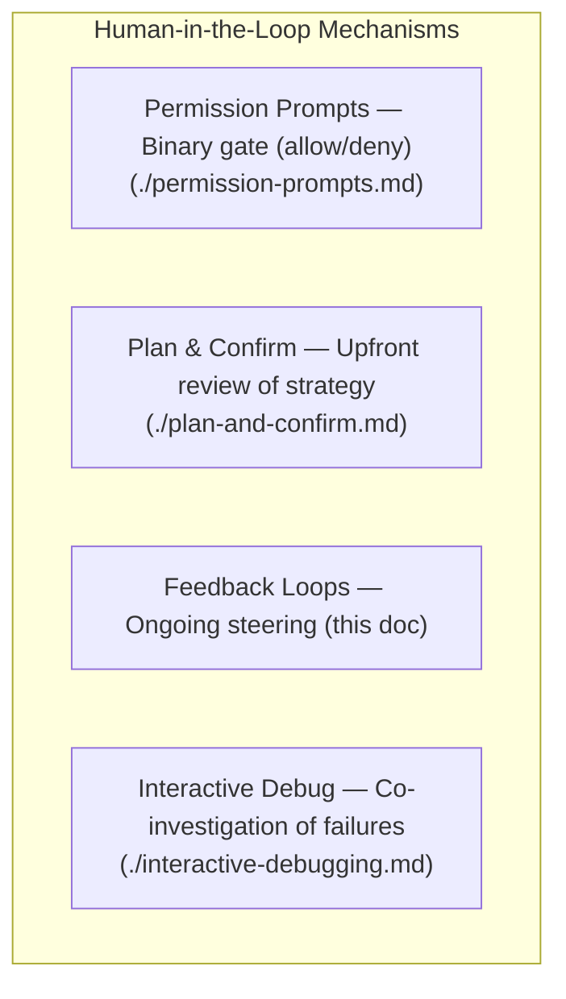
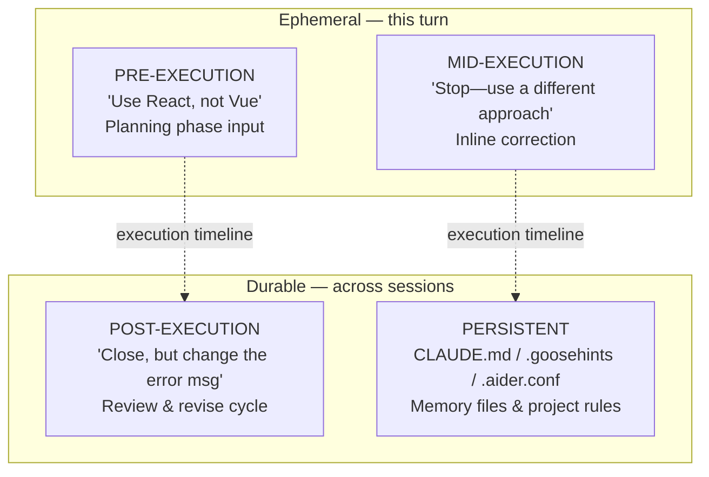
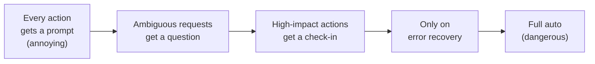
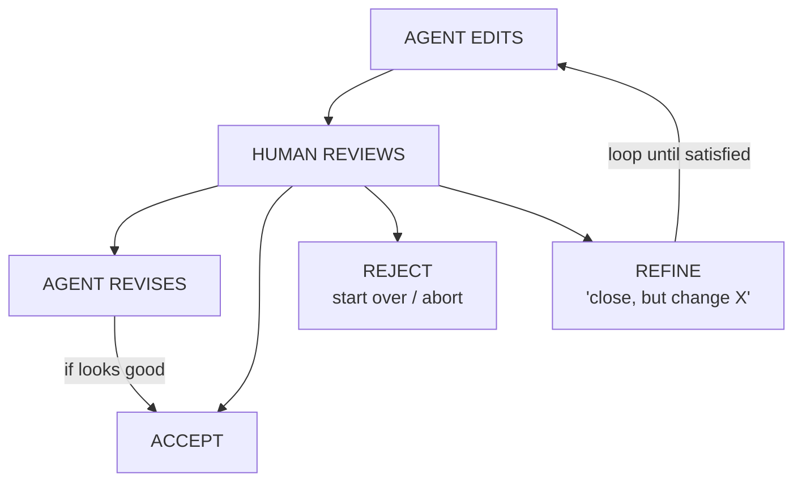
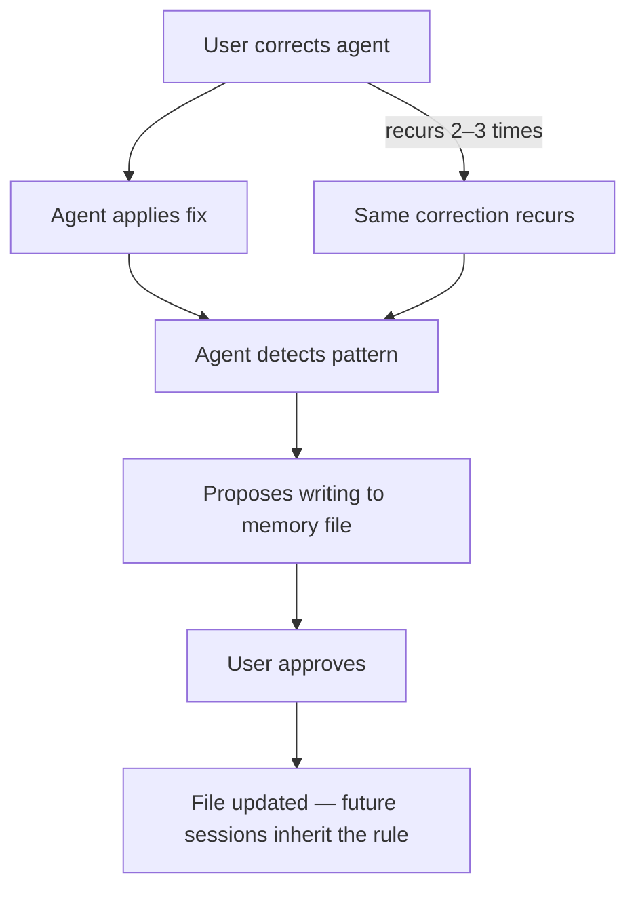
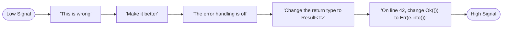

# Feedback Loops in Coding Agents

> How humans steer AI coding agents during execution through rich, bidirectional,
> iterative interaction—turning autonomous tools into collaborative partners.

---

## Overview

Feedback loops are the **primary mechanism for human steering** during agent execution.
Where [permission prompts](./permission-prompts.md) offer a binary gate—allow or deny—feedback
loops are richer: they carry semantic information about intent, preference, and correction back
into the agent's reasoning process.

A permission prompt asks: *"May I do this?"*
A feedback loop asks: *"How should I do this?"*

This distinction matters for real-world productivity:

- **Permission prompts** prevent harm (safety concern)
- **Feedback loops** ensure alignment (quality concern)
- **Together** they form the human-in-the-loop contract

Every coding agent implements some feedback mechanism, but sophistication varies. Some agents
treat the human as a source of yes/no signals. Others maintain conversational context, learn
from corrections, and proactively solicit guidance. This document catalogs feedback
architectures across 17 agents and synthesizes design patterns.



---

## The Feedback Taxonomy

Feedback varies along two axes: **when** it arrives relative to execution, and **how
persistent** its effects are.



**Pre-execution** feedback includes initial prompt refinement and plan review (see
[plan-and-confirm.md](./plan-and-confirm.md)). **Mid-execution** feedback includes inline
corrections and "stop and redirect" interruptions. **Post-execution** feedback covers diff
review and iterative refinement. **Persistent** feedback is encoded into memory files and
project rules that survive across sessions.

---

## Inline Correction

Inline correction is the most direct form of feedback: interrupting the agent mid-task
to redirect its behavior.

### Interrupt Mechanisms by Agent

| Agent | Interrupt Key | Behavior on Interrupt | Context Preserved? |
|-------|--------------|----------------------|-------------------|
| [Claude Code](../../agents/claude-code/) | Escape | Stops current tool, returns to chat | ✅ Full context |
| [Aider](../../agents/aider/) | Ctrl+C | Cancels current edit block | ✅ Chat history kept |
| [Codex](../../agents/codex/) | Ctrl+C | Aborts current execution | ⚠️ Partial |
| [Goose](../../agents/goose/) | Ctrl+C | Stops current action | ✅ Session preserved |
| [Gemini CLI](../../agents/gemini-cli/) | Ctrl+C | Cancels generation | ✅ Context retained |
| [OpenCode](../../agents/opencode/) | Escape | Cancels in-progress tool | ✅ Full context |
| [Warp](../../agents/warp/) | Ctrl+C | Standard signal handling | ⚠️ Depends on state |

### The Interruption Challenge

When a user interrupts mid-execution, the agent faces a critical question: **what state
is the codebase in?** Some files may be modified while others haven't been touched yet.

```typescript
// Simplified model of interruption handling (Claude Code pattern)
interface InterruptionState {
  completedActions: ToolResult[];
  pendingAction: ToolCall | null;
  plannedActions: ToolCall[];
  conversationContext: Message[];
}

async function handleInterruption(state: InterruptionState): Promise<void> {
  // 1. Cancel the pending action cleanly
  if (state.pendingAction) {
    await rollbackPartialAction(state.pendingAction);
  }
  // 2. Preserve conversation context—this is critical
  const resumeContext = [
    ...state.conversationContext,
    { role: "system", content: formatInterruptionSummary(state) },
  ];
  // 3. Wait for user's corrective input
  const correction = await waitForUserInput();
  // 4. Resume with the correction incorporated
  await resumeWithCorrection(resumeContext, correction);
}
```

**Context preservation determines correction quality.** If the agent loses context on
interruption, the human must re-explain the entire task. Agents like Claude Code and Aider
that maintain full history across interruptions enable much more efficient corrections.

---

## Chat-Based Steering

The conversational interaction pattern is the most common feedback mechanism. Users provide
follow-up messages that refine, correct, or extend the agent's work.

### Conversational Refinement Patterns

| Pattern | Example | Agent Handling |
|---------|---------|----------------|
| Scope narrowing | "Actually just fix the auth module" | Restrict working set |
| Scope expansion | "Also update the tests" | Extend current plan |
| Approach redirect | "Use a map instead of a loop" | Re-plan implementation |
| Constraint addition | "Make sure it's backward compatible" | Add to constraint set |
| Clarification | "I meant the REST API, not GraphQL" | Correct misunderstanding |
| Undo request | "Revert the last change" | Rollback + re-prompt |

### Agent-Specific Steering Behaviors

**Claude Code** ([../../agents/claude-code/](../../agents/claude-code/)) maintains full
conversation context and treats each user message as an additive constraint. When a user
says "Actually, I meant...", it re-interprets the original request with the correction
applied, rather than starting from scratch.

**Aider** ([../../agents/aider/](../../agents/aider/)) uses an explicit architect/editor
split. Follow-up messages refine the architect's plan, which cascades to the editor model.
The `/clear` command resets context when steering has diverged too far.

**Codex** ([../../agents/codex/](../../agents/codex/)) operates in a sandboxed environment
where each task is relatively isolated. Steering happens primarily through the initial
prompt and task-level configuration.

**Goose** ([../../agents/goose/](../../agents/goose/)) supports multi-turn conversation with
tool-use context. Its extension system means steering can affect which tools the agent uses,
not just how it uses them.

---

## "Stop and Ask" Patterns

The best feedback loops are **bidirectional**: agents actively solicit input when uncertain.
The decision of when to ask versus when to proceed is one of the hardest design problems.

### The Ask-vs-Guess Spectrum



**Claude Code** can use extended thinking to identify uncertainty and surface it to the
user. When working on a complex task, it may write a plan and check in before proceeding
to destructive steps.

### The Cost of Asking

| Behavior | User Experience | Risk |
|----------|----------------|------|
| Ask before every action | Tedious, micromanaging | Prompt fatigue → "just do it" |
| Ask only on ambiguity | Collaborative, natural | Might miss non-obvious ambiguity |
| Ask only on high-impact | Efficient, trusts agent | Minor misalignments accumulate |
| Never ask | Fast but isolated | Divergence goes unnoticed |

### Implementing Uncertainty Detection

```go
// Simplified uncertainty scoring for ask-vs-proceed decisions
type UncertaintySignal struct {
    AmbiguousReferences int
    ConflictingContext  int
    HighImpactAction    bool
    Confidence          float64
}

func shouldAskUser(sig UncertaintySignal) bool {
    if sig.HighImpactAction && sig.Confidence < 0.8 {
        return true
    }
    if sig.AmbiguousReferences > 0 {
        return true
    }
    if sig.ConflictingContext > 0 {
        return true
    }
    return sig.Confidence < 0.6
}
```

---

## Iterative Refinement Loops

The most common feedback pattern in practice is the **edit-review-revise** cycle.

### The Refinement State Machine



A well-designed refinement loop **converges**: each iteration brings output closer to
intent. Pathological loops diverge—each correction introduces new problems. Convergence
depends on feedback specificity, context retention, and scope isolation.

### Diff Preview as Feedback Interface

Most agents present proposed changes as diffs for review:

```diff
--- a/src/auth/validate.ts
+++ b/src/auth/validate.ts
@@ -15,7 +15,9 @@
 export function validateToken(token: string): boolean {
-  return jwt.verify(token, SECRET_KEY) !== null;
+  try {
+    const decoded = jwt.verify(token, SECRET_KEY);
+    return decoded !== null && !isTokenExpired(decoded);
+  } catch {
+    return false;
+  }
 }
```

The human reviews and responds with: **Accept** ("apply it"), **Refine** ("good idea with
try/catch, but catch `TokenExpiredError` specifically"), or **Reject** ("fix the caller
instead").

---

## Rejection Handling

When a human rejects an agent's output, the agent must recover gracefully. This is distinct
from [permission denial](./permission-prompts.md)—rejection here is about the **substance**
of the agent's work, not whether it's allowed to perform an action.

### Recovery Strategies

```rust
// Conceptual model of rejection recovery
enum RejectionRecovery {
    AlternativeApproach { original: Plan, alternative: Plan },
    SeekClarification { questions: Vec<String> },
    JustifyAndRepropose { rationale: String, modified: Plan },
    ReduceScope { original_scope: Scope, reduced_scope: Scope },
    SkipAndContinue { skipped: Task, remaining: Vec<Task> },
}
```

**Claude Code** acknowledges feedback and immediately attempts an alternative approach,
leveraging conversation history to avoid repeating the rejected pattern. **Aider** uses its
architect/editor split: the architect re-plans while the editor awaits new instructions.
**Junie CLI** ([../../agents/junie-cli/](../../agents/junie-cli/)) presents plans for
confirmation before execution, making rejection less costly since no code has been modified.
**OpenHands** ([../../agents/openhands/](../../agents/openhands/)) lets users directly edit
proposed changes, turning rejection into collaborative editing.

### Graceful Degradation on Repeated Rejection

```python
class RejectionHandler:
    def __init__(self, agent):
        self.agent = agent
        self.attempt = 0
        self.max_attempts = 3

    async def handle_rejection(self, task, feedback: str) -> AgentResponse:
        self.attempt += 1
        if self.attempt >= self.max_attempts:
            return AgentResponse(
                message="I've tried several approaches. Could you provide "
                        "more specific guidance on what you're looking for?",
                action="ask_user"
            )
        signals = self.parse_feedback(feedback)
        if signals.has_specific_direction:
            return await self.agent.replan(task, constraints=signals.constraints)
        elif signals.is_scope_complaint:
            return await self.agent.replan(task, scope="minimal")
        else:
            return AgentResponse(
                message="Could you tell me specifically what to change?",
                action="ask_user"
            )
```

---

## Learning from Corrections

The most powerful feedback loops persist **beyond the current interaction**. When an agent
learns from a correction and applies it to future sessions, the feedback has compound value.

### Memory File Formats

| Agent | Memory File | Format | Scope |
|-------|------------|--------|-------|
| [Claude Code](../../agents/claude-code/) | `CLAUDE.md` | Markdown directives | Project or global |
| [Goose](../../agents/goose/) | `.goosehints` | Natural language | Project-level |
| [Aider](../../agents/aider/) | `.aider.conf.yml` | YAML config | Project-level |
| [Codex](../../agents/codex/) | Session memory | Internal state | Session-level |
| [Gemini CLI](../../agents/gemini-cli/) | `GEMINI.md` | Markdown | Project-level |
| [OpenCode](../../agents/opencode/) | `instructions.md` | Markdown | Project-level |
| [Sage Agent](../../agents/sage-agent/) | Context config | YAML | Project-level |

### Writing to Memory Files

When a user repeatedly corrects the same behavior, the agent can encode the correction
into a memory file:

```markdown
# CLAUDE.md — Feedback encoded as persistent memory

## Code Style
- Use `type` instead of `interface` for object types
- Always use named exports, never default exports
- Error messages must include the function name

## Architecture
- Auth module uses middleware pattern—don't refactor to decorators
- Database queries go through the repository layer only
```

```yaml
# .goosehints — Goose memory file example
- This project uses pnpm, not npm or yarn
- All API routes are in src/routes/ using Express Router
- The legacy auth module (src/auth/v1/) is deprecated—don't modify it
```

### Reading and Applying Memory

```typescript
// How agents load and apply memory files at session start
interface MemoryContext {
  projectRules: string[];      // From CLAUDE.md, .goosehints, etc.
  userPreferences: string[];   // From global config
  sessionHistory: string[];    // From previous interactions
}

function buildSystemPrompt(base: string, memory: MemoryContext): string {
  return [
    base,
    "## Project Rules (from memory files)",
    ...memory.projectRules,
    "## User Preferences",
    ...memory.userPreferences,
  ].join("\n");
}
```

### The Feedback-to-Memory Pipeline



---

## Mid-Task Feedback Incorporation

Incorporating feedback without losing working context is one of the hardest technical
challenges. The agent must integrate new information while preserving its reasoning chain.

### Strategy 1: Append and Continue

Add the user's feedback as a new message and let the model re-assess:

```json
{
  "messages": [
    { "role": "user", "content": "Refactor the auth module to use JWT" },
    { "role": "assistant", "content": "I'll start by..." },
    { "role": "tool", "content": "File edited successfully" },
    { "role": "user", "content": "Good, but use RS256 not HS256" },
    { "role": "assistant", "content": "Updating JWT signing to RS256..." }
  ]
}
```

### Strategy 2: Re-Plan with New Constraints

For significant redirections, discard the remaining plan and generate a new one:

```python
class AgentPlanner:
    def replan(self, original_task: str, feedback: str, completed: list[str]):
        prompt = f"""
        Original task: {original_task}
        Already completed: {completed}
        User feedback: {feedback}

        Create a revised plan that:
        1. Keeps already-completed work
        2. Incorporates the user's feedback
        3. Completes remaining objectives
        """
        return self.model.generate(prompt)
```

### Strategy 3: Partial Rollback and Retry

When feedback indicates recent changes were wrong, selectively undo work before proceeding.
This requires tracking which changes correspond to which reasoning steps.

Long feedback loops also create **context window pressure**. Agents manage this through
summarization, truncation of older turns, selective retention of tool results, and extended
thinking scratchpads.

---

## Feedback in Non-Interactive Mode

CI/CD pipelines and headless deployments lack a human at the keyboard. All feedback must
be provided **upfront** as "frozen feedback."

```yaml
# Claude Code non-interactive configuration
settings:
  permission_mode: "bypassPermissions"
  memory_files:
    - ./CLAUDE.md
  constraints:
    - "Do not modify files in src/legacy/"
    - "All changes must include tests"
```

### Async Feedback via Pull Requests

GitHub PR comments serve as an asynchronous feedback channel:

1. Agent creates a PR with proposed changes
2. Human reviews and comments
3. Agent reads comments and revises (triggered by webhook)
4. Loop until merged or closed

Agents like [Pi Coding Agent](../../agents/pi-coding-agent/),
[Mini SWE Agent](../../agents/mini-swe-agent/), and
[Sage Agent](../../agents/sage-agent/) are designed for this workflow.
[OpenHands](../../agents/openhands/) provides a browser-based interface where feedback is
delivered through a chat panel alongside a live workspace. [Droid](../../agents/droid/) and
[ForgeCode](../../agents/forgecode/) offer similar structured interfaces.

### Non-Interactive Fallback Behavior

| Strategy | Behavior | Risk |
|----------|----------|------|
| Proceed with best guess | Agent makes assumptions | May diverge from intent |
| Fail loudly | Agent stops and reports | Blocks pipeline |
| Reduce scope | Agent does only safe subset | Incomplete results |
| Log questions | Agent records uncertainties | Requires human follow-up |

---

## Feedback Quality and Signal

Not all feedback carries equal information. Actionability depends on specificity,
actionability, and consistency with previous context.



When feedback is vague, agents can: ask clarifying questions, propose interpretations,
make a best-effort attempt, or present multiple options. Well-designed UX elicits better
feedback by presenting diffs, asking targeted questions, showing test results alongside
changes, and breaking large changes into reviewable chunks.

---

## Comparison of Feedback Mechanisms

| Agent | Inline Interrupt | Chat Steering | Memory Files | Proactive Ask | Async (PR) |
|-------|:---:|:---:|:---:|:---:|:---:|
| [Aider](../../agents/aider/) | ✅ | ✅ | ✅ `.aider.conf.yml` | ⚠️ | ❌ |
| [Ante](../../agents/ante/) | ⚠️ | ✅ | ❌ | ⚠️ | ❌ |
| [Capy](../../agents/capy/) | ⚠️ | ✅ | ❌ | ⚠️ | ❌ |
| [Claude Code](../../agents/claude-code/) | ✅ | ✅ | ✅ `CLAUDE.md` | ✅ | ✅ |
| [Codex](../../agents/codex/) | ✅ | ⚠️ | ⚠️ Session | ⚠️ | ❌ |
| [Droid](../../agents/droid/) | ⚠️ | ✅ | ❌ | ⚠️ | ✅ |
| [ForgeCode](../../agents/forgecode/) | ⚠️ | ✅ | ❌ | ⚠️ | ✅ |
| [Gemini CLI](../../agents/gemini-cli/) | ✅ | ✅ | ✅ `GEMINI.md` | ✅ | ❌ |
| [Goose](../../agents/goose/) | ✅ | ✅ | ✅ `.goosehints` | ✅ | ❌ |
| [Junie CLI](../../agents/junie-cli/) | ✅ | ✅ | ⚠️ | ✅ | ❌ |
| [Mini SWE Agent](../../agents/mini-swe-agent/) | ❌ | ❌ | ❌ | ❌ | ✅ |
| [OpenCode](../../agents/opencode/) | ✅ | ✅ | ✅ `instructions.md` | ⚠️ | ❌ |
| [OpenHands](../../agents/openhands/) | ⚠️ | ✅ | ⚠️ | ✅ | ✅ |
| [Pi Coding Agent](../../agents/pi-coding-agent/) | ❌ | ❌ | ❌ | ❌ | ✅ |
| [Sage Agent](../../agents/sage-agent/) | ❌ | ⚠️ | ⚠️ | ⚠️ | ✅ |
| [TongAgents](../../agents/tongagents/) | ⚠️ | ⚠️ | ❌ | ❌ | ❌ |
| [Warp](../../agents/warp/) | ✅ | ✅ | ⚠️ | ⚠️ | ❌ |

**Legend**: ✅ Full support | ⚠️ Partial/limited | ❌ Not supported

Agents cluster into three categories: **Interactive-first** (Claude Code, Aider, Goose,
Gemini CLI, OpenCode, Junie CLI) with rich terminal feedback and memory persistence;
**Async-first** (Mini SWE Agent, Pi Coding Agent, Sage Agent, Droid, ForgeCode) designed
for PR-based workflows; and **Hybrid** (OpenHands, Codex, Warp) supporting both modes.

---

## Design Recommendations

### 1. Preserve Context Across Feedback Cycles

The single most important property. When a user provides a correction, the agent must
understand the entire history that led to this point. Dropping context forces the user
to repeat themselves and breaks collaborative flow.

### 2. Match Feedback Channels to Tasks

| Task Type | Best Feedback Channel | Why |
|-----------|----------------------|-----|
| Quick fix | Inline correction (Escape/Ctrl+C) | Low ceremony, fast |
| Feature development | Chat-based steering | Rich multi-turn context |
| Code review | Diff-based review cycle | Visual, change-specific |
| CI/CD automation | PR comments / config files | Async, auditable |

### 3. Implement Graceful Degradation

When the feedback channel is unavailable, fall back to pre-configured rules, reduce scope
rather than guess, and log questions for later human review. Never silently proceed on
high-uncertainty decisions.

### 4. Support the Feedback-to-Memory Pipeline

Corrections that recur should be capturable as persistent rules. Ideal flow: user
corrects → same correction recurs → agent offers to write to memory file → future sessions
start with that knowledge.

### 5. Balance Asking with Doing

Optimal ask frequency is task- and trust-dependent. Track correction rate and increase
ask frequency when corrections are frequent. See
[permission-prompts.md](./permission-prompts.md) for the permission side of this boundary.

### 6. Design for Convergence

Every feedback cycle should bring output closer to intent. Make minimal changes in response
to feedback, explain what changed, and escalate if iterations aren't converging.

---

*This analysis covers feedback loop architectures as implemented in publicly available
open-source coding agents as of mid-2025. Agent behavior, interaction patterns, and
feedback mechanisms may change between versions.*
