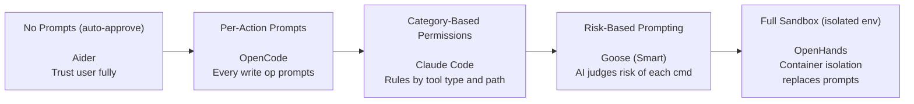
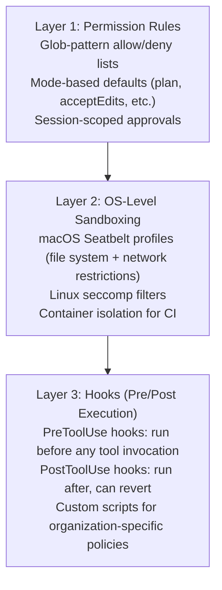
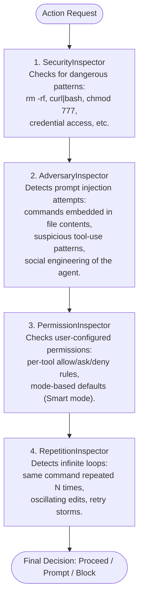
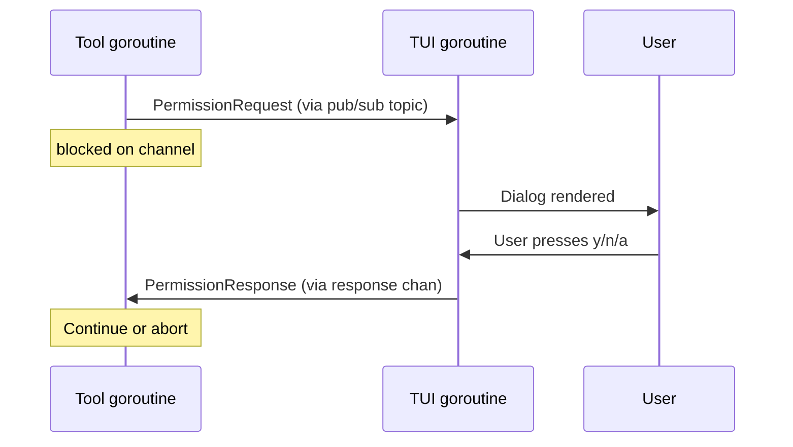
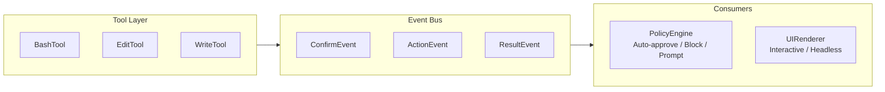

# Permission Prompts in Coding Agents

> How AI coding agents ask for human approval before performing potentially dangerous
> actions—and the architectural patterns that make this work without destroying productivity.

---

## Overview

Permission prompts are the **primary mechanism for human oversight** in coding agents. When
an agent wants to edit a file, run a shell command, or interact with external services, a
permission prompt is the moment where the human decides: allow, deny, or modify.

The design of permission prompts has an outsized impact on both safety and usability:

- **Too many prompts** → prompt fatigue → users click "allow all" reflexively → safety theater
- **Too few prompts** → unreviewed destructive actions → real damage
- **Poorly designed prompts** → users can't assess risk → uninformed decisions

Every coding agent solves this differently. This document analyzes the permission architectures
of five major agents in detail, then synthesizes design recommendations.

---

## The Permission Spectrum

Agents occupy different positions on the permission spectrum:



**Key trade-offs at each position:**

| Position        | Safety | Productivity | Prompt Fatigue | Complexity |
|-----------------|--------|--------------|----------------|------------|
| No prompts      | ❌ Low  | ✅ High       | None           | Low        |
| Per-action      | ✅ High | ❌ Low        | Severe         | Low        |
| Category-based  | ✅ High | ⚡ Medium     | Moderate       | Medium     |
| Risk-based      | ✅ High | ✅ High       | Low            | High       |
| Full sandbox    | ✅ High | ✅ High       | None           | Very High  |

---

## Claude Code's 5-Mode Permission System

Claude Code implements the most configurable permission system among the agents studied.
It uses a layered architecture with 5 user-selectable modes, tool-type permission tiers,
glob-pattern rules, and 3 layers of defense-in-depth.

### The 5 Permission Modes

```typescript
type PermissionMode =
  | "default"           // Prompts for every risky action
  | "acceptEdits"       // Auto-approves file edits; asks for Bash commands
  | "plan"              // Read-only analysis—no writes, no commands
  | "dontAsk"           // Auto-denies risky actions unless pre-approved by rule
  | "bypassPermissions" // Skips all prompts (CI/automation only, requires flag)
```

**Mode behavior matrix:**

| Action              | default  | acceptEdits | plan   | dontAsk  | bypass |
|---------------------|----------|-------------|--------|----------|--------|
| Read file           | ✅ Auto   | ✅ Auto      | ✅ Auto | ✅ Auto   | ✅ Auto |
| Grep/Glob           | ✅ Auto   | ✅ Auto      | ✅ Auto | ✅ Auto   | ✅ Auto |
| Edit file           | ⚠️ Prompt | ✅ Auto      | ❌ Deny | 🔍 Rules | ✅ Auto |
| Write new file      | ⚠️ Prompt | ✅ Auto      | ❌ Deny | 🔍 Rules | ✅ Auto |
| Bash command        | ⚠️ Prompt | ⚠️ Prompt    | ❌ Deny | 🔍 Rules | ✅ Auto |
| MCP tool call       | ⚠️ Prompt | ⚠️ Prompt    | ❌ Deny | 🔍 Rules | ✅ Auto |

### Permission Tiers by Tool Type

Claude Code categorizes tools into three permission tiers:

**Tier 1: Read-Only (never prompts)**
```
Read, Grep, Glob, LS, WebFetch, TodoRead
```
These tools have no side effects. Prompting for them would be pure friction.

**Tier 2: File Modifications (session-scoped approval)**
```
Edit, Write, MultiEdit, NotebookEdit
```
When a user approves a file edit, the approval persists for the remainder of the session.
Subsequent edits to the same file (or files matching the same pattern) auto-approve.

**Tier 3: Bash & External (project-scoped approval)**
```
Bash, MCP tools, ServerTool
```
When a user approves a Bash command with "don't ask again," the rule persists in the
project's `.claude/settings.json` and applies to future sessions too.

### Permission Rule Syntax

Claude Code uses glob-style patterns for permission rules:

```json
// .claude/settings.json
{
  "permissions": {
    "allow": [
      "Bash(npm test)",
      "Bash(npm run lint)",
      "Bash(npx tsc --noEmit)",
      "Bash(git diff*)",
      "Bash(git log*)",
      "Bash(git status)",
      "Edit(src/**)",
      "Write(src/**/*.test.ts)"
    ],
    "deny": [
      "Bash(rm -rf*)",
      "Bash(git push*)",
      "Bash(curl*)",
      "Bash(wget*)"
    ]
  }
}
```

**Rule evaluation order:**
1. **Deny rules** are checked first—if any deny rule matches, the action is blocked
2. **Allow rules** are checked next—if any allow rule matches, the action auto-approves
3. **If no rule matches**, the mode determines behavior (prompt, deny, or auto-approve)

**Rule scoping hierarchy:**
```
~/.claude/settings.json          ← User-global rules
./.claude/settings.json          ← Project-level rules (committed to repo)
./.claude/settings.local.json    ← Project-local rules (gitignored)
Session-level approvals          ← Temporary, current session only
```

### Defense-in-Depth: 3 Layers

Claude Code doesn't rely on permission prompts alone:



**Hook example** (pre-tool validation):
```json
{
  "hooks": {
    "PreToolUse": [
      {
        "matcher": "Bash",
        "hooks": [
          {
            "type": "command",
            "command": "./scripts/validate-command.sh \"$TOOL_INPUT\""
          }
        ]
      }
    ]
  }
}
```

### The Shift+Tab Trust Cycling UX

Claude Code provides an elegant mechanism for per-task trust adjustment:

```
During any prompt, press Shift+Tab to cycle through modes:

  default → acceptEdits → plan → (back to default)

This lets users:
  - Start in "plan" mode to understand what the agent wants to do
  - Switch to "acceptEdits" for a sequence of safe file changes
  - Drop back to "default" when the agent needs to run commands
```

This per-task ratcheting avoids the "all or nothing" problem: users grant exactly as much
trust as the current task warrants, without changing global settings.

---

## Codex Execution Policy Engine

Codex (OpenAI's CLI agent) implements a formal execution policy system modeled on access
control lists. Its architecture separates the concepts of "what should happen" (policy) from
"what the user decided" (review decision).

### Three-Valued Decision Model

Every action evaluation returns one of three values:

```typescript
type PolicyDecision = "allow" | "prompt" | "forbidden"
```

- **allow**: Action proceeds without user interaction
- **prompt**: Action is paused; user must approve or deny
- **forbidden**: Action is blocked; user cannot override

This three-valued model is more expressive than binary allow/deny because it distinguishes
"safe to auto-approve" from "user must decide" from "never permitted regardless."

### Named Approval Policies

Codex defines three named policies that map to different default behaviors:

```typescript
type ApprovalPolicy = "untrusted" | "on-request" | "never"
```

**Policy behavior:**

| Policy     | File Read | File Edit | Safe Commands | Risky Commands | Network |
|------------|-----------|-----------|---------------|----------------|---------|
| untrusted  | ✅ Allow   | ⚠️ Prompt  | ⚠️ Prompt      | ❌ Forbidden    | ❌       |
| on-request | ✅ Allow   | ✅ Allow   | ✅ Allow       | ⚠️ Prompt       | ❌       |
| never      | ✅ Allow   | ✅ Allow   | ✅ Allow       | ✅ Allow        | ⚠️ Prompt |

### Dynamic Policy Amendment

When a user approves a prompted action, Codex offers to **amend the policy**—adding a rule
so the same action auto-approves in the future:

```
┌─────────────────────────────────────────────────────────────┐
│  Codex wants to run: npm test                               │
│                                                             │
│  [a] Approve once                                           │
│  [A] Approve and add rule: allow "npm test" for session     │
│  [d] Deny                                                   │
│  [x] Abort task                                             │
└─────────────────────────────────────────────────────────────┘
```

This is a powerful pattern: every permission prompt is also an opportunity to teach the policy
engine. Over time, the user's policy becomes more permissive for safe actions, and the number
of prompts decreases organically.

### Review Decision Types

When a user responds to a prompt, Codex creates a typed review decision:

```typescript
type ReviewDecision =
  | { type: "approved" }
  | { type: "approved_with_amendment"; amendment: PolicyRule }
  | { type: "denied"; reason?: string }
  | { type: "abort" }
```

The `approved_with_amendment` variant is what enables learning: the amendment is a new rule
that gets added to the active policy for the remainder of the session.

### Sandbox Integration

Codex pairs its permission system with execution sandboxing:

```
┌──────────────────────────────────────────┐
│           Sandbox Levels                  │
├──────────────────────────────────────────┤
│  ReadOnly         │ No filesystem writes │
│  WorkspaceWrite   │ Write to project dir │
│  DangerFullAccess │ Full system access   │
└──────────────────────────────────────────┘
```

**Escalation on failure pattern:** When a command fails in a restricted sandbox, Codex can
offer to retry in a higher-privilege sandbox:

```
Command failed in ReadOnly sandbox.
Would you like to retry with WorkspaceWrite? [y/N]
```

This pattern lets the default be safe while providing an escape hatch for legitimate needs.

### Enterprise MDM Control

Codex supports organization-level policy enforcement via MDM (Mobile Device Management):

```json
{
  "policy_floor": "untrusted",
  "policy_ceiling": "on-request",
  "forbidden_commands": ["rm -rf /", "curl * | bash"],
  "required_sandbox": "WorkspaceWrite"
}
```

- **Floor**: Minimum restriction level (users can't go below this)
- **Ceiling**: Maximum permission level (users can't go above this)
- **Forbidden commands**: Always blocked, even with `never` policy
- **Required sandbox**: Minimum sandbox level for all executions

---

## Goose's 4-Inspector Pipeline

Goose (Block's open-source agent, written in Rust) takes a unique approach: instead of a
single permission check, every action passes through a **pipeline of 4 inspectors**, each
examining the action from a different angle.

### The 4 Inspectors



**Decision merging:** Each inspector returns one of `Proceed`, `Confirm(reason)`, or
`Block(reason)`. The pipeline combines results conservatively—if any inspector says `Block`,
the action is blocked. If any says `Confirm`, the user is prompted.

### Smart Approval Mode

Goose's "Smart Approval" mode uses AI to assess the risk of each action:

```rust
enum ApprovalMode {
    AlwaysApprove,   // No prompts (headless/CI)
    AlwaysAsk,       // Prompt for everything
    Smart,           // AI assesses risk level
}
```

In Smart mode, the `PermissionInspector` sends the proposed action to a lightweight LLM
call that classifies it as safe/risky. Safe actions auto-approve; risky ones prompt.

**Smart approval heuristics:**
- File reads, grep, ls → always safe
- File edits within project directory → usually safe
- Bash commands matching known-safe patterns → safe
- Bash commands with `sudo`, `rm`, `curl`, network access → risky
- Commands modifying files outside project → risky
- Any command the user has previously denied → risky

### Per-Tool Permission Configuration

Goose allows per-tool permission settings in its config:

```yaml
# ~/.config/goose/config.yaml
permissions:
  default: ask
  tools:
    developer__shell:
      permission: ask_before
    developer__text_editor:
      permission: always_allow
    developer__read_file:
      permission: always_allow
    web_search:
      permission: never_allow
```

**Permission levels:**
- `always_allow` — never prompt for this tool
- `ask_before` — prompt every time (or use Smart mode to decide)
- `never_allow` — block this tool entirely

---

## OpenCode's Channel-Based Permission System

OpenCode (written in Go) uses Go's concurrency primitives—channels and pub/sub—to implement
an elegant asynchronous permission flow.

### Go Channel Synchronization

```go
// Simplified permission flow
func (t *Tool) Execute(ctx context.Context, input string) (string, error) {
    // 1. Create a permission request
    req := permission.Request{
        Tool:        t.Name(),
        Description: t.Describe(input),
        Input:       input,
    }

    // 2. Publish request to the permission topic
    app.Publish(PermissionTopic, req)

    // 3. Block on the response channel
    resp := <-req.ResponseChan  // ← goroutine suspends here

    // 4. Act on the response
    switch resp.Decision {
    case permission.Allow:
        return t.run(ctx, input)
    case permission.AllowSession:
        t.sessionAllowed = true
        return t.run(ctx, input)
    case permission.Deny:
        return "", ErrPermissionDenied
    }
}
```

**Architecture:**


### Permission Levels

OpenCode offers four permission responses:

| Response          | Scope        | Effect                                      |
|-------------------|--------------|---------------------------------------------|
| Allow once        | This action  | Permits only this specific invocation        |
| Allow for session | Session      | Auto-approves this tool for rest of session  |
| Deny              | This action  | Blocks this specific invocation              |
| Auto-approve all  | Session      | Disables all prompts for remainder of session|

### Safe Read-Only Whitelist

OpenCode maintains a hardcoded whitelist of commands that skip permission:

```go
var safeCommands = []string{
    "cat", "head", "tail", "less", "more",
    "ls", "find", "tree", "wc", "file",
    "grep", "rg", "ag", "ack",
    "git status", "git log", "git diff", "git show",
    "go doc", "go vet",
    "node -e", "python -c",   // evaluation only
}
```

Commands matching this whitelist execute immediately without any permission check.

### Banned Commands

Regardless of permission mode, some commands are always blocked:

```go
var bannedCommands = []string{
    "rm -rf /",
    "rm -rf ~",
    "mkfs",
    "dd if=/dev/zero",
    ":(){ :|:& };:",   // fork bomb
    "> /dev/sda",
}
```

---

## Gemini CLI's Confirmation Bus

Gemini CLI uses an event-driven architecture where confirmation requests flow through a
central event bus, decoupling the tool execution layer from the UI and policy layers.

### Event-Driven Architecture



**Event flow:**
1. Tool emits a `ConfirmationRequired` event onto the bus
2. The policy engine consumes the event, checks rules, and either auto-resolves it or
   passes it to the UI renderer
3. The UI renderer displays the prompt (interactive) or auto-responds (headless)
4. The response flows back through the bus to the tool

### Tool Categories

Gemini CLI categorizes tools into two groups for confirmation:

**No confirmation needed (read-only):**
```typescript
const READ_ONLY_TOOLS = [
  'readFile', 'readManyFiles', 'listDirectory',
  'searchFiles', 'grepSearch', 'getMemory',
  'webSearch', 'webFetch'
];
```

**Confirmation required (mutating):**
```typescript
const MUTATING_TOOLS = [
  'editFile', 'writeFile', 'deleteFile',
  'shellExec', 'installPackage',
  'gitCommit', 'gitPush'
];
```

### Policy Engine Override

Users can configure auto-approval patterns in settings:

```json
// ~/.config/gemini-cli/settings.json
{
  "autoApprove": {
    "tools": ["editFile", "writeFile"],
    "commands": [
      "npm test",
      "npm run build",
      "npx tsc --noEmit",
      "git diff *",
      "git status"
    ],
    "paths": ["src/**", "test/**"]
  },
  "neverApprove": {
    "commands": ["rm -rf *", "git push --force"],
    "paths": ["/etc/**", "/usr/**", "~/.ssh/**"]
  }
}
```

### Multi-Tier Sandboxing

Gemini CLI supports multiple sandboxing backends, selected based on the host environment:

```
┌─────────────────────────────────────────────────────┐
│              Sandboxing Tiers                        │
├─────────────────────────────────────────────────────┤
│                                                     │
│  Tier 1: macOS Seatbelt (sandbox-exec)             │
│    - File system path restrictions                  │
│    - Network access control                         │
│    - Process execution limits                       │
│                                                     │
│  Tier 2: Docker Container                          │
│    - Full filesystem isolation                      │
│    - Network namespace separation                   │
│    - Resource limits (CPU, memory)                  │
│                                                     │
│  Tier 3: gVisor (runsc)                            │
│    - Kernel syscall interception                    │
│    - Application kernel isolation                   │
│    - Minimal host kernel surface                    │
│                                                     │
│  Tier 4: LXC Container                             │
│    - Lightweight OS-level virtualization             │
│    - Namespace isolation (PID, net, mount)          │
│    - cgroup resource control                        │
│                                                     │
└─────────────────────────────────────────────────────┘
```

The sandbox tier interacts with the permission system: higher-security sandboxes allow
more permissive auto-approval rules, because the blast radius of any mistake is contained.

---

## UX Design for Permission Prompts

### What Makes a Good Permission Prompt

A well-designed permission prompt must convey:

1. **What** the agent wants to do (clear, specific description)
2. **Why** (brief explanation of the agent's reasoning)
3. **Impact preview** (diff for edits, command text for shell, paths for file operations)
4. **Risk level** (visual indicator: green for safe, yellow for moderate, red for dangerous)
5. **Action options** (approve, deny, modify, "don't ask again")
6. **Keyboard shortcuts** (single-key responses for speed)

**Example of a well-designed prompt (Claude Code style):**

```
╭─────────────────────────────────────────────────────╮
│  Claude wants to run a command                       │
│                                                      │
│  $ npm install --save-dev @types/node                │
│                                                      │
│  This installs TypeScript type definitions for Node  │
│  as a dev dependency.                                │
│                                                      │
│  [y] Allow   [n] Deny   [a] Always allow "npm i*"   │
╰─────────────────────────────────────────────────────╯
```

**Example of a well-designed diff preview:**

```
╭─── Edit: src/utils/parser.ts ────────────────────────╮
│                                                       │
│  @@ -42,7 +42,8 @@                                   │
│   function parseInput(raw: string): ParsedInput {     │
│  -  return JSON.parse(raw);                           │
│  +  try {                                             │
│  +    return JSON.parse(raw);                         │
│  +  } catch (e) {                                     │
│  +    throw new ParseError(`Invalid JSON: ${raw}`);   │
│  +  }                                                 │
│   }                                                   │
│                                                       │
│  [y] Allow   [n] Deny   [e] Edit                     │
╰───────────────────────────────────────────────────────╯
```

### The Prompt Fatigue Problem

**Prompt fatigue** is the single biggest usability challenge in permission systems. It occurs
when users are prompted so frequently that they stop reading the prompts and reflexively
approve everything.

**The degradation curve:**

```
Attention to Prompts
     │
100% │ ●
     │   ●
 80% │     ●
     │       ●
 60% │         ●
     │            ●
 40% │               ●
     │                   ●
 20% │                       ●   ●   ●   ●   ●
     │
  0% └─────────────────────────────────────────────
     0   5   10  15  20  25  30  35  40  45  50
                   Prompts per session
```

**Measured indicators of prompt fatigue:**
- Approval rate approaches 100% (users stop denying anything)
- Response time decreases (users stop reading before approving)
- Users switch to "allow all" modes mid-session
- Safety-critical denials decrease proportionally with total prompts

**The "boy who cried wolf" effect:** After 30 prompts for safe operations like `npm test`,
the user is primed to approve the 31st prompt—which might be `rm -rf ./src`. Frequent
false alarms desensitize users to real threats.

**Solutions to prompt fatigue:**

| Solution                    | Agent Example      | Mechanism                             |
|-----------------------------|--------------------|---------------------------------------|
| Risk-based prompting        | Goose (Smart)      | AI classifies action risk level       |
| Session-scoped approval     | OpenCode           | "Allow for session" persists          |
| Policy amendment on approve | Codex              | Each approval can become a rule       |
| Category auto-approval      | Claude Code        | acceptEdits mode skips file prompts   |
| Read-only whitelist         | All agents         | Never prompt for reads                |
| Glob-pattern rules          | Claude Code        | "Allow npm test*" matches variants    |
| Sandbox substitution        | OpenHands          | Container replaces prompts entirely   |

### Permission Prompt Anti-Patterns

Patterns to avoid when designing permission prompts:

**1. Prompting for read-only operations**
```
❌  "Agent wants to read file: src/index.ts. Allow? [y/n]"
```
Reading a file has no side effects. This prompt adds friction without safety.

**2. Repeating identical prompts**
```
❌  "Allow npm test?" → Yes
    "Allow npm test?" → Yes  (again, 30 seconds later)
    "Allow npm test?" → Yes  (again...)
```
The same command should not re-prompt unless the context has changed.

**3. No preview of what will happen**
```
❌  "Agent wants to edit a file. Allow? [y/n]"
```
Users need to see the diff, not just know that an edit will occur.

**4. No batch approval option**
```
❌  20 individual prompts for 20 file edits in a refactor
✅  "Agent wants to edit 20 files (refactor: rename userId → userID). Allow all? [y/a/n]"
```

**5. Losing context while waiting for approval**
```
❌  Prompt appears. User reads it. Prompt scrolls off screen because agent is
    still streaming other output. User can't find the prompt to respond.
```
Permission prompts must be rendered in a stable, visible location.

**6. No "don't ask again" option**
```
❌  Every single `git status` prompts individually
✅  "Allow git status? [y] Yes [a] Always allow 'git status'"
```

---

## Comparison Table

| Feature                    | Claude Code       | Codex             | Goose            | OpenCode         | Gemini CLI       |
|----------------------------|-------------------|-------------------|------------------|------------------|------------------|
| **Permission modes**       | 5 modes           | 3 policies        | 3 modes          | 2 modes          | 2 modes          |
| **Per-tool config**        | ✅ Glob patterns   | ✅ Policy rules    | ✅ Per-tool YAML  | ⚠️ Whitelist only | ✅ Settings JSON  |
| **Sandbox integration**    | ✅ Seatbelt/seccomp| ✅ 3-tier sandbox  | ❌                | ❌                | ✅ 4-tier sandbox |
| **Policy amendment**       | ✅ On approve      | ✅ On approve      | ❌                | ⚠️ Session only   | ❌                |
| **Smart (AI) approval**    | ❌                 | ❌                 | ✅ Smart mode     | ❌                | ❌                |
| **Enterprise/MDM control** | ⚠️ Hooks only      | ✅ Full MDM        | ❌                | ❌                | ❌                |
| **Hook system**            | ✅ Pre/Post hooks  | ❌                 | ❌                | ❌                | ❌                |
| **Headless/CI mode**       | ✅ bypassPerms     | ✅ never policy    | ✅ AlwaysApprove  | ✅ Auto-approve   | ✅ Yes flag       |
| **Diff preview**           | ✅ Inline          | ✅ Inline          | ✅ Inline         | ✅ Inline         | ✅ Inline         |
| **Batch approval**         | ⚠️ Mode-level      | ⚠️ Policy-level    | ❌                | ⚠️ Session-level  | ⚠️ Config-level   |
| **Trust cycling UX**       | ✅ Shift+Tab       | ❌                 | ❌                | ❌                | ❌                |
| **Prompt injection defense**| ⚠️ Hooks          | ❌                 | ✅ Adversary Insp | ❌                | ❌                |

---

## Design Recommendations

Based on the analysis of these five agents, here are recommendations for building a
permission prompt system:

### 1. Never Prompt for Read-Only Operations
This is the single most impactful rule. File reads, directory listings, grep searches, and
git status/log/diff are all side-effect-free. Prompting for them creates friction without
any safety benefit.

### 2. Provide "Don't Ask Again" at Multiple Scopes
Every permission prompt should offer:
- **This once**: allow/deny just this action
- **This session**: auto-approve for the rest of the session
- **This project**: persist the rule in project settings
- **Always**: persist the rule in global user settings

### 3. Show Clear Previews of Destructive Actions
For file edits: show the diff. For shell commands: show the full command. For file deletion:
show the file path and size. Users cannot make informed decisions without seeing what will
actually happen.

### 4. Use Risk-Based Prompting Over Blanket Prompting
Not all actions are equally dangerous. Use heuristics or AI classification to assess risk,
and only prompt for actions above a risk threshold. `npm test` should not be treated the
same as `rm -rf ./src`.

### 5. Support Both Interactive and Headless Modes
Every permission prompt must have a headless equivalent: either a pre-configured policy that
auto-resolves the prompt, or a default behavior (deny) for unprovided responses. CI/CD
pipelines cannot wait for human input.

### 6. Allow Policy Amendment on Approval
When a user approves an action, offer to create a rule. This creates a natural learning
loop: the permission system becomes more permissive for safe actions over time, without
requiring the user to manually configure rules.

### 7. Defense-in-Depth: Prompts + Sandbox + Hooks
Permission prompts alone are insufficient. Layer them with:
- **OS sandboxing** to limit blast radius even if a prompt is incorrectly approved
- **Hook systems** for organization-specific policy enforcement
- **Git checkpoints** to enable undo even after approved actions cause damage

### 8. Design for the 50th Prompt, Not the 5th
The first few prompts in a session get careful attention. By the 50th, the user is
fatigued. Design the system so that by the 50th interaction, most safe actions auto-approve
and only genuinely risky actions still prompt.

---

## The Future of Permission Systems

### AI-Driven Risk Assessment
Goose's Smart mode is an early example. Future systems will use more sophisticated models
to assess not just "is this command dangerous in general" but "is this command dangerous
in this specific project context."

### Learned User Preferences
Rather than explicit rules, agents will learn from approval/denial patterns. A user who
always approves `docker build` commands can have that auto-approved without configuring a
rule—while maintaining the option to deny any specific instance.

### Context-Aware Permission Levels
The same command might be safe in one context and dangerous in another. `git push` to a
feature branch is routine; `git push --force` to main is dangerous. Future permission
systems will incorporate branch context, file sensitivity, and project configuration.

### Formal Verification of Safe Actions
For a restricted set of actions (file edits, structured commands), formal verification
could prove that the action is safe—eliminating the need for a prompt entirely. This is
most applicable to file edits where the diff can be statically analyzed.

### Collaborative Permission Models
In team environments, permissions might be shared: if one team member marks `npm test` as
safe for a project, other team members inherit that rule. This creates a collective trust
model that reduces individual prompt fatigue.

### Adaptive Prompt Frequency
Systems that monitor user behavior to detect prompt fatigue and respond by either:
- Consolidating remaining prompts into batches
- Temporarily elevating auto-approval for low-risk actions
- Alerting the user that they may be fatigued and suggesting a break

---

*This analysis covers permission prompt architectures as implemented in publicly available
open-source coding agents as of mid-2025. Agent behavior and APIs may change between
versions.*
