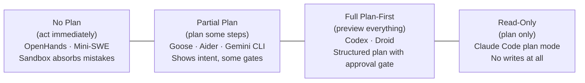
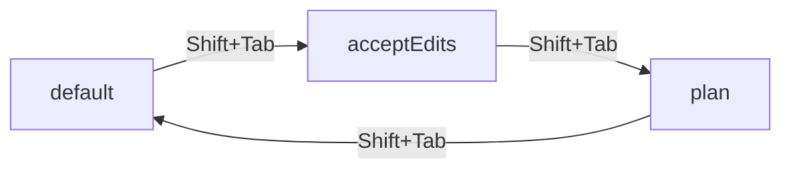
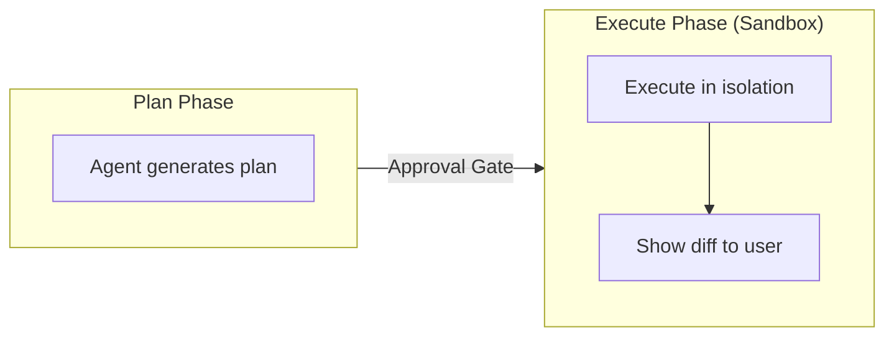
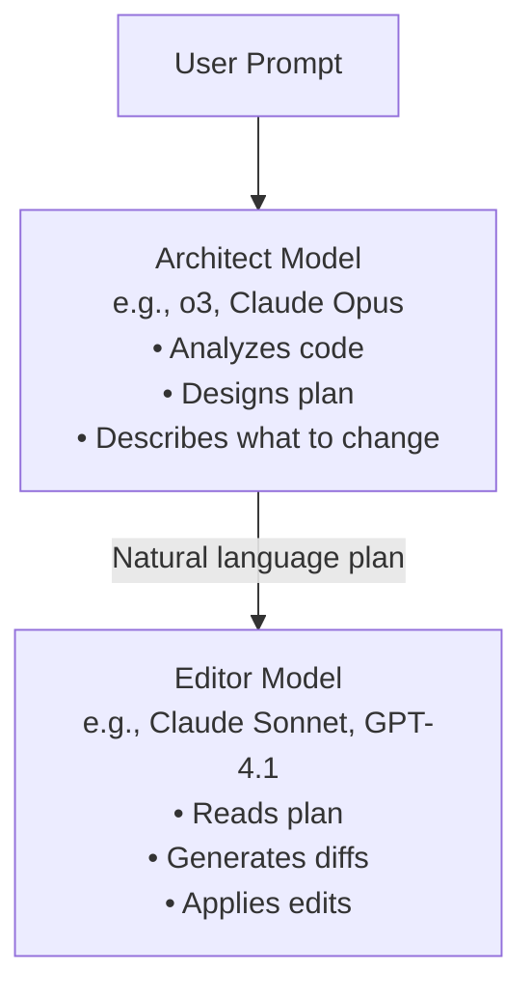
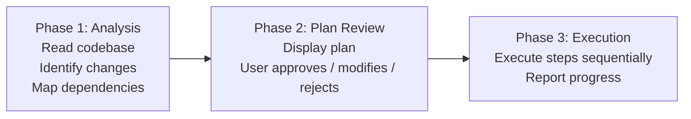

# Plan-and-Confirm Pattern in Coding Agents

> How coding agents show their intended actions before executing them—and the
> architectural patterns that separate planning from doing to keep humans in control.

---

## Overview

Plan-and-confirm is a **human-in-the-loop pattern** where the agent generates a structured
plan of intended actions, presents it to the user, and waits for explicit approval before
executing any changes. This stands in contrast to "act first" approaches where the agent
immediately executes tool calls and the human reviews the results after the fact.

The pattern exists because autonomous execution is dangerous. A coding agent that silently
rewrites 40 files, runs `rm -rf node_modules`, and force-pushes to main has technically
completed the task—but the human never had a chance to catch the mistake at step 2.

**Why plan-and-confirm matters:**

- **Predictability** — The user knows what will happen before it happens
- **Course correction** — The user can modify the plan before execution begins
- **Auditability** — The plan creates a record of intent separate from outcome
- **Trust calibration** — Users build trust by watching plans succeed over time

Plan-and-confirm is closely related to [permission prompts](./permission-prompts.md),
which gate individual actions, and [trust levels](./trust-levels.md), which determine how
much confirmation an agent requires. The key distinction: permission prompts ask "may I do
this one thing?" while plan-and-confirm asks "here is everything I intend to do—does this
look right?"

See also [UX patterns](./ux-patterns.md) for how plans are rendered in terminal interfaces.

---

## The Plan-Execute Spectrum

Agents fall on a spectrum from fully autonomous execution to fully previewed planning:


_◄─── Less friction / Less oversight ──────────────── More friction / More oversight ─►_

| Agent                                              | Default Position    | Can Shift To         |
|----------------------------------------------------|---------------------|----------------------|
| [Claude Code](../../agents/claude-code/)           | Partial plan        | Full plan (plan mode)|
| [Codex](../../agents/codex/)                       | Full plan-first     | Auto-apply           |
| [Aider](../../agents/aider/)                       | Partial plan        | Architect mode       |
| [Droid](../../agents/droid/)                       | Full plan-first     | Auto mode            |
| [Goose](../../agents/goose/)                       | Partial plan        | Always-approve       |
| [OpenHands](../../agents/openhands/)               | No plan (sandbox)   | —                    |
| [Mini-SWE-Agent](../../agents/mini-swe-agent/)     | No plan (sandbox)   | —                    |
| [Gemini CLI](../../agents/gemini-cli/)             | Partial plan        | —                    |
| [OpenCode](../../agents/opencode/)                 | Per-action prompt   | —                    |
| [Junie CLI](../../agents/junie-cli/)               | Partial plan        | —                    |
| [Warp](../../agents/warp/)                         | Partial plan        | —                    |

Agents that operate inside containers ([OpenHands](../../agents/openhands/),
[Mini-SWE-Agent](../../agents/mini-swe-agent/)) tend to skip planning entirely because the
sandbox itself is the safety net.

---

## Claude Code's Plan Mode

[Claude Code](../../agents/claude-code/) implements plan-and-confirm as a first-class
permission mode. When the user activates `plan` mode, the agent becomes **read-only**: it
can analyze code, search files, and reason, but it cannot write files or execute commands.

### The `plan` Permission Mode

```typescript
type PermissionMode =
  | "default"           // Prompt for risky actions
  | "acceptEdits"       // Auto-approve file edits
  | "plan"              // Read-only: no writes, no commands
  | "dontAsk"           // Deny unless pre-approved by rule
  | "bypassPermissions" // Skip all prompts (CI only)
```

| Tool Category    | Behavior in Plan Mode |
|------------------|-----------------------|
| Read, Grep, Glob | ✅ Allowed             |
| TodoRead/Write   | ✅ Allowed             |
| Edit, Write      | ❌ Denied              |
| Bash             | ❌ Denied              |
| MCP tools        | ❌ Denied              |

The key insight: `TodoRead` and `TodoWrite` remain available in plan mode. This lets the
agent build a structured task list while analyzing the codebase, without executing changes.

### The `plan` Tool

Claude Code exposes a dedicated `plan` tool for presenting structured plans:

```typescript
interface PlanStep {
  description: string;     // What this step does
  tool: string;            // Which tool would be used (Edit, Bash, etc.)
  target?: string;         // File path or command
  details?: string;        // Diff preview, command args, etc.
}
```

### Shift+Tab Mode Cycling



A typical workflow: start in plan mode to analyze → review the plan → switch to
acceptEdits to execute → drop to default when shell commands need approval.

### TodoRead/TodoWrite for Plan Persistence

The Todo tools maintain a task list across mode switches:

```typescript
// In plan mode, the agent builds the list:
TodoWrite({ action: "add", content: "Refactor auth middleware" })
TodoWrite({ action: "add", content: "Update route handlers" })
TodoWrite({ action: "add", content: "Add integration tests" })

// After switching to acceptEdits, the agent reads and executes:
TodoRead() // → returns the full list with statuses
```

Users can also persist plans in `CLAUDE.md` files so they survive across sessions.

---

## Codex's Structured Plan Output

[Codex](../../agents/codex/) presents plans as a structured preview of intended changes
before execution, rendered in the terminal UI as a list of files to be created, modified,
or deleted, with diff previews for each.

### Plan Rendering

```
┌─────────────────────────────────────────────────────────┐
│  Plan: Add input validation to user registration        │
├─────────────────────────────────────────────────────────┤
│  1. Modify  src/validators/user.ts                      │
│     + Add email format validation                       │
│     + Add password strength check                       │
│  2. Modify  src/routes/register.ts                      │
│     + Import and apply validators                       │
│  3. Create  src/validators/__tests__/user.test.ts       │
│     + Unit tests for validation functions               │
├─────────────────────────────────────────────────────────┤
│  [a] Apply all  [r] Review each  [e] Edit  [x] Cancel  │
└─────────────────────────────────────────────────────────┘
```

### Auto-Apply vs Manual Review

| Policy      | Plan Shown? | Approval Required? | Execution           |
|-------------|-------------|--------------------|--------------------|
| `untrusted` | ✅ Yes       | ✅ Per-step         | Manual review each |
| `on-request`| ✅ Yes       | ⚠️ Risky only       | Auto-apply safe    |
| `never`     | ⚠️ Summary   | ❌ No               | Auto-apply all     |

### Sandbox as Safety Net

Codex runs execution inside a sandboxed environment, creating a two-phase safety model:
first the plan is reviewed, then execution happens in isolation, and resulting changes are
shown as diffs before being applied to the real filesystem.



---

## Aider's Architect Mode

[Aider](../../agents/aider/) implements plan-and-confirm through a **two-model architecture**.
An "architect" model designs the plan; an "editor" model implements it.

### The Architect-Editor Split



### Configuration

```yaml
# .aider.conf.yml
architect: true
model: o3                    # Architect (planning)
editor-model: claude-sonnet  # Editor (implementation)
```

| Architect Model | Editor Model    | Rationale                         |
|-----------------|-----------------|-----------------------------------|
| o3              | Claude Sonnet   | Strong reasoning + fast editing   |
| Claude Opus     | Claude Sonnet   | Same family, good plan coherence  |
| GPT-4.1         | GPT-4.1-mini    | Cost-effective, same context style|
| Gemini 2.5 Pro  | Gemini 2.5 Flash| Google ecosystem alignment        |

The separation exploits a key insight: planning and code editing are different skills.
Large reasoning models excel at designing multi-step solutions; faster models excel at
producing syntactically correct diffs.

---

## Droid's Planning System

[Droid](../../agents/droid/) implements an explicit `plan_and_act` pattern with two
distinct operating modes.

### Plan Mode vs Auto Mode

In **plan mode**, Droid follows a three-phase process:



In **auto mode**, the agent analyzes and acts in a continuous loop without presenting
an explicit plan for review.

### Plan Data Structure

```python
@dataclass
class ExecutionPlan:
    title: str
    summary: str
    steps: list["PlanStep"]
    estimated_files: list[str]

@dataclass
class PlanStep:
    order: int
    description: str
    action_type: str          # "edit", "create", "delete", "command"
    target: str               # File path or command
    risk_level: str           # "low", "medium", "high"
    reversible: bool
```

The `risk_level` and `reversible` fields let the UI highlight steps that deserve extra
scrutiny, and inform rollback behavior if execution fails partway through.

---

## Goose's Plan-Based Tool Use

[Goose](../../agents/goose/) presents planned actions through its inspector pipeline
(see [permission-prompts.md](./permission-prompts.md)). In "Smart Approval" mode, Goose
previews intended tool calls and requests confirmation for risky ones.

```rust
struct PlannedAction {
    tool_name: String,
    description: String,
    arguments: serde_json::Value,
    risk_assessment: RiskLevel,
}

enum RiskLevel {
    Safe,       // Auto-approved: reads, searches
    Moderate,   // Shown to user with context
    Risky,      // Requires explicit confirmation
}
```

For risky operations, the user sees the action plus inspector assessments:

```
┌─────────────────────────────────────────────────┐
│  Goose wants to run: npm run build && npm test  │
│  Risk: Moderate  │  Security: ✅  │  Adversary: ✅ │
│  [y] Allow  [n] Deny  [a] Allow always          │
└─────────────────────────────────────────────────┘
```

---

## Diff Preview Before Applying

Showing exact diffs before applying changes is the plan made concrete: not "I will
refactor the auth module" but "here are the exact 47 lines I will change."

### Diff Formats

| Format         | Used By                                    | Strengths                  |
|----------------|--------------------------------------------|----------------------------|
| Unified diff   | [Aider](../../agents/aider/), most CLIs    | Compact, familiar to devs  |
| Search/Replace | [Aider](../../agents/aider/)               | Precise, minimal context   |
| Inline overlay | [Claude Code](../../agents/claude-code/)   | Rich terminal rendering    |
| Side-by-side   | [Codex](../../agents/codex/)               | Easy visual comparison     |

### Generating Unified Diffs

```typescript
import { diffLines } from "diff";

function generateUnifiedDiff(
  filePath: string,
  original: string,
  modified: string
): string {
  const changes = diffLines(original, modified);
  const lines: string[] = [`--- a/${filePath}`, `+++ b/${filePath}`];

  for (const change of changes) {
    const prefix = change.added ? "+" : change.removed ? "-" : " ";
    for (const line of change.value.split("\n").filter(Boolean)) {
      lines.push(`${prefix}${line}`);
    }
  }
  return lines.join("\n");
}
```

### Rendering Diffs in the Terminal

```python
def render_diff_preview(diff_text: str, console) -> None:
    """Render a unified diff with syntax highlighting."""
    console.print("\n[bold]Proposed changes:[/bold]\n")
    for line in diff_text.splitlines():
        if line.startswith("+") and not line.startswith("+++"):
            console.print(f"[green]{line}[/green]")
        elif line.startswith("-") and not line.startswith("---"):
            console.print(f"[red]{line}[/red]")
        elif line.startswith("@@"):
            console.print(f"[cyan]{line}[/cyan]")
        else:
            console.print(line)
```

---

## Step-by-Step Confirmation

When a plan has multiple steps, agents must choose confirmation granularity:

```mermaid
flowchart TD
    subgraph CA["Confirm-all · Low-risk plans, trusted agents"]
        CA1[Plan] --> CA2["Approve All"] --> CA3["Execute all steps"]
    end
    subgraph CE["Confirm-each · High-risk plans, unfamiliar agents"]
        CE1[Plan] --> CE2["Step 1"] --> CE3["y/n"] --> CE4["Step 2"] --> CE5["y/n "]
    end
    subgraph CR["Confirm-risky · Balanced approach, risk-based agents"]
        CR1[Plan] --> CR2["Safe steps auto"] --> CR3["Risky step: y/n"]
    end
    subgraph BC["Batch-confirm · Large refactors, file-grouped changes"]
        BC1[Plan] --> BC2["Group A: approve"] --> BC3["Group B: approve"]
    end
```



### Batch Approval Implementation

```go
func requestApproval(ctx context.Context, plan ExecutionPlan) (*ApprovalResponse, error) {
    if plan.AllLowRisk() {
        return promptBatchApproval(ctx, plan.Steps)
    }

    var risky, safe []PlanStep
    for _, step := range plan.Steps {
        if step.RiskLevel == "high" {
            risky = append(risky, step)
        } else {
            safe = append(safe, step)
        }
    }

    safeApproval := autoApproveBatch(safe)
    riskyApproval, err := promptEachStep(ctx, risky)
    if err != nil {
        return nil, err
    }
    return mergeApprovals(safeApproval, riskyApproval), nil
}
```

---

## Auto-Approve for Trusted Operations

Plan-and-confirm becomes tedious when every step requires a click. Auto-approve reduces
friction while maintaining safety for genuinely risky actions.

### Trust Level Integration

Auto-approve interacts directly with [trust levels](./trust-levels.md):

| Trust Level | Auto-Approved                  | Requires Approval            |
|-------------|--------------------------------|------------------------------|
| Minimal     | None                           | Everything                   |
| Standard    | Reads, searches, test runs     | File edits, commands         |
| Elevated    | Reads, edits within project    | Shell commands, network      |
| Full        | Everything in sandbox          | Nothing (sandbox is safety)  |

### Implementation

```typescript
type ApprovalScope = "once" | "session" | "project" | "global";

function shouldAutoApprove(
  action: PlannedAction,
  config: AutoApproveConfig
): boolean {
  if (config.alwaysTrusted.includes(action.category)) return true;

  for (const rule of config.trustedPatterns) {
    if (action.tool === rule.tool && globMatch(action.target, rule.pattern)) {
      return true;
    }
  }

  return config.sessionApprovals.has(`${action.tool}:${action.target}`);
}
```

---

## Implementation Patterns

### Plan Data Structures

```typescript
interface ExecutionPlan {
  id: string;
  title: string;
  steps: PlanStep[];
  metadata: {
    createdAt: Date;
    affectedFiles: string[];
    riskAssessment: "low" | "medium" | "high";
  };
}

interface PlanStep {
  id: string;
  order: number;
  description: string;
  action: PlanAction;
  status: "pending" | "approved" | "rejected" | "in_progress" | "completed" | "failed" | "skipped";
  dependencies: string[];     // IDs of steps that must complete first
}

type PlanAction =
  | { type: "edit"; filePath: string; diff: string }
  | { type: "create"; filePath: string; content: string }
  | { type: "delete"; filePath: string }
  | { type: "command"; command: string; workingDir?: string };
```

### Approval Flow with Async/Await

```typescript
async function executePlanWithApproval(plan: ExecutionPlan): Promise<void> {
  const approval = await presentPlanForReview(plan);
  if (approval.decision === "reject") return;
  if (approval.decision === "modify") {
    plan = applyUserModifications(plan, approval.modifications);
  }

  for (const step of plan.steps) {
    if (step.status === "rejected" || step.status === "skipped") continue;
    const depsComplete = step.dependencies.every(
      (depId) => plan.steps.find((s) => s.id === depId)?.status === "completed"
    );
    if (!depsComplete) { step.status = "skipped"; continue; }

    step.status = "in_progress";
    try {
      await executeStep(step);
      step.status = "completed";
    } catch (error) {
      step.status = "failed";
      const recovery = await promptRecovery(step, error);
      if (recovery === "abort") break;
    }
  }
}
```

### Partial Plan Approval (Go Channels)

```go
func executePlanWithPartialApproval(
    ctx context.Context, plan *ExecutionPlan, approvals <-chan StepApproval,
) error {
    for i, step := range plan.Steps {
        renderStep(step)
        select {
        case a := <-approvals:
            if a.Decision == "reject" {
                plan.Steps[i].Status = "skipped"
                continue
            }
            if a.Decision == "modify" {
                plan.Steps[i] = *a.Modified
            }
            if err := executeStep(ctx, &plan.Steps[i]); err != nil {
                return fmt.Errorf("step %s failed: %w", step.ID, err)
            }
        case <-ctx.Done():
            return ctx.Err()
        }
    }
    return nil
}
```

---

## Plan Persistence and Memory

Plans are ephemeral by default. Several agents provide persistence mechanisms.

[Claude Code](../../agents/claude-code/) uses `CLAUDE.md` files and `TodoRead`/`TodoWrite`
tools to persist plan state across sessions:

```markdown
<!-- CLAUDE.md -->
## Migration Plan (approved 2025-07-15)
- [x] Add new `sessions` table
- [x] Add migration script
- [ ] Run migration in staging
- [ ] Update auth middleware
```

Agents without file-based persistence store plan state in session memory—a dictionary
keyed by plan ID that tracks step statuses and allows resuming after interruptions.

---

## Anti-Patterns

### 1. Vague Plans

```
❌  Plan:
    1. Fix the authentication bug
    2. Update the tests

✅  Plan:
    1. Edit src/auth/middleware.ts line 47: replace expired token check
       with a refresh-then-retry pattern
    2. Edit src/auth/__tests__/middleware.test.ts: add test for
       expired-token-with-valid-refresh scenario
```

Vague plans give the user nothing to evaluate. If the plan doesn't specify which files
will change and roughly how, the user's "approval" is meaningless.

### 2. Plan-Execution Divergence

When the agent generates a plan but executes different actions, the plan becomes theater.

**Mitigation:** Track plan steps against actual tool calls and flag divergence:

```typescript
function checkPlanAdherence(
  plan: ExecutionPlan,
  executedActions: ToolCall[]
): PlanDivergence[] {
  const divergences: PlanDivergence[] = [];

  for (const action of executedActions) {
    const match = plan.steps.find(
      (s) => s.action.type === action.type && s.action.filePath === action.target
    );
    if (!match) {
      divergences.push({
        type: "unplanned_action",
        message: `Action on ${action.target} was not in the approved plan`,
      });
    }
  }
  return divergences;
}
```

### 3. Monolithic Plans Without Partial Approval

```
❌  "Refactor the entire auth system"  [Approve All] [Reject All]

✅  Step 1: Extract token validation   → [✅] [❌]
    Step 2: Add refresh token flow     → [✅] [❌]
    Step 3: Remove legacy session      → [✅] [❌]
    ──────────────────────────────────────────
    [Approve selected]  [Approve all]  [Reject all]
```

### 4. Plans Without Rollback Information

Plans should indicate which steps are reversible and how to undo them. A step that runs
`DROP TABLE users` is fundamentally different from one that adds a new file. See
[undo-and-rollback](./undo-and-rollback.md) for rollback architecture patterns.

---

## Comparison Table

| Feature                          | [Claude Code](../../agents/claude-code/) | [Codex](../../agents/codex/) | [Aider](../../agents/aider/) | [Droid](../../agents/droid/) | [Goose](../../agents/goose/) | [Gemini CLI](../../agents/gemini-cli/) |
|----------------------------------|:----:|:----:|:----:|:----:|:----:|:----:|
| **Dedicated plan mode**          | ✅    | ⚠️    | ✅    | ✅    | ❌    | ❌    |
| **Structured plan output**       | ✅    | ✅    | ⚠️    | ✅    | ⚠️    | ⚠️    |
| **Diff preview before apply**    | ✅    | ✅    | ✅    | ✅    | ✅    | ✅    |
| **Step-by-step confirmation**    | ⚠️    | ✅    | ❌    | ✅    | ⚠️    | ⚠️    |
| **Partial plan approval**        | ❌    | ✅    | ❌    | ✅    | ❌    | ❌    |
| **Plan persistence**             | ✅    | ❌    | ❌    | ⚠️    | ❌    | ❌    |
| **Multi-model plan/execute**     | ❌    | ❌    | ✅    | ❌    | ❌    | ❌    |
| **Auto-approve safe steps**      | ✅    | ✅    | ✅    | ✅    | ✅    | ✅    |
| **Sandbox safety net**           | ⚠️    | ✅    | ❌    | ❌    | ❌    | ✅    |
| **Plan-execution fidelity check**| ❌    | ❌    | ❌    | ⚠️    | ❌    | ❌    |
| **Mode switching (plan↔execute)**| ✅    | ⚠️    | ✅    | ✅    | ❌    | ❌    |
| **Rollback on failure**          | ⚠️    | ✅    | ⚠️    | ⚠️    | ❌    | ⚠️    |

Legend: ✅ Full support  ⚠️ Partial/limited  ❌ Not supported

**Agents without plan-and-confirm:**
[OpenHands](../../agents/openhands/), [Mini-SWE-Agent](../../agents/mini-swe-agent/),
[Capy](../../agents/capy/), [ForgeCode](../../agents/forgecode/),
[Ante](../../agents/ante/), [TongAgents](../../agents/tongagents/),
[PI Coding Agent](../../agents/pi-coding-agent/),
[Sage Agent](../../agents/sage-agent/), and [Warp](../../agents/warp/) either rely on
sandboxed execution or operate in a more autonomous mode where explicit plan approval is
not part of the workflow.

---

## Design Recommendations

### 1. Make Plans Concrete and Actionable

Every plan step should specify the target file or command, the type of change, and enough
detail for the user to evaluate it. "Fix the bug" is not a plan step. "Edit
`src/auth.ts` line 47: replace `===` with `!==` in the token expiry check" is.

### 2. Support Plan Granularity Levels

```yaml
plan_confirmation:
  default: "confirm-all"
  options:
    - "confirm-all"       # Approve the entire plan at once
    - "confirm-risky"     # Auto-approve safe steps, confirm risky ones
    - "confirm-each"      # Approve every step individually
    - "no-confirm"        # Auto-approve everything (CI/automation)
```

### 3. Preserve Plan State Across Mode Switches

When a user switches from plan mode to execution mode, the plan should persist. The agent
should execute the plan that was reviewed, not regenerate from scratch.
[Claude Code](../../agents/claude-code/)'s `TodoRead`/`TodoWrite` tools demonstrate this.

### 4. Show Diffs, Not Descriptions

Wherever possible, show the actual diff rather than a natural-language description.
Developers read diffs; natural language descriptions of code changes are ambiguous.

### 5. Track Plan-Execution Fidelity

Monitor whether executed actions match the approved plan. If the agent deviates—even for
good reasons—flag the divergence so the user knows. Silent deviation undermines trust.

### 6. Design Plans for Partial Failure

If step 3 of 5 fails, steps 1-2 should remain valid, and the user should be able to
resume from step 3 after fixing the issue. This requires explicit dependency declarations.

### 7. Integrate with Permission Systems

Plan-and-confirm should compose with [permission prompts](./permission-prompts.md), not
replace them. Plan approval covers "is this the right strategy?" while permission prompts
cover "is this specific tool call allowed?"

### 8. Persist Plans for Audit and Resume

Store the plan and its execution state so the user can review what was done, the agent
can resume after a crash, and team members can review the plan that led to changes.

---

*This analysis covers plan-and-confirm patterns as implemented in publicly available
open-source coding agents as of mid-2025. Agent architectures, plan formats, and approval
flows may change between versions.*
