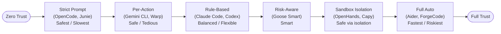
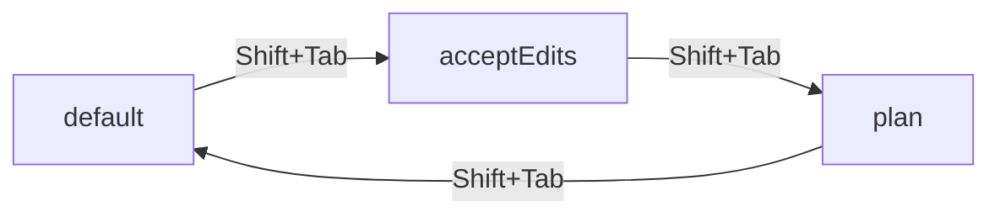
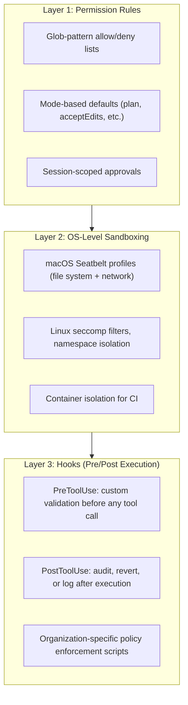
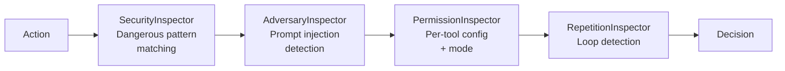

# Trust Level Systems in Coding Agents

> How coding agents implement graduated trust—from zero-trust paranoia to full autonomy—and
> the architectural patterns that let users, organizations, and CI pipelines calibrate exactly
> how much freedom an agent gets.

---

## Overview

Trust levels govern **how much autonomy a coding agent receives** before it must stop and
ask for permission. Binary allow/deny is insufficient—a developer debugging tests wants
the agent to freely edit test files and run `npm test`, but not `rm -rf node_modules`.

Modern agents implement **graduated trust** scoped along multiple dimensions:

- **Per-tool** — file edits may auto-approve while shell commands prompt
- **Per-path** — edits to `src/**` auto-approve; edits to `package.json` prompt
- **Per-session** — trust granted in one conversation doesn't persist to the next
- **Per-project** — trust in `.claude/settings.json` applies only to that repo
- **Per-organization** — enterprise policies set a floor/ceiling on individual trust

This document analyzes trust architectures across all 17 agents in this research library.

See also: [Permission Prompts](./permission-prompts.md), [Plan and Confirm](./plan-and-confirm.md),
and [UX Patterns](./ux-patterns.md).

---

## The Trust Spectrum

Agents occupy different positions on the trust spectrum, from zero-trust (every action
requires human approval) to full-trust (fully autonomous operation):



**Where each agent falls:**

| Agent | Default Trust | Configurability |
|-------|--------------|-----------------|
| [Aider](../../agents/aider/) | Full trust (auto-apply) | Low |
| [Ante](../../agents/ante/) | Per-action prompts | Low |
| [Capy](../../agents/capy/) | Sandbox isolation | Medium |
| [Claude Code](../../agents/claude-code/) | Rule-based | Very High—5 modes, glob rules, hooks |
| [Codex](../../agents/codex/) | Rule-based | High—3 policies, MDM, sandboxes |
| [Droid](../../agents/droid/) | Per-action prompts | Medium |
| [ForgeCode](../../agents/forgecode/) | Full trust | Low |
| [Gemini CLI](../../agents/gemini-cli/) | Per-action prompts | Medium—JSON settings |
| [Goose](../../agents/goose/) | Configurable (3 modes) | High—YAML, 4 inspectors |
| [Junie CLI](../../agents/junie-cli/) | Strict prompts | Medium |
| [Mini SWE Agent](../../agents/mini-swe-agent/) | Sandbox | Low |
| [OpenCode](../../agents/opencode/) | Per-action prompts | Medium—command lists |
| [OpenHands](../../agents/openhands/) | Sandbox isolation | Medium |
| [Pi Coding Agent](../../agents/pi-coding-agent/) | Per-action prompts | Low |
| [Sage Agent](../../agents/sage-agent/) | Per-action prompts | Low |
| [TongAgents](../../agents/tongagents/) | Per-action prompts | Low |
| [Warp](../../agents/warp/) | Per-action prompts | Medium |

---

## Claude Code's Permission Levels

Claude Code (see [../../agents/claude-code/](../../agents/claude-code/)) implements the
most granular trust architecture among the agents studied, with 5 user-selectable modes.

### The 5 Modes

```typescript
type PermissionMode =
  | "default"           // Ask for everything risky
  | "acceptEdits"       // Auto-approve file edits, ask for commands
  | "plan"              // Read-only—no writes, no commands
  | "dontAsk"           // Auto-deny risky actions unless pre-approved by rule
  | "bypassPermissions" // Skip all prompts (requires --dangerously-skip-permissions)
```

**Mode trust matrix:**

| Action | `default` | `acceptEdits` | `plan` | `dontAsk` | `bypassPermissions` |
|--------|-----------|---------------|--------|-----------|---------------------|
| Read file | ✅ Auto | ✅ Auto | ✅ Auto | ✅ Auto | ✅ Auto |
| Grep/Glob/LS | ✅ Auto | ✅ Auto | ✅ Auto | ✅ Auto | ✅ Auto |
| Edit file | ⚠️ Prompt | ✅ Auto | ❌ Deny | 🔍 Rules | ✅ Auto |
| Write new file | ⚠️ Prompt | ✅ Auto | ❌ Deny | 🔍 Rules | ✅ Auto |
| Bash command | ⚠️ Prompt | ⚠️ Prompt | ❌ Deny | 🔍 Rules | ✅ Auto |
| MCP tool call | ⚠️ Prompt | ⚠️ Prompt | ❌ Deny | 🔍 Rules | ✅ Auto |

Key insight: `dontAsk` is **not** a full-trust mode. It is a *silence* mode—unmatched
actions are auto-*denied* rather than prompted. Ideal for CI-like deterministic behavior.

### The Shift+Tab Cycling UX

Claude Code lets users ratchet trust mid-conversation via **Shift+Tab**:



This per-task ratcheting avoids the all-or-nothing trap: start in `plan` to review,
Shift+Tab into `acceptEdits` for safe changes, back to `default` for commands.

### The 3-Layer Trust Architecture

Claude Code's trust system uses defense-in-depth:



Each layer operates independently. Compromising one layer does not grant unrestricted access.

### Glob-Pattern Rule Syntax

Trust rules are specified as glob patterns in `.claude/settings.json`:

```json
{
  "permissions": {
    "allow": [
      "Bash(npm test)", "Bash(npm run lint)", "Bash(npx tsc --noEmit)",
      "Bash(git diff*)", "Bash(git log*)", "Bash(git status)",
      "Edit(src/**)", "Write(src/**/*.test.ts)"
    ],
    "deny": [
      "Bash(rm -rf*)", "Bash(git push*)", "Bash(curl*)", "Edit(.env*)"
    ]
  }
}
```

**Rule evaluation order:**
1. **Deny rules** checked first—if any match, the action is blocked (no override)
2. **Allow rules** checked next—if any match, the action auto-approves
3. **Mode default**—if no rule matches, the current mode decides

**Rule scoping hierarchy:**
```
~/.claude/settings.json          ← User-global rules
./.claude/settings.json          ← Project-level rules (committed to repo)
./.claude/settings.local.json    ← Project-local rules (gitignored)
Session-level approvals          ← Temporary, current session only
```

---

## Codex's Execution Policies

Codex (see [../../agents/codex/](../../agents/codex/)) implements a formal 3-valued
execution policy system separating policy from review decisions.

### The 3-Valued Model

```typescript
type ApprovalPolicy = "untrusted" | "on-request" | "never"
```

The names are counterintuitive: "never" means "never ask"—the *most* trusting policy.
`untrusted` prompts for all writes; `on-request` auto-applies edits but prompts for
risky commands; `never` auto-approves everything.

| Action | `untrusted` | `on-request` | `never` |
|--------|-------------|--------------|---------|
| File reads | ✅ Allow | ✅ Allow | ✅ Allow |
| File edits | ⚠️ Prompt | ✅ Allow | ✅ Allow |
| Safe commands | ⚠️ Prompt | ✅ Allow | ✅ Allow |
| Risky commands | ❌ Forbidden | ⚠️ Prompt | ✅ Allow |
| Network access | ❌ Forbidden | ❌ Forbidden | ⚠️ Prompt |

### Sandbox Levels

Codex pairs each policy with a corresponding sandbox restriction:

```python
SANDBOX_MAP = {
    "untrusted":  SandboxLevel.ReadOnly,       # No filesystem writes
    "on-request": SandboxLevel.WorkspaceWrite,  # Write to project dir only
    "never":      SandboxLevel.DangerFullAccess  # Full system access
}
```

| Sandbox Level | Permissions |
|---------------|------------|
| ReadOnly | No filesystem writes; commands run in read-only mount |
| WorkspaceWrite | Writes allowed within project dir only |
| DangerFullAccess | Full system access; no restrictions |

### Dynamic Policy Amendment

When a user approves a prompted action, Codex offers to amend the running policy so
the same action auto-approves in the future:

```typescript
type ReviewDecision =
  | { type: "approved" }
  | { type: "approved_with_amendment"; amendment: PolicyRule }
  | { type: "denied"; reason?: string }
  | { type: "abort" }
```

The `approved_with_amendment` variant is the learning mechanism: every prompt trains the
policy engine, making it more permissive for routine commands over time.

### Enterprise MDM: Policy Floor and Ceiling

Codex supports organization-level trust enforcement through MDM configuration:

```json
{
  "policy_floor": "untrusted",
  "policy_ceiling": "on-request",
  "forbidden_commands": ["rm -rf /", "curl * | bash"],
  "required_sandbox": "WorkspaceWrite"
}
```

- **Floor**: Minimum restriction level—users cannot go below this
- **Ceiling**: Maximum permission level—users cannot escalate above this
- **Forbidden commands**: Always blocked, regardless of policy
- **Required sandbox**: Minimum sandbox level for all executions

---

## Goose's Approval Modes

Goose (see [../../agents/goose/](../../agents/goose/)) implements three approval modes
with a 4-inspector pipeline for layered trust evaluation.

### The 3 Approval Modes

```rust
enum ApprovalMode {
    AlwaysApprove,   // No prompts—headless/CI mode
    AlwaysAsk,       // Prompt for every side-effecting action
    Smart,           // AI-driven risk assessment per action
}
```

**AlwaysApprove** grants full autonomy. **AlwaysAsk** is zero-trust. **Smart** uses a
lightweight LLM call to classify each action as safe or risky, prompting only for risky
ones. Smart mode heuristics: file reads/grep/ls → safe; project-scoped edits → usually
safe; known-safe command patterns → safe; `sudo`/`rm`/`curl`/network access → risky;
modifications outside project root → risky; previously denied commands → risky.

### The 4-Inspector Pipeline

Every action in Goose passes through four sequential inspectors:



Each inspector returns `Proceed`, `Confirm(reason)`, or `Block(reason)`. Results are
combined conservatively—any `Block` blocks; any `Confirm` prompts; all must `Proceed`
for auto-approval. The inspectors form a trust *intersection*, not a union.

### Per-Tool Permission Configuration

Goose allows per-tool trust settings in its YAML configuration:

```yaml
# ~/.config/goose/config.yaml
permissions:
  default: ask
  tools:
    developer__shell:
      permission: ask_before
    developer__text_editor:
      permission: always_allow
    developer__read_file:
      permission: always_allow
    web_search:
      permission: never_allow
    mcp__github__create_pull_request:
      permission: ask_before
```

The `never_allow` level functions as a tool-level denylist—the tool is entirely disabled
regardless of approval mode.

---

## Per-Tool Trust Configuration

The most common trust pattern is **per-tool differentiation**: different tools receive
different trust levels based on their risk profile.

### Claude Code: Glob Patterns per Tool

```json
{
  "permissions": {
    "allow": [
      "Read(*)", "Grep(*)", "Edit(src/**)", "Edit(tests/**)",
      "Bash(npm test*)", "Bash(npx jest*)"
    ],
    "deny": ["Bash(rm *)", "Bash(git push*)", "Edit(.env*)"]
  }
}
```

This provides fine-grained per-tool-per-argument trust. `Edit(src/**)` trusts edits
inside `src/` but not edits to root-level configuration files.

### Goose: YAML Tool Permissions

Goose uses a flat YAML map keyed by tool identifier:

```yaml
permissions:
  tools:
    developer__shell:        { permission: ask_before }
    developer__text_editor:  { permission: always_allow }
    developer__read_file:    { permission: always_allow }
```

### Gemini CLI: JSON Settings

Gemini CLI (see [../../agents/gemini-cli/](../../agents/gemini-cli/)) uses JSON-based
tool-level trust with `autoApproveTools`, `alwaysPromptTools`, and `disabledTools` arrays.

### Comparison of Per-Tool Trust Models

| Feature | Claude Code | Goose | Gemini CLI | Codex |
|---------|------------|-------|------------|-------|
| Per-tool config | ✅ Glob patterns | ✅ YAML map | ✅ JSON arrays | ⚠️ Policy-level only |
| Per-argument config | ✅ Glob on args | ❌ Tool-level only | ❌ Tool-level only | ❌ |
| Tool disabling | ✅ Via deny rules | ✅ `never_allow` | ✅ `disabledTools` | ❌ |
| Dynamic learning | ✅ Session approval | ❌ Static config | ❌ Static config | ✅ Policy amendment |

---

## Allowlists and Denylists

Most agents implement allowlists and denylists as the foundation of their trust system.

### Claude Code: Allow/Deny Rule Sets

Claude Code's rules use the `Tool(pattern)` syntax. Key properties:
- **Deny takes priority**: If both an allow and deny rule match, deny wins
- **Glob matching**: `*` matches within a segment, `**` matches across path separators
- **Three scopes**: user-global, project, and project-local settings files

### Codex: Safe Command Lists

Codex maintains internal lists of commands classified by risk:

```typescript
const SAFE_COMMANDS = [
  "ls", "cat", "head", "tail", "wc", "grep", "find", "echo", "pwd",
  "git status", "git diff", "git log",
  "npm test", "npm run lint", "python -m pytest", "cargo test", "go test ./..."
];

const DANGEROUS_PATTERNS = [
  /^rm\s/, /^sudo\s/, /\|\s*bash/, /curl.*\|\s*sh/,
  /chmod\s+777/, /git\s+push/, />\s*\/etc\//
];
```

### OpenCode: safeCommands and bannedCommands

OpenCode (see [../../agents/opencode/](../../agents/opencode/)) uses explicit arrays:

```go
type PermissionConfig struct {
    SafeCommands   []string `json:"safeCommands"`
    BannedCommands []string `json:"bannedCommands"`
    SafePatterns   []string `json:"safePatterns"`
}
```

### Evaluation Order Across Agents

| Agent | Evaluation Order | On Conflict |
|-------|-----------------|-------------|
| Claude Code | Deny → Allow → Mode default | Deny wins |
| Codex | Forbidden → Allow → Prompt | Forbidden wins |
| Goose | SecurityInspector → ... → PermissionInspector | Block wins (any inspector) |
| OpenCode | BannedCommands → SafeCommands → SafePatterns → Prompt | Banned wins |
| Gemini CLI | disabledTools → autoApprove → alwaysPrompt | Disabled wins |

The universal pattern: **denylists always take priority over allowlists.** This ensures
that dangerous actions cannot be accidentally allowed by an overly broad allow rule.

---

## Escalation Patterns

Trust is not static within a session. Most agents implement **trust escalation**:
one-time approvals that can be broadened to avoid repeated prompting.

### The 4-Level Escalation Ladder

| Level | Scope | Persistence |
|-------|-------|-------------|
| Allow Once | Single invocation | None—next identical action prompts again |
| Allow for Session | All identical actions | Until session ends |
| Allow for Project | All sessions in this repo | Saved to `.claude/settings.json` |
| Allow Always | All projects | Saved to `~/.claude/settings.json` |

### Agent Escalation Support

| Agent | Allow Once | Allow Session | Allow Project | Allow Always |
|-------|-----------|---------------|---------------|--------------|
| Claude Code | ✅ | ✅ | ✅ | ✅ |
| Codex | ✅ | ✅ (via amendment) | ❌ | ❌ |
| Goose | ✅ | ❌ | ✅ (via config) | ✅ (via config) |
| Gemini CLI | ✅ | ✅ | ❌ | ✅ (via settings) |
| OpenCode | ✅ | ✅ | ❌ | ❌ |

### Codex's Policy Amendment on Approval

When a user approves an action in Codex, the system offers to amend the running policy:

```
┌──────────────────────────────────────────────────────────┐
│  Codex wants to run: npm test                             │
│                                                          │
│  [a] Approve once                                        │
│  [A] Approve and add rule: allow "npm test" for session  │
│  [d] Deny                                                │
│  [x] Abort task                                          │
└──────────────────────────────────────────────────────────┘
```

Choosing `[A]` creates a `PolicyRule` appended to the session's active policy—every
prompt doubles as a training example for the policy engine.

### How Denials Affect Future Trust

- **Goose (Smart)**: Denied commands are flagged risky for the session—always prompted
  even if AI risk assessment would classify as safe
- **Claude Code**: Denials don't create persistent rules, but the agent avoids retrying
- **Codex**: Denied decisions are logged; the agent adjusts approach but no rule is created

---

## Trust Revocation

Agents must support **revoking** previously granted trust—when a rule was too broad,
a session needs to be locked down, or an organization changes policy.

### Session Permission Revocation

- **Claude Code**: `/permissions` displays active permissions and allows revoking them.
  Shift+Tab to `plan` mode also effectively revokes all write permissions.
- **Codex**: Session amendments are discarded on session end; no mid-session revocation.
- **Goose**: Restart resets to configured defaults; edit YAML config to change per-tool rules.

### Settings File Revocation

For persistent rules, revocation means editing the settings file—replacing overly broad
rules like `Bash(*)` with specific commands like `Bash(npm test)`.

### The /permissions Command (Claude Code)

Claude Code provides `/permissions` to inspect and manage the effective trust state:

```
> /permissions

Active Permission Rules:
  Project: Allow: Bash(npm test), Edit(src/**) | Deny: Bash(rm *), Bash(git push*)
  Session: Allow: Bash(cargo build) [14:32], Edit(config/**) [14:35]

  [r] Revoke a session permission   [v] View full settings file
```

---

## The --dangerously-skip-permissions Pattern

Several agents provide a full trust bypass flag for CI/CD and automation. The naming
convention is deliberately alarming.

### Claude Code: -p with --dangerously-skip-permissions

```bash
claude -p "Fix the failing tests" --dangerously-skip-permissions
```

When set, Claude Code enters `bypassPermissions` mode: all prompts are skipped, all
tool calls auto-approve. OS-level sandboxing remains as the only safety layer. Hooks
still execute, providing an organizational override point.

### Codex: The `never` Policy

```bash
codex --approval-policy never "Run the full test suite and fix failures"
```

The name `never` (as in "never ask") is less alarming but the effect is the same.

### Why the Scary Name Matters

The `--dangerously-skip-permissions` naming pattern is deliberate:
1. **Grep-ability** — Security auditors can search codebases for the string
2. **Social friction** — Developers must justify the flag in code review
3. **Accidental-use prevention** — Cannot be confused with a benign flag
4. **Documentation-by-name** — The flag name itself explains the risk

### Safety Implications

| Risk | Mitigated By |
|------|-------------|
| Agent deletes files | OS sandbox, version control |
| Agent runs dangerous commands | Hooks, sandbox restrictions |
| Agent exfiltrates data | Network sandbox |
| Prompt injection → arbitrary execution | **Nothing** (core risk) |

The last row is critical: with permissions bypassed, prompt injection attacks have a
direct path to arbitrary execution. This flag should only be used in ephemeral,
sandboxed CI environments.

---

## Organizational Trust Policies

Enterprise environments require trust controls that individual developers cannot override.

### Codex: MDM Policy Floor and Ceiling

Codex supports MDM configuration that constrains the trust range:

```json
{
  "policy_floor": "untrusted",
  "policy_ceiling": "on-request",
  "forbidden_commands": ["rm -rf /", "curl * | bash", "wget * | sh", "chmod 777 *"],
  "required_sandbox": "WorkspaceWrite"
}
```

With this config, users cannot set policy below `untrusted` or above `on-request`,
making the `never` (full-auto) policy unavailable organization-wide.

### Claude Code: Managed Settings

Claude Code supports managed settings deployed by an organization:

```json
{
  "permissions": {
    "deny": [
      "Bash(curl*)", "Bash(wget*)", "Bash(ssh*)",
      "Edit(/etc/**)", "Edit(~/.ssh/**)"
    ]
  },
  "disabledModes": ["bypassPermissions"],
  "hooks": {
    "PreToolUse": [{
      "matcher": "Bash",
      "hooks": [{
        "type": "command",
        "command": "/usr/local/bin/corp-policy-check \"$TOOL_INPUT\""
      }]
    }]
  }
}
```

The `disabledModes` array prevents users from entering `bypassPermissions` mode, and
mandatory hooks ensure shell commands pass through corporate policy checks.

### Organizational Trust Model Comparison

| Feature | Codex MDM | Claude Code Managed |
|---------|-----------|---------------------|
| Policy floor/ceiling | ✅ Explicit | ⚠️ Via deny rules + disabled modes |
| Forbidden commands | ✅ Explicit list | ✅ Via deny rules |
| Mandatory sandbox | ✅ `required_sandbox` | ✅ Via OS sandbox config |
| Custom policy hooks | ❌ | ✅ PreToolUse/PostToolUse |
| Mode restriction | ❌ | ✅ `disabledModes` |

---

## How Trust Affects Agent Autonomy

The relationship between trust level and productivity is not linear—there is a
**productivity-safety tradeoff curve** with diminishing returns at both extremes.

### The Tradeoff Curve

```
Productivity ▲
             │                                    ╭── Full Auto (Aider, ForgeCode)
             │                               ╭────╯
             │                          ╭────╯
             │                     ╭────╯     ← Sweet spot: rule-based trust
             │                ╭────╯
             │           ╭────╯
             │      ╭────╯
             │ ╭────╯
             ├─╯──────────────────────────────▶ Safety
           Zero Trust                       Full Trust
```

### Trust Level Impact on Interruptions

| Trust Level | Approx. Prompts per Task | Task Completion Time | Risk Level |
|-------------|-------------------------|---------------------|------------|
| Zero trust (all prompted) | 15-30+ | Very slow | Very low |
| Per-action prompts | 8-15 | Slow | Low |
| Rule-based trust (configured) | 2-5 | Moderate | Low-medium |
| Risk-based (Smart) | 1-3 | Fast | Medium |
| Sandbox isolation | 0 | Very fast | Low (contained) |
| Full auto (no prompts) | 0 | Very fast | High |

### The Prompt Fatigue Trap

The critical failure mode is **prompt fatigue**: too-frequent prompts cause users to
approve reflexively, transforming a safety mechanism into safety theater. Agents combat
this through:

1. **Graduated trust** (Claude Code, Codex) — Reduce prompts for known-safe actions
2. **Risk-based prompting** (Goose Smart) — Only prompt for genuinely risky actions
3. **Sandbox isolation** (OpenHands, Capy) — Eliminate prompts by containing damage
4. **Trust escalation** — Let one approval cover a class of future actions
5. **Plan-and-confirm** (see [./plan-and-confirm.md](./plan-and-confirm.md)) — One
   upfront approval covers an entire multi-action plan

---

## Comprehensive Comparison Table

Trust features across all 17 agents:

| Agent | Trust Model | Graduated | Per-Tool | Allow/Deny | Escalation | Org Control | Bypass |
|-------|------------|-----------|----------|-----------|------------|-------------|--------|
| [Aider](../../agents/aider/) | Full trust | ❌ | ❌ | ❌ | N/A | ❌ | N/A |
| [Ante](../../agents/ante/) | Per-action | ❌ | ❌ | ❌ | ❌ | ❌ | ❌ |
| [Capy](../../agents/capy/) | Sandbox | ❌ | ❌ | ❌ | ❌ | ❌ | ❌ |
| [Claude Code](../../agents/claude-code/) | 5-mode | ✅ | ✅ Glob | ✅ | ✅ 4-level | ✅ Managed | ✅ |
| [Codex](../../agents/codex/) | 3-policy | ✅ | ⚠️ | ✅ | ✅ Amend | ✅ MDM | ✅ |
| [Droid](../../agents/droid/) | Per-action | ⚠️ | ❌ | ❌ | ⚠️ | ❌ | ❌ |
| [ForgeCode](../../agents/forgecode/) | Full trust | ❌ | ❌ | ❌ | N/A | ❌ | N/A |
| [Gemini CLI](../../agents/gemini-cli/) | Per-action+ | ⚠️ | ✅ JSON | ✅ | ⚠️ | ❌ | ❌ |
| [Goose](../../agents/goose/) | 3-mode+insp | ✅ | ✅ YAML | ✅ | ✅ | ❌ | ✅ |
| [Junie CLI](../../agents/junie-cli/) | Per-action | ⚠️ | ❌ | ❌ | ❌ | ❌ | ❌ |
| [Mini SWE Agent](../../agents/mini-swe-agent/) | Sandbox | ❌ | ❌ | ❌ | ❌ | ❌ | N/A |
| [OpenCode](../../agents/opencode/) | Per-action+ | ⚠️ | ❌ | ✅ | ⚠️ | ❌ | ❌ |
| [OpenHands](../../agents/openhands/) | Sandbox | ❌ | ❌ | ❌ | ❌ | ⚠️ | N/A |
| [Pi Coding Agent](../../agents/pi-coding-agent/) | Per-action | ❌ | ❌ | ❌ | ❌ | ❌ | ❌ |
| [Sage Agent](../../agents/sage-agent/) | Per-action | ❌ | ❌ | ❌ | ❌ | ❌ | ❌ |
| [TongAgents](../../agents/tongagents/) | Per-action | ❌ | ❌ | ❌ | ❌ | ❌ | ❌ |
| [Warp](../../agents/warp/) | Per-action | ⚠️ | ❌ | ❌ | ⚠️ | ❌ | ❌ |

**Legend:** ✅ Full support, ⚠️ Partial, ❌ Not supported, N/A Not applicable

### Feature Density

The table reveals a clear pattern: **trust system sophistication correlates with agent
maturity and user base size.** Claude Code and Codex have the most sophisticated trust
architectures. Newer or research-focused agents tend toward simpler binary models or
rely entirely on sandbox isolation.

---

## Design Recommendations

Based on analysis of trust systems across all 17 agents:

### 1. Default to Least Privilege, Escalate on Demand

Start conservative and provide clear escalation mechanisms. Claude Code's `default` mode
and Codex's `untrusted` policy both follow this principle.

### 2. Separate Trust Dimensions

Trust should not be a single scalar. Minimum dimensions:

| Dimension | Example |
|-----------|---------|
| Tool type | File edits vs. shell commands vs. network |
| Scope | Per-session vs. per-project vs. global |
| Path | `src/**` vs. `.env` vs. `/etc/**` |
| Command pattern | `npm test` vs. `rm -rf` |

### 3. Make Denylists Inviolable

Deny rules should **always** take priority over allow rules. No escalation, mode setting,
or interactive approval should override an explicit deny.

### 4. Build in Organizational Override Points

Design the trust system with organizational override in mind from the start. Codex's
floor/ceiling model and Claude Code's managed settings + hooks are extensible patterns.

### 5. Support Trust Escalation with Learning

Codex's `approved_with_amendment` pattern is the gold standard: every permission prompt
is an opportunity to teach the system.

### 6. Name Dangerous Options Dangerously

The `--dangerously-skip-permissions` naming convention should be standard. The flag must
be long (no short alias), alarming, grep-able (for security auditing), and self-documenting.

### 7. Combine Permission Rules with Sandbox Isolation

Permission prompts and sandbox isolation are complementary strategies. The most robust
agents use both: rules as the first line of defense, sandboxing as the backstop.
See [./permission-prompts.md](./permission-prompts.md) for how these layers interact.

### 8. Provide Trust Visibility

Users must be able to inspect the effective trust state at any time. Claude Code's
`/permissions` command is the best example.

---

*This analysis covers trust level architectures in publicly available open-source coding
agents as of mid-2025. Agent behavior and APIs may change between versions.*
