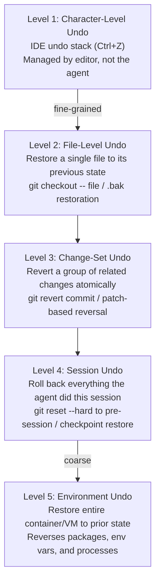
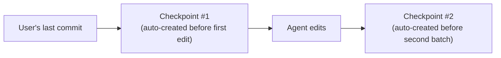
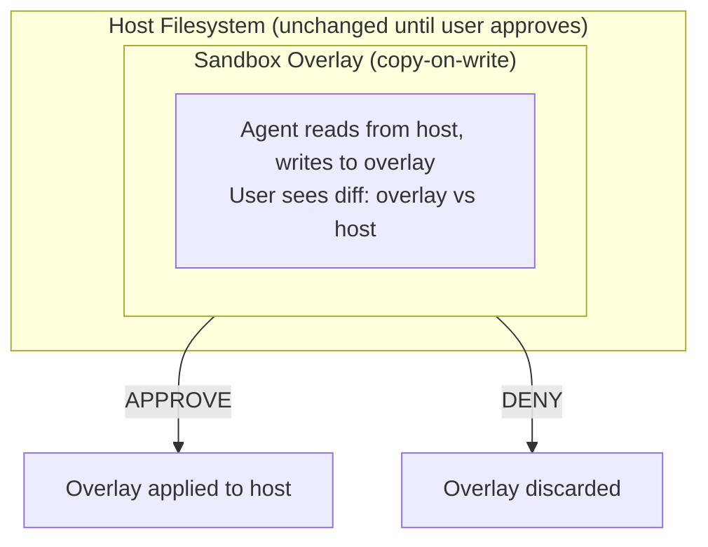

# Undo and Rollback Mechanisms in Coding Agents

> Why the best safety net is not a gate that blocks actions, but a time machine that
> reverses them—and how every major coding agent implements the ability to take back
> what it just did.

---

## Overview

The central insight behind undo-oriented design is a single principle: **Undo > Prevent.**

It is better to let an action happen and provide easy rollback than to block the action
entirely. Prevention requires perfect foresight—knowing in advance whether an action is
dangerous. Undo requires only reliable state tracking—knowing what changed so you can
reverse it. The first is impossible; the second is an engineering problem with known
solutions.

This principle is what makes agent autonomy viable. Without undo, every action requires
pre-approval (see [permission-prompts.md](./permission-prompts.md)). With reliable undo,
humans can grant broader autonomy and correct mistakes after the fact:

| Mechanism         | Strength                          | Weakness                       |
|-------------------|-----------------------------------|--------------------------------|
| Permission prompt | Prevents damage before it happens | Interrupts flow, prompt fatigue |
| Trust levels      | Reduces prompt frequency          | Requires upfront configuration |
| Undo/rollback     | Preserves autonomy and flow       | Cannot reverse all side effects |

Permission prompts (see [./permission-prompts.md](./permission-prompts.md)) and trust
levels (see [./trust-levels.md](./trust-levels.md)) are *preventive* controls. Undo is a
*corrective* control. The plan-and-confirm pattern (see
[./plan-and-confirm.md](./plan-and-confirm.md)) sits between them. Every agent in this
library implements at least one undo mechanism. Most rely on git. Some go further with
container snapshots, sandbox isolation, or transaction-like semantics.

---

## The Undo Hierarchy

Undo mechanisms exist at multiple granularities. Finer-grained undo is faster and more
precise; coarser-grained undo is more comprehensive but more disruptive.



Most agents operate at **Levels 2–4**. Level 1 is delegated to the IDE. Level 5 is only
practical in sandboxed environments like [OpenHands](../../agents/openhands/) and
[Codex](../../agents/codex/).

| Level | Agents | Mechanism |
|-------|--------|-----------|
| 2 – File | [Aider](../../agents/aider/), [OpenCode](../../agents/opencode/), [Goose](../../agents/goose/) | git checkout, backup files |
| 3 – Change-set | [Claude Code](../../agents/claude-code/), [Aider](../../agents/aider/), [Gemini CLI](../../agents/gemini-cli/) | Auto-commits, git revert |
| 4 – Session | [Claude Code](../../agents/claude-code/), [Codex](../../agents/codex/), [ForgeCode](../../agents/forgecode/) | Checkpoints, sandbox discard, stash |
| 5 – Environment | [OpenHands](../../agents/openhands/), [Codex](../../agents/codex/) | Container snapshots, sandbox isolation |

---

## Git as the Universal Undo

Git is the **universal undo mechanism** across every agent studied. Its properties make it
uniquely suited: content-addressable storage (every state has a SHA), immutable history
(commits survive `git reset` in the reflog), branching (agents work without disrupting
the user's main line), diffing (trivial to show and reverse changes), and ubiquity (every
project already uses git).

### The Implicit Contract

There is an unwritten contract across nearly all coding agents: **the agent assumes it is
operating inside a git repository.** Some agents enforce this:

```typescript
function ensureGitRepo(workdir: string): void {
  const result = execSync("git rev-parse --is-inside-work-tree", {
    cwd: workdir,
    stdio: "pipe",
  });
  if (result.toString().trim() !== "true") {
    throw new Error("This tool requires a git repository. Run `git init` first.");
  }
}
```

[Claude Code](../../agents/claude-code/) warns if the working directory is not a git repo.
[Aider](../../agents/aider/) requires it outright when auto-commits are enabled.

### Git Operations Used for Undo

```
┌──────────────┬───────────────────────────────────────┐
│ Operation    │ Use Case                              │
├──────────────┼───────────────────────────────────────┤
│ git stash    │ Save and restore working tree state   │
│ git reset    │ Move HEAD back to a prior commit      │
│ git revert   │ Create inverse commit (history-safe)  │
│ git checkout │ Restore individual files              │
│ git reflog   │ Find commits after a bad reset        │
│ git clean    │ Remove untracked files the agent made │
└──────────────┴───────────────────────────────────────┘
```

Most agents use `git reset` (rewrites history, suitable for local checkpoints) rather than
`git revert` (preserves history, suitable for shared branches), since agent checkpoints are
local implementation details.

---

## Claude Code's Git Checkpoint System

[Claude Code](../../agents/claude-code/) implements the most sophisticated undo system
among the agents studied: automatic git checkpoints with a dedicated `/undo` command.

Before making any file modification, Claude Code creates a checkpoint commit that captures
the exact state of the working tree:



Checkpoints are stash-like commits on the current branch, created automatically. They
follow a naming pattern (`claude-code-checkpoint: <timestamp>`) so they can be identified
programmatically. The `/undo` command identifies the most recent checkpoint, resets the
working tree to that state, restores any staged changes, and reports which files were
reverted. Multiple `/undo` invocations walk backward through the checkpoint chain.

This works in tandem with Claude Code's permission architecture (see
[./permission-prompts.md](./permission-prompts.md)). Even in `acceptEdits` mode, checkpoints
ensure every change can be reversed—making auto-approval safe.

---

## Codex's Sandbox-Based Rollback

[Codex](../../agents/codex/) takes a fundamentally different approach: rather than tracking
changes and reversing them, it prevents changes from reaching the real environment until
explicitly approved.



In this model, rollback is the **default state**. The user doesn't "undo" anything; they
simply decline to apply the changes. The sandbox also handles installed packages, modified
environment variables, and created files outside the project. The trade-off is latency:
sandbox creation/teardown and an explicit merge step for approved changes.

---

## Aider's Git Auto-Commit

[Aider](../../agents/aider/) uses a pragmatic approach: every change is automatically
committed, creating a clean, reversible history.

Auto-commits are enabled by default via `--auto-commits`. Each modification creates a
git commit with an AI-generated message prefixed with `aider:`:

```bash
# After Aider edits files, a commit is created automatically:
#   commit abc1234
#   Author: aider (aider)
#
#   aider: Add input validation to parse_config()
```

Aider's `/undo` command targets the last aider-generated commit via `git reset`. Before
making changes, Aider stashes the user's uncommitted work, then pops it afterward:

```python
def apply_changes(self, edits: list[FileEdit]) -> None:
    has_stash = self.repo.stash_push()       # preserve user's WIP
    for edit in edits:
        edit.apply()
    self.repo.add(self.modified_files)
    self.repo.commit(message=self.generate_commit_message(edits))
    if has_stash:
        self.repo.stash_pop()                # restore user's WIP
```

This ensures the user's work-in-progress is never lost, the agent's commit contains only
agent changes, and `/undo` never reverts user modifications.

---

## OpenHands' Container Checkpoint System

[OpenHands](../../agents/openhands/) provides the most comprehensive undo mechanism: full
container snapshots that capture the entire execution environment—including file
modifications outside the repo, installed packages, environment variables, and running
processes. This is Level 5 in the undo hierarchy.

```yaml
checkpoint:
  trigger: "before_risky_operation"
  steps:
    - pause_container: "openhands-runtime-${session_id}"
    - docker_commit:
        container: "openhands-runtime-${session_id}"
        image: "openhands-checkpoint:${timestamp}"
    - resume_container: "openhands-runtime-${session_id}"
restore:
  steps:
    - stop_container: "openhands-runtime-${session_id}"
    - run_from_image:
        image: "openhands-checkpoint:${timestamp}"
        name: "openhands-runtime-${session_id}"
```

| Dimension | Git Undo | Container Checkpoint |
|-----------|----------|---------------------|
| Speed | Milliseconds | Seconds to minutes |
| Scope | Tracked files only | Entire environment |
| Storage | Minimal (deltas) | Large (image layers) |
| Side effects | Cannot undo | Fully reversed |

---

## File Backup Strategies

Some agents use simpler file-level backups as a complement to git or as a fallback when
git is unavailable.

**`.bak` file pattern** — Before editing, copy the file:

```python
import shutil
from pathlib import Path

def backup_before_edit(filepath: str) -> str:
    source = Path(filepath)
    backup = source.with_suffix(source.suffix + ".bak")
    shutil.copy2(str(source), str(backup))
    return str(backup)

def restore_from_backup(filepath: str) -> None:
    source = Path(filepath)
    backup = source.with_suffix(source.suffix + ".bak")
    if backup.exists():
        shutil.copy2(str(backup), str(source))
        backup.unlink()
```

**In-memory state** — Several agents keep file contents in memory before applying edits:

```go
type FileState struct {
    Path     string
    Original []byte
}

type ChangeTracker struct {
    states map[string]*FileState
}

func (ct *ChangeTracker) RecordOriginal(path string) error {
    content, err := os.ReadFile(path)
    if err != nil {
        return err
    }
    ct.states[path] = &FileState{Path: path, Original: content}
    return nil
}

func (ct *ChangeTracker) Rollback(path string) error {
    state, ok := ct.states[path]
    if !ok {
        return fmt.Errorf("no recorded state for %s", path)
    }
    return os.WriteFile(path, state.Original, 0644)
}
```

Agents like [OpenCode](../../agents/opencode/) and [Goose](../../agents/goose/) use
in-memory state tracking for fast, git-independent rollback of individual file operations.

---

## Diff-Based Rollback

Reverse diffs provide a natural undo mechanism—a diff with additions and deletions swapped.
Given a forward patch that transforms state A into state B, the reverse patch transforms B
back into A:

```bash
# Generate and apply a reverse patch in one step
git diff HEAD~1 HEAD -- src/main.ts | git apply --reverse

# Or generate a standalone reverse patch file for later use
git diff HEAD HEAD~1 -- src/main.ts > reverse.patch
git apply reverse.patch
```

### Challenges with Diff-Based Undo

| Challenge | Description | Impact |
|-----------|-------------|--------|
| Merge conflicts | File modified since the diff was created | Reverse patch may not apply cleanly |
| File deletions | Reversing a delete requires original content | Content must be stored separately |
| Binary files | Unified diffs cannot represent binary data | Images, compiled assets are opaque |
| Context drift | Surrounding lines changed since patch creation | Patch applies to wrong location or fails |

For these reasons, most agents prefer reset-based undo (restoring from a known-good
snapshot) over patch-based undo (reversing individual diffs). Diffs are useful for
*displaying* what changed; resets are more reliable for *reversing* what changed.

---

## Snapshot/Restore Patterns

### Git Stash as Lightweight Snapshots

```bash
git stash push -m "pre-agent-snapshot-$(date +%s)"
git stash list       # view available snapshots
git stash pop        # restore most recent
```

[ForgeCode](../../agents/forgecode/) uses a stash-based approach: before beginning a task
it stashes current state; on failure or user undo, the stash is popped. This avoids
checkpoint commits that clutter the git log.

### Docker Commit for Container Snapshots

For agents running in containers, `docker commit` creates a point-in-time image:

```bash
docker commit agent-container agent-snapshot:before-refactor
# ... agent works ...
# On undo:
docker stop agent-container && docker rm agent-container
docker run -d --name agent-container agent-snapshot:before-refactor
```

### VM Snapshots

For maximum isolation, some deployment scenarios use full VM snapshots. This is rare in
interactive agents but common in CI/CD evaluation harnesses used by agents like
[Mini SWE Agent](../../agents/mini-swe-agent/) and [Pi Coding Agent](../../agents/pi-coding-agent/).

### Comparison of Snapshot Mechanisms

| Mechanism | Speed | Scope | Storage Cost | Granularity |
|-----------|-------|-------|-------------|-------------|
| Git stash | ~ms | Working tree + index | Delta-compressed | Per-stash |
| Git commit | ~ms | Tracked files | Delta-compressed | Per-commit |
| Docker commit | ~sec | Container filesystem | Layer-based | Per-image |
| VM snapshot | ~sec–min | Entire VM | Full disk image | Per-snapshot |

---

## Transaction-Like Semantics

Some agents treat groups of file operations as **atomic transactions**: either all changes
succeed, or none persist.

```
Begin Transaction
    ├── Record initial state of all target files
    ├── Execute operation 1 (edit file A)
    ├── Execute operation 2 (edit file B)
    ├── Execute operation 3 (create file C)
    ├── If ANY fails → ROLLBACK all to initial state
    └── If ALL succeed → COMMIT (git commit, notify user)
```

```rust
struct FileTransaction {
    originals: HashMap<PathBuf, Option<Vec<u8>>>,
    committed: bool,
}

impl FileTransaction {
    fn record(&mut self, path: &PathBuf) -> std::io::Result<()> {
        if !self.originals.contains_key(path) {
            let content = if path.exists() { Some(fs::read(path)?) } else { None };
            self.originals.insert(path.clone(), content);
        }
        Ok(())
    }

    fn rollback(&mut self) -> std::io::Result<()> {
        for (path, original) in &self.originals {
            match original {
                Some(content) => fs::write(path, content)?,
                None => { if path.exists() { fs::remove_file(path)?; } }
            }
        }
        self.originals.clear();
        Ok(())
    }

    fn commit(&mut self) { self.committed = true; self.originals.clear(); }
}

impl Drop for FileTransaction {
    fn drop(&mut self) {
        if !self.committed && !self.originals.is_empty() {
            let _ = self.rollback(); // Auto-rollback on panic or early return
        }
    }
}
```

The `Drop` implementation is critical: if the agent crashes, the transaction automatically
rolls back. Agents like [Claude Code](../../agents/claude-code/) and
[Junie CLI](../../agents/junie-cli/) approximate transaction semantics through their
checkpoint/commit systems.

---

## The /undo Command Pattern

The `/undo` slash command has emerged as a de facto standard for user-facing rollback.

| Agent | Command | Scope | Mechanism |
|-------|---------|-------|-----------|
| [Claude Code](../../agents/claude-code/) | `/undo` | Last agent action (multi-file) | Git reset to checkpoint |
| [Aider](../../agents/aider/) | `/undo` | Last aider commit | Git reset |
| [Gemini CLI](../../agents/gemini-cli/) | `/undo` | Last change set | Git-based revert |
| [Goose](../../agents/goose/) | Session history | Last tool invocation | State restoration |
| [OpenCode](../../agents/opencode/) | Key binding | Last file modification | In-memory state |

**UX patterns observed:**

- **Progressive undo** — Each `/undo` walks one step back; users invoke repeatedly
- **Scoped undo** — `/undo last`, `/undo all`, `/undo src/auth.ts`
- **Undo confirmation** — For large operations, agents preview what will be undone and
  request confirmation, mirroring the plan-and-confirm pattern (see
  [./plan-and-confirm.md](./plan-and-confirm.md))

---

## Undo in Multi-File Operations

Multi-file operations are the hardest case for undo. A refactoring that touches 20 files
must be undone atomically—reverting only 15 leaves the codebase inconsistent:

```
Before agent:        After partial undo = BROKEN:

  types.ts             types.ts
  ├── User {           ├── UserAccount {      ← renamed
  │                    │
  auth.ts              auth.ts
  ├── getUser(): User  ├── getUser(): User    ← NOT renamed (reverted)
  │                    │   ^^^^^ TYPE ERROR
  test.ts              test.ts
  ├── user: User       ├── user: UserAccount  ← renamed
```

Agents solve this through: **single checkpoint per operation** (Claude Code), **single
commit per change set** (Aider), **sandbox discard** (Codex discards the entire sandbox as
a unit), and **transaction rollback** (restore all recorded files on failure).

---

## Comparison Table

Undo capabilities across all 17 agents:

| Agent | Primary Mechanism | Granularity | Auto-Checkpoint | /undo | Sandbox | Container |
|-------|------------------|-------------|----------------|-------|---------|-----------|
| [Aider](../../agents/aider/) | Git auto-commit | Change-set | ✅ | ✅ | ❌ | ❌ |
| [Ante](../../agents/ante/) | Git-based | File | ❌ | ❌ | ❌ | ❌ |
| [Capy](../../agents/capy/) | Git-based | File | ❌ | ❌ | ❌ | ❌ |
| [Claude Code](../../agents/claude-code/) | Git checkpoints | Session | ✅ | ✅ | ❌ | ❌ |
| [Codex](../../agents/codex/) | Sandbox discard | Session | ✅ | N/A | ✅ | ❌ |
| [Droid](../../agents/droid/) | Git-based | File | ❌ | ❌ | ❌ | ❌ |
| [ForgeCode](../../agents/forgecode/) | Git stash | Session | ✅ | ❌ | ❌ | ❌ |
| [Gemini CLI](../../agents/gemini-cli/) | Git-based | Change-set | ⚠️ | ✅ | ❌ | ❌ |
| [Goose](../../agents/goose/) | Session history | File | ⚠️ | ⚠️ | ❌ | ❌ |
| [Junie CLI](../../agents/junie-cli/) | Git-based | Change-set | ⚠️ | ❌ | ❌ | ❌ |
| [Mini SWE Agent](../../agents/mini-swe-agent/) | Git-based | File | ❌ | ❌ | ❌ | ❌ |
| [OpenCode](../../agents/opencode/) | In-memory + git | File | ❌ | ⚠️ | ❌ | ❌ |
| [OpenHands](../../agents/openhands/) | Container snapshot | Environment | ✅ | ❌ | ✅ | ✅ |
| [Pi Coding Agent](../../agents/pi-coding-agent/) | Git-based | File | ❌ | ❌ | ❌ | ❌ |
| [Sage Agent](../../agents/sage-agent/) | Git-based | File | ❌ | ❌ | ❌ | ❌ |
| [TongAgents](../../agents/tongagents/) | Git-based | File | ❌ | ❌ | ❌ | ❌ |
| [Warp](../../agents/warp/) | Git-based | Change-set | ⚠️ | ❌ | ❌ | ❌ |

**Legend:** ✅ = supported, ⚠️ = partial/configurable, ❌ = not supported, N/A = not applicable

### Distribution of Undo Strategies

```
  Git auto-commit/checkpoint  ████████████████████  5 agents
  Git-based (manual)          ████████████████████████████████████  9 agents
  Sandbox/container           ████████  2 agents
  Git stash                   ████  1 agent

  /undo command               ████████████  3 agents (+ 2 partial)
  Auto-checkpointing          ████████████████  4 agents
  Environment-level undo      ████████  2 agents
```

The clear trend: git-based undo is universal, but only a minority of agents invest in
dedicated undo UX (auto-checkpoints, `/undo` commands). This represents an opportunity
for agents that currently lack explicit undo support.

---

## Design Recommendations

Based on patterns observed across all agents in this library:

1. **Always use git as the foundation.** It's already present, well-understood, and provides
   file, change-set, and session-level undo with minimal overhead.

2. **Auto-checkpoint before destructive operations.** Don't rely on users to save state.
   A git commit takes milliseconds; the safety benefit is enormous.

3. **Expose a single `/undo` command.** One invocation = one step back. Support repeated
   invocations for progressive undo. Report which files were reverted.

4. **Ensure atomic multi-file undo.** Never allow partial revert of a change set. Group
   related changes into a single checkpoint/commit.

5. **Separate agent changes from user changes.** Use prefixed commit messages, separate
   refs, or metadata tags so `/undo` never reverts user work.

6. **Preserve uncommitted user state.** Stash or record the user's WIP before modifying
   anything. Restore it after the agent's work is done or undone.

7. **Consider sandbox for high-risk operations.** For non-reversible side effects (network
   requests, database writes), sandbox provides stronger guarantees than git-based undo.

8. **Implement auto-rollback on crash.** Use `Drop`/`finally`/`__exit__` to ensure rollback
   when the agent crashes or times out—not just on explicit undo request.

9. **Provide undo visibility.** Let users see available checkpoints with timestamps and
   affected files. Confidence in undo encourages bolder, faster workflows.

10. **Layer undo with prevention.** Use permission prompts (see
    [./permission-prompts.md](./permission-prompts.md)) for irreversible actions, undo for
    reversible ones. Trust levels (see [./trust-levels.md](./trust-levels.md)) determine
    which actions need prevention vs. undo as the safety net.

---

*This analysis covers undo and rollback mechanisms as implemented in publicly available
open-source coding agents as of mid-2025. Agent architectures and undo capabilities may
change between versions.*
