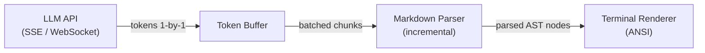
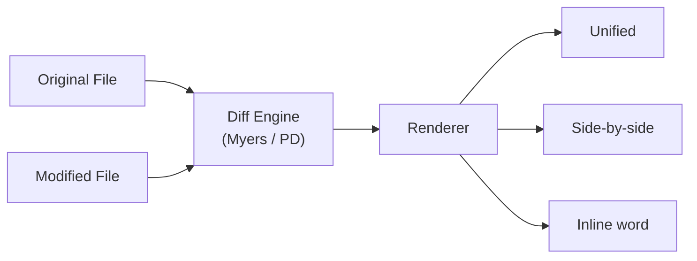

# UX Patterns for Human-Agent Interaction in CLI Agents

> How terminal-based coding agents render output, handle input, and structure their
> interfaces—the TUI frameworks, streaming strategies, and interaction patterns that
> make human-agent collaboration work without leaving the terminal.

---

## Overview

The terminal is the primary interface for CLI coding agents. Unlike web-based IDEs or
desktop GUIs, the terminal imposes hard constraints: no mouse-first interaction, limited
pixel-level control, monospaced text, and a sequential scroll buffer. Good UX in this
context means the human stays **informed** (can see what the agent is doing), **in control**
(can intervene at any point), and **not overwhelmed** (output is structured and scannable).

This document covers:

- **TUI frameworks** — the rendering engines agents build on
- **Streaming display** — how LLM output appears token-by-token
- **Diff rendering** — how file changes are visualized
- **Color and typography** — semantic use of ANSI attributes
- **Progress indicators** — spinners, bars, cost counters
- **Permission dialogs** — rendering approval prompts (complement to [permission-prompts.md](./permission-prompts.md))
- **Input handling** — multi-line editing, slash commands, key bindings
- **Layout patterns** — single-pane, split-pane, full-screen TUI
- **Responsive design** — adapting to terminal dimensions

For how agents request permission specifically, see [permission-prompts.md](./permission-prompts.md).
For plan-and-confirm workflows, see [plan-and-confirm.md](./plan-and-confirm.md).
For interactive debugging UX, see [interactive-debugging.md](./interactive-debugging.md).

---

## TUI Framework Landscape

CLI coding agents don't render raw `console.log` output. They use TUI (Terminal User
Interface) frameworks that provide component models, layout engines, and input handling.
The choice of framework defines an agent's UX ceiling.

### Framework Comparison

| Framework       | Language   | Architecture         | Used By                                                      | Rendering Model     |
|-----------------|------------|----------------------|--------------------------------------------------------------|---------------------|
| Ink             | TypeScript | React component tree | [Claude Code](../../agents/claude-code/), [Codex](../../agents/codex/), [Gemini CLI](../../agents/gemini-cli/), [ForgeCode](../../agents/forgecode/) | Retained (virtual DOM) |
| Bubble Tea      | Go         | Elm Architecture     | [OpenCode](../../agents/opencode/), [Goose](../../agents/goose/) (initial)                         | Retained (model-view) |
| Ratatui         | Rust       | Immediate-mode       | [Goose](../../agents/goose/) (current)                                              | Immediate (per-frame) |
| Prompt Toolkit  | Python     | Widget + input       | [Aider](../../agents/aider/)                                                    | Retained (layout)     |
| Charm / Lipgloss| Go         | Styling library      | [OpenCode](../../agents/opencode/)                                                  | Declarative styles    |
| Rich            | Python     | Console protocol     | [OpenHands](../../agents/openhands/), [Capy](../../agents/capy/)                                       | Retained (renderables) |
| Raw ANSI        | Various    | Direct escape codes  | [Mini SWE Agent](../../agents/mini-swe-agent/), [Sage Agent](../../agents/sage-agent/), [TongAgents](../../agents/tongagents/)            | None (manual)         |

### Ink — React for Terminals

Ink lets agents build terminal UIs with React's component model. JSX elements map to
terminal output via a Yoga-based flexbox layout engine. State management uses standard
React hooks, and the virtual DOM diffs against the previous frame to minimize writes.

```tsx
// Simplified streaming message component (Ink / React)
import React, { useState, useEffect } from "react";
import { Box, Text } from "ink";
import Spinner from "ink-spinner";

export const StreamingMessage = ({ tokens$, isComplete }) => {
  const [content, setContent] = useState("");

  useEffect(() => {
    (async () => {
      for await (const token of tokens$) {
        setContent((prev) => prev + token);
      }
    })();
  }, [tokens$]);

  return (
    <Box flexDirection="column" paddingX={1}>
      <Box>
        <Text color="cyan" bold>assistant </Text>
        {!isComplete && <Spinner type="dots" />}
      </Box>
      <Box marginLeft={2}><Text>{content}</Text></Box>
    </Box>
  );
};
```

Agents using Ink: [Claude Code](../../agents/claude-code/) builds its entire UI as an Ink
app. [Codex](../../agents/codex/) uses Ink for its approval flow. [Gemini CLI](../../agents/gemini-cli/)
uses Ink for markdown rendering. [ForgeCode](../../agents/forgecode/) wraps its agent loop in Ink.

### Bubble Tea — The Elm Architecture in Go

Bubble Tea implements the Elm Architecture: a `Model` holds state, an `Update` function
processes messages and returns a new model, and a `View` function renders the model to a
string.

```go
// Simplified Bubble Tea model for a coding agent (Go)
package main

import (
    tea "github.com/charmbracelet/bubbletea"
    "github.com/charmbracelet/lipgloss"
)

type model struct {
    messages  []ChatMessage
    input     string
    streaming bool
    width     int
}

type tokenMsg string

func (m model) Update(msg tea.Msg) (tea.Model, tea.Cmd) {
    switch msg := msg.(type) {
    case tea.WindowSizeMsg:
        m.width = msg.Width
    case tokenMsg:
        last := &m.messages[len(m.messages)-1]
        last.Content += string(msg)
        return m, waitForToken
    case tea.KeyMsg:
        if msg.String() == "enter" && !m.streaming {
            return m, sendPrompt(m.input)
        }
    }
    return m, nil
}

func (m model) View() string {
    style := lipgloss.NewStyle().Width(m.width).Padding(0, 1)
    var s string
    for _, msg := range m.messages {
        s += style.Render(msg.Role + ": " + msg.Content) + "\n"
    }
    return s
}
```

[OpenCode](../../agents/opencode/) builds a full multi-panel TUI with Bubble Tea and
Lipgloss. [Goose](../../agents/goose/) initially used Bubble Tea before migrating parts
to Ratatui.

### Ratatui — Immediate-Mode Rendering in Rust

Ratatui renders every frame from scratch—no retained component tree. The `draw` function
writes widgets directly to a terminal area.

```rust
use ratatui::{
    layout::{Constraint, Direction, Layout},
    style::{Color, Style},
    widgets::{Block, Borders, Paragraph},
    Frame,
};

fn draw_agent_output(f: &mut Frame, content: &str, is_streaming: bool) {
    let chunks = Layout::default()
        .direction(Direction::Vertical)
        .constraints([Constraint::Min(3), Constraint::Length(3)])
        .split(f.area());
    let title = if is_streaming { " Agent (streaming…) " } else { " Agent " };
    let para = Paragraph::new(content)
        .block(Block::default().title(title).borders(Borders::ALL))
        .style(Style::default().fg(Color::White));
    f.render_widget(para, chunks[0]);
}
```

### Prompt Toolkit — Python Input Handling

[Aider](../../agents/aider/) uses `prompt_toolkit` for input: multi-line editing, command
history, file-path completion, and Vim/Emacs keybindings.

```python
from prompt_toolkit import PromptSession
from prompt_toolkit.history import FileHistory
from prompt_toolkit.completion import PathCompleter

session = PromptSession(
    history=FileHistory(".aider.history"),
    completer=PathCompleter(),
    multiline=True,
    prompt_continuation="... ",
)
user_input = session.prompt("aider> ")
```

---

## Streaming Output Display

LLM responses arrive as a stream of tokens. How agents render this stream—smoothly and
incrementally—is one of the hardest UX problems in terminal agent design.

### The Rendering Pipeline



### The Incremental Markdown Problem

Streaming creates ambiguity. When the agent has emitted `` ```py `` but not yet the
closing `` ``` ``, the parser must decide: render as a code block (optimistic) or plain
text (conservative)?

| Strategy           | Agent Example                        | Behavior                                    |
|--------------------|--------------------------------------|---------------------------------------------|
| Optimistic parsing | [Claude Code](../../agents/claude-code/) | Assume open fences are code blocks; re-render on close |
| Deferred rendering | [Gemini CLI](../../agents/gemini-cli/)   | Buffer until block-level element completes  |
| Plain streaming    | [Aider](../../agents/aider/)             | Render tokens as-is; format on completion   |
| Chunk batching     | [Codex](../../agents/codex/)             | Batch tokens (50ms window); parse as unit   |

Claude Code leverages Ink's virtual DOM for smooth streaming—each new token triggers a
state update, Ink computes minimal terminal writes:

```
Frame N:     "Here is a fix:\n```python\ndef "
Frame N+1:   "Here is a fix:\n```python\ndef hello"
                                            ^^^^^  ← only this is written
```

### Terminal Markdown Renderers

| Library          | Language | Used By          | Features                                   |
|------------------|----------|------------------|--------------------------------------------|
| marked-terminal  | JS       | Ink agents       | Headings, code highlighting, tables, links |
| rich             | Python   | Aider, OpenHands | Syntax highlighting, tables, trees, panels |
| glamour          | Go       | OpenCode, Goose  | Markdown to ANSI, word wrap, theme support |
| termimad         | Rust     | Goose (Ratatui)  | Markdown in terminal, table alignment      |

---

## Diff Rendering

Showing file changes clearly is essential—the human must review diffs before approving
edits. Agents use several diff styles depending on the change type and terminal width.

### Unified Diff (Standard)

```
  src/auth.ts
  ─────────────────────────────────────────
    14 │   const token = jwt.sign(payload, SECRET);
  - 15 │   return { token, expiresIn: 3600 };
  + 15 │   return { token, expiresIn: TOKEN_TTL_SECONDS };
    16 │ }
```

### Side-by-Side Diff

```
  src/auth.ts
  ────────────────────────────────┬─────────────────────────────────
   OLD                            │  NEW
  ────────────────────────────────┼─────────────────────────────────
   return {                       │  return {
     token,                       │    token,
     expiresIn: 3600              │    expiresIn: TOKEN_TTL_SECONDS
   };                             │  };
  ────────────────────────────────┴─────────────────────────────────
```

### Word-Level Inline Diff

For small changes, highlighting exact words changed is more readable than showing the
entire line as added/deleted:

```
  src/config.ts:22
   const timeout = [3600→TOKEN_TTL_SECONDS];
                    ^^^^   ^^^^^^^^^^^^^^^^^^
                    red    green
```

### Diff Rendering Architecture



### Diff Style by Agent

| Agent                                         | Default Style    | Word-Level | Syntax Highlight |
|-----------------------------------------------|------------------|------------|------------------|
| [Claude Code](../../agents/claude-code/)      | Unified          | ✅          | ✅                |
| [Codex](../../agents/codex/)                  | Unified          | ❌          | ✅                |
| [Aider](../../agents/aider/)                  | Search/replace   | ✅          | Via Rich          |
| [OpenCode](../../agents/opencode/)            | Unified          | ✅          | Via Glamour       |
| [Gemini CLI](../../agents/gemini-cli/)        | Unified          | ❌          | ✅                |
| [Goose](../../agents/goose/)                  | Unified          | ❌          | Via Ratatui       |
| [ForgeCode](../../agents/forgecode/)          | Unified          | ❌          | ✅                |

---

## Color Coding Conventions

ANSI colors carry semantic meaning across nearly all CLI agents. Consistent use reduces
cognitive load—users learn to scan for red (danger) and green (safe) reflexively.

| Color            | ANSI Code      | Semantic Meaning                | Example Usage                        |
|------------------|----------------|---------------------------------|--------------------------------------|
| Green            | `\x1b[32m`     | Addition, success, safe         | `+ added line`, "Edit applied"       |
| Red              | `\x1b[31m`     | Deletion, error, danger         | `- removed line`, "Command failed"   |
| Yellow           | `\x1b[33m`     | Warning, prompt                 | "Allow this command? [y/n]"          |
| Blue             | `\x1b[34m`     | Information, file paths         | `src/auth.ts`, tool names            |
| Cyan             | `\x1b[36m`     | Agent role, metadata            | "assistant", model name              |
| Magenta          | `\x1b[35m`     | System messages                 | "Compacting conversation…"           |
| Dim / Gray       | `\x1b[2m`      | Context, secondary info         | Line numbers, token counts           |
| Bold + Red       | `\x1b[1;31m`   | Critical error, destructive     | "rm -rf /", permission denied        |
| Bold + Green     | `\x1b[1;32m`   | Major success                   | "All tests passed", "Done"           |

**Recommendation:** Use semantic color names from the TUI framework rather than raw ANSI
codes. Fall back to the 16-color palette for maximum compatibility.

---

## CLI Spinners and Progress Indicators

When the agent is thinking or executing, the user needs feedback. Silence feels like a hang.

### Spinner Patterns

```
Dots:       ⠋ ⠙ ⠹ ⠸ ⠼ ⠴ ⠦ ⠧ ⠇ ⠏     (Braille, most common)
Line:       - \ | /                       (ASCII fallback)
Bounce:     ⠁ ⠂ ⠄ ⠂                      (Minimal)
```

Bare spinners are insufficient. Users need to know **what** the agent is doing:

```
⠹ Calling claude-sonnet-4-5... (4.2s, ~320 tokens)
⠸ Running `npm test`... (12.1s)
⠼ Reading src/auth.ts... (2 files queued)
```

### Progress Indicators in Ink

```tsx
import { Box, Text } from "ink";
import Spinner from "ink-spinner";

export const ToolStatus = ({ toolName, elapsed, tokensSoFar, costSoFar }) => (
  <Box gap={1}>
    <Text color="cyan"><Spinner type="dots" /></Text>
    <Text>Running <Text bold>{toolName}</Text></Text>
    <Text dimColor>({elapsed.toFixed(1)}s · {tokensSoFar} tokens · ${costSoFar.toFixed(4)})</Text>
  </Box>
);
```

### Animation in Bubble Tea

Bubble Tea drives spinner animation through message passing—a `tickMsg` fires on a timer:

```go
func tickCmd() tea.Cmd {
    return tea.Tick(80*time.Millisecond, func(t time.Time) tea.Msg {
        return tickMsg(t)
    })
}
```

### Cost and Token Tracking

| Agent                                         | Tokens | Cost | Position        |
|-----------------------------------------------|--------|------|-----------------|
| [Claude Code](../../agents/claude-code/)      | ✅      | ✅    | Status bar      |
| [Aider](../../agents/aider/)                  | ✅      | ✅    | After response  |
| [OpenCode](../../agents/opencode/)            | ✅      | ✅    | TUI panel       |
| [Gemini CLI](../../agents/gemini-cli/)        | ✅      | ❌    | Inline          |
| [Goose](../../agents/goose/)                  | ✅      | ✅    | Status line     |

---

## Permission Dialog Rendering

Permission dialogs are the most critical UX element in a coding agent—they must convey
risk, show what will happen, and accept input in a terminal box. For the underlying
architectures, see [permission-prompts.md](./permission-prompts.md).

### Box Drawing for Dialogs

```
╭─────────────────────────────────────────────────────────╮
│  Claude wants to run a command                          │
│                                                         │
│  ❯ npm test -- --coverage                               │
│                                                         │
│  Working directory: /home/user/project                  │
│                                                         │
│  [Y] Allow   [N] Deny   [A] Always allow   [?] Explain │
╰─────────────────────────────────────────────────────────╯
```

### Risk-Level Color Coding

```
Low risk (green border):    Read operations, safe commands (ls, cat, git status)
Medium risk (yellow border): File edits, test commands (npm test, go test)
High risk (red border):      Destructive commands (rm, git push --force, curl | sh)
```

### Diff Preview in Permission Dialogs

[Claude Code](../../agents/claude-code/) embeds a diff preview directly in the dialog:

```
╭──── Edit: src/auth.ts ────────────────────────────────╮
│                                                        │
│  15 │ - return { token, expiresIn: 3600 };             │
│  15 │ + return { token, expiresIn: TOKEN_TTL_SECONDS };│
│                                                        │
│  [Y] Allow   [N] Deny   [E] Edit   [A] Always allow   │
╰────────────────────────────────────────────────────────╯
```

### Key Binding Conventions

| Binding     | Meaning                  | Agents Using It                              |
|-------------|--------------------------|----------------------------------------------|
| `y` / `Y`   | Allow once              | Claude Code, Codex, Gemini CLI, OpenCode     |
| `n` / `N`   | Deny                    | All agents with prompts                      |
| `a` / `A`   | Always allow (persist)  | Claude Code, Goose                           |
| `e` / `E`   | Edit before running     | Claude Code                                  |
| `!`         | Allow for session       | Codex                                        |
| `Esc`       | Cancel / dismiss        | OpenCode, Goose                              |

---

## Rich Markdown Rendering

Agent responses are markdown. Rendering it well in a terminal—with syntax highlighting,
table alignment, and proper wrapping—separates polished agents from raw-text ones.

### Syntax Highlighters

| Highlighter      | Language | Used By             | Grammar Source          |
|------------------|----------|---------------------|------------------------|
| highlight.js     | JS       | Ink agents          | Language-specific regex |
| Shiki            | JS       | Gemini CLI          | TextMate grammars      |
| tree-sitter      | C / Rust | Goose, Ratatui UIs  | Incremental parsing    |
| Pygments         | Python   | Aider (via Rich)    | Regex-based lexers     |
| Chroma           | Go       | OpenCode (Glamour)  | Pygments-compatible    |

### Rendering with Rich (Python)

```python
from rich.console import Console
from rich.markdown import Markdown

console = Console()
md = Markdown("## Analysis\nThe bug is in `src/auth.ts`:\n```typescript\n"
              "return { token, expiresIn: 3600 };\n```\n**Fix:** Extract to a constant.")
console.print(md)
```

### Rendering with Glamour (Go)

```go
import "github.com/charmbracelet/glamour"

func renderMarkdown(content string, width int) (string, error) {
    renderer, _ := glamour.NewTermRenderer(
        glamour.WithAutoStyle(),
        glamour.WithWordWrap(width),
    )
    return renderer.Render(content)
}
```

### Link Rendering

Modern terminals (iTerm2, Windows Terminal, WezTerm, Ghostty) support OSC 8 hyperlinks:

```
ESC ]8;;https://github.com/org/repo/blob/main/src/auth.ts\aSrc/auth.ts\aESC ]8;;\a
```

Agents that emit OSC 8 links: [Claude Code](../../agents/claude-code/),
[Gemini CLI](../../agents/gemini-cli/). Most agents fall back to printing raw URLs.

---

## Notification Systems

Long-running agent tasks may complete while the user has switched to another tab.

| Channel              | Mechanism              | OS Support         | Agent Examples                    |
|----------------------|------------------------|--------------------|-----------------------------------|
| Terminal bell        | `\x07` (BEL character) | Universal          | [Aider](../../agents/aider/), [Claude Code](../../agents/claude-code/) |
| Desktop notification | node-notifier          | macOS, Linux       | [Claude Code](../../agents/claude-code/) |
| Terminal title       | OSC 2 escape sequence  | Most terminals     | [Goose](../../agents/goose/)          |
| Sound cue            | System audio API       | macOS (afplay)     | Rare                              |

Notifications should fire when human attention is needed: task complete, permission needed
(see [permission-prompts.md](./permission-prompts.md)), error encountered, or cost
threshold exceeded. [Warp](../../agents/warp/) provides session-level notifications.

---

## Input Handling Patterns

### Multi-Line Input

| Agent                                    | Enter Behavior       | Multi-Line Trigger       |
|------------------------------------------|----------------------|--------------------------|
| [Claude Code](../../agents/claude-code/) | Submits message      | Shift+Enter / \\ + Enter |
| [Aider](../../agents/aider/)             | Newline in input     | Meta+Enter submits       |
| [Codex](../../agents/codex/)             | Submits message      | Shift+Enter              |
| [OpenCode](../../agents/opencode/)       | Submits message      | Shift+Enter              |
| [Gemini CLI](../../agents/gemini-cli/)   | Submits message      | \\ + Enter for newline   |
| [Goose](../../agents/goose/)             | Submits message      | Shift+Enter              |

### Slash Commands

Most agents support `/`-prefixed commands for meta-actions:

```
/help     Show available commands      /model    Switch the active model
/clear    Clear conversation history   /cost     Show token usage and cost
/compact  Summarize and compress       /undo     Revert last agent action
/init     Initialize project memory
```

[Claude Code](../../agents/claude-code/) has the most extensive slash command vocabulary.
[Aider](../../agents/aider/) uses `/` commands for context management (`/add`, `/drop`).

### Tab Completion

File-path tab completion is essential for adding context to prompts:

```
aider> /add src/au<TAB>
                  src/auth.ts
                  src/auth.test.ts
                  src/auth/
```

[Aider](../../agents/aider/) provides file-path completion via Prompt Toolkit.
[Claude Code](../../agents/claude-code/) supports `@`-mention completion for files.
[OpenCode](../../agents/opencode/) implements fuzzy file search in its Bubble Tea TUI.

### Vim and Emacs Keybindings

Prompt Toolkit agents (Aider) support both Vim and Emacs editing modes natively. Ink-based
agents inherit readline bindings from Node.js. Bubble Tea agents implement bindings manually.

---

## Layout Patterns

### Single-Pane Chat (Most Agents)

```
┌──────────────────────────────────────────────────────┐
│ user: Fix the authentication bug in src/auth.ts      │
│                                                      │
│ assistant: I'll analyze the issue...                 │
│                                                      │
│ ⠹ Reading src/auth.ts...                             │
│                                                      │
│  - return { token, expiresIn: 3600 };                │
│  + return { token, expiresIn: TOKEN_TTL_SECONDS };   │
│                                                      │
│ ────────────────────────────────────────              │
│ > _                                                  │
└──────────────────────────────────────────────────────┘
```

Used by: [Claude Code](../../agents/claude-code/), [Codex](../../agents/codex/),
[Gemini CLI](../../agents/gemini-cli/), [Aider](../../agents/aider/),
[Goose](../../agents/goose/), [ForgeCode](../../agents/forgecode/),
[Droid](../../agents/droid/), [Junie CLI](../../agents/junie-cli/),
[Ante](../../agents/ante/), [Capy](../../agents/capy/),
[Warp](../../agents/warp/) agent mode.

### Multi-Panel Full-Screen TUI

[OpenCode](../../agents/opencode/) implements a full-screen terminal application:

```
┌─── Chat ─────────────────────────┬─── Files ────────────┐
│ user: Fix the auth bug           │ src/                  │
│                                  │  ├── auth.ts ★        │
│ assistant: Found the issue in    │  ├── config.ts        │
│ auth.ts:15. Hardcoded TTL.       │  └── index.ts         │
│                                  ├─── Logs ─────────────┤
│ ⠹ Editing src/auth.ts...        │ [14:32] Read auth.ts  │
│                                  │ [14:33] Applying edit │
├──────────────────────────────────┴───────────────────────┤
│ claude-sonnet-4-5 │ 1,240 tokens │ $0.012 │ > _         │
└──────────────────────────────────────────────────────────┘
```

### Status Bar Patterns

```
 Model: claude-sonnet-4-5 │ Mode: code │ Tokens: 4.2k / 200k │ Cost: $0.041
```

---

## Responsive Terminal Design

Terminals vary from 80-column SSH sessions to ultrawide 300+ column displays.

### Terminal Size Detection

```typescript
// Ink: via useStdout hook
const { stdout } = useStdout();
const width = stdout.columns;
```

```go
// Bubble Tea: via WindowSizeMsg
case tea.WindowSizeMsg:
    m.width = msg.Width
    m.height = msg.Height
```

### Width-Adaptive Rendering

| Terminal Width | Diff Style      | Table Rendering | Path Display          |
|----------------|-----------------|------------------|-----------------------|
| < 80 cols     | Unified only    | Vertical list    | Filename only         |
| 80–120 cols   | Unified         | Compact tables   | Relative path         |
| 120–160 cols  | Side-by-side OK | Full tables      | Full relative path    |
| > 160 cols    | Side-by-side    | Padded tables    | Absolute path         |

### Truncation Strategies

```
Full:      /home/user/projects/my-app/src/components/auth/LoginForm.tsx
Truncated: …/src/components/auth/LoginForm.tsx
Minimal:   …/LoginForm.tsx
```

### Ink Resize Handling

```tsx
import { useStdout } from "ink";

const DiffView = ({ hunks }) => {
  const { stdout } = useStdout();
  const useSideBySide = stdout.columns >= 120;

  return useSideBySide
    ? <SideBySideDiff hunks={hunks} width={stdout.columns} />
    : <UnifiedDiff hunks={hunks} width={stdout.columns} />;
};
```

---

## Agent TUI Feature Comparison

| Agent                                              | Framework      | Streaming | Diff View | Spinners | Color | Slash Cmds | Status Bar | Full TUI |
|----------------------------------------------------|----------------|-----------|-----------|----------|-------|------------|------------|----------|
| [Aider](../../agents/aider/)                       | Prompt Toolkit | ✅ Plain   | ✅ Unified | ✅        | ✅     | ✅          | ❌          | ❌        |
| [Ante](../../agents/ante/)                         | Raw ANSI       | ✅         | ✅ Unified | ✅        | ✅     | ✅          | ❌          | ❌        |
| [Capy](../../agents/capy/)                         | Rich           | ✅         | ✅ Unified | ✅        | ✅     | ✅          | ❌          | ❌        |
| [Claude Code](../../agents/claude-code/)           | Ink            | ✅ Rich    | ✅ Multi   | ✅        | ✅     | ✅          | ✅          | ❌        |
| [Codex](../../agents/codex/)                       | Ink            | ✅ Rich    | ✅ Unified | ✅        | ✅     | ❌          | ❌          | ❌        |
| [Droid](../../agents/droid/)                       | Raw ANSI       | ✅         | ✅ Unified | ✅        | ✅     | ✅          | ❌          | ❌        |
| [ForgeCode](../../agents/forgecode/)               | Ink            | ✅ Rich    | ✅ Unified | ✅        | ✅     | ✅          | ❌          | ❌        |
| [Gemini CLI](../../agents/gemini-cli/)             | Ink            | ✅ Rich    | ✅ Unified | ✅        | ✅     | ✅          | ✅          | ❌        |
| [Goose](../../agents/goose/)                       | Ratatui        | ✅         | ✅ Unified | ✅        | ✅     | ✅          | ✅          | ❌        |
| [Junie CLI](../../agents/junie-cli/)               | Raw ANSI       | ✅         | ✅ Unified | ✅        | ✅     | ✅          | ❌          | ❌        |
| [Mini SWE Agent](../../agents/mini-swe-agent/)     | Raw ANSI       | ✅ Plain   | ❌         | ❌        | ⚡     | ❌          | ❌          | ❌        |
| [OpenCode](../../agents/opencode/)                 | Bubble Tea     | ✅ Rich    | ✅ Multi   | ✅        | ✅     | ✅          | ✅          | ✅        |
| [OpenHands](../../agents/openhands/)               | Rich           | ✅         | ✅ Unified | ✅        | ✅     | ✅          | ❌          | ❌        |
| [Pi Coding Agent](../../agents/pi-coding-agent/)   | Raw ANSI       | ✅         | ✅ Unified | ✅        | ⚡     | ❌          | ❌          | ❌        |
| [Sage Agent](../../agents/sage-agent/)             | Raw ANSI       | ✅ Plain   | ❌         | ✅        | ⚡     | ❌          | ❌          | ❌        |
| [TongAgents](../../agents/tongagents/)             | Raw ANSI       | ✅ Plain   | ❌         | ❌        | ⚡     | ❌          | ❌          | ❌        |
| [Warp](../../agents/warp/)                         | Custom (Rust)  | ✅ Rich    | ✅ Unified | ✅        | ✅     | ✅          | ✅          | ✅        |

Legend: ✅ Full support · ⚡ Partial / basic · ❌ Not supported

---

## Design Recommendations

Based on patterns observed across all 17 agents:

### 1. Use a TUI Framework

Raw ANSI escape codes work for prototypes but create maintenance burden and accessibility
problems at scale. Agents using Ink, Bubble Tea, or Rich consistently deliver better UX.

### 2. Stream with Incremental Parsing

Don't buffer the entire response before rendering. Stream tokens to the screen with an
incremental markdown parser to avoid glitches from partial formatting. Optimistic parsing
(assume code blocks will close) produces the smoothest experience.

### 3. Show Cost and Progress Continuously

Users should always know: what model is running, how many tokens have been consumed, and
what it costs. This belongs in a persistent status area, not post-response summaries.

### 4. Color-Code Risk in Permission Dialogs

The single most impactful UX improvement for safety: make high-risk actions visually
distinct from low-risk ones. Red borders for destructive commands; green for reads. See
[permission-prompts.md](./permission-prompts.md) for full permission architecture.

### 5. Support Both Quick and Detailed Input

Enter should submit for fast iteration. Shift+Enter allows multi-line input for complex
prompts. Slash commands give power users fast access to meta-actions.

### 6. Adapt to Terminal Width

Narrow terminals (< 80 cols) should never produce horizontal scrolling. Use unified diffs
instead of side-by-side, truncate long paths, collapse tables. Test in 80×24.

### 7. Notify on Completion

Long-running tasks should fire a terminal bell or desktop notification when finished.
Especially important for agents executing multi-step plans autonomously (see
[plan-and-confirm.md](./plan-and-confirm.md)).

### 8. Make Diffs Reviewable

Every file edit should produce a clear diff during the approval step. Word-level
highlighting for small changes, unified diffs for larger ones. Embedding the diff in
the permission dialog (as Claude Code does) reduces steps to approve or reject.

---

*This analysis covers terminal UX patterns as implemented in publicly available open-source
CLI coding agents as of mid-2025. Framework versions, rendering approaches, and UI designs
may change between agent releases.*
