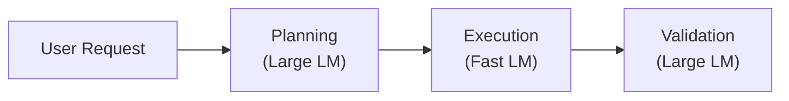
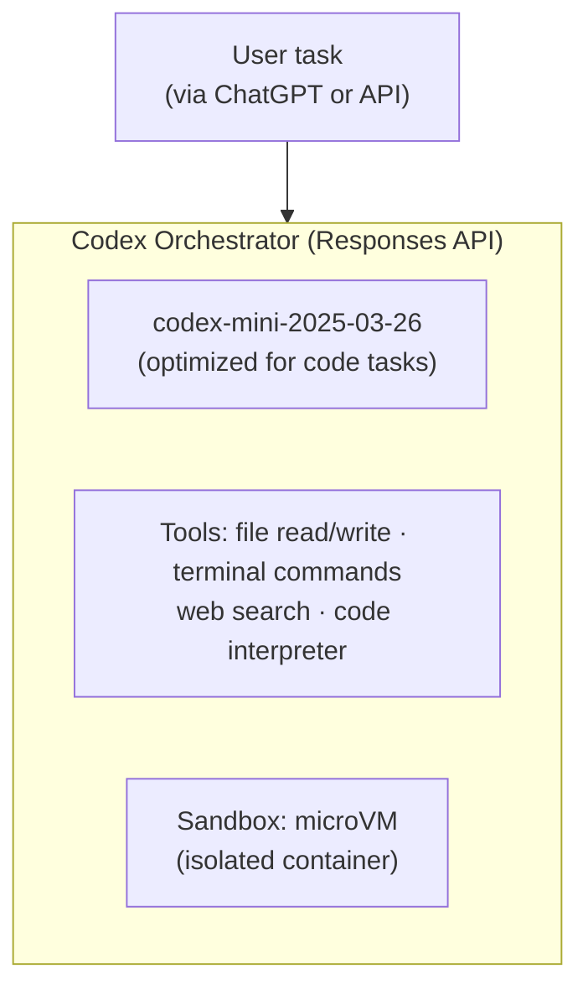
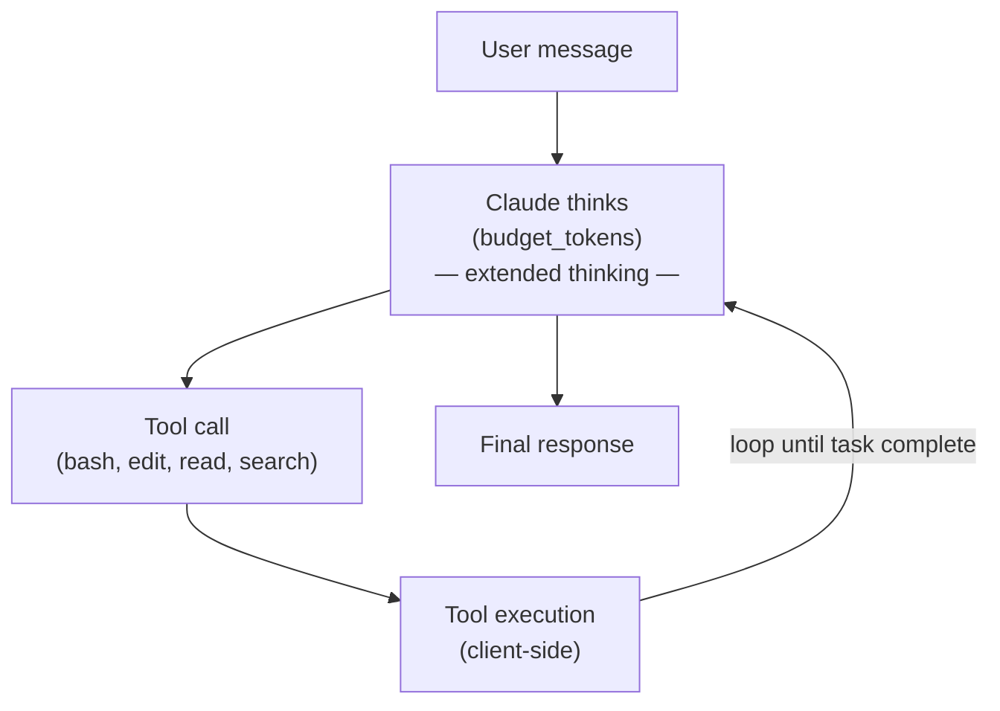

# AI Coding Agents: API and Protocol Comparison

## Introduction

The landscape of AI-powered coding agents has exploded since 2023, with dozens of tools
competing to become the default way developers write, debug, and maintain code. Under the
hood, these agents differ significantly in **which LLM providers** they call, **which API
protocols** they speak, and **how they orchestrate** multi-step tool-using workflows.

Choosing the right API is not a cosmetic decision. It determines:

- **Latency** — streaming token-by-token vs. waiting for a full response
- **Capability** — native tool calling, structured outputs, extended thinking
- **Reliability** — failover across providers, retry semantics, rate-limit handling
- **Cost** — batch endpoints, prompt caching, token-efficient protocols
- **Agentic fit** — whether the API was designed for multi-turn, tool-using agents or
  bolted on after the fact

This document provides a detailed, agent-by-agent breakdown of the API choices made by
every major coding agent as of mid-2025, followed by comparison tables and analysis of
the abstraction layers that sit between agents and providers.

---

## Agent-by-Agent Analysis

### 1. GitHub Copilot

**Provider(s):** OpenAI (via Azure OpenAI Service), Anthropic Claude, Google Gemini

GitHub Copilot is the most widely deployed coding agent. Its architecture has evolved
through several generations:

| Generation | Model | API |
|---|---|---|
| Copilot (inline) | Copilot-specific fine-tuned Codex/GPT variants | Custom internal protocol over Azure OpenAI |
| Copilot Chat | GPT-4o, Claude 3.5 Sonnet, Gemini 1.5 Pro | Chat Completions (Azure OpenAI endpoint) |
| Copilot Workspace | GPT-4o + specialized planning models | Multi-step orchestration with internal APIs |
| Copilot Coding Agent | Claude Sonnet 4, GPT-4.1, Gemini 2.5 Pro | Chat Completions + tool use |

**Key technical details:**

- **Primary API:** Azure OpenAI Chat Completions (`/chat/completions`). Copilot routes
  through Microsoft's Azure OpenAI deployment, not the public OpenAI API. This gives
  Microsoft SLA guarantees and data residency controls.
- **Multi-provider:** Since late 2024, Copilot Chat lets users select models from OpenAI,
  Anthropic, and Google. The backend translates between the Chat Completions wire format
  and each provider's native API.
- **Fine-tuned models:** The inline completion engine uses Copilot-specific fine-tuned
  models (not publicly available) optimized for fill-in-the-middle (FIM) completion with
  extremely low latency (~200ms target).
- **Tool calling:** Copilot extensions and the coding agent use OpenAI-style function
  calling with `tools` array and `tool_choice` parameters.
- **Streaming:** Server-Sent Events (SSE) for Chat, custom streaming for inline completions.

```jsonc
// Copilot Chat request (simplified, Azure OpenAI format)
{
  "model": "gpt-4o",
  "messages": [
    {"role": "system", "content": "You are GitHub Copilot..."},
    {"role": "user", "content": "Explain this code: ..."}
  ],
  "stream": true,
  "tools": [
    {
      "type": "function",
      "function": {
        "name": "search_code",
        "description": "Search the repository for code matching a query",
        "parameters": { "type": "object", "properties": { "query": { "type": "string" } } }
      }
    }
  ]
}
```

---

### 2. Cursor

**Provider(s):** OpenAI, Anthropic, Google, custom fine-tuned models

Cursor is the most aggressive multi-provider IDE. It maintains simultaneous connections
to multiple LLM providers and routes requests based on task type, user preference, and
provider availability.

**Architecture:**

- **Model router:** Cursor's backend selects the optimal model for each request type.
  Tab completions use a fast, fine-tuned model (`cursor-small`). Chat and agent tasks
  default to the most capable available model (Claude Sonnet 4, GPT-4o, or Gemini).
- **Provider failover:** If one provider returns errors or hits rate limits, Cursor
  automatically routes to an alternative. The user may not even notice the switch.
- **Custom models:** Cursor trains its own small models for tab completion and code
  understanding. These run on Cursor's infrastructure.
- **API format:** Cursor speaks the Chat Completions format internally but translates
  to each provider's native API at the edge.

**APIs used:**

| Task | Model | API |
|---|---|---|
| Tab completion | `cursor-small` (custom) | Internal inference API |
| Chat | Claude Sonnet 4 / GPT-4o / Gemini 2.5 Pro | Chat Completions / Messages API / Gemini API |
| Agent (Composer) | Claude Sonnet 4 (default) | Messages API with tool use |
| Code search / indexing | Custom embeddings model | Custom embedding API |

**Special features:**
- **Speculative edits:** Cursor predicts multi-file edits speculatively, sending parallel
  requests to reduce perceived latency.
- **Caching:** Aggressive prompt caching, including Anthropic's automatic prompt caching
  (which caches prefixes across requests for up to 5 minutes at 90% discount).
- **Background agent:** Cursor's background agent (similar to Copilot's coding agent)
  runs in a cloud sandbox and uses long-running agentic loops.

---

### 3. Windsurf (Codeium)

**Provider(s):** Custom Codeium models, OpenAI, Anthropic

Windsurf (formerly Codeium) differentiates itself with its **Cascade** architecture — a
multi-model system that breaks coding tasks into specialized stages.

**Cascade architecture:**



- **Planning stage:** Uses a large model (Claude/GPT-4o class) to understand the task,
  plan the approach, and identify which files need changes.
- **Execution stage:** Uses a faster, often custom-trained model to generate the actual
  code edits. This model is optimized for speed and code quality.
- **Validation stage:** Uses the large model again to review the changes for correctness.

**APIs:**
- Custom Codeium inference API for proprietary models
- OpenAI Chat Completions for GPT models
- Anthropic Messages API for Claude models
- All requests are routed through Codeium's backend proxy

**Notable:** Windsurf was one of the first agents to implement multi-model orchestration
where different models handle different phases of a single task.

---

### 4. Aider

**Provider(s):** Any provider supported by litellm (100+ providers)

Aider is the leading open-source terminal-based coding agent. Its provider-agnostic
architecture is one of its greatest strengths.

**How Aider handles providers:**

```yaml
# Example: Using Anthropic
$ aider --model claude-sonnet-4-20250514

# Example: Using OpenAI
$ aider --model gpt-4o

# Example: Using a local model via Ollama
$ aider --model ollama/deepseek-coder-v2

# Example: Using any OpenAI-compatible endpoint
$ OPENAI_API_BASE=http://localhost:8080/v1 aider --model custom/my-model
```

- **litellm integration:** Aider uses [litellm](https://github.com/BerriAI/litellm) as
  its provider abstraction layer. litellm translates a unified `completion()` call into
  the appropriate provider-specific API (OpenAI, Anthropic, Google, Cohere, etc.).
- **Model configuration:** Aider maintains a `model-metadata.json` file that maps model
  names to their capabilities (context window, tool support, edit format preference).
- **Edit formats:** Aider pioneered several edit formats optimized for different models:
  - `whole` — returns the entire file (simple but token-heavy)
  - `diff` — returns unified diffs (token-efficient but error-prone with weaker models)
  - `udiff` — a more structured diff format
  - `editor-diff` — uses a two-model approach: an "editor" model proposes changes, an
    "architect" model plans them
- **No tool calling required:** Unlike most agents, Aider works with models that do NOT
  support native tool calling. It uses structured prompts and output parsing instead.

---

### 5. Continue.dev

**Provider(s):** Any (user-configured)

Continue.dev is an open-source IDE extension that treats provider selection as a
first-class configuration concern.

**Configuration-based approach:**

```json
// ~/.continue/config.json
{
  "models": [
    {
      "title": "Claude Sonnet",
      "provider": "anthropic",
      "model": "claude-sonnet-4-20250514",
      "apiKey": "sk-ant-..."
    },
    {
      "title": "GPT-4o",
      "provider": "openai",
      "model": "gpt-4o",
      "apiKey": "sk-..."
    },
    {
      "title": "Local Ollama",
      "provider": "ollama",
      "model": "codestral"
    }
  ],
  "tabAutocompleteModel": {
    "provider": "ollama",
    "model": "starcoder2:3b"
  }
}
```

**Supported providers:** OpenAI, Anthropic, Google Gemini, Ollama, Together AI,
Replicate, HuggingFace, Azure OpenAI, AWS Bedrock, Mistral, Groq, LM Studio,
and any OpenAI-compatible API.

**Key design decisions:**
- Each model is configured independently — you can use different providers for chat,
  autocomplete, and embeddings
- Continue uses the native API for each provider (not a universal abstraction)
- Tool calling adapts to each provider's native format

---

### 6. OpenAI Codex (Cloud Agent)

**Provider(s):** OpenAI exclusively

OpenAI Codex is OpenAI's cloud-based coding agent, released in 2025. It is notable
for being the first major agent built **exclusively on the Responses API** rather than
Chat Completions.

**Why Responses API for agents:**

The Responses API (`/v1/responses`) was designed from the ground up for agentic
workflows. Key advantages over Chat Completions:

| Feature | Chat Completions | Responses API |
|---|---|---|
| State management | Client manages full message history | Server-side with `previous_response_id` |
| Tool execution | Client-side loop | Server can execute built-in tools |
| Built-in tools | None | `web_search`, `file_search`, `code_interpreter`, `computer_use` |
| Background execution | Not supported | Native with `background: true` |
| Streaming | SSE | SSE with richer event types |
| Reasoning | Not exposed | `reasoning.effort` parameter, summary tokens |

**Codex agent architecture:**



- **Model:** `codex-mini` — a reasoning model optimized for software engineering tasks.
  Uses internal chain-of-thought (reasoning tokens are generated but summarized, not
  fully streamed to the user).
- **Execution:** Each task runs in an isolated microVM sandbox. The agent can read/write
  files, run shell commands, and install dependencies.
- **API call pattern:** Uses `previous_response_id` chaining so the server maintains
  the full conversation state. The client only sends new instructions.

```python
import openai

# Start a Codex task using Responses API
response = openai.responses.create(
    model="codex-mini-2025-03-26",
    input="Fix the failing test in test_auth.py",
    tools=[
        {"type": "code_interpreter"},
        {"type": "file_search"}
    ],
    reasoning={"effort": "high", "summary": "auto"},
    background=True  # Run asynchronously
)
```

---

### 7. Claude Code (Anthropic)

**Provider(s):** Anthropic exclusively

Claude Code is Anthropic's terminal-based coding agent. It uses the **Messages API**
exclusively and is the reference implementation for Anthropic's agentic capabilities.

**Messages API agentic features:**

- **Extended thinking:** Claude Code leverages extended thinking (chain-of-thought
  reasoning) via the `thinking` parameter. The model generates internal reasoning
  tokens before responding, improving accuracy on complex multi-step tasks.
- **Multi-turn tool use:** The Messages API natively supports multi-turn tool-calling
  loops where Claude calls a tool, receives the result, reasons about it, and decides
  whether to call another tool or respond.
- **Streaming with thinking:** Claude Code streams both thinking tokens and response
  tokens, giving users visibility into the model's reasoning process.

```python
import anthropic

client = anthropic.Anthropic()

response = client.messages.create(
    model="claude-sonnet-4-20250514",
    max_tokens=16384,
    thinking={
        "type": "enabled",
        "budget_tokens": 10000  # Max tokens for internal reasoning
    },
    tools=[
        {
            "name": "bash",
            "description": "Run a bash command",
            "input_schema": {
                "type": "object",
                "properties": {
                    "command": {"type": "string"}
                },
                "required": ["command"]
            }
        },
        {
            "name": "edit_file",
            "description": "Edit a file with search and replace",
            "input_schema": {
                "type": "object",
                "properties": {
                    "path": {"type": "string"},
                    "old_text": {"type": "string"},
                    "new_text": {"type": "string"}
                },
                "required": ["path", "old_text", "new_text"]
            }
        }
    ],
    messages=[
        {"role": "user", "content": "Fix the bug in auth.py"}
    ]
)
```

**Agentic loop:**



**Key differences from Codex:**
- Tool execution is **client-side** (Claude Code runs tools locally on your machine)
- Full thinking tokens can be streamed to the terminal
- No server-side state — the client maintains conversation history
- Uses prompt caching aggressively (system prompt + tool definitions are cached)

---

### 8. Amazon Q Developer

**Provider(s):** Custom Amazon models, Anthropic Claude

Amazon Q Developer (formerly CodeWhisperer) uses a mix of Amazon's proprietary models
and Anthropic Claude models accessed through AWS Bedrock.

- **Inline completions:** Custom Amazon-trained code completion models
- **Chat and agent:** Claude models via AWS Bedrock
- **API:** AWS Bedrock `InvokeModel` / `InvokeModelWithResponseStream` APIs
- **Special features:** Deep integration with AWS services, IAM-based access control,
  VPC endpoint support for enterprise deployment
- **Tool use:** Uses Bedrock's Converse API which provides a unified tool-calling
  interface across model providers

```python
import boto3

bedrock = boto3.client("bedrock-runtime")

response = bedrock.converse(
    modelId="anthropic.claude-sonnet-4-20250514-v1:0",
    messages=[{"role": "user", "content": [{"text": "Fix this bug..."}]}],
    toolConfig={
        "tools": [{
            "toolSpec": {
                "name": "execute_command",
                "description": "Run a shell command",
                "inputSchema": {
                    "json": {"type": "object", "properties": {"command": {"type": "string"}}}
                }
            }
        }]
    }
)
```

---

### 9. Google Jules / Gemini Code Assist

**Provider(s):** Google (Gemini models)

Jules is Google's asynchronous coding agent, and Gemini Code Assist is the IDE
integration. Both use the Gemini API exclusively.

- **Model:** Gemini 2.5 Pro and Gemini 2.5 Flash
- **API:** Google AI Gemini API (`generateContent` / `streamGenerateContent`)
- **Tool calling:** Gemini's native function calling with automatic function execution mode
- **Special features:**
  - Native code execution sandbox (Gemini can run Python code natively)
  - Grounding with Google Search
  - Very large context window (1M+ tokens for Gemini 2.5 Pro)
  - Thinking mode built into Gemini 2.5 models

```python
import google.generativeai as genai

model = genai.GenerativeModel(
    model_name="gemini-2.5-pro",
    tools=[edit_file_tool, run_command_tool],
    system_instruction="You are a coding agent..."
)

# Jules-style async task
response = model.generate_content(
    "Fix the failing CI pipeline",
    generation_config={"thinking_config": {"thinking_budget": 8192}}
)
```

---

### 10. Devin (Cognition AI)

**Provider(s):** Multi-provider (Claude, GPT-4o, custom models)

Devin operates as a fully autonomous agent running in a cloud VM with a full development
environment (VS Code, browser, terminal).

- **Orchestration:** Multi-model pipeline where different models handle planning,
  coding, browsing, and validation
- **APIs:** Anthropic Messages API, OpenAI Chat Completions, possibly custom fine-tuned
  models for specific sub-tasks
- **Special features:** Full browser automation, long-running tasks (hours), Slack
  integration for human-in-the-loop workflows

---

### 11. SWE-agent

**Provider(s):** Configurable (any LiteLLM-supported provider)

SWE-agent is a research agent from Princeton NLP, designed to benchmark LLM coding
ability on the SWE-bench dataset.

- **Backend:** Configurable via litellm — supports OpenAI, Anthropic, Google, and local models
- **API:** Uses whichever API litellm routes to based on the selected model
- **Architecture:** Agent-Computer Interface (ACI) — a simplified set of bash-like
  commands the model can invoke
- **Notable:** SWE-agent's design influenced many production agents. Its key insight
  was that giving models a **constrained, well-designed tool interface** matters more
  than the raw model capability.

---

## Comparison Tables

### Provider Usage by Agent

| Agent | OpenAI | Anthropic | Google | Custom Models | Local/OSS |
|---|:---:|:---:|:---:|:---:|:---:|
| GitHub Copilot | ✅ Primary | ✅ | ✅ | ✅ Fine-tuned | ❌ |
| Cursor | ✅ | ✅ | ✅ | ✅ cursor-small | ❌ |
| Windsurf | ✅ | ✅ | ❌ | ✅ Codeium models | ❌ |
| Aider | ✅ | ✅ | ✅ | ❌ | ✅ via Ollama |
| Continue.dev | ✅ | ✅ | ✅ | ❌ | ✅ via Ollama/LM Studio |
| OpenAI Codex | ✅ Only | ❌ | ❌ | ❌ | ❌ |
| Claude Code | ❌ | ✅ Only | ❌ | ❌ | ❌ |
| Amazon Q | ❌ | ✅ via Bedrock | ❌ | ✅ Amazon models | ❌ |
| Jules / Gemini | ❌ | ❌ | ✅ Only | ❌ | ❌ |
| Devin | ✅ | ✅ | ❌ | ✅ | ❌ |
| SWE-agent | ✅ | ✅ | ✅ | ❌ | ✅ via litellm |

### API Endpoint by Agent

| Agent | Chat Completions | Messages API | Responses API | Gemini API | Bedrock API | Custom/Internal |
|---|:---:|:---:|:---:|:---:|:---:|:---:|
| GitHub Copilot | ✅ | ✅* | ❌ | ✅* | ❌ | ✅ |
| Cursor | ✅ | ✅ | ❌ | ✅ | ❌ | ✅ |
| Windsurf | ✅ | ✅ | ❌ | ❌ | ❌ | ✅ |
| Aider | ✅ | ✅ | ❌ | ✅ | ✅ | ❌ |
| Continue.dev | ✅ | ✅ | ❌ | ✅ | ✅ | ❌ |
| OpenAI Codex | ❌ | ❌ | ✅ | ❌ | ❌ | ❌ |
| Claude Code | ❌ | ✅ | ❌ | ❌ | ❌ | ❌ |
| Amazon Q | ❌ | ❌ | ❌ | ❌ | ✅ | ✅ |
| Jules / Gemini | ❌ | ❌ | ❌ | ✅ | ❌ | ❌ |
| Devin | ✅ | ✅ | ❌ | ❌ | ❌ | ✅ |
| SWE-agent | ✅ | ✅ | ❌ | ✅ | ❌ | ❌ |

*\* Via backend translation — the agent backend translates to the native API format*

### Thinking / Reasoning Support

| Agent | Extended Thinking | Reasoning Effort Control | Thinking Visible to User | Reasoning Model Used |
|---|:---:|:---:|:---:|---|
| GitHub Copilot | ✅ (with o-series, Claude) | Limited | ❌ | o4-mini, Claude with thinking |
| Cursor | ✅ | ❌ | Partial | Claude with thinking |
| Windsurf | ✅ | ❌ | ❌ | Varies |
| Aider | ✅ | Via model selection | ❌ | User-configured |
| Continue.dev | ✅ | Via model selection | ❌ | User-configured |
| OpenAI Codex | ✅ | `reasoning.effort` param | Summary only | codex-mini (reasoning model) |
| Claude Code | ✅ | `budget_tokens` param | ✅ Full stream | Claude Sonnet 4 |
| Amazon Q | ✅ | ❌ | ❌ | Claude via Bedrock |
| Jules / Gemini | ✅ | `thinking_budget` param | Partial | Gemini 2.5 Pro/Flash |
| Devin | ✅ | ❌ | ❌ | Internal |
| SWE-agent | ✅ | Via model selection | ❌ | Configurable |

### Tool Calling Approach

| Agent | Native Tool Calling | Prompt-Based Tool Use | Parallel Tool Calls | Tool Formats |
|---|:---:|:---:|:---:|---|
| GitHub Copilot | ✅ | ❌ | ✅ | OpenAI function calling |
| Cursor | ✅ | ❌ | ✅ | Native per provider |
| Windsurf | ✅ | ❌ | ✅ | Mixed |
| Aider | ❌ | ✅ | ❌ | Structured text output |
| Continue.dev | ✅ | Fallback | ✅ | Native per provider |
| OpenAI Codex | ✅ | ❌ | ✅ | Responses API tools |
| Claude Code | ✅ | ❌ | ✅ | Messages API tools |
| Amazon Q | ✅ | ❌ | ✅ | Bedrock Converse tools |
| Jules / Gemini | ✅ | ❌ | ✅ | Gemini function calling |
| Devin | ✅ | ✅ | ✅ | Mixed |
| SWE-agent | ❌ | ✅ | ❌ | Custom ACI format |

### Context Window Management

| Agent | Max Context | Context Strategy | Prompt Caching |
|---|---|---|:---:|
| GitHub Copilot | 128K (GPT-4o) / 200K (Claude) | Sliding window + summarization | ✅ |
| Cursor | 200K (Claude) / 128K (GPT-4o) | Smart truncation + retrieval | ✅ |
| Windsurf | Varies by model | Cascade stage-based chunking | ✅ |
| Aider | Varies by model | Repo map + smart context selection | ❌ |
| Continue.dev | Varies by model | User-managed | ❌ |
| OpenAI Codex | 192K (codex-mini) | Server-managed via response chaining | ✅ |
| Claude Code | 200K (Claude Sonnet 4) | Conversation compaction + caching | ✅ |
| Amazon Q | 200K (Claude via Bedrock) | Managed by Q service | ✅ |
| Jules / Gemini | 1M+ (Gemini 2.5 Pro) | Massive context, less need for truncation | ✅ |
| Devin | Varies | Multi-model with context partitioning | ✅ |
| SWE-agent | Varies by model | Sliding window with history truncation | ❌ |

### Streaming and Batch Support

| Agent | Streaming Protocol | Real-time Streaming | Batch API Usage |
|---|---|:---:|:---:|
| GitHub Copilot | SSE | ✅ | ❌ |
| Cursor | SSE | ✅ | ❌ |
| Windsurf | SSE | ✅ | ❌ |
| Aider | SSE / Provider-specific | ✅ | ❌ |
| Continue.dev | SSE / Provider-specific | ✅ | ❌ |
| OpenAI Codex | SSE (Responses API events) | ✅ | ✅ Background mode |
| Claude Code | SSE (Messages API events) | ✅ | ❌ |
| Amazon Q | Bedrock streaming | ✅ | ❌ |
| Jules / Gemini | SSE (Gemini streaming) | ✅ | ❌ |
| Devin | Internal | Partial (async tasks) | ❌ |
| SWE-agent | Provider-specific | Optional | ❌ |

---

## Provider Abstraction Layers

Many agents don't talk to LLM providers directly. Instead, they use abstraction layers
that provide a unified interface across multiple providers.

### LiteLLM

**Used by:** Aider, SWE-agent, many open-source agents

LiteLLM provides a single `completion()` function that translates to 100+ LLM providers.
It is the most widely used abstraction in the open-source agent ecosystem.

```python
from litellm import completion

# Same interface, different providers
response = completion(model="gpt-4o", messages=[...])
response = completion(model="claude-sonnet-4-20250514", messages=[...])
response = completion(model="gemini/gemini-2.5-pro", messages=[...])
response = completion(model="ollama/llama3", messages=[...])
```

**How it works:**
- Accepts OpenAI-format input (messages, tools, etc.)
- Translates to each provider's native API format
- Normalizes responses back to OpenAI format
- Handles authentication, retries, and error mapping
- Supports streaming, function calling, and vision across providers

**Limitations:**
- Provider-specific features (extended thinking, prompt caching) require extra params
- Translation layer can introduce subtle incompatibilities
- Adds a dependency and potential point of failure

### AI SDK (Vercel)

**Used by:** Next.js applications, Vercel AI chatbots, some web-based agents

```typescript
import { generateText } from 'ai';
import { openai } from '@ai-sdk/openai';
import { anthropic } from '@ai-sdk/anthropic';

// Provider-agnostic interface
const result = await generateText({
  model: openai('gpt-4o'),
  // or: model: anthropic('claude-sonnet-4-20250514'),
  tools: { search: searchTool, edit: editTool },
  prompt: 'Fix the bug in auth.ts',
  maxSteps: 10,  // Agentic loop with up to 10 tool-use rounds
});
```

**Key features:**
- TypeScript-native with full type safety
- Built-in agentic loop (`maxSteps` parameter)
- Unified streaming with `streamText()` / `streamObject()`
- Provider packages for OpenAI, Anthropic, Google, Mistral, Cohere, and more

### LangChain

**Used by:** Many enterprise agents, research prototypes

LangChain provides the most comprehensive abstraction but also the most complex.

```python
from langchain_openai import ChatOpenAI
from langchain_anthropic import ChatAnthropic
from langchain.agents import create_tool_calling_agent

# Swap providers with one line
llm = ChatOpenAI(model="gpt-4o")
# llm = ChatAnthropic(model="claude-sonnet-4-20250514")

agent = create_tool_calling_agent(llm, tools, prompt)
```

**Strengths:** Massive ecosystem, many integrations, good for RAG pipelines
**Weaknesses:** Abstraction overhead, frequent API changes, can obscure provider behavior

### LlamaIndex

**Used by:** RAG-focused applications, code search systems

LlamaIndex is optimized for retrieval-augmented generation (RAG) and is used primarily
for the **code understanding** and **indexing** components of coding agents rather than
the generation loop.

- Provides document loaders for code repositories
- Vector store integrations for semantic code search
- Query engines that combine retrieval with LLM generation

### Portkey

**Used by:** Enterprise deployments needing reliability

Portkey is an AI gateway that sits between your agent and LLM providers:

- **Automatic failover:** Route to backup providers on failure
- **Load balancing:** Distribute requests across multiple API keys/providers
- **Caching:** Cache identical requests to reduce cost
- **Observability:** Log all requests, track latency, cost, and quality
- **Guardrails:** Content filtering and safety checks

### OpenRouter

**Used by:** Developers wanting a single API key for multiple providers

OpenRouter provides a unified OpenAI-compatible API that routes to 100+ models:

```bash
# Single API, any model
curl https://openrouter.ai/api/v1/chat/completions \
  -H "Authorization: Bearer $OPENROUTER_API_KEY" \
  -d '{"model": "anthropic/claude-sonnet-4", "messages": [...]}'
```

- OpenAI-compatible format for all providers
- Pay-per-token with transparent pricing
- Automatic rate-limit handling and provider routing
- Used by several open-source agents as a convenience layer

---

## Key Insights

### 1. Trend Toward Multi-Provider Support

The era of single-provider lock-in is ending. In 2023, most agents were tied to a
single provider (usually OpenAI). By mid-2025, the landscape has shifted dramatically:

- **Commercial agents** (Copilot, Cursor) now offer model selection across 3+ providers
- **Open-source agents** (Aider, Continue.dev) have always been provider-agnostic
- **First-party agents** (Codex, Claude Code, Jules) remain single-provider but are the
  exception, serving as showcases for their respective APIs

The driving forces behind multi-provider adoption:
- No single model dominates all tasks (Claude excels at long-context code understanding,
  GPT-4o at instruction following, Gemini at massive-context tasks)
- Enterprise customers demand choice and vendor diversification
- Price competition between providers benefits multi-provider agents

### 2. API Convergence Patterns

Despite different origins, the major APIs are converging on common patterns:

| Pattern | OpenAI | Anthropic | Google |
|---|---|---|---|
| Streaming | SSE | SSE | SSE |
| Tool calling | `tools` array | `tools` array | `tools` array |
| System prompt | `system` role message | Top-level `system` param | `system_instruction` |
| Multi-turn | Message array | Message array | `contents` array |
| Structured output | `response_format: json_schema` | Tool use with schema | `response_schema` |
| Thinking/reasoning | `reasoning_effort` (o-series) | `thinking.budget_tokens` | `thinking_config` |

The main divergences are in:
- **State management:** OpenAI Responses API is server-managed; Anthropic and Google are
  client-managed
- **Built-in tools:** Only OpenAI Responses API has server-side tool execution
- **Content blocks:** Anthropic uses typed content blocks (`text`, `tool_use`,
  `thinking`); OpenAI uses a flatter message structure
- **Caching:** Anthropic has explicit prompt caching; OpenAI and Google handle it
  internally

### 3. What Makes an API Good for Agents

Based on the patterns observed across all these agents, the ideal agentic API needs:

1. **Native tool calling** — Structured tool definitions with typed parameters, not
   prompt hacking. Every major API now supports this.
2. **Streaming with tool calls** — The ability to stream a response that includes tool
   calls, so the client can start executing tools before the full response is complete.
3. **Extended thinking** — Internal reasoning that improves accuracy on complex tasks.
   The model should be able to "think" before acting.
4. **Large context windows** — Agents need to see lots of code. 128K is the minimum;
   200K+ is preferred; 1M+ (Gemini) enables new patterns.
5. **Prompt caching** — Agentic loops repeat the same system prompt and tool definitions
   across many turns. Caching these prefixes reduces cost by 90%.
6. **Server-side state** — Managing conversation history client-side is fragile and
   bandwidth-intensive. Server-side state (like Responses API's `previous_response_id`)
   is more efficient for long-running agents.
7. **Background execution** — Long-running agent tasks should not require an open
   connection. The ability to poll for results is essential.
8. **Structured outputs** — Agents need to emit structured data (file edits, tool calls,
   status updates), not just prose. JSON schema enforcement prevents parsing errors.

### 4. Future Predictions

**Short-term (2025):**
- OpenAI's Responses API pattern will influence other providers. Expect Anthropic and
  Google to add server-side state management.
- Prompt caching will become universal and automatic across all providers.
- Tool-calling formats will further converge, making provider abstraction layers simpler.

**Medium-term (2026):**
- A standard "agent protocol" may emerge (MCP is an early attempt for tool interop,
  but a full agent protocol covering LLM communication is still needed).
- Most agents will support 5+ providers out of the box.
- The distinction between "API" and "agent framework" will blur as providers build more
  agentic primitives directly into their APIs.

**Long-term (2027+):**
- Provider-specific APIs may become an implementation detail, hidden behind universal
  abstraction layers — similar to how SQL abstracts over database engines.
- Agent-to-agent communication protocols will mature, enabling multi-agent systems where
  specialized agents collaborate via standardized interfaces.
- The "which API" question will matter less than "which tools and protocols" the agent
  ecosystem standardizes on.

---

## Summary

The AI coding agent landscape in 2025 is defined by a tension between **provider-specific
optimization** and **provider-agnostic flexibility**. First-party agents (Codex, Claude
Code, Jules) push the boundaries of what their respective APIs can do, while multi-provider
agents (Copilot, Cursor, Aider) optimize for choice and resilience.

The APIs themselves are converging — tool calling, streaming, and structured outputs work
similarly across OpenAI, Anthropic, and Google. The remaining divergences (state management,
built-in tools, thinking models) represent genuine architectural differences in how each
provider envisions the future of agentic AI.

For developers building coding agents today, the practical advice is:
1. **Use a provider abstraction** (litellm, AI SDK) unless you need provider-specific features
2. **Design for multi-turn tool use** — this is the core agentic loop
3. **Leverage prompt caching** — it's the single biggest cost optimization for agents
4. **Support streaming** — users expect real-time feedback
5. **Plan for provider failover** — no single provider has 100% uptime