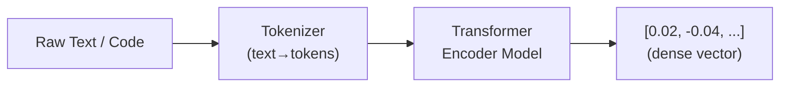
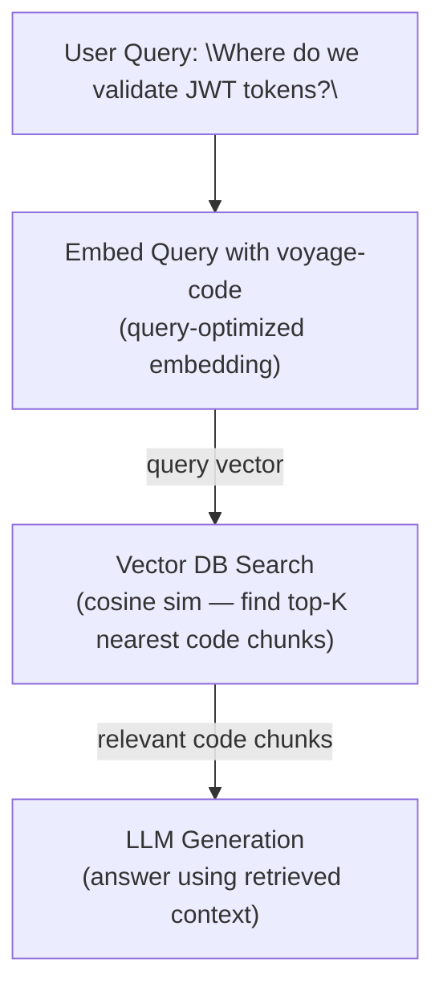

# Text & Code Embeddings for RAG

## Table of Contents

- [Introduction](#introduction)
- [How Embeddings Work](#how-embeddings-work)
- [OpenAI Embeddings API](#openai-embeddings-api)
- [Voyage AI Embeddings](#voyage-ai-embeddings)
- [Google Embeddings](#google-embeddings)
- [Cohere Embeddings](#cohere-embeddings)
- [Similarity Metrics](#similarity-metrics)
- [Vector Databases for Code](#vector-databases-for-code)
- [How Coding Agents Use Embeddings](#how-coding-agents-use-embeddings)
- [Code Examples](#code-examples)
- [Best Practices for Code Embeddings](#best-practices-for-code-embeddings)
- [Cost Optimization Strategies](#cost-optimization-strategies)

---

## Introduction

Embeddings are dense numerical vector representations of text, code, or other data that capture
semantic meaning in a high-dimensional space. They are the backbone of modern retrieval systems,
enabling machines to understand *what code does* rather than just matching keywords.

### Why Embeddings Matter for Coding Agents

Traditional code search relies on lexical matching — grep, regex, symbol search. These approaches
fail when a developer asks "find where we handle authentication errors" and the codebase uses
`catch (AuthFailure e)` or `if (!token.isValid())`. Embeddings bridge this gap:

- **Semantic code search**: Find functionally related code regardless of naming conventions
- **Repository-scale retrieval**: Index entire codebases and retrieve the most relevant context for
  an LLM prompt, essential for RAG (Retrieval-Augmented Generation)
- **Cross-language understanding**: Embeddings can map Python and TypeScript implementations of the
  same algorithm to nearby points in vector space
- **Context window optimization**: Instead of stuffing entire files into a prompt, retrieve only the
  semantically relevant chunks — saving tokens and improving LLM output quality
- **Documentation linking**: Connect natural language questions to the right code, docs, or examples

Without embeddings, coding agents are limited to static analysis and keyword search. With them,
agents gain a form of "understanding" that makes retrieval-augmented code generation dramatically
more effective.

---

## How Embeddings Work

### Dense Vector Representations

An embedding model transforms input text (or code) into a fixed-length vector of floating-point
numbers. Each dimension captures some learned aspect of meaning:

```
"authentication middleware" → [0.023, -0.041, 0.087, ..., 0.012]  # 1536 dimensions
"auth guard function"      → [0.025, -0.038, 0.091, ..., 0.009]  # nearby in vector space
"database migration"       → [-0.071, 0.052, -0.013, ..., 0.067] # far away in vector space
```

The key insight: **semantically similar inputs produce geometrically close vectors**. This is
learned during training on massive corpora of text and code.

### The Embedding Process



1. **Tokenization**: Input is split into sub-word tokens (BPE, SentencePiece, etc.)
2. **Encoding**: Tokens pass through transformer encoder layers that build contextual representations
3. **Pooling**: Token-level representations are aggregated (mean pooling, CLS token, etc.) into a
   single fixed-size vector
4. **Normalization**: The output vector is typically L2-normalized to unit length for cosine
   similarity comparisons

### Semantic Similarity

Once text is embedded, similarity between two pieces of content is computed as the geometric
distance (or angle) between their vectors:

```
sim("sort an array", "arrange elements in order")    ≈ 0.92  (high similarity)
sim("sort an array", "connect to database")           ≈ 0.15  (low similarity)
sim("async function fetchUser", "await getUser()")    ≈ 0.85  (semantically related code)
```

This property makes embeddings ideal for retrieval: given a user query, embed it, then find the
closest stored vectors in your index.

---

## OpenAI Embeddings API

OpenAI provides the most widely-used commercial embeddings API with strong general-purpose and
code understanding capabilities.

### Endpoint

```
POST https://api.openai.com/v1/embeddings
```

### Available Models

| Model | Dimensions | Max Tokens | Performance | Use Case |
|-------|-----------|------------|-------------|----------|
| `text-embedding-3-small` | 1536 (default) | 8191 | Good | Cost-effective general use |
| `text-embedding-3-large` | 3072 (default) | 8191 | Best | High-accuracy retrieval |
| `text-embedding-ada-002` | 1536 (fixed) | 8191 | Legacy | Backward compatibility only |

The `text-embedding-3-*` models support **Matryoshka embeddings** (explained below), allowing you
to reduce dimensionality without re-training.

### Request Format

```json
{
  "model": "text-embedding-3-small",
  "input": "function authenticateUser(token: string): Promise<User>",
  "encoding_format": "float",
  "dimensions": 1536
}
```

**Parameters:**

| Parameter | Type | Required | Description |
|-----------|------|----------|-------------|
| `model` | string | Yes | Model ID to use |
| `input` | string or string[] | Yes | Text(s) to embed. Max 2048 items in array. |
| `encoding_format` | string | No | `"float"` (default) or `"base64"` for compact transfer |
| `dimensions` | integer | No | Truncate output to this many dimensions (v3 models only) |

**Batch embedding** (multiple inputs in one request):

```json
{
  "model": "text-embedding-3-small",
  "input": [
    "def authenticate(user, password):",
    "async function login(credentials) {",
    "public boolean verifyToken(String jwt) {"
  ]
}
```

### Response Format

```json
{
  "object": "list",
  "data": [
    {
      "object": "embedding",
      "embedding": [0.0023064255, -0.009327292, 0.015797086, ...],
      "index": 0
    }
  ],
  "model": "text-embedding-3-small",
  "usage": {
    "prompt_tokens": 12,
    "total_tokens": 12
  }
}
```

Each item in the `data` array contains:
- `embedding`: Array of floats representing the dense vector
- `index`: Position corresponding to the input array index

### Dimension Reduction & Matryoshka Embeddings

The `text-embedding-3-*` models are trained with **Matryoshka Representation Learning (MRL)**.
Named after Russian nesting dolls, this technique ensures that the first N dimensions of the
embedding carry the most important semantic information. You can truncate the vector to fewer
dimensions with minimal quality loss:

```json
{
  "model": "text-embedding-3-large",
  "input": "implement binary search tree",
  "dimensions": 256
}
```

**Performance vs. dimensions (MTEB benchmark, approximate):**

| Model | Full Dims | 1024 Dims | 512 Dims | 256 Dims |
|-------|-----------|-----------|----------|----------|
| `text-embedding-3-large` | 64.6% | 64.1% | 63.4% | 62.0% |
| `text-embedding-3-small` | 62.3% | 61.6% | 61.0% | 59.9% |

This allows trading accuracy for storage/speed — a 256-dim vector uses 12x less storage and
enables faster similarity search than a 3072-dim vector.

### Pricing

| Model | Price per 1M Tokens |
|-------|-------------------|
| `text-embedding-3-small` | ~$0.02 |
| `text-embedding-3-large` | ~$0.13 |
| `text-embedding-ada-002` | ~$0.10 |

For a typical codebase of 100K lines of code (~2M tokens), embedding with `text-embedding-3-small`
costs roughly $0.04.

---

## Voyage AI Embeddings

Voyage AI has become a preferred embedding provider for coding tools due to their models
specifically optimized for source code understanding.

### Models

| Model | Dimensions | Max Tokens | Specialization |
|-------|-----------|------------|----------------|
| `voyage-code-3` | 1024 | 16000 | Code retrieval & understanding |
| `voyage-3-large` | 1024 | 32000 | General-purpose, highest quality |
| `voyage-3-lite` | 512 | 32000 | Lightweight, fast |

### voyage-code-3: Purpose-Built for Code

`voyage-code-3` is specifically trained on code-related data spanning multiple programming
languages. It excels at:

- Mapping natural language queries to relevant code snippets
- Understanding cross-language semantics (the same algorithm in Python and Rust map to similar vectors)
- Capturing structural patterns (class hierarchies, function signatures, control flow)
- Handling mixed code-and-comment content

Voyage reports that `voyage-code-3` outperforms OpenAI's `text-embedding-3-large` on code retrieval
benchmarks by a significant margin while using only 1024 dimensions.

### How Voyage Optimizes for Code

Voyage AI's code models are trained with several code-specific techniques:

1. **Code-aware tokenization**: Better handling of identifiers, operators, and syntax
2. **Multi-language training**: Balanced training across Python, JavaScript/TypeScript, Java, Go,
   Rust, C/C++, and more
3. **Query-document asymmetry**: Trained to map natural language questions to code implementations
4. **Large context windows**: 16K tokens for code-3 handles entire files without chunking

### API Format and Usage

**Endpoint:**
```
POST https://api.voyageai.com/v1/embeddings
```

**Request:**
```json
{
  "model": "voyage-code-3",
  "input": [
    "How do I implement retry logic with exponential backoff?",
    "async function retryWithBackoff(fn, maxRetries = 3) {\n  for (let i = 0; i < maxRetries; i++) {\n    try { return await fn(); }\n    catch (e) { await sleep(Math.pow(2, i) * 1000); }\n  }\n}"
  ],
  "input_type": "document"
}
```

**Parameters:**

| Parameter | Type | Description |
|-----------|------|-------------|
| `model` | string | Model ID |
| `input` | string or string[] | Text(s) to embed (max 128 items) |
| `input_type` | string | `"query"` for search queries, `"document"` for content to be searched |
| `truncation` | boolean | Whether to truncate long inputs (default: true) |

The `input_type` parameter is important — it tells the model whether the input is a search query
or a document being indexed, enabling asymmetric retrieval optimization.

**Response:**
```json
{
  "object": "list",
  "data": [
    { "object": "embedding", "embedding": [0.014, -0.032, ...], "index": 0 },
    { "object": "embedding", "embedding": [0.018, -0.029, ...], "index": 1 }
  ],
  "model": "voyage-code-3",
  "usage": { "total_tokens": 84 }
}
```

---

## Google Embeddings

### text-embedding-004

Google's latest embedding model available through both the Gemini API and Vertex AI.

| Property | Value |
|----------|-------|
| Model ID | `text-embedding-004` |
| Dimensions | 768 (default), configurable up to 768 |
| Max Tokens | 2048 |

### Vertex AI Embeddings API

**Endpoint:**
```
POST https://{REGION}-aiplatform.googleapis.com/v1/projects/{PROJECT}/locations/{REGION}/publishers/google/models/text-embedding-004:predict
```

**Request:**
```json
{
  "instances": [
    {
      "content": "function parseJSON(input: string): object { ... }",
      "task_type": "RETRIEVAL_DOCUMENT",
      "title": "JSON parser utility"
    }
  ],
  "parameters": {
    "outputDimensionality": 256
  }
}
```

### Task Type Parameter

A distinguishing feature of Google's embeddings API is the `task_type` parameter, which optimizes
the embedding for its intended use:

| Task Type | Description | Use Case |
|-----------|-------------|----------|
| `RETRIEVAL_QUERY` | Optimized for search queries | User questions about code |
| `RETRIEVAL_DOCUMENT` | Optimized for documents to be retrieved | Code chunks in index |
| `SEMANTIC_SIMILARITY` | Optimized for pairwise similarity | Duplicate detection |
| `CLASSIFICATION` | Optimized for classification inputs | Code categorization |
| `CLUSTERING` | Optimized for clustering | Grouping similar code |
| `QUESTION_ANSWERING` | Optimized for Q&A | Answering code questions |
| `FACT_VERIFICATION` | Optimized for fact-checking | Verifying code claims |

**Response:**
```json
{
  "predictions": [
    {
      "embeddings": {
        "values": [0.0123, -0.0456, ...],
        "statistics": {
          "token_count": 15,
          "truncated": false
        }
      }
    }
  ]
}
```

---

## Cohere Embeddings

Cohere offers strong multilingual embedding models with an explicit `input_type` system.

### Models

| Model | Dimensions | Max Tokens | Specialization |
|-------|-----------|------------|----------------|
| `embed-english-v3.0` | 1024 | 512 | English text, highest quality |
| `embed-multilingual-v3.0` | 1024 | 512 | 100+ languages |
| `embed-english-light-v3.0` | 384 | 512 | Lightweight English |
| `embed-multilingual-light-v3.0` | 384 | 512 | Lightweight multilingual |

### API Usage

**Endpoint:**
```
POST https://api.cohere.ai/v1/embed
```

**Request:**
```json
{
  "model": "embed-english-v3.0",
  "texts": [
    "implement a least recently used cache",
    "class LRUCache:\n    def __init__(self, capacity):\n        self.cache = OrderedDict()\n        self.capacity = capacity"
  ],
  "input_type": "search_document",
  "truncate": "END"
}
```

### input_type Parameter

| Input Type | Description |
|------------|-------------|
| `search_document` | Documents/code to be indexed and searched |
| `search_query` | Search queries from users |
| `classification` | Text to be classified |
| `clustering` | Text to be clustered |

Like Voyage and Google, the `input_type` parameter enables asymmetric search — queries and
documents are embedded differently for optimal retrieval performance.

---

## Similarity Metrics

Once you have embedding vectors, you need a metric to compare them. The choice of metric affects
both retrieval quality and performance.

### Cosine Similarity

The most commonly used metric for text/code embeddings. Measures the angle between two vectors,
ignoring magnitude:

```
cosine_sim(A, B) = (A · B) / (||A|| × ||B||)
```

**Range**: [-1, 1] where 1 = identical direction, 0 = orthogonal, -1 = opposite

```python
import numpy as np

def cosine_similarity(a: list[float], b: list[float]) -> float:
    a, b = np.array(a), np.array(b)
    return np.dot(a, b) / (np.linalg.norm(a) * np.linalg.norm(b))
```

**When to use**: Most embedding models are trained with cosine similarity as the objective. Use
this as your default choice. It is invariant to vector magnitude, which means documents of
different lengths are compared fairly.

### Dot Product

The un-normalized inner product of two vectors:

```
dot_product(A, B) = Σ(Aᵢ × Bᵢ)
```

**Range**: (-∞, +∞)

**When to use**: When vectors are already L2-normalized (as most API embeddings are), dot product
equals cosine similarity and is faster to compute. Many vector databases use dot product internally
for this reason. Also useful when you want vector magnitude to influence results (e.g., longer
documents scoring higher).

### Euclidean Distance (L2)

The straight-line distance between two points in vector space:

```
euclidean(A, B) = √(Σ(Aᵢ - Bᵢ)²)
```

**Range**: [0, +∞) where 0 = identical

**When to use**: Less common for text embeddings but useful when absolute position in vector space
matters. In high-dimensional spaces, Euclidean distances tend to converge (the "curse of
dimensionality"), making it less discriminative than cosine similarity.

### Comparison Table

| Metric | Normalized? | Speed | Best For |
|--------|-------------|-------|----------|
| Cosine Similarity | Yes | Medium | Default for text/code embeddings |
| Dot Product | No (unless normalized) | Fast | Pre-normalized vectors, performance-critical |
| Euclidean Distance | No | Medium | When magnitude matters |

> **Rule of thumb**: If the embedding API returns normalized vectors (OpenAI, Voyage, Cohere all
> do), use dot product for speed. The results will be identical to cosine similarity.

---

## Vector Databases for Code

Storing and querying millions of embedding vectors efficiently requires specialized vector
databases.

### Popular Options

| Database | Type | Indexing | Highlights |
|----------|------|---------|------------|
| **Pinecone** | Managed cloud | Proprietary | Serverless option, metadata filtering, easy scaling |
| **Weaviate** | Self-hosted / cloud | HNSW | GraphQL API, hybrid search built-in, modules |
| **Qdrant** | Self-hosted / cloud | HNSW | Rust-based, fast, rich filtering, payload storage |
| **Chroma** | Embedded / self-hosted | HNSW | Python-native, great for prototyping, lightweight |
| **pgvector** | PostgreSQL extension | IVFFlat, HNSW | Use your existing Postgres, SQL interface |
| **Milvus** | Self-hosted / cloud (Zilliz) | IVF, HNSW, DiskANN | Massive scale, GPU acceleration |

### Indexing Strategies

#### HNSW (Hierarchical Navigable Small World)

The most popular index type for embedding search. Builds a multi-layer proximity graph:

- **How it works**: Creates a hierarchy of graphs where upper layers have fewer, more spread-out
  nodes. Search starts at the top layer and navigates down to find nearest neighbors.
- **Pros**: Excellent recall (>95%), fast queries, no training needed
- **Cons**: High memory usage (stores full vectors + graph), slower inserts
- **Parameters**: `M` (connections per node), `efConstruction` (build-time quality),
  `efSearch` (query-time quality vs speed)

```python
# Qdrant HNSW configuration example
from qdrant_client.models import VectorParams, HnswConfigDiff

collection_config = VectorParams(
    size=1024,  # voyage-code-3 dimensions
    distance="Cosine",
    hnsw_config=HnswConfigDiff(
        m=16,                # connections per node (default: 16)
        ef_construct=100,    # build quality (default: 100)
    )
)
```

#### IVF (Inverted File Index)

Partitions vectors into clusters, then searches only nearby clusters:

- **How it works**: K-means clustering creates `nlist` partitions. At query time, `nprobe`
  nearest partitions are searched.
- **Pros**: Lower memory than HNSW, good for very large datasets
- **Cons**: Requires training on representative data, lower recall than HNSW
- **Parameters**: `nlist` (number of partitions), `nprobe` (partitions to search)

```sql
-- pgvector IVFFlat index
CREATE INDEX ON code_embeddings
USING ivfflat (embedding vector_cosine_ops)
WITH (lists = 100);
```

### Metadata Filtering

Vector databases support filtering results by metadata, essential for code search:

```python
# Qdrant: search only Python files in the auth module
results = client.search(
    collection_name="codebase",
    query_vector=query_embedding,
    query_filter={
        "must": [
            {"key": "language", "match": {"value": "python"}},
            {"key": "file_path", "match": {"text": "auth/"}}
        ]
    },
    limit=10
)
```

```javascript
// Pinecone: search with metadata filter
const results = await index.query({
  vector: queryEmbedding,
  topK: 10,
  filter: {
    language: { $eq: "typescript" },
    last_modified: { $gte: "2024-01-01" }
  },
  includeMetadata: true
});
```

Common metadata fields for code embeddings:
- `file_path`: Full path to the source file
- `language`: Programming language
- `chunk_type`: `"function"`, `"class"`, `"module"`, `"comment"`
- `symbol_name`: Function/class name
- `repo`: Repository identifier
- `branch`: Git branch
- `last_modified`: Timestamp for freshness filtering

---

## How Coding Agents Use Embeddings

### Code Search / Semantic Code Retrieval

The core workflow for RAG in coding agents:



### Repository Indexing Strategies

**Full repository indexing** involves:

1. **Walk the file tree**: Skip binary files, `node_modules`, `.git`, build artifacts
2. **Chunk each file**: Split into semantically meaningful pieces (see below)
3. **Embed all chunks**: Batch API calls for efficiency
4. **Store in vector DB**: With rich metadata (path, language, symbols, etc.)
5. **Keep index fresh**: Re-embed changed files on git commits or file saves

### Chunking Code Files

How you split code into chunks dramatically affects retrieval quality:

#### By Function/Method

The most effective approach for most codebases. Each function becomes one chunk:

```python
# Chunk 1: standalone function
def validate_token(token: str) -> bool:
    """Validate a JWT token and return True if valid."""
    try:
        payload = jwt.decode(token, SECRET_KEY, algorithms=["HS256"])
        return payload["exp"] > time.time()
    except jwt.InvalidTokenError:
        return False
```

**Pros**: Natural semantic boundaries, good for function-level retrieval
**Cons**: Misses module-level context, class-level relationships

#### By File

Embed entire files as single chunks (works for smaller files):

**Pros**: Preserves full context, imports, and relationships
**Cons**: May exceed token limits, dilutes relevance for specific queries

#### By Semantic Blocks

Use AST (Abstract Syntax Tree) parsing to create intelligent chunks:

```python
import ast

def chunk_python_file(source: str) -> list[dict]:
    tree = ast.parse(source)
    chunks = []

    for node in ast.walk(tree):
        if isinstance(node, (ast.FunctionDef, ast.AsyncFunctionDef, ast.ClassDef)):
            chunk_text = ast.get_source_segment(source, node)
            chunks.append({
                "text": chunk_text,
                "type": type(node).__name__,
                "name": node.name,
                "line_start": node.lineno,
                "line_end": node.end_lineno,
            })

    return chunks
```

#### Sliding Window with Overlap

For files that don't have clear structural boundaries (configs, data files):

```python
def sliding_window_chunks(text: str, chunk_size: int = 500, overlap: int = 100) -> list[str]:
    lines = text.split('\n')
    chunks = []
    start = 0
    while start < len(lines):
        end = min(start + chunk_size, len(lines))
        chunks.append('\n'.join(lines[start:end]))
        start += chunk_size - overlap
    return chunks
```

### Query-Time Embedding

When a user asks a question, the agent:

1. Embeds the query using the same model (with `input_type: "query"` if supported)
2. Searches the vector DB for top-K similar chunks
3. Optionally re-ranks results using a cross-encoder or LLM
4. Injects the retrieved chunks into the LLM prompt as context

### Hybrid Search (Embeddings + Keyword/BM25)

Pure semantic search can miss exact matches (e.g., specific function names, error codes). Hybrid
search combines embeddings with traditional keyword search:

```
Final Score = α × semantic_score + (1 - α) × bm25_score
```

Where `α` is typically 0.5–0.7 (favoring semantic search).

**Implementation with Weaviate:**

```graphql
{
  Get {
    CodeChunk(
      hybrid: {
        query: "retry with exponential backoff"
        alpha: 0.6
      }
      limit: 10
    ) {
      content
      filePath
      language
    }
  }
}
```

### How Real Coding Tools Implement This

#### Cody by Sourcegraph

Sourcegraph's Cody uses a sophisticated multi-stage retrieval pipeline:

- **Repository-level indexing**: Indexes entire repositories using embeddings
- **Multi-signal retrieval**: Combines embedding search with Sourcegraph's code intelligence
  (references, definitions, call graphs)
- **Keyword + semantic fusion**: Hybrid search using both BM25 and embeddings
- **Context ranking**: A learned ranker selects the most relevant chunks for the LLM context
- Uses a combination of local and remote embeddings depending on repository size

#### Cursor

Cursor's codebase indexing approach:

- **Local indexing**: Embeds the entire open project on the user's machine
- **Incremental updates**: Re-embeds only changed files on save
- **Smart chunking**: Uses language-aware parsing (tree-sitter) for structural chunking
- **Codebase-wide search**: "Codebase" mode in chat queries the full index
- Combines embedding results with recently edited files and open tabs for context

#### Continue.dev

Continue.dev's open-source approach to embeddings:

- **Configurable providers**: Supports OpenAI, Voyage, Ollama (local), and other embedding backends
- **@codebase context provider**: Indexes the workspace and retrieves relevant chunks
- **Chunking strategy**: Uses a combination of file-level and function-level chunking
- **Local-first option**: Can run entirely locally using Ollama with models like `nomic-embed-text`
- **Reranking**: Optional reranking step using Voyage or Cohere rerankers

---

## Code Examples

### Python: Full Embedding Pipeline with OpenAI

```python
import openai
import numpy as np
from pathlib import Path

client = openai.OpenAI()

def embed_texts(texts: list[str], model: str = "text-embedding-3-small") -> list[list[float]]:
    """Embed a batch of texts using OpenAI's API."""
    response = client.embeddings.create(
        model=model,
        input=texts,
        encoding_format="float"
    )
    # Sort by index to maintain order
    sorted_data = sorted(response.data, key=lambda x: x.index)
    return [item.embedding for item in sorted_data]

def cosine_similarity(a: list[float], b: list[float]) -> float:
    a_arr, b_arr = np.array(a), np.array(b)
    return float(np.dot(a_arr, b_arr) / (np.linalg.norm(a_arr) * np.linalg.norm(b_arr)))

def search_codebase(
    query: str,
    code_chunks: list[dict],  # [{"text": ..., "file": ..., "embedding": [...]}]
    top_k: int = 5
) -> list[dict]:
    """Search embedded code chunks for the most relevant matches."""
    query_embedding = embed_texts([query])[0]

    results = []
    for chunk in code_chunks:
        score = cosine_similarity(query_embedding, chunk["embedding"])
        results.append({**chunk, "score": score})

    results.sort(key=lambda x: x["score"], reverse=True)
    return results[:top_k]

# --- Usage ---
# Step 1: Index code files
code_files = list(Path("src").rglob("*.py"))
chunks = []
for f in code_files:
    content = f.read_text()
    chunks.append({"text": content, "file": str(f)})

# Step 2: Embed all chunks (batch for efficiency)
batch_size = 100
for i in range(0, len(chunks), batch_size):
    batch = chunks[i:i + batch_size]
    embeddings = embed_texts([c["text"] for c in batch])
    for chunk, emb in zip(batch, embeddings):
        chunk["embedding"] = emb

# Step 3: Search
results = search_codebase("how do we handle rate limiting?", chunks)
for r in results:
    print(f"{r['file']} (score: {r['score']:.3f})")
    print(r["text"][:200])
    print("---")
```

### Python: Voyage AI Code Embeddings

```python
import voyageai

client = voyageai.Client()  # uses VOYAGE_API_KEY env var

# Embed code documents
code_snippets = [
    "def retry(fn, max_attempts=3):\n    for i in range(max_attempts):\n        try:\n            return fn()\n        except Exception:\n            time.sleep(2 ** i)",
    "class RateLimiter:\n    def __init__(self, max_requests, window_seconds):\n        self.max_requests = max_requests\n        self.window = window_seconds",
]

doc_result = client.embed(
    texts=code_snippets,
    model="voyage-code-3",
    input_type="document"
)

# Embed a search query
query_result = client.embed(
    texts=["how to implement retry with backoff"],
    model="voyage-code-3",
    input_type="query"
)

# Compare
query_vec = np.array(query_result.embeddings[0])
for i, doc_vec in enumerate(doc_result.embeddings):
    sim = np.dot(query_vec, np.array(doc_vec))  # vectors are normalized
    print(f"Snippet {i}: similarity = {sim:.4f}")
```

### TypeScript: OpenAI Embeddings with Qdrant

```typescript
import OpenAI from "openai";
import { QdrantClient } from "@qdrant/js-client-rest";

const openai = new OpenAI();
const qdrant = new QdrantClient({ url: "http://localhost:6333" });

const COLLECTION = "codebase";
const EMBEDDING_MODEL = "text-embedding-3-small";
const DIMENSIONS = 1536;

// Create collection
async function initCollection(): Promise<void> {
  await qdrant.createCollection(COLLECTION, {
    vectors: {
      size: DIMENSIONS,
      distance: "Cosine",
    },
  });
}

// Embed text using OpenAI
async function embed(texts: string[]): Promise<number[][]> {
  const response = await openai.embeddings.create({
    model: EMBEDDING_MODEL,
    input: texts,
  });
  return response.data
    .sort((a, b) => a.index - b.index)
    .map((d) => d.embedding);
}

// Index code chunks
interface CodeChunk {
  id: string;
  content: string;
  filePath: string;
  language: string;
  symbolName?: string;
}

async function indexChunks(chunks: CodeChunk[]): Promise<void> {
  const batchSize = 100;

  for (let i = 0; i < chunks.length; i += batchSize) {
    const batch = chunks.slice(i, i + batchSize);
    const embeddings = await embed(batch.map((c) => c.content));

    await qdrant.upsert(COLLECTION, {
      points: batch.map((chunk, idx) => ({
        id: chunk.id,
        vector: embeddings[idx],
        payload: {
          content: chunk.content,
          file_path: chunk.filePath,
          language: chunk.language,
          symbol_name: chunk.symbolName ?? null,
        },
      })),
    });
  }
}

// Semantic search
async function searchCode(
  query: string,
  filters?: { language?: string; pathPrefix?: string },
  topK: number = 10
): Promise<Array<{ content: string; filePath: string; score: number }>> {
  const [queryEmbedding] = await embed([query]);

  const mustConditions: any[] = [];
  if (filters?.language) {
    mustConditions.push({
      key: "language",
      match: { value: filters.language },
    });
  }
  if (filters?.pathPrefix) {
    mustConditions.push({
      key: "file_path",
      match: { text: filters.pathPrefix },
    });
  }

  const results = await qdrant.search(COLLECTION, {
    vector: queryEmbedding,
    limit: topK,
    filter: mustConditions.length > 0 ? { must: mustConditions } : undefined,
    with_payload: true,
  });

  return results.map((r) => ({
    content: r.payload!.content as string,
    filePath: r.payload!.file_path as string,
    score: r.score,
  }));
}

// --- Usage ---
async function main() {
  await initCollection();

  // Index some code
  await indexChunks([
    {
      id: "auth-validate-1",
      content: `export async function validateJWT(token: string): Promise<User | null> {
  try {
    const payload = jwt.verify(token, process.env.JWT_SECRET!);
    return await User.findById(payload.sub);
  } catch {
    return null;
  }
}`,
      filePath: "src/auth/jwt.ts",
      language: "typescript",
      symbolName: "validateJWT",
    },
  ]);

  // Search
  const results = await searchCode("token validation", {
    language: "typescript",
  });
  console.log(results);
}
```

### TypeScript: Hybrid Search with BM25

```typescript
import Fuse from "fuse.js";

interface SearchResult {
  content: string;
  filePath: string;
  semanticScore: number;
  keywordScore: number;
  hybridScore: number;
}

async function hybridSearch(
  query: string,
  chunks: CodeChunk[],
  alpha: number = 0.6 // weight for semantic search
): Promise<SearchResult[]> {
  // Semantic search
  const [queryVec] = await embed([query]);
  const semanticResults = await qdrant.search(COLLECTION, {
    vector: queryVec,
    limit: 50,
    with_payload: true,
  });

  // Keyword search (BM25-like via Fuse.js)
  const fuse = new Fuse(chunks, {
    keys: ["content", "symbolName"],
    includeScore: true,
    threshold: 0.6,
  });
  const keywordResults = fuse.search(query);

  // Merge scores
  const scoreMap = new Map<string, SearchResult>();

  for (const r of semanticResults) {
    const filePath = r.payload!.file_path as string;
    scoreMap.set(filePath, {
      content: r.payload!.content as string,
      filePath,
      semanticScore: r.score,
      keywordScore: 0,
      hybridScore: alpha * r.score,
    });
  }

  for (const r of keywordResults) {
    const filePath = r.item.filePath;
    const kwScore = 1 - (r.score ?? 1);
    const existing = scoreMap.get(filePath);
    if (existing) {
      existing.keywordScore = kwScore;
      existing.hybridScore = alpha * existing.semanticScore + (1 - alpha) * kwScore;
    } else {
      scoreMap.set(filePath, {
        content: r.item.content,
        filePath,
        semanticScore: 0,
        keywordScore: kwScore,
        hybridScore: (1 - alpha) * kwScore,
      });
    }
  }

  return [...scoreMap.values()].sort((a, b) => b.hybridScore - a.hybridScore);
}
```

---

## Best Practices for Code Embeddings

### 1. Choose the Right Model for Code

- **Best quality for code**: `voyage-code-3` (purpose-built for code retrieval)
- **Best general-purpose**: `text-embedding-3-large` (strong all-around)
- **Best budget option**: `text-embedding-3-small` with reduced dimensions
- **Best for local/private**: `nomic-embed-text` via Ollama (no data leaves your machine)

### 2. Use Asymmetric Embedding When Available

Always specify `input_type` (Voyage, Cohere) or `task_type` (Google) to differentiate queries
from documents. This can improve retrieval accuracy by 5-15%.

### 3. Chunk Code Intelligently

- Use **AST-based chunking** (tree-sitter, Python `ast`) for structured languages
- Include **surrounding context**: imports, class name, docstrings
- Prepend metadata to chunks: `"File: src/auth/jwt.ts\nFunction: validateJWT\n\n" + code`
- Keep chunks between **100-500 tokens** for optimal retrieval granularity
- Overlap chunks slightly if using sliding window

### 4. Enrich Chunks with Metadata

Store rich metadata alongside embeddings for filtering and context:

```python
chunk = {
    "text": function_code,
    "metadata": {
        "file_path": "src/auth/jwt.ts",
        "language": "typescript",
        "symbol_name": "validateJWT",
        "symbol_type": "function",
        "imports": ["jsonwebtoken", "../models/User"],
        "exported": True,
        "line_range": [15, 24],
        "git_last_modified": "2024-11-15T10:30:00Z",
    }
}
```

### 5. Implement Incremental Indexing

Don't re-embed the entire codebase on every change:

```python
def should_reindex(file_path: str, last_indexed: dict[str, str]) -> bool:
    current_hash = hashlib.sha256(Path(file_path).read_bytes()).hexdigest()
    return last_indexed.get(file_path) != current_hash
```

### 6. Use Hybrid Search

Combine semantic search with keyword search (BM25) for best results. Pure semantic search
struggles with:
- Exact identifier matches (`getUserById`)
- Error codes and constants (`ERR_CONNECTION_REFUSED`)
- File paths and URLs

### 7. Rerank Results

Use a cross-encoder reranker (Cohere Rerank, Voyage Rerank) on top-K results to improve precision
before passing to the LLM:

```python
import cohere

co = cohere.Client()

reranked = co.rerank(
    model="rerank-english-v3.0",
    query="JWT token validation",
    documents=[r["text"] for r in initial_results],
    top_n=5
)
```

---

## Cost Optimization Strategies

### 1. Dimension Reduction

Use the `dimensions` parameter (OpenAI v3 models) to reduce storage and compute costs:

| Dimensions | Storage per Vector | Quality Loss | Speedup |
|------------|-------------------|--------------|---------|
| 3072 (full) | 12 KB | None | 1x |
| 1536 | 6 KB | ~0.5% | ~2x |
| 512 | 2 KB | ~2% | ~6x |
| 256 | 1 KB | ~4% | ~12x |

For most code search applications, **512 or 1024 dimensions** offer an excellent quality/cost
trade-off.

### 2. Batch API Calls

Always batch embedding requests to minimize HTTP overhead and maximize throughput:

```python
# BAD: one API call per chunk
for chunk in chunks:
    embedding = embed([chunk["text"]])  # N API calls

# GOOD: batch chunks into single calls
for i in range(0, len(chunks), 100):
    batch = chunks[i:i + 100]
    embeddings = embed([c["text"] for c in batch])  # N/100 API calls
```

### 3. Cache Embeddings Aggressively

Content-addressable caching avoids re-embedding unchanged content:

```python
import hashlib
import json
from pathlib import Path

CACHE_DIR = Path(".embedding_cache")
CACHE_DIR.mkdir(exist_ok=True)

def get_or_compute_embedding(text: str, model: str) -> list[float]:
    cache_key = hashlib.sha256(f"{model}:{text}".encode()).hexdigest()
    cache_path = CACHE_DIR / f"{cache_key}.json"

    if cache_path.exists():
        return json.loads(cache_path.read_text())

    embedding = embed_texts([text], model=model)[0]
    cache_path.write_text(json.dumps(embedding))
    return embedding
```

### 4. Use Cheaper Models for Bulk Indexing

- Index with `text-embedding-3-small` ($0.02/1M tokens) for bulk code
- Use `text-embedding-3-large` or `voyage-code-3` only for queries or critical paths
- Consider local models (Ollama + `nomic-embed-text`) for development/testing

### 5. Smart Re-indexing

Only re-embed files that have actually changed:

```python
def incremental_index(repo_path: str, index_state: dict) -> list[dict]:
    changed_chunks = []
    for file_path in walk_code_files(repo_path):
        content = Path(file_path).read_text()
        content_hash = hashlib.sha256(content.encode()).hexdigest()

        if index_state.get(file_path) == content_hash:
            continue  # skip unchanged files

        chunks = chunk_file(file_path, content)
        changed_chunks.extend(chunks)
        index_state[file_path] = content_hash

    return changed_chunks
```

### 6. Token Budget Awareness

Monitor and control your embedding token usage:

```python
import tiktoken

encoder = tiktoken.encoding_for_model("text-embedding-3-small")

def estimate_cost(texts: list[str], price_per_million: float = 0.02) -> float:
    total_tokens = sum(len(encoder.encode(t)) for t in texts)
    return (total_tokens / 1_000_000) * price_per_million

# Before indexing a large codebase:
cost = estimate_cost([c["text"] for c in all_chunks])
print(f"Estimated embedding cost: ${cost:.4f}")
```

### 7. Quantization for Storage

Many vector databases support scalar or binary quantization to reduce storage:

```python
# Qdrant: enable scalar quantization
from qdrant_client.models import ScalarQuantizationConfig, ScalarType

qdrant.update_collection(
    collection_name="codebase",
    quantization_config=ScalarQuantizationConfig(
        type=ScalarType.INT8,
        quantile=0.99,
        always_ram=True  # keep quantized vectors in RAM for speed
    )
)
# Reduces memory usage by ~4x with minimal quality loss
```

---

## Summary

| Decision | Recommendation |
|----------|---------------|
| **Embedding model for code** | `voyage-code-3` (best quality) or `text-embedding-3-small` (best value) |
| **Dimensions** | 512–1024 for most use cases |
| **Similarity metric** | Cosine similarity (or dot product for normalized vectors) |
| **Vector database** | Qdrant or pgvector for self-hosted; Pinecone for managed |
| **Chunking strategy** | AST-based function-level with metadata enrichment |
| **Search approach** | Hybrid (semantic + BM25) with reranking |
| **Cost optimization** | Batch calls, cache embeddings, incremental indexing |

Embeddings transform raw code into a searchable semantic space, enabling coding agents to retrieve
precisely the right context for any task. The combination of high-quality code embeddings, efficient
vector storage, and hybrid search creates the foundation for effective RAG in software development
tools.