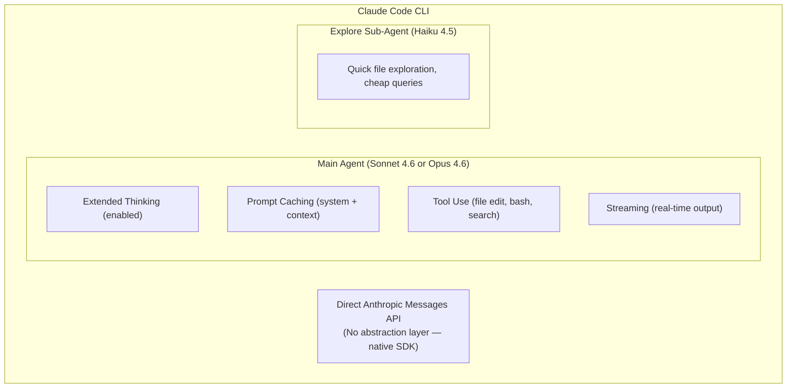

# Anthropic as a Model Provider for Coding Agents

## Overview

Anthropic's Claude models are the most popular choice among CLI coding agents. With
**14 out of 17 agents (82%)** in our study supporting Anthropic, Claude has become the
de facto standard for agentic coding. Anthropic's dominance stems from a combination
of frontier intelligence (particularly in coding), a 1M token context window, explicit
prompt caching, extended thinking capabilities, and the fact that Claude Code—the
most prominent CLI coding agent—is built by Anthropic itself.

Claude Opus 4.6 is widely considered the most capable model for building agents and
writing code as of mid-2025, while Claude Sonnet 4.6 offers the best balance of
speed and intelligence for interactive coding sessions.

---

## Model Lineup

### Claude Opus 4.6

The most intelligent Claude model, optimized for complex agentic tasks:

| Property | Value |
|----------|-------|
| **Model ID** | `claude-opus-4-6` |
| **Context Window** | 1,000,000 tokens |
| **Max Output** | 128,000 tokens |
| **Input Price** | $5.00 / MTok |
| **Output Price** | $25.00 / MTok |
| **Cache Write (5min)** | $6.25 / MTok |
| **Cache Write (1hr)** | $10.00 / MTok |
| **Cache Hit** | $0.50 / MTok (90% savings) |
| **Extended Thinking** | Yes |
| **Adaptive Thinking** | Yes |
| **Knowledge Cutoff** | May 2025 |

Key strengths for coding:
- Highest SWE-bench scores among Claude models
- 128K output tokens enables generating entire files
- Extended thinking for complex multi-step reasoning
- Excellent at understanding large codebases within context

### Claude Sonnet 4.6

The workhorse model for most coding agent interactions:

| Property | Value |
|----------|-------|
| **Model ID** | `claude-sonnet-4-6` |
| **Context Window** | 1,000,000 tokens |
| **Max Output** | 64,000 tokens |
| **Input Price** | $3.00 / MTok |
| **Output Price** | $15.00 / MTok |
| **Cache Write (5min)** | $3.75 / MTok |
| **Cache Write (1hr)** | $6.00 / MTok |
| **Cache Hit** | $0.30 / MTok (90% savings) |
| **Extended Thinking** | Yes |
| **Adaptive Thinking** | Yes |
| **Comparative Latency** | Fast |

Claude Sonnet 4.6 is the default model in Claude Code and the most commonly
configured Anthropic model across agents. It offers:
- Near-Opus intelligence at 60% of the cost
- Faster response times for interactive use
- Full 1M context at standard pricing (no premium for long context)
- Same tool use and extended thinking capabilities as Opus

### Claude Haiku 4.5

The fastest and cheapest Claude model:

| Property | Value |
|----------|-------|
| **Model ID** | `claude-haiku-4-5` |
| **Context Window** | 200,000 tokens |
| **Max Output** | 64,000 tokens |
| **Input Price** | $1.00 / MTok |
| **Output Price** | $5.00 / MTok |
| **Cache Hit** | $0.10 / MTok |
| **Comparative Latency** | Fastest |

Used by Claude Code for its "Explore" sub-agent (quick file exploration tasks)
and by other agents for cost-sensitive operations like classification, routing,
and simple code completions.

### Previous Generation Models

| Model | Input | Output | Context | Status |
|-------|-------|--------|---------|--------|
| Claude Sonnet 3.7 | $3.00 / MTok | $15.00 / MTok | 200K | Deprecated |
| Claude 3.5 Sonnet | $3.00 / MTok | $15.00 / MTok | 200K | Legacy |
| Claude Haiku 3.5 | $0.80 / MTok | $4.00 / MTok | 200K | Available |
| Claude Opus 3 | $15.00 / MTok | $75.00 / MTok | 200K | Deprecated |

---

## Messages API

Anthropic uses the Messages API, which differs from OpenAI's Chat Completions format
in several important ways.

### Basic Request

```python
import anthropic

client = anthropic.Anthropic()

response = client.messages.create(
    model="claude-sonnet-4-6",
    max_tokens=8192,
    system="You are an expert coding assistant. Edit files precisely.",
    messages=[
        {
            "role": "user",
            "content": "Fix the race condition in the connection pool"
        }
    ]
)

print(response.content[0].text)
```

### Key Differences from OpenAI

| Feature | OpenAI Chat Completions | Anthropic Messages |
|---------|------------------------|--------------------|
| **System prompt** | Message with role "system" | Top-level `system` parameter |
| **Content format** | String or array of parts | Always array of content blocks |
| **Tool results** | Role "tool" with tool_call_id | Role "user" with tool_result blocks |
| **Max output** | `max_tokens` (optional) | `max_tokens` (required) |
| **Streaming** | Server-Sent Events | Server-Sent Events (different event types) |
| **Stop reason** | `finish_reason` in choices | `stop_reason` at top level |

### Message Structure

```python
# Multi-turn conversation with tool use
messages = [
    # User asks a question
    {
        "role": "user",
        "content": "Read the config file and fix the database URL"
    },
    # Assistant responds with a tool call
    {
        "role": "assistant",
        "content": [
            {"type": "text", "text": "I'll read the config file first."},
            {
                "type": "tool_use",
                "id": "toolu_01ABC",
                "name": "read_file",
                "input": {"path": "config.yaml"}
            }
        ]
    },
    # Tool result comes back as a user message
    {
        "role": "user",
        "content": [
            {
                "type": "tool_result",
                "tool_use_id": "toolu_01ABC",
                "content": "database:\n  url: postgres://localhost:5432/mydb"
            }
        ]
    }
]
```

---

## Tool Use

Anthropic's tool use system is designed for agentic workflows:

```python
# Define tools
tools = [
    {
        "name": "execute_command",
        "description": "Run a shell command and return stdout/stderr",
        "input_schema": {
            "type": "object",
            "properties": {
                "command": {
                    "type": "string",
                    "description": "The shell command to execute"
                },
                "timeout": {
                    "type": "integer",
                    "description": "Timeout in seconds",
                    "default": 30
                }
            },
            "required": ["command"]
        }
    },
    {
        "name": "edit_file",
        "description": "Replace text in a file using search and replace",
        "input_schema": {
            "type": "object",
            "properties": {
                "path": {"type": "string"},
                "old_text": {"type": "string"},
                "new_text": {"type": "string"}
            },
            "required": ["path", "old_text", "new_text"]
        }
    }
]

# Make request with tools
response = client.messages.create(
    model="claude-sonnet-4-6",
    max_tokens=4096,
    system="You are a coding agent...",
    messages=messages,
    tools=tools,
    tool_choice={"type": "auto"}  # auto, any, tool (specific)
)
```

### Tool Choice Options

| Option | Behavior |
|--------|----------|
| `{"type": "auto"}` | Model decides whether to use tools |
| `{"type": "any"}` | Model must use at least one tool |
| `{"type": "tool", "name": "edit_file"}` | Model must use the specified tool |

### Processing Tool Calls

```python
def process_response(response, messages):
    """Process a Claude response, executing any tool calls."""
    # Check if the model wants to use tools
    if response.stop_reason == "tool_use":
        # Add assistant's response to history
        messages.append({"role": "assistant", "content": response.content})
        
        # Execute each tool call
        tool_results = []
        for block in response.content:
            if block.type == "tool_use":
                result = execute_tool(block.name, block.input)
                tool_results.append({
                    "type": "tool_result",
                    "tool_use_id": block.id,
                    "content": str(result)
                })
        
        # Send results back
        messages.append({"role": "user", "content": tool_results})
        
        # Continue the conversation
        return client.messages.create(
            model="claude-sonnet-4-6",
            max_tokens=4096,
            messages=messages,
            tools=tools
        )
    
    return response
```

### Tool Use Token Overhead

Anthropic charges extra tokens for the tool use system prompt:

| Model | Tool Choice auto/none | Tool Choice any/tool |
|-------|----------------------|---------------------|
| Claude 4.x family | 346 tokens | 313 tokens |
| Claude Haiku 3.5 | 264 tokens | 340 tokens |
| Claude 3 family | 530 tokens | 281 tokens |

---

## Extended Thinking

Extended thinking allows Claude to use a chain-of-thought process before responding,
dramatically improving performance on complex coding tasks:

```python
response = client.messages.create(
    model="claude-sonnet-4-6",
    max_tokens=16000,
    thinking={
        "type": "enabled",
        "budget_tokens": 10000  # Max tokens for thinking
    },
    messages=[{
        "role": "user",
        "content": "Design a lock-free concurrent queue in Rust"
    }]
)

# Response includes thinking blocks
for block in response.content:
    if block.type == "thinking":
        print(f"[Thinking]: {block.thinking[:200]}...")
    elif block.type == "text":
        print(f"[Response]: {block.text}")
```

### How Extended Thinking Works

1. Claude receives the prompt and begins an internal reasoning process
2. Thinking tokens are generated (visible in the response as `thinking` blocks)
3. After reasoning, Claude produces the final answer
4. Thinking tokens are billed at the **output token rate**

### Extended Thinking Pricing

| Model | Thinking Input | Thinking Output |
|-------|---------------|----------------|
| Claude Opus 4.6 | $5.00 / MTok | $25.00 / MTok |
| Claude Sonnet 4.6 | $3.00 / MTok | $15.00 / MTok |

**Budget control:**
```python
# Control thinking depth based on task complexity
thinking_config = {
    "simple_fix": {"type": "enabled", "budget_tokens": 2000},
    "complex_refactor": {"type": "enabled", "budget_tokens": 20000},
    "architecture": {"type": "enabled", "budget_tokens": 50000},
}
```

### Adaptive Thinking

Claude Opus 4.6 and Sonnet 4.6 support adaptive thinking, which dynamically adjusts
the thinking budget based on task complexity. The model uses less thinking for simple
tasks and more for complex ones, optimizing cost without sacrificing quality.

---

## Prompt Caching

Anthropic's prompt caching is one of its most important features for coding agents,
offering up to **90% cost savings** on cached input tokens.

### How Prompt Caching Works

```python
# First request — writes to cache
response = client.messages.create(
    model="claude-sonnet-4-6",
    max_tokens=4096,
    system=[
        {
            "type": "text",
            "text": LARGE_SYSTEM_PROMPT,  # 5000+ tokens
            "cache_control": {"type": "ephemeral"}  # Mark for caching
        }
    ],
    messages=[
        {
            "role": "user",
            "content": [
                {
                    "type": "text",
                    "text": large_codebase_context,  # 50K+ tokens
                    "cache_control": {"type": "ephemeral"}
                },
                {
                    "type": "text",
                    "text": "Fix the bug in the authentication module"
                }
            ]
        }
    ]
)

# Check cache usage in response
print(f"Cache write tokens: {response.usage.cache_creation_input_tokens}")
print(f"Cache read tokens: {response.usage.cache_read_input_tokens}")
print(f"Uncached input: {response.usage.input_tokens}")
```

### Cache Duration and Pricing

| Duration | Write Cost | Read Cost | Break-Even |
|----------|-----------|-----------|------------|
| 5 minutes | 1.25x base input | 0.1x base input | After 1 read |
| 1 hour | 2.0x base input | 0.1x base input | After 2 reads |

### Automatic Caching

For simpler use cases, automatic caching is available:

```python
response = client.messages.create(
    model="claude-sonnet-4-6",
    max_tokens=4096,
    cache_control={"type": "ephemeral"},  # Top-level automatic caching
    system="You are a coding assistant...",
    messages=[...]
)
```

With automatic caching, the system manages cache breakpoints as conversations grow,
without requiring explicit `cache_control` on individual content blocks.

### Prompt Caching Strategy for Coding Agents

```python
# Optimal message structure for maximum cache hits
def build_messages(system_prompt, codebase_context, conversation_history, new_message):
    """Structure messages to maximize prompt cache reuse."""
    return {
        "system": [
            {
                "type": "text",
                "text": system_prompt,  # ~3K tokens, changes rarely
                "cache_control": {"type": "ephemeral"}
            }
        ],
        "messages": [
            {
                "role": "user",
                "content": [
                    {
                        "type": "text",
                        "text": codebase_context,  # ~50K tokens, stable per session
                        "cache_control": {"type": "ephemeral"}
                    }
                ]
            },
            # Conversation history — cached prefix grows each turn
            *conversation_history,
            # New message — not cached until next turn
            {"role": "user", "content": new_message}
        ]
    }
```

### Cost Impact Example

For a typical coding agent session with 20 turns:

| Scenario | Total Input Cost |
|----------|-----------------|
| **Without caching** | 20 turns × 50K tokens × $3/MTok = $3.00 |
| **With caching** | 1 write + 19 reads: $0.19 + 19 × $0.015 = $0.48 |
| **Savings** | **84%** |

---

## Streaming

Anthropic uses Server-Sent Events for streaming, but with a different event structure
than OpenAI:

```python
# Streaming with tool use
with client.messages.stream(
    model="claude-sonnet-4-6",
    max_tokens=4096,
    messages=messages,
    tools=tools
) as stream:
    for event in stream:
        if event.type == "content_block_start":
            if event.content_block.type == "text":
                print("Text: ", end="")
            elif event.content_block.type == "tool_use":
                print(f"\nTool call: {event.content_block.name}")
        
        elif event.type == "content_block_delta":
            if event.delta.type == "text_delta":
                print(event.delta.text, end="", flush=True)
            elif event.delta.type == "input_json_delta":
                print(event.delta.partial_json, end="")
        
        elif event.type == "message_stop":
            print("\n[Done]")
```

### Streaming Event Types

| Event | Description |
|-------|-------------|
| `message_start` | Initial message metadata |
| `content_block_start` | Start of a text or tool_use block |
| `content_block_delta` | Incremental content (text_delta or input_json_delta) |
| `content_block_stop` | End of a content block |
| `message_delta` | Message-level updates (stop_reason, usage) |
| `message_stop` | Final event |

---

## 200K Context Window (and 1M Token Extension)

### Standard Context (200K)

All Claude models support at least 200K tokens of context. For coding agents, this
typically allows:

- ~500 files of average size in context
- Entire small-to-medium codebases
- Full conversation history for multi-turn sessions

### 1M Token Context

Claude Opus 4.6 and Sonnet 4.6 support 1M tokens at standard pricing. Earlier models
(Sonnet 4.5, Sonnet 4) can access 1M context with a beta header and premium pricing:

```python
# Sonnet 4.5/4 with 1M context (beta)
response = client.messages.create(
    model="claude-sonnet-4-5",
    max_tokens=8192,
    extra_headers={"anthropic-beta": "context-1m-2025-08-07"},
    messages=messages
)
```

### Long Context Pricing (Sonnet 4.5/4 only)

| Tokens | Input | Output |
|--------|-------|--------|
| ≤ 200K | $3.00 / MTok | $15.00 / MTok |
| > 200K | $6.00 / MTok | $22.50 / MTok |

Claude Opus 4.6 and Sonnet 4.6 do **not** have this premium—they use standard
pricing across the full 1M context window.

---

## Batch Processing

Anthropic's Batch API offers 50% off both input and output tokens:

```python
# Create a batch
batch = client.messages.batches.create(
    requests=[
        {
            "custom_id": "task-001",
            "params": {
                "model": "claude-sonnet-4-6",
                "max_tokens": 4096,
                "messages": [{"role": "user", "content": "Review this code..."}]
            }
        },
        # ... more requests
    ]
)

# Check status
status = client.messages.batches.retrieve(batch.id)
print(f"Status: {status.processing_status}")  # in_progress, ended
```

### Batch Pricing

| Model | Batch Input | Batch Output |
|-------|-----------|-------------|
| Claude Opus 4.6 | $2.50 / MTok | $12.50 / MTok |
| Claude Sonnet 4.6 | $1.50 / MTok | $7.50 / MTok |
| Claude Haiku 4.5 | $0.50 / MTok | $2.50 / MTok |

---

## How Claude Code Uses Anthropic

Claude Code is Anthropic's official CLI coding agent and demonstrates the deepest
possible integration with the Anthropic platform:

### Architecture



### Key Integration Patterns

1. **Model switching:** Users choose between Sonnet (default), Opus, and Haiku
2. **Extended thinking:** Enabled for complex tasks, adaptive budget
3. **Prompt caching:** System prompt + codebase context cached aggressively
4. **Multi-model:** Main agent uses Sonnet/Opus, Explore sub-agent uses Haiku
5. **Streaming:** All responses streamed for real-time terminal output
6. **Tool use:** Native tool calling for file editing, bash, and search

### System Prompt Pattern

Claude Code's system prompt follows a specific pattern that other agents have adopted:

```python
system_prompt = """You are Claude Code, an interactive CLI tool that helps 
with software engineering tasks. You can:

1. Read and edit files using the file editor tool
2. Run shell commands using the bash tool
3. Search codebases using the search tool

IMPORTANT RULES:
- Always read files before editing them
- Run tests after making changes
- Ask for confirmation before destructive operations
- Use the most specific tool for each task

CURRENT CONTEXT:
- Working directory: {cwd}
- Git branch: {branch}
- Recent files: {recent_files}
"""
```

### Cost Profile

A typical Claude Code session:

| Activity | Tokens | Cost (Sonnet) |
|----------|--------|---------------|
| System prompt (first turn) | ~5,000 input | $0.015 |
| System prompt (cached, turns 2-20) | ~5,000 cached × 19 | $0.029 |
| Codebase context per turn | ~20,000 | Varies |
| User messages + history | ~10,000/turn | Varies |
| Output per turn | ~3,000 | $0.045/turn |
| **20-turn session total** | ~750,000 | ~$2.50 |

---

## Multi-Platform Availability

Claude models are available through multiple platforms, enabling agents to use the
same models via different access points:

| Platform | Model IDs | Additional Features |
|----------|----------|-------------------|
| **Anthropic API (1P)** | `claude-opus-4-6` | Full feature access, lowest latency |
| **AWS Bedrock** | `anthropic.claude-opus-4-6-v1` | VPC integration, AWS billing |
| **Google Vertex AI** | `claude-opus-4-6` | GCP integration, GCP billing |
| **Microsoft Foundry** | Claude models | Azure integration |

Agents like OpenHands and Goose can access Claude through any of these platforms
via LiteLLM:

```python
# Via Anthropic direct
litellm.completion(model="anthropic/claude-sonnet-4-6", messages=messages)

# Via AWS Bedrock
litellm.completion(model="bedrock/anthropic.claude-sonnet-4-6", messages=messages)

# Via Google Vertex AI
litellm.completion(model="vertex_ai/claude-sonnet-4-6", messages=messages)
```

---

## Fast Mode (Beta)

Claude Opus 4.6 offers a "fast mode" that provides significantly faster output at
premium pricing:

| | Input | Output |
|---|-------|--------|
| **Standard** | $5.00 / MTok | $25.00 / MTok |
| **Fast Mode** | $30.00 / MTok | $150.00 / MTok |

Fast mode is 6x the standard price but can dramatically reduce latency for time-
sensitive coding tasks. It's not available with the Batch API.

---

## Data Residency

For enterprise compliance, Claude supports data residency controls:

```python
response = client.messages.create(
    model="claude-opus-4-6",
    max_tokens=4096,
    inference_geo="us",  # Guarantee US-only processing
    messages=messages
)
```

US-only inference incurs a 1.1x price multiplier on all token categories.

---

## Best Practices for Coding Agents

### 1. Maximize Prompt Caching

```python
# Place stable content early, variable content late
# System prompt → Codebase context → Tool definitions → Conversation → New query
```

### 2. Use Extended Thinking Judiciously

```python
# Only enable for complex tasks — it increases output token costs
if task_complexity > THRESHOLD:
    thinking = {"type": "enabled", "budget_tokens": 20000}
else:
    thinking = None  # Standard mode, no extra cost
```

### 3. Choose the Right Model Tier

```python
# Model selection strategy used by Claude Code
MODEL_SELECTION = {
    "explore": "claude-haiku-4-5",      # Quick lookups: cheap + fast
    "standard": "claude-sonnet-4-6",    # Default: balanced
    "complex": "claude-opus-4-6",       # Hard tasks: maximum intelligence
}
```

### 4. Handle the Messages API Correctly

```python
# Common mistake: forgetting that tool results go in user messages
# WRONG (OpenAI format):
{"role": "tool", "content": "result", "tool_call_id": "123"}

# CORRECT (Anthropic format):
{"role": "user", "content": [
    {"type": "tool_result", "tool_use_id": "toolu_123", "content": "result"}
]}
```

---

## See Also

- [OpenAI](openai.md) — Primary competitor, different API patterns
- [Pricing and Cost](pricing-and-cost.md) — Cross-provider pricing comparison
- [API Patterns](api-patterns.md) — Error handling and retry logic
- [Agent Comparison](agent-comparison.md) — Which agents support Anthropic