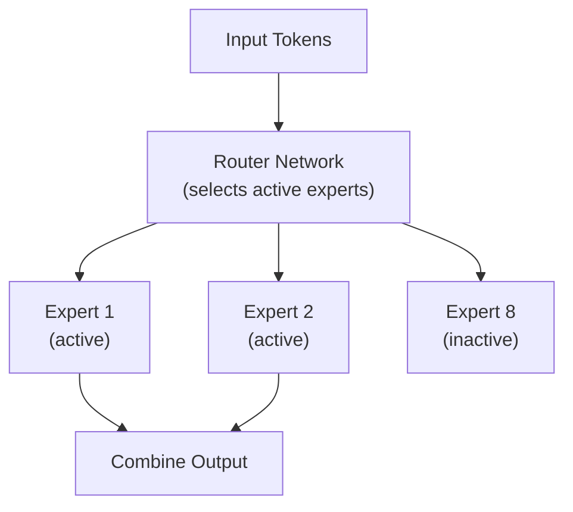

# DeepSeek as a Model Provider for Coding Agents

## Overview

DeepSeek has emerged as a disruptive force in the LLM landscape, offering models that
rival GPT-4 and Claude at a fraction of the cost. With input pricing as low as
**$0.028/MTok** (cache hit) and **$0.28/MTok** (cache miss), DeepSeek is **10-50x
cheaper** than frontier providers. This extreme cost efficiency, combined with open
weights and strong coding performance, makes DeepSeek an increasingly important
provider for CLI coding agents—particularly for high-volume workloads, self-hosted
deployments, and cost-sensitive users.

Among the 17 agents studied, **3 (18%)** natively support DeepSeek, though many more
can access it through LiteLLM or OpenRouter due to its OpenAI-compatible API.

---

## Model Lineup

### DeepSeek-V3.2

DeepSeek's flagship model, accessible via the `deepseek-chat` API endpoint:

| Property | Value |
|----------|-------|
| **API Endpoint** | `deepseek-chat` (Non-thinking Mode) |
| **Architecture** | Mixture of Experts (MoE) |
| **Total Parameters** | 671B |
| **Active Parameters** | ~37B per token |
| **Context Window** | 128,000 tokens |
| **Max Output (default)** | 4,096 tokens |
| **Max Output (maximum)** | 8,192 tokens |
| **Input Price (cache hit)** | $0.028 / MTok |
| **Input Price (cache miss)** | $0.28 / MTok |
| **Output Price** | $0.42 / MTok |

### DeepSeek-V3.2 (Thinking Mode / Reasoner)

The same V3.2 model with explicit reasoning capabilities:

| Property | Value |
|----------|-------|
| **API Endpoint** | `deepseek-reasoner` (Thinking Mode) |
| **Context Window** | 128,000 tokens |
| **Max Output (default)** | 32,768 tokens |
| **Max Output (maximum)** | 65,536 tokens |
| **Input Price (cache hit)** | $0.028 / MTok |
| **Input Price (cache miss)** | $0.28 / MTok |
| **Output Price** | $0.42 / MTok |

The reasoner mode generates chain-of-thought reasoning tokens before producing the
final answer, similar to OpenAI's o-series models.

### Feature Comparison

| Feature | deepseek-chat | deepseek-reasoner |
|---------|--------------|-------------------|
| JSON Output | ✅ | ✅ |
| Tool Calls | ✅ | ✅ |
| Chat Prefix Completion | ✅ (Beta) | ✅ (Beta) |
| FIM Completion | ✅ (Beta) | ❌ |
| Streaming | ✅ | ✅ |

### Previous Models

| Model | Parameters | Notes |
|-------|-----------|-------|
| DeepSeek-V3 | 671B MoE | Previous flagship |
| DeepSeek-V2.5 | 236B MoE | Merged chat + coder |
| DeepSeek-R1 | 671B MoE | First reasoning model, open weights |
| DeepSeek-Coder-V2 | 236B MoE | Specialized for code |
| DeepSeek-Coder | 33B | Early code-specific model |

---

## Mixture of Experts (MoE) Architecture

DeepSeek's key innovation is its MoE architecture, which achieves frontier-level
performance while being dramatically cheaper to run:

### How MoE Works



**Key insight:** DeepSeek-V3.2 has 671B total parameters but only activates ~37B
per token. This means:
- **Training:** Uses all 671B parameters (expensive once)
- **Inference:** Only activates 37B parameters per token (cheap per request)
- **Result:** Frontier-level quality at a fraction of the inference cost

### Why This Matters for Coding Agents

| Metric | Dense 70B Model | DeepSeek MoE 671B |
|--------|-----------------|-------------------|
| Active params per token | 70B | 37B |
| Total knowledge | 70B | 671B |
| Inference cost | Moderate | Lower |
| Quality | Good | Frontier |
| Memory (inference) | ~140 GB | ~80 GB active |

The MoE architecture is why DeepSeek can offer prices 10-50x below OpenAI and
Anthropic while maintaining competitive quality.

---

## API Integration

DeepSeek's API is OpenAI-compatible, making integration trivial for any agent that
supports custom OpenAI endpoints:

### Basic Usage

```python
from openai import OpenAI

client = OpenAI(
    api_key="your-deepseek-api-key",
    base_url="https://api.deepseek.com"
)

response = client.chat.completions.create(
    model="deepseek-chat",
    messages=[
        {"role": "system", "content": "You are a coding assistant."},
        {"role": "user", "content": "Optimize this database query for performance"}
    ],
    temperature=0.1,
    max_tokens=4096
)

print(response.choices[0].message.content)
```

### Function Calling

```python
tools = [
    {
        "type": "function",
        "function": {
            "name": "edit_file",
            "description": "Edit a source code file",
            "parameters": {
                "type": "object",
                "properties": {
                    "path": {"type": "string", "description": "File path"},
                    "old_text": {"type": "string", "description": "Text to replace"},
                    "new_text": {"type": "string", "description": "Replacement text"}
                },
                "required": ["path", "old_text", "new_text"]
            }
        }
    }
]

response = client.chat.completions.create(
    model="deepseek-chat",
    messages=messages,
    tools=tools,
    tool_choice="auto"
)

# Process tool calls (same as OpenAI format)
if response.choices[0].message.tool_calls:
    for call in response.choices[0].message.tool_calls:
        print(f"Tool: {call.function.name}")
        print(f"Args: {call.function.arguments}")
```

### Reasoning Mode

```python
# Using the reasoner for complex coding tasks
response = client.chat.completions.create(
    model="deepseek-reasoner",
    messages=[
        {"role": "user", "content": "Design a lock-free concurrent hash map in C++"}
    ],
    max_tokens=32768
)

# The response may include reasoning in the content
print(response.choices[0].message.content)
```

### Streaming

```python
stream = client.chat.completions.create(
    model="deepseek-chat",
    messages=messages,
    stream=True
)

for chunk in stream:
    if chunk.choices[0].delta.content:
        print(chunk.choices[0].delta.content, end="", flush=True)
```

### Fill-in-the-Middle (FIM)

DeepSeek supports FIM completion, useful for code completion agents:

```python
# FIM completion — fill in code between prefix and suffix
response = client.completions.create(
    model="deepseek-chat",
    prompt="def calculate_fibonacci(n):\n    ",
    suffix="\n    return result",
    max_tokens=256
)

print(response.choices[0].text)
```

---

## Automatic Caching

DeepSeek implements automatic disk caching that dramatically reduces costs:

### How Caching Works

```
First request:  System prompt + context → Cache MISS → $0.28/MTok
Second request: System prompt + context → Cache HIT  → $0.028/MTok (90% savings)
```

Unlike Anthropic's explicit cache breakpoints, DeepSeek's caching is automatic.
The system detects when request prefixes match previously processed content and
serves from cache.

### Cache Hit Rates for Coding Agents

For a typical coding agent session with a stable system prompt:

| Turn | Cached Tokens | Cache Hit Rate | Effective Input Price |
|------|--------------|---------------|----------------------|
| Turn 1 | 0 | 0% | $0.28 / MTok |
| Turn 2 | ~5,000 (system) | ~50% | $0.15 / MTok |
| Turn 5 | ~15,000 (system + history prefix) | ~70% | $0.10 / MTok |
| Turn 10 | ~30,000 (growing prefix) | ~80% | $0.078 / MTok |
| Turn 20 | ~50,000 (large prefix) | ~85% | $0.066 / MTok |

### Cost Comparison (20-turn session, 50K context)

| Provider | Without Caching | With Caching | Savings |
|----------|----------------|-------------|---------|
| Anthropic Claude Sonnet | $3.00 | $0.48 | 84% |
| OpenAI GPT-4.1 | $2.00 | $1.00 | 50% |
| DeepSeek-V3.2 | $0.28 | $0.06 | 79% |

DeepSeek with caching is **50x cheaper** than Claude Sonnet with caching.

---

## Pricing Deep Dive

### Per-Token Pricing

| | Cache Hit | Cache Miss | Output |
|---|----------|------------|--------|
| **deepseek-chat** | $0.028 / MTok | $0.28 / MTok | $0.42 / MTok |
| **deepseek-reasoner** | $0.028 / MTok | $0.28 / MTok | $0.42 / MTok |

### Cost per Coding Task

| Task | Input Tokens | Output Tokens | Cost (DeepSeek) | Cost (GPT-4.1) | Cost (Claude Sonnet) |
|------|-------------|--------------|----------------|----------------|---------------------|
| Simple bug fix | 5K | 2K | $0.002 | $0.026 | $0.045 |
| Feature implementation | 30K | 10K | $0.013 | $0.140 | $0.240 |
| Large refactoring | 100K | 40K | $0.045 | $0.520 | $0.900 |
| Full SWE-bench task | 50K | 15K | $0.020 | $0.220 | $0.375 |

### Monthly Budget Comparison

For a developer making ~100 coding agent requests per day:

| Provider | Monthly Cost (est.) |
|----------|-------------------|
| Claude Sonnet 4.6 | $300-600 |
| GPT-4.1 | $200-400 |
| Gemini 2.5 Pro | $150-300 |
| DeepSeek-V3.2 | $10-30 |
| Gemini 2.5 Flash | $10-25 |

---

## How Agents Use DeepSeek

### Aider (via LiteLLM)

Aider supports DeepSeek through LiteLLM:

```bash
# Using DeepSeek with Aider
export DEEPSEEK_API_KEY="your-key"
aider --model deepseek/deepseek-chat
aider --model deepseek/deepseek-reasoner  # Reasoning mode
```

### OpenHands (via LiteLLM)

```bash
export LLM_MODEL="deepseek/deepseek-chat"
export DEEPSEEK_API_KEY="your-key"
```

### OpenCode

OpenCode has considered native DeepSeek support:

```go
// OpenCode can use DeepSeek through its OpenAI-compatible provider
provider := openai.NewProvider(openai.Config{
    APIKey:  os.Getenv("DEEPSEEK_API_KEY"),
    BaseURL: "https://api.deepseek.com",
    Model:   "deepseek-chat",
})
```

### ForgeCode

```yaml
# ForgeCode configuration for DeepSeek
model:
  provider: deepseek
  name: deepseek-chat
  api_key: ${DEEPSEEK_API_KEY}
```

### Any OpenAI-Compatible Agent

Because DeepSeek uses the OpenAI API format, any agent that supports custom
OpenAI-compatible endpoints can use DeepSeek:

```bash
# Generic approach for OpenAI-compatible agents
export OPENAI_API_KEY="your-deepseek-key"
export OPENAI_BASE_URL="https://api.deepseek.com"
```

---

## Open Weights and Self-Hosting

DeepSeek releases model weights under permissive licenses, enabling self-hosted
deployments for maximum privacy and zero API costs.

### Available Weights

| Model | Parameters | License | Quantized Sizes |
|-------|-----------|---------|----------------|
| DeepSeek-V3 | 671B (37B active) | DeepSeek License | Q4: ~200GB, Q8: ~400GB |
| DeepSeek-R1 | 671B (37B active) | MIT | Q4: ~200GB, Q8: ~400GB |
| DeepSeek-R1-Distill-Qwen-32B | 32B | MIT | Q4: ~18GB, Q8: ~34GB |
| DeepSeek-R1-Distill-Llama-70B | 70B | MIT | Q4: ~40GB, Q8: ~75GB |
| DeepSeek-Coder-V2 | 236B | DeepSeek License | Q4: ~70GB |

### Self-Hosting Options

#### vLLM (Recommended for Production)

```bash
# Run DeepSeek-V3 with vLLM (requires 8x A100 80GB or equivalent)
pip install vllm

python -m vllm.entrypoints.openai.api_server \
    --model deepseek-ai/DeepSeek-V3 \
    --tensor-parallel-size 8 \
    --max-model-len 65536 \
    --trust-remote-code \
    --port 8000
```

#### Ollama (Easiest for Local Development)

```bash
# Run distilled versions locally with Ollama
ollama pull deepseek-r1:32b        # Distilled 32B, needs ~20GB RAM
ollama pull deepseek-coder-v2:16b  # Coder variant, needs ~10GB RAM

# Use with coding agents
export OPENAI_BASE_URL="http://localhost:11434/v1"
export OPENAI_API_KEY="ollama"
```

#### llama.cpp

```bash
# For maximum efficiency on consumer hardware
./llama-server \
    -m deepseek-r1-distill-qwen-32b-q4_k_m.gguf \
    --port 8080 \
    --n-gpu-layers 35 \
    --ctx-size 32768
```

### Hardware Requirements

| Model | Minimum Hardware | Recommended |
|-------|-----------------|-------------|
| DeepSeek-V3 (full) | 8x A100 80GB | 8x H100 80GB |
| DeepSeek-R1-Distill-70B | 2x A100 80GB | 4x A100 80GB |
| DeepSeek-R1-Distill-32B | 1x A100 80GB | 2x RTX 4090 |
| DeepSeek-R1-Distill-32B (Q4) | 24GB VRAM (RTX 4090) | 48GB VRAM |
| DeepSeek-R1-Distill-7B | 8GB VRAM | 16GB VRAM |

### Cost of Self-Hosting vs. API

| Scenario | API Cost (monthly) | Self-Hosting Cost (monthly) |
|----------|-------------------|-----------------------------|
| Light use (1K req/day) | ~$10 | $2,000+ (cloud GPU) |
| Medium use (10K req/day) | ~$100 | $2,000+ (cloud GPU) |
| Heavy use (100K req/day) | ~$1,000 | $2,000+ (cloud GPU) |
| Enterprise (1M req/day) | ~$10,000 | $2,000+ (cloud GPU) |

**Key insight:** DeepSeek's API is so cheap that self-hosting only makes financial
sense at very high volumes or when data privacy is the primary concern.

---

## Distilled Models

DeepSeek's distilled models bring reasoning capabilities to smaller, more accessible
model sizes:

### DeepSeek-R1-Distill Series

| Model | Base | Parameters | Quality vs R1 Full |
|-------|------|-----------|-------------------|
| R1-Distill-Qwen-1.5B | Qwen 2.5 1.5B | 1.5B | ~60% |
| R1-Distill-Qwen-7B | Qwen 2.5 7B | 7B | ~70% |
| R1-Distill-Qwen-14B | Qwen 2.5 14B | 14B | ~80% |
| R1-Distill-Qwen-32B | Qwen 2.5 32B | 32B | ~90% |
| R1-Distill-Llama-8B | Llama 3.1 8B | 8B | ~70% |
| R1-Distill-Llama-70B | Llama 3.3 70B | 70B | ~95% |

The 32B and 70B distilled variants are particularly interesting for coding agents
because they offer strong reasoning capabilities at sizes that can run on consumer
hardware.

---

## Strengths and Limitations

### Strengths

| Strength | Details |
|----------|---------|
| **Extreme cost** | 10-50x cheaper than GPT-4/Claude for similar quality |
| **Automatic caching** | 90% savings on cache hits, no configuration needed |
| **OpenAI compatibility** | Drop-in replacement for any OpenAI-based agent |
| **Open weights** | Self-host for privacy, fine-tune for specialization |
| **Strong coding** | Competitive with GPT-4 on coding benchmarks |
| **Reasoning mode** | Chain-of-thought for complex tasks |
| **MoE efficiency** | 671B knowledge, 37B inference cost |

### Limitations

| Limitation | Details |
|-----------|---------|
| **Max output** | Limited to 8K (chat) or 64K (reasoner) |
| **Context window** | 128K vs. 1M for Gemini/Claude/GPT-4.1 |
| **Rate limits** | Can be restrictive during peak demand |
| **Availability** | Occasional outages; China-based infrastructure |
| **Tool calling quality** | Good but less reliable than OpenAI/Anthropic |
| **Streaming tool calls** | Less polished than frontier providers |
| **Enterprise support** | Limited compared to OpenAI/Anthropic/Google |
| **Censorship** | Some content restrictions (China regulations) |
| **Geopolitical risk** | Potential access restrictions in some regions |

---

## When to Use DeepSeek

### Ideal Use Cases

1. **Budget-constrained development** — Get frontier-level results at $10-30/month
2. **High-volume automated workflows** — SWE-bench evaluation, batch code review
3. **Self-hosted deployments** — Privacy-first organizations with GPU infrastructure
4. **Prototyping** — Iterate quickly without worrying about API costs
5. **Fallback provider** — Use DeepSeek when primary provider is rate-limited

### Not Ideal For

1. **Maximum reliability** — When uptime SLA is critical
2. **Very long context** — Tasks needing >128K tokens of context
3. **Enterprise compliance** — When data residency requirements exist
4. **Cutting-edge features** — Extended thinking, prompt caching breakpoints

---

## Integration Patterns for Agent Developers

### Cost-Based Model Routing

```python
# Use DeepSeek for routine tasks, frontier models for complex ones
def select_model(task_complexity):
    if task_complexity == "simple":
        return {
            "model": "deepseek-chat",
            "base_url": "https://api.deepseek.com",
            "api_key": DEEPSEEK_KEY
        }
    elif task_complexity == "complex":
        return {
            "model": "claude-sonnet-4-6",
            "base_url": "https://api.anthropic.com",
            "api_key": ANTHROPIC_KEY
        }
```

### Fallback Chain

```python
# Try DeepSeek first (cheapest), fall back to more expensive providers
FALLBACK_CHAIN = [
    {"provider": "deepseek", "model": "deepseek-chat"},
    {"provider": "openai", "model": "gpt-4.1"},
    {"provider": "anthropic", "model": "claude-sonnet-4-6"},
]

async def call_with_fallback(messages, tools):
    for config in FALLBACK_CHAIN:
        try:
            return await call_provider(config, messages, tools)
        except (RateLimitError, ServiceUnavailableError):
            continue
    raise AllProvidersFailedError()
```

---

## See Also

- [Open-Source Models](open-source-models.md) — Self-hosting and local model options
- [Pricing and Cost](pricing-and-cost.md) — Detailed pricing comparison
- [LiteLLM](litellm.md) — Using DeepSeek through LiteLLM
- [Model Routing](model-routing.md) — Cost-based routing with DeepSeek