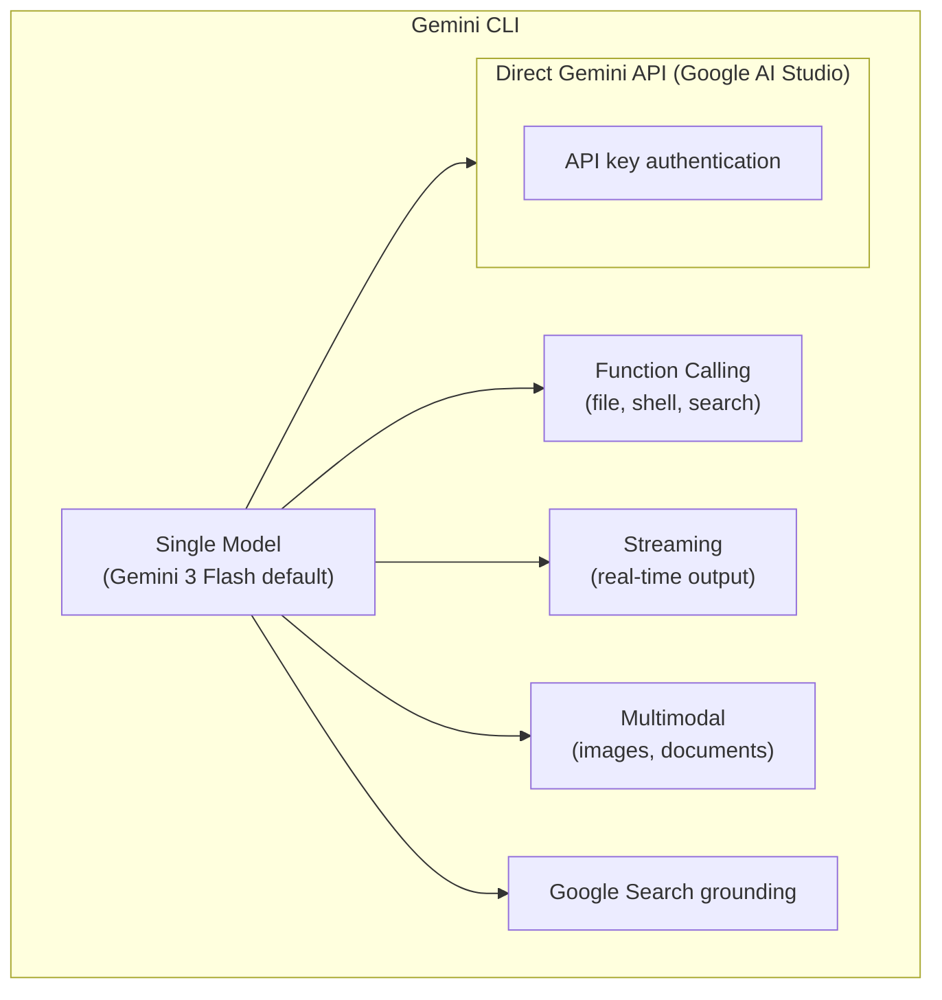

# Google as a Model Provider for Coding Agents

## Overview

Google's Gemini models represent the third major frontier provider for CLI coding
agents, supported by **12 out of 17 agents (71%)** in our study. Google's key
differentiators are the massive 1M+ token context window, strong multimodal
capabilities, aggressive free-tier pricing, and the Gemini CLI—Google's own
open-source CLI coding agent that demonstrates deep integration with the Gemini
platform.

Gemini 2.5 Pro is Google's most capable coding model, while Gemini 2.5 Flash
provides exceptional price-performance for high-volume agentic workloads.

---

## Model Lineup

### Gemini 2.5 Pro

Google's most advanced model for complex reasoning and coding:

| Property | Value |
|----------|-------|
| **Model ID** | `gemini-2.5-pro` |
| **Context Window** | 1,048,576 tokens (1M) |
| **Max Output** | 65,536 tokens |
| **Input Price (≤200K)** | $1.25 / MTok |
| **Input Price (>200K)** | $2.50 / MTok |
| **Output Price (≤200K)** | $10.00 / MTok |
| **Output Price (>200K)** | $15.00 / MTok |
| **Thinking Output** | $3.50-10.00 / MTok |
| **Grounding** | Google Search integration |
| **Code Execution** | Built-in sandbox |

Gemini 2.5 Pro is competitive with Claude Opus 4.6 on coding benchmarks and offers
the unique advantage of grounding with Google Search—allowing agents to look up
documentation and APIs during coding.

### Gemini 2.5 Flash

Google's best price-performance model for coding:

| Property | Value |
|----------|-------|
| **Model ID** | `gemini-2.5-flash` |
| **Context Window** | 1,048,576 tokens (1M) |
| **Max Output** | 65,536 tokens |
| **Input Price (≤200K)** | $0.15 / MTok |
| **Input Price (>200K)** | $0.30 / MTok |
| **Output Price (≤200K)** | $0.60 / MTok |
| **Output Price (>200K)** | $1.20 / MTok |
| **Thinking Output (≤200K)** | $1.50 / MTok |
| **Thinking Output (>200K)** | $3.00 / MTok |
| **Grounding** | Google Search integration |
| **Code Execution** | Built-in sandbox |

Gemini 2.5 Flash is remarkably cheap—roughly **5-10x cheaper** than Claude Sonnet
or GPT-4o for standard input/output—making it an excellent choice for agents that
need to make many API calls per task.

### Gemini 2.5 Flash-Lite

An even cheaper variant for high-volume tasks:

| Property | Value |
|----------|-------|
| **Model ID** | `gemini-2.5-flash-lite` |
| **Context Window** | 1,048,576 tokens |
| **Input Price** | $0.075 / MTok |
| **Output Price** | $0.30 / MTok |
| **Thinking** | Not supported |

### Gemini 3 (Latest Generation)

The newest generation, announced in 2025:

| Property | Value |
|----------|-------|
| **Model ID** | `gemini-3.0-flash` |
| **Context Window** | 1M+ tokens |
| **Default in** | Gemini CLI |

Gemini 3 Flash is the default model in Gemini CLI. It builds on the 2.5 generation
with improved coding capabilities and faster inference.

---

## API Architecture

Google offers two main platforms for accessing Gemini models:

### Google AI Studio (Gemini API)

The developer-focused API, ideal for prototyping and smaller-scale applications:

```python
from google import genai

client = genai.Client(api_key="YOUR_API_KEY")

response = client.models.generate_content(
    model="gemini-2.5-pro",
    contents="Fix the memory leak in the connection pool",
    config=genai.types.GenerateContentConfig(
        system_instruction="You are a coding agent. Use tools to edit files.",
        max_output_tokens=8192,
        temperature=0.1,
    )
)

print(response.text)
```

**Key features:**
- Free tier with generous rate limits
- API key authentication (simpler than OAuth)
- Direct access to all Gemini models
- Context caching API
- Batch API

### Vertex AI (Google Cloud)

Enterprise-grade platform with full GCP integration:

```python
import vertexai
from vertexai.generative_models import GenerativeModel

vertexai.init(project="my-project", location="us-central1")
model = GenerativeModel("gemini-2.5-pro")

response = model.generate_content(
    "Refactor the authentication module",
    generation_config={
        "max_output_tokens": 8192,
        "temperature": 0.1,
    }
)
```

### AI Studio vs Vertex AI Comparison

| Feature | AI Studio | Vertex AI |
|---------|-----------|-----------|
| **Authentication** | API key | Google Cloud IAM |
| **Free tier** | Yes (generous) | No (pay-per-use) |
| **Rate limits** | Lower | Higher (enterprise) |
| **SLA** | No | Yes |
| **VPC integration** | No | Yes |
| **Data residency** | Limited | Full control |
| **Pricing** | Standard | Same base + GCP overhead |
| **Best for** | Development, small apps | Enterprise, production |

### OpenAI Compatibility Layer

Google provides an OpenAI-compatible endpoint, making it easy for agents built on
the OpenAI SDK to use Gemini models:

```python
from openai import OpenAI

# Use Gemini through OpenAI SDK
client = OpenAI(
    api_key="GOOGLE_API_KEY",
    base_url="https://generativelanguage.googleapis.com/v1beta/openai/"
)

response = client.chat.completions.create(
    model="gemini-2.5-pro",
    messages=[
        {"role": "system", "content": "You are a coding assistant."},
        {"role": "user", "content": "Fix this bug..."}
    ]
)
```

This compatibility layer enables agents like Codex CLI (which uses the OpenAI
Responses API format) to potentially work with Gemini models through configuration.

---

## 1M+ Token Context Window

Gemini's 1M token context window is a game-changer for coding agents:

### What Fits in 1M Tokens?

| Content | Approximate Tokens | Fits in 1M? |
|---------|-------------------|-------------|
| Small project (50 files) | ~50,000 | ✅ Easily |
| Medium project (500 files) | ~500,000 | ✅ Yes |
| Large project (2000 files) | ~2,000,000 | ⚠️ Partially |
| Linux kernel | ~20,000,000 | ❌ No |
| Single large file (10K lines) | ~30,000 | ✅ Easily |
| Entire npm package | ~100,000 | ✅ Yes |

### Context Caching

Google's context caching API reduces costs for repeated use of the same context:

```python
from google import genai
from google.genai import types

client = genai.Client(api_key="YOUR_API_KEY")

# Create a cache with the codebase
cache = client.caches.create(
    model="gemini-2.5-pro",
    config=types.CreateCachedContentConfig(
        display_name="my-project-context",
        system_instruction="You are a coding agent...",
        contents=[
            types.Content(
                role="user",
                parts=[types.Part(text=entire_codebase_as_text)]
            )
        ],
        ttl="3600s"  # 1 hour
    )
)

# Use the cache in subsequent requests
response = client.models.generate_content(
    model="gemini-2.5-pro",
    contents="Fix the authentication bug",
    config=types.GenerateContentConfig(
        cached_content=cache.name
    )
)
```

### Context Caching Pricing

| Model | Cache Storage | Cached Input | Standard Input |
|-------|--------------|-------------|----------------|
| Gemini 2.5 Pro | $0.3125 / MTok·hr | $0.3125 / MTok | $1.25 / MTok |
| Gemini 2.5 Flash | $0.0375 / MTok·hr | $0.0375 / MTok | $0.15 / MTok |

Cached input is **75% cheaper** than standard input. For a coding agent maintaining
a codebase in context across 20 turns, this represents massive savings.

---

## Function Calling

Gemini supports native function calling through `function_declarations`:

```python
from google import genai
from google.genai import types

# Define tools
tools = [
    types.Tool(
        function_declarations=[
            types.FunctionDeclaration(
                name="read_file",
                description="Read the contents of a file",
                parameters=types.Schema(
                    type="OBJECT",
                    properties={
                        "path": types.Schema(
                            type="STRING",
                            description="File path relative to project root"
                        )
                    },
                    required=["path"]
                )
            ),
            types.FunctionDeclaration(
                name="write_file",
                description="Write content to a file",
                parameters=types.Schema(
                    type="OBJECT",
                    properties={
                        "path": types.Schema(type="STRING"),
                        "content": types.Schema(type="STRING")
                    },
                    required=["path", "content"]
                )
            )
        ]
    )
]

response = client.models.generate_content(
    model="gemini-2.5-pro",
    contents="Read config.yaml and update the database URL",
    config=types.GenerateContentConfig(
        tools=tools,
        tool_config=types.ToolConfig(
            function_calling_config=types.FunctionCallingConfig(
                mode="AUTO"  # AUTO, ANY, NONE
            )
        )
    )
)

# Process function calls
for part in response.candidates[0].content.parts:
    if part.function_call:
        name = part.function_call.name
        args = dict(part.function_call.args)
        result = execute_function(name, args)
```

### Function Calling Modes

| Mode | Behavior |
|------|----------|
| `AUTO` | Model decides whether to call functions |
| `ANY` | Model must call at least one function |
| `NONE` | Model cannot call functions |

---

## Multimodal Capabilities

Gemini's native multimodal support is stronger than most competitors:

### Image Understanding for Coding

```python
import base64

# Encode image
with open("screenshot.png", "rb") as f:
    image_data = base64.b64encode(f.read()).decode()

response = client.models.generate_content(
    model="gemini-2.5-pro",
    contents=[
        types.Content(
            parts=[
                types.Part(text="Implement this UI design in React"),
                types.Part(
                    inline_data=types.Blob(
                        mime_type="image/png",
                        data=image_data
                    )
                )
            ]
        )
    ]
)
```

### Video Understanding

Gemini can process video input, useful for debugging UI interactions:

```python
# Upload a video file
video_file = client.files.upload(file="demo.mp4")

response = client.models.generate_content(
    model="gemini-2.5-pro",
    contents=[
        types.Content(
            parts=[
                types.Part(text="What bugs do you see in this UI demo?"),
                types.Part(file_data=types.FileData(
                    file_uri=video_file.uri,
                    mime_type="video/mp4"
                ))
            ]
        )
    ]
)
```

### Supported Input Types

| Type | Support | Use Case for Coding |
|------|---------|-------------------|
| Text | ✅ | Code, documentation, logs |
| Images | ✅ | Screenshots, UML diagrams, mockups |
| Video | ✅ | UI demos, screen recordings |
| Audio | ✅ | Voice commands, meeting recordings |
| PDF | ✅ | Specification documents, RFCs |
| Code files | ✅ | Direct file content |

---

## Grounding with Google Search

Gemini can ground its responses using real-time Google Search results:

```python
response = client.models.generate_content(
    model="gemini-2.5-pro",
    contents="What's the latest API for React Server Components?",
    config=types.GenerateContentConfig(
        tools=[
            types.Tool(google_search=types.GoogleSearch())
        ]
    )
)

# Response includes grounding metadata with source URLs
if response.candidates[0].grounding_metadata:
    for chunk in response.candidates[0].grounding_metadata.grounding_chunks:
        print(f"Source: {chunk.web.uri}")
```

**Use cases for coding agents:**
- Looking up latest library documentation
- Finding API reference for unfamiliar packages
- Checking for known issues/CVEs
- Understanding new framework patterns

**Pricing:** Google Search tool calls incur additional per-search charges.

---

## Built-in Code Execution

Gemini offers a built-in code execution sandbox:

```python
response = client.models.generate_content(
    model="gemini-2.5-pro",
    contents="Calculate the time complexity of this algorithm and verify with a benchmark",
    config=types.GenerateContentConfig(
        tools=[
            types.Tool(code_execution=types.ToolCodeExecution())
        ]
    )
)

# The model can write and execute Python code, returning results
for part in response.candidates[0].content.parts:
    if part.executable_code:
        print(f"Code:\n{part.executable_code.code}")
    if part.code_execution_result:
        print(f"Output:\n{part.code_execution_result.output}")
```

This is distinct from a coding agent's own tool system—it's a model-side sandbox
that Gemini uses internally to verify computations.

---

## Gemini CLI Architecture

Gemini CLI is Google's open-source CLI coding agent, purpose-built for the Gemini
platform:

### Architecture



### Key Design Decisions

1. **Single provider:** Only Google Gemini models (no multi-provider support)
2. **Free tier friendly:** Works with the free Gemini API tier
3. **Multimodal native:** Can process images and documents in prompts
4. **Search grounding:** Can look up documentation during coding

### Configuration

```bash
# Set up Gemini CLI
export GEMINI_API_KEY="your-api-key"

# Use with different models
gemini --model gemini-2.5-pro   # Most capable
gemini --model gemini-2.5-flash # Faster, cheaper
gemini --model gemini-3.0-flash # Latest generation (default)
```

---

## Pricing Comparison

### Standard Pricing (per million tokens)

| Model | Input (≤200K) | Input (>200K) | Output (≤200K) | Output (>200K) |
|-------|--------------|--------------|---------------|---------------|
| Gemini 2.5 Pro | $1.25 | $2.50 | $10.00 | $15.00 |
| Gemini 2.5 Flash | $0.15 | $0.30 | $0.60 | $1.20 |
| Gemini 2.5 Flash-Lite | $0.075 | $0.15 | $0.30 | $0.60 |

### Thinking Token Pricing

| Model | Thinking (≤200K) | Thinking (>200K) |
|-------|-----------------|-----------------|
| Gemini 2.5 Pro | $3.50 | $7.00 |
| Gemini 2.5 Flash | $1.50 | $3.00 |

### Free Tier (AI Studio)

| Model | Rate Limit (Free) | Daily Limit |
|-------|-------------------|-------------|
| Gemini 2.5 Flash | 10 RPM | 500 requests/day |
| Gemini 2.5 Pro | 5 RPM | 50 requests/day |

The free tier makes Gemini particularly attractive for developers who want to
experiment with coding agents without any upfront cost.

### Cost Comparison vs. Competitors

For a typical coding task (30K input + 5K output tokens):

| Model | Cost |
|-------|------|
| Claude Sonnet 4.6 | $0.165 |
| GPT-4.1 | $0.100 |
| Gemini 2.5 Pro | $0.088 |
| Gemini 2.5 Flash | $0.008 |
| DeepSeek-V3.2 | $0.010 |

Gemini 2.5 Flash is **20x cheaper** than Claude Sonnet for this workload.

---

## Batch API

Google offers a Batch API with 50% discount on standard prices:

```python
# Create batch job
batch_job = client.batches.create(
    model="gemini-2.5-flash",
    src="gs://my-bucket/batch_input.jsonl",
    config=types.CreateBatchJobConfig(
        dest="gs://my-bucket/batch_output/",
        display_name="code-review-batch"
    )
)
```

---

## How Agents Use Google

### Gemini CLI (Native)

- **API:** Direct Gemini API (AI Studio)
- **Default model:** Gemini 3 Flash
- **Features:** Full tool use, search grounding, multimodal input

### Aider (via LiteLLM)

```bash
aider --model gemini/gemini-2.5-pro
aider --model gemini/gemini-2.5-flash
```

### OpenHands (via LiteLLM)

```bash
export LLM_MODEL="gemini/gemini-2.5-pro"
export GOOGLE_API_KEY="your-key"
```

### Goose

```yaml
# Goose configuration
GOOSE_PROVIDER=google
GOOSE_MODEL=gemini-2.5-pro
```

### OpenCode (Native)

```go
// OpenCode has a native Google Gemini provider implementation
provider := google.NewProvider(config.GoogleConfig{
    APIKey: os.Getenv("GOOGLE_API_KEY"),
    Model:  "gemini-2.5-pro",
})
```

---

## Strengths and Limitations

### Strengths

| Strength | Details |
|----------|---------|
| **Context window** | 1M tokens = largest effective context for coding |
| **Price** | Flash models are 5-20x cheaper than competitors |
| **Free tier** | Generous free access for development |
| **Multimodal** | Native image/video/audio/PDF processing |
| **Search grounding** | Real-time documentation lookup |
| **OpenAI compatibility** | Drop-in replacement for OpenAI-based agents |
| **Code execution** | Built-in Python sandbox for verification |

### Limitations

| Limitation | Details |
|-----------|---------|
| **Function calling reliability** | Slightly less reliable than OpenAI/Anthropic |
| **Streaming quality** | Occasional issues with streamed tool calls |
| **Prompt caching** | Less flexible than Anthropic's explicit breakpoints |
| **Long context quality** | Performance can degrade at >500K tokens |
| **Rate limits (free)** | Very restrictive for agentic workloads |
| **Enterprise features** | Vertex AI required for SLAs, VPC |

---

## Best Practices

### 1. Use Flash for High-Volume Tasks

```python
# Route cheap operations to Flash
MODEL_ROUTING = {
    "file_exploration": "gemini-2.5-flash",    # Cheap, fast
    "code_generation": "gemini-2.5-pro",       # Capable
    "code_review": "gemini-2.5-flash",         # High volume
    "architecture": "gemini-2.5-pro",          # Complex reasoning
}
```

### 2. Leverage the Full Context Window

```python
# Load entire project into context for better understanding
import os

def load_project_context(root_dir, max_tokens=500000):
    """Load project files into a single context string."""
    context_parts = []
    for root, dirs, files in os.walk(root_dir):
        dirs[:] = [d for d in dirs if d not in {'.git', 'node_modules', '__pycache__'}]
        for f in files:
            if f.endswith(('.py', '.js', '.ts', '.go', '.rs')):
                path = os.path.join(root, f)
                with open(path) as fh:
                    content = fh.read()
                context_parts.append(f"--- {path} ---\n{content}")
    return "\n\n".join(context_parts)
```

### 3. Use Context Caching for Multi-Turn Sessions

```python
# Cache the codebase once, reuse for all turns
cache = create_cache(codebase_context)

for user_message in conversation:
    response = generate_with_cache(cache, user_message)
    # 75% cheaper input tokens on every turn after the first
```

---

## See Also

- [OpenAI](openai.md) — Comparison with OpenAI's approach
- [Anthropic](anthropic.md) — Comparison with Claude's caching and context
- [Pricing and Cost](pricing-and-cost.md) — Detailed pricing comparison
- [Model Routing](model-routing.md) — When to use Gemini vs. other providers