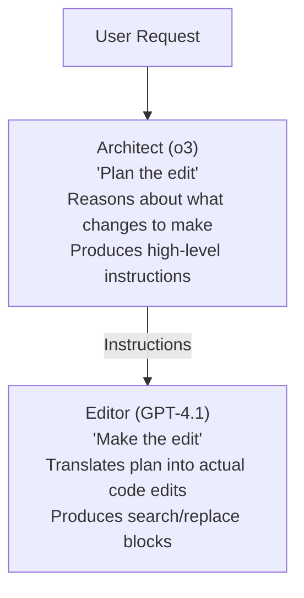
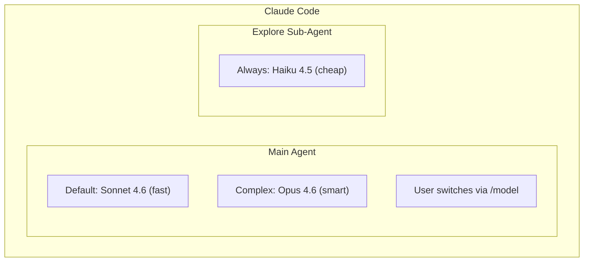
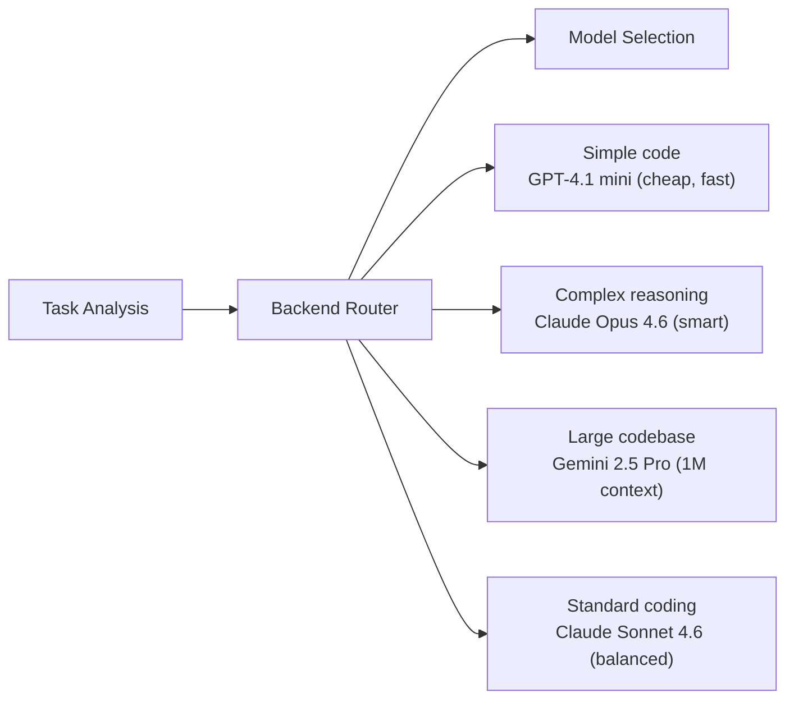

# Model Routing and Selection Strategies

## Overview

Model routing—the practice of dynamically selecting which LLM handles which task—is
one of the most impactful design decisions in a CLI coding agent. The choice between
a $0.002 DeepSeek call and a $0.50 Claude Opus call can mean the difference between
a $5/month and a $500/month agent, often with comparable quality for simpler tasks.

The most sophisticated agents implement multi-dimensional routing strategies that
consider cost, capability, latency, context requirements, and task complexity to
select the optimal model for each step in the agentic loop.

---

## Why Model Routing Matters

### The Cost-Quality Spectrum

```
Cost per task:
$0.001 ┤ DeepSeek Flash / Local 7B
$0.01  ┤ Gemini 2.5 Flash / DeepSeek-V3.2
$0.05  ┤ GPT-4.1 mini / Haiku 4.5
$0.10  ┤ GPT-4.1 / Gemini 2.5 Pro
$0.25  ┤ Claude Sonnet 4.6
$0.50  ┤ o3 / Claude Opus 4.6
$2.00  ┤ Claude Opus 4.6 (extended thinking, full context)
       └────────────────────────────────────────────
                    Increasing quality →
```

Not every task needs the most expensive model. A simple file read or git status
check doesn't require Claude Opus. Smart routing saves 50-90% on typical sessions.

### Real-World Impact

| Routing Strategy | SWE-bench Score | Cost per Task | Monthly Cost (100 tasks) |
|-----------------|----------------|--------------|-------------------------|
| Always Opus 4.6 | ~58% | $2.00 | $200 |
| Always Sonnet 4.6 | ~55% | $0.50 | $50 |
| Smart routing (Opus + Sonnet) | ~56% | $0.75 | $75 |
| Always GPT-4.1 | ~54% | $0.30 | $30 |
| Always DeepSeek | ~40% | $0.02 | $2 |
| Smart routing (multi-provider) | ~55% | $0.20 | $20 |

Smart routing can achieve 95% of the quality at 10% of the cost.

---

## Routing Strategies

### 1. Cost-Based Routing

Route to the cheapest model that can handle the task:

```python
class CostBasedRouter:
    """Route to the cheapest adequate model."""
    
    MODELS = [
        {"name": "deepseek-chat", "cost_per_1k": 0.00028, "quality": 0.7},
        {"name": "gemini-2.5-flash", "cost_per_1k": 0.00015, "quality": 0.75},
        {"name": "gpt-4.1-mini", "cost_per_1k": 0.0004, "quality": 0.8},
        {"name": "gpt-4.1", "cost_per_1k": 0.002, "quality": 0.9},
        {"name": "claude-sonnet-4-6", "cost_per_1k": 0.003, "quality": 0.92},
        {"name": "claude-opus-4-6", "cost_per_1k": 0.005, "quality": 0.98},
    ]
    
    def route(self, task_complexity: float) -> str:
        """Select cheapest model meeting quality threshold."""
        required_quality = {
            "trivial": 0.6,   # File listing, simple queries
            "simple": 0.75,    # Basic code generation
            "moderate": 0.85,  # Multi-file changes
            "complex": 0.92,   # Architecture, debugging
            "critical": 0.95,  # Security-sensitive, complex refactoring
        }
        threshold = required_quality.get(task_complexity, 0.85)
        
        for model in self.MODELS:  # Sorted by cost ascending
            if model["quality"] >= threshold:
                return model["name"]
        
        return self.MODELS[-1]["name"]  # Fallback to best model
```

### 2. Capability-Based Routing

Route based on what the task requires:

```python
class CapabilityRouter:
    """Route based on required capabilities."""
    
    def route(self, task: Task) -> str:
        # Needs reasoning? Use reasoning model
        if task.requires_planning or task.is_architectural:
            return "o3"  # or "claude-opus-4-6" with extended thinking
        
        # Needs long context? Use 1M context model
        if task.context_tokens > 200_000:
            return "gemini-2.5-pro"  # 1M context, reasonable price
        
        # Needs vision? Use multimodal model
        if task.has_images:
            return "gpt-4o"  # or "gemini-2.5-pro"
        
        # Needs function calling reliability?
        if task.tool_heavy:
            return "claude-sonnet-4-6"  # Best tool use
        
        # Simple code generation
        if task.is_simple_edit:
            return "deepseek-chat"  # Cheapest adequate model
        
        # Default: balanced choice
        return "claude-sonnet-4-6"
```

### 3. Phase-Based Routing

Use different models for different phases of a task:

```python
class PhaseBasedRouter:
    """Different models for different phases."""
    
    PHASE_MODELS = {
        # Planning phase: need intelligence
        "plan": "claude-opus-4-6",
        
        # Code generation: need speed + quality
        "code": "claude-sonnet-4-6",
        
        # Code review: moderate quality sufficient
        "review": "gpt-4.1-mini",
        
        # File exploration: cheapest possible
        "explore": "claude-haiku-4-5",
        
        # Test generation: moderate quality
        "test": "gemini-2.5-flash",
        
        # Summarization: cheap model sufficient
        "summarize": "deepseek-chat",
    }
    
    def route(self, phase: str) -> str:
        return self.PHASE_MODELS.get(phase, "claude-sonnet-4-6")
```

### 4. Latency-Aware Routing

Route to minimize response time:

```python
class LatencyRouter:
    """Route based on latency requirements."""
    
    # Approximate time-to-first-token
    MODEL_LATENCY = {
        "claude-haiku-4-5": 200,      # ms
        "gpt-4.1-mini": 250,          # ms
        "gemini-2.5-flash": 300,      # ms
        "gpt-4.1": 400,               # ms
        "claude-sonnet-4-6": 500,     # ms
        "ollama/qwen2.5:32b": 100,    # ms (local, no network)
        "claude-opus-4-6": 800,       # ms
        "o3": 2000,                    # ms (thinking time)
    }
    
    def route(self, max_latency_ms: int) -> str:
        """Select best model within latency budget."""
        eligible = [
            (model, latency) for model, latency in self.MODEL_LATENCY.items()
            if latency <= max_latency_ms
        ]
        if not eligible:
            return "claude-haiku-4-5"  # Fastest cloud option
        
        # Return highest quality model within latency budget
        return max(eligible, key=lambda x: self.quality_score(x[0]))[0]
```

### 5. Budget-Aware Routing

Track spend and downgrade models as budget is consumed:

```python
class BudgetRouter:
    """Downgrade models as budget is consumed."""
    
    def __init__(self, daily_budget: float = 10.0):
        self.daily_budget = daily_budget
        self.spent_today = 0.0
    
    def route(self, task: Task) -> str:
        remaining = self.daily_budget - self.spent_today
        budget_fraction = remaining / self.daily_budget
        
        if budget_fraction > 0.7:
            # Plenty of budget: use best model
            return "claude-sonnet-4-6"
        elif budget_fraction > 0.3:
            # Getting tight: use efficient model
            return "gpt-4.1-mini"
        elif budget_fraction > 0.1:
            # Low budget: use cheapest cloud model
            return "deepseek-chat"
        else:
            # Almost out: switch to local
            return "ollama/qwen2.5-coder:32b"
    
    def record_cost(self, cost: float):
        self.spent_today += cost
```

---

## How Agents Implement Routing

### Aider's Architect Mode

Aider implements the simplest effective multi-model pattern—pairing a reasoning
model (architect) with a code-editing model (editor):

```bash
# Architect mode: o3 plans, gpt-4.1 edits
aider --model o3 --editor-model gpt-4.1

# Or: Claude Opus plans, Sonnet edits
aider --model claude-opus-4-6 --editor-model claude-sonnet-4-6
```

**How it works:**



**Cost savings:** The expensive reasoning model only produces a short plan; the
cheaper model does the bulk of the token-heavy code generation.

### Claude Code's Model Switching

Claude Code supports switching between Sonnet, Opus, and Haiku:



The sub-agent pattern is a form of capability routing: quick exploration tasks
go to Haiku (cheapest), while the main agentic loop uses Sonnet or Opus.

### ForgeCode's Per-Phase Routing

ForgeCode routes different task phases to different models:

```yaml
# ForgeCode routing configuration
routing:
  thinking: claude-opus-4-6        # Planning (highest quality)
  coding: claude-sonnet-4-6        # Code generation (balanced)
  review: gpt-4.1-mini             # Code review (cost-effective)
  large_context: gemini-2.5-pro    # Big files (1M context)
```

### Junie CLI's Dynamic Per-Task Routing

Junie CLI (JetBrains) dynamically routes between Claude, GPT, and Gemini based on
task characteristics:



Junie's multi-model approach reportedly yields a **6.7 percentage point uplift**
on Terminal-Bench compared to using any single model.

### Warp's Auto Modes

Warp implements user-facing routing modes:

| Mode | Behavior | Models Used |
|------|----------|-------------|
| **Cost-efficient** | Minimizes spend | Cheaper models preferred |
| **Responsive** | Minimizes latency | Fast models preferred |
| **Genius** | Maximizes quality | Best models for each task |

### Goose's Fast Model Configuration

Goose supports a separate "fast model" for lightweight operations:

```yaml
GOOSE_PROVIDER=anthropic
GOOSE_MODEL=claude-sonnet-4-6  # Main model

# Separate fast model for quick operations
GOOSE_FAST_PROVIDER=anthropic
GOOSE_FAST_MODEL=claude-haiku-4-5
```

---

## OpenRouter as a Routing Platform

OpenRouter is a meta-provider that offers a unified API to hundreds of models with
built-in routing capabilities:

### Basic Usage

```python
from openai import OpenAI

client = OpenAI(
    api_key="your-openrouter-key",
    base_url="https://openrouter.ai/api/v1"
)

response = client.chat.completions.create(
    model="anthropic/claude-sonnet-4-6",  # Any model on OpenRouter
    messages=[{"role": "user", "content": "Fix this bug..."}]
)
```

### Model Auto-Selection

OpenRouter can automatically select the best model:

```python
# Let OpenRouter choose the best model
response = client.chat.completions.create(
    model="auto",  # OpenRouter selects based on task
    messages=messages
)
```

### Agents Using OpenRouter

| Agent | OpenRouter Integration |
|-------|-----------------------|
| **Aider** | Top 20 app on OpenRouter (via LiteLLM) |
| **ForgeCode** | Explicitly listed provider |
| **OpenCode** | Dedicated provider (reuses OpenAI client) |
| **Goose** | Listed gateway provider |
| **Pi Coding Agent** | Via OpenAI Completions protocol |
| **mini-SWE-agent** | Via LiteLLM |
| **OpenHands** | Via LiteLLM |

### OpenRouter Pricing

OpenRouter adds a small markup (typically 0-5%) over direct provider pricing,
but offers:
- Single API key for all providers
- Automatic fallbacks between providers
- Rate limit aggregation across multiple accounts
- Unified billing

---

## Automatic Fallback Strategies

### Sequential Fallback

Try models in order of preference:

```python
FALLBACK_CHAIN = [
    "anthropic/claude-sonnet-4-6",
    "openai/gpt-4.1",
    "deepseek/deepseek-chat",
    "ollama/qwen2.5-coder:32b",
]

async def call_with_fallback(messages, tools=None):
    last_error = None
    for model in FALLBACK_CHAIN:
        try:
            return await litellm.acompletion(
                model=model,
                messages=messages,
                tools=tools,
                timeout=30
            )
        except (litellm.RateLimitError, litellm.ServiceUnavailableError) as e:
            last_error = e
            continue
        except litellm.Timeout:
            last_error = TimeoutError(f"{model} timed out")
            continue
    raise AllProvidersFailedError(last_error)
```

### Context Window Fallback

Automatically escalate to larger context models:

```python
async def call_with_context_fallback(messages):
    total_tokens = estimate_tokens(messages)
    
    if total_tokens < 128_000:
        models = ["claude-sonnet-4-6", "gpt-4.1"]
    elif total_tokens < 200_000:
        models = ["claude-sonnet-4-6", "gpt-4.1"]  # Both support 1M
    elif total_tokens < 1_000_000:
        models = ["gemini-2.5-pro", "claude-sonnet-4-6"]  # 1M context
    else:
        raise ContextTooLargeError(f"{total_tokens} exceeds all model limits")
    
    return await call_with_fallback(messages, model_chain=models)
```

### Quality Fallback

Retry with a better model if the first attempt produces poor results:

```python
async def call_with_quality_fallback(messages, validator):
    # Try cheap model first
    response = await litellm.acompletion(
        model="deepseek/deepseek-chat",
        messages=messages
    )
    
    # Validate response quality
    if validator(response.choices[0].message.content):
        return response
    
    # Retry with better model
    return await litellm.acompletion(
        model="anthropic/claude-sonnet-4-6",
        messages=messages
    )
```

---

## Quality vs. Cost Trade-offs

### The Pareto Frontier

```
Quality │
   100% │                              * Opus 4.6
        │                         * Sonnet 4.6
        │                    * GPT-4.1
        │               * Gemini 2.5 Pro
    80% │          * Gemini Flash
        │     * DeepSeek-V3.2
        │  * GPT-4.1 mini
    60% │ * Qwen2.5-Coder-32B (local)
        │* Haiku 4.5
        └─────────────────────────────────
        $0.001  $0.01  $0.05  $0.10  $0.50  Cost/task
```

### Optimization Strategies

| Strategy | Quality Impact | Cost Savings |
|----------|---------------|-------------|
| **Architect mode** (expensive planner + cheap editor) | Minimal (-2%) | 40-60% |
| **Sub-agent routing** (cheap model for exploration) | None | 30-50% |
| **Task complexity classification** | Minimal (-3%) | 50-70% |
| **Prompt caching** | None | 50-90% |
| **Local model for simple tasks** | Moderate (-10%) | 80-95% |
| **Batch API for non-interactive** | None | 50% |
| **DeepSeek for routine coding** | Moderate (-15%) | 90-95% |

---

## Building a Custom Router

### Complete Implementation

```python
from dataclasses import dataclass
from enum import Enum
from typing import Optional
import litellm

class TaskComplexity(Enum):
    TRIVIAL = "trivial"
    SIMPLE = "simple"
    MODERATE = "moderate"
    COMPLEX = "complex"

@dataclass
class RoutingDecision:
    model: str
    reason: str
    estimated_cost: float

class CodingAgentRouter:
    """Production routing for a coding agent."""
    
    def __init__(self, daily_budget: float = 20.0):
        self.daily_budget = daily_budget
        self.daily_spend = 0.0
        self.model_stats = {}
    
    def classify_task(self, messages: list, tools: list) -> TaskComplexity:
        """Estimate task complexity from the conversation."""
        last_message = messages[-1]["content"]
        total_tokens = sum(len(m.get("content", "")) // 4 for m in messages)
        
        if total_tokens < 500 and not tools:
            return TaskComplexity.TRIVIAL
        elif total_tokens < 5000 and len(tools) <= 3:
            return TaskComplexity.SIMPLE
        elif total_tokens < 50000:
            return TaskComplexity.MODERATE
        else:
            return TaskComplexity.COMPLEX
    
    def route(self, messages: list, tools: list = None,
              require_reasoning: bool = False,
              require_vision: bool = False,
              max_latency_ms: Optional[int] = None) -> RoutingDecision:
        
        complexity = self.classify_task(messages, tools or [])
        remaining_budget = self.daily_budget - self.daily_spend
        
        # Budget-constrained routing
        if remaining_budget < 1.0:
            return RoutingDecision("deepseek/deepseek-chat", "Low budget", 0.002)
        
        # Capability requirements
        if require_reasoning:
            return RoutingDecision("openai/o3", "Reasoning required", 0.50)
        
        if require_vision:
            return RoutingDecision("openai/gpt-4o", "Vision required", 0.15)
        
        # Latency requirements
        if max_latency_ms and max_latency_ms < 300:
            return RoutingDecision("anthropic/claude-haiku-4-5", "Low latency", 0.01)
        
        # Complexity-based routing
        routing_map = {
            TaskComplexity.TRIVIAL: ("deepseek/deepseek-chat", 0.001),
            TaskComplexity.SIMPLE: ("anthropic/claude-haiku-4-5", 0.01),
            TaskComplexity.MODERATE: ("anthropic/claude-sonnet-4-6", 0.15),
            TaskComplexity.COMPLEX: ("anthropic/claude-opus-4-6", 0.50),
        }
        
        model, est_cost = routing_map[complexity]
        return RoutingDecision(model, f"{complexity.value} task", est_cost)
    
    async def complete(self, messages, tools=None, **kwargs):
        decision = self.route(messages, tools, **kwargs)
        
        response = await litellm.acompletion(
            model=decision.model,
            messages=messages,
            tools=tools
        )
        
        cost = litellm.completion_cost(completion_response=response)
        self.daily_spend += cost
        
        return response, decision
```

---

## Evaluation: Measuring Routing Effectiveness

### Metrics

| Metric | Description | Target |
|--------|-------------|--------|
| **Task success rate** | % of tasks completed correctly | >90% |
| **Cost per success** | Average cost of successful tasks | Minimize |
| **P95 latency** | 95th percentile response time | <10s |
| **Routing accuracy** | % of tasks sent to appropriate model | >85% |
| **Fallback rate** | % of tasks requiring fallback | <10% |
| **Budget adherence** | % of days within budget | >95% |

### A/B Testing Framework

```python
# Compare routing strategies
results = {}

for strategy in [always_opus, always_sonnet, smart_routing]:
    success = 0
    total_cost = 0
    
    for task in swe_bench_tasks:
        result = await run_task(task, router=strategy)
        if result.passed:
            success += 1
        total_cost += result.cost
    
    results[strategy.name] = {
        "success_rate": success / len(swe_bench_tasks),
        "total_cost": total_cost,
        "cost_per_success": total_cost / max(success, 1)
    }
```

---

## See Also

- [LiteLLM](litellm.md) — Unified interface enabling multi-provider routing
- [Pricing and Cost](pricing-and-cost.md) — Cost data for routing decisions
- [Agent Comparison](agent-comparison.md) — How each agent approaches routing
- [API Patterns](api-patterns.md) — Fallback and retry implementation