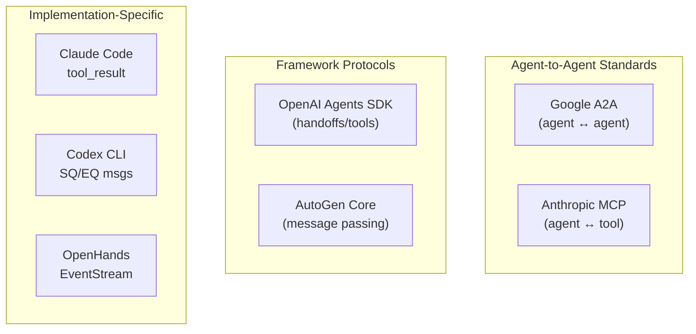
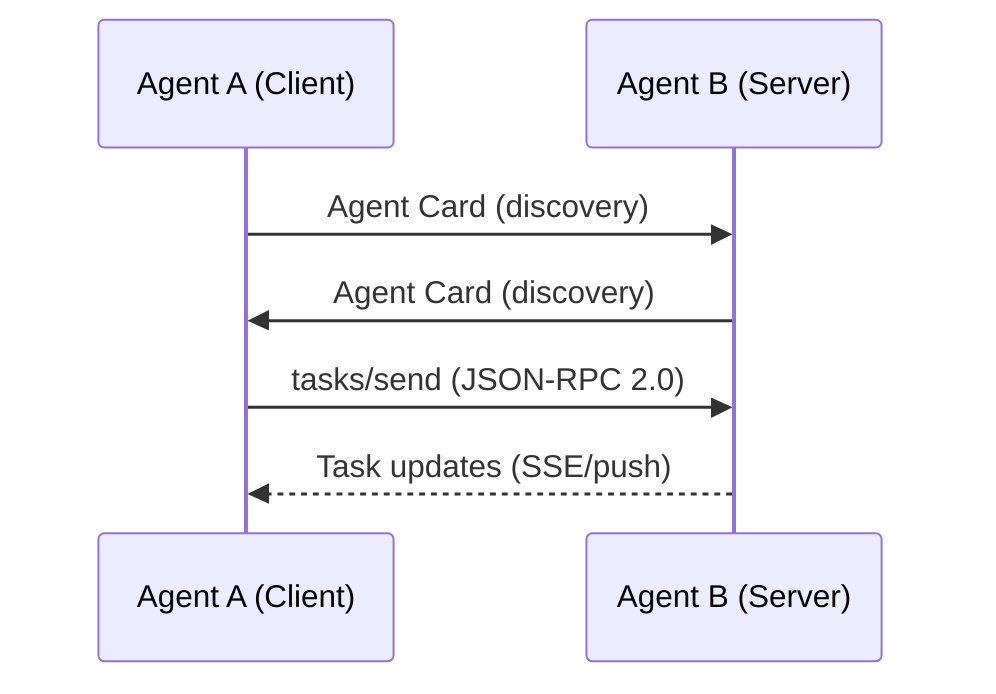
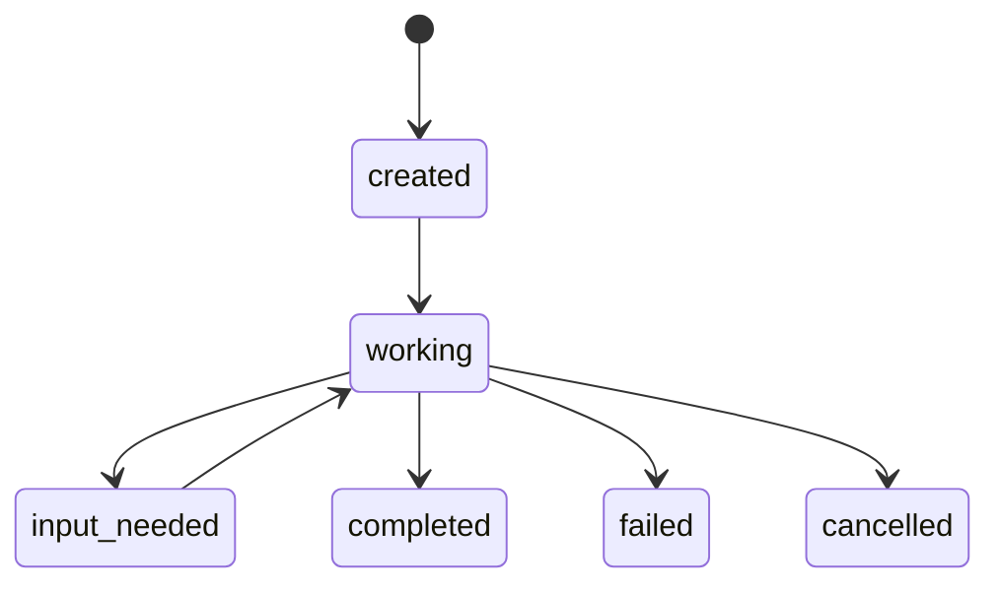
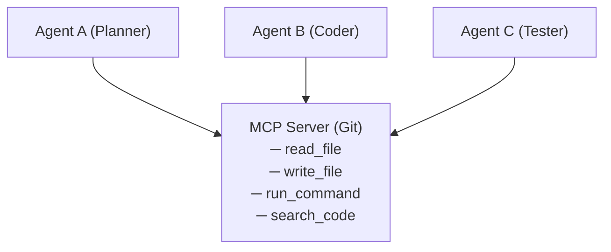
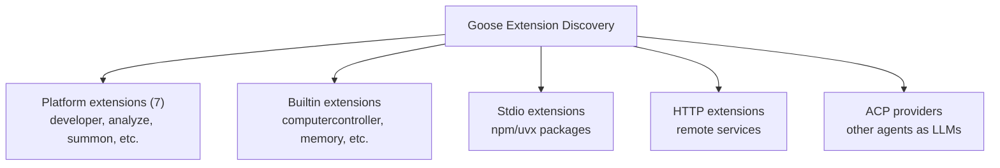

# Communication Protocols

Communication protocols define how agents discover each other, exchange information,
and coordinate actions. In multi-agent coding systems, the choice of communication
protocol fundamentally shapes the architecture — a tool-based protocol creates
hierarchical systems; a pub/sub bus creates event-driven systems; a standardized
agent-to-agent protocol enables cross-framework interoperability. This document
covers the major protocols used in and relevant to coding agents, from production
implementations to emerging standards.

---

## The Communication Protocol Landscape



---

## Google Agent2Agent (A2A) Protocol

The A2A protocol is the most ambitious attempt at standardizing agent-to-agent
communication. Developed by Google and contributed to the Linux Foundation,
A2A enables agents built on different frameworks to discover each other and
collaborate — without exposing internal state.

### Core Concepts



### Agent Cards

Every A2A agent publishes an **Agent Card** — a metadata document describing its
capabilities, similar to how APIs expose OpenAPI specifications:

```json
{
  "name": "CodeReviewer",
  "description": "Reviews code changes for bugs, style, and security issues",
  "url": "https://code-reviewer.example.com",
  "version": "1.0",
  "capabilities": {
    "streaming": true,
    "pushNotifications": true,
    "stateTransitionHistory": true
  },
  "skills": [
    {
      "id": "review-pull-request",
      "name": "Review Pull Request",
      "description": "Reviews a pull request for code quality and security",
      "inputModes": ["text/plain", "application/json"],
      "outputModes": ["text/plain", "application/json"]
    },
    {
      "id": "security-audit",
      "name": "Security Audit",
      "description": "Performs a security-focused code review",
      "inputModes": ["text/plain"],
      "outputModes": ["text/plain"]
    }
  ],
  "authentication": {
    "schemes": ["OAuth2", "Bearer"]
  }
}
```

### Task Lifecycle

A2A uses a task-based model with defined lifecycle states:



### A2A for Coding Agents

A2A is particularly relevant for coding agent ecosystems where different specialized
agents might be built by different teams or vendors:

```python
# A2A client requesting a code review
import httpx

async def request_code_review(agent_url, diff):
    """Send a code review task to an A2A-compliant agent"""
    task = {
        "jsonrpc": "2.0",
        "method": "tasks/send",
        "params": {
            "id": "review-123",
            "message": {
                "role": "user",
                "parts": [
                    {
                        "type": "text",
                        "text": f"Review this code change:\n\n{diff}"
                    }
                ]
            }
        },
        "id": "req-1"
    }

    async with httpx.AsyncClient() as client:
        response = await client.post(f"{agent_url}/a2a", json=task)
        return response.json()
```

### A2A Key Features

| Feature | Description | Coding Relevance |
|---------|-------------|-----------------|
| **Agent Discovery** | Find agents by capability via Agent Cards | Discover available code review, testing, deployment agents |
| **Flexible Interaction** | Sync, streaming (SSE), async (push) | Long-running tasks (builds, test suites) use async |
| **Opaque Execution** | Agents don't expose internals | Proprietary agents can participate in open ecosystems |
| **Rich Data Exchange** | Text, files, structured JSON | Pass diffs, file contents, test results |
| **Task Negotiation** | `input_needed` state for clarification | Agent can request more context about the codebase |

### A2A vs MCP

A key distinction that causes frequent confusion:

| Aspect | A2A | MCP |
|--------|-----|-----|
| Purpose | Agent-to-agent communication | Agent-to-tool communication |
| Relationship | Peer/client-server | Client-server |
| State | Task-based, stateful | Stateless tool calls |
| Discovery | Agent Cards | Tool schemas |
| Use case | "Agent A asks Agent B to review code" | "Agent uses grep tool to search files" |
| Analogy | Two developers talking | A developer using an IDE feature |

**They are complementary:** An A2A agent might internally use MCP to access tools.
A coding orchestrator might use A2A to communicate with specialist agents, while
each specialist uses MCP to access file system, git, and other tools.

---

## Model Context Protocol (MCP)

MCP, created by Anthropic, is the dominant protocol for connecting LLM agents to
tools and data sources. While not an agent-to-agent protocol, MCP is foundational
to how multi-agent coding systems access capabilities.

### MCP Architecture

```
┌──────────────────┐     ┌──────────────────┐
│   MCP Client     │     │   MCP Server     │
│   (Agent)        │     │   (Tool Provider)│
│                  │     │                  │
│  Discovers tools │────►│  Exposes tools   │
│  Calls tools     │     │  Handles calls   │
│  Reads resources │     │  Provides data   │
└──────────────────┘     └──────────────────┘
```

### MCP in Multi-Agent Systems

MCP becomes relevant to multi-agent systems in several ways:

**1. Shared tool access:** Multiple agents connect to the same MCP server:



**2. Agent-as-MCP-server:** An agent exposes itself as an MCP tool for other agents:

```python
# Agent B exposes its code review capability as an MCP tool
@mcp_server.tool()
async def review_code(diff: str, context: str = "") -> str:
    """Review a code change for bugs and style issues.

    Args:
        diff: The code diff to review
        context: Optional context about the change
    """
    result = await agent_b.review(diff, context)
    return result.summary
```

**3. Goose's MCP-first architecture:** Everything in Goose is an MCP server — file
editing, shell execution, memory, even the summon extension for sub-agent delegation.
This creates a uniform communication layer where multi-agent coordination uses the
same protocol as tool access.

### MCP Transport Types

| Transport | Description | Multi-Agent Use Case |
|-----------|-------------|---------------------|
| **stdio** | Standard I/O pipes | Local sub-agent communication |
| **StreamableHTTP** | HTTP with streaming | Remote agent services |
| **SSE** | Server-sent events | Real-time agent monitoring |

### SageAgent's MCP-Native Architecture

SageAgent was built with MCP as a core primitive — its ToolManager supports both
stdio and SSE MCP servers, allowing specialist agents to access tools through a
standardized interface:

```python
class ToolManager:
    """Manages MCP connections for all agents in the pipeline"""
    def __init__(self):
        self.stdio_servers = {}  # Local tools via stdio
        self.sse_servers = {}    # Remote tools via SSE

    async def get_tools_for_agent(self, agent_type):
        """Return appropriate tools based on agent role"""
        if agent_type == "executor":
            return await self.get_all_tools()
        elif agent_type == "researcher":
            return await self.get_read_only_tools()
        elif agent_type == "observer":
            return await self.get_analysis_tools()
```

---

## Tool-Based Communication

The most common communication pattern in production coding agents is **tool-based
communication** — agents communicate by invoking tools that represent other agents.

### Claude Code: Tool-Use Protocol

Claude Code's sub-agents are invoked through the standard Anthropic Messages API
tool-use protocol:

```json
{
  "role": "assistant",
  "content": [
    {
      "type": "tool_use",
      "id": "agent_call_1",
      "name": "Agent",
      "input": {
        "prompt": "Find all files that import from the auth module",
        "agent_type": "explore"
      }
    }
  ]
}
```

The sub-agent executes in isolation and returns results as a `tool_result`:

```json
{
  "role": "user",
  "content": [
    {
      "type": "tool_result",
      "tool_use_id": "agent_call_1",
      "content": "Found 15 files importing from auth module:\n1. src/routes/users.ts..."
    }
  ]
}
```

**Key property:** This is structurally identical to any other tool call. The
orchestrator doesn't need special logic for sub-agents — they're just tools that
happen to contain an LLM.

### OpenAI Agents SDK: Agents-as-Tools

The Agents SDK formalizes this pattern:

```python
from agents import Agent

researcher = Agent(
    name="Researcher",
    instructions="Research the codebase to answer questions.",
    tools=[grep_tool, read_tool],
)

# Expose researcher as a tool for the orchestrator
research_tool = researcher.as_tool(
    tool_name="research_codebase",
    tool_description="Research the codebase for information about specific topics"
)

orchestrator = Agent(
    name="Orchestrator",
    tools=[research_tool],
)
```

### AutoGen: AgentTool Pattern

Microsoft AutoGen uses a similar approach:

```python
from autogen_agentchat.agents import AssistantAgent
from autogen_agentchat.tools import AgentTool

math_agent = AssistantAgent(
    "math_expert",
    model_client=model_client,
    system_message="You are a math expert.",
    description="A math expert assistant.",
)

math_tool = AgentTool(math_agent, return_value_as_last_message=True)

orchestrator = AssistantAgent(
    "assistant",
    tools=[math_tool],
)
```

---

## Structured Message Passing

Some systems use structured messages with defined schemas for inter-agent communication:

### Codex CLI: SQ/EQ Pattern

Codex CLI uses a **Submission Queue / Event Queue** pattern for structured message
passing between the orchestrator and workers:

```rust
// Codex agent message types
enum AgentMessage {
    // From orchestrator to worker
    SpawnAgent { role: AgentRole, prompt: String, config: AgentConfig },
    SendInput { agent_id: AgentId, input: String },
    InterruptAgent { agent_id: AgentId },
    CloseAgent { agent_id: AgentId },

    // From worker to orchestrator
    AgentOutput { agent_id: AgentId, content: String },
    AgentComplete { agent_id: AgentId, result: AgentResult },
    AgentError { agent_id: AgentId, error: String },
}
```

**The SQ/EQ pattern allows multiple frontends** (TUI, exec mode, app-server, MCP)
to drive the same agent core — the message protocol is decoupled from the UI layer.

### OpenHands: Action/Observation Protocol

OpenHands defines a symmetric protocol where every event is either an **Action**
(intent to do something) or an **Observation** (result of something done):

```python
# Action types
class CmdRunAction(Action):
    command: str
    thought: str

class FileWriteAction(Action):
    path: str
    content: str

class AgentDelegateAction(Action):
    agent: str
    inputs: dict

# Corresponding observation types
class CmdOutputObservation(Observation):
    command_id: int
    content: str
    exit_code: int

class FileWriteObservation(Observation):
    path: str
    content: str

class AgentDelegateObservation(Observation):
    agent: str
    outputs: dict
```

**The `cause` field** creates a causal graph — each Observation links back to the
Action that caused it. This enables full replay and debugging of multi-agent
interactions.

---

## Agent Discovery

Before agents can communicate, they must discover each other. Several patterns exist:

### Static Registration

Agents are known at system startup. Most production coding agents use this approach.

```python
# Claude Code: sub-agent types are hardcoded
AGENT_TYPES = {
    "explore": ExploreAgent(model="haiku", tools=read_only_tools),
    "plan": PlanAgent(model=parent_model, tools=read_only_tools),
    "general-purpose": GeneralAgent(model=parent_model, tools=all_tools),
}

# Custom agents loaded from .claude/agents/ directory
custom_agents = load_custom_agents(".claude/agents/")
AGENT_TYPES.update(custom_agents)
```

### Dynamic Discovery via Agent Cards (A2A)

Agents publish cards that other agents can query:

```python
# Discover agents in the network
async def discover_agents(registry_url):
    response = await httpx.get(f"{registry_url}/.well-known/agent.json")
    agent_card = response.json()
    return agent_card

# Find an agent with specific skills
async def find_agent_for_task(task_type, registry):
    agents = await registry.list_agents()
    for agent in agents:
        if task_type in [s["id"] for s in agent["skills"]]:
            return agent
    return None
```

### Extension-Based Discovery (Goose)

Goose discovers agent capabilities through its extension system:



### OpenHands: Microagent Discovery

OpenHands discovers microagents through a keyword-matching system:

```python
# KnowledgeMicroagent — triggered by keywords in conversation
class KnowledgeMicroagent:
    triggers: list[str]  # e.g., ["django", "django-rest-framework"]
    content: str          # Expert knowledge about the topic

# When the user mentions "django", the Django microagent is
# automatically injected into the agent's context
```

---

## Communication Pattern Summary

| Agent | Protocol | Direction | Format | Discovery |
|-------|----------|-----------|--------|-----------|
| **Claude Code** | Tool-use (Messages API) | Orchestrator → worker | JSON tool_use/tool_result | Static + custom agents dir |
| **Codex CLI** | SQ/EQ message passing | Bidirectional | Rust enums (typed) | Static roles |
| **ForgeCode** | Bounded context passing | Orchestrator → worker | Summarized context | Static 3-agent model |
| **SageAgent** | Pipeline handoff | Linear + feedback | Agent output → next input | Static 5-agent pipeline |
| **OpenHands** | EventStream pub/sub | Broadcast | Action/Observation types | Subscriber registration |
| **Capy** | Spec document | Captain → Build | Natural language spec | Static 2-agent model |
| **Goose** | MCP (universal) | Client → server | MCP protocol messages | Extension discovery |
| **Junie CLI** | Backend proxy | Agent → JetBrains server | HTTP/API | Server-side routing |
| **OpenAI Agents SDK** | Handoffs / tools | Peer or hierarchical | Function returns | Static agent definitions |
| **Google A2A** | JSON-RPC 2.0 | Client → server | Structured tasks | Agent Cards |
| **AutoGen** | AgentChat messages | Peer or hierarchical | Python objects | Static registration |

---

## Design Considerations

### Choosing a Communication Protocol

```
Is your system...

Single codebase, same process?
  └── Use tool-based communication (Claude Code, Agents SDK pattern)

Multiple processes, same machine?
  └── Use stdio MCP or message queues (Goose, local MCP servers)

Distributed across machines?
  └── Use HTTP-based protocols (A2A, StreamableHTTP MCP)

Multiple independent teams building agents?
  └── Use A2A for interoperability

Need real-time monitoring?
  └── Use pub/sub or event streaming (OpenHands EventStream)
```

### Protocol Overhead vs Flexibility Trade-off

| Protocol Complexity | Overhead | Flexibility | Example |
|--------------------|----------|-------------|---------|
| Direct function call | Minimal | Low | Aider architect mode |
| Tool-use protocol | Low | Medium | Claude Code sub-agents |
| Message queue | Medium | High | Codex SQ/EQ |
| Event stream | Medium | Very High | OpenHands EventStream |
| HTTP/A2A | High | Maximum | A2A agent networks |

---

## Cross-References

- [context-sharing.md](./context-sharing.md) — What data flows through these protocols
- [orchestrator-worker.md](./orchestrator-worker.md) — How protocols enable orchestration
- [peer-to-peer.md](./peer-to-peer.md) — Protocols for peer communication
- [swarm-patterns.md](./swarm-patterns.md) — Handoff-based protocols
- [real-world-examples.md](./real-world-examples.md) — Protocol implementations in practice

---

## References

- Google. "Agent2Agent Protocol." 2025. https://github.com/a2aproject/A2A
- Anthropic. "Model Context Protocol." 2024. https://modelcontextprotocol.io
- OpenAI. "Agents SDK." 2025. https://github.com/openai/openai-agents-python
- Microsoft. "AutoGen." 2024. https://github.com/microsoft/autogen
- Research files: `/research/agents/claude-code/`, `/research/agents/codex/`, `/research/agents/openhands/`, `/research/agents/goose/`, `/research/agents/sage-agent/`
