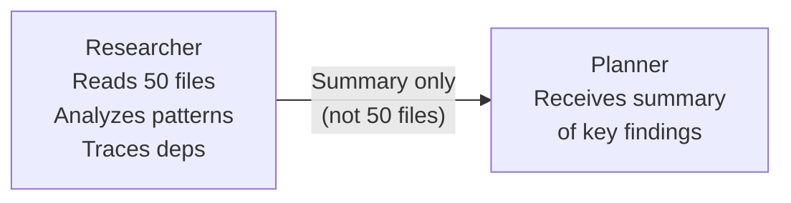
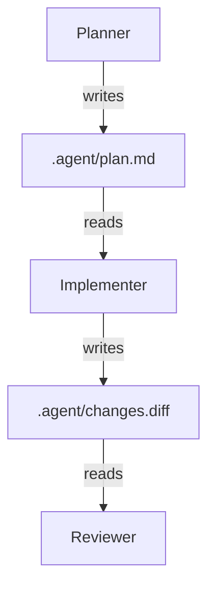
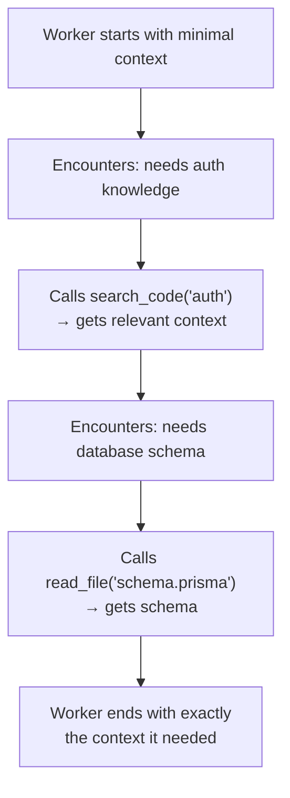
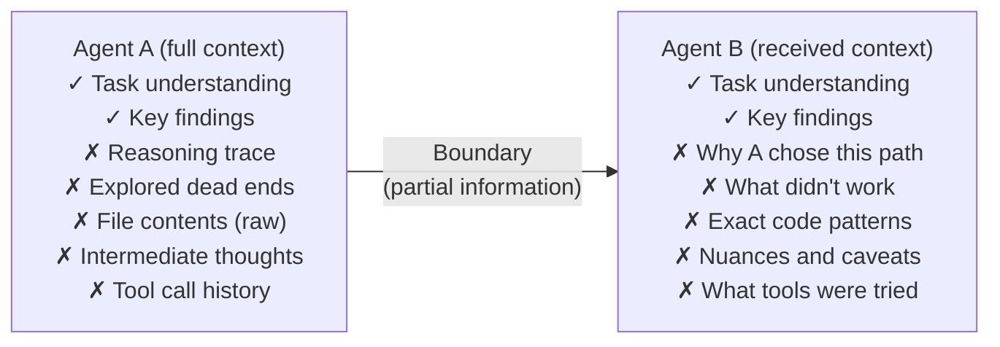
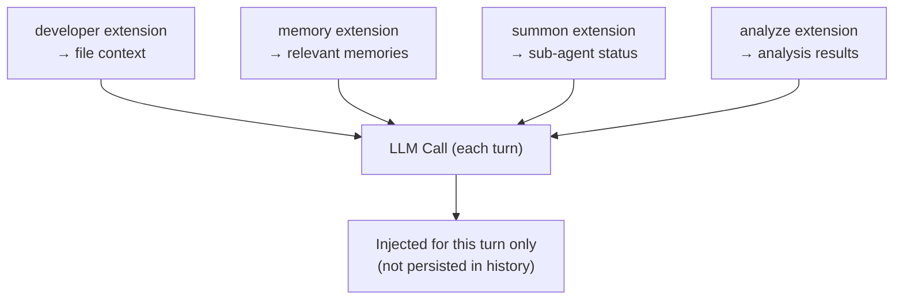

# Context Sharing Between Agents

Context sharing is the hardest problem in multi-agent systems. Every agent boundary
creates an information bottleneck — the orchestrator knows the user's intent, the
researcher knows the codebase details, the implementer knows the current file state,
but no single agent knows everything. How context flows between agents determines
whether a multi-agent system produces coherent results or fragmented, inconsistent
output. Across all production coding agents we studied, **context management is the
primary motivation for adopting multi-agent architecture** — not task specialization,
not parallelism, but the ability to keep each agent's context window focused.

---

## The Context Problem

LLMs have finite context windows. A single agent handling a complex coding task
faces a fundamental tension:

```
┌──────────────────────────────────────────────┐
│              CONTEXT WINDOW                   │
│                                              │
│  System prompt ████████░░░░░░░░░░░░░░░░░░░  │
│  Conversation  ██████████████░░░░░░░░░░░░░  │
│  File contents ████████████████████████████  │ ← FULL
│  Tool results  ████████████████████████████  │ ← FULL
│  Available for ░░░░░░░░░░░░░░░░░░░░░░░░░░░  │ ← NONE
│  reasoning                                   │
│                                              │
│  Problem: No room left for the LLM to think  │
└──────────────────────────────────────────────┘
```

Multi-agent systems solve this by **distributing context across multiple windows**:

```
┌──────────────────┐  ┌──────────────────┐  ┌──────────────────┐
│ Orchestrator      │  │ Researcher        │  │ Implementer       │
│                  │  │                  │  │                  │
│ System    ████░  │  │ System    ████░  │  │ System    ████░  │
│ Conv      ████░  │  │ Research  ████░  │  │ Plan      ████░  │
│ Summaries ████░  │  │ Files     ████░  │  │ Files     ████░  │
│ Plan      ████░  │  │ Analysis  ████░  │  │ Changes   ████░  │
│ Reasoning ████░  │  │ Summary   ████░  │  │ Tests     ████░  │
│           ░░░░░  │  │           ░░░░░  │  │           ░░░░░  │
│                  │  │                  │  │                  │
│ Each agent has   │  │ Focused on       │  │ Focused on       │
│ room to think    │  │ research only    │  │ implementation   │
└──────────────────┘  └──────────────────┘  └──────────────────┘
```

---

## Context Sharing Strategies

### Strategy 1: Summary-Based Handoff

The most common pattern — Agent A works, produces a summary, passes the summary
(not the raw data) to Agent B.



**ForgeCode's bounded context** is the exemplar of this pattern. Each agent
boundary is a deliberate compression point:

1. Sage explores the codebase → produces a focused research summary
2. Muse receives the summary → produces an implementation plan
3. Forge receives the plan → executes with full read-write access

**The compression ratio matters.** If Sage reads 50 files (perhaps 50,000 tokens
of raw content), the summary might be 500 tokens — a 100x compression. This
ensures the receiving agent has room in its context window for reasoning.

```python
# ForgeCode's bounded context flow (conceptual)

def sage_research(query, codebase):
    """Sage explores and returns compressed findings"""
    raw_files = search_files(query, codebase)  # 50,000 tokens
    analysis = llm.call(
        system="You are a code researcher. Analyze these files and produce "
               "a concise summary of findings relevant to the query.",
        user=f"Query: {query}\n\nFiles:\n{raw_files}",
    )
    return analysis.summary  # ~500 tokens

def muse_plan(research_summary, task):
    """Muse plans using only the summary, not raw files"""
    plan = llm.call(
        system="You are a code architect. Create an implementation plan.",
        user=f"Task: {task}\n\nResearch findings:\n{research_summary}",
    )
    return plan

def forge_execute(plan, task):
    """Forge executes using the plan — reads files fresh as needed"""
    # Forge reads files it needs directly, not from cache
    for step in plan.steps:
        file_content = read_file(step.target_file)  # Fresh read
        edit = generate_edit(step, file_content)
        apply_edit(edit)
```

**Key insight:** Forge reads files **fresh** during execution, not from Sage's
cache. This prevents stale data and keeps each agent's context independent.

### Strategy 2: Specification Document

The orchestrator produces a detailed specification that workers follow. This is
the **write-only interface** — the spec is the only communication channel.

**Capy's Captain → Build spec:**

```markdown
## Task Specification

### Goal
Replace session-based authentication with JWT tokens.

### Context
- Current auth: passport.js with local + OAuth strategies
- 15 route handlers depend on req.user
- Test coverage: 78% on auth module

### Implementation Steps
1. Create src/auth/jwt.ts with sign/verify/refresh functions
2. Create src/middleware/jwt-auth.ts replacing passport middleware
3. Update each of the 15 route handlers (list below)
4. Update src/config/auth.ts with JWT configuration
5. Remove passport.js dependency from package.json

### Affected Files
[explicit list with expected changes per file]

### Testing Requirements
- All existing auth tests must pass
- Add JWT-specific tests: token expiry, refresh, invalid tokens
- Integration test for full auth flow

### Acceptance Criteria
- No passport.js imports remain
- All tests pass
- JWT tokens include user ID and roles
```

**Why this works:** Build (the execution agent) cannot ask clarifying questions.
The spec must be complete because it's the only context Build receives. This
**forcing function** produces higher-quality specifications than systems where
the implementer can always ask for more information.

### Strategy 3: Event Stream / Shared State

All agents share a common event bus and can read events from any other agent.

**OpenHands' EventStream:**

```python
class EventStream:
    def add_event(self, event, source):
        event._id = self._cur_id
        self._cur_id += 1
        self.file_store.write(event)  # Persistent storage
        for subscriber in self._subscribers:
            subscriber.executor.submit(subscriber.callback, event)

    def get_events(self, start_id=0, end_id=None, event_type=None):
        """Any agent can read the full event history"""
        return self.file_store.read(start_id, end_id, event_type)
```

**Advantages:**
- Full auditability — every event is recorded
- Any agent can access any other agent's output
- Crash recovery — replay events from persistent storage

**Disadvantages:**
- Information overload — agents must filter relevant events
- No compression — raw event data grows unboundedly
- Coupling — agents become dependent on event format

### Strategy 4: File-Based Communication

Agents communicate through the file system — writing plans, specs, or results
to files that other agents read.



**Used by:**
- Capy (spec document as file)
- OpenHands (microagent definitions as markdown files in `.openhands/microagents/`)
- Claude Code (custom agent definitions as markdown files in `.claude/agents/`)

### Strategy 5: Database-Backed State

Agents share state through a database, enabling structured queries and persistence.

```python
class AgentStateDB:
    def __init__(self, db_path):
        self.conn = sqlite3.connect(db_path)
        self.conn.execute("""
            CREATE TABLE IF NOT EXISTS agent_state (
                agent_id TEXT,
                key TEXT,
                value TEXT,
                updated_at TIMESTAMP DEFAULT CURRENT_TIMESTAMP,
                PRIMARY KEY (agent_id, key)
            )
        """)
        self.conn.execute("""
            CREATE TABLE IF NOT EXISTS shared_context (
                id INTEGER PRIMARY KEY AUTOINCREMENT,
                source_agent TEXT,
                target_agent TEXT,  -- NULL means broadcast
                context_type TEXT,  -- 'research', 'plan', 'result'
                content TEXT,
                created_at TIMESTAMP DEFAULT CURRENT_TIMESTAMP
            )
        """)

    def share_context(self, source, target, ctx_type, content):
        self.conn.execute(
            "INSERT INTO shared_context (source_agent, target_agent, context_type, content) "
            "VALUES (?, ?, ?, ?)",
            (source, target, ctx_type, content)
        )
        self.conn.commit()

    def get_context_for_agent(self, agent_id, ctx_type=None):
        query = "SELECT * FROM shared_context WHERE target_agent = ? OR target_agent IS NULL"
        params = [agent_id]
        if ctx_type:
            query += " AND context_type = ?"
            params.append(ctx_type)
        return self.conn.execute(query, params).fetchall()
```

**OpenCode's SQLite approach:** OpenCode uses per-project SQLite databases for
persistent agent state, enabling session resumption and cross-session context.

---

## How Orchestrators Pass Context to Workers

The orchestrator's primary challenge is deciding **what context each worker needs**.
Too little, and the worker can't complete the task. Too much, and the worker's
context window fills with irrelevant information.

### Relevance Filtering

```python
def prepare_worker_context(task, worker_role, full_context):
    """Filter context to what's relevant for this worker's role"""

    if worker_role == "researcher":
        # Researchers need: task description, known file patterns
        return {
            "task": task.description,
            "known_patterns": task.file_patterns,
            "codebase_structure": get_tree_summary(),
        }

    elif worker_role == "implementer":
        # Implementers need: specific plan, affected files, constraints
        return {
            "plan": task.implementation_plan,
            "affected_files": task.file_list,
            "coding_standards": get_project_standards(),
            "test_patterns": get_test_patterns(),
        }

    elif worker_role == "reviewer":
        # Reviewers need: the diff, original requirements, test results
        return {
            "diff": task.generated_diff,
            "requirements": task.original_request,
            "test_results": task.test_output,
        }
```

### Progressive Context Disclosure

Instead of giving workers all context upfront, provide it progressively as needed:



**Claude Code's explore sub-agent** implements this naturally — the sub-agent
reads files on demand, building its own context window with exactly what it
discovers. Only the summary returns to the orchestrator.

### ForgeCode's Context Engine

ForgeCode uses a sophisticated **semantic entry-point discovery** system to
determine which context is relevant:

```
User request → ForgeCode Context Engine
                    │
                    ├── sem_search (indexed project)
                    │   "Up to 93% fewer tokens"
                    │
                    ├── File dependency graph
                    │
                    ├── Dynamic skill matching
                    │
                    └── Progressive reasoning budget
                        Messages 1–10:  very high thinking
                        Messages 11+:   low thinking
                        Verification:   high thinking again
```

The key metric: **93% fewer tokens** compared to including all possibly-relevant
files. This compression is what makes multi-agent coordination practical — without
it, agents would spend most of their context windows on irrelevant content.

---

## Context Loss at Agent Boundaries

Every agent handoff loses information. Understanding what's lost helps design
better context-sharing strategies.

### What Gets Lost



### Mitigating Context Loss

**1. Structured summaries with explicit sections:**

```python
def create_handoff_summary(agent_context):
    """Create a summary that preserves key information"""
    return f"""
## Task Summary
{agent_context.task_description}

## Key Findings
{agent_context.findings}

## Approach Taken
{agent_context.approach}

## What Was Tried (and didn't work)
{agent_context.dead_ends}

## Important Caveats
{agent_context.caveats}

## Files of Interest
{agent_context.relevant_files}

## Recommended Next Steps
{agent_context.recommendations}
"""
```

**2. Explicit "what I tried" sections** (preventing repeated work):

```
Researcher → Implementer:
"I searched for the auth middleware using these patterns:
- grep 'passport' → found in 15 files
- grep 'authenticate' → found in 22 files (many are test files)
- The actual middleware is in src/middleware/auth.ts (line 45-89)
DO NOT search for 'passport' again — I've already covered it."
```

**3. Reference-based context** (point to files rather than including them):

```
Instead of: "Here's the full content of auth.ts: [5000 tokens]"
Better:     "The auth middleware is in src/middleware/auth.ts.
             Key function: verifyToken() at line 45.
             It uses passport.authenticate('jwt') strategy.
             Read the file directly if you need the full implementation."
```

---

## Goose's MOIM Pattern

Goose implements a unique context-sharing pattern called **MOIM** (Model-Oriented
Information Management) — per-turn context injection from all extensions:



Additionally, Goose uses **background tool-pair summarization** — when tool results
grow old in the conversation, they're proactively summarized to free context space.

---

## Context Sharing Anti-Patterns

### 1. Passing Everything

Sending the entire conversation history or all file contents to every worker.

```python
# BAD: Worker gets overwhelmed with irrelevant context
worker.execute(
    task="Fix the typo in README.md",
    context=entire_conversation_history,  # 50,000 tokens of research on auth module
)
```

### 2. Passing Nothing

Assuming the worker can figure it out on its own.

```python
# BAD: Worker has no context to work with
worker.execute(
    task="Fix the bug",  # Which bug? Where? What's the expected behavior?
)
```

### 3. Stale Context

Passing context that was generated before other agents made changes.

```python
# BAD: Reviewer gets pre-change file content
reviewer.review(
    original_file=file_content_from_10_minutes_ago,  # Stale!
    diff=current_diff,  # But this is current
)
```

### 4. Circular Context

Agent A summarizes for B, B summarizes for C, C summarizes back to A —
each summarization loses fidelity.

```
A's full context (10,000 tokens)
  → summarized to 1,000 tokens for B
    → B summarizes to 200 tokens for C
      → C summarizes to 50 tokens for A
        → A now has a 50-token shadow of its own original context
```

---

## Measuring Context Effectiveness

How do you know if your context sharing is working? Key metrics:

| Metric | Good Sign | Bad Sign |
|--------|-----------|----------|
| Worker retries | < 10% of tasks need retry | > 30% need retry |
| Redundant research | Workers don't re-search what was already found | Workers repeat searches |
| Context utilization | Workers use most of the provided context | Workers ignore most context |
| Output coherence | Multi-worker output is consistent | Workers contradict each other |
| Token efficiency | Summary ≤ 10% of raw data | Summary ≈ raw data size |

---

## Cross-References

- [orchestrator-worker.md](./orchestrator-worker.md) — How orchestrators distribute context
- [communication-protocols.md](./communication-protocols.md) — Wire formats for context transfer
- [specialist-agents.md](./specialist-agents.md) — Role-specific context needs
- [evaluation-agent.md](./evaluation-agent.md) — Context for quality evaluation

---

## References

- Anthropic. "Building Effective Agents." 2024. https://www.anthropic.com/research/building-effective-agents
- Research files: `/research/agents/forgecode/`, `/research/agents/claude-code/`, `/research/agents/openhands/`, `/research/agents/goose/`, `/research/agents/capy/`
