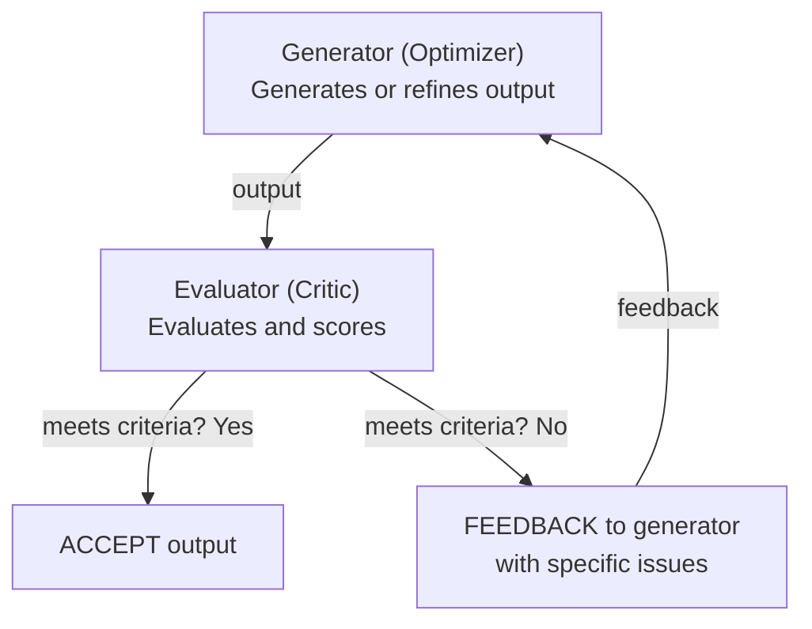
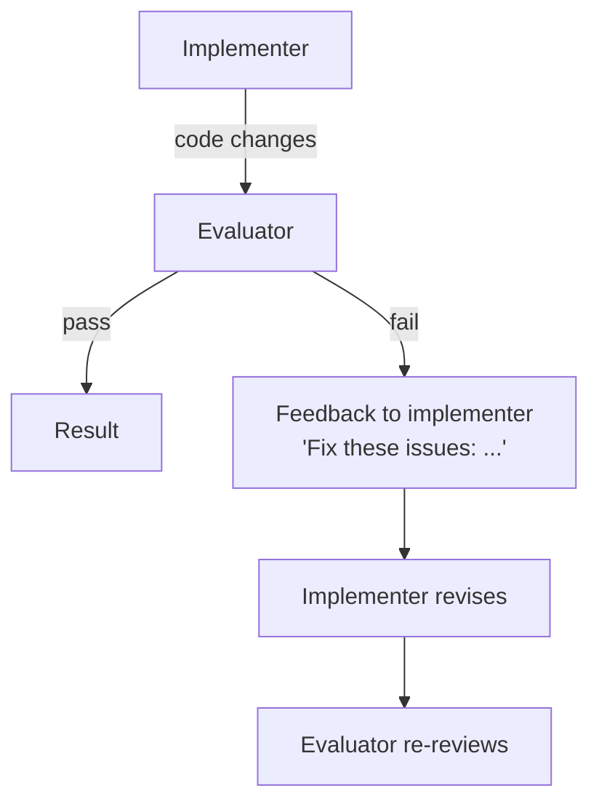
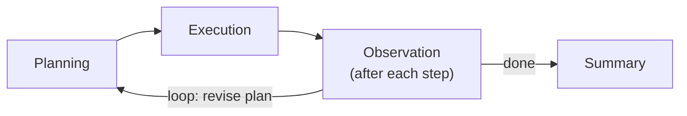
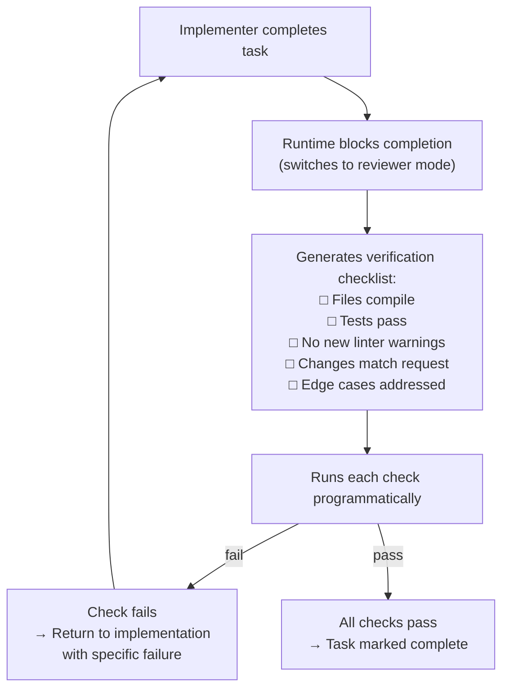
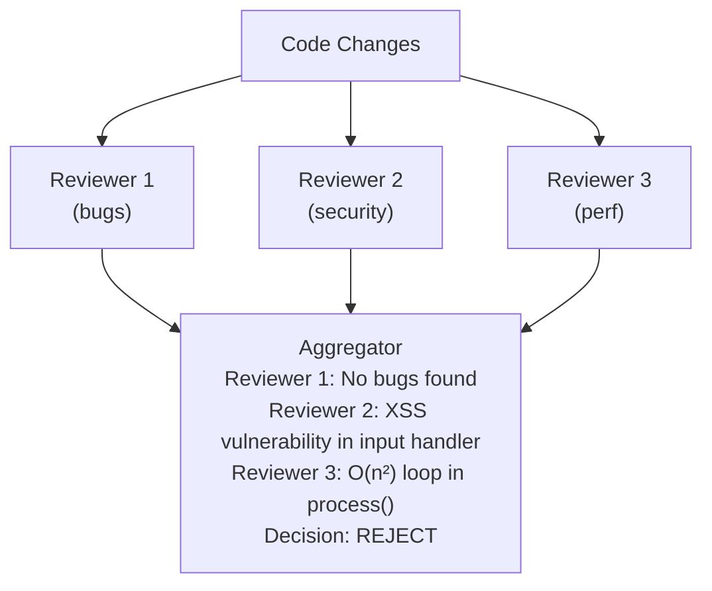
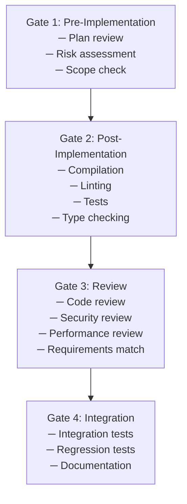
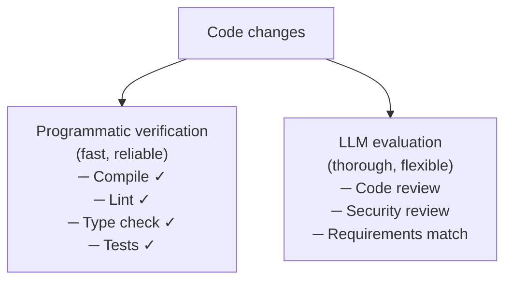

# Evaluation and Critic Agents

Evaluation agents — also called critics, reviewers, or observers — are specialized
agents whose sole purpose is to assess the quality of other agents' outputs. They
represent one of Anthropic's core agentic patterns (**evaluator-optimizer**) and are
the mechanism by which multi-agent systems enforce quality without relying on the
implementer to check its own work. The fundamental insight is simple: **the agent
that generates code should not be the same agent that evaluates it**, just as the
developer who writes code should not be the only reviewer.

---

## Why Separate Evaluators Matter

A single agent asked to both implement and verify faces a psychological (or rather,
statistical) bias: it has already committed to an approach and will tend to confirm
rather than critique its own work. Separate evaluators break this bias:

```
Single Agent (self-review):
  "I implemented JWT auth and it looks correct to me."
  → Misses: token expiry edge case, missing refresh flow

Separate Evaluator:
  "The implementation has two issues:
   1. Token expiry is set but never checked on incoming requests
   2. Refresh tokens are stored in localStorage (XSS vulnerable)"
  → Catches what the implementer missed
```

ForgeCode's research found that **enforced verification was their biggest single
improvement** — the agent literally cannot mark a task as complete without running
a verification pass. This is not optional, not prompt-based — it's architecturally
enforced.

---

## Anthropic's Evaluator-Optimizer Pattern

Anthropic describes the evaluator-optimizer as a two-agent loop where one agent
generates and another evaluates, iterating until quality criteria are met:



**When to use (from Anthropic):**

> This workflow is particularly effective when we have clear evaluation criteria,
> and when iterative refinement provides measurable value. The two signs of good fit
> are: first, that LLM responses can be demonstrably improved when a human articulates
> their feedback; and second, that the LLM can provide such feedback.

Code is an ideal domain for this pattern because:
1. Quality criteria are often concrete (tests pass, linter clean, no type errors)
2. LLMs can effectively critique code they didn't write
3. Iterative refinement measurably improves code quality

---

## Evaluation Agent Architectures

### Architecture 1: Post-Implementation Review

The evaluator runs after the implementer completes, acting as a quality gate:



```python
def implement_with_review(task, max_iterations=3):
    """Implementation loop with separate evaluator"""
    for iteration in range(max_iterations):
        # Generator produces or refines code
        if iteration == 0:
            changes = implementer.generate(task)
        else:
            changes = implementer.revise(task, changes, feedback)

        # Evaluator assesses the changes
        evaluation = evaluator.review(task, changes)

        if evaluation.passes:
            return changes  # Quality gate passed

        feedback = evaluation.feedback
        # Loop continues with feedback

    return PartialResult(changes, "Max iterations reached", feedback)
```

### Architecture 2: Continuous Observation (SageAgent)

SageAgent's ObservationAgent monitors execution continuously, not just at the end:



```python
class ObservationAgent(AgentBase):
    """Monitors execution progress and provides feedback"""

    def observe(self, execution_state):
        assessment = self.llm.call(
            system="You are an execution observer. Assess whether the "
                   "current execution is on track. Check for:\n"
                   "- Deviation from the plan\n"
                   "- Errors in tool outputs\n"
                   "- Missing steps\n"
                   "- Quality issues in generated code",
            user=f"Plan: {execution_state.plan}\n"
                 f"Completed steps: {execution_state.completed}\n"
                 f"Current step output: {execution_state.current_output}",
        )

        if assessment.on_track:
            return ContinueExecution()
        else:
            return RevisePlan(
                feedback=assessment.issues,
                suggested_corrections=assessment.corrections,
            )
```

**The key advantage:** Continuous observation catches errors early — before
they compound across subsequent steps. A wrong assumption in Step 2 is caught
before Step 3 builds on it.

### Architecture 3: Programmatic Verification (ForgeCode)

ForgeCode's verification is not an LLM review — it's a **programmatic enforcement**
that requires specific checks to pass before task completion:



```python
# ForgeCode's enforced verification (conceptual)
class VerificationSkill:
    def verify(self, task, changes):
        checklist = self.generate_checklist(task, changes)

        for check in checklist:
            result = self.run_check(check)
            if not result.passed:
                return VerificationFailed(
                    check=check,
                    reason=result.reason,
                    suggestion=result.fix_suggestion,
                )

        return VerificationPassed()

    def run_check(self, check):
        """Programmatic checks — not LLM-based"""
        if check.type == "tests":
            return run_tests(check.test_command)
        elif check.type == "linter":
            return run_linter(check.linter_config)
        elif check.type == "compile":
            return compile_project(check.build_command)
        elif check.type == "review":
            # This one IS LLM-based — but with high thinking budget
            return llm_review(check.criteria, check.changes)
```

**"The biggest single improvement"** — ForgeCode's team reports this enforced
verification pattern as their most impactful quality improvement. The agent cannot
skip verification, cannot override it, and the runtime architecture makes
verification mandatory.

### Architecture 4: Multi-Reviewer Consensus

Multiple evaluators independently review the same changes, similar to Anthropic's
"voting" parallelization pattern:



```python
async def multi_reviewer_evaluation(changes, reviewers):
    """Multiple reviewers evaluate in parallel"""
    # Run all reviews concurrently
    reviews = await asyncio.gather(*[
        reviewer.review(changes) for reviewer in reviewers
    ])

    # Aggregate findings
    all_issues = []
    for review in reviews:
        all_issues.extend(review.issues)

    # Deduplicate overlapping findings
    unique_issues = deduplicate_issues(all_issues)

    # Decision: any critical issue blocks
    critical = [i for i in unique_issues if i.severity == "critical"]
    if critical:
        return EvaluationResult(passed=False, issues=unique_issues)

    # Decision: majority must approve for non-critical
    approvals = sum(1 for r in reviews if r.approved)
    if approvals / len(reviews) >= 0.6:
        return EvaluationResult(passed=True, warnings=unique_issues)

    return EvaluationResult(passed=False, issues=unique_issues)
```

---

## Quality Gates in Multi-Agent Systems

Quality gates are checkpoints where evaluation must pass before proceeding:

### Gate Types



### Programmatic vs LLM-Based Gates

| Gate Type | Programmatic | LLM-Based |
|-----------|-------------|-----------|
| **Tests pass** | ✓ `npm test` exit code | Not needed |
| **Linter clean** | ✓ `eslint` exit code | Not needed |
| **Type check** | ✓ `tsc --noEmit` exit code | Not needed |
| **Code review** | Partial (static analysis) | ✓ LLM evaluator |
| **Security review** | Partial (SAST tools) | ✓ LLM evaluator |
| **Requirements match** | ✗ Not automatable | ✓ LLM evaluator |
| **Plan quality** | ✗ Not automatable | ✓ LLM evaluator |

**Best practice:** Use programmatic gates wherever possible. Reserve LLM-based
evaluation for subjective or complex assessments that tools can't automate.

### Junie CLI's Test-Driven Verification

Junie CLI implements a tight verification loop focused on test results:

```
1. Identify relevant tests
2. Run baseline tests (before changes)
3. Implement changes
4. Run tests again
5. If failures:
   a. Diagnose failure cause
   b. Generate fix
   c. Apply fix
   d. Re-run tests
   e. Repeat (max 3-5 iterations)
6. Return result with test evidence
```

This is a **programmatic evaluator-optimizer loop** — the test suite is the evaluator,
the implementer is the optimizer, and the loop continues until tests pass or the
iteration budget is exhausted.

---

## Evaluator Prompt Design

Effective evaluator prompts differ from generator prompts. Key principles:

### Be Specific About Criteria

```python
evaluator = Agent(
    instructions="""You are a code reviewer. Evaluate the changes against
    these SPECIFIC criteria:

    1. CORRECTNESS: Does the code do what the task requires?
       - Check every requirement from the original request
       - Verify edge cases are handled

    2. SAFETY: Are there security or data integrity issues?
       - SQL injection, XSS, path traversal
       - Unvalidated input, missing auth checks

    3. PERFORMANCE: Are there performance concerns?
       - O(n²) or worse algorithms
       - Missing pagination on database queries
       - Unnecessary file I/O

    4. MAINTAINABILITY: Is the code clear and well-structured?
       - Follows existing patterns in the codebase
       - Reasonable function/variable names

    For each issue found, provide:
    - Severity: CRITICAL / HIGH / MEDIUM / LOW
    - Location: File and line number
    - Description: What's wrong
    - Suggestion: How to fix it

    If no issues found, explicitly state "APPROVED — no issues found."
    Do NOT invent issues to seem thorough."""
)
```

### Require Structured Output

```python
# Force evaluator to produce structured, parseable output
evaluation_schema = {
    "type": "object",
    "properties": {
        "approved": {"type": "boolean"},
        "summary": {"type": "string"},
        "issues": {
            "type": "array",
            "items": {
                "type": "object",
                "properties": {
                    "severity": {"enum": ["critical", "high", "medium", "low"]},
                    "file": {"type": "string"},
                    "line": {"type": "integer"},
                    "description": {"type": "string"},
                    "suggestion": {"type": "string"},
                }
            }
        },
        "score": {"type": "number", "minimum": 0, "maximum": 10}
    }
}
```

### Prevent Rubber-Stamping

Evaluators can be too lenient. Counter this with explicit instructions:

```python
evaluator_instructions = """
You are a STRICT code reviewer. Your job is to find problems.

IMPORTANT: You will be evaluated on whether you catch real bugs.
Missing a bug is worse than a false positive.

NEVER approve changes that:
- Don't include error handling
- Have untested code paths
- Introduce security vulnerabilities
- Break existing tests

If you're uncertain about something, flag it as a concern.
"""
```

---

## Evaluation Loops in Practice

### Simple Loop (2 Iterations Max)

```python
async def simple_eval_loop(task):
    code = await generator.implement(task)
    review = await evaluator.review(code, task)

    if review.approved:
        return code

    # One revision attempt
    revised = await generator.revise(code, review.feedback)
    final_review = await evaluator.review(revised, task)

    return revised  # Return regardless — user can further iterate
```

### Adaptive Loop (Iteration Budget Based on Complexity)

```python
async def adaptive_eval_loop(task):
    complexity = assess_complexity(task)
    max_iterations = min(complexity.score, 5)  # Cap at 5

    code = await generator.implement(task)

    for i in range(max_iterations):
        review = await evaluator.review(code, task)

        if review.approved:
            return EvalResult(code=code, iterations=i+1, approved=True)

        if review.score > 8:  # Good enough, minor issues
            return EvalResult(code=code, iterations=i+1, approved=True,
                            warnings=review.issues)

        # Revise with accumulated feedback
        code = await generator.revise(code, review.feedback)

    return EvalResult(code=code, iterations=max_iterations,
                     approved=False, issues=review.issues)
```

### Multi-Aspect Loop (Different Evaluators per Iteration)

```python
async def multi_aspect_loop(task):
    code = await generator.implement(task)

    evaluators = [
        ("correctness", correctness_evaluator),
        ("security", security_evaluator),
        ("performance", performance_evaluator),
    ]

    for aspect_name, eval_agent in evaluators:
        review = await eval_agent.review(code, task)
        if not review.approved:
            code = await generator.revise(
                code,
                f"Fix {aspect_name} issues: {review.feedback}"
            )

    return code
```

---

## Evaluation vs Verification: A Distinction

| Aspect | Evaluation (LLM) | Verification (Programmatic) |
|--------|------------------|---------------------------|
| Method | LLM reviews code | Tools check code |
| Scope | Subjective quality | Objective correctness |
| Speed | Seconds (LLM call) | Milliseconds to minutes |
| Reliability | May miss issues | Deterministic |
| Coverage | Broad (any concern) | Narrow (specific checks) |
| Example | "Is this implementation clean?" | "Do all tests pass?" |

**Best systems use both:**



---

## Cross-References

- [orchestrator-worker.md](./orchestrator-worker.md) — How evaluators fit into orchestration
- [specialist-agents.md](./specialist-agents.md) — The evaluator as a specialist role
- [context-sharing.md](./context-sharing.md) — What context evaluators need
- [real-world-examples.md](./real-world-examples.md) — Evaluation in production systems

---

## References

- Anthropic. "Building Effective Agents." 2024. https://www.anthropic.com/research/building-effective-agents
- Research files: `/research/agents/forgecode/`, `/research/agents/sage-agent/`, `/research/agents/junie-cli/`, `/research/agents/capy/`
