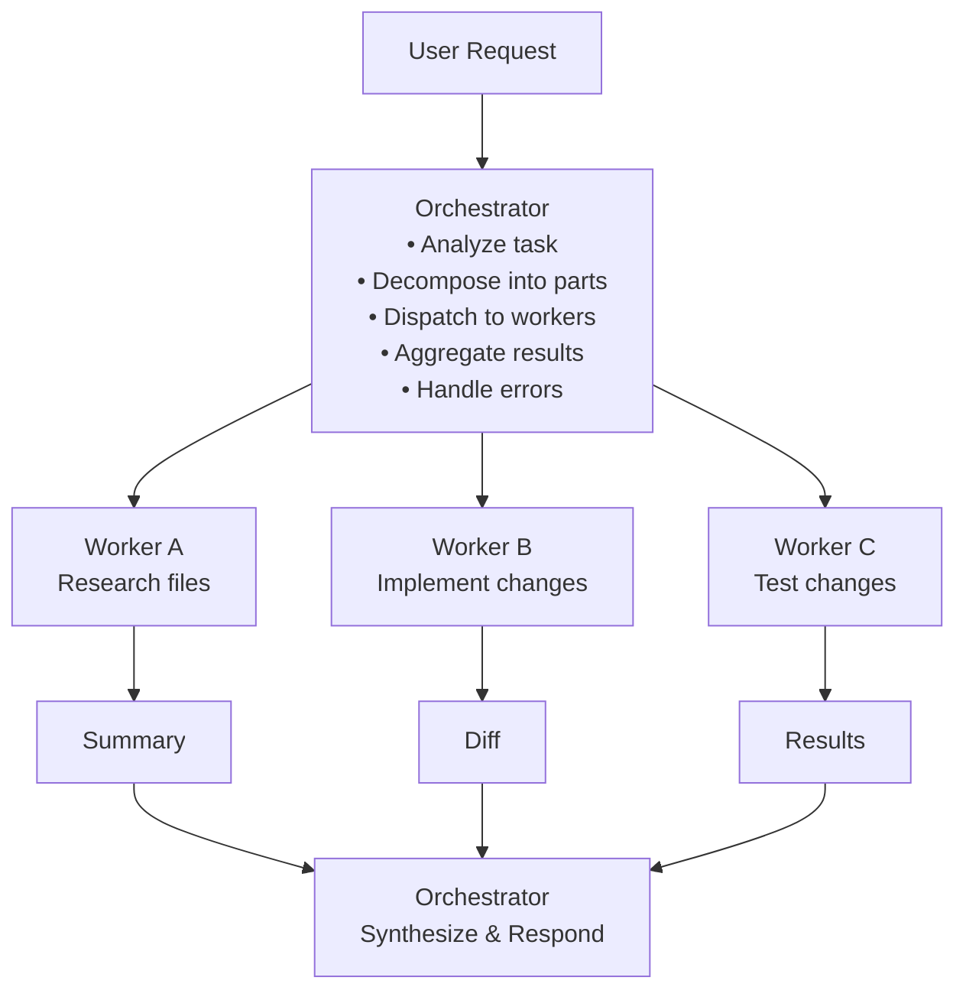
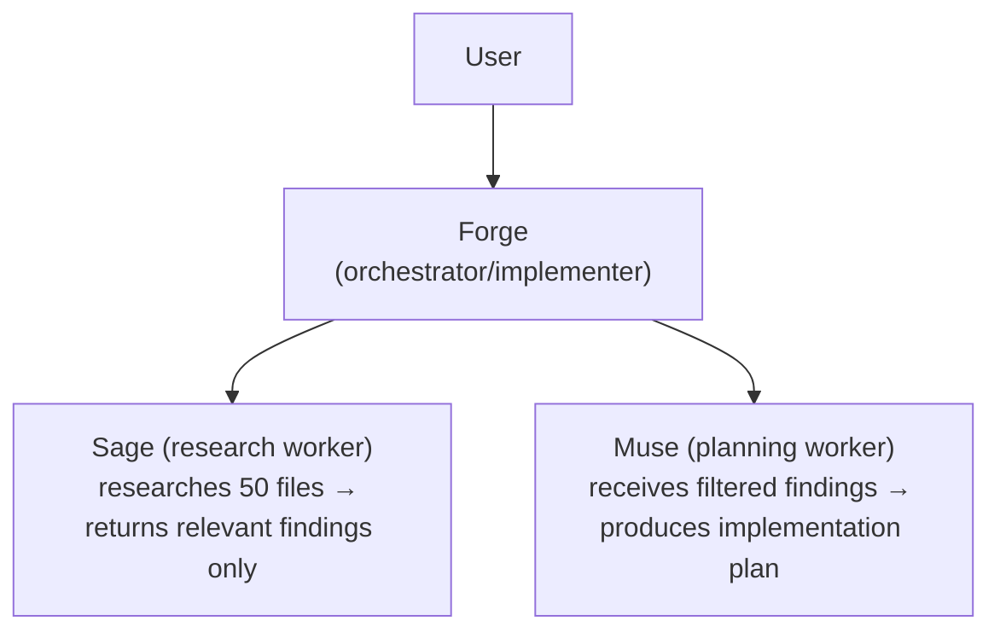
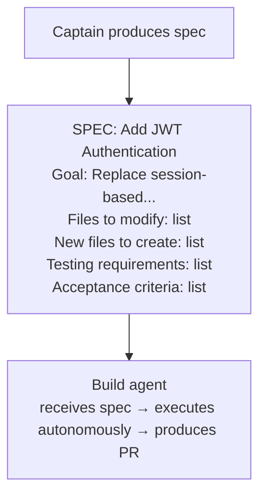

# Orchestrator-Worker Pattern

The orchestrator-worker pattern is the most widely adopted multi-agent architecture in
production coding agents. A central orchestrator agent decomposes complex tasks into
subtasks, delegates each to specialized worker agents, and synthesizes results into a
coherent output. Anthropic identifies this as their most-recommended pattern for coding
tasks — and virtually every multi-agent coding system we studied implements some variant
of it.

---

## Why Orchestrator-Worker Dominates Coding

Software engineering tasks have a property that makes them ideal for orchestrator-worker:
**the number of subtasks is unpredictable**. A user request like "refactor the auth module
to use JWT" might require changing 3 files or 30, depending on codebase structure. Unlike
static pipelines where steps are pre-defined, the orchestrator dynamically determines what
work needs to happen based on the specific input.

Anthropic's description is precise:

> This workflow is well-suited for complex tasks where you can't predict the subtasks needed.
> The key difference from parallelization is its flexibility — subtasks aren't pre-defined,
> but determined by the orchestrator based on the specific input.

This flexibility is why coding agents gravitate toward this pattern — the orchestrator
reasons about the codebase, breaks the problem down, and dispatches workers that each
handle a bounded piece of work.

---

## Core Architecture



### The Orchestrator's Responsibilities

1. **Task Analysis** — Understand the user's intent and the scope of work
2. **Task Decomposition** — Break the problem into independent, parallelizable subtasks
3. **Worker Selection** — Choose the right worker type for each subtask
4. **Context Distribution** — Pass relevant (not all) context to each worker
5. **Result Aggregation** — Combine worker outputs into a coherent response
6. **Error Handling** — Detect worker failures and retry or reassign
7. **Quality Control** — Verify the combined output meets the original request

### The Worker's Responsibilities

1. **Execute Bounded Task** — Complete the specific subtask assigned
2. **Report Results** — Return a structured summary to the orchestrator
3. **Stay in Scope** — Do not attempt work outside the assigned boundary
4. **Signal Failure** — Report when a subtask cannot be completed

---

## Anthropic's Orchestrator-Workers Pattern

Anthropic's "Building Effective Agents" paper describes orchestrator-workers as one of
five core agentic workflow patterns. Their formulation emphasizes the **dynamic nature**
of task decomposition — the orchestrator is an LLM that reasons about what workers are
needed, not a static router.

### The Anthropic Formulation

```python
# Pseudocode based on Anthropic's pattern description

def orchestrator_worker(task: str, context: dict) -> str:
    # Step 1: Orchestrator analyzes and decomposes
    subtasks = orchestrator_llm.call(
        system="You are a task orchestrator. Analyze the task and "
               "break it into independent subtasks. Return a JSON "
               "array of subtask descriptions.",
        user=f"Task: {task}\nContext: {context}"
    )

    # Step 2: Dispatch workers (potentially in parallel)
    results = []
    for subtask in subtasks:
        worker_result = worker_llm.call(
            system=f"You are a specialist worker. Complete this subtask.",
            user=f"Subtask: {subtask}\nContext: {relevant_context(subtask, context)}"
        )
        results.append(worker_result)

    # Step 3: Orchestrator synthesizes results
    final = orchestrator_llm.call(
        system="Synthesize the worker results into a final response.",
        user=f"Original task: {task}\nWorker results: {results}"
    )
    return final
```

### Key Design Decision: Dynamic vs Static

The critical distinction from parallelization (another Anthropic pattern) is that
orchestrator-workers determines subtasks **at runtime**. In parallelization, the
subtasks are hardcoded in the workflow definition. In orchestrator-workers, the LLM
decides:

| Aspect | Parallelization | Orchestrator-Workers |
|--------|----------------|---------------------|
| Subtask count | Fixed at design time | Dynamic per input |
| Subtask types | Pre-defined | LLM-determined |
| When to use | Known decomposition | Unknown decomposition |
| Coding example | "Run linter + tests + type-check" | "Refactor auth module" |

---

## Implementation in Production Coding Agents

### Claude Code: Sub-Agent Spawning

Claude Code implements orchestrator-worker through its **Task tool**, which spawns
sub-agents in isolated context windows. The main agent acts as the orchestrator,
deciding when to delegate and what context to pass.

**Three built-in worker types:**

| Worker Type | Model | Tools | Purpose |
|-------------|-------|-------|---------|
| **Explore** | Haiku (cheaper) | Read-only (Read, Grep, Glob) | Codebase research |
| **Plan** | Parent model | Read-only | Analysis and planning |
| **General-purpose** | Parent model | All tools | Full implementation tasks |

**Spawning a sub-agent:**

```typescript
// Claude Code's task tool invocation (simplified)
{
  tool: "Agent",
  input: {
    prompt: "Find all files that import from the auth module and list "
            "the specific functions they use",
    agent_type: "explore"
  }
}
// Returns: tool_result with summary of findings
```

**Critical constraint:** Sub-agents cannot spawn other sub-agents. This prevents
recursive delegation chains and keeps the architecture flat — one orchestrator,
many workers, no hierarchy.

**Custom workers** can be defined as markdown files in `.claude/agents/`:

```yaml
---
name: security-reviewer
description: Reviews code changes for security vulnerabilities
tools: Read, Grep, Glob, Bash
model: opus
memory: project
---

You are a senior security engineer reviewing code changes.
Focus on: injection vulnerabilities, authentication bypasses,
data exposure, and insecure defaults. Report findings as a
structured list with severity ratings.
```

**Context isolation is the primary motivation.** Claude Code's documentation makes this
explicit — sub-agents exist to keep the main context window clean. An explore sub-agent
might read 50 files looking for a pattern; only the summary returns to the orchestrator,
not the raw file contents.

### Codex CLI: Resource-Controlled Workers

Codex CLI implements orchestrator-worker with a resource-management layer built in Rust.
The `AgentControl` struct manages the lifecycle of sub-agents with atomic resource guards:

```rust
pub(crate) struct AgentControl {
    manager: Weak<ThreadManagerState>,
    state: Arc<Guards>,
}

pub(crate) struct Guards {
    active_agents: Mutex<ActiveAgents>,
    total_count: AtomicUsize,  // CAS-based max enforcement
}
```

**Role-based worker types:**

| Role | Purpose | Capabilities |
|------|---------|-------------|
| `default` | Standard agent | All tools |
| `explorer` | Codebase Q&A | May use faster model, read-focused |
| `worker` | Execution tasks | File ownership semantics |

**Parallel dispatch with resource limits:**

```rust
// Codex parallel tool execution
let results = futures::future::join_all(
    tool_calls.into_iter().map(|tc| {
        tool_orchestrator.run(tc, sandbox_manager.clone())
    })
).await;
```

The `SpawnReservation` pattern ensures cleanup — if a worker spawn fails, the atomic
counter is decremented via Rust's `Drop` trait, preventing resource leaks.

**SQ/EQ message passing:** Codex uses a Submission Queue / Event Queue pattern for
communication between the orchestrator and workers. This allows multiple frontends
(TUI, exec mode, app-server, MCP) to drive the same agent core.

### ForgeCode: Bounded Context Orchestration

ForgeCode's three-agent model (Forge, Muse, Sage) is an orchestrator-worker system
with **bounded context** as the core innovation:



**Bounded context flow:**

1. User asks Forge to refactor the auth module
2. Forge dispatches Sage to research the codebase
3. Sage reads 50 files, analyzes dependencies → returns a 200-token summary
4. Forge dispatches Muse with Sage's summary
5. Muse plans the refactor → returns step-by-step plan
6. Forge executes the plan with full read-write access

**The key insight:** Each agent boundary is a **compression point**. Sage's 50-file
exploration becomes a concise summary. Muse's analysis becomes an actionable plan.
Only the compressed representations cross agent boundaries — raw data stays within
the originating agent's context window.

### Ante: Meta-Agent Orchestration

Ante implements a **Meta-Agent** that dynamically creates and manages a pool of
sub-agents. Built entirely in Rust with a lock-free scheduler:

```rust
// Conceptual Ante Meta-Agent pattern
struct MetaAgent {
    scheduler: LockFreeScheduler,  // atomic ops, wait-free queues
    sub_agents: Vec<SubAgent>,
}

impl MetaAgent {
    fn decompose_and_dispatch(&self, task: Task) -> Vec<SubAgentResult> {
        let subtasks = self.analyze(task);
        // Concurrent dispatch — no mutex contention
        subtasks.par_iter().map(|st| {
            let agent = self.scheduler.acquire_agent();
            agent.execute(st)
        }).collect()
    }
}
```

**Zero-mutex concurrency:** Ante's scheduler uses atomic operations and wait-free
queues to avoid mutex contention when dispatching to sub-agents. This is particularly
relevant for coding tasks that involve many parallel file operations.

---

## Task Decomposition Strategies

How the orchestrator breaks down a coding task determines the quality of the entire
system. We identified three primary decomposition strategies across production agents:

### Strategy 1: File-Based Decomposition

The most common approach — one worker per file that needs modification.

```
Task: "Add error handling to all API endpoints"

Orchestrator decomposes:
  Worker 1: "Add error handling to routes/users.ts"
  Worker 2: "Add error handling to routes/orders.ts"
  Worker 3: "Add error handling to routes/products.ts"
  Worker 4: "Update error types in types/errors.ts"
```

**Pros:** Natural parallelism, clear boundaries, easy to aggregate
**Cons:** Cross-file dependencies may be missed, duplicated analysis

### Strategy 2: Phase-Based Decomposition

Workers handle different phases of the task: research, plan, implement, test.

```
Task: "Refactor auth to use JWT"

Orchestrator decomposes:
  Phase 1 (Research): "What auth patterns exist in the codebase?"
  Phase 2 (Plan):     "Design the JWT migration plan"
  Phase 3 (Implement): "Execute the migration" (may spawn sub-workers)
  Phase 4 (Verify):   "Run tests and verify the migration"
```

**Pros:** Each phase can use optimized models (Haiku for research, Opus for planning)
**Cons:** Sequential dependencies reduce parallelism

### Strategy 3: Concern-Based Decomposition

Workers handle orthogonal concerns of the same change.

```
Task: "Add user preferences feature"

Orchestrator decomposes:
  Worker 1: "Design and create database schema"
  Worker 2: "Implement API endpoints"
  Worker 3: "Write unit tests"
  Worker 4: "Update API documentation"
```

**Pros:** Natural separation of concerns, mirrors team structure
**Cons:** Integration complexity when workers' outputs must be consistent

---

## Result Aggregation Patterns

Once workers complete their subtasks, the orchestrator must synthesize results.

### Pattern 1: Concatenative Aggregation

Simply combine all worker outputs. Works when workers produce independent artifacts.

```python
# Each worker edits a different file — just apply all diffs
for worker_result in results:
    apply_diff(worker_result.file_path, worker_result.diff)
```

### Pattern 2: Summarization Aggregation

The orchestrator reads all worker outputs and produces a unified summary.

```python
# Workers explored different aspects — orchestrator synthesizes
summary = orchestrator_llm.call(
    system="Synthesize these research findings into a coherent answer.",
    user=f"Findings: {[r.summary for r in results]}"
)
```

### Pattern 3: Conflict Resolution Aggregation

When workers may produce conflicting changes, the orchestrator must resolve conflicts.

```python
# Workers edited overlapping files — detect and resolve
conflicts = detect_conflicts(results)
if conflicts:
    resolution = orchestrator_llm.call(
        system="These workers produced conflicting changes. "
               "Resolve the conflicts while preserving both intents.",
        user=f"Conflicts: {conflicts}"
    )
    apply_resolution(resolution)
else:
    apply_all(results)
```

### Capy's Document-Based Aggregation

Capy uses a unique approach — the Captain (orchestrator) produces a **spec document**
that serves as the sole interface to the Build agent (worker). The Build agent cannot
ask clarifying questions, so the spec must be comprehensive:



---

## Error Handling in Orchestrator-Worker Systems

Error handling is where orchestrator-worker architectures diverge most. Three strategies
emerge from production systems:

### Strategy 1: Retry with Refinement (Claude Code)

When a sub-agent fails, the orchestrator retries with more specific instructions.

```
Worker fails: "Could not find auth module"
Orchestrator retries: "The auth module is in src/lib/auth/. 
                       Look for files matching *auth*.ts"
```

### Strategy 2: Escalation (ForgeCode)

When Sage (researcher) cannot find information, it reports back to Forge, which may
switch strategies — using different search tools or asking the user directly.

### Strategy 3: Fallback to Synchronous (Codex CLI)

When parallel workers produce conflicting results, Codex falls back to sequential
execution where each worker sees the output of the previous one.

### Strategy 4: Circuit Breaker (General Pattern)

```python
MAX_RETRIES = 3
WORKER_TIMEOUT = 60  # seconds

def dispatch_with_circuit_breaker(subtask, worker_type):
    for attempt in range(MAX_RETRIES):
        try:
            result = dispatch_worker(subtask, worker_type, timeout=WORKER_TIMEOUT)
            if result.success:
                return result
            # Worker completed but produced poor result
            subtask = refine_subtask(subtask, result.feedback)
        except TimeoutError:
            # Worker took too long — likely stuck in a loop
            if attempt == MAX_RETRIES - 1:
                return FailureResult(
                    reason="Worker timed out after max retries",
                    partial_work=result.partial if result else None
                )
    return FailureResult(reason="Max retries exceeded")
```

---

## Orchestrator-Worker vs Other Patterns

### vs Pipeline (SageAgent)

Pipelines define a fixed sequence of stages. Orchestrator-worker is dynamic.

```
Pipeline (SageAgent):
  Analysis → Planning → Execution → Observation → Summary
  (always these 5 stages, always in this order)

Orchestrator-Worker (Claude Code):
  Main agent → {explore, explore, implement, test}
  Main agent → {implement}
  Main agent → {explore, plan, implement, implement, implement, test}
  (different workers each time, based on the task)
```

### vs Peer-to-Peer

In peer-to-peer, agents are equals that negotiate. In orchestrator-worker, there's
a clear hierarchy. No production coding agent uses true peer-to-peer — the overhead
of negotiation exceeds its benefits for structured coding tasks.

### vs Swarm (OpenAI)

Swarm uses lightweight handoffs between agents — the current agent decides to
transfer control to another agent. There's no central orchestrator deciding what
happens next. See [swarm-patterns.md](./swarm-patterns.md) for details.

---

## Design Guidelines

Based on our analysis of production implementations, we recommend:

### 1. Keep Workers Bounded

Workers should have clear, limited scope. A worker that "implements the feature" is
too broad; a worker that "adds the JWT validation middleware to routes/auth.ts" is
appropriately bounded.

### 2. Compress at Boundaries

Every agent boundary should be a compression point. Workers return summaries, not
raw data. This is the single most important design principle we observed — it's why
Claude Code's explore agent uses Haiku (fast, cheap summaries) and why ForgeCode's
bounded context model drops raw exploration data.

### 3. Make Workers Stateless

Workers should receive all necessary context in their prompt and return all results
in their response. No shared mutable state between workers. This enables parallelism
and makes the system easier to reason about.

### 4. Use Model Tiering

Not all workers need the same model. Research workers can use cheaper/faster models
(Haiku, Gemini Flash). Implementation workers benefit from more capable models
(Sonnet, Opus). Junie CLI's multi-model router demonstrates a **6.7 percentage point**
improvement from dynamic model selection.

### 5. Enforce Hard Boundaries

The most effective systems impose constraints that workers **cannot** violate:
- ForgeCode: Muse cannot write code; Sage is never user-facing
- Capy: Captain cannot write code; Build cannot ask questions
- Claude Code: Explore sub-agents get read-only tools

These aren't limitations — they're features that prevent role confusion.

---

## OpenAI Agents SDK: Building Orchestrator-Workers

The OpenAI Agents SDK (successor to Swarm) provides production primitives for
building orchestrator-worker systems:

```python
from agents import Agent, Runner

# Define specialist workers
researcher = Agent(
    name="Researcher",
    instructions="Research the codebase to answer questions. "
                 "Return concise findings.",
    tools=[grep_tool, read_file_tool, glob_tool],
)

implementer = Agent(
    name="Implementer",
    instructions="Make code changes as specified. Return the diff.",
    tools=[read_file_tool, write_file_tool, bash_tool],
)

tester = Agent(
    name="Tester",
    instructions="Run tests and report results. Suggest fixes for failures.",
    tools=[bash_tool, read_file_tool],
)

# Define orchestrator with workers as tools
orchestrator = Agent(
    name="Orchestrator",
    instructions="You coordinate coding tasks. Analyze the request, "
                 "delegate to specialists, and synthesize results.",
    tools=[
        researcher.as_tool(
            tool_name="research",
            tool_description="Research the codebase for information"
        ),
        implementer.as_tool(
            tool_name="implement",
            tool_description="Make code changes"
        ),
        tester.as_tool(
            tool_name="test",
            tool_description="Run tests and verify changes"
        ),
    ],
)

# Run the orchestrator
result = await Runner.run(
    orchestrator,
    "Refactor the auth module to use JWT tokens"
)
```

**Key distinction from Swarm:** In the Agents SDK, workers can be invoked as **tools**
(agents-as-tools pattern) rather than requiring handoffs. The orchestrator maintains
control throughout — workers execute and return, rather than taking over the conversation.

---

## Anti-Patterns

### 1. Over-Decomposition

Splitting a simple task into too many subtasks introduces coordination overhead
that exceeds the task's inherent complexity.

**Bad:** "Change the button color to blue" → 5 workers for research, planning,
implementation, testing, documentation.

**Good:** "Change the button color to blue" → Single agent, no decomposition needed.

### 2. Under-Specified Workers

Giving workers vague instructions that overlap with other workers' responsibilities.

**Bad:** Worker A: "Handle the frontend changes" / Worker B: "Handle the UI updates"
**Good:** Worker A: "Update Button component in src/Button.tsx" / Worker B: "Update
theme colors in src/theme.ts"

### 3. Ignoring Worker Failures

The orchestrator must check worker results and handle failures explicitly. Silently
dropping failed subtasks leads to incomplete implementations.

### 4. Passing Too Much Context

Workers don't need the entire conversation history. Pass only what's relevant to
their specific subtask. This is where ForgeCode's bounded context model excels.

---

## Cross-References

- [specialist-agents.md](./specialist-agents.md) — How to design the worker roles
- [context-sharing.md](./context-sharing.md) — How orchestrators pass context to workers
- [evaluation-agent.md](./evaluation-agent.md) — Adding quality gates to the pattern
- [communication-protocols.md](./communication-protocols.md) — Wire protocols for agent communication
- [real-world-examples.md](./real-world-examples.md) — Deep dives into specific implementations
- [swarm-patterns.md](./swarm-patterns.md) — Alternative: decentralized coordination

---

## References

- Anthropic. "Building Effective Agents." 2024. https://www.anthropic.com/research/building-effective-agents
- OpenAI. "Agents SDK." 2025. https://github.com/openai/openai-agents-python
- Research files: `/research/agents/claude-code/`, `/research/agents/codex/`, `/research/agents/forgecode/`, `/research/agents/capy/`
