# Real-World Multi-Agent Implementations

This document provides deep dives into how production coding agents and research
frameworks implement multi-agent architectures. We move from CLI coding agents
(our primary research focus) to broader multi-agent frameworks (MetaGPT, ChatDev,
AutoGen, CrewAI) that have influenced the field. Each section covers architecture,
communication patterns, and key innovations — with specific code examples and
architectural diagrams drawn from our research.

---

## CLI Coding Agents

### Claude Code: Sub-Agent Task Tool

Claude Code implements multi-agent through its **Task tool**, which spawns sub-agents
in isolated context windows. The main agent acts as orchestrator, delegating exploration,
planning, and implementation to workers.

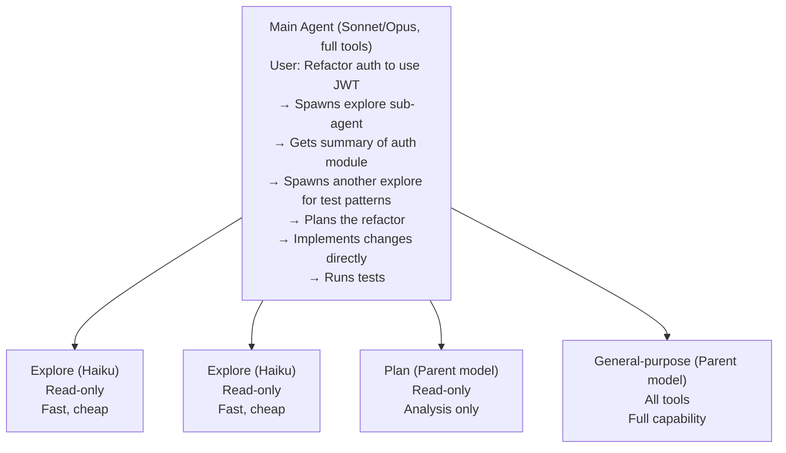

**Key architectural decisions:**

- **No nesting:** Sub-agents cannot spawn other sub-agents. This keeps the hierarchy flat.
- **Context isolation:** Each sub-agent gets its own context window. Only the summary returns.
- **Model tiering:** Explore agents use Haiku (fast, cheap) for research tasks.
- **Custom agents:** Teams define custom sub-agents as markdown files in `.claude/agents/`.
- **Worktree isolation:** `isolation: worktree` gives sub-agents their own git worktree.

**Communication protocol:** Standard Anthropic Messages API tool-use. The Agent tool is
invoked identically to any other tool — no special plumbing required.

### Codex CLI: Resource-Controlled Parallel Agents

Codex CLI (by OpenAI) implements multi-agent with a Rust-based resource management
layer that enforces concurrency limits and agent lifecycle management.

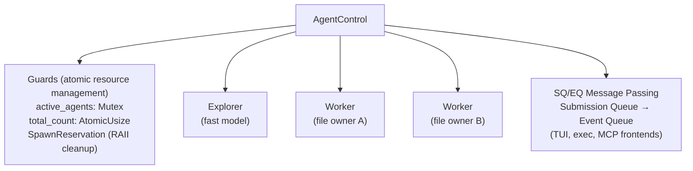

**Key innovations:**

- **CAS-based max enforcement:** Atomic compare-and-swap prevents exceeding agent limits.
- **SpawnReservation with Drop:** Rust's ownership system ensures cleanup if spawn fails.
- **Role system:** `default`, `explorer`, `worker` with different capabilities.
- **File ownership:** Workers can be assigned ownership of specific files.
- **JSONL rollout persistence:** Sub-agent sessions can be resumed from JSONL files.
- **Parallel tool execution:** `futures::future::join_all` for concurrent tool calls.

### ForgeCode: Three-Agent Bounded Context

ForgeCode achieves the highest Terminal-Bench score (81.8%) with a three-agent
model built on bounded context and enforced verification.

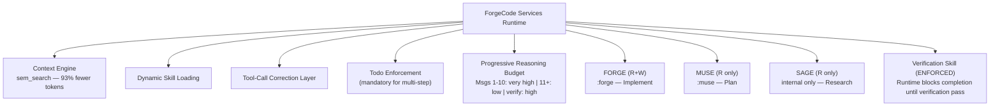

**Key innovations:**

- **Bounded context:** Each agent boundary is a compression point. Raw data never
  crosses boundaries — only summaries.
- **Enforced verification:** The runtime architecturally prevents task completion
  without verification. "Biggest single improvement."
- **Tool-call correction:** Heuristic + static analysis layer auto-corrects
  malformed tool calls. Makes any model more reliable.
- **Progressive reasoning:** Budget varies by conversation stage, not agent type.
- **ZSH-native:** `:forge` and `:muse` commands integrate directly into the shell.

### OpenHands: Event-Sourced Micro-Agents

OpenHands uses an event-sourced architecture where all agent actions are recorded
as events on a shared EventStream.

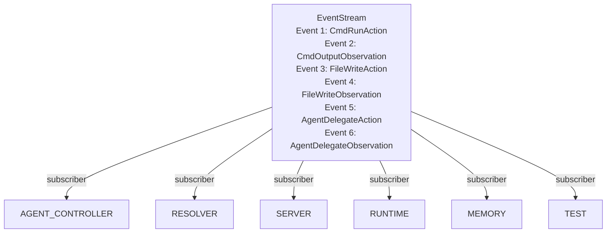

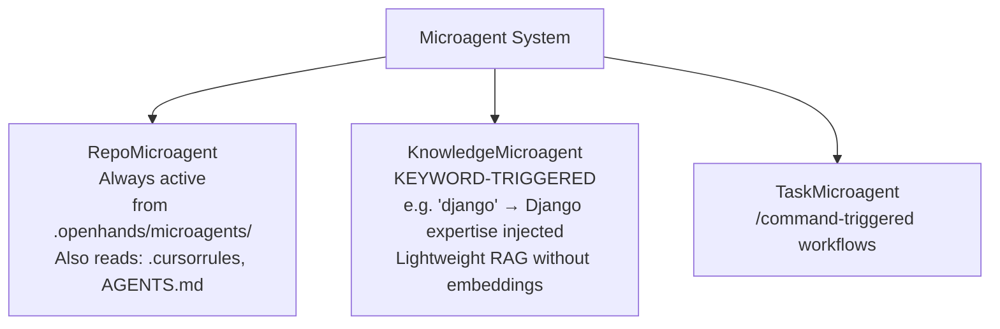

**Key innovations:**

- **Event sourcing:** Full replay capability, crash recovery, audit trails.
- **AgentDelegateAction:** Sub-agent delegation through the event system.
- **Keyword-triggered microagents:** "django" in conversation → Django expertise
  automatically injected. Lightweight RAG without vector databases.
- **Docker sandbox:** HTTP-based split — host runs agent, Docker container runs code.
- **StuckDetector:** Monitors for agents caught in loops and intervenes.
- **Action/Observation symmetry:** Every event is typed with causal linking.

### Capy: Captain/Build Hard Split

Capy separates planning and execution with enforced capability boundaries:

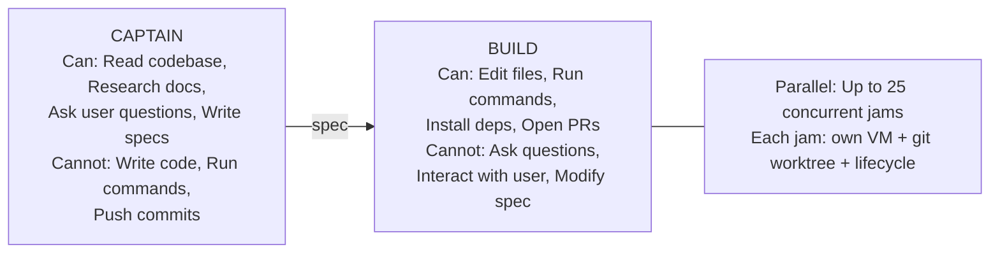

**Key innovations:**

- **Forcing functions:** Constraints that make each agent better. Build can't ask
  questions → Captain must be thorough. Captain can't code → pure planning focus.
- **Spec document as interface:** The only communication channel between agents.
- **25 concurrent VMs:** Each task runs in its own sandboxed Ubuntu VM with its
  own git worktree.
- **Fire-and-forget execution:** Build runs asynchronously after Captain finishes.

### Goose: Agent-of-Agents via ACP

Goose's unique contribution is the **Agent Communication Protocol (ACP)**, which
allows using other coding agents as backend LLM providers:

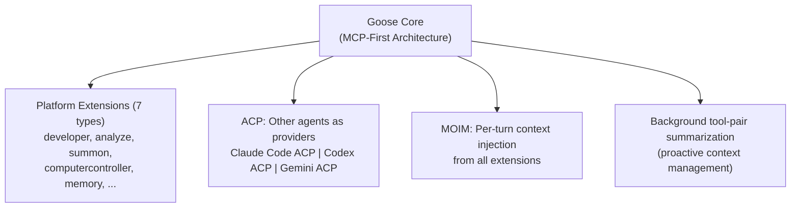

### SageAgent: Five-Stage Pipeline

SageAgent implements a sequential pipeline with a single feedback loop:

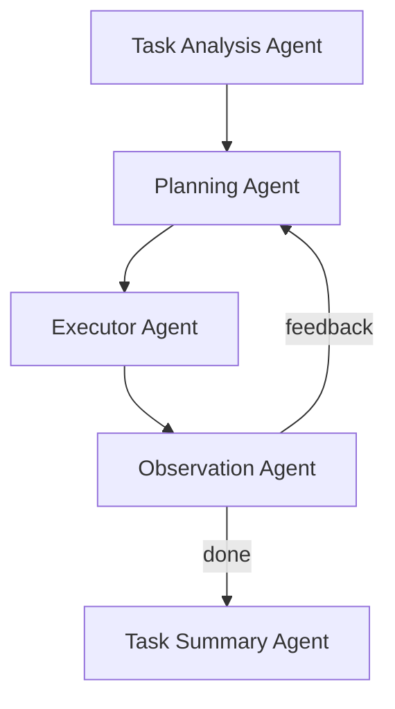

Two modes: **Deep Research** (full pipeline, feedback enabled) and
**Rapid Execution** (simplified, no feedback loop).

### Junie CLI: Multi-Model Pipeline

Junie CLI's innovation is **dynamic model routing** across its three-stage pipeline:

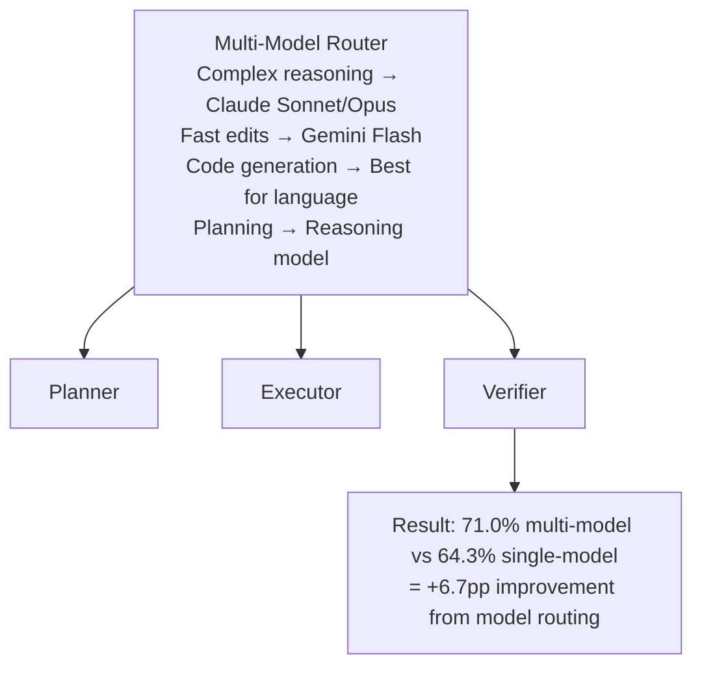

### Ante: Lock-Free Meta-Agent

Ante uses a Meta-Agent that dynamically manages a pool of concurrent sub-agents
with **zero-mutex concurrency**:

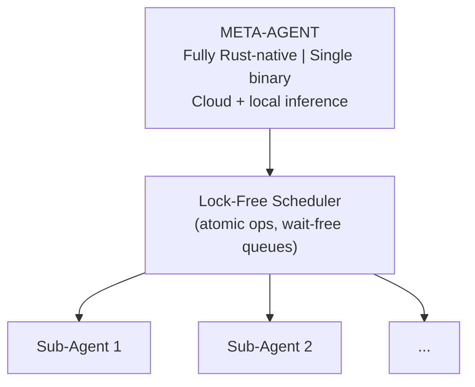

---

## Multi-Agent Frameworks

### MetaGPT: Software Company as Multi-Agent System

MetaGPT's core philosophy: `Code = SOP(Team)` — Standard Operating Procedures
applied to a team of LLM agents that mirrors a software company.

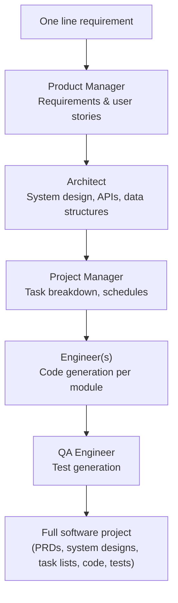

**Output:** User stories, competitive analysis, requirements, data structures,
APIs, documentation — the full software development pipeline.

### ChatDev: Virtual Software Company

ChatDev simulates a software company with agents in conversational roles:

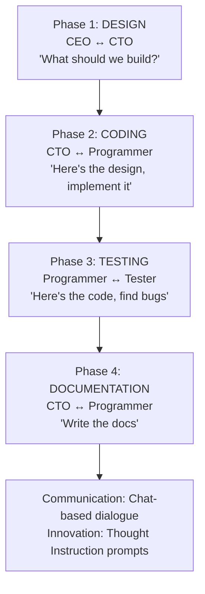

**Key insight:** ChatDev's innovation is that agents communicate through
**natural language dialogue** rather than structured messages. This allows
for nuanced negotiation but introduces unpredictability.

### Microsoft AutoGen: Multi-Agent Conversation Framework

AutoGen provides a layered architecture for building multi-agent applications:

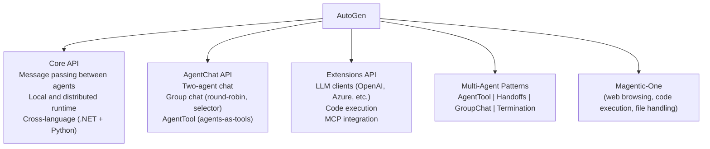

**AutoGen's AgentTool pattern:**

```python
from autogen_agentchat.agents import AssistantAgent
from autogen_agentchat.tools import AgentTool

# Create specialist agents
code_expert = AssistantAgent(
    "code_expert", model_client=client,
    system_message="You are a coding expert.",
)

# Wrap as tool for orchestrator
code_tool = AgentTool(code_expert, return_value_as_last_message=True)

# Orchestrator uses specialists as tools
orchestrator = AssistantAgent(
    "orchestrator",
    tools=[code_tool],
    system_message="Use expert tools when needed.",
)
```

### CrewAI: Role-Based Multi-Agent Framework

CrewAI provides a role-based framework with two complementary concepts:
**Crews** (autonomous agent teams) and **Flows** (event-driven workflows).

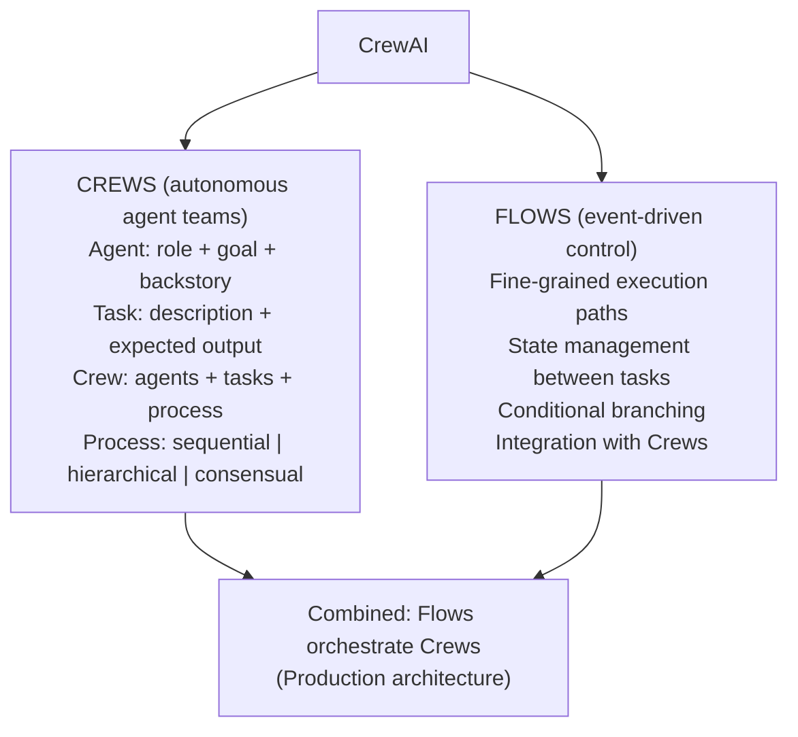

**CrewAI coding example:**

```python
from crewai import Agent, Task, Crew, Process

researcher = Agent(
    role="Code Researcher",
    goal="Understand the existing codebase and identify patterns",
    backstory="You are a senior engineer who excels at code analysis.",
    tools=[grep_tool, read_file_tool],
)

developer = Agent(
    role="Software Developer",
    goal="Implement clean, tested code changes",
    backstory="You are a staff engineer who writes production-quality code.",
    tools=[edit_file_tool, run_tests_tool],
)

reviewer = Agent(
    role="Code Reviewer",
    goal="Ensure code quality, security, and correctness",
    backstory="You are a principal engineer focused on code quality.",
    tools=[read_file_tool, run_linter_tool],
)

# Define tasks
research_task = Task(
    description="Analyze the auth module and document current patterns",
    agent=researcher,
    expected_output="Summary of auth patterns and dependencies",
)

implement_task = Task(
    description="Implement JWT authentication based on research findings",
    agent=developer,
    expected_output="Code changes implementing JWT auth",
)

review_task = Task(
    description="Review the implementation for bugs and security issues",
    agent=reviewer,
    expected_output="Review report with issues and approval status",
)

# Create and run crew
crew = Crew(
    agents=[researcher, developer, reviewer],
    tasks=[research_task, implement_task, review_task],
    process=Process.sequential,
)

result = crew.kickoff()
```

---

## Devin: Cloud-Based Multi-Agent Architecture

Devin (by Cognition) operates as a cloud-based coding agent with a multi-agent
architecture that separates planning, execution, and verification:

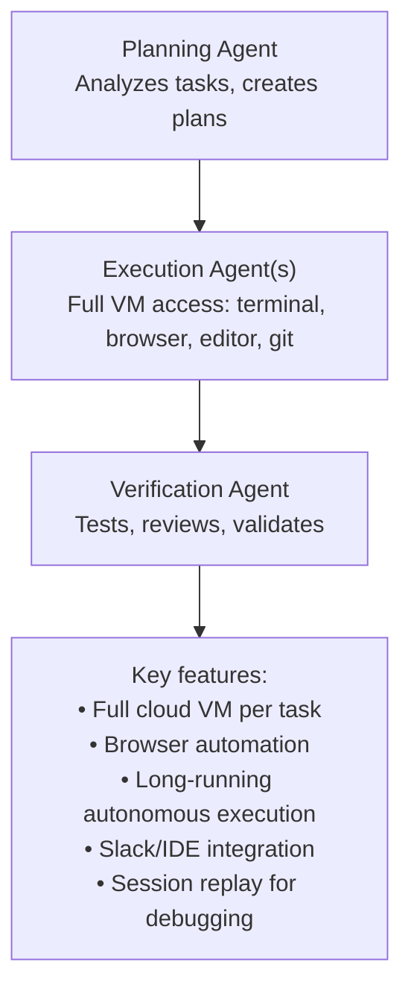

Devin's multi-agent approach is notable for its **full cloud VM** per task, allowing
agents to use any tool — terminal, browser, editor — just as a human developer would.

---

## Cross-Implementation Comparison

| System | Agents | Communication | Parallelism | Verification | Context Strategy |
|--------|--------|---------------|-------------|-------------|-----------------|
| **Claude Code** | 3 built-in + custom | Tool-use protocol | Sub-agent isolation | Prompt-based | Summary handoff |
| **Codex CLI** | 3 roles | SQ/EQ messages | join_all parallel | Optional | Role-based filtering |
| **ForgeCode** | 3 (Forge/Muse/Sage) | Bounded context | Low-complexity parallel | **Enforced** | 93% compression |
| **OpenHands** | Main + delegates | EventStream pub/sub | ThreadPool subscribers | StuckDetector | Event replay |
| **Capy** | 2 (Captain/Build) | Spec document | 25 concurrent VMs | Tests in Build | Spec-as-interface |
| **Goose** | Summon + ACP | MCP everywhere | Via Summon | Recipe retry | MOIM per-turn |
| **SageAgent** | 5-stage pipeline | Linear + feedback | Sequential | ObservationAgent | Pipeline handoff |
| **Junie CLI** | 3-stage pipeline | Backend proxy | Multi-model | Test-driven loop | Model routing |
| **Ante** | Meta + pool | Lock-free scheduler | Concurrent sub-agents | Not documented | Atomic state |
| **MetaGPT** | 5 company roles | Structured artifacts | Per-module coding | QA Engineer | SOPs |
| **ChatDev** | 4 phases | Chat dialogue | Sequential phases | Tester phase | Conversation |
| **AutoGen** | Configurable | AgentChat messages | Group chat | Configurable | Framework-level |
| **CrewAI** | Role-based | Task outputs | Sequential/hierarchical | Reviewer agent | Task chaining |
| **Devin** | Planning/Exec/Verify | Internal | Per-task VM | Verification agent | Cloud VM state |
| **DeerFlow** | Lead + dynamic sub-agents | Structured SubAgentResult | Parallel (Send) | Skills-guided | Isolated subgraphs |

---

## DeerFlow: Dynamic Sub-Agent Harness

DeerFlow (by ByteDance) is a **super agent harness** built on LangGraph that represents a different approach from the purpose-built coding agents above — it is a general-purpose orchestration runtime with dynamic sub-agent spawning.

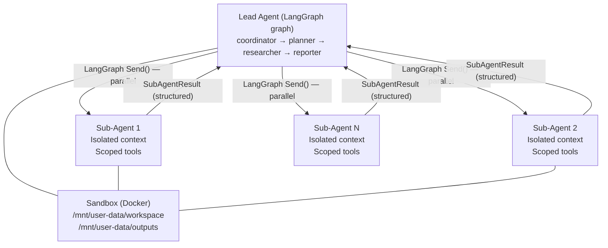

**What makes DeerFlow different:**

1. **Dynamic sub-agent spawning** — unlike ForgeCode, Claude Code, or Capy where agent roles are statically defined, DeerFlow's lead agent spawns sub-agents on the fly for the specific sub-tasks of the current job. The number and scope of sub-agents varies per task.

2. **LangGraph-native** — orchestration is a typed state graph with checkpointing, time-travel debugging, and durable execution. Sub-agents are subgraphs with isolated state.

3. **Parallel execution via `Send()`** — LangGraph's `Send()` primitive dispatches multiple sub-agents concurrently when tasks are independent.

4. **Skills-as-Markdown** — sub-agents load and follow Markdown skill files (workflow specifications) rather than hard-coded prompts. Skills are loaded progressively, only when needed.

5. **Execution modes** — flash (fast), standard, pro (with planning), ultra (with sub-agents). Users select the trade-off between speed and thoroughness.

**Multi-agent level**: Level 1–2 on the research spectrum. Standard/pro modes are Level 1 (sub-agent delegation); ultra mode is Level 2 (parallel orchestration).

**Where it fits vs. other systems:**
- More dynamic than ForgeCode (static 3-agent), Claude Code (static types), SageAgent (fixed 5-stage pipeline)
- Less specialized than ForgeCode (general-purpose, not coding-first)
- More complete than AutoGen/CrewAI (batteries-included harness, not just framework primitives)

See [`/research/agents/deer-flow/`](../../agents/deer-flow/index.md) for full analysis.

---

## Key Takeaways

### 1. Context Management Drives Architecture

Every production system we studied adopted multi-agent primarily for **context window
management**, not task specialization. Claude Code's documentation is explicit:
sub-agents exist to keep the main context clean.

### 2. Hard Boundaries Beat Soft Prompts

ForgeCode (enforced verification), Capy (capability constraints), and Claude Code
(tool restrictions) consistently outperform systems that rely on prompts alone to
enforce role boundaries.

### 3. Verification Is Non-Negotiable

The top-performing systems all have explicit verification mechanisms — whether
programmatic (ForgeCode), observer-based (SageAgent), or test-driven (Junie CLI).

### 4. Model Tiering Is Cost-Effective

Claude Code's Haiku explore agents and Junie CLI's multi-model router demonstrate
that using cheaper models for routine tasks and expensive models for complex
reasoning produces both better results and lower costs.

### 5. Frameworks Provide Primitives, Not Solutions

MetaGPT, AutoGen, and CrewAI provide building blocks. Production coding agents
build custom multi-agent systems tailored to their specific needs rather than
adopting a framework wholesale.

---

## Cross-References

- [orchestrator-worker.md](./orchestrator-worker.md) — The dominant pattern across implementations
- [specialist-agents.md](./specialist-agents.md) — How agents specialize in practice
- [evaluation-agent.md](./evaluation-agent.md) — Verification approaches compared
- [communication-protocols.md](./communication-protocols.md) — Protocol implementations
- [context-sharing.md](./context-sharing.md) — How context flows in each system
- [agent-comparison.md](./agent-comparison.md) — Detailed comparison table

---

## References

- MetaGPT. https://github.com/geekan/MetaGPT
- Microsoft AutoGen. https://github.com/microsoft/autogen
- CrewAI. https://github.com/crewAIInc/crewAI
- Cognition. "Devin." https://devin.ai
- Research files: `/research/agents/*/` — all agent directories
- ByteDance. "DeerFlow." https://github.com/bytedance/deer-flow
