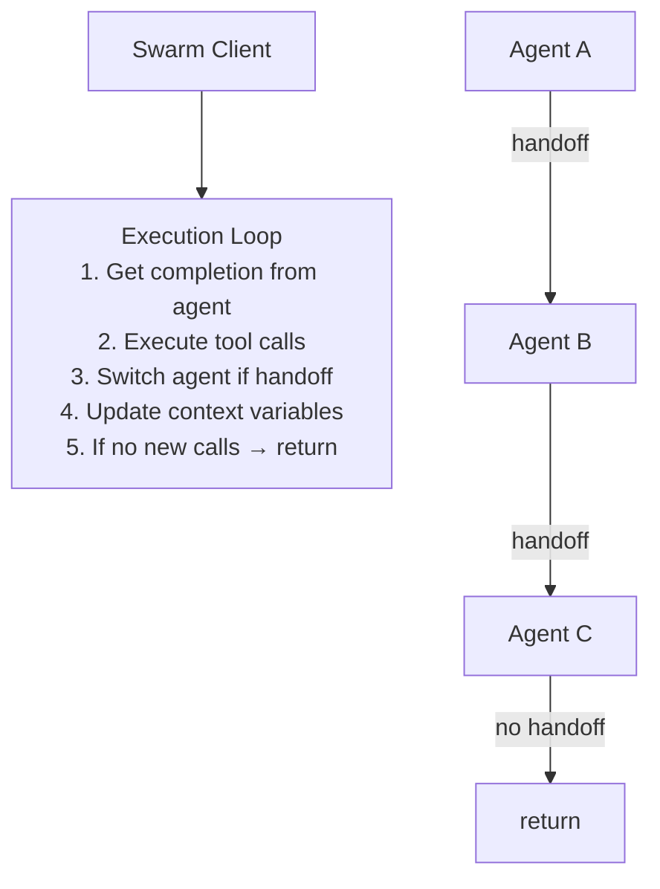
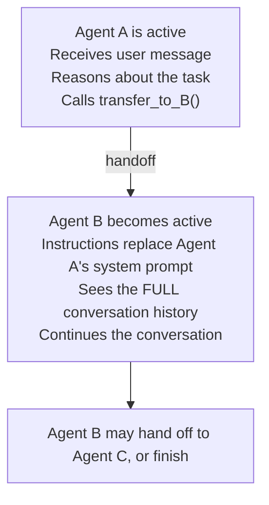

# Swarm and Collective Patterns

Swarm patterns represent a fundamentally different approach to multi-agent coordination.
Instead of a central orchestrator deciding what each agent does, swarm systems use
**lightweight handoffs** between agents — the currently active agent decides to transfer
control to another agent when appropriate. This creates emergent coordination without
central planning. OpenAI's Swarm framework (now deprecated in favor of the Agents SDK)
pioneered this pattern, and its core concepts — agents and handoffs — remain the foundation
of modern multi-agent frameworks.

---

## The Swarm Philosophy

The central insight of swarm patterns is that complex coordination can emerge from
simple primitives. Instead of building elaborate orchestration logic, swarm systems
define:

1. **Agents** — LLMs with instructions and tools
2. **Handoffs** — Functions that transfer control from one agent to another
3. **Context variables** — Shared state that flows between agents

That's it. No orchestrator, no pipeline definitions, no explicit routing logic.
The LLM itself decides when and where to hand off based on its instructions and
the current conversation state.

```python
# The entirety of Swarm's core abstractions
from swarm import Swarm, Agent

client = Swarm()

def transfer_to_reviewer():
    """Hand off to the code reviewer"""
    return code_reviewer

coder = Agent(
    name="Coder",
    instructions="You write code. When done, transfer to reviewer.",
    functions=[write_file, transfer_to_reviewer],
)

code_reviewer = Agent(
    name="Code Reviewer",
    instructions="You review code for bugs and style issues.",
    functions=[read_file, suggest_fix],
)

# The swarm decides the flow dynamically
response = client.run(agent=coder, messages=[
    {"role": "user", "content": "Write a function to parse CSV files"}
])
```

---

## OpenAI Swarm: The Educational Framework

OpenAI released Swarm in late 2024 as an **experimental, educational** framework
for exploring multi-agent patterns. It was explicitly not production-ready but
introduced concepts that became foundational.

### Core Architecture



### Key Design Decisions

1. **Stateless between calls** — Like the Chat Completions API, Swarm does not store
   state between `client.run()` calls. All state must be passed in via messages and
   context variables.

2. **Handoffs are functions** — An agent hands off by returning another Agent object
   from a function call. This is elegant because handoff is just another tool call.

3. **Instructions swap on handoff** — When Agent A hands off to Agent B, Agent B's
   instructions replace Agent A's as the system prompt. The conversation history
   persists, but the "personality" changes.

4. **Context variables are global** — Any function can read and modify context variables,
   providing shared state without explicit message passing.

### Swarm's `client.run()` Loop

```python
# Simplified version of Swarm's core loop
def run(self, agent, messages, context_variables={}, max_turns=float("inf")):
    active_agent = agent
    history = list(messages)
    turns = 0

    while turns < max_turns:
        # Get completion from current agent
        completion = self.get_chat_completion(
            agent=active_agent,
            history=history,
            context_variables=context_variables,
        )

        message = completion.choices[0].message
        history.append(message)

        # No tool calls → we're done
        if not message.tool_calls:
            break

        # Execute tool calls
        for tool_call in message.tool_calls:
            result = self.handle_tool_call(
                tool_call, active_agent.functions, context_variables
            )

            # If the result is an Agent → handoff
            if isinstance(result, Agent):
                active_agent = result
                result = {"assistant": active_agent.name}

            history.append({
                "role": "tool",
                "tool_call_id": tool_call.id,
                "content": str(result),
            })

        turns += 1

    return Response(
        messages=history[len(messages):],
        agent=active_agent,
        context_variables=context_variables,
    )
```

### Swarm Examples for Coding

**Triage Agent Pattern:** Route user requests to the right specialist.

```python
def transfer_to_bug_fixer():
    return bug_fixer

def transfer_to_feature_dev():
    return feature_developer

def transfer_to_refactorer():
    return refactorer

triage_agent = Agent(
    name="Triage",
    instructions="""You are a coding task router. Based on the user's request:
    - Bug reports → transfer to Bug Fixer
    - Feature requests → transfer to Feature Developer
    - Code quality issues → transfer to Refactorer""",
    functions=[transfer_to_bug_fixer, transfer_to_feature_dev, transfer_to_refactorer],
)

bug_fixer = Agent(
    name="Bug Fixer",
    instructions="You diagnose and fix bugs. Read the code, identify the issue, apply the fix.",
    functions=[read_file, edit_file, run_tests],
)

feature_developer = Agent(
    name="Feature Developer",
    instructions="You implement new features based on requirements.",
    functions=[read_file, create_file, edit_file, run_tests],
)
```

**Multi-Step Coding Pipeline:**

```python
def hand_to_implementer():
    return implementer

def hand_to_tester():
    return tester

planner = Agent(
    name="Planner",
    instructions="Analyze the task and create an implementation plan. "
                 "When the plan is ready, hand off to the Implementer.",
    functions=[read_file, grep_code, hand_to_implementer],
)

implementer = Agent(
    name="Implementer",
    instructions="Execute the plan from the conversation history. "
                 "Make all necessary code changes. When done, hand to Tester.",
    functions=[read_file, edit_file, create_file, hand_to_tester],
)

tester = Agent(
    name="Tester",
    instructions="Run tests to verify the implementation. Report results.",
    functions=[run_tests, read_file],
)

# Start with planner — it flows through implementer → tester automatically
response = client.run(agent=planner, messages=[
    {"role": "user", "content": "Add input validation to the user registration endpoint"}
])
```

---

## OpenAI Agents SDK: Swarm's Production Evolution

The Agents SDK replaced Swarm as OpenAI's production-ready framework, preserving
the core concepts while adding enterprise features:

### Handoffs in the Agents SDK

```python
from agents import Agent, handoff

# Define agents
researcher = Agent(
    name="Researcher",
    instructions="Research the codebase and hand off to planner when done.",
    tools=[grep_tool, read_tool],
    handoffs=[handoff(target=planner, description="Hand off research to planner")],
)

planner = Agent(
    name="Planner",
    instructions="Create implementation plan from research findings.",
    tools=[read_tool],
    handoffs=[handoff(target=implementer, description="Hand off plan to implementer")],
)
```

### Agents-as-Tools (New in Agents SDK)

The Agents SDK introduced `agents-as-tools` — an alternative to handoffs where the
calling agent retains control:

```python
from agents import Agent, Runner

researcher = Agent(
    name="Researcher",
    instructions="Research the codebase to answer questions.",
    tools=[grep_tool, read_tool],
)

orchestrator = Agent(
    name="Orchestrator",
    instructions="Coordinate coding tasks using specialist tools.",
    tools=[
        researcher.as_tool(
            tool_name="research_code",
            tool_description="Research the codebase for information"
        ),
    ],
)

# Orchestrator calls researcher as a tool — researcher runs and returns
# Orchestrator stays in control (unlike handoff where control transfers)
result = await Runner.run(orchestrator, "Find all API endpoints")
```

**Key distinction:**

| Aspect | Handoff | Agent-as-Tool |
|--------|---------|---------------|
| Control | Transfers to target agent | Stays with calling agent |
| Conversation | Target sees full history | Target gets scoped input |
| Return | Target continues the conversation | Result returns to caller |
| Pattern | Swarm/peer-like | Orchestrator-worker-like |

### Guardrails

The Agents SDK adds **guardrails** — safety checks that run on inputs and outputs:

```python
from agents import Agent, InputGuardrail

@InputGuardrail
async def no_secrets_guardrail(input, context):
    """Prevent agents from processing messages containing secrets"""
    if contains_secret_pattern(input.text):
        return GuardrailResult(
            block=True,
            message="Input appears to contain secrets. Blocked."
        )
    return GuardrailResult(block=False)

secure_agent = Agent(
    name="SecureAgent",
    instructions="...",
    input_guardrails=[no_secrets_guardrail],
)
```

---

## Agent Handoff Mechanics

Handoffs are the defining primitive of swarm patterns. Understanding their mechanics
is essential:

### How Handoffs Work



### Handoff with Context

Handoffs can carry context — information that the target agent needs:

```python
def transfer_to_implementer(plan: str, affected_files: list[str]):
    """Hand off to implementer with the plan and file list"""
    # Context is passed through the tool call result
    return implementer

# The plan and file list are visible in the conversation history
# because the function call and its arguments are recorded
```

### Conditional Handoffs

Agents can decide whether to hand off based on the situation:

```python
def maybe_hand_to_reviewer(context_variables):
    """Only hand off if changes were made"""
    if context_variables.get("changes_made"):
        return reviewer
    else:
        return "No changes were made, nothing to review."
```

---

## Emergent Behavior in Agent Swarms

One of the most interesting properties of swarm systems is **emergent behavior** —
coordination patterns that arise from simple rules without explicit programming.

### Emergent Specialization

When agents have overlapping capabilities but different instructions, they naturally
specialize based on context:

```python
# Both agents CAN edit files, but their instructions create specialization
agent_a = Agent(
    instructions="You prefer clean, minimal solutions. "
                 "Refactor aggressively.",
    functions=[edit_file, read_file, transfer_to_b],
)

agent_b = Agent(
    instructions="You prefer comprehensive solutions. "
                 "Add thorough error handling and documentation.",
    functions=[edit_file, read_file, transfer_to_a],
)

# In practice: A handles refactoring, B handles feature additions
# This specialization EMERGES from the conversation dynamics
```

### Emergent Error Recovery

When an agent encounters a problem it can't solve, it naturally hands off to
another agent — creating error recovery without explicit error handling logic:

```
Agent A (Implementer): "I can't fix this test failure, 
                        it seems to be a configuration issue."
  │
  └──handoff──► Agent B (DevOps): "I see the issue — 
                                    the test config is missing 
                                    the DATABASE_URL env var."
```

### Limitations of Emergence

Emergent behavior is **unpredictable**. In production coding systems, unpredictability
is usually undesirable — you want reliable, reproducible behavior. This is why no
production coding agent relies on emergent swarm coordination for critical paths.
Every system we studied uses explicit orchestration for task decomposition and
delegation.

---

## Decentralized Coordination

Swarm patterns enable coordination without a central coordinator:

### Round-Robin Discussion

Agents take turns contributing to a solution:

```python
def coding_discussion(task, agents, max_rounds=3):
    messages = [{"role": "user", "content": task}]

    for round in range(max_rounds):
        for agent in agents:
            response = client.run(
                agent=agent,
                messages=messages,
            )
            messages.extend(response.messages)

    return messages
```

### Voting / Consensus

Multiple agents independently evaluate a solution and vote:

```python
def consensus_review(code_change, reviewers, threshold=0.7):
    votes = []
    for reviewer in reviewers:
        response = client.run(
            agent=reviewer,
            messages=[{
                "role": "user",
                "content": f"Review this change. Vote APPROVE or REJECT.\n{code_change}"
            }],
        )
        vote = parse_vote(response.messages[-1]["content"])
        votes.append(vote)

    approval_rate = sum(1 for v in votes if v == "APPROVE") / len(votes)
    return approval_rate >= threshold
```

**Anthropic's "voting" parallelization pattern:** Run the same task multiple times
with different prompts to get diverse outputs. For code review, this means multiple
reviewers each catching different classes of bugs.

### Self-Organizing Teams

Agents dynamically form teams based on the task:

```python
# Each agent advertises its capabilities
agents = [
    Agent(name="Python Expert", instructions="Expert in Python, Django, FastAPI"),
    Agent(name="TypeScript Expert", instructions="Expert in TypeScript, React, Node"),
    Agent(name="DevOps Expert", instructions="Expert in Docker, K8s, CI/CD"),
    Agent(name="Database Expert", instructions="Expert in PostgreSQL, Redis, MongoDB"),
]

# Router agent assembles the team based on the task
router = Agent(
    name="Team Router",
    instructions="Based on the task, select which experts should be involved.",
    functions=[
        lambda task: select_agents(task, agents),
    ],
)
```

---

## Swarm Patterns in Production Coding Agents

While no production coding agent uses pure swarm coordination, several incorporate
swarm-like elements:

### Goose: MCP-Based Handoffs

Goose's **Summon** platform extension enables swarm-like delegation. The main agent
can summon sub-agents with isolated contexts, and each sub-agent can have its own
set of extensions. More interestingly, Goose's **Agent Communication Protocol (ACP)**
allows using other agents as providers:

```rust
// Goose ACP: Agent-of-agents pattern
Claude_Code_ACP  → uses Claude Code as the "LLM"
Codex_ACP        → uses OpenAI Codex as the "LLM"
Gemini_ACP       → uses Gemini CLI as the "LLM"
```

This creates a swarm-like topology where agents can delegate to other agents without
a fixed hierarchy.

### OpenHands: EventStream as Swarm Bus

OpenHands' EventStream architecture has swarm properties — multiple subscribers
independently react to events without central coordination:

```python
class EventStream:
    def add_event(self, event, source):
        event._id = self._cur_id
        self._cur_id += 1
        for subscriber in self._subscribers:
            subscriber.executor.submit(subscriber.callback, event)
```

Subscribers include: `AGENT_CONTROLLER`, `RESOLVER`, `SERVER`, `RUNTIME`, `MEMORY`.
Each independently processes events — a decentralized pattern reminiscent of swarm
coordination.

### Gemini CLI: Tool Scheduler as Swarm

Gemini CLI's `coreToolScheduler` manages parallel vs sequential tool execution with
dependency resolution — a form of self-organizing execution:

```
Tools with no dependencies → execute in parallel (swarm-like)
Tools with dependencies → execute in sequence (pipeline-like)
```

---

## Comparison: Swarm vs Orchestrator-Worker

| Aspect | Swarm | Orchestrator-Worker |
|--------|-------|---------------------|
| Control flow | Decentralized — agents decide | Centralized — orchestrator decides |
| Task decomposition | Emergent from handoffs | Explicit by orchestrator |
| Predictability | Lower | Higher |
| Complexity | Lower implementation | Higher implementation |
| Overhead | Lower (no orchestrator) | Higher (orchestrator LLM calls) |
| Best for | Routing, triage, conversational | Complex coding tasks |
| Production usage | Elements adopted | Primary pattern |

### When to Use Swarm Patterns

- **Triage/routing** — Classifying user requests and routing to specialists
- **Conversational flows** — Where the "right" agent depends on conversation context
- **Simple pipelines** — Where the flow is mostly linear with optional branches
- **Educational/prototyping** — Understanding multi-agent dynamics

### When to Use Orchestrator-Worker

- **Complex coding tasks** — Where task decomposition requires reasoning
- **Parallel execution** — Where multiple workers should run simultaneously
- **Quality enforcement** — Where explicit verification steps are needed
- **Production systems** — Where predictability and reliability matter

---

## Cross-References

- [orchestrator-worker.md](./orchestrator-worker.md) — The alternative centralized approach
- [peer-to-peer.md](./peer-to-peer.md) — Related decentralized patterns
- [communication-protocols.md](./communication-protocols.md) — How agents communicate in swarms
- [real-world-examples.md](./real-world-examples.md) — Which agents use swarm elements

---

## References

- OpenAI. "Swarm (experimental)." 2024. https://github.com/openai/swarm
- OpenAI. "Agents SDK." 2025. https://github.com/openai/openai-agents-python
- Anthropic. "Building Effective Agents." 2024. https://www.anthropic.com/research/building-effective-agents
- Research files: `/research/agents/goose/`, `/research/agents/openhands/`, `/research/agents/gemini-cli/`
