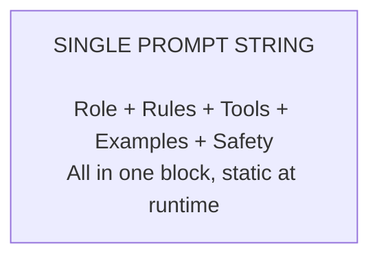
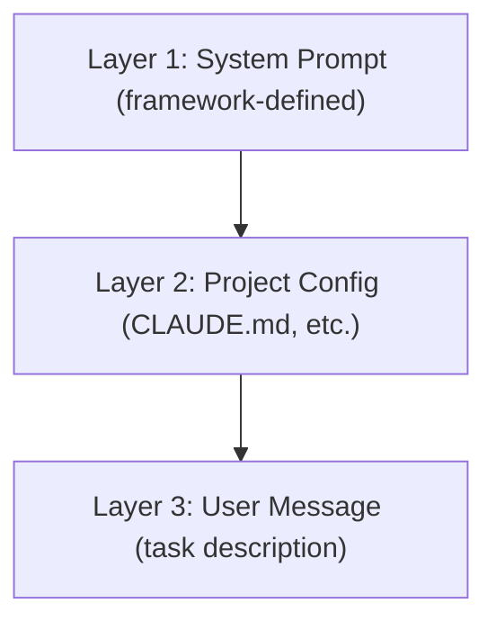
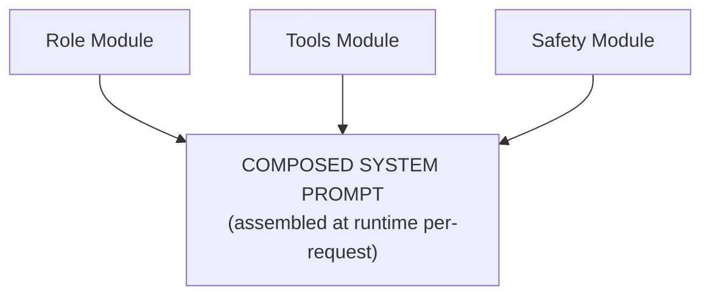
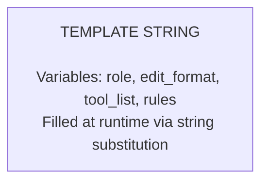
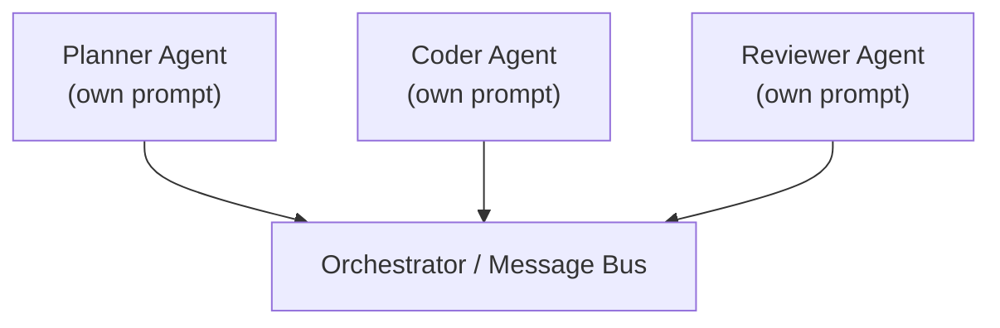
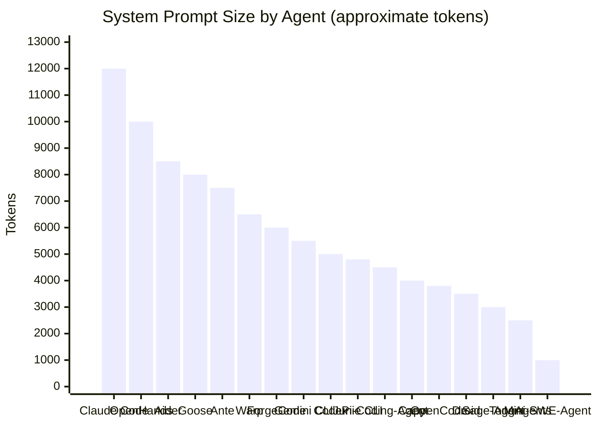
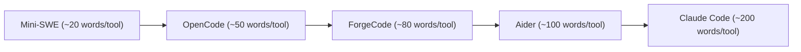
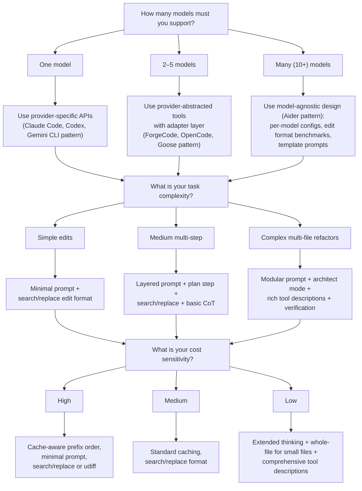

# Cross-Agent Comparison of Prompt Engineering Approaches

This document synthesizes findings from all 17 agents studied in this research library into a
unified comparative analysis. Where the sibling documents in this directory examine individual
techniques in depth — system prompts, tool descriptions, chain-of-thought, caching — this
document examines how those techniques combine differently across agent implementations and what
patterns emerge from the comparison.

The goal is not to rank agents but to map the design space: to show where consensus has formed,
where meaningful divergence exists, and what tradeoffs each approach implies.

---

## 1. Methodology

### 1.1 What Was Compared

Each agent was analyzed across seven dimensions of prompt engineering:

1. **System prompt architecture** — How the foundational instructions are structured, composed,
   and delivered to the model. See [system-prompts.md](system-prompts.md) for detailed analysis.
2. **Tool description format** — How tools are described to the model via API schemas, inline
   text, or hybrid approaches. See [tool-descriptions.md](tool-descriptions.md).
3. **Edit format** — The output format the agent uses for code modifications. See
   [structured-output.md](structured-output.md) and [few-shot-examples.md](few-shot-examples.md).
4. **Reasoning strategy** — Whether and how the agent directs the model to reason before acting.
   See [chain-of-thought.md](chain-of-thought.md).
5. **Caching approach** — How prompt construction accounts for provider-level caching of prefixes
   and context. See [prompt-caching.md](prompt-caching.md).
6. **Multi-model support** — Whether the agent targets one model family or abstracts across
   providers. See [model-specific-tuning.md](model-specific-tuning.md).
7. **Notable innovations** — Unique techniques not found in the majority of agents.

### 1.2 How Analysis Was Conducted

Each agent's source code was examined directly:

- System prompt strings and template files were extracted and compared.
- Tool definition schemas were diffed structurally (JSON Schema ordering, description length,
  example inclusion).
- Edit format implementations were traced from prompt instruction through to output parsing.
- Caching logic was identified by searching for cache control headers, prefix ordering patterns,
  and provider-specific API usage.
- Multi-model support was assessed by examining provider abstraction layers, model configuration
  files, and per-model prompt variations.

Agent-specific details are documented in `../../agents/` with one directory per agent.

### 1.3 Limitations

This analysis captures a point-in-time snapshot. CLI coding agents are among the fastest-evolving
categories in software, with many agents shipping breaking changes to prompt architecture on a
weekly basis. Specific caveats:

- Token counts are approximate, measured via tiktoken cl100k_base encoding.
- Some agents (notably **Claude Code** and **Codex**) have proprietary server-side prompt
  components not visible in open-source code.
- Agent capability and prompt quality are not perfectly correlated — runtime infrastructure,
  model selection, and tool reliability all contribute to end-user experience.
- Commercial agents may use prompt engineering techniques in hosted backends that are not
  reflected in their open-source CLI code.

---

## 2. The Master Comparison Table

The following table summarizes all 17 agents across the primary comparison dimensions.

| Agent | Language | System Prompt Style | Tool Format | Edit Format | CoT Strategy | Caching | Multi-Model | Notable Innovation |
|---|---|---|---|---|---|---|---|---|
| **Claude Code** | TypeScript | Dynamic composition | Native `tool_use` | Search/replace + whole-file | Extended thinking | Anthropic `cache_control` | Claude-only | Comprehensive tool descriptions with behavioral hints |
| **Codex** | TypeScript/Rust | Concise focused prompt | Function calling | `apply-patch` format | Reasoning within sandbox | OpenAI auto-cache | GPT-only | Sandboxed execution model |
| **ForgeCode** | Rust | Modular templates | `tool_use` with schema optimization | Search/replace | Implicit reasoning | Cache-aware prefix ordering | Multi-model via providers | Schema-optimized tool definitions |
| **Droid** | Kotlin | Android-domain-specific | Function calling | Custom edit format | Task-specific reasoning | Basic | Android-focused models | Domain-specific tooling |
| **Ante** | TypeScript | Convention-driven with structured rules | `tool_use` | Structured edit blocks | Plan-then-execute | Basic | Multi-model | Convention-over-configuration approach |
| **OpenCode** | Go | Clean minimal prompts | Provider-abstracted tools | Search/replace | Implicit | Prefix-ordered | Multi-model with adapters | Terminal-native UI with provider abstraction |
| **OpenHands** | Python | Microagent architecture | `tool_use` | Whole-file + diff | Planning-heavy with micro-agents | Research-grade | Multi-model | Microagent architecture |
| **Warp** | Rust/TypeScript | Shell-aware with terminal context | Function calling | Inline edits | Shell-context reasoning | Terminal-integrated | Multi-model | Terminal integration awareness |
| **Gemini CLI** | TypeScript | Gemini-optimized system instructions | Function declarations | Diff-based | Implicit | Gemini context caching | Gemini-only | `GEMINI.md` project configuration |
| **Goose** | Rust | Block-based extensible | Provider-abstracted tools | Block-based edits | Modular reasoning | Basic | Multi-model via extensions | Extension-based architecture |
| **Junie CLI** | Kotlin | IDE-context-aware | Function calling | IDE-integrated edits | Plan-verify pattern | Basic | JetBrains models | IDE context injection |
| **Mini-SWE-Agent** | Python | Minimal research-focused | Text commands | Custom command format | Step-by-step | None | Research models | Minimal viable agent design |
| **Pi-Coding-Agent** | Python | Iterative refinement | `tool_use` | Search/replace | Iterative reasoning loops | Basic | Multi-model | Community-driven development |
| **Aider** | Python | Edit-format-centric with extensive examples | Freeform text + regex parsing | udiff/whole/diff/search-replace | Architect mode (separate model) | None built-in | 50+ models with per-model configs | Pioneered edit format benchmarking |
| **Sage-Agent** | Python | CoT-emphasis with explicit reasoning | `tool_use` | Structured edits | Strong explicit CoT | None | Basic multi-model | Chain-of-thought-first approach |
| **TongAgents** | Python | Multi-agent role-specialized | Inter-agent messaging | Delegated to specialists | Role-based reasoning | None | Multi-model | Multi-agent specialization |
| **Capy** | TypeScript | Careful diff-focused | `tool_use` | Precise diff handling | Verification-heavy | Basic | Basic multi-model | Copy-edit precision focus |

### 2.1 Patterns Visible in the Table

🟢 **Observed in 10+ agents** — Search/replace or diff-based edit formats dominate. The majority
of agents have converged on some variant of find-and-replace as the primary edit mechanism.

🟢 **Observed in 10+ agents** — Multi-model support is now the norm rather than the exception.
Only three agents (Claude Code, Codex, Gemini CLI) are locked to a single provider.

🟡 **Observed in 4–9 agents** — Explicit cache-awareness in prompt construction. While many
agents benefit from provider-level automatic caching, only a subset deliberately engineer prompt
prefixes to maximize cache hit rates.

🔴 **Observed in 1–3 agents** — Multi-agent role specialization as a prompt architecture pattern.
Only TongAgents and OpenHands implement true role-based prompt separation.

---

## 3. Prompt Architecture Taxonomy

Across the 17 agents, five distinct architectural patterns emerge for how system prompts are
structured and delivered to the model. These are not mutually exclusive — some agents combine
elements of multiple patterns — but each agent has a dominant approach.

### 3.1 Monolithic

A single large prompt string, often hardcoded or loaded from one file.

**Agents**: Mini-SWE-Agent, early Aider versions, Sage-Agent

Tradeoffs: Simple to understand and debug. Cannot adapt to context. Prompt bloat becomes
unmanageable as the agent grows. Every user pays the token cost for every instruction regardless
of relevance.

### 3.2 Layered

System prompt + project-level instructions + user message, each with distinct trust and scope.

**Agents**: Claude Code (CLAUDE.md), Gemini CLI (GEMINI.md), Junie CLI

Tradeoffs: Clean separation of concerns. Framework developers, project maintainers, and end
users each control their own layer. Requires trust boundary enforcement between layers. Project
instructions can override framework defaults if not carefully scoped.

### 3.3 Modular / Composed

Prompt assembled from discrete modules at runtime based on context, available tools, and task.

**Agents**: ForgeCode, OpenHands, Goose, Ante, Claude Code (dynamic tool injection)

Tradeoffs: Maximum flexibility. Only relevant instructions are included, reducing token waste.
Higher implementation complexity. Composition bugs can produce inconsistent or contradictory
prompts. Harder to reason about the "full prompt" during debugging.

### 3.4 Template-Based

String templates with variable substitution, often using language-native formatting.

**Agents**: Aider (extensive Jinja-like templates), OpenCode, Pi-Coding-Agent, Capy

Tradeoffs: Good balance of flexibility and simplicity. Templates are readable and diffable.
Variable injection points are explicit. Less dynamic than full composition — templates encode
structure assumptions. Can become unwieldy with deeply nested conditionals.

### 3.5 Multi-Agent

Different prompts for different agent roles, with inter-agent communication protocols.

**Agents**: TongAgents (role-specialized agents), OpenHands (micro-agents), Aider (architect
mode as a two-agent pattern)

Tradeoffs: Natural decomposition of complex tasks. Each role can be optimized independently.
Requires coordination overhead. Inter-agent communication introduces latency and potential
information loss. Debugging multi-agent interactions is significantly harder.

---

## 4. System Prompt Size Comparison

System prompt size varies enormously across agents, from under 500 tokens to over 15,000 tokens.
The following chart shows approximate token counts for each agent's base system prompt (excluding
dynamically injected tool schemas and project-level instructions).

### 4.1 What Drives Prompt Size

🟢 **Observed in 10+ agents** — The number of tools is the strongest predictor of prompt size.
Claude Code, with 30+ tools and extensive behavioral hints in each description, has the largest
prompt. Mini-SWE-Agent, with fewer than 5 tools, has the smallest.

🟡 **Observed in 4–9 agents** — Agents that include few-shot examples in the system prompt
(Aider, Claude Code, Ante) are consistently larger than those that rely on the model's
pre-training knowledge of edit formats.

🔴 **Observed in 1–3 agents** — Safety and permission rules contribute meaningfully to prompt
size only in agents designed for untrusted environments (Claude Code, Codex).

### 4.2 Size vs. Effectiveness

Larger prompts are not inherently better. Aider's research demonstrates that prompt structure
and edit format selection have more impact on benchmark performance than raw prompt size. However,
the agents with the highest real-world adoption — Claude Code, Aider, OpenHands — all have
above-average prompt sizes, suggesting that comprehensive instructions provide value when paired
with strong underlying models.

For detailed analysis of system prompt construction, see [system-prompts.md](system-prompts.md).

---

## 5. Edit Format Comparison

Edit format — the output structure the agent uses to express code modifications — is one of the
most consequential prompt engineering decisions. It directly affects accuracy, token efficiency,
and the range of edits the agent can express.

### 5.1 Format Taxonomy

| Format | Agents Using It | Description |
|---|---|---|
| Search/Replace | Claude Code, ForgeCode, OpenCode, Pi-Coding-Agent, Aider | Find exact text, replace with new text |
| Unified Diff | Aider (udiff mode), Gemini CLI | Standard diff format with `@@` hunks |
| Whole-File | Aider (whole mode), OpenHands | Rewrite entire file contents |
| Apply-Patch | Codex | Git-style patch format |
| Block-Based | Goose | Labeled blocks with edit operations |
| Custom Command | Mini-SWE-Agent | Agent-specific edit commands |
| IDE-Integrated | Junie CLI, Droid | Edits via IDE APIs, not text formats |
| Structured Blocks | Ante, Sage-Agent | Tagged code blocks with file paths |
| Precise Diff | Capy | Strict diff with verification steps |
| Delegated | TongAgents | Specialist agents choose format |
| Inline | Warp | Terminal-context inline replacements |

### 5.2 Accuracy Implications

🟢 **Observed in 10+ agents** — Search/replace is the most widely adopted format, a convergence
driven in part by Aider's public benchmark data showing it achieves strong accuracy across
models while remaining token-efficient.

Aider's edit format benchmarking (the first systematic comparison published) found:

| Format | Relative Accuracy | Token Cost | Best For |
|---|---|---|---|
| Whole-file | High for small files | Very high | Files under 200 lines |
| Search/replace | High across file sizes | Moderate | General-purpose editing |
| Unified diff | Moderate | Low | Large mechanical changes |
| Diff (legacy) | Lower | Low | Simple substitutions |

These findings have influenced the broader ecosystem. ForgeCode, OpenCode, and Pi-Coding-Agent
all adopted search/replace after Aider demonstrated its effectiveness.

### 5.3 Token Efficiency

Whole-file rewrites are the most expensive format — they require the model to regenerate every
unchanged line. For a 500-line file where only 3 lines change, whole-file output costs ~500
tokens of redundant content. Search/replace costs only the matched region plus the replacement,
typically 10–50 tokens for small edits. Unified diff is the most token-efficient for large
changes across many files but requires precise line-number awareness that many models lack.

For detailed analysis, see [structured-output.md](structured-output.md) and
[few-shot-examples.md](few-shot-examples.md).

---

## 6. Tool Description Strategies Compared

How agents describe their tools to the model reveals a spectrum from minimalist to maximalist
approaches, each with distinct tradeoffs.

### 6.1 The Spectrum

### 6.2 Strategy Comparison

| Strategy | Agents | Description | Tradeoff |
|---|---|---|---|
| Minimal text | Mini-SWE-Agent, Droid | Short name + one-line description | Low token cost, relies on model intuition |
| Schema-first | ForgeCode, Goose | Optimized JSON Schema with `required` before `properties` | Reduces malformed arguments, schema ordering matters |
| Description-first | Claude Code, Ante | Rich behavioral hints in description text | Higher accuracy on complex tasks, higher token cost |
| Example-embedded | Aider, Claude Code | Inline usage examples within tool descriptions | Best accuracy, highest token cost |
| Provider-abstracted | OpenCode, Goose | Generic descriptions adapted per provider | Portability across models, may miss model-specific optimizations |

### 6.3 Tool Count per Agent

🟢 **Observed in 10+ agents** — Most agents offer between 5 and 15 tools. The sweet spot
appears to be 8–12 tools: enough to cover file operations, shell access, and search without
overwhelming the model's tool selection mechanism.

| Agent | Approx. Tool Count | Categories |
|---|---|---|
| Claude Code | 30+ | File, shell, search, git, MCP, notebook, memory |
| OpenHands | 15–20 | File, shell, browser, search, delegation |
| Goose | 12–18 | File, shell, search, extensions (variable) |
| Aider | 8–12 | File edit, shell, search, git |
| ForgeCode | 8–10 | File, shell, search, schema-optimized |
| Gemini CLI | 8–10 | File, shell, search, Gemini-specific |
| Most others | 5–10 | File, shell, search (core set) |
| Mini-SWE-Agent | 3–5 | File, shell (minimal) |

For detailed analysis, see [tool-descriptions.md](tool-descriptions.md).

---

## 7. Reasoning Strategy Comparison

How agents direct models to reason — or leave reasoning implicit — varies significantly and
has measurable impact on task completion rates, especially for complex multi-step problems.

### 7.1 Reasoning Approach Taxonomy

| Approach | Agents | Mechanism | When It Helps |
|---|---|---|---|
| Extended thinking | Claude Code | `extended_thinking` API parameter with budget tokens | Complex architectural decisions, multi-file changes |
| Architect mode | Aider | Separate planning model generates instructions for coding model | Large refactors, unfamiliar codebases |
| Plan-then-execute | Ante, Junie CLI | Explicit planning step before any tool calls | Multi-step tasks requiring coordination |
| Explicit CoT directives | Sage-Agent | Prompt instructs "think step by step" | Tasks requiring logical decomposition |
| Micro-agent planning | OpenHands | Specialized micro-agents for planning sub-tasks | Complex research + coding workflows |
| Role-based reasoning | TongAgents | Different agents reason within their role context | Tasks requiring domain specialization |
| Iterative reasoning | Pi-Coding-Agent | Loops of reason → act → observe → reason | Debugging, iterative refinement |
| Verification-heavy | Capy | Post-edit verification reasoning steps | Precision-critical edits |
| Implicit reasoning | ForgeCode, OpenCode, Codex, Gemini CLI | No explicit reasoning directives; relies on model capability | When model is strong enough to reason without prompting |
| Shell-context | Warp | Reasoning grounded in terminal state and history | Shell-centric tasks |
| Step-by-step | Mini-SWE-Agent | Simple sequential step execution | Research benchmarks |

### 7.2 Key Findings

🟢 **Observed in 10+ agents** — All agents benefit from some form of reasoning, but the majority
now rely on implicit reasoning from capable models rather than explicit "think step by step"
directives. This reflects a shift as base model capabilities improve.

🟡 **Observed in 4–9 agents** — The plan-then-execute pattern is gaining adoption. Agents that
separate planning from execution (Aider's architect mode, Ante's plan step, Junie's plan-verify)
report improved outcomes on complex multi-file tasks.

🔴 **Observed in 1–3 agents** — Extended thinking via dedicated API parameters (Claude Code's
`extended_thinking`) is provider-specific and only available to single-model agents.

### 7.3 The Architect Pattern in Detail

Aider pioneered the two-model architect pattern: a stronger "architect" model generates a natural
language plan, and a "coder" model translates that plan into concrete edits. This allows using an
expensive frontier model for planning while using a cheaper, faster model for the mechanical edit
work. The pattern has influenced Junie CLI's plan-verify approach and Ante's plan-then-execute
strategy, though neither uses a separate model for the planning step.

For detailed analysis, see [chain-of-thought.md](chain-of-thought.md).

---

## 8. Multi-Model Support Spectrum

The degree to which an agent supports multiple language models is a fundamental architectural
decision that shapes prompt engineering strategy at every level.

### 8.1 The Spectrum

```mermaid
flowchart LR
    subgraph single["Single-Model"]
        CC["Claude Code"]
        Codex["Codex"]
        GC["Gemini CLI"]
    end
    subgraph multi["Multi-Model"]
        FC["ForgeCode"]
        OC["OpenCode"]
        Goose["Goose"]
        OH["OpenHands"]
        Warp["Warp"]
        Ante["Ante"]
        PCA["Pi-Coding-Agent"]
        Capy["Capy"]
        SA["Sage-Agent"]
        TA["TongAgents"]
    end
    subgraph agnostic["Model-Agnostic"]
        Aider["Aider (50+ models)"]
    end
    single -->|"more flexibility"| multi -->|"maximum choice"| agnostic
```

### 8.2 What Each Approach Trades Off

| Approach | Advantages | Disadvantages |
|---|---|---|
| Single-model | Deepest API integration, optimal caching, provider-specific features (extended thinking, function calling nuances) | Vendor lock-in, no fallback, user pays one provider's pricing |
| Multi-model with adapters | Flexibility, competitive pricing, fallback options | Must maintain per-model prompt variations, cannot use provider-specific features deeply |
| Model-agnostic | Maximum user choice, community-driven model support, competitive benchmarking | Complex configuration, prompt must be lowest-common-denominator or heavily templated |

### 8.3 Prompt Engineering Implications

🟢 **Observed in 10+ agents** — Multi-model agents must make prompt engineering compromises.
Tool schemas must conform to the intersection of supported formats (OpenAI function calling,
Anthropic tool_use, Google function declarations). This pushes toward simpler, more portable
prompt designs.

🟡 **Observed in 4–9 agents** — Single-model agents exploit provider-specific features that
multi-model agents cannot: Anthropic's `cache_control` breakpoints, OpenAI's structured outputs
with strict JSON Schema, Gemini's context caching with explicit TTL.

🔴 **Observed in 1–3 agents** — Aider's approach of maintaining per-model edit format
configurations and benchmark data is unique. It is the only agent that systematically tests
which edit format works best for each model and encodes those results in its configuration.

For detailed analysis, see [model-specific-tuning.md](model-specific-tuning.md).

---

## 9. Caching Strategy Comparison

Prompt caching — reusing previously computed key-value attention states for repeated prompt
prefixes — can reduce latency by 50–80% and cost by 50–90% for subsequent requests. However,
exploiting caching requires deliberate prompt construction.

### 9.1 Caching Awareness by Agent

| Agent | Caching Strategy | Mechanism |
|---|---|---|
| Claude Code | Explicit cache_control breakpoints | Anthropic `cache_control: {type: "ephemeral"}` on system prompt blocks |
| Codex | Auto-caching via provider | OpenAI automatic prefix caching |
| ForgeCode | Cache-aware prefix ordering | Deliberately orders stable content first in prompts |
| Gemini CLI | Gemini context caching | Explicit context caching with TTL management |
| OpenCode | Prefix-ordered construction | Stable system prompt prefix, dynamic content appended |
| Warp | Terminal-integrated caching | Caching integrated with terminal session state |
| Goose | Basic provider caching | Relies on provider auto-caching |
| Ante | Basic | Minimal caching awareness |
| Junie CLI | Basic | Minimal caching awareness |
| Pi-Coding-Agent | Basic | Minimal caching awareness |
| Capy | Basic | Minimal caching awareness |
| Droid | Basic | Minimal caching awareness |
| OpenHands | Research-grade | Custom caching for research workloads |
| Aider | None built-in | No explicit caching strategy |
| Sage-Agent | None | No caching awareness |
| TongAgents | None | No caching awareness |
| Mini-SWE-Agent | None | No caching awareness |

### 9.2 Key Patterns

🟢 **Observed in 10+ agents** — Most agents receive some benefit from provider-level automatic
caching even without explicit engineering, because system prompts are naturally stable prefixes.

🟡 **Observed in 4–9 agents** — Deliberate cache engineering (prefix ordering, cache control
breakpoints, explicit TTL management) is practiced by the more mature agents and yields
measurably better cost/latency profiles.

🔴 **Observed in 1–3 agents** — Claude Code's granular `cache_control` placement on individual
system prompt blocks and ForgeCode's schema-ordering-for-caching approach represent the most
sophisticated caching strategies observed.

For detailed analysis, see [prompt-caching.md](prompt-caching.md).

---

## 10. Key Insights and Patterns

### 10.1 What the Strongest Agents Have in Common

The agents with the highest real-world adoption (Claude Code, Aider, Codex) and the strongest
research benchmark results (OpenHands, Mini-SWE-Agent on SWE-bench) share several prompt
engineering characteristics:

1. **Rich tool descriptions** — Top agents invest heavily in tool description quality. Claude
   Code's 200+ word descriptions with behavioral hints, Aider's edit-format-as-interface design,
   and ForgeCode's schema optimization all reflect the understanding that tool descriptions are
   a primary reliability lever.

2. **Edit format rigor** — The best agents treat edit format as a first-class engineering
   decision, not an afterthought. Aider benchmarks formats against models. Claude Code supports
   multiple formats. ForgeCode optimizes the schema path for edit tools.

3. **Contextual prompt construction** — Static prompts are the baseline; strong agents
   dynamically compose prompts based on available tools, project context, and task type.

4. **Safety and guardrails** — Production agents (Claude Code, Codex) invest significantly in
   permission systems, command denylists, and behavioral constraints. Research agents
   (Mini-SWE-Agent) often omit these.

### 10.2 The Convergence Toward Search/Replace

The most striking convergence across agents is the adoption of search/replace as the dominant
edit format. This convergence was not coordinated — it emerged independently as multiple teams
discovered that search/replace offers the best tradeoff between:

- **Accuracy** — exact text matching reduces hallucinated edits
- **Token efficiency** — only the changed region is specified
- **Model compatibility** — works well across Claude, GPT, Gemini, and open-source models
- **Debuggability** — failed matches produce clear, actionable errors

Agents that adopted search/replace after evaluating alternatives include ForgeCode (migrated
from whole-file), OpenCode (adopted from inception), and Pi-Coding-Agent (community consensus).

### 10.3 Single-Model Optimization vs. Multi-Model Flexibility

A clear bifurcation exists in the agent ecosystem:

- **Single-model agents** (Claude Code, Codex, Gemini CLI) achieve deeper integration with
  their target provider — cache control, extended thinking, structured outputs — at the cost
  of vendor lock-in.
- **Multi-model agents** (Aider, ForgeCode, OpenCode, Goose) offer user choice and competitive
  pricing but must engineer prompts that work across providers, often sacrificing access to
  provider-specific optimizations.

Neither approach dominates. The market rewards both: Claude Code and Aider are among the most
widely adopted agents despite representing opposite ends of this spectrum.

### 10.4 The Trend Toward Richer Tool Descriptions

Early agents used minimal tool descriptions — a name and a one-line summary. The trend across
all 17 agents is unmistakably toward richer descriptions that include:

- Behavioral guidance ("prefer this tool for small edits")
- Preconditions ("file must exist before editing")
- Error handling hints ("if the search string is not found, read the file first")
- Usage examples (inline in the description text)

This trend reflects empirical findings that models make better tool selections and construct
more accurate arguments when descriptions are comprehensive.

### 10.5 Why Smaller Prompts Sometimes Outperform

Mini-SWE-Agent's strong performance on SWE-bench Lite with a minimal ~1,000-token prompt
challenges the assumption that larger prompts are always better. Several factors explain this:

- **Focused attention** — Shorter prompts leave more of the model's attention budget for the
  actual task context.
- **Reduced instruction conflict** — Fewer rules means fewer opportunities for contradictory
  instructions.
- **Research context** — SWE-bench tasks are well-defined; production tasks are ambiguous. The
  value of comprehensive prompts scales with task ambiguity.

---

## 11. Decision Framework

The following framework helps practitioners select a prompt engineering approach based on their
constraints and requirements.

### 11.1 Recommended Starting Points

For practitioners building new coding agents, the following recommendations emerge from this
cross-agent analysis:

1. **Start with search/replace edit format** — It has the broadest model support and the
   strongest empirical validation. Only switch to alternatives if benchmarking shows improvement
   for your specific model and use case.

2. **Invest in tool descriptions early** — The quality of tool descriptions has a higher
   return-on-investment than almost any other prompt engineering dimension. Include behavioral
   hints, preconditions, and at least one usage example per tool.

3. **Design prompts for caching from day one** — Place stable content (role definition, tool
   schemas, safety rules) at the beginning of the prompt. Place dynamic content (project
   context, conversation history) at the end.

4. **Add reasoning structure incrementally** — Start with implicit reasoning. Add explicit
   planning steps only when task complexity demands it. Use architect mode only for the most
   complex multi-file refactoring scenarios.

5. **Benchmark before optimizing** — Aider's methodology of systematically testing edit formats
   and prompt variations against standard benchmarks is the gold standard. Do not assume that a
   technique that works for one model generalizes to others.

---

*This analysis is based on the study of 17 open-source and commercial coding agent frameworks,
examining their prompt engineering architectures, design patterns, and engineering tradeoffs.
The field is evolving rapidly — patterns documented here reflect the state of these projects as
of the analysis date. Agent-specific implementation details are available in `../../agents/`.*

*Last updated: July 2025*