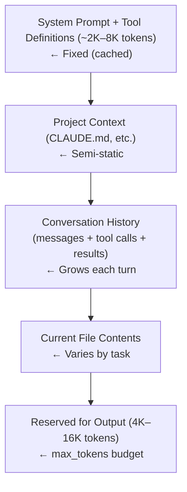

# Model-Specific Prompt Tuning in Coding Agents

## 1. Why One Prompt Doesn't Fit All Models

A fundamental challenge in multi-model coding agents is that the same prompt produces dramatically
different behavior across model families — broken tool calls, ignored instructions, malformed
output, and degraded benchmark performance. The reasons are structural, not superficial.

### Training Data Differences

Each model family was trained on different corpora with different formatting conventions emphasized.
**Claude** models were trained with heavy exposure to XML-structured documents and Anthropic's own
documentation conventions. **GPT-4** and its successors were trained on data where markdown headers,
JSON structures, and OpenAI's function-calling format are dominant patterns. **Gemini** models
reflect Google's internal documentation practices and protocol buffer–style structured data.

These training differences mean that certain formatting conventions are more "natural" to each
model — when a prompt uses a familiar format, the model follows instructions more reliably. When
the format is unfamiliar, the model may partially ignore sections, hallucinate formatting, or
fail to parse structured boundaries correctly.

### Tokenizer Differences

Tokenization affects how a model "sees" prompt structure. XML tags like `<instructions>` may
tokenize cleanly on one model but fragment on another. Markdown headers (`## Section`) tokenize
differently across BPE implementations. If a structural delimiter doesn't tokenize cleanly, the
model is less likely to treat it as a meaningful boundary.

### Empirical Evidence from Aider

**Aider** provides the most rigorous public evidence for model-specific prompt tuning. Aider
maintains a benchmark suite that tests identical coding tasks across dozens of models, and their
results show that the same edit-format prompt produces wildly different success rates:

```
# Aider benchmark results — same task, different models, same prompt format
# Source: aider.chat/docs/leaderboards

Model                  | whole-file format | diff format | udiff format
-----------------------|-------------------|-------------|-------------
GPT-4 Turbo            |       52.3%       |    62.1%    |    58.7%
Claude 3.5 Sonnet      |       71.2%       |    64.8%    |    72.4%
Gemini 1.5 Pro         |       48.1%       |    45.3%    |    51.2%
DeepSeek Coder V2      |       39.7%       |    44.2%    |    41.8%
```

The optimal edit format differs per model. Claude performs best with udiff, GPT-4 Turbo prefers
diff, and smaller open models often need whole-file output because they cannot reliably produce
valid diffs. This is why Aider implements per-model format selection as a first-class concern.

### Format Preference Comparison

| Aspect | Claude Family | GPT Family | Gemini Family | Open-Weight Models |
|---|---|---|---|---|
| Structural delimiters | XML tags (`<tag>`) | Markdown headers (`##`) | System instruction API | Chat template tokens |
| Tool calling | `tool_use` content blocks | `function` / `tool` calls | `function_declaration` | Freeform or none |
| Preferred output format | XML-wrapped or freeform | JSON mode / structured | Flexible | Varies widely |
| System prompt support | Native (messages API) | Native (system role) | Separate `system_instruction` | Template-dependent |
| Reasoning mode | Extended thinking (`budget_tokens`) | o1/o3 reasoning tokens | Thinking mode | Not available |

---

## 2. Claude-Family Prompt Patterns

Claude models (Claude 3 Haiku, Sonnet, Opus; Claude 3.5 Sonnet; Claude 4 Sonnet, Opus) respond
exceptionally well to XML-structured prompts — a pattern Anthropic themselves recommend.

### XML Tags as First-Class Citizens

Claude treats XML tags as strong semantic boundaries. Tags like `<instructions>`, `<context>`,
and `<rules>` create clear sections that Claude respects more reliably than markdown headers:

```xml
<!-- Claude-optimized prompt structure used by Claude Code and adapted by others -->
<identity>
You are an expert software engineer working as a CLI coding agent.
You have access to tools for reading files, writing files, and executing commands.
</identity>

<instructions>
- Read the codebase before making changes
- Make minimal, surgical edits that fully address the request
- Always verify changes by running existing tests
- Never commit secrets or credentials to source code
</instructions>

<context>
The user is working in a {{language}} project at {{project_root}}.
Build system: {{build_system}}
Test framework: {{test_framework}}
</context>

<output_rules>
- Use the provided tools to make changes — do not output raw code blocks
- Explain your approach briefly before implementing
- After making changes, run tests to verify correctness
</output_rules>
```

**Claude Code** uses this pattern extensively — since it is Anthropic's own agent, it is the
canonical example of Claude-optimized prompting. Its system prompt uses XML sections throughout,
and the framework injects tool results, file contents, and project instructions into tagged
regions. See [../../agents/claude-code/](../../agents/claude-code/) for full analysis.

### Messages API and Extended Thinking

Claude's Messages API supports system prompts as a dedicated parameter, tool definitions as
structured `tools` arrays, and extended thinking with a reasoning budget:

```python
# Claude API call with extended thinking — pattern observed in Claude Code
response = client.messages.create(
    model="claude-sonnet-4-20250514",
    max_tokens=16000,
    temperature=1.0,  # Required when extended thinking is enabled
    thinking={"type": "enabled", "budget_tokens": 10000},
    system="You are an expert coding agent...",
    tools=[{
        "name": "edit_file",
        "description": "Replace text in a file",
        "input_schema": {
            "type": "object",
            "properties": {
                "path": {"type": "string"},
                "old_text": {"type": "string"},
                "new_text": {"type": "string"}
            },
            "required": ["path", "old_text", "new_text"]
        }
    }],
    messages=[{"role": "user", "content": "Fix the bug in auth.py"}]
)
```

### The Prefill Technique

A Claude-specific optimization is *prefilling* — pre-populating the assistant turn start to steer
output format:

```python
# Prefill technique — guide Claude's response format
messages = [
    {"role": "user", "content": "Read the file src/main.py"},
    {"role": "assistant", "content": '{"tool": "read_file", "path": "'}
    # Claude will continue from here, completing the JSON
]
```

### Temperature and Token Strategies

🟢 **Observed in 10+ agents** — Claude-targeting agents universally set low temperature for code.
Claude's API requires an explicit `max_tokens` (no default); agents set 4096–16000:

- Temperature 0.0–0.3 for code editing and file manipulation
- Temperature 1.0 when extended thinking is enabled (Anthropic requirement)
- `max_tokens` must always be specified — Claude has no default
- 200K token context window allows ingesting large codebases without truncation

---

## 3. GPT-Family Prompt Patterns

OpenAI's GPT models (GPT-4, GPT-4 Turbo, GPT-4o, o1, o3, o3-mini) favor markdown-structured
prompts and have the most mature function-calling API in the ecosystem.

### Markdown-Oriented Formatting

GPT models respond well to prompts organized with markdown headers, numbered lists, and bold
emphasis:

```markdown
## Role
You are an expert software engineer acting as a CLI coding agent.

## Rules
1. Read the relevant code before making changes
2. Make minimal, targeted edits
3. Run tests after every change
4. Never execute destructive commands without confirmation

## Output Format
- Use function calls to interact with the file system
- Provide brief explanations before each action
- Report test results after verification
```

### Function Calling and Structured Outputs

GPT models pioneered the function-calling pattern that other providers later adopted:

```python
# GPT-4 function calling — the pattern Codex and Aider use for GPT models
response = openai.chat.completions.create(
    model="gpt-4o",
    temperature=0.0,
    max_tokens=4096,
    tools=[{
        "type": "function",
        "function": {
            "name": "edit_file",
            "description": "Edit a file by replacing old text with new text",
            "parameters": {
                "type": "object",
                "properties": {
                    "path": {"type": "string", "description": "Absolute path"},
                    "old_text": {"type": "string", "description": "Text to find"},
                    "new_text": {"type": "string", "description": "Replacement"}
                },
                "required": ["path", "old_text", "new_text"]
            }
        }
    }],
    messages=[
        {"role": "system", "content": "You are an expert coding agent..."},
        {"role": "user", "content": "Fix the null pointer in auth.py"}
    ]
)
```

### Reasoning Models (o1, o3)

The o1 and o3 family introduced a key divergence: these models initially had no system prompt
support — instructions went in the first user message. Later revisions added a `developer` role.
Agents must handle both cases:

```python
# opencode/internal/llm/openai.go (pattern)
# o1/o3 models require special handling for system prompts
if model.startswith("o1") or model.startswith("o3"):
    # Use developer role instead of system role
    messages = [
        {"role": "developer", "content": system_prompt},
        {"role": "user", "content": user_message}
    ]
    # o1/o3 use max_completion_tokens, not max_tokens
    params["max_completion_tokens"] = 16000
    # Temperature is fixed at 1.0 for reasoning models
else:
    messages = [
        {"role": "system", "content": system_prompt},
        {"role": "user", "content": user_message}
    ]
    params["max_tokens"] = 4096
    params["temperature"] = 0.0
```

**Codex** (OpenAI's own agent) is naturally optimized for GPT models with structured JSON output,
function calling, and markdown system prompts. See [../../agents/codex/](../../agents/codex/).

### Temperature Conventions

GPT models default to temperature 1.0, but 🟢 **Observed in 10+ agents** — coding agents override
this to 0.0 for deterministic output. The distinction between `max_tokens` (GPT-4, GPT-4 Turbo)
and `max_completion_tokens` (o1, o3) is a common source of bugs when adding reasoning model support.

---

## 4. Gemini-Family Prompt Patterns

Google's Gemini models (Gemini 1.5 Flash/Pro, Gemini 2.0 Flash, Gemini 2.5 Pro) have a distinct
API that separates system instructions from message history.

### System Instruction API

Unlike OpenAI and Anthropic, Gemini uses a dedicated `system_instruction` field architecturally
separate from the conversation:

```python
# Gemini API — system instruction is structurally separate from messages
# Pattern used by Gemini CLI
import google.generativeai as genai

model = genai.GenerativeModel(
    model_name="gemini-2.5-pro",
    system_instruction="""You are an expert coding agent running in a terminal.
You have access to tools for file manipulation, shell execution, and code search.
Guidelines:
- Always read relevant files before editing
- Verify changes with tests
- Explain your reasoning before acting""",
    generation_config=genai.GenerationConfig(
        temperature=0.0, max_output_tokens=8192, top_p=0.95
    ),
    safety_settings={
        "HARM_CATEGORY_DANGEROUS_CONTENT": "BLOCK_NONE",
        "HARM_CATEGORY_HARASSMENT": "BLOCK_ONLY_HIGH",
    }
)
chat = model.start_chat()
response = chat.send_message("Fix the authentication bug in login.py")
```

### Safety Settings for Coding Content

A Gemini-specific concern is that default safety filters can block legitimate coding content — code
involving security operations, cryptography, or file system manipulation may trigger filters.
**Gemini CLI** and other Gemini-targeting agents explicitly set safety settings to `BLOCK_NONE`
for the `DANGEROUS_CONTENT` category.

### Large Context and Grounding

Gemini 1.5 and 2.0 models offer context windows of 1M+ tokens — the largest available. Where
Claude and GPT agents must implement aggressive context truncation, Gemini agents can include
entire repository contents. Google Search grounding allows real-time documentation lookups. See
[../../agents/gemini-cli/](../../agents/gemini-cli/) for Gemini CLI's optimizations.

---

## 5. Open-Weight Model Considerations

Open-weight models (Llama 3, DeepSeek Coder, Mistral, Qwen, CodeGemma, and others via Ollama or
vLLM) present unique challenges for prompt engineering.

### Chat Template Variability

Unlike API-based models, open-weight models require the agent to apply the correct chat template:

```python
# Chat template formats vary across open-weight model families

# ChatML format (many fine-tuned models)
CHATML = "<|im_start|>system\n{system_prompt}<|im_end|>\n<|im_start|>user\n{user_message}<|im_end|>\n<|im_start|>assistant\n"

# Llama 3 format
LLAMA3 = "<|begin_of_text|><|start_header_id|>system<|end_header_id|>\n\n{system_prompt}<|eot_id|><|start_header_id|>user<|end_header_id|>\n\n{user_message}<|eot_id|><|start_header_id|>assistant<|end_header_id|>\n\n"

# Alpaca format (instruction-tuned models)
ALPACA = "### Instruction:\n{system_prompt}\n\n### Input:\n{user_message}\n\n### Response:\n"
```

### Model Metadata Configuration

**Aider** is the most comprehensive agent for open-weight support, maintaining a model metadata
registry mapping identifiers to capabilities and optimal settings:

```yaml
# aider/models/model-metadata.yaml (simplified)
- name: "deepseek/deepseek-coder-v2"
  edit_format: "diff"
  use_system_prompt: true
  use_temperature: 0.0
  send_undo_reply: false
  lazy: false
  reminder: "sys"
  examples_as_sys_msg: true
  max_tokens: 8192
  extra_params:
    max_tokens: 8192

- name: "ollama/llama3:70b"
  edit_format: "whole"
  use_system_prompt: true
  use_temperature: 0.2
  lazy: true
  reminder: "user"
  examples_as_sys_msg: false
  max_tokens: 4096
```

🔴 **Observed in 1–3 agents** — **OpenCode** implements model switching with a provider-agnostic
abstraction layer. Its Go implementation defines a `Provider` interface that normalizes model
interaction regardless of whether the backend is OpenAI, Anthropic, Ollama, or a custom endpoint.

### Smaller Context Windows

Many open-weight models have context windows of 4K–32K tokens, far smaller than commercial models'
128K–2M. Agents compensate by prioritizing recent messages, summarizing older turns, limiting file
content to relevant sections, and using RAG instead of full-context inclusion.

### Unreliable Tool Calling

🟡 **Observed in 4–9 agents** — Open-weight models frequently fail to produce valid tool call JSON.
Agents compensate with freeform parsing — scanning text output for patterns resembling tool calls:

```python
# Goose ToolShim — freeform parsing for non-tool-calling models
import re, json

def parse_tool_call_from_text(response_text: str) -> dict | None:
    """Extract a tool call from freeform model output."""
    json_match = re.search(r'```(?:json|tool)?\s*(\{.*?\})\s*```', response_text, re.DOTALL)
    if json_match:
        try: return json.loads(json_match.group(1))
        except json.JSONDecodeError: pass
    brace_match = re.search(r'\{[^{}]*"tool"[^{}]*\}', response_text)
    if brace_match:
        try: return json.loads(brace_match.group(0))
        except json.JSONDecodeError: pass
    return None
```

---

## 6. Temperature and Sampling Strategies

Temperature is the most universally tuned parameter across coding agents.

### The Zero-Temperature Consensus

🟢 **Observed in 10+ agents** — The overwhelming majority of coding agents set temperature to
0.0 for code generation. Code must be syntactically correct and semantically precise — sampling
randomness introduces bugs.

| Agent | Default Temperature | Code Tasks | Planning Tasks | Creative Tasks |
|---|---|---|---|---|
| **Claude Code** | 0.0 | 0.0 | 0.0 | 0.0 |
| **Codex** | 0.0 | 0.0 | 0.0 | — |
| **Aider** | 0.0 | 0.0 | — | — |
| **Gemini CLI** | 0.0 | 0.0 | 0.0 | — |
| **OpenCode** | 0.0 | 0.0 | 0.0 | — |
| **Goose** | 0.0 | 0.0 | 0.0 | 0.5 |
| **ForgeCode** | 0.0 | 0.0 | — | — |
| **Warp** | 0.2 | 0.0 | 0.2 | 0.5 |
| **OpenHands** | 0.0 | 0.0 | 0.0 | — |
| **Droid** | 0.0 | 0.0 | 0.0 | — |
| **Ante** | 0.0 | 0.0 | — | — |
| **Junie CLI** | 0.0 | 0.0 | 0.0 | — |

### Task-Dependent Temperature

🔴 **Observed in 1–3 agents** — A few agents vary temperature by task type. **Warp** uses 0.2 for
planning and natural language, reserving 0.0 for code. **Goose** allows 0.5 for creative tasks.

### Top-p Settings

Most agents leave `top_p` at provider defaults (1.0 or 0.95). Gemini-targeting agents sometimes
set `top_p=0.95` per Google's recommendations. When temperature is 0.0, `top_p` has no effect.

---

## 7. Max Tokens and Context Window Management

Context window management is one of the most complex engineering challenges in coding agents, with
models ranging from 4K to 2M tokens.

### Context Window Sizes

| Model | Context Window |
|---|---|
| GPT-4 | 8K tokens |
| GPT-4 Turbo | 128K tokens |
| GPT-4o | 128K tokens |
| o1 / o3 | 200K tokens |
| Claude 3.5 Sonnet | 200K tokens |
| Claude 4 Sonnet | 200K tokens |
| Gemini 1.5 Pro | 1M–2M tokens |
| Gemini 2.5 Pro | 1M tokens |
| Llama 3 (70B) | 8K–128K tokens (varies by quant) |
| DeepSeek Coder V2 | 128K tokens |
| Mistral Large | 128K tokens |

### Dynamic max_tokens Calculation

🟡 **Observed in 4–9 agents** — Sophisticated agents dynamically calculate `max_tokens` based
on the remaining space in the context window:

```python
# Dynamic max_tokens calculation pattern
# Observed in Aider and OpenCode implementations
def calculate_max_output_tokens(model_context_limit, current_prompt_tokens, reserve=500):
    """Calculate max output tokens to avoid exceeding context window."""
    available = model_context_limit - current_prompt_tokens - reserve
    # Clamp to model's max output limit
    max_output = min(available, model.max_output_tokens)
    # Ensure a reasonable minimum
    return max(max_output, 1024)
```

### Context Window Allocation



### Truncation Strategies

When the context window fills up, agents must decide what to drop:

1. **Drop oldest messages** — Simple FIFO. Used by **Mini-SWE-Agent** and **Pi-Coding-Agent**.
2. **Summarize and compress** — Replace older turns with LLM-generated summaries. **Claude Code**
   implements automatic compaction when context exceeds a threshold.
3. **Sliding window with pinned messages** — Keep system prompt and recent N turns, drop the
   middle. Used by **Aider** with configurable window sizes.
4. **RAG-based retrieval** — Index older context and retrieve on demand. **OpenHands** uses this.

---

## 8. System Prompt Formatting Differences

The same behavioral instruction must be formatted differently for each model family.

### The Same Rule, Four Formats

Consider the instruction: "Always run tests after making code changes."

**Claude format** (XML tags with explicit behavioral framing):
```xml
<rules>
<rule priority="high">After making any code changes using the edit_file tool, you MUST
immediately run the project's test suite using the bash tool. Do not proceed to the next
task until tests pass or you have addressed any failures.</rule>
</rules>
```

**GPT format** (markdown with numbered rules):
```markdown
## Critical Rules
1. **Always run tests after changes.** After using the edit_file function to modify code,
   immediately call the run_command function with the project's test command. Do not proceed
   until tests pass.
```

**Gemini format** (concise system instruction):
```
Guidelines:
- After editing any file, run the test suite immediately
- Do not proceed to additional changes until tests pass
- If tests fail, fix the issue before moving on
```

**Open-model format** (embedded in chat template):
```
### Instruction:
You are a coding agent. Follow these rules strictly:
RULE: After every code edit, run tests. Never skip this step.
```

### Multi-Model Prompt Abstraction

🟡 **Observed in 4–9 agents** — Agents supporting multiple providers implement a prompt
template layer that generates model-appropriate formatting from a single source of truth:

```python
# ForgeCode — provider-specific prompt formatting
# forgecode/src/prompt/formatter.py (pattern)
class PromptFormatter:
    def format_rules(self, rules: list[str], provider: str) -> str:
        if provider == "anthropic":
            lines = ["<rules>"]
            for i, rule in enumerate(rules, 1):
                lines.append(f"<rule id=\"{i}\">{rule}</rule>")
            lines.append("</rules>")
            return "\n".join(lines)
        elif provider == "openai":
            lines = ["## Rules"]
            for i, rule in enumerate(rules, 1):
                lines.append(f"{i}. {rule}")
            return "\n".join(lines)
        elif provider == "google":
            lines = ["Guidelines:"]
            for rule in rules:
                lines.append(f"- {rule}")
            return "\n".join(lines)
        else:
            # Fallback for open-weight models
            lines = ["Follow these rules:"]
            for rule in rules:
                lines.append(f"RULE: {rule}")
            return "\n".join(lines)
```

---

## 9. Tool Call Format Adaptation

Each provider defines tool calling differently. Multi-model agents must normalize these formats.

### Provider-Specific Tool Formats

**OpenAI format:**
```json
{"type": "function", "function": {"name": "read_file", "description": "Read file contents",
  "parameters": {"type": "object", "properties": {"path": {"type": "string"}}, "required": ["path"]}}}
```

**Anthropic format:**
```json
{"name": "read_file", "description": "Read file contents",
  "input_schema": {"type": "object", "properties": {"path": {"type": "string"}}, "required": ["path"]}}
```

**Gemini format:**
```json
{"function_declarations": [{"name": "read_file", "description": "Read file contents",
  "parameters": {"type": "object", "properties": {"path": {"type": "string"}}, "required": ["path"]}}]}
```

### The Provider Adapter Pattern

🟡 **Observed in 4–9 agents** — **Goose**, **OpenCode**, and **ForgeCode** implement a provider
adapter layer that converts a canonical tool definition into the format each provider expects:

```go
// opencode/internal/llm/provider.go (pattern)
type ToolDefinition struct {
    Name        string
    Description string
    Parameters  map[string]interface{}
}

type ProviderAdapter interface {
    FormatTools(tools []ToolDefinition) interface{}
    ParseToolCall(response interface{}) (*ToolCall, error)
}

type AnthropicAdapter struct{}
func (a *AnthropicAdapter) FormatTools(tools []ToolDefinition) interface{} {
    var formatted []map[string]interface{}
    for _, tool := range tools {
        formatted = append(formatted, map[string]interface{}{
            "name": tool.Name, "description": tool.Description,
            "input_schema": tool.Parameters,
        })
    }
    return formatted
}

type OpenAIAdapter struct{}
func (o *OpenAIAdapter) FormatTools(tools []ToolDefinition) interface{} {
    var formatted []map[string]interface{}
    for _, tool := range tools {
        formatted = append(formatted, map[string]interface{}{
            "type": "function",
            "function": map[string]interface{}{
                "name": tool.Name, "description": tool.Description,
                "parameters": tool.Parameters,
            },
        })
    }
    return formatted
}
```

This adapter pattern is the dominant solution to multi-provider tool calling — it keeps the agent's
core logic provider-agnostic while handling serialization differences at the boundary.

---

## 10. Fallback Chains Across Providers

🟡 **Observed in 4–9 agents** — Some agents implement automatic failover when a provider is
unavailable, rate-limited, or returns errors.

### Rate Limiting and Provider Switching

When a provider returns HTTP 429 or 503, agents with fallback chains retry with an alternative
provider, re-formatting the prompt for the fallback model:

```python
# Multi-provider fallback chain — observed in OpenCode and Aider
class ProviderChain:
    def __init__(self, providers: list[ProviderConfig]):
        self.providers = providers  # Ordered by preference

    async def complete(self, messages, tools):
        last_error = None
        for provider in self.providers:
            try:
                formatted_messages = provider.formatter.format(messages)
                formatted_tools = provider.formatter.format_tools(tools)
                return await provider.client.create(
                    model=provider.model, messages=formatted_messages,
                    tools=formatted_tools, temperature=provider.temperature,
                    max_tokens=provider.max_tokens,
                )
            except (RateLimitError, ServiceUnavailableError) as e:
                last_error = e
                logger.warn(f"{provider.name} failed, trying next...")
                continue
        raise last_error
```

### Model-Specific Error Handling

Different providers return errors differently. **Aider** maintains provider-specific error parsers
that extract actionable information and translate them into a uniform error type.

### Configuration Patterns

```yaml
# Multi-provider configuration — aider/.aider.conf.yml (simplified)
providers:
  - name: anthropic
    model: claude-sonnet-4-20250514
    api_key_env: ANTHROPIC_API_KEY
    temperature: 0.0
    max_tokens: 8192
  - name: openai
    model: gpt-4o
    api_key_env: OPENAI_API_KEY
    temperature: 0.0
    max_tokens: 4096
    fallback: true
  - name: ollama
    model: llama3:70b
    base_url: http://localhost:11434
    temperature: 0.2
    max_tokens: 2048
    fallback: true  # Last resort — local model
```

**Aider** handles model fallback most gracefully because its per-model metadata (edit format,
temperature, prompt style) automatically applies when switching. **Sage-Agent** and **TongAgents**
support multiple providers but require manual configuration switches rather than automatic failover.

---

## 11. Cross-References

- **[system-prompts.md](system-prompts.md)** — System message composition patterns that
  model-specific tuning must work within.
- **[structured-output.md](structured-output.md)** — Output format reliability varies across
  model families, a direct consequence of the tuning differences documented here.
- **[prompt-caching.md](prompt-caching.md)** — Provider-specific caching mechanisms interact with
  model-specific tuning because prompt restructuring for cache optimization is provider-dependent.
- **[agent-comparison.md](agent-comparison.md)** — Side-by-side feature matrix showing which
  agents support which model families.
- **[tool-descriptions.md](tool-descriptions.md)** — Tool description engineering patterns
  adapted per provider's tool-calling format (see Section 9).

For agent-specific implementation details, see [../../agents/](../../agents/). Agents with the
most extensive multi-model support: **Aider** ([../../agents/aider/](../../agents/aider/)),
**OpenCode** ([../../agents/opencode/](../../agents/opencode/)), and **Goose**
([../../agents/goose/](../../agents/goose/)).

---

*Last updated: July 2025*
