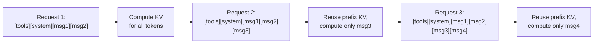
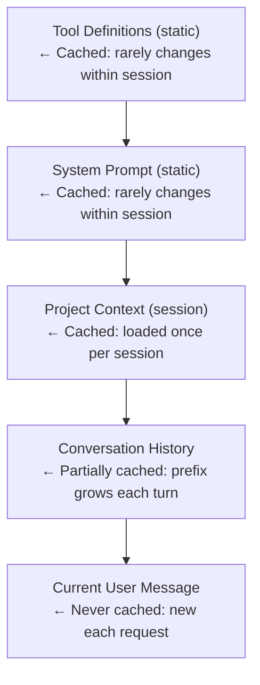

# Prompt Caching for Coding Agents

Prompt caching is the single highest-leverage optimization available to coding agent
developers today. A typical coding agent session involves 10–100+ API calls, and
every one sends the same system prompt, the same tool definitions, and an ever-growing
conversation history. Without caching, every call pays full input-token price for this
repeated prefix — often 5,000–15,000 tokens of static content. Prompt caching
eliminates this redundancy by storing KV-cache state for repeated prefixes, yielding
60–90% reductions in input token costs and measurable latency improvements.

This document surveys prompt caching across three major API providers (Anthropic,
OpenAI, Google), examines open-source inference prefix caching, and analyzes how
the 17 agents studied structure prompts to maximize cache hit rates.

---

## 1. Why Prompt Caching Matters for Coding Agents

Coding agents are uniquely expensive API consumers because of three structural
properties:

**High call volume per task.** Solving a coding task — reading files, planning
changes, editing, testing, fixing — typically requires 10–100+ sequential API calls.
**Claude Code**, **Codex**, and **OpenHands** routinely generate trajectories of
30–50 tool-use turns. **Aider** reports sessions with hundreds of calls for large
refactoring operations.

**Large static prefixes.** The system prompt for a coding agent is a multi-thousand-
token document. Across the 17 agents studied:

| Component | Typical Size | Changes Between Calls |
|---|---|---|
| Tool definitions (JSON schemas) | 2,000–8,000 tokens | Never (within session) |
| System prompt | 2,000–10,000 tokens | Never (within session) |
| Project context (CLAUDE.md, etc.) | 500–3,000 tokens | Rarely |
| Conversation history (older turns) | Grows each turn | Only appended to |
| Current user message + tool results | 100–5,000 tokens | Every call |

**Compounding cost growth.** Conversation history grows monotonically. By turn 30,
input might be 50,000 tokens — of which 40,000 were already sent in the previous
call.

### The KV-Cache Mechanism

For each input token, the model computes key (K) and value (V) vectors at every
attention layer. Prompt caching extends this across requests: if two requests share
the same prefix, the KV-cache from the first is reused. The model skips the forward
pass for cached tokens and begins computation only where the request diverges.



---

## 2. Anthropic's Prompt Caching API

Anthropic offers the most configurable prompt caching system. It supports two modes:
automatic caching and explicit cache breakpoints.

### 2.1 Automatic Caching

Add the `anthropic-beta` header and the system applies a breakpoint to the last
eligible block, advancing it as conversations grow. No per-block annotations needed.

### 2.2 Explicit Cache Breakpoints

For fine-grained control, place `cache_control: {type: "ephemeral"}` on specific
content blocks. Most coding agents use this approach:

```python
# Anthropic SDK — explicit cache breakpoints
import anthropic

client = anthropic.Anthropic()

response = client.messages.create(
    model="claude-sonnet-4-20250514",
    max_tokens=4096,
    system=[{
        "type": "text",
        "text": "You are a coding agent that helps users with software...",
        "cache_control": {"type": "ephemeral"}  # breakpoint 1
    }],
    tools=[{
        "name": "edit_file",
        "description": "Edit a file by replacing text...",
        "input_schema": {
            "type": "object",
            "properties": {
                "path": {"type": "string"},
                "old_str": {"type": "string"},
                "new_str": {"type": "string"}
            },
            "required": ["path", "old_str", "new_str"]
        },
        "cache_control": {"type": "ephemeral"}  # breakpoint 2
    }],
    messages=[
        {"role": "user", "content": "Read the file src/main.py"},
        {"role": "assistant", "content": [
            {"type": "tool_use", "id": "call_1", "name": "read_file",
             "input": {"path": "src/main.py"}}
        ]},
        {"role": "user", "content": [
            {"type": "tool_result", "tool_use_id": "call_1",
             "content": "def main():\n    print('hello')\n",
             "cache_control": {"type": "ephemeral"}}  # breakpoint 3
        ]},
        {"role": "user", "content": "Now add error handling to main()"}
    ]
)
```

### 2.3 Constraints and Mechanics

**Up to 4 breakpoints per request.** The API rejects requests with more.

**Prefix ordering.** Anthropic processes blocks as: tools → system → messages. The
cache prefix must be contiguous from the start.

**Cache hit mechanics.** At each breakpoint, the system hashes all content from the
request start to that point. Any change before a breakpoint invalidates it and all
subsequent breakpoints.

**Lookback window:** 20 blocks maximum.

**Minimum cacheable lengths:**

| Model | Minimum Tokens |
|---|---|
| Claude Sonnet 4 | 1,024 |
| Claude Sonnet 4.6 | 2,048 |
| Claude Opus 4.5 | 4,096 |
| Claude Haiku 4.5 | 4,096 |

**TTL:** 5-minute default, refreshed on each hit. Extended 1-hour TTL available at
2x base input price.

### 2.4 Pricing

| Operation | Cost Relative to Base Input |
|---|---|
| Cache write (first time) | 1.25x |
| Cache read (subsequent hits) | 0.1x (90% discount) |
| No caching (standard) | 1.0x |

A cache entry pays for itself after just 2 subsequent reads.

---

## 3. OpenAI's Automatic Prompt Caching

OpenAI takes a different approach: caching is automatic and transparent, requiring
no code changes. Since October 2024, all API calls benefit from prefix caching.

**Minimum prefix:** 1,024 tokens. **TTL:** 5–10 minutes (up to 1 hour for longer
prompts). **Scope:** per-organization. **Discount:** 50% on cached input tokens.

There is no visible cache write premium — OpenAI absorbs the cost.

### 3.1 Monitoring Cache Performance

```python
import openai

client = openai.OpenAI()
response = client.chat.completions.create(
    model="gpt-4.1",
    messages=[
        {"role": "system", "content": large_system_prompt},
        {"role": "user", "content": "Fix the bug in auth.py"}
    ]
)

# Cache metrics in usage response
usage = response.usage
cached = usage.prompt_tokens_details.cached_tokens if usage.prompt_tokens_details else 0
print(f"Cache hit rate: {cached / usage.prompt_tokens * 100:.1f}%")
```

The response includes `cached_tokens` in `prompt_tokens_details`:

```json
{
  "usage": {
    "prompt_tokens": 8500,
    "completion_tokens": 320,
    "prompt_tokens_details": { "cached_tokens": 7200 }
  }
}
```

### 3.2 Limitations

- **Text only** for caching (tool schemas cached as text, but images/tool outputs
  are not independently cacheable)
- **No explicit control** — cannot force caching or set custom TTLs
- **Prefix-only** — no mechanism for caching arbitrary mid-request blocks

For agents using OpenAI (**Codex** and GPT-4.1-based agents), the automatic nature
means caching works as long as the prompt prefix is stable.

---

## 4. Google Gemini Context Caching

Google takes a third approach: explicit named cache objects created separately from
inference requests.

```python
# Google Gemini — explicit context caching
import google.generativeai as genai

# Create a cached content object
cache = genai.caching.CachedContent.create(
    model="gemini-2.5-pro",
    display_name="coding-agent-context",
    system_instruction="You are a coding agent...",
    contents=[
        {"role": "user", "parts": [{"text": full_codebase_content}]},
        {"role": "model", "parts": [{"text": "I've analyzed the codebase."}]}
    ],
    ttl=datetime.timedelta(hours=2)
)

# Reference in subsequent requests
model = genai.GenerativeModel.from_cached_content(cached_content=cache)
response = model.generate_content("Fix the authentication bug in login.py")
```

| Property | Value |
|---|---|
| Minimum cacheable size | 32,768 tokens |
| Default TTL | 1 hour (configurable) |
| Cached token discount | 75% (0.25x base price) |
| Storage cost | Per-token, per-hour charge |

The 32K minimum makes Gemini caching best suited for large-context scenarios. This
is most relevant for **Gemini CLI**, which can load entire codebases into context.
The explicit cache management adds implementation complexity compared to Anthropic's
per-request breakpoints or OpenAI's automatic system.

---

## 5. How Coding Agents Structure Prompts for Optimal Caching

🟢 **Observed in 10+ agents** — The foundational principle: place stable content
first, dynamic content last.

### 5.1 The Canonical Ordering Pattern



🟡 **Observed in 4–9 agents** — Explicit cache breakpoint placement at layer
boundaries (after tools, after system, after conversation prefix).

### 5.2 Agent-Specific Strategies

**Claude Code** is the most cache-aware agent. It places explicit `cache_control`
breakpoints at three positions: after tool definitions, after system prompt (including
CLAUDE.md), and at the trailing edge of conversation history — leaving one breakpoint
as headroom. See [../../agents/claude-code/](../../agents/claude-code/) for details.

**Aider** focuses on prefix stability: the repository map is computed once and reused,
read-only context files are placed before editable files, and chat history is appended
at the end. See [../../agents/aider/](../../agents/aider/) for details.

**ForgeCode** places JSON tool schemas before all other content, explicitly motivated
by caching — tool definitions are the most static element (2,000–8,000 tokens).
See [tool-descriptions.md](tool-descriptions.md) for schema ordering research.

### 5.3 Common Mistake: Dynamic Content in the Prefix

🔴 **Observed in 1–3 agents** — Placing dynamic content early destroys cache:

- **Timestamps** in system prompt invalidate cache every second/minute
- **User-specific state** injected before conversation history
- **Randomized few-shot examples** that change between calls

Fix: move dynamic content after the last cache breakpoint, or coarsen update
granularity (e.g., timestamp per session, not per request).

### 5.4 Agent Caching Awareness Summary

| Agent | Provider | Explicit Caching | Prefix Optimized | Notes |
|---|---|---|---|---|
| **Claude Code** | Anthropic | Yes (breakpoints) | Yes | Three-breakpoint strategy |
| **Codex** | OpenAI | Automatic | Yes | Stable prefix by design |
| **ForgeCode** | Anthropic | Yes | Yes | Tool-first ordering |
| **Aider** | Multi | Varies | Yes | Stable repo map prefix |
| **Gemini CLI** | Google | Explicit API | Yes | Large-context caching |
| **OpenHands** | Multi | Varies | Partial | Configurable per provider |
| **Goose** | Multi | Varies | Partial | Plugin system may reorder |
| **Warp** | Multi | Varies | Yes | Controlled prompt assembly |
| **Droid** | Anthropic | Yes | Yes | Static tool prefix |
| **Ante** | Anthropic | Yes | Yes | Optimized Rust assembly |
| **OpenCode** | Multi | Varies | Partial | Provider-aware construction |
| **Junie CLI** | Multi | Varies | Partial | JetBrains-managed context |
| **Sage-Agent** | Multi | Varies | Yes | Clean prefix separation |
| **Mini-SWE-Agent** | Multi | Limited | Partial | Minimal prompt structure |
| **Pi-Coding-Agent** | Multi | Limited | Partial | Lightweight agent |
| **TongAgents** | Multi | Limited | Partial | Multi-agent routing |
| **Capy** | Multi | Varies | Partial | Multi-agent architecture |

---

## 6. Prefix Caching in Open-Source Inference (vLLM, SGLang, TGI)

Agents using self-hosted models benefit from prefix caching at the serving layer.
This is relevant for **OpenHands**, **Aider**, **OpenCode**, and other agents
supporting local backends.

### 6.1 vLLM Automatic Prefix Caching

vLLM shares KV-cache blocks across requests with identical prefixes:

```bash
# Start vLLM with prefix caching enabled
python -m vllm.entrypoints.openai.api_server \
    --model meta-llama/Llama-3.1-70B-Instruct \
    --enable-prefix-caching \
    --max-model-len 32768 \
    --tensor-parallel-size 4
```

With APC enabled, vLLM hashes prefix blocks and stores KV pages in GPU memory.
Matching prefixes reuse cached pages directly — no forward pass, no TTFT penalty.
Eviction follows LRU when GPU memory is constrained.

### 6.2 SGLang's RadixAttention

SGLang uses a radix tree (trie) to manage KV-cache across requests:

```
                    [system_prompt]
                    /              \
           [conv_A_turn1]     [conv_B_turn1]
              /       \              |
    [conv_A_turn2] [conv_A_turn2']  [conv_B_turn2]
```

The tree structure finds the longest matching prefix for any new request, even
across branching conversations. This is valuable for multi-agent systems like
**TongAgents** and **Capy** where threads share base context but diverge.

```bash
# SGLang — prefix caching enabled by default
python -m sglang.launch_server \
    --model-path meta-llama/Llama-3.1-70B-Instruct \
    --tp 4 --mem-fraction-static 0.85
```

### 6.3 TGI and Comparison

Hugging Face TGI supports prefix caching through its chunked prefill mechanism
(`--prefix-caching` flag).

| Property | API Caching (Anthropic/OpenAI) | Self-Hosted (vLLM/SGLang) |
|---|---|---|
| Cost savings | Dollar savings on token pricing | GPU compute savings |
| Latency savings | Reduced TTFT | Reduced TTFT |
| Cache scope | Per-organization | Per-server instance |
| Configuration | Headers/markers or automatic | Server startup flags |
| Eviction | TTL-based (5 min – 1 hour) | LRU on GPU memory |

---

## 7. Cost Analysis and Break-Even Calculations

### 7.1 Break-Even Formula (Anthropic)

```
Cache write:   1.25 × base × tokens
Cache read:    0.10 × base × tokens
No-cache:      1.00 × base × tokens (each request)

Break-even: 1.25 + N×0.10 < (N+1)×1.00 → N > 0.28
→ Caching pays for itself after 1 cache read (2 total requests).
```

### 7.2 Realistic Session Cost Comparison

Parameters: 50 API calls, 5K-token system prompt, 2K-token tools, 1K new tokens
per turn, Claude Sonnet 4 ($3.00/M input tokens).

**Without caching:**

```
Total input = Σ(7,000 + n×1,000) for n=1..50 = 1,625,000 tokens
Cost = $4.88
```

**With Anthropic caching:**

```
Turn 1: all cache write. Turns 2–50: prefix cached at 0.1x, new at 1.25x.
Total effective ≈ 228,000 tokens
Cost ≈ $0.68
```

| Metric | Without Caching | With Caching | Savings |
|---|---|---|---|
| Effective input tokens | 1,625,000 | ~228,000 | **86% reduction** |
| Input cost (Sonnet 4) | $4.88 | $0.68 | **$4.20 saved** |
| Cost per API call (avg) | $0.098 | $0.014 | **86% reduction** |

### 7.3 Provider Comparison

| Provider | Write Premium | Read Discount | Break-Even | Net Savings (50 calls) |
|---|---|---|---|---|
| Anthropic | 1.25x | 90% | 2 requests | ~86% |
| OpenAI | None visible | 50% | 1 request | ~45% |
| Google Gemini | Storage cost | 75% | Depends on TTL | ~70% (if ≥32K prefix) |

---

## 8. Cache Hit Rate Optimization Strategies

### 8.1 Monitoring

Anthropic returns `cache_creation_input_tokens` and `cache_read_input_tokens`:

```json
{
  "usage": {
    "input_tokens": 1200,
    "cache_creation_input_tokens": 5000,
    "cache_read_input_tokens": 7000
  }
}
```

**Ideal progression:**

```
Turn 1: cache_creation=12000, cache_read=0        (all miss — expected)
Turn 2: cache_creation=1000,  cache_read=12000     (prefix hit)
Turn 3: cache_creation=1000,  cache_read=13000     (growing prefix hit)
```

If `cache_creation` stays large after turn 1, something is invalidating the prefix.

### 8.2 Optimization Strategies

🟢 **Observed in 10+ agents** — **Stable prefix ordering.** Never reorder tools or
system blocks between requests. Even swapping two tool definitions invalidates the
entire tool prefix cache.

**Avoid dynamic content in cached regions.** Move timestamps, random seeds, and
per-request metadata after the last cache breakpoint.

**Batch tool definitions together.** One contiguous block with one breakpoint at the
end — the pattern used by **ForgeCode**, **Claude Code**, and **Droid**.

**Consistent message formatting.** Serialize tool results, user messages, and
assistant messages identically between calls. Whitespace or JSON key ordering
differences invalidate prefix matches.

### 8.3 The 20-Block Lookback Limit

For conversations with 60+ message blocks, Anthropic only checks 20 blocks backward
from each breakpoint. Mitigations:

1. **Multi-breakpoint placement** — spread breakpoints across the conversation to
   ensure coverage of the full prefix.
2. **Message consolidation** — combine adjacent same-role messages to reduce block
   count.
3. **Automatic caching mode** — lets Anthropic manage breakpoint advancement.

---

## 9. Implementation Patterns

### 9.1 Python: Caching-Aware Message Builder

```python
# caching_message_builder.py
class CachingMessageBuilder:
    """Constructs Anthropic API requests with strategic cache breakpoints."""

    def __init__(self, system_prompt: str, tools: list[dict]):
        self.system_prompt = system_prompt
        self.tools = tools
        self.conversation: list[dict] = []

    def _build_system(self) -> list[dict]:
        return [{
            "type": "text",
            "text": self.system_prompt,
            "cache_control": {"type": "ephemeral"}
        }]

    def _build_tools(self) -> list[dict]:
        if not self.tools:
            return []
        tools = [dict(t) for t in self.tools]
        tools[-1]["cache_control"] = {"type": "ephemeral"}
        return tools

    def _build_messages(self) -> list[dict]:
        if not self.conversation:
            return []
        messages = [dict(m) for m in self.conversation]
        if len(messages) >= 2:
            target = messages[-2]
            if isinstance(target.get("content"), str):
                target["content"] = [{
                    "type": "text", "text": target["content"],
                    "cache_control": {"type": "ephemeral"}
                }]
            elif isinstance(target.get("content"), list):
                target["content"][-1]["cache_control"] = {"type": "ephemeral"}
        return messages

    def add_user_message(self, content: str):
        self.conversation.append({"role": "user", "content": content})

    def add_assistant_message(self, content: list[dict]):
        self.conversation.append({"role": "assistant", "content": content})

    def add_tool_result(self, tool_use_id: str, result: str):
        self.conversation.append({"role": "user", "content": [
            {"type": "tool_result", "tool_use_id": tool_use_id, "content": result}
        ]})

    def build_request(self) -> dict:
        return {
            "model": "claude-sonnet-4-20250514",
            "max_tokens": 4096,
            "system": self._build_system(),
            "tools": self._build_tools(),
            "messages": self._build_messages()
        }
```

### 9.2 TypeScript: Caching Agent

```typescript
// cachingAgent.ts
import Anthropic from "@anthropic-ai/sdk";

class CachingAgent {
  private client = new Anthropic();
  private messages: { role: string; content: any }[] = [];

  constructor(
    private systemPrompt: string,
    private tools: Anthropic.Tool[]
  ) {}

  async sendMessage(userMessage: string): Promise<string> {
    this.messages.push({ role: "user", content: userMessage });

    const toolsWithCache = structuredClone(this.tools);
    if (toolsWithCache.length > 0) {
      (toolsWithCache[toolsWithCache.length - 1] as any).cache_control =
        { type: "ephemeral" };
    }

    const response = await this.client.messages.create({
      model: "claude-sonnet-4-20250514",
      max_tokens: 4096,
      system: [{
        type: "text" as const,
        text: this.systemPrompt,
        cache_control: { type: "ephemeral" as const },
      }],
      tools: toolsWithCache,
      messages: this.messages as any,
    });

    const usage = response.usage as any;
    console.log(
      `Cache: ${usage.cache_read_input_tokens ?? 0} read, ` +
      `${usage.cache_creation_input_tokens ?? 0} written`
    );

    this.messages.push({ role: "assistant", content: response.content });
    return response.content
      .filter((b: any) => b.type === "text")
      .map((b: any) => b.text)
      .join("");
  }
}
```

### 9.3 Cache Performance Monitor

```python
# cache_monitor.py
class CacheMonitor:
    def __init__(self):
        self.turns: list[dict] = []

    def record(self, usage: dict):
        self.turns.append({
            "turn": len(self.turns) + 1,
            "cache_write": usage.get("cache_creation_input_tokens", 0),
            "cache_read": usage.get("cache_read_input_tokens", 0),
        })

    def hit_rate(self) -> float:
        total_read = sum(t["cache_read"] for t in self.turns)
        total = total_read + sum(t["cache_write"] for t in self.turns)
        return total_read / total if total > 0 else 0.0

    def summary(self) -> str:
        return (
            f"Turns: {len(self.turns)} | "
            f"Hit rate: {self.hit_rate():.1%} | "
            f"Reads: {sum(t['cache_read'] for t in self.turns):,} | "
            f"Writes: {sum(t['cache_write'] for t in self.turns):,}"
        )
```

---

## 10. Cross-References

- **[system-prompts.md](system-prompts.md)** — Prompt structure and the layered
  architecture (framework → project → user) that determines the stable cached prefix.
- **[tool-descriptions.md](tool-descriptions.md)** — Tool schema engineering and how
  definitions are serialized as the first block in cached prefixes.
- **[model-specific-tuning.md](model-specific-tuning.md)** — Per-provider configuration
  including caching strategy adaptation for Anthropic, OpenAI, and Google.

---

## References

- Anthropic prompt caching documentation and API reference
- OpenAI automatic prompt caching announcement (October 2024)
- Google Gemini context caching API documentation
- vLLM automatic prefix caching implementation
- SGLang RadixAttention paper and documentation
- Agent source code: Claude Code, Codex, ForgeCode, Aider, OpenHands, Droid, Ante,
  OpenCode, Gemini CLI, Goose, Sage-Agent, Warp, Junie CLI, Mini-SWE-Agent,
  Pi-Coding-Agent, TongAgents, Capy

*Last updated: July 2025*
