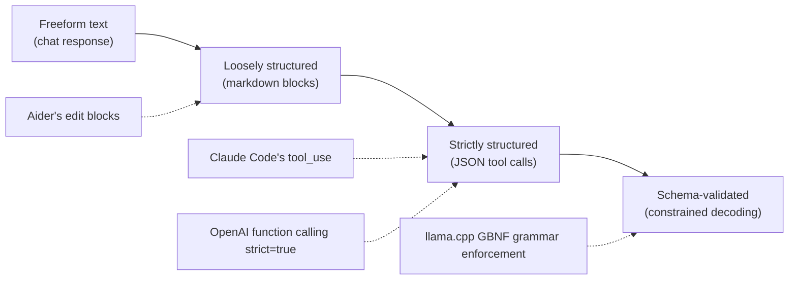
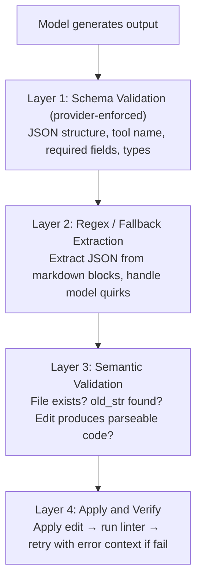

# Structured Output in Coding Agents

Coding agents live or die by the structure of their output. A coding agent that produces
invalid JSON in a tool call, a misformatted diff, or a search/replace block with wrong
indentation can corrupt a user's codebase. Structured output — constraining language model
responses to conform to a specific format or schema — is not an optimization for coding
agents but a foundational requirement. This document examines how the 17 agents in our
study enforce, validate, and recover from failures in structured output.

---

## 1. The Structured Output Problem in Coding Agents

Conversational chatbots produce natural language — a misformatted sentence is merely
inconvenient. Coding agents produce *executable artifacts*: tool calls that must parse as
valid JSON, code edits that must apply cleanly to source files, and shell commands that must
be syntactically correct. A single misplaced character can break a file or crash the agent
loop entirely.

### Why Coding Agents Are Different

The structured output problem is more severe for coding agents than for other LLM applications:

1. **High-fidelity reproduction** — code edits require exact string matching. A search/replace
   block that differs by one whitespace character from the original will fail to apply.
2. **Compound error propagation** — a malformed tool call breaks the agent loop, preventing
   subsequent tool calls that depend on the result.
3. **Safety implications** — a malformed `bash` command or corrupted file edit can cause
   real damage to the user's system or repository.

### The Structured Output Spectrum

Not all structured output is equally constrained:



Most agents in our study operate in the "strictly structured" zone, relying on provider-level
tool calling APIs. A few — notably **Aider** — operate in the "loosely structured" zone.

### Failure Modes When Structure Goes Wrong

| Failure Mode | Description | Impact | Example |
|---|---|---|---|
| Invalid JSON | Tool call arguments don't parse | Agent loop crashes | Missing closing `}` in function args |
| Schema mismatch | JSON is valid but wrong shape | Tool rejects input | `file_path` instead of `path` |
| Diff application failure | Edit doesn't match source | File unchanged or corrupted | Indentation mismatch in search block |
| Partial output | Model stops mid-structure | Truncated tool call | Context window exceeded mid-JSON |
| Wrong tool selected | Valid call to wrong tool | Unintended side effect | `create_file` instead of `edit_file` |
| Encoding errors | Special characters mangled | Source file corrupted | Unicode in string literals |

---

## 2. Provider-Level Structured Output Mechanisms

The major LLM providers offer different levels of support for structured output, forming the
foundation that coding agents build upon.

### 2.1 OpenAI's Structured Outputs

OpenAI provides the strongest structured output guarantees through constrained decoding.
When `strict: true` is set, the model's token generation is constrained so output is
*guaranteed* to match the provided JSON Schema.

```python
# OpenAI structured output — strict function calling
import openai
client = openai.OpenAI()

response = client.chat.completions.create(
    model="gpt-4o",
    messages=[{"role": "user", "content": "Edit src/main.py to add logging"}],
    tools=[{
        "type": "function",
        "function": {
            "name": "edit_file",
            "description": "Apply a search/replace edit to a file",
            "strict": True,
            "parameters": {
                "type": "object",
                "properties": {
                    "path": {"type": "string"},
                    "old_str": {"type": "string"},
                    "new_str": {"type": "string"}
                },
                "required": ["path", "old_str", "new_str"],
                "additionalProperties": False
            }
        }
    }],
    tool_choice="auto"
)
```

**How it works internally**: OpenAI compiles the JSON Schema into a context-free grammar (CFG)
and masks logits during token generation. At each decoding step, only tokens that keep the
output on a valid path through the grammar are allowed — the model *cannot* produce invalid
JSON.

**Limitations**: Only a subset of JSON Schema is supported — no recursive schemas, limited
`oneOf`, and `additionalProperties` must be `false` for strict mode. These constraints are
acceptable for coding agent tool definitions, which are typically flat or shallowly nested.

**Codex** and **Droid** leverage OpenAI's strict function calling. **ForgeCode** uses it
when connected to OpenAI-compatible providers supporting the `strict` flag.

### 2.2 Anthropic's Tool Use for Structured Output

Anthropic does not offer a standalone `json_mode`. Instead, structured output is achieved
through the tool use API — mapping naturally to coding agents that already need tool calling.

```python
# Anthropic tool_use for structured output
import anthropic
client = anthropic.Anthropic()

response = client.messages.create(
    model="claude-sonnet-4-20250514",
    max_tokens=4096,
    tools=[{
        "name": "edit_file",
        "description": "Apply a search/replace edit to a file",
        "input_schema": {
            "type": "object",
            "properties": {
                "path": {"type": "string"},
                "old_str": {"type": "string"},
                "new_str": {"type": "string"}
            },
            "required": ["path", "old_str", "new_str"]
        }
    }],
    tool_choice={"type": "tool", "name": "edit_file"},
    messages=[{"role": "user", "content": "Add error handling to the parse function"}]
)

for block in response.content:
    if block.type == "tool_use":
        print(block.name, block.input)  # "edit_file" {"path": ..., "old_str": ...}
```

Setting `tool_choice` to a specific tool name *forces* the model to call that tool,
guaranteeing structured output. Anthropic also supports `strict: true` on tool definitions,
enabling constrained decoding similar to OpenAI's — the output is guaranteed to conform to
the `input_schema`. **Claude Code** relies heavily on this mechanism: every action is modeled
as a tool with a defined schema, and the model never produces freeform text that needs parsing.

### 2.3 Gemini's JSON Mode

Google's Gemini API supports structured output through `response_mime_type` with a
`response_schema`:

```python
# Gemini structured output with response schema
import google.generativeai as genai
model = genai.GenerativeModel("gemini-2.0-flash")

response = model.generate_content(
    "Extract the file edit from this request: add logging to main.py",
    generation_config=genai.GenerationConfig(
        response_mime_type="application/json",
        response_schema={
            "type": "object",
            "properties": {
                "path": {"type": "string"},
                "operation": {"type": "string", "enum": ["create", "edit", "delete"]},
            },
            "required": ["path", "operation"]
        }
    )
)
```

Gemini also supports function calling with tool definitions, which **Gemini CLI** uses for
its agent loop — providing stronger guarantees than raw JSON mode.

---

## 3. Tool Call Formats Across Providers

Each major provider uses a different wire format for tool calls. Coding agents supporting
multiple providers must abstract over these differences.

### Wire Format Comparison

| Aspect | OpenAI | Anthropic | Gemini |
|---|---|---|---|
| Tool call location | `message.tool_calls[]` | `content[]` blocks with `type: "tool_use"` | `parts[]` with `function_call` |
| Tool call ID | `tool_calls[].id` | `content[].id` | None (matched by position) |
| Arguments format | JSON string in `arguments` | Parsed object in `input` | Parsed object in `args` |
| Multiple calls | Array of `tool_calls` | Multiple `tool_use` blocks | Multiple `function_call` parts |
| Result format | `role: "tool"` message | `tool_result` content block | `function_response` part |

### Tool Call Flow

| | OpenAI Format | Anthropic Format | Gemini Format |
|---|---|---|---|
| **Request** | `tools: [{type: "function", function: {name, ...}}]` | `tools: [{name, description, input_schema}]` | `tools: [{function_declarations: [{name, ...}]}]` |
| **Response** | `message.tool_calls: [{id, function: {name, args}}]` | `content: [{type: "tool_use", id, name, input}]` | `parts: [{function_call: {name, args}}]` |
| **Result** | `{role: "tool", tool_call_id: id, content: "..."}` | `{type: "tool_result", tool_use_id: id, content}` | `parts: [{function_response: {name, response}}]` |

### How Agents Abstract Across Formats

🟡 **Observed in 4–9 agents** — Multi-provider agents implement a provider abstraction
layer that normalizes tool calls into a common internal representation.

**OpenCode** and **ForgeCode** define an internal `ToolCall` type with provider-specific
adapters. **Goose** uses a plugin architecture where each provider conforms to a common
interface. **Aider** sidesteps the problem by not using native tool calling (see Section 4).

---

## 4. How Coding Agents Parse Tool Calls vs Freeform Text

🟢 **Observed in 10+ agents** — Most agents rely on native tool calling APIs rather than
parsing freeform text, offloading format enforcement to the provider.

### Agent-by-Agent Parsing Approaches

| Agent | Parsing Strategy | Provider Dependency | Fallback |
|---|---|---|---|
| **Claude Code** | Native `tool_use` API | Anthropic | None (tool_use required) |
| **Codex** | Native function calling | OpenAI | None |
| **Gemini CLI** | Native function calling | Gemini | None |
| **ForgeCode** | Native tool calling | Multi-provider | Regex extraction |
| **OpenCode** | Native tool calling | Multi-provider | None |
| **Goose** | Native tool calling | Multi-provider | Tool shimming for non-tool models |
| **Aider** | Freeform text + regex parsing | Any model | Multiple edit formats |
| **OpenHands** | Freeform text + action parsing | Multi-provider | Regex extraction |
| **Warp** | Native tool calling | Multi-provider | None |
| **Junie CLI** | Native tool calling | JetBrains AI | None |
| **Droid** | Native function calling | OpenAI | None |
| **Ante** | Native tool calling | Multi-provider | None |
| **Mini-SWE-Agent** | Freeform text + command parsing | Multi-provider | Structured retry |
| **Sage-Agent** | Native tool calling | Multi-provider | None |
| **TongAgents** | Native tool calling | Multi-provider | None |
| **Capy** | Native tool calling | Multi-provider | None |
| **Pi-Coding-Agent** | Native tool calling | Multi-provider | None |

### Aider's Freeform Parsing Approach

**Aider** is the most notable exception. Rather than using function calling APIs, Aider
instructs the model to produce edits inside fenced markdown code blocks, then parses them
with regular expressions:

```python
# aider/coders/editblock_coder.py (simplified)
def find_original_update_blocks(content, fence=("`" * 3,)):
    """Parse the model's freeform response to extract edit blocks."""
    lines = content.splitlines(keepends=True)
    i = 0
    while i < len(lines):
        # Look for filename header
        if lines[i].strip().endswith(fence[0]):
            filename = lines[i].strip().removesuffix(fence[0]).strip()
            # Find <<<<<<< SEARCH / ======= / >>>>>>> REPLACE markers
            original, updated = extract_search_replace(lines, i)
            yield filename, original, updated
        i += 1
```

This approach works with *any* model, including local models and API providers that don't
support function calling, and allows interleaved explanatory text. The disadvantage is
fragility — the parsing relies on the model consistently producing the expected markers.

### Trade-offs: Native API vs Freeform Parsing

| Native Tool Calling | Freeform Text Parsing |
|---|---|
| ✓ Provider-guaranteed format | ✓ Works with any model |
| ✓ No custom parser needed | ✓ Allows interleaved text |
| ✓ Schema validation free | ✓ No provider lock-in |
| ✗ Requires provider support | ✗ Fragile regex parsing |
| ✗ Model can't explain inline | ✗ Edge cases in escaping |
| ✗ Rigid output structure | ✗ Must handle partial output |

---

## 5. Diff Format Design as Structured Output

The central structured output challenge for coding agents is *how to represent code edits* —
the model must produce output that, when applied to the existing file, produces exactly the
intended change.

### The Four Major Diff Formats

#### 5.1 Whole-File Replacement

The simplest approach: the model outputs the entire file content after editing.

```
path/to/file.py
<<<
import os
import sys

def main():
    print("Hello, world!")
    logging.info("Application started")
>>>
```

**Used by**: **Aider** (as `whole` edit format), **Pi-Coding-Agent** for small files.

**Pros**: Simple, unambiguous, no matching required.
**Cons**: Token-expensive for large files; model may introduce unintended changes.

#### 5.2 Unified Diff (udiff)

Standard patch format with `@@` hunks, `+` for additions, `-` for deletions:
```diff
--- a/src/main.py
+++ b/src/main.py
@@ -1,4 +1,5 @@
 import os
 import sys
+import logging
 def main():
     print("Hello, world!")
+    logging.info("Application started")
```

**Used by**: **Aider** (as `udiff` edit format), **OpenHands** for some operations.

**Pros**: Compact, standard format, works with `patch` command.
**Cons**: Models frequently hallucinate incorrect line numbers and context lines.

#### 5.3 Search/Replace Blocks

The model provides an exact string to search for and its replacement:
```
src/main.py
<<<<<<< SEARCH
import os
import sys

def main():
=======
import os
import sys
import logging

def main():
>>>>>>> REPLACE
```

**Used by**: **Aider** (as default `diff` edit format), **Claude Code** (via `old_str`/`new_str`
tool parameters), **ForgeCode**, **Codex**, **OpenCode**, **Goose**, and most other agents.

**Pros**: No line numbers to hallucinate; exact string matching is unambiguous.
**Cons**: Search string must be unique in file; fails on whitespace mismatches.

#### 5.4 Line-Numbered Edits

Reference specific line numbers for insertions, deletions, or replacements:
```json
{"path": "src/main.py", "edits": [
    {"type": "insert", "line": 3, "content": "import logging"},
    {"type": "insert", "line": 8, "content": "    logging.info(\"Application started\")"}
]}
```

**Used by**: **Mini-SWE-Agent** (via line-numbered commands), some experimental agents.

**Pros**: Precise, compact, easy to apply programmatically.
**Cons**: Line numbers shift as edits accumulate; models frequently hallucinate them.

### Why Search/Replace Won

🟢 **Observed in 10+ agents** — The search/replace pattern (in various syntactic forms) is
the dominant edit format across the agents studied.

The reason is empirical. **Aider** extensively benchmarked edit formats and found search/replace
blocks produce significantly fewer edit failures than unified diffs:

**Edit Format Performance (Aider benchmarks, approximate)**

| Format | Edit Applies | Benchmark Score |
|---|---|---|
| search/replace | ~98% | Highest |
| whole-file | ~100% | High (but costly) |
| unified diff | ~85% | Lower |
| line-numbered | ~80% | Lowest |

The key insight: language models are better at *reproducing text they've seen* (search/replace)
than at *counting lines* (udiff, line-numbered). Search/replace leverages the model's
strength in pattern matching while avoiding its weakness in precise numerical reasoning.

### Token Efficiency Comparison

```
File: 200 lines, editing 3 lines in the middle

Whole-file:      ~200 lines of output (entire file)
Unified diff:    ~15 lines of output (context + changes)
Search/replace:  ~10 lines of output (old block + new block)
Line-numbered:   ~5 lines of output (line refs + new content)

Token cost:  whole-file >> udiff > search/replace > line-numbered
Reliability: whole-file ≈ search/replace >> udiff > line-numbered
```

---

## 6. Grammar-Constrained Decoding for Local Models

When coding agents use local models (via llama.cpp, vLLM, or HuggingFace Transformers), they
cannot rely on provider-level structured output guarantees. Grammar-constrained decoding fills
this gap by constraining token generation at the logit level.

### 6.1 GBNF Grammars (llama.cpp)

llama.cpp supports GBNF (GGML BNF) grammars that define valid outputs. During decoding,
tokens violating the grammar are masked to negative infinity, making them impossible to sample.

```
# GBNF grammar for a JSON tool call object
root   ::= "{" ws "\"name\"" ws ":" ws string "," ws "\"arguments\"" ws ":" ws object ws "}"
object ::= "{" ws (pair ("," ws pair)*)? ws "}"
pair   ::= string ws ":" ws value
value  ::= string | number | object | array | "true" | "false" | "null"
string ::= "\"" ([^"\\] | "\\" .)* "\""
number ::= "-"? [0-9]+ ("." [0-9]+)?
array  ::= "[" ws (value ("," ws value)*)? ws "]"
ws     ::= [ \t\n]*
```

This grammar ensures every token contributes to valid JSON — the constraint is structural,
not probabilistic.

### 6.2 Outlines Library

**Outlines** is a Python library providing structured generation for HuggingFace Transformers
and vLLM. It compiles schemas into finite-state machines (FSMs) that guide token generation.

```python
# Outlines structured generation with Pydantic model
from pydantic import BaseModel, Field
from outlines import models, generate

class FileEdit(BaseModel):
    path: str = Field(description="File path to edit")
    old_str: str = Field(description="Exact string to find in file")
    new_str: str = Field(description="String to replace old_str with")

model = models.transformers("microsoft/Phi-3-mini-4k-instruct")
generator = generate.json(model, FileEdit)
edit = generator("Edit src/main.py to add logging to the main function")
# edit is a FileEdit instance — guaranteed valid by FSA-constrained decoding
```

Outlines works by converting the schema to a deterministic FSA, pre-computing valid token
transitions per state, and masking invalid tokens before sampling at each decoding step.

### 6.3 vLLM Integration

vLLM supports guided decoding natively via `--guided-decoding-backend`, using either Outlines
or lm-format-enforcer as backends:

```python
# vLLM guided decoding with JSON schema
from vllm import LLM, SamplingParams
llm = LLM(model="meta-llama/Llama-3-8B-Instruct")
sampling_params = SamplingParams(
    temperature=0.0,
    guided_decoding={"json_schema": {
        "type": "object",
        "properties": {"name": {"type": "string"}, "arguments": {"type": "object"}},
        "required": ["name", "arguments"]
    }}
)
output = llm.generate(["Call the edit_file tool to fix the bug"], sampling_params)
```

### Relevance to Coding Agents

🔴 **Observed in 1–3 agents** — Grammar-constrained decoding is primarily relevant for agents
supporting local model backends. **Aider** supports local models via litellm and benefits
from grammar constraints when available. **OpenHands** can use local endpoints with vLLM.
Most agents in our study connect to cloud APIs and rely on provider-level structured output.

---

## 7. Higher-Level Structured Output Libraries

Several libraries provide abstractions over raw provider APIs for structured output.

### 7.1 Instructor

**Instructor** wraps LLM API clients (OpenAI, Anthropic, Gemini) with automatic Pydantic
model extraction, validation, and retry logic.

```python
# Instructor — structured extraction with automatic retries
import instructor
from openai import OpenAI
from pydantic import BaseModel, Field

client = instructor.from_openai(OpenAI())

class ToolCall(BaseModel):
    name: str = Field(description="Tool to invoke")
    path: str = Field(description="File path argument")
    content: str = Field(description="Content argument")

tool_call = client.chat.completions.create(
    model="gpt-4o",
    response_model=ToolCall,
    messages=[{"role": "user", "content": "Create a new file at src/utils.py"}],
    max_retries=3
)
```

Instructor handles the translation between Pydantic models and the appropriate provider
mechanism (function calling for OpenAI, tool_use for Anthropic) and supports streaming
partial objects.

### 7.2 Zod Integration (TypeScript Ecosystem)

In the TypeScript ecosystem, **Zod** schemas serve the same role as Pydantic models.
`zod-to-json-schema` converts Zod types to JSON Schema for use with provider APIs.

```typescript
// Zod schema for tool definitions (TypeScript agents)
import { z } from "zod";
import { zodToJsonSchema } from "zod-to-json-schema";

const EditFileSchema = z.object({
  path: z.string().describe("File path to edit"),
  old_str: z.string().describe("Exact string to find"),
  new_str: z.string().describe("Replacement string"),
});

const jsonSchema = zodToJsonSchema(EditFileSchema);
// Use jsonSchema in tool definition for any provider
```

**ForgeCode** and **OpenCode** define tool schemas using Zod-like type systems. **Goose**
uses similar typed schemas for its extensible tool definitions. The Vercel AI SDK integrates
Zod schemas directly into its tool calling interface.

### 7.3 Pydantic for Python Agents

Python-based agents use Pydantic's `BaseModel` as the canonical way to define tool schemas:

```python
# Pydantic tool schema pattern (common across Python agents)
from pydantic import BaseModel, Field, field_validator

class SearchReplaceEdit(BaseModel):
    path: str = Field(description="Relative path to the file")
    old_str: str = Field(description="Exact string to search for")
    new_str: str = Field(description="String to replace with")

    @field_validator("path")
    @classmethod
    def path_must_be_relative(cls, v: str) -> str:
        if v.startswith("/"):
            raise ValueError("Path must be relative, not absolute")
        return v
```

The `model_json_schema()` method produces a JSON Schema passable directly to any provider's
tool definition. Field validators add semantic constraints beyond what JSON Schema can
express — path format validation, content length limits, allowed file extensions.

---

## 8. Validation and Retry Strategies

🟢 **Observed in 10+ agents** — Defense in depth is the universal strategy. No agent relies on
a single validation layer; all implement multiple fallback mechanisms.

### The Validation Pipeline



### Agent-Specific Retry Patterns

**Aider's lint-and-retry loop**: After applying edits, Aider runs the project's linter. If new
lint errors appear, it feeds them back to the model for correction, up to a configurable limit.

```python
# aider/coders/base_coder.py (simplified retry pattern)
def run_edit_cycle(self):
    for attempt in range(self.max_retries):
        response = self.send_to_model()
        edits = self.parse_edits(response)
        applied = self.apply_edits(edits)
        if not applied:
            self.add_error_message("Edit failed to apply. "
                                   "SEARCH block must exactly match file content.")
            continue
        lint_errors = self.run_linter()
        if not lint_errors:
            return True
        self.add_error_message(f"Lint errors after edit:\n{lint_errors}")
    return False
```

**Claude Code's tool_use error handling**: When a tool call fails, Claude Code returns a
`tool_result` with `is_error: true` and a descriptive error message. The model sees this
error in context and produces a corrected tool call.

**ForgeCode's parse-or-retry pattern**: ForgeCode attempts native tool call parsing first,
falls back to regex extraction of JSON from response text, and retries on total failure.

### Retry with Error Injection Example

```python
# Generic retry pattern with error feedback
def execute_with_retry(agent, task, max_retries=3):
    messages = [{"role": "user", "content": task}]
    for attempt in range(max_retries):
        response = agent.call_model(messages)
        tool_call = agent.parse_tool_call(response)
        if tool_call is None:
            messages.append({"role": "assistant", "content": response.text})
            messages.append({"role": "user",
                "content": "You must respond with a tool call, not plain text."})
            continue
        result = agent.execute_tool(tool_call)
        if result.success:
            return result
        # Feed error back to model for self-correction
        messages.append({"role": "assistant", "content": response.raw})
        messages.append({"role": "tool",
            "content": f"Error: {result.error}\nPlease fix and retry."})
    raise MaxRetriesExceeded(f"Failed after {max_retries} attempts")
```

---

## 9. XML Tags as Lightweight Structure

🟡 **Observed in 4–9 agents** — Agents in the Anthropic ecosystem frequently use XML tags
as a lightweight structuring mechanism that sits between freeform text and full JSON.

### Why XML Works Well with Claude Models

Claude models are particularly responsive to XML tags because Anthropic's training process
emphasizes XML-structured prompts. Several agents exploit this:

```xml
<!-- Common XML tag patterns in Anthropic-ecosystem agents -->
<thinking>
I need to analyze the error in src/parser.py. The traceback shows
a KeyError on line 42.
</thinking>

<result>
The bug is caused by a missing key check before dictionary access.
</result>

<code language="python" path="src/parser.py">
value = data.get("key", default_value)
</code>
```

XML tags provide several advantages over JSON:

1. **Readability** — easier for humans to read in logs and debugging output
2. **Nesting tolerance** — handles nested content (including code with braces) without escaping
3. **Partial parsing** — streaming XML can be parsed incrementally as tags close
4. **Mixed content** — allows free text alongside structured elements

### When XML Tags Are Better Than JSON

XML tags excel when structured output contains *large blocks of text* (like code) or when
mixing reasoning with structured data. JSON excels for *primarily structured data* with small
string values (like tool arguments). For a deeper discussion of model-specific format
preferences, see [model-specific-tuning.md](model-specific-tuning.md).

---

## 10. Cross-References

This document covers the mechanics of structured output — how agents produce, validate, and
recover from structured responses. Related topics in companion documents:

- **[tool-descriptions.md](tool-descriptions.md)** — How tool schemas affect output quality.
- **[few-shot-examples.md](few-shot-examples.md)** — Examples that teach format compliance,
  especially for freeform-parsing agents like Aider.
- **[model-specific-tuning.md](model-specific-tuning.md)** — Per-model structured output
  differences (XML vs JSON preferences, format adaptation).
- **[tools-and-projects.md](tools-and-projects.md)** — Outlines, Instructor, Zod, vLLM,
  and other structured generation tools.
- **[system-prompts.md](system-prompts.md)** — How system prompts set format expectations
  to complement provider-level enforcement.

For agent-specific implementation details, see the individual profiles in `../../agents/`.

*Last updated: July 2025*
