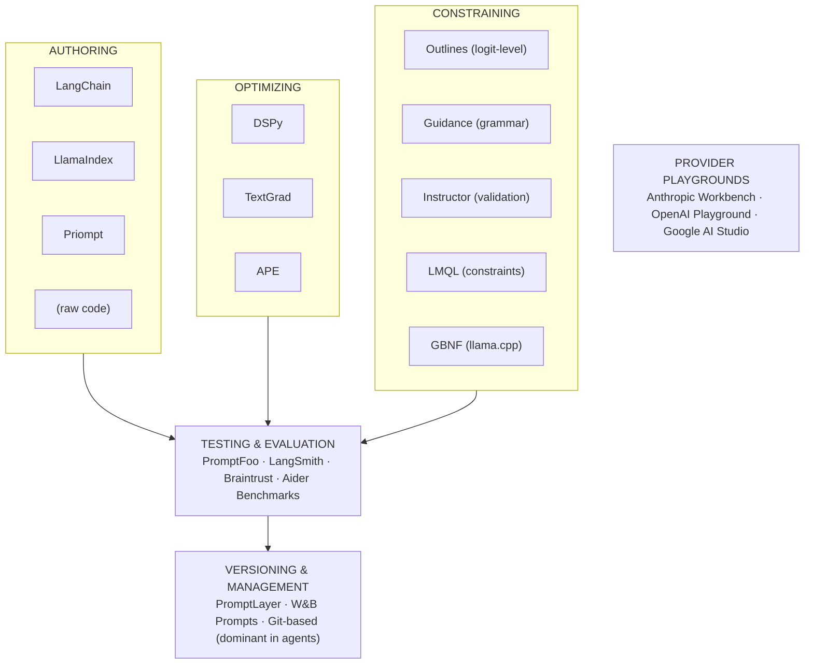
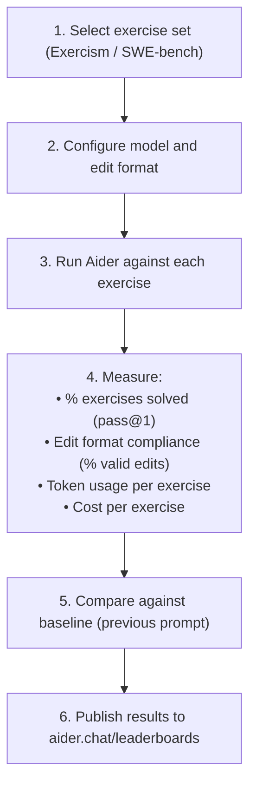

# Tools and Open-Source Projects for Prompt Engineering

Prompt engineering for coding agents has evolved from ad-hoc string concatenation into a
discipline with dedicated tooling at every stage: authoring, testing, versioning, optimizing,
and constraining. Yet the 17 agents studied in this research — **Claude Code**, **Codex**,
**ForgeCode**, **Droid**, **Ante**, **OpenCode**, **OpenHands**, **Warp**, **Gemini CLI**,
**Goose**, **Junie CLI**, **Mini-SWE-Agent**, **Pi-Coding-Agent**, **Aider**, **Sage-Agent**,
**TongAgents**, and **Capy** — overwhelmingly manage prompts as plain source code rather than
through external prompt management platforms. This document catalogs the open-source tools and
projects that exist for prompt engineering, evaluates their relevance to coding agent development,
and identifies where the 17 agents sit on the tooling adoption curve.

The tools surveyed span five categories: prompt template libraries, programmatic
optimization frameworks, structured generation libraries, evaluation frameworks, and
versioning platforms. Each addresses a real failure mode — malformed output, regression
after prompt edits, context window overflow — but adoption in production coding agents
remains low, concentrated in a handful of tools that solve immediate, measurable problems.

---

## 1. The Prompt Engineering Tooling Landscape

The tooling landscape can be organized by the stage of the prompt lifecycle it
addresses:



🟢 **Observed in 10+ agents** — The dominant "tool" for prompt engineering in production
coding agents is plain source code managed through Git. Prompts live in Python modules,
TypeScript files, Go templates, or Rust string constants. Changes are made through pull
requests and validated by CI benchmarks or manual testing. No agent in the study uses a
dedicated prompt management platform in production.

---

## 2. Prompt Template Libraries

### 2.1 LangChain Prompt Templates

LangChain provides the most widely-known prompt template abstraction. Its
`ChatPromptTemplate` composes system, human, and AI messages with variable interpolation,
partial formatting, and few-shot example injection.

```python
# LangChain prompt template for a hypothetical coding agent
from langchain_core.prompts import (
    ChatPromptTemplate,
    SystemMessagePromptTemplate,
    HumanMessagePromptTemplate,
)

system_template = SystemMessagePromptTemplate.from_template(
    "You are a coding agent. You have access to these tools: {tools}\n"
    "Current working directory: {cwd}\n"
    "Operating system: {os}"
)
human_template = HumanMessagePromptTemplate.from_template("{user_request}")
prompt = ChatPromptTemplate.from_messages([system_template, human_template])

messages = prompt.format_messages(
    tools="bash, file_edit, file_read",
    cwd="/home/user/project",
    os="Linux",
    user_request="Fix the failing test in test_auth.py"
)
```

LangChain also supports `FewShotChatMessagePromptTemplate` with example selectors
that dynamically choose which examples to include based on semantic similarity or
length — conceptually related to how **Aider** selects repository map context.

**Critique for coding agents:** LangChain's abstraction adds indirection without clear
benefit for agents that need precise control over every token. The 17 agents studied
universally prefer direct string construction — f-strings in Python (**Aider**,
**OpenHands**, **Pi-Coding-Agent**), template literals in TypeScript (**Claude Code**,
**Gemini CLI**), or `format!` macros in Rust (**Ante**, **Goose**, **OpenCode**).

### 2.2 LlamaIndex Prompt Infrastructure

LlamaIndex provides `PromptTemplate` and `ChatMessage` classes oriented toward
retrieval-augmented generation, integrating tightly with index queries, embedding
retrieval, and response synthesis.

```python
# LlamaIndex prompt template
from llama_index.core import PromptTemplate
from llama_index.core.llms import ChatMessage, MessageRole

template = PromptTemplate(
    "Given the following code context:\n{context}\n\n"
    "Answer the user's question: {query}"
)
messages = [
    ChatMessage(role=MessageRole.SYSTEM, content="You are a code reviewer."),
    ChatMessage(role=MessageRole.USER, content="Review this function: ..."),
]
```

Where LangChain focuses on prompt composition, LlamaIndex focuses on prompt-retrieval
integration. This is relevant to coding agents that use retrieval (repository maps,
code search results) but none of the 17 agents use LlamaIndex directly.

### 2.3 Priompt (Cursor's JSX-Based Prompts)

**Priompt** (priority + prompt), created by Anysphere (the team behind Cursor IDE),
represents the most innovative approach to prompt construction for coding tools. It uses
JSX syntax to define prompt components with priority-based context window management.

```tsx
// Priompt prompt construction (Cursor's approach)
import { SystemMessage, UserMessage, scope, first, empty } from "priompt";

function CodingAgentPrompt({ task, files, repoMap }) {
  return (
    <>
      <SystemMessage>
        You are an expert coding assistant.
      </SystemMessage>

      {/* High priority: always included */}
      <scope p={1000}>
        <UserMessage>{task}</UserMessage>
      </scope>

      {/* Medium priority: included if space allows */}
      <scope p={500}>
        {files.map((f) => (
          <scope prel={f.relevance} key={f.path}>
            <FileContent path={f.path} content={f.content} />
          </scope>
        ))}
      </scope>

      {/* Low priority: fallback if files don't fit */}
      <first>
        <scope p={300}>{repoMap.full}</scope>
        <scope p={300}>{repoMap.summary}</scope>
      </first>

      {/* Reserve space for model output */}
      <empty tokens={4096} />
    </>
  );
}
```

Key Priompt primitives:

| Primitive | Purpose |
|---|---|
| `<scope p={N}>` | Absolute priority — higher values included first |
| `<scope prel={N}>` | Relative priority within parent scope |
| `<first>` | Include only the first child that fits in context |
| `<empty tokens={N}>` | Reserve tokens for model generation |
| `<isolate>` | Caching boundary — content inside can be cached separately |

The core promise is **optimal context inclusion given a token budget**. When a coding
agent must fit a user's task, relevant files, repository structure, and tool definitions
into a fixed context window, Priompt solves the bin-packing problem: it assigns
priorities, measures token counts, and includes the highest-priority content that fits.

This directly addresses a challenge every coding agent faces. **Aider** solves it with
repository maps and model-specific context windows. **Claude Code** solves it with
tool-based file reading (load on demand). **OpenHands** solves it with condensation.
Priompt offers a declarative alternative where priority annotations replace imperative
truncation logic.

**Critique:** Priompt requires a TypeScript/JSX toolchain, limiting adoption outside
the JavaScript ecosystem. None of the 17 open-source agents studied use Priompt, though
its ideas influence how several agents think about context prioritization.

---

## 3. Programmatic Prompt Optimization

### 3.1 DSPy (Stanford)

DSPy reframes prompt engineering as programming rather than prompting. Instead of writing
prompt text, developers define **signatures** (input-output specifications) and
**modules** (composable LM programs). DSPy then compiles these into optimized prompts
through automated search over demonstrations and instructions.

```python
# DSPy signature for a coding task
import dspy

class CodeFix(dspy.Signature):
    """Given a failing test and relevant code, produce a fix."""
    test_output = dspy.InputField(desc="failing test output with stack trace")
    source_code = dspy.InputField(desc="relevant source file content")
    fix = dspy.OutputField(desc="corrected source code")

# Module with chain-of-thought reasoning
class CodingAgent(dspy.Module):
    def __init__(self):
        self.analyze = dspy.ChainOfThought("test_output, source_code -> diagnosis")
        self.fix = dspy.ChainOfThought("diagnosis, source_code -> fix")

    def forward(self, test_output, source_code):
        diagnosis = self.analyze(test_output=test_output, source_code=source_code)
        return self.fix(diagnosis=diagnosis.diagnosis, source_code=source_code)

# Compile with optimizer — auto-generates few-shot examples
optimizer = dspy.BootstrapFewShot(metric=code_correctness_metric, max_labeled_demos=4)
compiled_agent = optimizer.compile(CodingAgent(), trainset=training_examples)
```

DSPy's key optimizers:

| Optimizer | Strategy |
|---|---|
| `BootstrapFewShot` | Generates demonstrations from training examples |
| `MIPRO` | Multi-prompt instruction proposal and optimization |
| `BootstrapFinetune` | Generates training data for model fine-tuning |
| `KNNFewShot` | Retrieves nearest-neighbor demonstrations per input |

🔴 **Observed in 1–3 agents** — No agent in the study uses DSPy, but its paradigm is
relevant. **Aider**'s benchmark-driven prompt refinement is conceptually similar to
DSPy's optimization loop: both treat prompt text as a variable to be tuned against a
metric. The difference is that Aider does this manually (engineer runs benchmark, reads
results, edits prompt), while DSPy automates the search.

### 3.2 TextGrad

TextGrad applies gradient descent to text optimization, using LLM feedback as "textual
gradients" — natural language critiques that indicate how to improve a prompt.

```python
# TextGrad conceptual flow (simplified)
import textgrad as tg

prompt = tg.Variable("Fix the bug in this code: {code}", role_description="system prompt")
loss_fn = tg.TextLoss("Rate the quality of the code fix on a scale of 1-10")
optimizer = tg.TGD(parameters=[prompt])
loss = loss_fn(model_output)
loss.backward()   # generates textual gradients
optimizer.step()   # applies gradients to prompt text
```

Interesting as research but impractical for production coding agents: the optimization
loop requires many LLM calls per iteration and produces unpredictable prompt changes.

### 3.3 APE (Automatic Prompt Engineer)

APE ("Large Language Models Are Human-Level Prompt Engineers," Zhou et al., 2022)
generates candidate prompts, scores them on a held-out set, and selects the best
performer. An academic tool that demonstrated feasibility of automated prompt search
but has not been adopted in production. Its core insight — prompts as a search
problem — is now embedded in tools like DSPy.

---

## 4. Structured Generation Libraries

Structured generation ensures that model output conforms to a predefined schema —
valid JSON for tool calls, required fields in edit commands, syntactic constraints on
generated code. The tools operate at different levels: token-level constraints (Outlines,
GBNF), output-level validation with retry (Instructor), and hybrid approaches (Guidance,
LMQL).

### 4.1 Outlines (dottxt)

Outlines compiles schemas into finite-state machines that constrain token generation at
the logit level. Given a JSON Schema, Pydantic model, or regular expression, Outlines
precomputes which tokens are valid at each generation step and masks out invalid tokens
before sampling.

```python
# Outlines: guaranteed structured output
import outlines
from pydantic import BaseModel, Field

class FileEdit(BaseModel):
    path: str = Field(description="Path to the file to edit")
    old_content: str = Field(description="Content to replace")
    new_content: str = Field(description="Replacement content")

class ToolCall(BaseModel):
    tool: str = Field(description="Tool name: file_edit, bash, or file_read")
    arguments: FileEdit | dict

model = outlines.models.transformers("mistralai/Mistral-7B-v0.1")

# This ALWAYS produces valid ToolCall JSON — no retries needed
result = outlines.generate.json(model, ToolCall)(prompt)
```

Outlines is used by NVIDIA, Cohere, HuggingFace, and vLLM. It is most relevant for
agents using local or open-weight models where API-level structured output (like
OpenAI's JSON mode) is not available.

🔴 **Observed in 1–3 agents** — None of the 17 agents use Outlines directly, but the
principle of structured generation is universal. Agents that call cloud APIs rely on
provider-level structured output or function calling, which achieves the same goal
through different mechanisms (see [structured-output.md](structured-output.md)).

### 4.2 Guidance (Microsoft)

Guidance provides a Pythonic interface for interleaving control flow with constrained
generation. It uses context-free grammars to define valid output structures and enforces
them during generation.

```python
# Guidance: constrained generation with control flow
from guidance import models, gen, select

model = models.Transformers("microsoft/Phi-3-mini-4k-instruct")

# Structured tool call generation
result = model + f"""\
Action: {select(["file_edit", "bash", "file_read"], name="tool")}
Path: {gen(regex=r'[a-zA-Z0-9_/\.\-]+', max_tokens=50, name="path")}
Content: {gen(max_tokens=500, name="content")}
"""

# Access structured results
print(result["tool"])     # guaranteed to be one of the three options
print(result["path"])     # guaranteed to match the regex
```

Guidance also supports a `@guidance` decorator for composing grammars, and a `Mock`
model for testing grammars without API calls. For coding agents, Guidance could define
grammars for edit formats (unified diff, search/replace blocks), ensuring the model
never produces malformed edits.

### 4.3 Instructor

Instructor wraps LLM APIs with Pydantic model extraction and automatic retry logic.
When a model response fails validation, Instructor sends the validation error back to
the model and requests a corrected response.

```python
# Instructor: structured extraction with retries
import instructor
from pydantic import BaseModel, Field
from openai import OpenAI

client = instructor.from_openai(OpenAI())

class CodeReviewFinding(BaseModel):
    file: str = Field(description="File path")
    line: int = Field(description="Line number")
    severity: str = Field(description="critical, warning, or info")
    description: str = Field(description="What's wrong")

findings = client.chat.completions.create(
    model="gpt-4o",
    response_model=list[CodeReviewFinding],
    max_retries=3,
    messages=[
        {"role": "system", "content": "You are a code reviewer."},
        {"role": "user", "content": f"Review this code:\n{code}"},
    ],
)
# findings is guaranteed to be list[CodeReviewFinding]
```

Instructor supports streaming partial objects and works with OpenAI, Anthropic,
Google, Ollama, Groq, and many other providers through a unified interface.

🟡 **Observed in 4–9 agents** — While no agent uses Instructor directly, the pattern
of "validate output, retry on failure" is common. **ForgeCode** validates tool call
JSON and re-prompts on parse failure. **OpenHands** detects malformed actions and
sends error messages back to the model. The difference is that these agents implement
the retry logic manually rather than through a library.

### 4.4 LMQL (ETH Zurich)

LMQL is a programming language for LLMs that extends Python with template variables
and token-level constraints. Variables marked with `[VAR]` are completed by the model,
and `where` clauses constrain the generated values.

```python
# LMQL: programming language for constrained LLM generation
import lmql

@lmql.query
async def coding_agent_step():
    '''lmql
    "You are a coding agent. Choose your next action.\n"
    "Action: [ACTION]" where ACTION in ["edit", "read", "bash", "done"]
    if ACTION == "edit":
        "File: [FILE_PATH]" where len(FILE_PATH) < 200
        "Old content:\n```\n[OLD]\n```" where STOPS_AT(OLD, "```")
        "New content:\n```\n[NEW]\n```" where STOPS_AT(NEW, "```")
    elif ACTION == "bash":
        "Command: [CMD]" where len(CMD) < 500
    '''

result = await coding_agent_step()
```

LMQL supports multiple decoding algorithms (argmax, sample, beam search) and can
enforce constraints during generation rather than through post-hoc validation. Its
research status means it is not production-ready for coding agents, but its approach
to mixing control flow with constrained generation influenced later tools.

### 4.5 GBNF Grammars (llama.cpp)

GBNF (GGML BNF) is a grammar specification format used by llama.cpp to constrain
model output. It defines valid token sequences using BNF-like rules and is compiled
into a state machine that filters tokens during generation.

```bnf
# GBNF grammar for a tool call JSON object
root ::= "{" ws "\"tool\"" ws ":" ws tool-name ws "," ws "\"arguments\"" ws ":" ws arguments ws "}"

tool-name ::= "\"file_edit\"" | "\"bash\"" | "\"file_read\""

arguments ::= "{" ws argument-pair (ws "," ws argument-pair)* ws "}"

argument-pair ::= "\"" [a-zA-Z_]+ "\"" ws ":" ws value

value ::= string | number | "true" | "false" | "null"

string ::= "\"" [^"\\]* "\""

number ::= "-"? [0-9]+ ("." [0-9]+)?

ws ::= [ \t\n]*
```

GBNF grammars integrate with llama-cpp-python and can be combined with function calling
schemas. They are most relevant for agents that run local models where API-level
constraints are not available. **Goose** and **OpenCode**, which support local model
backends through Ollama and llama.cpp respectively, could benefit from GBNF grammars
for structured tool call generation.

---

## 5. Prompt Testing and Evaluation Frameworks

### 5.1 PromptFoo

PromptFoo is an open-source CLI and library for testing prompts against defined
assertions. It supports multiple providers, comparison across models, and a rich set
of assertion types.

```yaml
# promptfoo config for testing a coding agent's edit capability
# promptfooconfig.yaml
description: "Coding agent edit format accuracy"

providers:
  - openai:gpt-4o
  - anthropic:claude-sonnet-4-20250514
  - openai:o3-mini

prompts:
  - file://prompts/coding_agent_system.txt

tests:
  - vars:
      task: "Add error handling to the parse_json function"
      code: "file://fixtures/parse_json.py"
    assert:
      - type: is-json
        metric: valid_json
      - type: contains
        value: "try:"
      - type: llm-rubric
        value: "The edit correctly adds try/except around JSON parsing"
```

PromptFoo's assertion types relevant to coding agents:

| Assertion | Use Case |
|---|---|
| `is-json` | Validate tool call JSON format |
| `contains` / `not-contains` | Check for required/forbidden patterns |
| `javascript` | Custom validation logic |
| `llm-rubric` | LLM-as-judge evaluation |
| `similar` | Semantic similarity to expected output |
| `cost` | Ensure prompt stays within budget |
| `latency` | Performance regression detection |

### 5.2 LangSmith (LangChain)

LangSmith provides prompt tracing, debugging, and evaluation within the LangChain
ecosystem: detailed trace visualization of every LLM call and tool invocation, dataset
management for evaluation sets, A/B testing of prompt variants, and production monitoring
with quality alerting. Its tracing is most valuable during development for understanding
how prompt changes affect tool selection and reasoning depth.

### 5.3 Braintrust

Braintrust provides an evaluation framework with composable scoring functions and
experiment tracking. Its differentiator is first-class support for comparing prompt
variants across runs with statistical analysis. Custom scorers that check code
correctness (e.g., "does the edit compile?", "do tests pass?") are most relevant
for coding agents.

### 5.4 Aider's Benchmark Suite

🔴 **Observed in 1–3 agents** — **Aider** maintains the most sophisticated prompt
evaluation infrastructure among the 17 agents. Its benchmark suite tests edit format
accuracy across models using Exercism exercises and SWE-bench tasks.



This benchmark-driven approach means every prompt change in Aider is validated against
a quantitative metric before release. No other agent in the study has this level of
systematic prompt evaluation. It is the closest any agent comes to automated prompt
optimization — a manual version of what DSPy automates (see section 3.1).

---

## 6. Prompt Versioning and Management

### 6.1 PromptLayer

PromptLayer provides version control, A/B testing, and analytics for prompts — tracking
every version, recording which was used for each request, and comparing performance.
However, this separation of prompt content from code is at odds with coding agents:
their prompts are deeply intertwined with tool definitions, context assembly, and
model-specific formatting, making external management impractical.

### 6.2 Weights & Biases Prompts

W&B integrates prompt tracking into its experiment tracking platform. Prompts are logged
as artifacts alongside model outputs, metrics, and hyperparameters, enabling correlation
between prompt changes and performance shifts across experiment runs.

### 6.3 Git-Based Prompt Management

🟢 **Observed in 10+ agents** — Every agent in the study uses Git-based prompt
management. Prompts live in source files, are modified through pull requests, and are
versioned alongside the code that assembles and sends them.

The implementation varies by language and framework:

| Agent | Language | Prompt Location | Format |
|---|---|---|---|
| **Aider** | Python | `aider/coders/` modules | f-string templates in `.py` files |
| **Claude Code** | TypeScript | `src/` modules | Template literals in `.ts` files |
| **Gemini CLI** | TypeScript | `src/core/` | Template literals with dynamic assembly |
| **Goose** | Rust | `src/` modules | `format!` macros in `.rs` files |
| **Ante** | Rust | `src/` modules | `format!` macros, const strings |
| **OpenCode** | Go | `internal/` packages | Go template strings |
| **OpenHands** | Python | `openhands/agenthub/` | Python strings, Jinja2 templates |
| **ForgeCode** | Python | `forgeagent/` modules | Python f-strings, dataclass builders |
| **Codex** | TypeScript | `codex-cli/src/` | Template literals |
| **Capy** | Python | Agent YAML definitions | YAML with variable interpolation |
| **Warp** | TypeScript | `src/` modules | Template literals |
| **Pi-Coding-Agent** | Python | `agent/` modules | Python strings |
| **Mini-SWE-Agent** | Python | Single-file agents | Inline string constants |

**Trade-offs of Git-based prompt management:**

- ✅ Prompts are reviewed, tested, and deployed with the code that uses them
- ✅ Full Git history provides audit trail
- ✅ No external dependencies or services required
- ✅ IDE tooling (search, refactor, lint) works on prompts
- ❌ No specialized prompt diffing (changes are string diffs, not semantic diffs)
- ❌ No built-in A/B testing infrastructure
- ❌ Non-technical stakeholders cannot edit prompts without code access

---

## 7. Provider Playgrounds and Development Tools

### 7.1 Anthropic Console Workbench

The Anthropic Console provides interactive prompt testing with Claude models: system
prompts, multi-turn conversations, tool definitions with JSON Schema, and prompt
generation from descriptions. Useful for prototyping coding agent prompts before
embedding them in source code.

### 7.2 OpenAI Playground

Chat, assistants, and fine-tuning interfaces with function calling testing. Developers
can define tool schemas in the UI and observe model behavior without writing code.
Temperature and top-p tuning help calibrate tool call reliability.

### 7.3 Google AI Studio

Testing environment for Gemini models with system instruction editing, function calling
UI, and structured output configuration. **Gemini CLI** prompts can be prototyped here
before being embedded in the agent's TypeScript source.

---

## 8. Academic Papers and Foundational Research

The tools in this document build on a foundation of academic research that established
the core techniques of prompt engineering. The following papers are most relevant to
coding agent prompt design:

| Paper | Authors | Year | Key Contribution | Relevance to Coding Agents |
|---|---|---|---|---|
| Chain-of-Thought Prompting | Wei et al. | 2022 | "Let's think step by step" improves reasoning | Foundation for agent planning prompts |
| ReAct: Synergizing Reasoning and Acting | Yao et al. | 2022 | Interleave thinking and tool use | Direct basis for agent loop design |
| Tree of Thoughts | Yao et al. | 2023 | Explore multiple reasoning paths | Inspired multi-path planning in agents |
| Self-Consistency | Wang et al. | 2022 | Sample multiple CoT paths, take majority vote | Relevant for high-stakes code changes |
| Zero-Shot CoT | Kojima et al. | 2022 | Simple "think step by step" suffix works | Used implicitly by most agents |
| Least-to-Most Prompting | Zhou et al. | 2022 | Decompose complex problems into subproblems | Inspired subtask decomposition in agents |
| SWE-agent | Yang et al. | 2024 | Agent-computer interface for software engineering | Direct influence on tool design patterns |
| SWE-bench | Jimenez et al. | 2023 | Benchmark for evaluating coding agents | Gold standard for agent evaluation |
| Function Calling | OpenAI | 2023 | Structured tool use via API parameters | Foundation for all agent tool calling |
| Toolformer | Schick et al. | 2023 | Self-taught tool use in LMs | Conceptual basis for agent tool learning |
| APE | Zhou et al. | 2022 | Automatic prompt search and selection | Precursor to DSPy-style optimization |

🟡 **Observed in 4–9 agents** — The ReAct paper (Yao et al., 2022) is the most
directly influential work. The think → act → observe loop it describes is the
architectural foundation of **OpenHands**, **Goose**, **Gemini CLI**, **Sage-Agent**,
and several other agents (see [chain-of-thought.md](chain-of-thought.md) for detailed
analysis). SWE-agent (Yang et al., 2024) directly influenced tool interface design in
**Mini-SWE-Agent**, **OpenHands**, and **ForgeCode**.

---

## 9. How These Tools Relate to the 17 Agents Studied

The gap between available tooling and actual adoption in coding agents is striking.
Despite the rich ecosystem described above, most agents rely on minimal tooling:

| Agent | Template Library | Optimization | Structured Gen | Evaluation | Versioning |
|---|---|---|---|---|---|
| **Claude Code** | None (raw TS) | None | Provider API | Internal benchmarks | Git |
| **Codex** | None (raw TS) | None | Provider API | Internal testing | Git |
| **ForgeCode** | None (raw Python) | None | Manual validation | Custom eval suite | Git |
| **Droid** | None | None | Provider API | Unknown | Git |
| **Ante** | None (raw Rust) | None | Manual parsing | None public | Git |
| **OpenCode** | None (raw Go) | None | Manual parsing | None public | Git |
| **OpenHands** | None (raw Python) | None | Manual parsing | SWE-bench eval | Git |
| **Warp** | None (raw TS) | None | Provider API | Internal testing | Git |
| **Gemini CLI** | None (raw TS) | None | Provider API | Internal testing | Git |
| **Goose** | None (raw Rust) | None | Manual parsing | None public | Git |
| **Junie CLI** | None | None | Provider API | JetBrains internal | Git |
| **Mini-SWE-Agent** | None (raw Python) | None | Regex parsing | SWE-bench eval | Git |
| **Pi-Coding-Agent** | None (raw Python) | None | Regex parsing | Custom benchmarks | Git |
| **Aider** | None (raw Python) | Manual benchmark | Regex parsing | Exercism + SWE-bench | Git |
| **Sage-Agent** | None (raw Python) | None | Manual parsing | None public | Git |
| **TongAgents** | None (raw Python) | None | Manual parsing | Custom eval | Git |
| **Capy** | YAML templates | None | Manual parsing | None public | Git |

Key observations:

1. **No agent uses an external template library.** Every agent constructs prompts in
   its native programming language using standard string formatting.

2. **No agent uses programmatic prompt optimization.** Even DSPy, which is specifically
   designed for this purpose, has not been adopted. Prompt changes are made through
   human intuition informed by (at best) benchmark results.

3. **Structured generation is handled at the API level or through manual parsing.**
   Agents using cloud providers rely on function calling / tool use APIs. Agents using
   text-based formats (Aider, Mini-SWE-Agent) use regex parsing.

4. **Aider is the only agent with systematic public evaluation.** Its benchmark suite
   is the closest any agent comes to the PromptFoo-style systematic testing described
   in section 5.1.

5. **Git is the universal versioning system.** No agent uses PromptLayer, W&B Prompts,
   or any dedicated prompt versioning platform.

This pattern suggests that the tooling ecosystem has outpaced the needs of coding agent
developers. The specific needs of coding agents — deeply integrated prompts, tool-dependent
context assembly, model-specific formatting — are not well-served by general-purpose tools.
As the space matures, coding-agent-specific tools may emerge, as Priompt did for Cursor IDE.

---

## 10. Cross-References

### Sibling Documents

- **[system-prompts.md](system-prompts.md)** — How agents structure and layer system
  prompts, directly affected by template library and tooling choices.
- **[structured-output.md](structured-output.md)** — Agent-specific output constraint
  implementations; complements section 4.
- **[tool-descriptions.md](tool-descriptions.md)** — Tool definition engineering as an
  alternative to structured generation libraries.
- **[chain-of-thought.md](chain-of-thought.md)** — Reasoning techniques that DSPy's
  `ChainOfThought` module automates.
- **[few-shot-examples.md](few-shot-examples.md)** — Few-shot prompting strategies
  that LangChain example selectors and DSPy's `BootstrapFewShot` automate.
- **[model-specific-tuning.md](model-specific-tuning.md)** — Per-model prompt tuning;
  PromptFoo enables systematic cross-model comparison.
- **[prompt-caching.md](prompt-caching.md)** — Caching strategies; Priompt's `<isolate>`
  primitive affects caching efficiency.
- **[agent-comparison.md](agent-comparison.md)** — Comparative analysis across all 17
  agents including tooling choices.

### Agent-Specific Implementations

For detailed analysis of how individual agents manage prompts and could benefit from
these tools, see the agent profiles in the `../../agents/` directory. Key entries:

- **Aider** — Benchmark-driven prompt engineering, closest to systematic evaluation
- **Claude Code** — Large prompt surface area, sophisticated context assembly
- **ForgeCode** — Schema engineering for tool descriptions, validation-retry patterns
- **OpenHands** — Template-based prompt construction with Jinja2
- **Goose** — Rust-native prompt assembly with `schemars` for schema generation
- **Gemini CLI** — Dynamic prompt construction with model-specific tuning
- **Capy** — YAML-based agent definitions with prompt templates

---

*Last updated: July 2025*