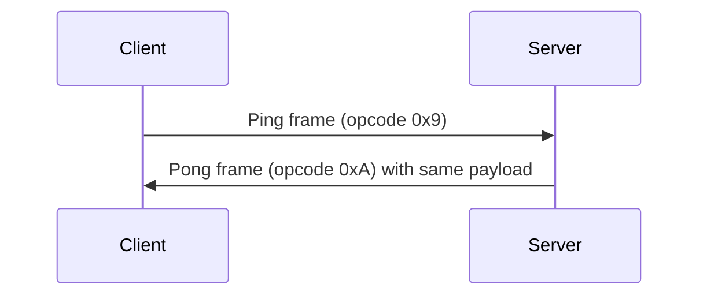
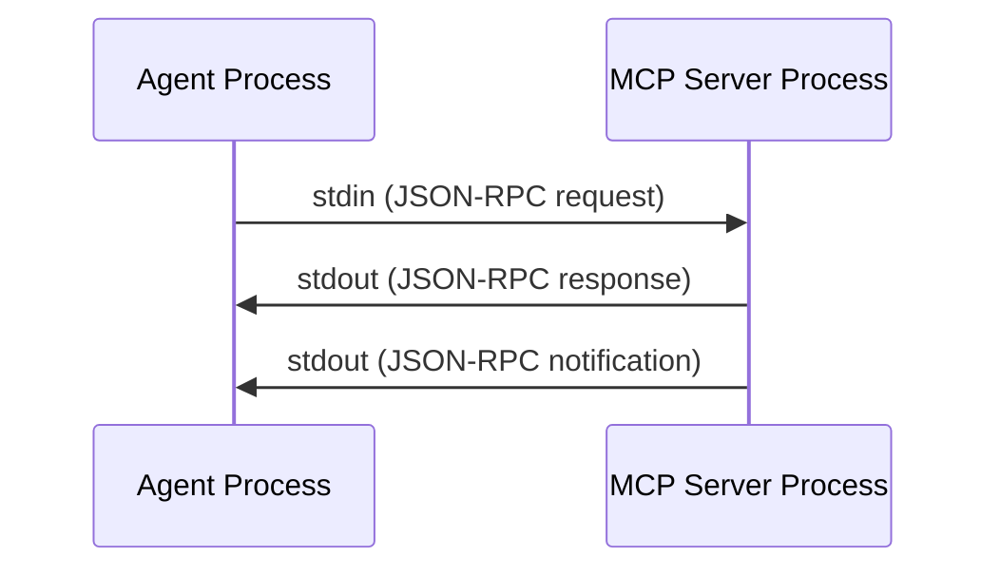
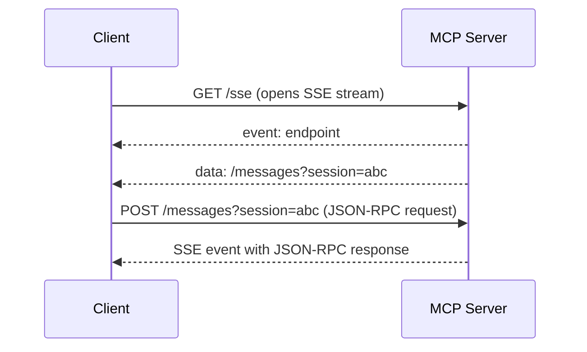
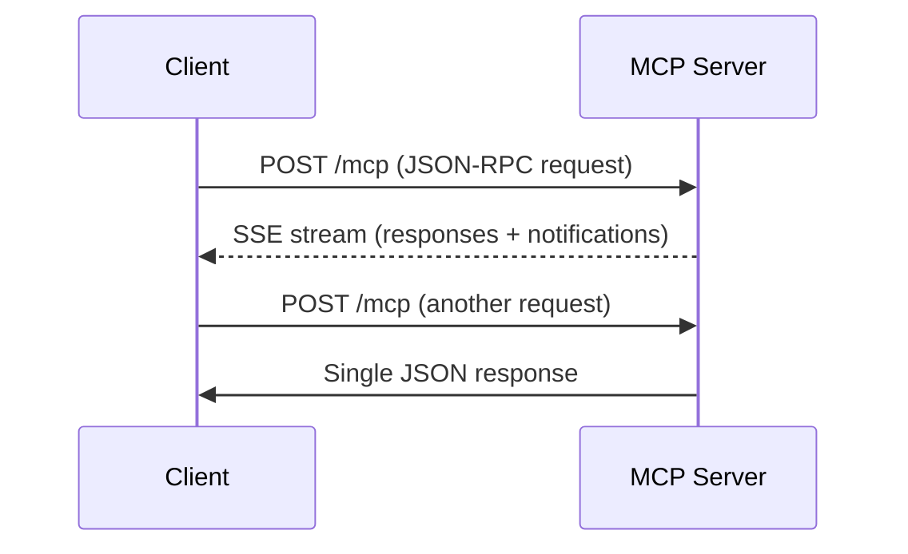

# Streaming Protocols

Deep-dive into streaming protocols used by LLM APIs and coding agents.

Streaming is the foundational transport mechanism that makes LLM-powered tools feel
responsive. Rather than waiting seconds for a complete response, streaming protocols
deliver tokens as they are generated — typically 20–100ms apart — creating the illusion
of a thinking assistant. This document covers every major streaming protocol in depth,
with wire format examples, code samples, and guidance on when to use each one.

---

## 1. Server-Sent Events (SSE)

### Overview

Server-Sent Events is a W3C standard (https://html.spec.whatwg.org/multipage/server-sent-events.html)
for server-to-client streaming over plain HTTP. It defines a text-based wire format
carried over a long-lived HTTP response with Content-Type `text/event-stream`.

SSE is the dominant protocol for LLM API streaming — used by OpenAI, Anthropic, Google,
Cohere, Mistral, and virtually every hosted LLM provider.

### MIME Type and Encoding

```
Content-Type: text/event-stream; charset=utf-8
Cache-Control: no-cache
Connection: keep-alive
```

The spec **requires** UTF-8 encoding. No other character encoding is permitted. The
response must not be buffered by intermediaries, hence the `Cache-Control: no-cache`
directive.

### Field Types

SSE defines exactly four field types:

| Field    | Purpose                                         |
|----------|-------------------------------------------------|
| `data:`  | The event payload. Multiple `data:` lines are joined with `\n`. |
| `event:` | Named event type (defaults to `"message"` if omitted). |
| `id:`    | Sets the last event ID for reconnection tracking. |
| `retry:` | Suggests reconnection delay in milliseconds.    |

### Event Format

Each event is a block of field lines terminated by a **double newline** (`\n\n`).
Individual fields within an event are separated by a single `\n`. Lines beginning
with `:` are comments and are silently discarded by conforming parsers — these are
commonly used as keep-alive heartbeats.

### Wire Format Example

```
HTTP/1.1 200 OK
Content-Type: text/event-stream; charset=utf-8
Cache-Control: no-cache
Connection: keep-alive
Transfer-Encoding: chunked

: this is a comment, used as keep-alive

event: start
data: {"id":"chatcmpl-abc123","model":"gpt-4"}

data: {"choices":[{"delta":{"role":"assistant"}}]}

data: {"choices":[{"delta":{"content":"Hello"}}]}

data: {"choices":[{"delta":{"content":" world"}}]}

event: usage
data: {"prompt_tokens":12,"completion_tokens":4}

data: [DONE]

```

Key observations:
- The `event:` field is optional. When omitted, the event type defaults to `"message"`.
- The `data: [DONE]` sentinel is an OpenAI convention, not part of the SSE spec.
- Anthropic uses `event: content_block_delta`, `event: message_stop`, etc.
- Each logical event is separated by a blank line (`\n\n`).

### Last-Event-ID and Reconnection

When the connection drops, a conforming client sends `Last-Event-ID: <id>` in the
reconnection request header. The server can use this to resume from where it left off.

```
GET /stream HTTP/1.1
Host: api.example.com
Last-Event-ID: 42
Accept: text/event-stream
```

The `retry:` field tells the client how long to wait before reconnecting:

```
retry: 3000
data: reconnect after 3 seconds if connection drops

```

### Browser EventSource API Limitations

The built-in `EventSource` API is limited:

1. **GET only** — cannot send POST requests or request bodies
2. **No custom headers** — cannot set `Authorization: Bearer ...`
3. **No request body** — LLM chat completions require sending messages in body
4. **Text only** — no binary support

This is why every LLM SDK uses **custom SSE parsing** on top of `fetch()` or similar:

```typescript
// Using fetch-event-source (Microsoft library) for POST SSE
import { fetchEventSource } from '@microsoft/fetch-event-source';

await fetchEventSource('https://api.openai.com/v1/chat/completions', {
  method: 'POST',
  headers: {
    'Content-Type': 'application/json',
    'Authorization': `Bearer ${apiKey}`,
  },
  body: JSON.stringify({
    model: 'gpt-4',
    messages: [{ role: 'user', content: 'Hello' }],
    stream: true,
  }),
  onmessage(event) {
    if (event.data === '[DONE]') return;
    const chunk = JSON.parse(event.data);
    process.stdout.write(chunk.choices[0]?.delta?.content || '');
  },
});
```

### Python SSE Consumer

```python
import httpx

url = "https://api.openai.com/v1/chat/completions"
headers = {"Authorization": f"Bearer {api_key}"}
body = {
    "model": "gpt-4",
    "messages": [{"role": "user", "content": "Hello"}],
    "stream": True,
}

with httpx.stream("POST", url, json=body, headers=headers) as response:
    for line in response.iter_lines():
        if line.startswith("data: "):
            payload = line[len("data: "):]
            if payload == "[DONE]":
                break
            chunk = json.loads(payload)
            print(chunk["choices"][0]["delta"].get("content", ""), end="")
```

### curl Example

```bash
curl -N --no-buffer \
  -H "Content-Type: application/json" \
  -H "Authorization: Bearer $OPENAI_API_KEY" \
  -d '{"model":"gpt-4","messages":[{"role":"user","content":"Hi"}],"stream":true}' \
  https://api.openai.com/v1/chat/completions
```

The `-N` flag disables curl's output buffering, so tokens appear in real time.

### Connection Limits

- **HTTP/1.1**: Browsers enforce a limit of **6 concurrent connections** per domain.
  Each SSE stream consumes one of these slots permanently. This is a serious issue
  for browser-based apps with multiple concurrent streams.
- **HTTP/2**: Multiplexes streams over a single TCP connection. The connection limit
  is negotiable via SETTINGS frames (default 100 concurrent streams). SSE over HTTP/2
  effectively eliminates the per-domain connection problem.

### Why SSE Dominates for LLM APIs

1. **Simplicity** — standard HTTP request/response; no protocol upgrade
2. **Proxy transparency** — works through corporate proxies, CDNs, load balancers
3. **Unidirectional match** — LLM inference is inherently server→client
4. **Built-in reconnection** — `Last-Event-ID` and `retry:` are part of the spec
5. **Universal client support** — every HTTP library can parse SSE
6. **Debuggability** — `curl` can read SSE streams directly
7. **Firewall friendly** — port 443, standard HTTPS, no exotic protocols

---

## 2. Chunked Transfer Encoding

### Overview

HTTP/1.1 Chunked Transfer Encoding (`Transfer-Encoding: chunked`) allows a server to
send a response in pieces without knowing the total `Content-Length` upfront. This is
the underlying transport mechanism that SSE rides on top of.

### Chunk Format

Each chunk consists of:
1. The chunk size in **hexadecimal**, followed by `\r\n`
2. The chunk data, followed by `\r\n`
3. A final zero-length chunk `0\r\n\r\n` signals the end of the response

### Wire Format Example

```
HTTP/1.1 200 OK
Content-Type: text/event-stream
Transfer-Encoding: chunked

1a\r\n
data: {"token":"Hello"}\n\n\r\n
1a\r\n
data: {"token":" world"}\n\n\r\n
0\r\n
\r\n
```

In this example:
- `1a` is hex for 26 bytes (the length of `data: {"token":"Hello"}\n\n`)
- The final `0\r\n\r\n` terminates the chunked response

### Relationship to SSE

SSE **rides on top of** chunked transfer encoding. The HTTP response uses
`Transfer-Encoding: chunked` to deliver the `text/event-stream` payload
incrementally. SSE adds semantic structure (named events, IDs, retry) on top of
the raw byte stream that chunked encoding provides.

### Newline-Delimited JSON (NDJSON)

NDJSON is a simpler alternative to SSE where each line is a complete JSON object:

```
Content-Type: application/x-ndjson

{"model":"llama2","response":"Hello","done":false}
{"model":"llama2","response":" world","done":false}
{"model":"llama2","response":"","done":true,"total_duration":1234567890}
```

NDJSON is used by:
- **Ollama** (`/api/generate`, `/api/chat`)
- **llama.cpp** server
- Various local model runners

```bash
# Ollama streaming example
curl http://localhost:11434/api/generate -d '{
  "model": "llama2",
  "prompt": "Hello"
}' | while IFS= read -r line; do
  echo "$line" | jq -r '.response // empty' | tr -d '\n'
done
```

### Go NDJSON Consumer

```go
resp, _ := http.Post("http://localhost:11434/api/generate",
    "application/json",
    strings.NewReader(`{"model":"llama2","prompt":"Hello"}`))
defer resp.Body.Close()

scanner := bufio.NewScanner(resp.Body)
for scanner.Scan() {
    var chunk struct {
        Response string `json:"response"`
        Done     bool   `json:"done"`
    }
    json.Unmarshal(scanner.Bytes(), &chunk)
    fmt.Print(chunk.Response)
    if chunk.Done {
        break
    }
}
```

### When Agents Use Raw Chunked vs SSE

| Scenario                    | Protocol     | Reason                          |
|-----------------------------|--------------|---------------------------------|
| Cloud LLM API              | SSE          | Industry standard, reconnection |
| Local model (Ollama)        | NDJSON       | Simpler, no event semantics     |
| Proxy/gateway               | Chunked      | Pass-through without parsing    |
| Custom tool output          | NDJSON       | Easy to produce and consume     |

---

## 3. WebSockets

### Overview

WebSockets (RFC 6455) provide full-duplex, bidirectional communication over a single
TCP connection. The protocol starts as an HTTP request that is "upgraded" to a
persistent WebSocket connection.

### Protocol Upgrade Handshake

```
GET /ws HTTP/1.1
Host: api.example.com
Upgrade: websocket
Connection: Upgrade
Sec-WebSocket-Key: dGhlIHNhbXBsZSBub25jZQ==
Sec-WebSocket-Version: 13
Sec-WebSocket-Protocol: graphql-ws
Origin: https://app.example.com

HTTP/1.1 101 Switching Protocols
Upgrade: websocket
Connection: Upgrade
Sec-WebSocket-Accept: s3pPLMBiTxaQ9kYGzzhZRbK+xOo=
Sec-WebSocket-Protocol: graphql-ws
```

The `Sec-WebSocket-Accept` value is derived from the client's key:
`Base64(SHA1(key + "258EAFA5-E914-47DA-95CA-5AB0DC85B11B"))`

### Frame Types

WebSocket communication uses frames:

| Opcode | Type         | Description                           |
|--------|--------------|---------------------------------------|
| 0x0    | Continuation | Continues a fragmented message        |
| 0x1    | Text         | UTF-8 text data                       |
| 0x2    | Binary       | Binary data                           |
| 0x8    | Close        | Connection close                      |
| 0x9    | Ping         | Keepalive ping                        |
| 0xA    | Pong         | Keepalive pong (response to ping)     |

### Bidirectional Communication

Unlike SSE, WebSockets allow the client to send data at any time without opening
a new HTTP request. This enables:

- **Cancellation**: Client sends cancel signal mid-stream
- **Interleaving**: Multiple request/response pairs on one connection
- **Real-time input**: Streaming audio/keystrokes to the server

### When WebSockets Make Sense for LLM

1. **OpenAI Realtime API** — bidirectional audio streaming for voice assistants
2. **IDE integrations** — editor sends keystrokes, server sends completions
3. **Multi-agent UIs** — browser needs both server updates and user input control
4. **Collaborative editing** — multiple users + AI editing the same document

### Python WebSocket Example

```python
import asyncio
import websockets
import json

async def stream_llm():
    async with websockets.connect("wss://api.example.com/v1/realtime") as ws:
        # Send request
        await ws.send(json.dumps({
            "type": "response.create",
            "response": {
                "modalities": ["text"],
                "instructions": "You are a helpful assistant.",
            }
        }))

        # Receive streaming response
        async for message in ws:
            event = json.loads(message)
            if event["type"] == "response.text.delta":
                print(event["delta"], end="")
            elif event["type"] == "response.done":
                break

asyncio.run(stream_llm())
```

### Ping/Pong Keepalive

WebSocket connections can go silent during long computations. Ping/pong frames
prevent intermediary proxies and load balancers from closing idle connections:



Most WebSocket libraries handle ping/pong automatically. Typical intervals:
- Application-level: every 30 seconds
- Infrastructure (AWS ALB): 60-second idle timeout by default

### Comparison with SSE for LLM Use Cases

| Aspect              | SSE                          | WebSocket                    |
|---------------------|------------------------------|------------------------------|
| Direction           | Server → Client only         | Bidirectional                |
| Protocol            | Standard HTTP                | Upgraded HTTP → WS           |
| Reconnection        | Built-in (`Last-Event-ID`)   | Manual implementation        |
| Proxy compatibility | Excellent                    | Good (but some proxies drop) |
| Overhead per message| ~30 bytes (field prefix)     | 2–14 bytes (frame header)    |
| Browser API         | `EventSource` (limited)      | `WebSocket` (full-featured)  |
| Debugging           | curl, browser DevTools       | Requires WS-aware tools      |
| LLM fit             | Excellent (unidirectional)   | Overkill unless bidirectional|

### Agent Usage

- **OpenHands**: WebSocket for UI ↔ backend transport (real-time terminal, browser)
- **Codex**: WebSocket for realtime collaborative mode
- **Droid**: WebSocket for multi-frontend support (web, mobile, CLI)
- **Cursor/Windsurf**: WebSocket for IDE ↔ agent communication

---

## 4. HTTP/2 Streaming

### Overview

HTTP/2 (RFC 7540) introduces multiplexed streams over a single TCP connection,
binary framing, header compression, and server push. It fundamentally changes how
streaming works compared to HTTP/1.1.

### Multiplexed Streams

HTTP/2 multiplexes multiple logical streams over one TCP connection:

```
┌──────────────────────────────────────────┐
│              TCP Connection              │
│  ┌─────────┐ ┌─────────┐ ┌─────────┐   │
│  │ Stream 1 │ │ Stream 3 │ │ Stream 5 │   │
│  │ (SSE)    │ │ (API)    │ │ (SSE)    │   │
│  └─────────┘ └─────────┘ └─────────┘   │
└──────────────────────────────────────────┘
```

Each stream has a unique identifier (odd for client-initiated, even for server push).
Frames from different streams can be interleaved on the wire.

### Binary Framing Layer

HTTP/2 replaces HTTP/1.1's text-based protocol with a binary framing layer:

```
+-----------------------------------------------+
|                 Length (24 bits)               |
+---------------+---------------+---------------+
|   Type (8)    |   Flags (8)   |
+-+-------------+---------------+---------------+
|R|                 Stream ID (31 bits)         |
+=+=============+===============================+
|                   Frame Payload               |
+-----------------------------------------------+
```

Frame types include:
- **DATA** (0x0): Carries the response body
- **HEADERS** (0x1): Carries HTTP headers, compressed with HPACK
- **SETTINGS** (0x4): Connection configuration
- **PUSH_PROMISE** (0x5): Server push announcement
- **GOAWAY** (0x7): Graceful shutdown

### HPACK Header Compression

HTTP/2 uses HPACK (RFC 7541) to compress headers. A static table of 61 common
header name-value pairs plus a dynamic table built during the connection dramatically
reduces header overhead for repeated requests:

```
Static table entry 2:  :method GET
Static table entry 3:  :method POST
Static table entry 31: content-type (name only)
...
```

For LLM API calls that repeat `Authorization`, `Content-Type`, and other headers
on every request, HPACK compression reduces wire overhead significantly.

### How HTTP/2 Improves SSE

1. **No connection limit**: Multiple SSE streams share one TCP connection
2. **Header compression**: Repeated headers compressed via HPACK
3. **Stream prioritization**: Can prioritize interactive SSE over bulk downloads
4. **Flow control**: Per-stream flow control prevents one stream from starving others
5. **No head-of-line blocking** (at HTTP layer): Frames interleave freely

### Stream Prioritization

HTTP/2 supports stream dependencies and weights:

```
Stream 1 (SSE, weight 256) ──┐
                              ├── TCP Connection
Stream 3 (API, weight 16) ───┘
```

A high-priority SSE stream delivering LLM tokens can be prioritized over a
lower-priority background API call.

### Why Most LLM APIs Still Target HTTP/1.1 SSE

Despite HTTP/2's advantages:
1. **Simplicity**: HTTP/1.1 SSE is trivially implementable
2. **Compatibility**: All intermediaries (proxies, CDNs, WAFs) handle HTTP/1.1
3. **Single stream**: Most LLM calls use one stream at a time anyway
4. **Client libraries**: Most HTTP client libraries abstract away HTTP version
5. **Debugging**: HTTP/1.1 is human-readable in packet captures

In practice, many LLM API calls are transparently upgraded to HTTP/2 by the
infrastructure (CDNs like Cloudflare, load balancers like AWS ALB) without the
application code needing to change.

---

## 5. gRPC Streaming

### Overview

gRPC is a high-performance RPC framework built on HTTP/2 and Protocol Buffers. It
natively supports four streaming patterns, making it powerful for model serving
infrastructure.

### Four RPC Types

```protobuf
service LLMService {
  // Unary: single request, single response
  rpc Complete(CompletionRequest) returns (CompletionResponse);

  // Server streaming: single request, stream of responses
  rpc StreamComplete(CompletionRequest) returns (stream CompletionChunk);

  // Client streaming: stream of requests, single response
  rpc BatchEmbed(stream EmbedRequest) returns (EmbedResponse);

  // Bidirectional streaming: stream of requests, stream of responses
  rpc Chat(stream ChatMessage) returns (stream ChatMessage);
}
```

### Protocol Buffers Serialization

```protobuf
syntax = "proto3";

message CompletionRequest {
  string model = 1;
  repeated Message messages = 2;
  float temperature = 3;
  int32 max_tokens = 4;
  bool stream = 5;
}

message CompletionChunk {
  string id = 1;
  string object = 2;
  int64 created = 3;
  string model = 4;
  repeated Choice choices = 5;
}

message Choice {
  int32 index = 1;
  Delta delta = 2;
  string finish_reason = 3;
}

message Delta {
  string role = 1;
  string content = 2;
}
```

### Wire Format

gRPC messages are length-prefixed on the wire:

```
┌──────────────────────────────────────────┐
│ Compressed Flag (1 byte): 0x00           │
│ Message Length (4 bytes, big-endian)      │
│ Serialized Protobuf Message (N bytes)    │
└──────────────────────────────────────────┘
```

Multiple messages are concatenated in a single HTTP/2 DATA frame (or across frames):

```
[0x00][0x00 0x00 0x00 0x1A][protobuf bytes...]
[0x00][0x00 0x00 0x00 0x0F][protobuf bytes...]
```

### gRPC Metadata (Headers/Trailers)

gRPC uses HTTP/2 headers for request metadata and **trailers** for response status:

```
# Request headers
:method POST
:path /llm.LLMService/StreamComplete
content-type application/grpc
grpc-timeout 30S
authorization Bearer <token>

# Response trailers (sent after all data frames)
grpc-status 0
grpc-message OK
```

Status codes include:
- `0` OK
- `1` CANCELLED
- `4` DEADLINE_EXCEEDED
- `8` RESOURCE_EXHAUSTED (rate limited)
- `14` UNAVAILABLE

### Deadlines and Timeouts

gRPC has first-class deadline support. The client sets a deadline and the server
receives a context that expires:

```python
# Python gRPC client with deadline
import grpc

channel = grpc.insecure_channel('localhost:50051')
stub = LLMServiceStub(channel)

# 30-second deadline
response_iterator = stub.StreamComplete(
    CompletionRequest(model="llama2", messages=[...]),
    timeout=30.0
)

for chunk in response_iterator:
    print(chunk.choices[0].delta.content, end="")
```

### Go gRPC Streaming Client

```go
ctx, cancel := context.WithTimeout(context.Background(), 30*time.Second)
defer cancel()

stream, err := client.StreamComplete(ctx, &pb.CompletionRequest{
    Model:    "llama2",
    Messages: messages,
})
if err != nil {
    log.Fatal(err)
}

for {
    chunk, err := stream.Recv()
    if err == io.EOF {
        break
    }
    if err != nil {
        log.Fatal(err)
    }
    fmt.Print(chunk.Choices[0].Delta.Content)
}
```

### Usage in ML/LLM Infrastructure

| Framework              | Protocol | Streaming Pattern        |
|------------------------|----------|--------------------------|
| TensorFlow Serving     | gRPC     | Unary (mostly)           |
| NVIDIA Triton          | gRPC     | Server streaming          |
| vLLM                   | REST+SSE | Server streaming          |
| TGI (HuggingFace)      | REST+SSE | Server streaming          |
| Ray Serve              | REST     | Server streaming (SSE)    |

### When gRPC Makes Sense vs REST+SSE

**Choose gRPC when:**
- Internal microservice communication (model server ↔ gateway)
- Need bidirectional streaming (interactive chat with cancel)
- High throughput with strict latency requirements
- Type safety via protobuf schema is valuable
- Polyglot services (generated clients for many languages)

**Choose REST+SSE when:**
- Public-facing API (browser compatibility matters)
- Simplicity and debuggability are priorities
- Team is more familiar with REST patterns
- Need to work through CDNs and corporate proxies

---

## 6. Comparison Table

| Feature          | SSE              | Chunked/NDJSON   | WebSocket         | HTTP/2 Stream    | gRPC             |
|------------------|------------------|------------------|-------------------|------------------|------------------|
| **Direction**    | Server→Client    | Server→Client    | Bidirectional     | Bidirectional    | All four modes   |
| **Latency**      | Low              | Low              | Very Low          | Low              | Very Low         |
| **Complexity**   | Very Low         | Very Low         | Medium            | Medium           | High             |
| **Browser**      | EventSource      | fetch            | WebSocket API     | Transparent      | grpc-web         |
| **Binary**       | No (text only)   | No (text only)   | Yes               | Yes              | Yes (protobuf)   |
| **Backpressure** | TCP only         | TCP only         | TCP + WS flow     | Per-stream       | Per-stream       |
| **Reconnection** | Built-in (ID)    | Manual           | Manual            | Manual/GOAWAY    | Retry policies   |
| **LLM API Use**  | ★★★★★           | ★★★ (local)      | ★★ (realtime)     | ★★ (transparent) | ★★ (infra)       |
| **Debugging**    | curl, DevTools   | curl, jq         | wscat, DevTools   | nghttp, h2load   | grpcurl          |
| **Proxy Safe**   | Excellent        | Excellent        | Good              | Good             | Poor (needs h2)  |
| **Overhead/msg** | ~30 bytes        | ~1 byte (newline)| 2–14 bytes        | 9+ bytes (frame) | 5+ bytes (len)   |

---

## 7. Why SSE Dominates for LLM APIs

### The Unidirectional Argument

LLM token generation is fundamentally unidirectional. The client sends a request
(prompt + parameters) and the server streams back tokens one at a time. There is no
need for the client to send additional data during generation (cancellation is handled
by closing the connection). This maps perfectly to SSE's server-to-client model.

### HTTP Compatibility

SSE is plain HTTP. It works through:
- **Corporate proxies** that inspect HTTP traffic
- **CDNs** (Cloudflare, Fastly, AWS CloudFront) with streaming support
- **Load balancers** (AWS ALB, nginx, HAProxy)
- **Web Application Firewalls** (WAFs)
- **API gateways** (Kong, Apigee, AWS API Gateway)

No special configuration is needed. The response is just a long-lived HTTP response
with a specific Content-Type.

### Reconnection Semantics

SSE includes built-in reconnection via `Last-Event-ID`:

```
1. Client connects, receives events with id: 1, id: 2, id: 3
2. Connection drops after id: 3
3. Client reconnects with header: Last-Event-ID: 3
4. Server resumes from event 4
```

For LLM APIs, this means a dropped connection can potentially resume token delivery
rather than restarting the entire generation.

### Universal Client Support

Every programming language has HTTP client libraries that can consume SSE:

```bash
# Bash — just curl
curl -N https://api.example.com/stream

# Python — httpx, requests, aiohttp
# TypeScript — fetch, axios, got
# Go — net/http with bufio.Scanner
# Rust — reqwest with streaming
# Java — HttpClient with Flow.Subscriber
```

### Debuggability

SSE is human-readable. A developer can debug with:

```bash
# Watch raw SSE stream
curl -N -H "Authorization: Bearer $KEY" \
  https://api.openai.com/v1/chat/completions \
  -d '{"model":"gpt-4","stream":true,"messages":[{"role":"user","content":"Hi"}]}'

# Output is immediately readable:
# data: {"id":"chatcmpl-...","choices":[{"delta":{"content":"Hello"}}]}
# data: {"id":"chatcmpl-...","choices":[{"delta":{"content":"!"}}]}
# data: [DONE]
```

No special tools, no protocol analyzers, no binary decoders. Just curl.

---

## 8. Protocol Selection Guide for Agents

### Decision Matrix

| Scenario                            | Best Protocol    | Rationale                                       |
|-------------------------------------|------------------|-------------------------------------------------|
| Standard LLM API streaming          | SSE              | Industry standard, simple, debuggable           |
| Local model (Ollama, llama.cpp)     | NDJSON chunks    | Simpler than SSE, no event semantics needed     |
| Bidirectional realtime (voice)      | WebSocket        | Need client→server streaming (audio input)      |
| Web UI ↔ backend agent              | WebSocket        | Need bidirectional (user input + agent output)  |
| IDE plugin ↔ language server        | stdio or WebSocket| stdio for local, WS for remote                 |
| MCP tool transport (local)          | stdio            | Simplest, most reliable for local processes     |
| MCP tool transport (remote)         | SSE / Streamable HTTP | HTTP-based, works across network boundaries |
| High-throughput model serving       | gRPC             | Efficient binary serialization, streaming       |
| Inter-service (gateway ↔ model)     | gRPC             | Type safety, deadline propagation               |
| Browser-only client                 | SSE or WebSocket | Both have native browser APIs                   |
| Mobile app                          | SSE              | Simpler connection management, auto-reconnect   |

### Layered Architecture Pattern

Many production systems use multiple protocols in layers:

```
Browser ←──WebSocket──→ API Gateway ←──gRPC──→ Model Server
                              │
                              └──SSE──→ Third-party LLM API
```

The API gateway translates between protocols:
- Browser talks WebSocket (bidirectional UI updates)
- Internal model servers use gRPC (efficiency)
- External LLM APIs use SSE (their standard interface)

---

## 9. MCP Transport Protocols

The Model Context Protocol (MCP) defines how AI agents communicate with external
tool servers. MCP supports multiple transport layers.

### stdio Transport

The simplest transport: the MCP server is a child process, and communication happens
over stdin/stdout using JSON-RPC 2.0 messages.



Example JSON-RPC over stdio:

```json
→ {"jsonrpc":"2.0","id":1,"method":"tools/list","params":{}}
← {"jsonrpc":"2.0","id":1,"result":{"tools":[{"name":"read_file","description":"Read a file"}]}}

→ {"jsonrpc":"2.0","id":2,"method":"tools/call","params":{"name":"read_file","arguments":{"path":"/tmp/test.txt"}}}
← {"jsonrpc":"2.0","id":2,"result":{"content":[{"type":"text","text":"file contents here"}]}}
```

**Advantages**: No network, no ports, no authentication needed. Process isolation
via OS. Works everywhere.

**Used by**: GitHub Copilot CLI, Claude Code, Cursor, VS Code Copilot — all local
MCP servers.

### SSE Transport (Legacy)

The original HTTP-based MCP transport uses SSE for server→client messages and
POST requests for client→server messages:



This two-channel approach (SSE for receiving, POST for sending) bridges the
unidirectional nature of SSE for the bidirectional JSON-RPC protocol.

### Streamable HTTP Transport (Current)

The newer MCP transport simplifies the SSE approach into a single HTTP endpoint:



Key improvements over the legacy SSE transport:
- Single endpoint instead of separate SSE + POST endpoints
- Server can respond with either SSE stream or single JSON response
- Stateless by default (no mandatory session tracking)
- Optional session management via `Mcp-Session-Id` header

### How Agents Choose Transport

```
Is the MCP server a local process?
  ├── Yes → Use stdio
  └── No (remote server)
        ├── Server supports Streamable HTTP? → Use Streamable HTTP
        └── Legacy server? → Use SSE transport
```

Configuration example (MCP config):

```json
{
  "mcpServers": {
    "filesystem": {
      "command": "npx",
      "args": ["-y", "@modelcontextprotocol/server-filesystem", "/tmp"],
      "transport": "stdio"
    },
    "remote-tools": {
      "url": "https://mcp.example.com/sse",
      "transport": "sse"
    },
    "modern-remote": {
      "url": "https://mcp.example.com/mcp",
      "transport": "streamable-http"
    }
  }
}
```

---

## 10. Advanced Topics

### Backpressure and Flow Control

When a client cannot consume tokens as fast as the server generates them:

- **SSE/Chunked**: TCP flow control is the only mechanism. If the client's receive
  buffer fills, TCP window shrinks, server blocks on write.
- **HTTP/2**: Per-stream flow control via WINDOW_UPDATE frames. One slow stream
  doesn't block others.
- **gRPC**: Built on HTTP/2 flow control, plus application-level backpressure via
  `RecvMsg()` blocking.
- **WebSocket**: TCP flow control, plus application-level patterns (client sends
  "ready" messages).

### Token Buffering Strategies

LLM APIs may buffer tokens before sending to reduce overhead:

```
Strategy 1: Per-token (lowest latency)
  Generate → Send immediately
  Overhead: high (one HTTP chunk per token)

Strategy 2: Time-based (e.g., every 50ms)
  Generate → Buffer → Flush every 50ms
  Overhead: moderate, slightly higher latency

Strategy 3: Size-based (e.g., every 4 tokens)
  Generate → Buffer → Flush when buffer has 4+ tokens
  Overhead: low, variable latency
```

Most production APIs use per-token or very small time-based buffering to maintain
the real-time feel that users expect.

### Error Handling Across Protocols

| Protocol  | Error Mechanism                              | Example                           |
|-----------|----------------------------------------------|-----------------------------------|
| SSE       | `event: error` + data, or HTTP status code   | `data: {"error":"rate_limited"}`  |
| NDJSON    | JSON object with error field                 | `{"error":"model not found"}`     |
| WebSocket | Close frame with status code + reason        | `1008: Policy Violation`          |
| HTTP/2    | RST_STREAM frame with error code             | `REFUSED_STREAM (0x7)`            |
| gRPC      | Trailers with `grpc-status` + `grpc-message` | `grpc-status: 8 (EXHAUSTED)`     |

---

## References

- W3C Server-Sent Events Spec: https://html.spec.whatwg.org/multipage/server-sent-events.html
- RFC 7540 (HTTP/2): https://tools.ietf.org/html/rfc7540
- RFC 6455 (WebSocket): https://tools.ietf.org/html/rfc6455
- gRPC Documentation: https://grpc.io/docs/
- MCP Specification: https://modelcontextprotocol.io/specification
- OpenAI Streaming Guide: https://platform.openai.com/docs/api-reference/streaming
- Anthropic Streaming Guide: https://docs.anthropic.com/en/api/streaming
- NDJSON Spec: https://github.com/ndjson/ndjson-spec
