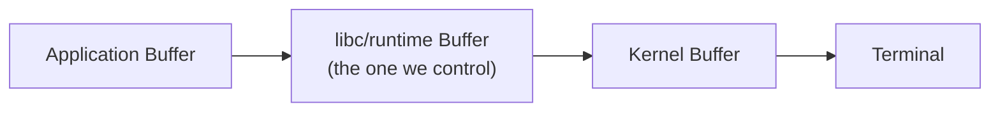
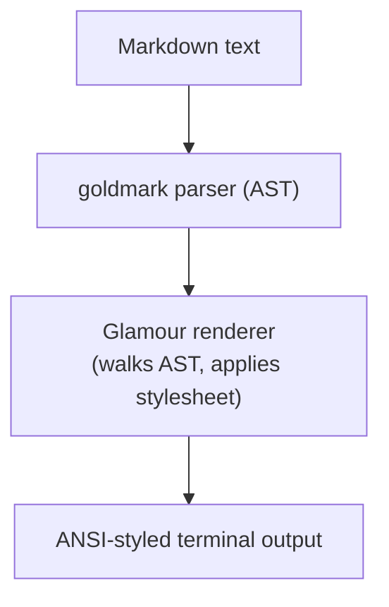
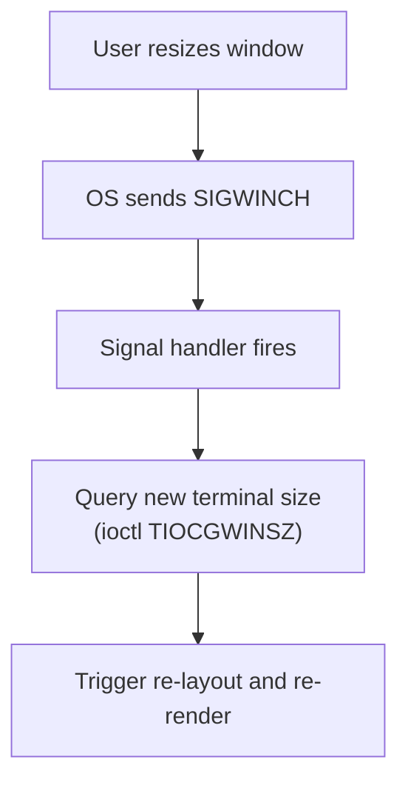

# Terminal Rendering

Low-level rendering details for streaming LLM output in terminals.

Understanding how terminals actually draw characters, move cursors, and manage
screen state is essential for building responsive streaming interfaces. This
document covers the primitives that every terminal-based coding agent relies on.

---

## 1. ANSI Escape Codes

ANSI escape sequences are the universal language for terminal control. Every
sequence begins with `ESC [` (written as `\033[` in octal or `\x1b[` in hex).

### Cursor Control

```
\033[H              Move cursor to home position (0,0)
\033[{line};{col}H  Move cursor to specific position (1-indexed)
\033[{n}A           Move cursor up n lines
\033[{n}B           Move cursor down n lines
\033[{n}C           Move cursor right n columns
\033[{n}D           Move cursor left n columns
\033[s              Save current cursor position (SCO)
\033[u              Restore saved cursor position (SCO)
\033[7              Save cursor + attributes (DEC, more portable)
\033[8              Restore cursor + attributes (DEC)
\033[?25l           Hide cursor (DECTCEM)
\033[?25h           Show cursor (DECTCEM)
\033[6n             Request cursor position (terminal replies with \033[{r};{c}R)
```

Cursor hiding is critical during streaming redraws — it prevents the cursor
from flickering as content is repainted across multiple lines.

**Cursor position query flow:**

```
Application             Terminal
    |                      |
    |--- \033[6n --------->|   (request position)
    |                      |
    |<-- \033[24;1R -------|   (reply: row 24, col 1)
    |                      |
```

This is how libraries like Bubble Tea detect the initial cursor position
when they need to render inline (non-fullscreen) UIs.

### Colors

Terminal color support has evolved through several generations:

```
┌─────────────┬──────────┬─────────────────────────────────┐
│ Generation  │ Colors   │ Escape Sequence                 │
├─────────────┼──────────┼─────────────────────────────────┤
│ 3/4-bit     │ 8/16     │ \033[31m (fg red)               │
│             │          │ \033[42m (bg green)              │
│             │          │ \033[91m (bright red)            │
├─────────────┼──────────┼─────────────────────────────────┤
│ 8-bit       │ 256      │ \033[38;5;{n}m (fg)             │
│             │          │ \033[48;5;{n}m (bg)              │
├─────────────┼──────────┼─────────────────────────────────┤
│ 24-bit      │ 16M      │ \033[38;2;{r};{g};{b}m (fg)    │
│ (truecolor) │          │ \033[48;2;{r};{g};{b}m (bg)     │
└─────────────┴──────────┴─────────────────────────────────┘
```

**8-bit color map (256 colors):**

```
  0-7:    Standard colors (same as 3-bit: black, red, green, yellow, blue, magenta, cyan, white)
  8-15:   High-intensity (bright) colors
 16-231:  6×6×6 color cube (index = 16 + 36r + 6g + b, where r/g/b ∈ [0..5])
232-255:  Grayscale ramp (24 shades, dark to light)
```

**Color downsampling strategy:**

```
Desired: #FF6B35 (24-bit orange)
    │
    ├── Terminal supports truecolor? → \033[38;2;255;107;53m
    │
    ├── Terminal supports 256-color? → Find nearest in 6×6×6 cube
    │   r=5, g=2, b=1 → index = 16 + 36(5) + 6(2) + 1 = 209
    │   → \033[38;5;209m
    │
    └── Fallback to 16-color → \033[33m (yellow, nearest standard)
```

**Reset:** `\033[0m` resets ALL attributes (color, bold, italic, etc.)

### Formatting Attributes

```
\033[1m     Bold (or increased intensity)
\033[2m     Dim (decreased intensity)
\033[3m     Italic (not widely supported historically, now common)
\033[4m     Underline
\033[4:3m   Undercurl (wavy underline — kitty, iTerm2, WezTerm)
\033[7m     Reverse/inverse video (swap fg and bg)
\033[8m     Hidden/concealed
\033[9m     Strikethrough
\033[21m    Double underline (or bold off on some terminals)
\033[22m    Normal intensity (bold off, dim off)
\033[23m    Italic off
\033[24m    Underline off
\033[27m    Reverse off
\033[29m    Strikethrough off
```

Attributes can be combined in a single sequence:

```
\033[1;3;38;2;255;165;0m   Bold + italic + orange foreground
```

### Screen Control

```
\033[2J     Clear entire screen (cursor position unchanged)
\033[3J     Clear screen and scrollback buffer
\033[K      Clear from cursor to end of line (EL0)
\033[1K     Clear from beginning of line to cursor (EL1)
\033[2K     Clear entire line (EL2)
\033[J      Clear from cursor to end of screen (ED0)
\033[1J     Clear from beginning of screen to cursor (ED1)
```

### Alternate Screen Buffer

```
\033[?1049h     Enter alternate screen buffer (saves main screen)
\033[?1049l     Leave alternate screen buffer (restores main screen)
```

**Lifecycle in a TUI application:**

```
1. Program starts
2. \033[?1049h  — switch to alternate screen (main screen preserved)
3. \033[?25l    — hide cursor
4. \033[2J      — clear alternate screen
5. ... application runs, draws UI ...
6. \033[?25h    — show cursor
7. \033[?1049l  — switch back to main screen (restored exactly)
```

This is why programs like vim, less, and Bubble Tea apps don't leave
their UI on screen after exit — the main screen buffer is untouched.

**Inline vs fullscreen rendering:**

```
┌─────────────────────────────────────────┐
│ Fullscreen (alternate buffer)           │
│                                         │
│  • Complete screen control              │
│  • No scrollback pollution              │
│  • Clean exit (original screen returns) │
│  • Used by: OpenCode, vim, htop         │
│                                         │
├─────────────────────────────────────────┤
│ Inline (main buffer)                    │
│                                         │
│  • Renders within existing scroll       │
│  • Must track own position carefully    │
│  • Output preserved in scrollback       │
│  • Used by: GitHub Copilot CLI, Aider   │
│                                         │
└─────────────────────────────────────────┘
```

---

## 2. Live-Updating Terminal Output

### Overwriting Lines

The fundamental technique for dynamic terminal updates:

```
\r                  Carriage return — move to column 0 (same line)
\033[2K\r           Clear entire line + move to column 0
\033[{n}A           Move up n lines (for multi-line overwrites)
\033[{n}F           Move to beginning of line n lines up
```

**Single-line overwrite (spinner/progress bar):**

```
write "\r\033[2K"       ← clear current line
write "Processing... 45%"  ← write new content
flush                    ← ensure output is sent immediately
```

**Multi-line overwrite pattern:**

```
# To update a 3-line block:

write "\033[3A"         ← move cursor up 3 lines
write "\033[2K"         ← clear line 1
write "New line 1\n"
write "\033[2K"         ← clear line 2
write "New line 2\n"
write "\033[2K"         ← clear line 3
write "New line 3"
flush
```

### Approaches for Streaming LLM Output

**Approach 1: Append-only (simplest)**

```python
# Python example — just print each token as it arrives
for token in stream:
    print(token, end="", flush=True)
print()  # newline at end
```

Pros: Dead simple, works everywhere.
Cons: Cannot update previously printed text (no re-rendering markdown).

**Approach 2: Line overwrite (spinners, status)**

```python
import sys
# Single-line status that updates in place
sys.stdout.write(f"\r\033[2KThinking... {elapsed:.1f}s")
sys.stdout.flush()
```

**Approach 3: Region overwrite (multi-line streaming)**

```python
# Track how many lines we've written
line_count = 0

def render(text):
    global line_count
    # Move up to overwrite previous output
    if line_count > 0:
        sys.stdout.write(f"\033[{line_count}A")
    # Clear and rewrite each line
    lines = text.split("\n")
    for line in lines:
        sys.stdout.write(f"\033[2K{line}\n")
    sys.stdout.flush()
    line_count = len(lines)
```

**Approach 4: Full-screen redraw (TUI frameworks)**

```
1. Enter alternate screen buffer
2. On each frame (or each new token):
   a. Move cursor to (0,0)
   b. Render entire screen
   c. Flush
3. On exit, restore main screen
```

### Buffered vs Unbuffered Output

Terminal output goes through multiple buffering layers:



**Buffering modes:**

| Mode            | Behavior                          | When used             |
|-----------------|-----------------------------------|-----------------------|
| Unbuffered      | Each write() goes immediately     | stderr (default)      |
| Line-buffered   | Flush on newline                  | stdout to terminal    |
| Block-buffered  | Flush when buffer full (~4-8 KB)  | stdout to pipe/file   |

**Critical for streaming:** When stdout is piped (e.g., to a pager or log
file), it switches to block-buffered mode. This causes tokens to appear in
bursts instead of one at a time. Solutions:

```python
# Python: Force line buffering or unbuffered
import sys, os
sys.stdout.reconfigure(line_buffering=True)
# or: python -u script.py
# or: PYTHONUNBUFFERED=1

# Each token write must be flushed
sys.stdout.write(token)
sys.stdout.flush()
```

```javascript
// Node.js: stdout.write is unbuffered when connected to a TTY
process.stdout.write(token);
// No flush needed — but check process.stdout.isTTY
```

```go
// Go: bufio.Writer needs explicit Flush
writer := bufio.NewWriter(os.Stdout)
writer.WriteString(token)
writer.Flush()
```

---

## 3. Markdown → Terminal Rendering

### Glamour (Go)

The dominant Go library for terminal markdown rendering. Part of the Charm
ecosystem alongside Bubble Tea, Lip Gloss, and Glow.

**Architecture:**



**Built-in themes:** dark, light, ascii, notty, Tokyo Night, Dracula

**Custom stylesheet example (JSON):**

```json
{
  "document": { "margin": 2 },
  "heading": { "bold": true, "color": "99" },
  "code_block": {
    "theme": "dracula",
    "margin": 2,
    "chroma": { "theme": "dracula" }
  },
  "link": { "color": "39", "underline": true }
}
```

**Users:** GitHub CLI (`gh`), GitLab CLI (`glab`), Glow, OpenCode

### Termimad (Rust)

Skinnable markdown renderer with a unique template feature:

```rust
let skin = MadSkin::default();
// Template syntax with placeholders
let text = "Hello **${name}**, you have ${count} messages";
skin.print_text(text);
```

Supports scrollable views via `MadView` for paged content in TUI apps.

### Rich (Python)

```python
from rich.console import Console
from rich.markdown import Markdown
from rich.live import Live

console = Console()

# Static render
md = Markdown("# Hello\nThis is **bold** and `code`")
console.print(md)

# Streaming render with Live display
with Live(console=console, refresh_per_second=15) as live:
    accumulated = ""
    for token in stream:
        accumulated += token
        live.update(Markdown(accumulated))
```

### marked-terminal (Node.js)

Custom renderer for the `marked` parser that outputs ANSI sequences:

```javascript
import { marked } from 'marked';
import { markedTerminal } from 'marked-terminal';

marked.use(markedTerminal({
  code: chalk.yellow,
  blockquote: chalk.gray.italic,
  heading: chalk.green.bold
}));

console.log(marked('# Hello\nThis is **bold**'));
```

### Challenges for Streaming Markdown

When tokens arrive one at a time, markdown is ambiguous mid-stream:

```
Token sequence:    "The " → "**" → "quick" → "**" → " fox"

After "The **quick":
  Option A: "quick" is bold (if ** closes later)    ← correct
  Option B: literal asterisks (if ** never closes)

After "The **quick**":
  Now we know: "quick" was bold                     ← resolved
```

**Strategies:**

```
┌─────────────────────────────────────────────────────────────┐
│ Strategy 1: Buffer until block boundary                     │
│                                                             │
│   Accumulate tokens until a complete markdown element        │
│   (paragraph break, code fence close, etc.) then render.    │
│   Latency: medium. Correctness: high.                       │
├─────────────────────────────────────────────────────────────┤
│ Strategy 2: Tentative rendering                             │
│                                                             │
│   Render what we have, assume open markers will close.      │
│   Re-render/correct as more tokens arrive.                  │
│   Latency: low. Correctness: eventual.                      │
├─────────────────────────────────────────────────────────────┤
│ Strategy 3: Full re-render per token                        │
│                                                             │
│   Re-parse and re-render ALL accumulated text on each       │
│   new token. Simple but expensive. Must clear and           │
│   redraw the full output region.                            │
│   Latency: low. CPU cost: O(n²) over full stream.          │
└─────────────────────────────────────────────────────────────┘
```

**Code blocks are the hardest case:**

```
Token arrives: "```python\n"
  → We know a code block started, but don't know when it ends
  → Must buffer and apply syntax highlighting incrementally
  → Or: show un-highlighted text, re-highlight when block closes
```

---

## 4. Syntax Highlighting in Terminal

### Chroma (Go)

Pure Go implementation used by Glamour for code blocks:

```go
lexer := lexers.Get("python")
style := styles.Get("dracula")
formatter := formatters.Get("terminal256")  // or "terminal16m" for truecolor
iterator, _ := lexer.Tokenise(nil, sourceCode)
formatter.Format(os.Stdout, style, iterator)
```

Supports 300+ languages, multiple output formatters:
- `terminal` — 8 colors
- `terminal256` — 256 colors
- `terminal16m` — 24-bit truecolor

### tree-sitter

Incremental parsing enables real-time syntax highlighting as tokens stream in:

```mermaid
flowchart TD
    A["Input: \"def hello\""] --> B["Partial AST
(function_definition with MISSING params/body)"]
    C["New token: \"(world):\\n\""] --> D["Re-parse changed region only"]
    B --> D
    D --> E["Updated AST
(unchanged nodes reused)"]
```

This incremental nature makes tree-sitter ideal for streaming scenarios
where code is being received token by token.

### Pygments (Python)

Used by Rich for syntax highlighting:

```python
from pygments import highlight
from pygments.lexers import PythonLexer
from pygments.formatters import Terminal256Formatter

result = highlight(code, PythonLexer(), Terminal256Formatter(style='monokai'))
print(result)
```

---

## 5. Spinners and Progress Indicators

### Spinner Lifecycle for LLM Streaming

```
User sends prompt
    │
    ▼
┌──────────────┐
│   Spinner     │  "Thinking..."  (waiting for first token — TTFT)
│   ◐ ◓ ◑ ◒    │
└──────┬───────┘
       │  first token arrives
       ▼
┌──────────────┐
│  Streaming    │  tokens print as they arrive
│  text output  │
└──────┬───────┘
       │  tool_use block received
       ▼
┌──────────────┐
│   Spinner     │  "Running file_edit..."  (tool executing)
│   ⠋ ⠙ ⠹ ⠸    │
└──────┬───────┘
       │  tool result returned, streaming resumes
       ▼
┌──────────────┐
│  Streaming    │  more tokens
│  text output  │
└──────┬───────┘
       │  stream ends
       ▼
    Complete
```

### Spinner Animation Mechanics

A spinner is simply a timer-driven frame cycle:

```
frames: ["⠋", "⠙", "⠹", "⠸", "⠼", "⠴", "⠦", "⠧", "⠇", "⠏"]
interval: 80ms

Every 80ms:
  1. \033[2K\r           (clear line, carriage return)
  2. Write frames[i]     (current frame)
  3. Write " Thinking..." (label)
  4. Flush
  5. i = (i + 1) % len(frames)
```

### ora (JavaScript)

```javascript
import ora from 'ora';

const spinner = ora('Thinking...').start();
// ... async work ...
spinner.text = 'Generating response...';
// ... more work ...
spinner.succeed('Done');  // replaces spinner with ✔ Done
```

### indicatif (Rust)

```rust
use indicatif::{ProgressBar, ProgressStyle};

let pb = ProgressBar::new_spinner();
pb.set_style(ProgressStyle::default_spinner()
    .template("{spinner:.cyan} {msg}")
    .unwrap());
pb.set_message("Thinking...");
pb.enable_steady_tick(Duration::from_millis(80));
// ... work ...
pb.finish_with_message("Done");
```

### Rich (Python)

```python
from rich.console import Console

console = Console()
with console.status("Thinking...", spinner="dots"):
    # ... blocking work ...
    pass
```

---

## 6. Lip Gloss (Go Styling)

CSS-like styling for terminal output, used alongside Bubble Tea:

```go
style := lipgloss.NewStyle().
    Bold(true).
    Foreground(lipgloss.Color("205")).      // 256-color pink
    Background(lipgloss.Color("#1a1a2e")). // truecolor dark blue
    Padding(1, 2).                          // vertical, horizontal
    Border(lipgloss.RoundedBorder()).
    BorderForeground(lipgloss.Color("63")).
    Width(60).
    Align(lipgloss.Center)

fmt.Println(style.Render("Hello, World!"))
```

**Adaptive colors for light/dark terminals:**

```go
// Automatically picks the right color based on terminal background
color := lipgloss.AdaptiveColor{
    Light: "236",  // dark gray on light backgrounds
    Dark:  "248",  // light gray on dark backgrounds
}
```

**Box rendering output:**

```
╭──────────────────────────────────────────────────────────╮
│                                                          │
│                     Hello, World!                        │
│                                                          │
╰──────────────────────────────────────────────────────────╯
```

---

## 7. Unicode and Emoji Handling

### Character Width Challenges

Not all characters occupy one cell in the terminal grid:

```
Character        Bytes (UTF-8)    Display Width (cells)
─────────────────────────────────────────────────────────
'A'              1                1
'é'              2                1
'中'             3                2  (CJK ideograph)
'🚀'            4                2  (emoji)
'👨‍💻'          11               2  (ZWJ sequence: person + laptop)
'é' (e + ◌́)     3                1  (combining character)
```

**Why this matters for terminal rendering:**

```
Naive strlen("Hello 🚀") = 10 bytes, 8 code points
Actual display:  H e l l o   🚀   = 8 cells (emoji is 2 wide)

If you use byte length to pad/align, columns will be misaligned.
```

### Width Calculation Libraries

```python
# Python: wcwidth
import wcwidth
wcwidth.wcswidth("Hello 🚀")  # → 8 (correct cell count)
```

```rust
// Rust: unicode-width
use unicode_width::UnicodeWidthStr;
"Hello 🚀".width()  // → 8
```

```javascript
// Node.js: string-width
import stringWidth from 'string-width';
stringWidth('Hello 🚀');  // → 8
```

### Terminal Compatibility Issues

```
┌─────────────────────┬───────────────────────────────────────┐
│ Issue               │ Details                               │
├─────────────────────┼───────────────────────────────────────┤
│ Emoji rendering     │ Some terminals render emoji as 1 cell │
│                     │ even though they should be 2           │
├─────────────────────┼───────────────────────────────────────┤
│ ZWJ sequences       │ 👨‍💻 may render as two separate emoji  │
│                     │ in older terminals                     │
├─────────────────────┼───────────────────────────────────────┤
│ Nerd Fonts          │ Special icon characters that may or   │
│                     │ may not be installed                   │
├─────────────────────┼───────────────────────────────────────┤
│ SSH sessions        │ Remote locale may differ from local   │
│                     │ causing mojibake (garbled text)        │
└─────────────────────┴───────────────────────────────────────┘
```

---

## 8. Terminal Width Detection and Responsive Layouts

### Detection Methods

```python
# Python
import shutil
cols, rows = shutil.get_terminal_size(fallback=(80, 24))
```

```javascript
// Node.js
const width = process.stdout.columns || 80;
const height = process.stdout.rows || 24;

// Listen for resize
process.stdout.on('resize', () => {
    const newWidth = process.stdout.columns;
    // re-render...
});
```

```go
// Go (with x/term)
width, height, err := term.GetSize(int(os.Stdout.Fd()))

// Bubble Tea: automatic via WindowSizeMsg
func (m model) Update(msg tea.Msg) (tea.Model, tea.Cmd) {
    switch msg := msg.(type) {
    case tea.WindowSizeMsg:
        m.width = msg.Width
        m.height = msg.Height
    }
}
```

```rust
// Rust
let (cols, rows) = terminal_size::terminal_size()
    .map(|(w, h)| (w.0 as usize, h.0 as usize))
    .unwrap_or((80, 24));
```

### SIGWINCH Signal

When the terminal window is resized, the OS sends `SIGWINCH` to the
foreground process group. TUI frameworks install a handler to re-render:



### Responsive Layout Patterns

```
Wide terminal (120+ cols):
┌──────────────────────────────────────────────────────────────────┐
│  Sidebar (30 cols)  │  Main Content (90 cols)                    │
│                     │                                            │
│  Files              │  def hello():                              │
│  > main.py          │      print("world")                        │
│    utils.py         │                                            │
└──────────────────────────────────────────────────────────────────┘

Narrow terminal (60 cols):
┌──────────────────────────────────────────┐
│  Main Content (60 cols)                  │
│                                          │
│  def hello():                            │
│      print("world")                      │
│                                          │
│  ─── Files ───                           │
│  > main.py  utils.py                     │
└──────────────────────────────────────────┘
```

---

## 9. Terminal Capabilities Detection

### Environment Variables

```bash
# Terminal type (queries terminfo database)
echo $TERM              # e.g., "xterm-256color", "screen", "dumb"

# Truecolor support
echo $COLORTERM         # "truecolor" or "24bit" means 24-bit support

# Respect user preference for no color
# See https://no-color.org/
echo $NO_COLOR          # if set (any value), disable all color output

# Force color even when not a TTY (e.g., in CI)
echo $FORCE_COLOR       # used by chalk, supports-color, etc.

# Terminal emulator identification
echo $TERM_PROGRAM      # "iTerm.app", "WezTerm", "vscode", etc.
echo $TERM_PROGRAM_VERSION
```

### Detection Logic

```
Is stdout a TTY?
    │
    ├── No → minimal output (no color, no cursor control, no spinners)
    │
    └── Yes
         │
         ├── $NO_COLOR set? → output formatting but no colors
         │
         └── Check color depth:
              │
              ├── $COLORTERM == "truecolor" or "24bit" → 24-bit color
              │
              ├── $TERM contains "256color" → 256 colors
              │
              ├── $TERM == "dumb" → no color at all
              │
              └── Default → 16 colors (basic ANSI)
```

### terminfo Database

The `terminfo` database describes terminal capabilities in a structured way:

```bash
# Query terminfo entries
infocmp $TERM

# Key capabilities:
#   colors    — number of colors supported
#   setaf     — set ANSI foreground color
#   setab     — set ANSI background color
#   bold      — enable bold
#   smcup     — enter alternate screen (start cup mode)
#   rmcup     — leave alternate screen (remove cup mode)
#   civis     — hide cursor (cursor invisible)
#   cnorm     — show cursor (cursor normal)
```

### How Agents Adapt

Most terminal-based coding agents follow this detection cascade:

```
1. Check if running in a TTY
   └── Not a TTY? → plain text output, no interactivity

2. Check $NO_COLOR
   └── Set? → structured output without ANSI color codes

3. Detect color depth
   └── Truecolor → use rich theme colors
   └── 256      → use downsampled palette
   └── 16       → use basic ANSI colors
   └── None     → monochrome with bold/underline only

4. Detect terminal width
   └── < 60  → compact single-column layout
   └── < 100 → standard layout
   └── 100+  → wide layout with sidebars

5. Detect Unicode support
   └── $LANG contains "UTF-8"? → use box-drawing, emoji
   └── Otherwise → ASCII-only borders and indicators

6. Detect specific terminal features
   └── iTerm2/kitty/WezTerm → inline images, hyperlinks
   └── VS Code terminal → hyperlink support
   └── Basic terminal → text only
```

### OSC (Operating System Command) Sequences

Modern terminals support hyperlinks and other rich features:

```
# Clickable hyperlinks (OSC 8)
\033]8;;https://example.com\033\\Click here\033]8;;\033\\

# Set terminal title (OSC 2)
\033]2;My Application\033\\

# iTerm2 inline images (OSC 1337)
\033]1337;File=inline=1:BASE64_DATA\007

# Notification (OSC 9 — some terminals)
\033]9;Build complete\033\\
```

---

## 10. Performance Considerations

### Reducing Flicker

When redrawing multi-line output, flickering occurs if the user sees
intermediate states (partially cleared lines). Mitigations:

1. **Batch writes:** Concatenate all output into a single string, write once.
2. **Hide cursor during redraw:** `\033[?25l` ... render ... `\033[?25h`
3. **Synchronized output (DEC mode 2026):**
   ```
   \033[?2026h    Begin synchronized update (terminal buffers output)
   ... render ...
   \033[?2026l    End synchronized update (terminal flushes all at once)
   ```
   Supported by: kitty, foot, iTerm2, WezTerm, contour, and others.

### Write Coalescing

Instead of calling `write()` for each token:

```
Bad:  write("H") → write("e") → write("l") → write("l") → write("o")
      (5 system calls, possible flickering)

Good: buffer += "Hello"
      write(buffer)   → flush
      (1 system call, atomic display update)
```

### Frame Rate Limiting

Re-rendering on every token is wasteful if tokens arrive faster than the
display can update. Most frameworks cap at 30-60 FPS:

```
Token arrives → mark dirty
Timer (every ~16ms for 60 FPS):
  if dirty:
    re-render
    dirty = false
```

Bubble Tea defaults to a renderer that coalesces updates and repaints at
a configurable rate (default: 60 FPS for full-screen, lower for inline).

---
