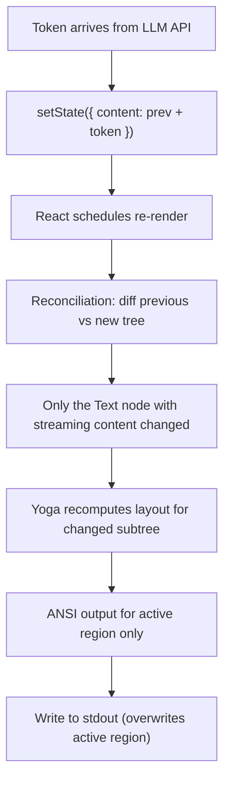

# TUI Frameworks for Streaming LLM Output

Deep comparison of terminal UI frameworks used by coding agents for streaming LLM output.
This document covers architecture, rendering models, streaming integration patterns,
real-world usage by coding agents, and code examples for each framework.

---

## 1. Ink (React for CLI)

### Architecture

Ink is a React renderer that targets the terminal instead of the DOM. It brings the
full power of React's component model — JSX, hooks, state management, reconciliation —
to command-line interfaces.

**Core stack:**
- **React reconciler**: Custom renderer using `react-reconciler` package
- **Yoga**: Facebook's cross-platform flexbox layout engine (compiled to WASM)
- **ANSI output**: Final render pass converts layout tree to ANSI escape codes
- **npm packages**: `ink` (renderer) + `react` (core) + `ink-*` (community components)

The rendering pipeline:
1. JSX components define a virtual tree
2. React reconciliation diffs previous vs. next tree
3. Changed nodes pass through Yoga for flexbox layout computation
4. Layout results (x, y, width, height) map to terminal cursor positions
5. ANSI escape codes produced for colors, styles, cursor movement
6. Final string written to stdout

### How React Rendering Works in a Terminal

React's reconciler is backend-agnostic. Ink provides a custom host config that maps
React operations to terminal concepts:

```
React Concept       → Terminal Equivalent
─────────────────────────────────────────
createElement       → Create terminal node (box, text)
appendChild         → Add child to parent's content
removeChild         → Remove from render tree
commitUpdate        → Mark node as needing re-render
commitTextUpdate    → Update text content
```

Key difference from ReactDOM: there is no persistent DOM. Each render cycle produces
a complete string that overwrites the terminal viewport. React's diffing minimizes
the *computation*, but the output is a full redraw of the "active" (non-static) region.

### Key Components

```jsx
// <Box> — Flexbox container (analogous to <div style="display:flex">)
<Box flexDirection="column" padding={1} borderStyle="round">
  <Text>Content inside a bordered box</Text>
</Box>

// <Text> — Styled text output
<Text color="green" bold>Success!</Text>
<Text backgroundColor="red" color="white"> ERROR </Text>
<Text dimColor italic>hint text</Text>

// <Static> — Freezes finalized content above live region
// This is THE critical component for streaming chat interfaces
<Static items={completedMessages}>
  {(msg, index) => (
    <Box key={index}>
      <Text color="cyan">{msg.role}: </Text>
      <Text>{msg.content}</Text>
    </Box>
  )}
</Static>

// <Newline /> — Explicit line break
// <Spacer /> — Flexible space (like flex:1)

// <Transform> — Modify children's output string
<Transform transform={(output) => output.toUpperCase()}>
  <Text>this becomes uppercase</Text>
</Transform>
```

### The `<Static>` Pattern — Why It Matters for Streaming

The `<Static>` component is Ink's killer feature for streaming interfaces. It works by:

1. Rendering items once at the top of the terminal output
2. Never re-rendering those items again (they "freeze" in place)
3. The "live" region below `<Static>` continues to update freely

This is critical because:
- Chat history grows indefinitely — re-rendering all of it each frame is expensive
- Only the currently-streaming message needs live updates
- Static content scrolls up naturally as new content appears

```jsx
const ChatInterface = () => {
  const [history, setHistory] = useState([]);
  const [streaming, setStreaming] = useState('');

  return (
    <Box flexDirection="column">
      {/* Completed messages — rendered once, frozen */}
      <Static items={history}>
        {(msg, i) => (
          <Box key={i} flexDirection="column" marginBottom={1}>
            <Text bold color={msg.role === 'user' ? 'blue' : 'green'}>
              {msg.role === 'user' ? '❯ ' : '⟡ '}
              {msg.role}
            </Text>
            <Text>{msg.content}</Text>
          </Box>
        )}
      </Static>

      {/* Currently streaming — re-renders on every token */}
      {streaming && (
        <Box flexDirection="column">
          <Text bold color="green">⟡ assistant</Text>
          <Text>{streaming}<Text color="gray">▊</Text></Text>
        </Box>
      )}
    </Box>
  );
};
```

### Hooks for Streaming

```jsx
// useInput — Keyboard input handling
useInput((input, key) => {
  if (key.escape) cancelStream();
  if (key.return) submitPrompt();
  if (key.tab && key.shift) cycleMode();
  if (input === 'y') confirmAction();
});

// useApp — Application lifecycle control
const { exit } = useApp();
// Call exit() to cleanly terminate the Ink application

// useStdin — Raw stdin access for advanced input
const { stdin, setRawMode } = useStdin();
useEffect(() => {
  setRawMode(true);
  return () => setRawMode(false);
}, []);

// useFocus / useFocusManager — Focus management for multi-widget UIs
const { isFocused } = useFocus();
const { focusNext, focusPrevious } = useFocusManager();

// Custom hook pattern for streaming
const useStreaming = (apiCall) => {
  const [tokens, setTokens] = useState('');
  const [isStreaming, setIsStreaming] = useState(false);
  const [error, setError] = useState(null);

  const startStream = useCallback(async (prompt) => {
    setIsStreaming(true);
    setTokens('');
    try {
      for await (const chunk of apiCall(prompt)) {
        setTokens(prev => prev + chunk.text);
      }
    } catch (e) {
      setError(e);
    } finally {
      setIsStreaming(false);
    }
  }, [apiCall]);

  return { tokens, isStreaming, error, startStream };
};
```

### Component Lifecycle in Streaming Context

The React component lifecycle maps to streaming as follows:



Performance characteristics:
- **O(n) in active region size**, not total history (thanks to `<Static>`)
- React batches rapid state updates (multiple tokens in one render cycle)
- Yoga layout is fast for simple structures (single column of text)
- Bottleneck is usually markdown rendering, not React/Ink

### Real-World Usage: Claude Code

Claude Code is the most complex Ink application in production:

```
Architecture:
├── Ink application (root)
│   ├── PermissionDialog — tool approval UI
│   ├── InlineDiff — side-by-side code diffs
│   ├── Spinner — animated thinking indicator
│   │   └── Custom verbs: "Thinking", "Analyzing", "Writing"...
│   ├── MarkdownRenderer — streaming markdown
│   ├── ToolResults — collapsible tool output
│   └── InputArea — user prompt entry
│
├── Keyboard handling:
│   ├── Esc → interrupt current generation
│   ├── Shift+Tab → cycle between modes
│   ├── Up/Down → input history navigation
│   └── Custom keybindings via config
│
└── State management:
    ├── Conversation history (moves to <Static>)
    ├── Active streaming content
    ├── Permission request queue
    └── Tool execution status
```

### Real-World Usage: Gemini CLI

```
packages/
├── core/           — UI-agnostic agent logic
│   ├── agent.ts    — LLM interaction, tool execution
│   └── types.ts    — shared interfaces
├── cli/
│   └── src/
│       └── ui/     — Ink components
│           ├── App.tsx
│           ├── ChatMessage.tsx
│           ├── StreamingContent.tsx
│           ├── ToolCallDisplay.tsx
│           └── theme.ts
└── Headless mode bypasses Ink entirely (CI/CD, piped output)
```

### Strengths

- Familiar React mental model — massive developer community
- Component composition and reuse
- Declarative UI: describe *what*, not *how*
- Rich ecosystem of React patterns and knowledge
- `<Static>` is uniquely powerful for streaming chat UIs
- Excellent TypeScript support
- Third-party Ink components: `ink-spinner`, `ink-text-input`, `ink-select-input`, `ink-table`, `ink-markdown`, `ink-link`, `ink-gradient`

### Weaknesses

- **Node.js dependency**: Cannot embed in Go/Rust agents without spawning a process
- **Startup time**: Node.js + React initialization adds 200-500ms
- **Memory**: Node.js baseline ~30-50MB, grows with conversation length
- **React overhead**: Reconciliation is overkill for simple streaming text
- **Complex state**: Deeply nested streaming requires careful memoization
- **Terminal quirks**: Some ANSI edge cases not handled by React's diffing

---

## 2. Bubble Tea (Go)

### Architecture — The Elm Architecture (TEA)

Bubble Tea implements The Elm Architecture (Model-View-Update) in Go:

```
                    ┌──────────┐
                    │  Model   │ (application state)
                    └────┬─────┘
                         │
              ┌──────────┴──────────┐
              ▼                     ▼
        ┌──────────┐         ┌──────────┐
        │  Update  │ ◄─ Msg ─│   View   │
        └────┬─────┘         └──────────┘
             │                     ▲
             │  returns            │ renders
             │  (Model, Cmd)       │ string
             └─────────────────────┘
```

**The cycle:**
1. **Model**: A Go struct holding all application state
2. **Update**: Receives a `tea.Msg`, returns new `Model` + optional `tea.Cmd`
3. **View**: Pure function that renders `Model` to a string
4. **Cmd**: Async I/O wrapped in a function that returns a `tea.Msg`

This is a purely functional architecture: Update and View have no side effects.
All external interactions happen through Commands.

### Message-Passing for State Management

```go
// All events arrive as tea.Msg (an empty interface)
type tea.Msg interface{}

// Built-in messages
type tea.KeyPressMsg   // keyboard input
type tea.MouseMsg      // mouse events
type tea.WindowSizeMsg // terminal resize

// Custom messages — any Go type
type StreamChunkMsg struct {
    Content string
    Done    bool
}

type ErrorMsg struct {
    Err error
}

type ToolResultMsg struct {
    ToolName string
    Output   string
}

// Commands: functions that perform I/O and return a Msg
func listenForChunks(sub chan StreamChunkMsg) tea.Cmd {
    return func() tea.Msg {
        chunk := <-sub
        return chunk
    }
}

// Batch: run multiple commands in parallel
cmd := tea.Batch(
    listenForChunks(chunkChan),
    tickEvery(time.Second),
    checkToolStatus(toolID),
)
```

### Streaming Integration Pattern

The standard pattern for streaming LLM output in Bubble Tea:

```go
package main

import (
    "strings"
    tea "github.com/charmbracelet/bubbletea/v2"
    "github.com/charmbracelet/lipgloss/v2"
)

// Messages
type streamChunkMsg string
type streamDoneMsg struct{}
type streamErrorMsg struct{ err error }

// Model
type model struct {
    content    strings.Builder
    streaming  bool
    err        error
    sub        chan string     // channel from LLM streaming goroutine
    width      int
    height     int
    history    []message
}

type message struct {
    role    string
    content string
}

// Commands
func waitForChunk(sub chan string) tea.Cmd {
    return func() tea.Msg {
        chunk, ok := <-sub
        if !ok {
            return streamDoneMsg{}
        }
        return streamChunkMsg(chunk)
    }
}

func startStream(prompt string, sub chan string) tea.Cmd {
    return func() tea.Msg {
        go func() {
            // Call LLM API, send chunks to channel
            stream, _ := callLLM(prompt)
            for chunk := range stream {
                sub <- chunk.Text
            }
            close(sub)
        }()
        return waitForChunk(sub)()
    }
}

// Update
func (m model) Update(msg tea.Msg) (tea.Model, tea.Cmd) {
    switch msg := msg.(type) {
    case tea.KeyPressMsg:
        switch msg.String() {
        case "ctrl+c", "q":
            return m, tea.Quit
        case "enter":
            if !m.streaming {
                m.sub = make(chan string)
                m.streaming = true
                m.content.Reset()
                return m, startStream("user prompt", m.sub)
            }
        }

    case streamChunkMsg:
        m.content.WriteString(string(msg))
        return m, waitForChunk(m.sub)

    case streamDoneMsg:
        m.streaming = false
        m.history = append(m.history, message{
            role:    "assistant",
            content: m.content.String(),
        })
        return m, nil

    case streamErrorMsg:
        m.err = msg.err
        m.streaming = false
        return m, nil

    case tea.WindowSizeMsg:
        m.width = msg.Width
        m.height = msg.Height
    }
    return m, nil
}

// View
func (m model) View() string {
    var s strings.Builder

    // Render history
    historyStyle := lipgloss.NewStyle().Foreground(lipgloss.Color("242"))
    for _, msg := range m.history {
        s.WriteString(historyStyle.Render(msg.role+": "+msg.content) + "\n\n")
    }

    // Render current streaming content
    if m.streaming {
        activeStyle := lipgloss.NewStyle().Foreground(lipgloss.Color("82"))
        s.WriteString(activeStyle.Render("assistant: " + m.content.String() + "▊"))
    }

    // Error display
    if m.err != nil {
        errStyle := lipgloss.NewStyle().Foreground(lipgloss.Color("196"))
        s.WriteString(errStyle.Render("Error: " + m.err.Error()))
    }

    return s.String()
}

func (m model) Init() (tea.Model, tea.Cmd) {
    return m, nil
}

func main() {
    p := tea.NewProgram(model{})
    if _, err := p.Run(); err != nil {
        panic(err)
    }
}
```

### Ecosystem — The Charm Stack

```
Bubble Tea          — TUI framework (Elm Architecture)
    ├── Bubbles     — Reusable components
    │   ├── viewport    — scrollable content area
    │   ├── textinput   — single-line text input
    │   ├── textarea    — multi-line text input
    │   ├── list        — filterable list with fuzzy search
    │   ├── table       — data table with sorting
    │   ├── spinner     — animated spinners (many styles)
    │   ├── progress    — progress bar
    │   ├── paginator   — page navigation
    │   ├── filepicker  — file selection
    │   ├── help        — keybinding help view
    │   ├── key         — keybinding definitions
    │   └── timer       — countdown timer
    │
    ├── Lip Gloss   — Declarative styling
    │   ├── Colors (ANSI256, TrueColor, Adaptive)
    │   ├── Borders (Normal, Rounded, Double, Thick, Hidden)
    │   ├── Padding, Margin
    │   ├── Alignment (Left, Center, Right, Top, Bottom)
    │   ├── Width, Height, MaxWidth, MaxHeight
    │   ├── Bold, Italic, Underline, Strikethrough
    │   ├── JoinHorizontal, JoinVertical
    │   └── Place (absolute positioning)
    │
    ├── Glamour     — Markdown rendering
    │   ├── Stylesheet-based (JSON styles)
    │   ├── Code syntax highlighting
    │   ├── Table rendering
    │   └── Multiple built-in themes (Dark, Light, Dracula, Tokyo Night)
    │
    ├── Harmonica   — Spring-based animations
    │   └── Smooth transitions for position, size
    │
    └── BubbleZone  — Mouse event zones
        └── Clickable regions mapped to components
```

### Real-World Usage: OpenCode

OpenCode is the most sophisticated Bubble Tea streaming agent:

```
internal/tui/
├── app.go              — Root Bubble Tea program
├── components/
│   ├── chat/           — Chat message rendering
│   │   ├── message.go  — Individual message component
│   │   └── stream.go   — Streaming message handler
│   ├── editor/         — Code editor widget
│   ├── dialog/         — Permission/confirmation dialogs
│   ├── status/         — Status bar
│   └── markdown/       — Glamour-based markdown
├── page/
│   ├── chat.go         — Main chat interface
│   ├── logs.go         — Log viewer
│   └── settings.go     — Configuration
├── layout/
│   └── layout.go       — Panel management
├── theme/
│   ├── catppuccin.go   — Catppuccin color scheme
│   └── theme.go        — Theme interface
├── image/
│   └── render.go       — Inline image rendering
└── styles/
    └── styles.go       — Lip Gloss style definitions

Data flow:
LLM API → SSE chunks → SQLite (persistence) → Broker[T] (pub/sub) → tea.Msg → Update → View
```

### Strengths

- **Single binary**: Go compiles to a standalone executable, no runtime needed
- **Elm Architecture**: Predictable, testable state management
- **Type-safe messages**: Go's type switch ensures exhaustive handling
- **Fast startup**: ~10ms cold start (vs 200-500ms for Node.js)
- **Low memory**: ~5-15MB baseline
- **Cell-based renderer**: Automatic color profile downsampling (TrueColor → ANSI256 → ANSI)
- **Excellent ecosystem**: Charm's tool suite is cohesive and well-maintained
- **Concurrency**: Go's goroutines + channels are natural for streaming

### Weaknesses

- **Go-only**: Cannot use from Python, Rust, or TypeScript projects
- **Less composable**: No component tree — nested models require manual wiring
- **Manual layout**: No built-in flexbox; use Lip Gloss joining or manual string building
- **Smaller ecosystem**: Fewer third-party components than React
- **View returns string**: All rendering is string concatenation (no structured output)
- **No incremental rendering**: Full View() called on every update

---

## 3. Ratatui (Rust)

### Architecture — Immediate-Mode Rendering

Ratatui uses an immediate-mode rendering model, fundamentally different from
React's retained-mode approach:

```
Retained Mode (Ink):           Immediate Mode (Ratatui):
─────────────────────          ──────────────────────────
Build component tree           App holds all state
React diffs tree               Each frame: render everything
Update changed nodes           No framework state to diff
Framework manages state        App manages state

Trade-off:                     Trade-off:
+ Automatic optimization       + Full control
+ Less code for updates        + No framework overhead
- Framework complexity          - More code for updates
- Hidden performance costs      - Must optimize manually
```

**The render loop:**
```
loop {
    // 1. Poll for events (keyboard, mouse, resize, custom)
    if let Some(event) = poll_event(timeout) {
        app.handle_event(event);
    }

    // 2. Render current state
    terminal.draw(|frame| {
        app.render(frame);
    })?;

    // 3. Check exit condition
    if app.should_quit {
        break;
    }
}
```

### Terminal Backend Abstraction

Ratatui supports multiple terminal backends:

```rust
// Crossterm (default, cross-platform)
use ratatui::backend::CrosstermBackend;
let backend = CrosstermBackend::new(stdout());

// Termion (Unix-only, lighter)
use ratatui::backend::TermionBackend;
let backend = TermionBackend::new(stdout());

// Termwiz (from wezterm, advanced features)
use ratatui::backend::TermwizBackend;
let backend = TermwizBackend::new()?;

// TestBackend (for unit testing!)
use ratatui::backend::TestBackend;
let backend = TestBackend::new(80, 24);
```

### Widget System

```rust
use ratatui::{
    layout::{Constraint, Layout, Rect},
    style::{Color, Modifier, Style},
    text::{Line, Span, Text},
    widgets::{Block, Borders, List, ListItem, Paragraph, Wrap},
    Frame,
};

// Built-in widgets
// ─────────────────
// Block        — Container with borders and title
// Paragraph    — Text with wrapping and scrolling
// List         — Scrollable list of items
// Table        — Data table with column headers
// Tabs         — Tab bar
// Gauge        — Progress bar
// Sparkline    — Mini chart
// BarChart     — Bar chart
// Canvas       — Freeform drawing (lines, rectangles, circles)
// Chart        — XY line/scatter chart
// Calendar     — Month calendar view
// Scrollbar    — Scrollbar indicator

// Layout system — constraint-based
let chunks = Layout::default()
    .direction(Direction::Vertical)
    .constraints([
        Constraint::Length(3),      // exact rows
        Constraint::Min(10),        // minimum rows
        Constraint::Percentage(20), // percentage of parent
        Constraint::Ratio(1, 4),    // ratio of parent
        Constraint::Fill(1),        // fill remaining space
    ])
    .split(frame.area());
```

### Streaming Integration with Tokio

```rust
use std::sync::mpsc;
use std::time::Duration;
use ratatui::{
    layout::{Constraint, Layout},
    style::{Color, Style},
    text::{Line, Span},
    widgets::{Block, Borders, Paragraph, Wrap},
    Frame, Terminal,
};

// Event types
enum AppEvent {
    Key(crossterm::event::KeyEvent),
    StreamChunk(String),
    StreamDone,
    StreamError(String),
    Tick,
}

struct App {
    content: String,
    streaming: bool,
    history: Vec<ChatMessage>,
    scroll_offset: u16,
    cursor_visible: bool,
}

struct ChatMessage {
    role: String,
    content: String,
}

impl App {
    fn handle_event(&mut self, event: AppEvent) {
        match event {
            AppEvent::StreamChunk(chunk) => {
                self.content.push_str(&chunk);
            }
            AppEvent::StreamDone => {
                self.streaming = false;
                self.history.push(ChatMessage {
                    role: "assistant".into(),
                    content: std::mem::take(&mut self.content),
                });
            }
            AppEvent::StreamError(err) => {
                self.streaming = false;
                self.content = format!("Error: {}", err);
            }
            AppEvent::Key(key) => {
                // handle keyboard input
            }
            AppEvent::Tick => {
                self.cursor_visible = !self.cursor_visible;
            }
        }
    }

    fn render(&self, frame: &mut Frame) {
        let chunks = Layout::default()
            .constraints([
                Constraint::Min(5),      // chat history
                Constraint::Length(3),    // streaming area
                Constraint::Length(3),    // input area
            ])
            .split(frame.area());

        // Render history
        let history_items: Vec<Line> = self.history.iter().flat_map(|msg| {
            let role_color = if msg.role == "user" { Color::Blue } else { Color::Green };
            vec![
                Line::from(Span::styled(
                    format!("{}:", msg.role),
                    Style::default().fg(role_color),
                )),
                Line::from(msg.content.as_str()),
                Line::from(""),
            ]
        }).collect();

        let history_widget = Paragraph::new(history_items)
            .block(Block::default().title("Chat").borders(Borders::ALL))
            .wrap(Wrap { trim: true })
            .scroll((self.scroll_offset, 0));
        frame.render_widget(history_widget, chunks[0]);

        // Render streaming content
        if self.streaming {
            let cursor = if self.cursor_visible { "▊" } else { " " };
            let streaming_text = format!("{}{}", self.content, cursor);
            let streaming_widget = Paragraph::new(streaming_text)
                .block(Block::default().title("Streaming...").borders(Borders::ALL))
                .style(Style::default().fg(Color::Green))
                .wrap(Wrap { trim: true });
            frame.render_widget(streaming_widget, chunks[1]);
        }

        // Input area
        let input = Paragraph::new("❯ Type your message...")
            .block(Block::default().title("Input").borders(Borders::ALL))
            .style(Style::default().fg(Color::DarkGray));
        frame.render_widget(input, chunks[2]);
    }
}
```

### Real-World Usage: Codex CLI (codex-rs)

```
codex-rs/
├── tui/                    — Ratatui-based terminal interface
│   ├── src/
│   │   ├── app.rs          — Main application state + render loop
│   │   ├── event.rs        — Event handling (keyboard + stream events)
│   │   ├── render.rs       — Widget rendering functions
│   │   └── widgets/        — Custom widget implementations
│   └── Cargo.toml
│
├── core/                   — Agent core (shared across all frontends)
│   ├── src/
│   │   ├── event_queue.rs  — EventMsg types consumed by all frontends
│   │   └── submit_queue.rs — SQ: commands sent to agent
│   └── Cargo.toml
│
├── exec/                   — Non-interactive mode (JSONL output)
│   └── Simpler event processor, no TUI
│
└── Architecture:
    Submit Queue (SQ) ──→ Agent Core ──→ Event Queue (EQ)
                                              │
                           ┌──────────────────┼──────────────┐
                           ▼                  ▼              ▼
                        TUI (Ratatui)    Exec (JSONL)    MCP Server
                                                         App Server (IDE)

    Same EventMsg types power ALL frontends.
    TUI is just one consumer of the Event Queue.
```

### Strengths

- **Zero-cost abstractions**: Rust's performance with no runtime overhead
- **Memory safety**: Guaranteed by the compiler, no GC pauses
- **Same binary as core**: No FFI boundary between agent and TUI
- **Fine-grained control**: Every pixel is explicitly placed
- **TestBackend**: Unit test your rendering with snapshot tests
- **Active community**: 40k+ GitHub stars, frequent releases
- **Multiple backends**: Crossterm, Termion, Termwiz
- **Tiny binary**: Static linking, no runtime dependencies

### Weaknesses

- **Steep learning curve**: Rust ownership + immediate-mode paradigm
- **Manual state management**: No framework handles state for you
- **No built-in flexbox**: Constraint-based layout is less intuitive
- **Full redraw per frame**: Can be expensive for complex UIs (mitigated by double buffering)
- **Less mature widget ecosystem**: Fewer ready-made components
- **Verbose**: More boilerplate than declarative frameworks

---

## 4. Textual (Python)

### Architecture

Textual is an async-first TUI framework for Python, built on top of the Rich library.
It provides a DOM-like component model with CSS-like styling.

```
Textual Architecture:
├── App (root)
│   ├── Screen (container, like a page)
│   │   ├── Widget (component)
│   │   │   ├── Widget (nested)
│   │   │   └── Widget
│   │   └── Widget
│   └── CSS (Textual CSS stylesheets)
│
├── Message passing (events bubble up, actions push down)
├── Reactive attributes (automatic re-render on change)
├── Async-first (built on asyncio)
└── Rich renderables for content
```

### CSS for Terminals (TCSS)

```css
/* styles.tcss */
Screen {
    layout: grid;
    grid-size: 2 3;
    grid-gutter: 1;
}

#chat-history {
    column-span: 2;
    row-span: 2;
    border: solid green;
    overflow-y: auto;
}

#input-area {
    column-span: 2;
    border: solid blue;
    height: 3;
}

.message {
    margin: 1 0;
    padding: 0 1;
}

.message.user {
    background: $surface;
    color: $text;
}

.message.assistant {
    background: $primary-background;
    color: $primary;
}

/* Pseudo-classes */
Button:hover {
    background: $accent;
}

Button:focus {
    border: double $secondary;
}
```

### Streaming Chat Example

```python
from textual.app import App, ComposeResult
from textual.containers import VerticalScroll, Horizontal
from textual.widgets import Header, Footer, Input, Static, Markdown
from textual.reactive import reactive
from textual.message import Message
import asyncio


class ChatMessage(Static):
    """A single chat message widget."""

    def __init__(self, role: str, content: str = "") -> None:
        super().__init__()
        self.role = role
        self._content = content

    def compose(self) -> ComposeResult:
        yield Markdown(self._content, id="content")

    def append_content(self, text: str) -> None:
        """Append streaming content."""
        self._content += text
        self.query_one("#content", Markdown).update(self._content)


class StreamingChat(App):
    """A streaming chat TUI built with Textual."""

    CSS = """
    #chat-scroll {
        height: 1fr;
        border: solid $primary;
        padding: 1;
    }
    #input {
        dock: bottom;
        height: 3;
        border: solid $secondary;
    }
    .user-message {
        background: $surface;
        margin: 1 0;
        padding: 0 1;
    }
    .assistant-message {
        background: $primary-background;
        margin: 1 0;
        padding: 0 1;
    }
    """

    BINDINGS = [
        ("ctrl+c", "quit", "Quit"),
        ("ctrl+l", "clear", "Clear"),
        ("escape", "cancel", "Cancel"),
    ]

    streaming: reactive[bool] = reactive(False)

    def compose(self) -> ComposeResult:
        yield Header()
        yield VerticalScroll(id="chat-scroll")
        yield Input(placeholder="Type your message...", id="input")
        yield Footer()

    async def on_input_submitted(self, event: Input.Submitted) -> None:
        if self.streaming:
            return
        prompt = event.value
        event.input.value = ""

        scroll = self.query_one("#chat-scroll")

        # Add user message
        user_msg = ChatMessage("user", prompt)
        user_msg.add_class("user-message")
        await scroll.mount(user_msg)

        # Add assistant message (empty, will stream into it)
        assistant_msg = ChatMessage("assistant")
        assistant_msg.add_class("assistant-message")
        await scroll.mount(assistant_msg)

        # Start streaming
        self.streaming = True
        asyncio.create_task(self._stream_response(prompt, assistant_msg))

    async def _stream_response(
        self, prompt: str, widget: ChatMessage
    ) -> None:
        try:
            async for chunk in call_llm_async(prompt):
                widget.append_content(chunk.text)
                self.query_one("#chat-scroll").scroll_end()
        except Exception as e:
            widget.append_content(f"\n\n**Error:** {e}")
        finally:
            self.streaming = False

    def action_cancel(self) -> None:
        # Cancel ongoing stream
        self.streaming = False


if __name__ == "__main__":
    app = StreamingChat()
    app.run()
```

### Strengths

- **Async-first**: Direct integration with async LLM streaming APIs
- **CSS theming**: Familiar styling model, hot-reloadable
- **Rich integration**: Markdown, syntax highlighting, tables built-in
- **Python ecosystem**: Access to all Python ML/AI libraries
- **DOM-like model**: Intuitive for web developers
- **Built-in widgets**: Button, DataTable, Tree, DirectoryTree, TextArea, RichLog
- **DevTools**: Built-in CSS inspector and console

### Weaknesses

- **Python only**: Cannot use from Go/Rust projects
- **Performance**: Slower than compiled alternatives for high-frequency updates
- **Asyncio complexity**: Debugging async issues can be challenging
- **Memory**: Python's memory overhead is higher than Go/Rust
- **Less battle-tested**: Fewer production coding agents use it

---

## 5. Rich (Python)

### Not a Full TUI But Excellent for Streaming Output

Rich is a Python library for rich text formatting in the terminal. It's not a full
TUI framework (no input handling, no layout management), but its `Live` display
is excellent for streaming LLM output.

### Key Features for Streaming

```python
from rich.console import Console
from rich.live import Live
from rich.markdown import Markdown
from rich.panel import Panel
from rich.spinner import Spinner
from rich.progress import Progress, SpinnerColumn, TextColumn
from rich.syntax import Syntax
from rich.table import Table
from rich.tree import Tree

console = Console()

# Pattern 1: Live streaming markdown
def stream_with_markdown(prompt: str) -> None:
    content = ""
    with Live(
        Markdown(content),
        console=console,
        auto_refresh=True,
        refresh_per_second=15,
        vertical_overflow="visible",
    ) as live:
        for chunk in call_llm(prompt):
            content += chunk.text
            live.update(Markdown(content))

# Pattern 2: Spinner while thinking
with console.status("[bold green]Thinking...", spinner="dots"):
    response = call_llm_sync(prompt)
console.print(Markdown(response))

# Pattern 3: Multi-step progress
with Progress(
    SpinnerColumn(),
    TextColumn("[progress.description]{task.description}"),
    console=console,
) as progress:
    task1 = progress.add_task("Analyzing code...", total=None)
    # ... do analysis
    progress.update(task1, description="Generating response...")
    # ... generate
    progress.update(task1, description="Done!")

# Pattern 4: Formatted output
console.print(Panel(
    Markdown(response),
    title="[bold blue]Assistant",
    border_style="green",
    padding=(1, 2),
))

# Pattern 5: Syntax-highlighted code blocks
console.print(Syntax(
    code_string,
    "python",
    theme="monokai",
    line_numbers=True,
))
```

### Used By

- **Aider**: Rich-based output formatting with markdown rendering
- Various Python CLI agents for formatted, colored output
- Often paired with `prompt_toolkit` for input handling

### Strengths

- **Simple API**: Minimal code for beautiful output
- **Excellent markdown**: Best-in-class terminal markdown rendering
- **No TUI complexity**: No event loop, no state management
- **Composable renderables**: Nest panels, tables, trees, markdown
- **Live display**: Real-time updates perfect for streaming
- **Widely adopted**: Most popular Python terminal formatting library

### Weaknesses

- **Not interactive**: No input handling (pair with prompt_toolkit or Textual)
- **No layout system**: Linear top-to-bottom output only
- **Python only**: Not available in other languages
- **Flicker**: Live updates can flicker on some terminals at high refresh rates
- **No scrollback**: Cannot scroll up through Live display content

---

## 6. prompt_toolkit (Python)

### Input/Output Library for Python CLIs

prompt_toolkit is not a full TUI framework but provides powerful terminal input
handling. It's the library behind IPython and many Python REPLs.

```python
from prompt_toolkit import PromptSession
from prompt_toolkit.history import FileHistory
from prompt_toolkit.auto_suggest import AutoSuggestFromHistory
from prompt_toolkit.lexers import PygmentsLexer
from prompt_toolkit.completion import WordCompleter
from prompt_toolkit.formatted_text import HTML
from prompt_toolkit.styles import Style

# Styled prompt with history and auto-suggestion
style = Style.from_dict({
    'prompt': '#00aa00 bold',
    'input': '#ffffff',
})

completer = WordCompleter(['/help', '/clear', '/exit', '/model'])

session = PromptSession(
    history=FileHistory('.chat_history'),
    auto_suggest=AutoSuggestFromHistory(),
    completer=completer,
    style=style,
)

while True:
    user_input = session.prompt(
        HTML('<prompt>❯ </prompt>'),
        multiline=False,
    )
    # Process input...
```

### Used By

- **Aider**: prompt_toolkit for input, Rich for output
- IPython / Jupyter console
- AWS CLI, Azure CLI
- Many Python REPL-style applications

---

## 7. Comprehensive Comparison

### Feature Matrix

```
┌────────────────┬──────────────┬──────────────┬──────────────┬──────────────┬──────────────┐
│ Feature        │ Ink          │ Bubble Tea   │ Ratatui      │ Textual      │ Rich         │
├────────────────┼──────────────┼──────────────┼──────────────┼──────────────┼──────────────┤
│ Language       │ TypeScript   │ Go           │ Rust         │ Python       │ Python       │
│ Architecture   │ React tree   │ Elm (MVU)    │ Immediate    │ Async DOM    │ Renderable   │
│ Rendering      │ VDOM diff    │ Cell-based   │ Full redraw  │ DOM-like     │ Print-based  │
│ Layout         │ Flexbox/Yoga │ Lip Gloss    │ Constraints  │ CSS Grid     │ None         │
│ Styling        │ Props        │ Lip Gloss    │ Style struct │ TCSS files   │ Inline       │
│ State Mgmt     │ React hooks  │ Msg passing  │ Manual       │ Reactive     │ None         │
│ Input          │ useInput     │ Msg dispatch │ Event poll   │ Widget msgs  │ None         │
│ Streaming      │ State→render │ Msg→update   │ Chan→redraw  │ Async events │ Live.update  │
│ Interactive    │ Yes          │ Yes          │ Yes          │ Yes          │ No           │
│ Markdown       │ ink-markdown │ Glamour      │ Manual/3rd   │ Rich/builtin │ Excellent    │
│ Performance    │ Medium       │ High         │ Very High    │ Medium       │ High         │
│ Memory (base)  │ ~40MB        │ ~10MB        │ ~5MB         │ ~30MB        │ ~20MB        │
│ Startup        │ ~300ms       │ ~10ms        │ ~5ms         │ ~200ms       │ ~100ms       │
│ Binary         │ N/A (Node)   │ Small        │ Very Small   │ N/A (Python) │ N/A (Python) │
│ Community      │ Very Large   │ Large        │ Large        │ Medium       │ Very Large   │
│ Learning Curve │ Low*         │ Medium       │ High         │ Medium       │ Low          │
│ Testing        │ ink-testing  │ teatest      │ TestBackend  │ pilot        │ Console cap  │
│ Stars (approx) │ 28k          │ 30k          │ 40k          │ 25k          │ 50k          │
└────────────────┴──────────────┴──────────────┴──────────────┴──────────────┴──────────────┘
* Low if you already know React
```

### Streaming-Specific Comparison

```
┌─────────────────────────┬─────────┬────────────┬─────────┬─────────┬──────┐
│ Streaming Feature       │ Ink     │ Bubble Tea │ Ratatui │ Textual │ Rich │
├─────────────────────────┼─────────┼────────────┼─────────┼─────────┼──────┤
│ Incremental updates     │ ✓ VDOM  │ ✓ Cells    │ ✗ Full  │ ✓ DOM   │ ✓    │
│ Frozen history          │ ✓ Static│ ✗ Manual   │ ✗ Manual│ ✓ Mount │ ✗    │
│ Token-level granularity │ ✓       │ ✓          │ ✓       │ ✓       │ ✓    │
│ Concurrent streams      │ ✓       │ ✓ Batch    │ ✓ Tokio │ ✓ Async │ ✗    │
│ Markdown mid-stream     │ ✓       │ ✓ Glamour  │ Manual  │ ✓       │ ✓    │
│ Scroll during stream    │ Manual  │ ✓ Viewport │ ✓       │ ✓       │ ✗    │
│ Cancel stream (UX)      │ ✓ Esc   │ ✓ KeyMsg   │ ✓ Event │ ✓ Bind  │ ✗    │
│ Backpressure handling   │ React   │ Channel    │ Channel │ Async   │ N/A  │
└─────────────────────────┴─────────┴────────────┴─────────┴─────────┴──────┘
```

### Agent Adoption

```
┌──────────────────────┬──────────────┬─────────────────────────────────┐
│ Coding Agent         │ Framework    │ Notes                           │
├──────────────────────┼──────────────┼─────────────────────────────────┤
│ Claude Code          │ Ink          │ Complex component tree          │
│ Gemini CLI           │ Ink          │ Separate core/UI packages       │
│ GitHub Copilot CLI   │ Ink          │ Ink-based interface             │
│ OpenCode             │ Bubble Tea   │ SQLite-backed streaming         │
│ Codex CLI (codex-rs) │ Ratatui      │ SQ/EQ architecture             │
│ Aider                │ Rich + p_t   │ Rich output, prompt_toolkit in  │
│ Cursor (terminal)    │ Ink          │ VS Code extension + terminal    │
│ Continue (terminal)  │ Ink          │ VS Code extension + terminal    │
│ Warp AI              │ Custom Rust  │ GPU-accelerated terminal        │
│ Amazon Q CLI         │ Ink          │ AWS ecosystem integration       │
└──────────────────────┴──────────────┴─────────────────────────────────┘
```

---

## 8. Framework Selection Guide

### Decision Tree

```
What language is your agent written in?
│
├── TypeScript/Node.js
│   └── Use Ink
│       ├── Need complex interactive UI? → Full Ink app
│       └── Need simple streaming output? → Ink with <Static>
│
├── Go
│   └── Use Bubble Tea
│       ├── Need rich components? → Bubble Tea + Bubbles + Lip Gloss
│       └── Need simple output? → Bubble Tea minimal or raw terminal
│
├── Rust
│   └── Use Ratatui
│       ├── Need cross-platform? → Crossterm backend
│       └── Need Unix performance? → Termion backend
│
├── Python
│   ├── Need full TUI with interactivity? → Textual
│   ├── Need formatted streaming output? → Rich + Live
│   └── Need input handling only? → prompt_toolkit
│
└── Multi-language / Custom
    └── Consider raw ANSI or a thin abstraction layer
```

### Key Trade-offs

**Ink** is best when:
- Team knows React
- Complex UI needed (dialogs, diffs, permissions)
- Node.js is already part of the stack
- Developer velocity matters more than binary size

**Bubble Tea** is best when:
- Single-binary distribution is important
- Predictable state management is valued
- Agent is written in Go
- Low resource usage matters (embedded, CLI tools)

**Ratatui** is best when:
- Maximum performance is needed
- Agent core is in Rust (same binary, no FFI)
- Fine-grained rendering control is required
- Memory safety is a hard requirement

**Textual** is best when:
- Python is the agent language
- CSS-like theming is desired
- Async streaming is the primary pattern
- Rapid prototyping is valued

**Rich** is best when:
- No interactivity needed
- Beautiful output with minimal code
- Streaming markdown is the main use case
- Adding TUI to existing Python CLI

---

## 9. Advanced Patterns

### Universal Streaming Architecture

Regardless of framework, the streaming pattern follows this shape:

```
LLM API (SSE/WebSocket)
    │
    ▼
Transport Layer (HTTP client, SDK)
    │
    ▼
Chunk Buffer / Channel / AsyncIterator
    │
    ├── Persistence (optional: SQLite, file)
    │
    ▼
Framework Event System
    │
    ├── Ink: setState() → React reconciliation → ANSI
    ├── Bubble Tea: tea.Msg → Update() → View() → cells
    ├── Ratatui: channel recv → handle_event() → render() → ANSI
    ├── Textual: async event → widget.update() → DOM diff → ANSI
    └── Rich: Live.update() → renderable → ANSI
    │
    ▼
Terminal (stdout)
```

### Markdown Rendering During Streaming

A key challenge: rendering markdown while tokens are still arriving.

```
Approaches:
1. Re-render full markdown on each token (Rich, Textual)
   + Correct rendering at all times
   - Expensive for long content
   
2. Render completed blocks, raw text for current block (Glamour)
   + Efficient: only re-parse current paragraph
   - Brief flash when block completes and re-renders
   
3. Incremental markdown parser (custom)
   + Most efficient
   - Complex to implement correctly
   - Must handle partial code blocks, lists, etc.

4. Hybrid: buffer tokens, render on sentence/paragraph boundaries
   + Good balance of correctness and performance
   - Slight latency in display
```

### Handling Tool Calls in Streaming UI

When an LLM invokes tools mid-stream, the UI must:

```
1. Pause text rendering
2. Show tool invocation (name, arguments)
3. Show tool execution status (spinner/progress)
4. Display tool result (possibly collapsible)
5. Resume text rendering

Framework patterns:
- Ink: <ToolCallComponent> with state machine (pending→running→done)
- Bubble Tea: ToolCallMsg → switch on status in Update
- Ratatui: ToolCall variant in EventMsg, render widget based on state
- Textual: ToolCallWidget with reactive status attribute
```

---

## 10. Summary

The TUI framework landscape for coding agents has converged on a few clear winners,
each dominating their language ecosystem:

- **Ink** dominates the TypeScript/Node.js space and is the most popular choice
  overall, used by Claude Code, Gemini CLI, GitHub Copilot CLI, and others.
  Its React model and `<Static>` component make it uniquely suited for chat UIs.

- **Bubble Tea** is the clear choice for Go agents, with OpenCode as the most
  sophisticated example. The Elm Architecture provides clean state management for
  streaming, and the Charm ecosystem (Lip Gloss, Glamour, Bubbles) is excellent.

- **Ratatui** serves the Rust ecosystem, used by Codex CLI. Its immediate-mode
  rendering gives maximum control and performance, at the cost of more manual work.

- **Rich + Textual** serve the Python ecosystem. Rich is excellent for streaming
  output with minimal complexity; Textual adds full TUI capabilities when needed.

The choice of framework is primarily driven by the agent's implementation language,
with secondary considerations around UI complexity, performance requirements, and
team familiarity.
