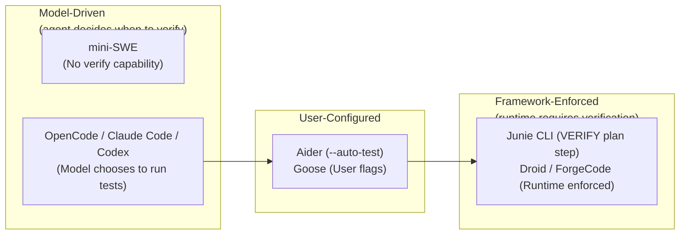
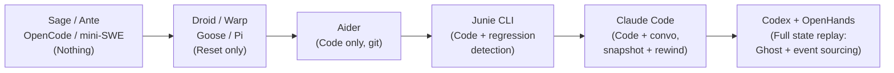
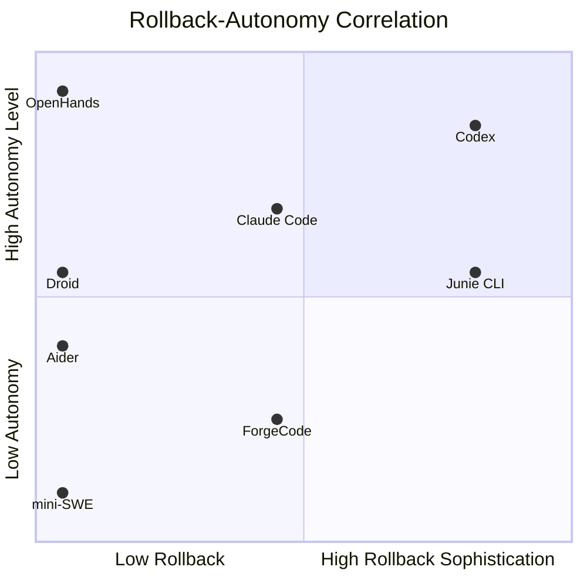
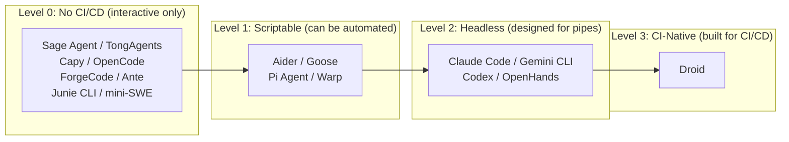
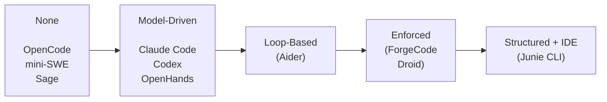
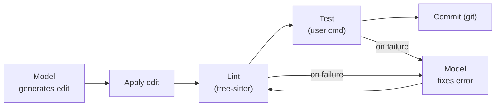
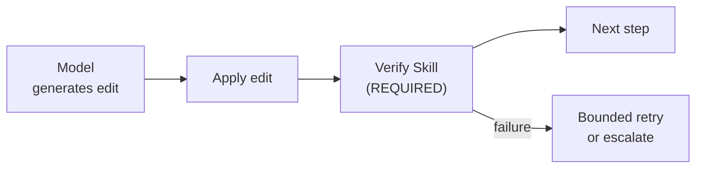
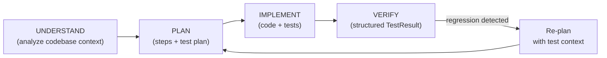
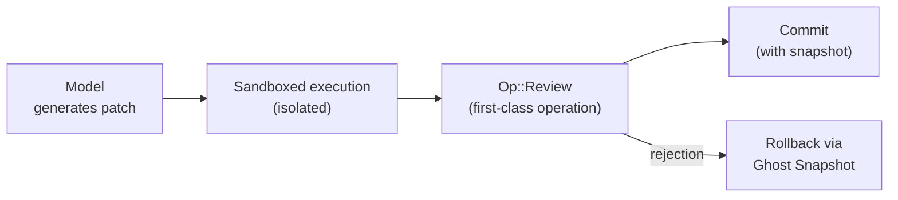
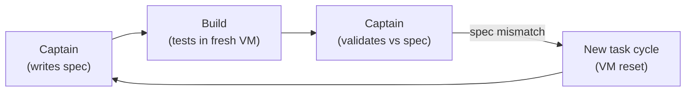

# Agent Comparison: Testing and Verification

Synthesized from studying 17 coding agents: ForgeCode, Claude Code, Codex, Droid, Ante, OpenCode, OpenHands, Warp, Gemini CLI, Goose, Junie CLI, mini-SWE-agent, Pi Coding Agent, Aider, Sage Agent, TongAgents, and Capy.

This document compares how every agent in the research corpus approaches the hardest problem in autonomous coding: **knowing whether the code it wrote actually works**. The analysis is based on source-level reading of each agent's core loop, tool system, and architecture files — not marketing materials or documentation claims.

Three observations frame the entire comparison:

1. **Verification is the differentiator** — most agents can generate plausible code. The gap between good and great agents is almost entirely about what happens *after* generation: testing, linting, type checking, build verification, self-review, and rollback.
2. **Enforced verification outperforms prompted verification** — agents that structurally *require* verification steps (ForgeCode, Junie CLI, Droid) produce more reliable output than agents that rely on the model to *choose* to verify (Claude Code, Codex, OpenHands).
3. **Rollback sophistication correlates with autonomous capability** — the more safely an agent can undo its own mistakes, the more aggressively it can operate without human supervision.

The agents span from zero-verification research prototypes (mini-SWE-agent, Sage Agent) to multi-layered verification pipelines (Junie CLI, ForgeCode) with structured test results, IDE-level inspections, and regression detection.

---

## 1. Master Comparison Table

This is the central reference for the entire testing-and-verification concept area. Every column represents one dimension of verification capability; every row is one of the 17 agents.

**Reading the table:**

- **Auto-Test**: How the agent runs tests. "Shell" means it shells out to `pytest`, `npm test`, etc. "Built-in" means the agent has dedicated test infrastructure. "None" means the agent has no test-running capability.
- **Auto-Lint**: Whether the agent can run linters automatically. "Built-in" means the agent ships with lint tooling (e.g., Aider's tree-sitter linter). "Shell" means it shells out to user-configured linters.
- **Type Checking**: How static type information is used. "LSP" means full language-server integration. "Shell" means running `tsc`, `mypy`, etc. via shell.
- **Build Verification**: How the agent confirms that code compiles/builds.
- **Self-Review**: Whether the agent reviews its own output before presenting to the user. "Model decides" means the LLM chooses whether to review. "Enforced" means the runtime requires it. "Dedicated agent" means a separate agent performs review.
- **Rollback Strategy**: How the agent undoes bad changes.
- **CI/CD Integration**: How the agent integrates with continuous integration pipelines.
- **Verification Philosophy**: The overarching approach — model-driven, framework-enforced, user-configured, or minimal.

### Tier 1 Agents

| Agent | Auto-Test | Auto-Lint | Type Check | Build Verify | Self-Review | Rollback | CI/CD | Philosophy |
|-------|-----------|-----------|------------|-------------|-------------|----------|-------|------------|
| ForgeCode | Shell via Forge agent | No built-in | No | Shell | **Enforced** — runtime requires verify skill | `max_tool_failure_per_turn` bounded | Non-interactive mode | Framework-enforced |
| Claude Code | Bash tool | Bash tool | LSP plugin | Bash tool | Model decides (dramatic perf gain with criteria) | File snapshots + `/rewind` | `claude-code-action`, headless `-p` | Model-driven |
| Codex | Sandboxed shell | Shell | No | Cargo + Bazel | `Op::Review` first-class operation | `GhostSnapshot` + `ThreadRollback` | `exec` mode / `exec-server` | Model-driven |
| Droid | Loop step | No built-in | No | No built-in | **Auto-review loop** — path-specific guidelines | No | First-class CI/CD, `.droid.yaml` | Framework-enforced |
| Ante | Shell tool | Shell tool | No | Cargo (sub-agent self-correct) | Meta-agent synthesis verification | No | No | Model-driven |
| OpenCode | Shell | No | No | No | No | No | No | Minimal |
| OpenHands | `CmdRunAction` in Docker | No built-in | No | Shell in sandbox | Error self-correction loop | **Event sourcing** — full state reconstruction | REST/WebSocket, resolver | Model-driven |

### Tier 2 Agents

| Agent | Auto-Test | Auto-Lint | Type Check | Build Verify | Self-Review | Rollback | CI/CD | Philosophy |
|-------|-----------|-----------|------------|-------------|-------------|----------|-------|------------|
| Warp | Shell (block model) | No | No | Shell | Inline diff annotations | No | Permission mode | Model-driven |
| Gemini CLI | `run_shell_command` | VS Code companion | VS Code diagnostics | Shell | No explicit | Checkpoints in plan mode | `gemini-cli-action`, headless | Model-driven |
| Goose | MCP extensions | No | No | Extension-based | No | `initial_messages` reset | Recipe mode | User-configured |
| Junie CLI | **First-class** — structured `TestResult` | If available | IDE inspections (PSI tree) | IDE build API / shell | Structured VERIFY plan step | Git + regression detection | No | Framework-enforced |
| mini-SWE-agent | Shell | No | No | No | No | No | Benchmark eval | Minimal |
| Pi Coding Agent | Extension or manual | Extension | No | Extension | No | Extension | JSON mode | User-configured |
| Aider | **`--auto-test`** dedicated flag | **`--auto-lint`** built-in tree-sitter + custom | Via `lint-cmd` | Via `test-cmd` | Lint→test loop with bounded retries | Git `/undo` | Benchmark mode | User-configured |

### Tier 3 Agents

| Agent | Auto-Test | Auto-Lint | Type Check | Build Verify | Self-Review | Rollback | CI/CD | Philosophy |
|-------|-----------|-----------|------------|-------------|-------------|----------|-------|------------|
| Sage Agent | No | No | No | No | Planned | No | No | Minimal |
| TongAgents | Verify step | No | No | No | **Dedicated Verifier agent** | Max iterations | No | Model-driven |
| Capy | Build agent runs | No | No | VM-based | Captain validates spec; Build verifies | New task cycle (VM destroyed) | No | Minimal |

---

## 2. Verification Philosophy Spectrum

The most fundamental distinction in how agents approach verification is whether the *model* decides to verify, the *framework* requires it, or the *user* configures it.



### Why This Spectrum Matters

The spectrum predicts **reliability under pressure**. When tasks are easy, all agents behave similarly — the model generates correct code on the first try, and verification is irrelevant. When tasks are hard:

- **Model-driven agents** (left side) degrade gracefully but unpredictably. The model might forget to test, or decide testing isn't needed, or hallucinate test results.
- **Framework-enforced agents** (right side) maintain consistent behavior regardless of task difficulty. The runtime ensures every change is verified, even when the model would skip it.

The trade-off: framework-enforced verification is slower and may run unnecessary checks on trivial changes. ForgeCode's approach — requiring verification via a dedicated skill — adds latency to every edit cycle. Claude Code's approach — letting the model decide — is faster on average but has a higher variance in output quality.

**Key Observation:** ForgeCode's source code reveals the strongest version of this insight. The `verify` skill is not optional — the runtime will not proceed past a code change without it. This is enforcement at the architecture level, not the prompt level.

---

## 3. Testing Sophistication Ranking

Ranked from most to least sophisticated testing infrastructure, based on source-level analysis:

### Tier S: First-Class Testing

| Rank | Agent | Key Capabilities | Evidence |
|------|-------|-----------------|----------|
| 1 | **Junie CLI** | Structured `TestResult` type; IDE-level test integration; regression detection; VERIFY as a plan phase; test results inform next planning cycle | Kotlin `TestResult` data class with pass/fail/error states; PSI tree inspection for IDE-level code understanding |
| 2 | **Aider** | Dedicated `--auto-test` flag; built-in tree-sitter linter; custom `--lint-cmd` / `--test-cmd`; bounded retry loop (lint→fix→test→fix) | Python codebase with explicit `Linter` class using tree-sitter; `--auto-test` triggers test suite after every edit |
| 3 | **ForgeCode** | Enforced verification skill; runtime refuses to proceed without verify step; test execution via shell through Forge agent | Python agent framework; `verify` is a registered skill that the runtime invokes, not a suggestion |

### Tier A: Capable Testing

| Rank | Agent | Key Capabilities | Evidence |
|------|-------|-----------------|----------|
| 4 | **Claude Code** | Bash-based test execution; model-driven test selection; file snapshots for rollback on test failure; dramatic performance improvement when test criteria are specified | TypeScript; Bash tool executes arbitrary test commands; `/rewind` restores snapshots |
| 5 | **Droid** | Auto-review loop with path-specific guidelines; CI repair — can fix failing CI pipelines; test execution as a loop step | TypeScript; `.droid.yaml` configuration; tight GitHub Actions integration |
| 6 | **Codex** | Sandboxed test execution; `Op::Review` as first-class operation; `GhostSnapshot` for rollback; supports Cargo, Bazel, and arbitrary test frameworks | Rust; `Op::Review` variant in the operation enum; sandbox prevents test side effects |

### Tier B: Shell-Based Testing

| Rank | Agent | Key Capabilities | Evidence |
|------|-------|-----------------|----------|
| 7 | **OpenHands** | `CmdRunAction` runs tests in Docker sandbox; error self-correction loop retries on failure; event sourcing enables full replay | Python; Action/Observation event stream; Docker isolation for test execution |
| 8 | **Ante** | Shell tool for test execution; Cargo-based build verification; sub-agent self-correction when builds fail | Rust; meta-agent delegates build/test to specialized sub-agents |
| 9 | **Gemini CLI** | `run_shell_command` for tests; VS Code companion provides diagnostics; checkpoints in plan mode | TypeScript; shell-based test execution with optional IDE integration |
| 10 | **Warp** | Shell execution in block model; inline diff annotations for review; terminal-native output | Proprietary; block-based terminal captures test output inline |
| 11 | **Capy** | Build agent runs tests inside Ubuntu VM; Captain agent validates spec compliance; VM destroyed between cycles | Python; VM isolation ensures clean test environment every cycle |
| 12 | **TongAgents** | Dedicated Verifier agent in multi-agent pipeline; max iteration bounds prevent infinite loops | Python; multi-agent architecture with explicit Verifier role |

### Tier C: Minimal or No Testing

| Rank | Agent | Key Capabilities | Evidence |
|------|-------|-----------------|----------|
| 13 | **Goose** | MCP extensions can provide test tooling; no built-in test infrastructure; `initial_messages` reset for recovery | Rust; test capability depends entirely on which MCP servers are configured |
| 14 | **Pi Coding Agent** | Extension-based testing; no built-in test runner; extensible architecture could support testing | Python; minimal core with extension points |
| 15 | **OpenCode** | Shell access for running tests; no built-in test infrastructure; no verification loop | Go; `Tool` interface can execute test commands but nothing coordinates it |
| 16 | **mini-SWE-agent** | Shell access only; no test infrastructure; designed for benchmark evaluation, not production | Python; ~200-line agent with bash as only tool |
| 17 | **Sage Agent** | No test capability; verification is listed as planned future work | Python; early-stage agent focused on core loop |

---

## 4. Rollback Sophistication Ranking

Rollback — the ability to undo bad changes — is critical for autonomous operation. An agent that can't undo its mistakes must be supervised more closely.



### Detailed Rollback Comparison

| Rank | Agent | Strategy | What's Rolled Back | Granularity | Evidence |
|------|-------|----------|--------------------|-------------|----------|
| 1 | **OpenHands** | Event sourcing | Full agent state — actions, observations, environment | Per-event | Events are first-class objects; any state can be reconstructed by replaying the event stream from any checkpoint |
| 2 | **Codex** | `GhostSnapshot` + `ThreadRollback` | Code state + conversation thread | Per-operation | `GhostSnapshot` captures file system state; `ThreadRollback` undoes conversation history; both are first-class operations in the Rust codebase |
| 3 | **Claude Code** | File snapshots + `/rewind` | Code files + conversation position | Per-turn | File snapshots taken before destructive operations; `/rewind` command lets user roll back to any previous turn |
| 4 | **Aider** | Git-based `/undo` | Code changes only | Per-commit | Each edit cycle creates a git commit; `/undo` reverts the last commit; conversation history is not rolled back |
| 5 | **Junie CLI** | Git + regression detection | Code changes + test regression awareness | Per-change | Git-based rollback plus structured awareness of which tests regressed — the agent knows *why* it needs to roll back |
| 6 | **Gemini CLI** | Checkpoints in plan mode | Code state at plan boundaries | Per-plan-step | Shadow git branch tracks changes; checkpoints let user return to any plan step |
| 7 | **Goose** | `initial_messages` reset | Conversation state | Per-session | Resets to initial prompt; no code rollback — assumes user manages code via git |
| 8 | **TongAgents** | Max iterations | Iteration state | Per-iteration | Bounded retry count prevents infinite loops; no explicit state rollback |
| 9 | **ForgeCode** | `max_tool_failure_per_turn` | Turn state | Per-turn | Bounds failures per turn; agent cycle restarts rather than rolling back |
| 10 | **Capy** | VM destruction | Everything | Per-task | New task = new VM; previous state is completely destroyed; the ultimate "rollback" is starting over |
| 11–17 | Droid, Warp, Ante, OpenCode, mini-SWE, Pi, Sage | None | N/A | N/A | No rollback capability; agent relies on user-managed version control |

### Key Insight: The Rollback–Autonomy Correlation



Agents with better rollback mechanisms can be trusted to operate with less supervision. OpenHands' event sourcing enables its resolver mode — fully autonomous issue resolution — because any mistake can be reconstructed and analyzed. Codex's snapshot system enables its `exec` mode for the same reason.

---

## 5. CI/CD Integration Ranking

CI/CD integration represents the frontier of agent capability — agents are evolving from interactive coding assistants to autonomous CI participants that can be triggered by events, operate in headless mode, and produce structured output.

| Rank | Agent | Integration Method | Headless Mode | Structured Output | Trigger Events | Evidence |
|------|-------|--------------------|---------------|-------------------|----------------|----------|
| 1 | **Droid** | First-class CI/CD agent; `.droid.yaml` config | Native — designed headless-first | PR reviews, CI repair reports | PR opened, CI failure, issue created, `.droid.yaml` rules | Purpose-built for CI/CD; auto-review loop with path-specific guidelines; can repair failing CI pipelines |
| 2 | **Claude Code** | `claude-code-action` GitHub Action; headless `-p` flag; channel-based communication | Yes — `-p` prompt flag for non-interactive use | JSON via `--output-format json`; structured tool results | GitHub Action events, manual trigger, API call | Production-grade headless mode; `claude-code-action` wraps the CLI for GitHub Actions; structured output for pipeline consumption |
| 3 | **Gemini CLI** | `gemini-cli-action` GitHub Action; headless mode; structured output | Yes — non-interactive execution mode | JSON structured output | GitHub Action events, manual trigger | Similar pattern to Claude Code; GitHub Action wrapper with structured output; plan mode checkpoints aid CI workflows |
| 4 | **OpenHands** | REST API + WebSocket; resolver mode for autonomous issue resolution | Yes — server mode with REST/WebSocket API | Event stream (Action/Observation objects) | API calls, webhook-triggered resolver | Resolver mode is purpose-built for CI: receives an issue, creates a PR, runs verification — all without human interaction |
| 5 | **Codex** | `exec` mode for non-interactive execution; `exec-server` for batch processing | Yes — `exec` mode and `exec-server` daemon | Structured operation results | CLI invocation, server API | `exec` mode designed for scripted/CI usage; `exec-server` enables batch processing of multiple tasks |
| 6 | **Aider** | Benchmark mode for evaluation; scriptable via CLI flags | Partial — can be scripted but not designed as CI agent | Exit codes, test results | CLI invocation | `--auto-test` and `--auto-lint` flags enable CI-like workflows; benchmark mode for systematic evaluation |
| 7 | **Goose** | Recipe mode for repeatable workflows | Partial — recipes can be run non-interactively | Recipe output | CLI invocation with recipe file | Recipes define repeatable agent workflows; can be integrated into CI pipelines as a step |
| 8 | **Pi Coding Agent** | JSON mode for structured output | Partial — JSON mode for scripted use | JSON | CLI invocation | Extension-based; JSON mode enables CI integration but not designed for it |
| 9 | **Warp** | Permission mode for controlled execution | No — designed for interactive terminal use | Terminal output | Manual | Permission mode controls what the agent can do, but no CI-specific features |
| 10 | **mini-SWE-agent** | Benchmark evaluation harness | No — evaluation only | Benchmark metrics | Evaluation script | Designed for SWE-bench evaluation, not production CI/CD |
| 11–17 | ForgeCode, Ante, OpenCode, Junie CLI, Sage, TongAgents, Capy | None | No | No | N/A | No CI/CD integration; designed for interactive use only |

### The CI/CD Maturity Model



**Key Observation:** There is a stark gap between Level 2 and Level 3. Only Droid is truly CI-native — designed from the ground up to be a CI participant rather than a coding assistant that can be scripted into CI. Claude Code and Gemini CLI are close but still carry their interactive-first heritage.

---

## 6. Linting and Type Checking Gap Analysis

Linting and type checking are the most under-utilized verification mechanisms across the 17 agents. This is surprising given their low cost and high value.

### Linting Capabilities

| Agent | Built-In Linter | Custom Lint Command | Auto-Fix on Lint Error | Evidence |
|-------|----------------|--------------------|-----------------------|----------|
| **Aider** | **Yes** — tree-sitter-based syntax linter | **Yes** — `--lint-cmd` flag | **Yes** — lint→fix→retest loop | Only agent with a built-in linter; tree-sitter parses AST to detect syntax errors before running external tools |
| Claude Code | No | Yes — via Bash tool | Model decides | Can run any linter but must be prompted or configured |
| Codex | No | Yes — via sandboxed shell | Model decides | Sandbox can run linters; no default configuration |
| ForgeCode | No | No | No | Relies on verification skill but not specifically linting |
| Droid | No | No | No | CI pipeline may include linting but agent doesn't drive it |
| Gemini CLI | No | VS Code companion | VS Code auto-fix | Linting only via VS Code extension, not CLI-native |
| Junie CLI | Conditional | IDE-native inspections | IDE auto-fix | PSI tree inspections provide lint-like analysis |
| All Others | No | No | No | No linting capability |

**The gap is enormous.** Only 1 of 17 agents (Aider) has a built-in linter. Only 4 can run custom lint commands. This means 13 of 17 agents can generate syntactically invalid code and not detect it before presenting to the user.

### Type Checking Capabilities

| Agent | Type Checking Method | Languages Supported | Integration Depth | Evidence |
|-------|---------------------|---------------------|-------------------|----------|
| **Claude Code** | LSP plugin | TypeScript, Python (via extensions) | Deep — real-time diagnostics | LSP integration provides hover, go-to-definition, and diagnostic information |
| **Gemini CLI** | VS Code diagnostics | Whatever VS Code supports | Medium — via companion extension | Diagnostics flow from VS Code to the CLI agent |
| **Junie CLI** | IDE inspections (PSI tree) | JVM languages, TypeScript, Python | Deep — IDE-native | JetBrains PSI tree provides full semantic analysis |
| **Aider** | Via `--lint-cmd` | Any (user-configured) | Shallow — exit code only | Can run `mypy`, `tsc --noEmit`, etc. but only sees pass/fail |
| All Others | None | None | None | No type checking capability |

**Type checking is the single most under-utilized verification mechanism.** Only 4 of 17 agents have any type checking capability, and only 2 (Claude Code, Junie CLI) have deep integration. This is a massive gap — type errors are among the most common bugs in LLM-generated code, and they're detectable at near-zero cost.

---

## 7. Self-Review Patterns

Self-review — the agent reviewing its own output before presenting it — is implemented in dramatically different ways across the ecosystem.

### Self-Review Architecture Comparison

| Pattern | Agents | How It Works | Strength | Weakness |
|---------|--------|-------------|----------|----------|
| **No self-review** | OpenCode, mini-SWE, Pi, Sage, Goose | Agent presents output directly | Fast; no extra token cost | Errors reach user unfiltered |
| **Model-driven review** | Claude Code, Codex, Warp, Gemini CLI, OpenHands | LLM decides whether and how to review | Flexible; can adapt to context | Unreliable under pressure; model may skip review |
| **Loop-based review** | Aider, Ante | Lint→test→fix cycle repeats until pass or budget exhausted | Systematic; bounded | Only catches errors that linters/tests catch |
| **Enforced review** | ForgeCode, Droid | Runtime requires review step; agent cannot skip it | Consistent; reliable | Adds latency to every interaction; may be unnecessary for trivial changes |
| **Dedicated reviewer** | TongAgents, Capy | Separate agent or role performs review | Independence; fresh perspective | Extra token cost; reviewer may miss context |
| **Structured plan step** | Junie CLI | VERIFY is a first-class phase in the plan | Integrated with planning; test-aware | Requires planning overhead |

### The Self-Review Effectiveness Hierarchy



**Key Observation:** The most effective self-review combines structural enforcement (the agent *must* review) with rich verification data (IDE diagnostics, structured test results). Junie CLI is the only agent that achieves both — its VERIFY plan step is mandatory, and it has access to IDE-level inspection data. ForgeCode achieves enforcement but lacks the IDE integration depth.

---

## 8. Architectural Patterns for Verification

Agents don't just differ in *what* verification they do — they differ in *how verification fits into their architecture*. Five distinct patterns emerge:

### Pattern 1: Edit-Apply-Lint-Test (Aider)



**Characteristics:**
- Verification is **post-hoc** — happens after the edit is applied
- Bounded retry loop — lint errors and test failures trigger a fix attempt, up to a configured limit
- User-configured — the user provides `--lint-cmd` and `--test-cmd`
- Git-integrated — each successful cycle creates a commit; failures can be `/undo`'d

**Agents using this pattern:** Aider (pure), Claude Code (partial — model-driven variant)

### Pattern 2: Edit-Verify-Enforce (ForgeCode)



**Characteristics:**
- Verification is **enforced** — the runtime requires the verify skill
- `max_tool_failure_per_turn` bounds failures
- No user configuration needed — verification is architectural

**Agents using this pattern:** ForgeCode (pure), Droid (variant — auto-review loop)

### Pattern 3: Understand-Plan-Implement-Verify (Junie CLI)



**Characteristics:**
- Verification is a **first-class plan phase**, not an afterthought
- Structured `TestResult` objects carry rich data (pass/fail/error counts, regression info)
- IDE integration provides PSI-tree-level code understanding
- Test plan is created *before* implementation — tests inform the approach

**Agents using this pattern:** Junie CLI (pure)

### Pattern 4: Edit-Review-Commit (Codex)



**Characteristics:**
- Review is a **first-class operation** (`Op::Review` in Rust enum)
- Sandbox isolation prevents side effects during testing
- `GhostSnapshot` enables surgical rollback of both code and conversation
- Model-driven — the model decides when to invoke review

**Agents using this pattern:** Codex (pure)

### Pattern 5: Write-Test-Ship (Capy)



**Characteristics:**
- Two-agent architecture: Captain (planning) and Build (execution)
- VM isolation provides the strongest possible sandbox — new VM per task
- Spec document serves as the verification contract
- No incremental rollback — failure means starting a new cycle

**Agents using this pattern:** Capy (pure), TongAgents (variant — dedicated Verifier agent)

---

## 9. Key Insights and Cross-Cutting Observations

### Insight 1: Enforced Verification > Prompted Verification

The data strongly supports this hierarchy:

| Approach | Example | Failure Mode | Reliability |
|----------|---------|-------------|-------------|
| No verification | mini-SWE-agent | All errors reach user | Low |
| Prompted verification | Claude Code (default) | Model forgets to verify under pressure | Medium |
| User-configured verification | Aider (`--auto-test`) | User must know to enable it | Medium-High |
| Framework-enforced verification | ForgeCode, Droid | Latency cost on trivial tasks | High |
| Structured + enforced | Junie CLI | Planning overhead | Highest |

ForgeCode's architecture provides the clearest evidence: by making `verify` a required skill rather than an optional step, the runtime guarantees consistent verification behavior regardless of model quality or task complexity.

### Insight 2: Test-as-First-Class-Citizen Correlates with Benchmark Performance

Agents that treat testing as a first-class architectural concern — not just "run pytest via shell" but structured test results, regression detection, and test-informed planning — tend to perform better on coding benchmarks. Junie CLI and Aider both demonstrate this pattern.

### Insight 3: The Linting Gap Is a Market Opportunity

Only 1 of 17 agents has a built-in linter (Aider's tree-sitter integration). This is low-hanging fruit — syntax errors are cheap to detect and fix, and catching them before the user sees them dramatically improves perceived quality.

### Insight 4: Type Checking Is the Most Under-Utilized Verification

Only 4 of 17 agents can perform any type checking. For TypeScript and Python (the two most common languages in LLM-generated code), type errors are extremely common and trivially detectable. The ROI of adding type checking to an agent is very high.

### Insight 5: Rollback Is Critical for Autonomous Operation

The correlation between rollback sophistication and autonomous capability is not coincidental. An agent that can safely undo its own mistakes can:
- Try more aggressive approaches (higher risk, higher reward)
- Operate in CI/CD pipelines where human intervention is expensive
- Recover from model hallucinations without manual cleanup

### Insight 6: CI/CD Integration Is the Frontier

The evolution from "interactive coding assistant" to "autonomous CI participant" is the most significant trend in the ecosystem. Droid is the furthest along this path, but Claude Code and Gemini CLI are close. The key enablers are: headless mode, structured output, and event-driven triggers.

---

## 10. Verification Coverage Heat Map

A quick visual reference for which verification dimensions each agent covers:

```
                    Test  Lint  Type  Build  Review  Rollback  CI/CD
                    ────  ────  ────  ─────  ──────  ────────  ─────
ForgeCode           ██░░  ░░░░  ░░░░  ██░░   ████    ██░░     ██░░
Claude Code         ████  ██░░  ████  ████   ██░░    ████     ████
Codex               ████  ██░░  ░░░░  ████   ████    ████     ████
Droid               ██░░  ░░░░  ░░░░  ░░░░   ████    ░░░░     ████
Ante                ██░░  ██░░  ░░░░  ████   ██░░    ░░░░     ░░░░
OpenCode            ██░░  ░░░░  ░░░░  ░░░░   ░░░░    ░░░░     ░░░░
OpenHands           ████  ░░░░  ░░░░  ██░░   ██░░    ████     ████
Warp                ██░░  ░░░░  ░░░░  ██░░   ██░░    ░░░░     ██░░
Gemini CLI          ██░░  ██░░  ██░░  ██░░   ░░░░    ████     ████
Goose               ██░░  ░░░░  ░░░░  ██░░   ░░░░    ██░░     ██░░
Junie CLI           ████  ██░░  ████  ████   ████    ████     ░░░░
mini-SWE-agent      ██░░  ░░░░  ░░░░  ░░░░   ░░░░    ░░░░     ██░░
Pi Coding Agent     ██░░  ██░░  ░░░░  ██░░   ░░░░    ██░░     ██░░
Aider               ████  ████  ██░░  ████   ████    ████     ██░░
Sage Agent          ░░░░  ░░░░  ░░░░  ░░░░   ░░░░    ░░░░     ░░░░
TongAgents          ██░░  ░░░░  ░░░░  ░░░░   ████    ██░░     ░░░░
Capy                ██░░  ░░░░  ░░░░  ████   ████    ████     ░░░░

Legend: ████ = strong/built-in   ██░░ = partial/shell-based   ░░░░ = none
```

**Observation:** No single agent fills all columns. The closest to full coverage are **Claude Code**, **Junie CLI**, and **Aider** — each missing different cells. A hypothetical "best of all agents" would combine Junie's test infrastructure, Aider's linting, Claude Code's type checking, OpenHands' rollback, and Droid's CI/CD integration.

---

## 11. Deep-Dive References

Each agent's architecture, agentic loop, and tool system are documented in dedicated files within the research corpus. Use these references for source-level details on any verification behavior discussed above.

| Agent | Architecture | Agentic Loop | Tool System | Tier |
|-------|-------------|-------------|-------------|------|
| ForgeCode | [../agents/forgecode/](../agents/forgecode/) | Agentic loop | Tool system | Tier 1 |
| Claude Code | [../agents/claude-code/](../agents/claude-code/) | Agentic loop | Tool system | Tier 1 |
| Codex | [../agents/codex/](../agents/codex/) | Agentic loop | Tool system | Tier 1 |
| Droid | [../agents/droid/](../agents/droid/) | Agentic loop | Tool system | Tier 1 |
| Ante | [../agents/ante/](../agents/ante/) | Agentic loop | Tool system | Tier 1 |
| OpenCode | [../agents/opencode/](../agents/opencode/) | Agentic loop | Tool system | Tier 1 |
| OpenHands | [../agents/openhands/](../agents/openhands/) | Agentic loop | Tool system | Tier 1 |
| Warp | [../agents/warp/](../agents/warp/) | Agentic loop | Tool system | Tier 2 |
| Gemini CLI | [../agents/gemini-cli/](../agents/gemini-cli/) | Agentic loop | Tool system | Tier 2 |
| Goose | [../agents/goose/](../agents/goose/) | Agentic loop | Tool system | Tier 2 |
| Junie CLI | [../agents/junie-cli/](../agents/junie-cli/) | Agentic loop | Tool system | Tier 2 |
| mini-SWE-agent | [../agents/mini-swe-agent/](../agents/mini-swe-agent/) | Agentic loop | Tool system | Tier 2 |
| Pi Coding Agent | [../agents/pi-coding-agent/](../agents/pi-coding-agent/) | Agentic loop | Tool system | Tier 2 |
| Aider | [../agents/aider/](../agents/aider/) | Agentic loop | Tool system | Tier 2 |
| Sage Agent | [../agents/sage-agent/](../agents/sage-agent/) | Agentic loop | Tool system | Tier 3 |
| TongAgents | [../agents/tongagents/](../agents/tongagents/) | Agentic loop | Tool system | Tier 3 |
| Capy | [../agents/capy/](../agents/capy/) | Agentic loop | Tool system | Tier 3 |

---

*This comparison is based on source-level analysis of open-source repositories and published architectures as of 2025. Agent capabilities evolve rapidly — verify against current versions.*