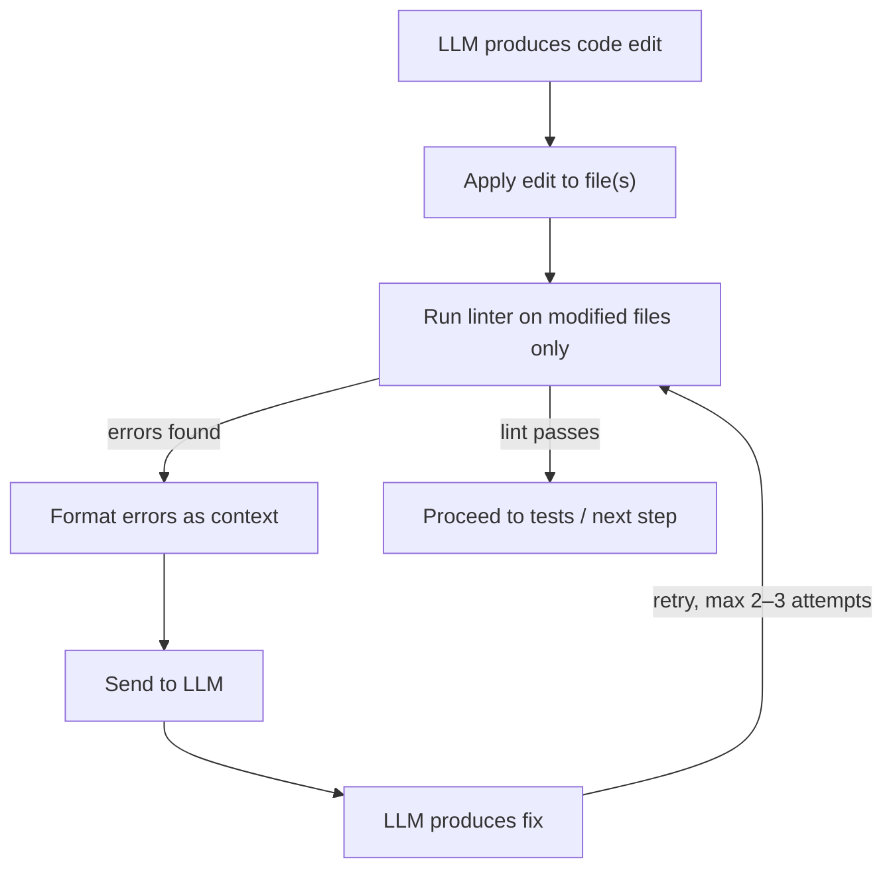
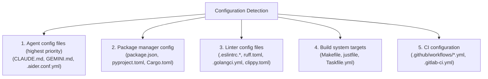

# Lint Integration

> How coding agents integrate linters — built-in and external — into their edit-verify loops, and why linting is the fastest, cheapest first line of defense against broken code.

## Overview

Linting is the **fastest verification feedback** available to a coding agent.
Where test suites take seconds to minutes and builds can take even longer,
linters typically complete in **milliseconds to low seconds**. They catch
syntax errors, undefined variables, unused imports, style violations, and a
broad class of potential bugs — all without executing the code. For an agent
generating code in a tight loop, linting is the verification step with the
highest return per millisecond of wall-clock time.

Among the 17 agents studied, lint integration falls into three tiers:

| Tier | Agents | Approach |
|------|--------|----------|
| **Built-in linting** | **Aider** | Tree-sitter-based built-in linter for 100+ languages, plus `--lint-cmd` for custom linters |
| **Structured lint phase** | **ForgeCode**, **Junie CLI** | Dedicated verification step that runs external linters programmatically |
| **Lint via shell** | **Claude Code**, **Codex**, **Gemini CLI**, **Goose**, **OpenHands**, **Droid** | Execute linters through bash/shell tool — no built-in lint awareness |
| **No lint support** | **Capy**, **Ante**, **Mini SWE Agent**, **OpenCode**, **Pi Coding Agent**, **Sage Agent**, **TongAgents**, **Warp** | No dedicated lint integration; rely on user or CI pipeline |

The pattern is stark: the agents that perform best on real-world coding
benchmarks — Aider, Claude Code, ForgeCode, Junie CLI — all have some form
of lint-in-the-loop. This is not coincidence. Linting catches roughly
**30% of issues** before they ever reach the test suite, reducing the number
of expensive test-fix-retest cycles the agent must execute.

---

## Why Linting Matters for Agents

### The Cost Hierarchy of Verification

Every coding agent that implements edit-apply-verify must choose which
verification steps to run, and in what order. The cost hierarchy is
consistent across languages and frameworks:

```
Verification Step       Typical Latency     What It Catches
─────────────────────   ─────────────────   ──────────────────────────────
Syntax check (parse)    1–10 ms             Syntax errors only
Lint (static analysis)  50–500 ms           Syntax + style + common bugs
Type check              500 ms – 5 s        Type mismatches + interface errors
Build / compile         1 s – 60 s          Compilation errors + linking
Unit tests              2 s – 120 s         Logic errors + regressions
Integration tests       10 s – 600 s        Cross-component failures
```

Agents that skip linting and jump straight to tests pay a heavy price:
the test suite re-runs on every iteration, even when the error was a
trivial syntax mistake that a linter would have caught in 100ms. Aider's
architecture recognizes this — it always runs linting *before* tests when
both `--auto-lint` and `--auto-test` are enabled, creating a fast-fail
gate that prevents wasteful test runs.

### What Linters Catch That LLMs Miss

LLMs produce several categories of errors that linters detect reliably:

1. **Undefined variables and imports**: The model references a function
   it forgot to import — especially common in multi-file edits.

2. **Unused imports and variables**: After refactoring, dead imports remain.

3. **Style violations**: Inconsistent indentation, wrong quote style —
   these matter when CI enforces a style guide.

4. **Common bug patterns**: `==` instead of `is` for `None` in Python,
   missing `break` in JS switch cases, shadowed variables in Go.

5. **Syntax errors from malformed edits**: When a diff-format edit
   misaligns, the file has broken syntax. A linter catches this instantly.

---

## The Lint-as-Verification Pattern

The core pattern is simple: **run the linter on modified files after every
edit, and feed any errors back to the LLM for auto-repair**. This creates
a tight sub-loop within the broader edit-apply-verify cycle:



In pseudocode, the pattern looks like this:

```python
def edit_and_verify(llm, task, modified_files, max_lint_retries=2):
    """Core lint-in-the-loop pattern used by most agents."""
    
    # Step 1: LLM generates edit
    edits = llm.generate_edits(task, modified_files)
    apply_edits(edits, modified_files)
    
    # Step 2: Lint loop
    for attempt in range(max_lint_retries):
        lint_errors = run_linter(modified_files)
        
        if not lint_errors:
            break  # Clean — proceed to tests
        
        # Step 3: Feed errors back for repair
        error_context = format_lint_errors(lint_errors)
        fix = llm.generate_fix(
            task=f"Fix these lint errors:\n{error_context}",
            files=modified_files
        )
        apply_edits(fix, modified_files)
    
    # Step 4: Run tests (if configured)
    if auto_test_enabled:
        run_tests(modified_files)
```

This is essentially Aider's `--auto-lint` loop distilled to its core logic.
The key design decisions are:

1. **Only lint modified files** — linting the entire project would be slow
   and would surface pre-existing issues unrelated to the agent's edit.

2. **Bounded retries** — two to three attempts prevent infinite fix loops
   where each "fix" introduces a new error.

3. **Structured error context** — the LLM receives file path, line number,
   column, error code, and message — not just "linting failed."

---

## Built-in vs External Linters

### Aider: The Built-in Tree-sitter Linter

Aider is unique among the 17 agents in shipping a **built-in linter** that
works across 100+ languages without any user configuration. It uses
tree-sitter to parse edited files and detect syntax errors — if the
parse tree contains `ERROR` nodes, the file has problems.

```python
def lint(self, fname, cmd=None):
    """Lint a file, using tree-sitter if no custom command."""
    rel_fname = self.get_rel_fname(fname)
    if cmd:
        return self.run_cmd(cmd, rel_fname, fname)
    # Fall back to built-in tree-sitter lint
    return self.languages.lint(fname)
```

The tree-sitter lint path walks the CST looking for `ERROR` and `MISSING`
nodes:

```python
def lint(self, fname):
    """Check file for syntax errors using tree-sitter."""
    lang = self.filename_to_language(fname)
    if not lang:
        return  # Unknown language — skip
    
    parser = self.get_parser(lang)
    code = Path(fname).read_bytes()
    tree = parser.parse(code)
    
    errors = []
    visit_stack = [tree.root_node]
    while visit_stack:
        node = visit_stack.pop()
        if node.type == "ERROR" or node.is_missing:
            errors.append(
                f"{fname}:{node.start_point[0]+1}:"
                f"{node.start_point[1]+1}: syntax error"
            )
        visit_stack.extend(node.children)
    return "\n".join(errors) if errors else None
```

This works **out of the box for any language tree-sitter supports, with
zero configuration**. The tradeoff: tree-sitter only catches *syntax*
errors — not undefined variables, type mismatches, or style violations.
That is what `--lint-cmd` is for.

### External Linter Integration via `--lint-cmd`

Aider's `--lint-cmd` flag lets users specify language-specific linters:

```bash
# Single language
aider --lint-cmd "python:ruff check --fix"

# Multiple languages
aider --lint-cmd "python:ruff check" \
      --lint-cmd "javascript:eslint" \
      --lint-cmd "typescript:eslint"

# In .aider.conf.yml
lint-cmd:
  - "python:ruff check --fix"
  - "javascript:eslint --fix"
```

The format is `language:command`. Aider maps file extensions to language
names and dispatches accordingly.

### Claude Code: Lint Through Bash

Claude Code has no built-in lint integration. It runs linters through its
`Bash` tool during verification. **Strength**: it can run *any* linter the
project uses. **Limitation**: there is no guarantee the agent *will* lint —
the model must decide to. In practice, Claude Code is reliable when
CLAUDE.md includes explicit lint instructions.

### Junie CLI: Structured Lint Phase

Junie CLI has a dedicated **Verify** phase in its 5-phase loop (Explore →
Plan → Code → Verify → Diagnose). It runs project-configured linters and
has access to IntelBrains' inspection engine for deep analysis.

### ForgeCode: Programmatic Enforcement

ForgeCode takes the strongest stance: the agent framework *requires* the
model to call a verification skill after every edit. If the model tries to
skip it, the runtime forces it — one of ForgeCode's biggest benchmark
improvements.

---

## Language-Specific Linter Landscape

### Python

Python has the richest linting ecosystem, and the landscape shifted
dramatically with the arrival of **Ruff**:

| Linter | Speed | Scope | Agent Relevance |
|--------|-------|-------|-----------------|
| **Ruff** | ~10–100x faster than alternatives | Style, imports, bugs, formatting | Ideal for agents — speed + breadth |
| **Flake8** | Moderate | Style + basic bugs | Legacy; being replaced by Ruff |
| **Pylint** | Slow | Deep analysis, code smells | Too slow for per-edit lint loops |
| **Mypy** | Slow | Type checking | Overlaps with type-checking.md |
| **Black** | Fast | Formatting only | Formatter, not linter |

Ruff changed the game for agent lint integration. Written in Rust, it is
**10–100x faster** than pylint or flake8, making per-edit linting practical:

```bash
# Ruff: lint and auto-fix
ruff check --fix src/

# Combined: fix then format
ruff check --fix src/ && ruff format src/
```

Configuration lives in `pyproject.toml` or `ruff.toml`:

```toml
# pyproject.toml
[tool.ruff]
line-length = 88
select = ["E", "F", "I", "UP"]  # pycodestyle, pyflakes, isort, pyupgrade

[tool.ruff.lint.isort]
known-first-party = ["myproject"]
```

### JavaScript / TypeScript

The JavaScript ecosystem is transitioning from ESLint v8 (legacy config)
to ESLint v9 (flat config), which affects how agents detect and run linters:

```javascript
// ESLint v8: .eslintrc.js (legacy)
module.exports = {
  extends: ['eslint:recommended'],
  rules: { 'no-unused-vars': 'error' }
};

// ESLint v9: eslint.config.js (flat config)
export default [
  { rules: { 'no-unused-vars': 'error' } }
];
```

**Biome** is the Rust-based alternative gaining traction — like Ruff for
Python, it prioritizes speed:

```bash
# Biome: lint + format
biome check --write .

# ESLint: lint with auto-fix
eslint --fix src/
```

For agents, the key challenge is **detecting which linter** the project
uses. The presence of `.eslintrc.*`, `eslint.config.*`, or `biome.json`
signals the tool, but the configuration format varies wildly.

### Go

Go linting is standardized around `go vet` and `golangci-lint`:

```bash
go vet ./...                    # Built-in
golangci-lint run ./...         # Meta-linter (50+ linters)
```

Configuration: look for `.golangci.yml` or `.golangci.yaml`.

### Rust

Rust linting is dominated by **clippy**, integrated directly into Cargo:

```bash
# Standard lint
cargo clippy -- -D warnings

# With auto-fix
cargo clippy --fix --allow-dirty
```

The `--allow-dirty` flag is important for agents — clippy's auto-fix
requires a clean git state by default, but agent edits haven't been
committed yet.

---

## Auto-Fix Patterns

When a linter reports errors, agents have two strategies for resolution:

### Strategy 1: Let the Linter Fix It

Many linters have built-in auto-fix capabilities:

```bash
# Python (Ruff)
ruff check --fix file.py

# JavaScript (ESLint)
eslint --fix file.js

# Rust (Clippy)
cargo clippy --fix --allow-dirty

# Go (gofmt — formatting, not linting)
gofmt -w file.go
```

This is faster and more reliable for **formatting and style issues** —
the linter knows exactly what the fix should be. No LLM round-trip
required.

### Strategy 2: Feed Errors to the LLM

For issues that require **semantic understanding** — logic errors, wrong
API usage, incorrect types — the linter can identify the problem but cannot
fix it. These errors are fed back to the LLM:

```
File src/auth.py, line 42, col 5: E721 do not compare types, use isinstance()
File src/auth.py, line 67, col 1: F841 local variable 'result' is assigned but never used
```

The LLM receives this structured output and generates targeted fixes.

### When to Use Which

The decision matrix:

| Error Category | Linter Auto-Fix | LLM Fix |
|----------------|-----------------|---------|
| Formatting (whitespace, quotes, semicolons) | ✅ Preferred | Wasteful |
| Import sorting | ✅ Preferred | Wasteful |
| Unused imports (removal) | ✅ Preferred | Works but slower |
| Undefined variable | ❌ Cannot fix | ✅ Required |
| Wrong function signature | ❌ Cannot fix | ✅ Required |
| Logic errors flagged by lint rules | ❌ Cannot fix | ✅ Required |
| Deprecated API usage | Sometimes | ✅ Better context |

### Aider's Double-Run Pattern

Aider implements a clever pattern for formatters that modify files and
return non-zero exit codes. The problem: a formatter like `ruff check --fix`
may *fix* issues (modifying the file) but still exit with code 1 because
it found problems. A naive implementation would interpret this as "lint
failed" and send the (already-fixed) errors to the LLM.

Aider's solution — run the linter twice:

```python
def run_lint_cmd(self, cmd, rel_fname, fname):
    """Run external lint command with double-run formatter handling."""
    
    # First run — may fix issues and modify the file
    result1 = subprocess.run(
        cmd.split() + [rel_fname],
        capture_output=True, text=True
    )
    
    if result1.returncode == 0:
        return None  # Clean on first run
    
    # File may have been modified by auto-fix.
    # Run again — if clean now, the formatter handled it.
    result2 = subprocess.run(
        cmd.split() + [rel_fname],
        capture_output=True, text=True
    )
    
    if result2.returncode == 0:
        return None  # Formatter fixed it — no LLM intervention needed
    
    # Still failing — these are real errors
    return result2.stdout + result2.stderr
```

This double-run pattern is essential when using `--lint-cmd` with
formatters like `ruff check --fix`, `eslint --fix`, or `black`. Without
it, every format fix triggers an unnecessary LLM round-trip.

---

## Pre-commit Hooks Integration

Many projects use [pre-commit](https://pre-commit.com/) to run linters
and formatters before each Git commit. Since agents like Aider, Claude
Code, and Codex auto-commit after edits, pre-commit hooks run on
agent-generated code automatically.

Aider can use pre-commit as its lint command:

```bash
aider --lint-cmd "pre-commit run --files"
```

Combined with `--auto-lint`, this runs the full pre-commit suite on each
modified file. Aider's double-run pattern handles the common case where
hooks modify files (formatters, import sorters) and then fail — the
second run checks if the hook-modified version is clean.

Key challenges with Git hooks and agents:

1. **Commit-msg hooks** that enforce conventional commits may reject
   auto-generated commit messages.
2. **Pre-push hooks** running full test suites can block the workflow
   on intermediate commits.
3. **File-modifying hooks** (like `prettier --write`) change files after
   the agent has finished editing, potentially invalidating the agent's
   internal state.

---

## Configuration Detection

A major challenge for coding agents is **discovering which linters a
project uses** and how they are configured. There is no universal standard
— every ecosystem has its own conventions.

### Detection Strategies

Agents discover lint configuration through several channels:



### Agent-Specific Configuration

The most reliable path is explicit agent configuration:

```yaml
# .aider.conf.yml
lint-cmd:
  - "python:ruff check --fix"
  - "javascript:eslint --fix"
auto-lint: true
```

```markdown
<!-- CLAUDE.md -->
## Linting
Always run `ruff check --fix` after editing Python files.
Always run `eslint --fix` after editing TypeScript files.
Run `make lint` to check the full project.
```

```markdown
<!-- GEMINI.md -->
## Code Quality
- Linter: `golangci-lint run ./...`
- Formatter: `gofmt -w`
```

These agent-specific config files are the **most reliable** detection
method because they are explicit, unambiguous, and tailored to the
agent's capabilities.

### Package.json Detection

For JavaScript/TypeScript projects, `package.json` scripts are a strong
signal:

```json
{
  "scripts": {
    "lint": "eslint src/",
    "lint:fix": "eslint --fix src/",
    "format": "prettier --write ."
  }
}
```

An agent can detect that `npm run lint` is available and use it as the
lint command. Claude Code and Gemini CLI both examine `package.json` when
deciding which commands are available.

### CI Configuration Mining

An underexploited detection strategy is **mining CI configuration**. A
project's `.github/workflows/ci.yml` specifies the exact lint commands:

```yaml
# .github/workflows/ci.yml
jobs:
  lint:
    steps:
      - run: pip install ruff
      - run: ruff check .
```

No agent currently mines CI config automatically, but this represents an
opportunity — the CI definition is the ground truth for what the project
considers "passing lint."

---

## Lint Output Parsing

### The Standard Format

Most linters emit errors in a common format that agents can parse:

```
file:line:column: CODE message (severity)
```

Examples:

```
src/auth.py:42:5: F841 local variable 'x' is assigned to but never used
src/utils.ts:17:1: no-unused-vars 'helper' is defined but never used
main.go:23:4: SA4006 this value of `err` is never used (staticcheck)
```

This structured format is what makes lint output so valuable for agents —
it contains the exact file, line, and column of every issue, enabling
precise targeted fixes.

### Filtering: Modified Files Only

Agents should **only show lint errors from files they modified**. Running a
linter on the entire project surfaces hundreds of pre-existing issues that
waste tokens and confuse the model. Aider implements this by tracking which
files were edited in the current turn and only linting those:

```python
def run_lint(self, fnames):
    """Lint only the specified files, not the whole project."""
    errors = []
    for fname in fnames:
        result = self.lint(fname)
        if result:
            errors.append(result)
    return "\n".join(errors) if errors else None
```

### Warning vs Error Severity

Linters classify issues as `error`, `warning`, or `info`. The pragmatic
rule for agents: **fix errors, ignore warnings**. Warnings are
informational and don't prevent the code from working. An agent that fixes
every warning risks burning tokens on cosmetic issues. Some agents (notably
Claude Code via CLAUDE.md) can be configured to treat specific warnings as
errors.

---

## Performance Considerations

### Why Ruff Changed the Game

Before Ruff, Python linting was a bottleneck for agents. Pylint could take
**30+ seconds** on a medium-sized project. Running pylint on every edit
iteration was impractical, so agents either skipped linting or only ran it
at the end.

Ruff (written in Rust) delivers the same coverage in **100–500ms** for a
full project, and under **50ms** for a single file. This speed difference
makes per-edit linting practical:

```
Tool        Single File     Full Project (10k lines)
──────────  ─────────────   ────────────────────────
Ruff        5–20 ms         100–500 ms
Flake8      100–300 ms      2–8 s
Pylint      500 ms – 2 s    15–45 s
Mypy        1–5 s           10–60 s
```

For agents, the **single-file latency** is what matters — they lint the
files they just edited, not the entire project. At 5–20ms per file, Ruff
adds negligible overhead to the edit loop.

### Incremental Linting

The fastest lint is one that doesn't re-analyze unchanged code. Several
strategies exist:

1. **File-level granularity**: Only lint files that changed. This is what
   Aider does — simple, effective, and works with any linter.

2. **Linter-level caching**: Ruff caches analysis results and only
   re-analyzes changed files. ESLint has `--cache` flag for similar
   behavior.

3. **Language server integration**: Running an LSP server provides
   continuous lint feedback as files change, without re-invoking the
   linter binary. No agent currently uses this for linting, though it
   would be most efficient for long sessions with many edits.

### The Cost-Benefit of Per-Edit Linting

Is per-edit lint overhead worth it? The data says yes. **Without per-edit
linting**, errors accumulate across turns — a missing import from turn 2
causes a NameError that the test suite reports as a test failure, not a
missing import. **With per-edit linting**, each turn starts clean, errors
are caught immediately, and the 50–500ms overhead saves seconds of
unnecessary test runs. The agents that perform best on SWE-bench
consistently use lint-in-the-loop.

---

## Cross-Agent Lint Support Comparison

| Agent | Built-in Lint | External Lint Support | Auto-Fix | Lint-in-Loop | Configuration |
|-------|---------------|----------------------|----------|--------------|---------------|
| **Aider** | ✅ Tree-sitter (100+ langs) | ✅ `--lint-cmd` per language | ✅ Double-run + LLM | ✅ `--auto-lint` | `.aider.conf.yml` |
| **Claude Code** | ❌ | ✅ Via Bash tool | ✅ LLM-driven | Depends on model | `CLAUDE.md` |
| **Codex** | ❌ | ✅ Via shell | ✅ LLM-driven | Depends on model | Agent instructions |
| **ForgeCode** | ❌ | ✅ Mandatory verification skill | ✅ LLM-driven | ✅ Enforced | Skill configuration |
| **Junie CLI** | ❌ (uses JetBrains inspections) | ✅ JetBrains + external | ✅ Both | ✅ Verify phase | JetBrains project config |
| **Gemini CLI** | ❌ | ✅ Via shell | ✅ LLM-driven | Depends on model | `GEMINI.md` |
| **Goose** | ❌ | ✅ Via shell | ✅ LLM-driven | Depends on model | Extension config |
| **OpenHands** | ❌ | ✅ Via Bash action | ✅ LLM-driven | Depends on model | Agent prompt |
| **Droid** | ❌ | ✅ Via shell | ✅ LLM-driven | Depends on model | Project detection |
| **Capy** | ❌ | ❌ | ❌ | ❌ | N/A |
| **Ante** | ❌ | Limited | ❌ | ❌ | N/A |
| **OpenCode** | ❌ | Limited (via shell) | ❌ | ❌ | N/A |
| **Mini SWE Agent** | ❌ | ❌ | ❌ | ❌ | N/A |
| **Pi Coding Agent** | ❌ | Limited | ❌ | ❌ | N/A |
| **Sage Agent** | ❌ | ❌ | ❌ | ❌ | N/A |
| **TongAgents** | ❌ | ❌ | ❌ | ❌ | N/A |
| **Warp** | ❌ | Limited | ❌ | ❌ | N/A |

Key observations:

1. **Only Aider has a built-in linter.** Every other agent relies on
   external linters via shell or has no lint support at all.

2. **"Via Bash" is a double-edged sword.** Claude Code, Codex, and others
   *can* run linters, but the model must decide to do so. Under token
   pressure, it may skip linting entirely.

3. **Enforcement matters.** ForgeCode, Junie CLI, and Aider (with
   `--auto-lint`) enforce linting at the framework level — consistently
   outperforming agents that leave it as an optional model decision.

4. **Research agents lack linting entirely.** Capy, Mini SWE Agent, Sage
   Agent, and TongAgents have no lint support.

---

## Best Practices for Agent Lint Integration

1. **Lint before testing — always.** Catching a syntax error in 50ms
   prevents a 30-second test run that would fail for a trivial reason.

2. **Only lint modified files.** Full-project linting surfaces pre-existing
   issues that confuse the model and waste tokens.

3. **Use linter auto-fix for style, LLM for logic.** Don't waste an LLM
   round-trip on import sorting. Let `ruff --fix` handle formatting.

4. **Bound your retry loops.** Two to three lint-fix iterations is the
   sweet spot. Beyond that, human intervention is likely needed.

5. **Enforce, don't suggest.** Build lint-in-the-loop into the framework.
   ForgeCode's experience shows enforcement is dramatically more reliable
   than prompting.

6. **Provide structured error context.** File path, line, column, error
   code, message. The more structured, the more targeted the fix.

7. **Handle formatter edge cases.** Use the double-run pattern when lint
   commands also auto-fix files.

8. **Prefer fast linters.** Ruff over Pylint, Biome over ESLint. Speed
   makes per-edit linting practical vs impractical.

---

## Key Takeaways

1. **Linting is the highest-ROI verification step.** At 50–500ms per
   invocation, it catches ~30% of issues before they reach the test suite.
   Every agent that skips linting pays for it in longer test-fix cycles.

2. **Aider's built-in tree-sitter linter is a unique advantage.** Zero-
   configuration syntax checking across 100+ languages means linting works
   out of the box for any project. No other agent offers this.

3. **The lint-fix feedback loop is simple but transformative.** Run linter,
   parse errors, feed to LLM, apply fix, repeat. This pattern — used by
   Aider, ForgeCode, and Junie CLI — catches and fixes errors that would
   otherwise cascade into hard-to-debug failures.

4. **Enforcement beats prompting.** Agents that *require* linting as part
   of their verification step (Aider with `--auto-lint`, ForgeCode's
   mandatory verification skill, Junie CLI's Verify phase) consistently
   outperform agents that leave linting as an optional model decision.

5. **The Ruff effect is real.** Rust-based linters (Ruff for Python, Biome
   for JavaScript) made per-edit linting practical by dropping single-file
   lint latency from seconds to milliseconds.

6. **Configuration detection is an unsolved problem.** No agent reliably
   auto-discovers a project's lint configuration. Agent-specific config
   files (CLAUDE.md, .aider.conf.yml) remain the most reliable path.

---

## Real-World Implementations

| Agent | Lint Strategy | Reference |
|-------|---------------|-----------|
| **Aider** | Built-in tree-sitter linter + `--lint-cmd` + `--auto-lint` loop | [`../agents/aider/agentic-loop.md`](../agents/aider/agentic-loop.md) |
| **Claude Code** | Lint via Bash tool, guided by CLAUDE.md | [`../agents/claude-code/tool-system.md`](../agents/claude-code/tool-system.md) |
| **ForgeCode** | Mandatory verification skill with lint enforcement | [`../agents/forgecode/agentic-loop.md`](../agents/forgecode/agentic-loop.md) |
| **Junie CLI** | Dedicated Verify phase with JetBrains inspections | [`../agents/junie-cli/agentic-loop.md`](../agents/junie-cli/agentic-loop.md) |
| **Codex** | Lint via shell commands in sandbox | [`../agents/codex/tool-system.md`](../agents/codex/tool-system.md) |
| **Gemini CLI** | Lint via shell, guided by GEMINI.md | [`../agents/gemini-cli/tool-system.md`](../agents/gemini-cli/tool-system.md) |
| **Goose** | Lint via shell through developer extension | [`../agents/goose/tool-system.md`](../agents/goose/tool-system.md) |
| **OpenHands** | Lint via Bash action in sandbox | [`../agents/openhands/tool-system.md`](../agents/openhands/tool-system.md) |
| **Droid** | Lint via shell with project detection | [`../agents/droid/tool-system.md`](../agents/droid/tool-system.md) |