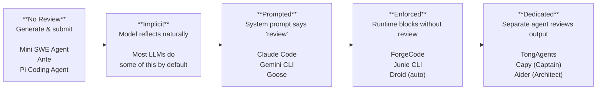
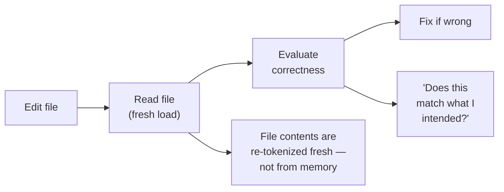
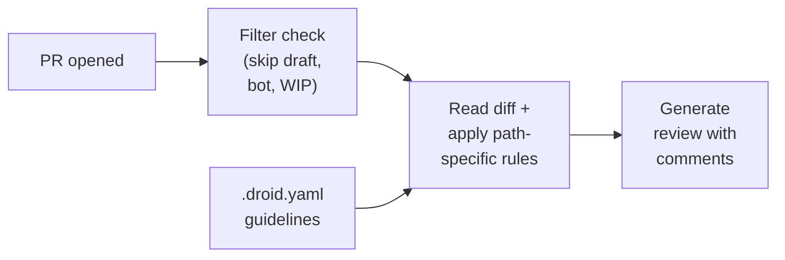
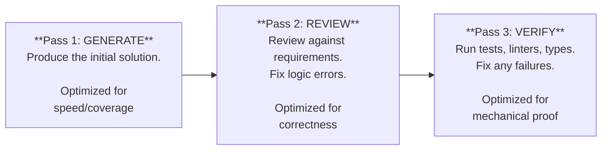
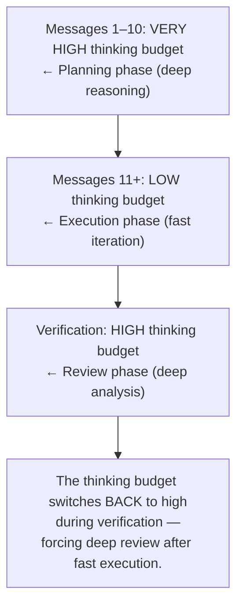
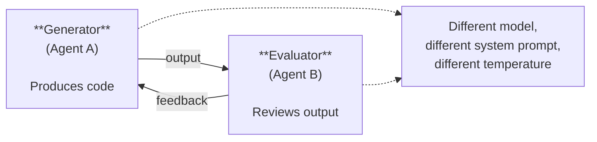
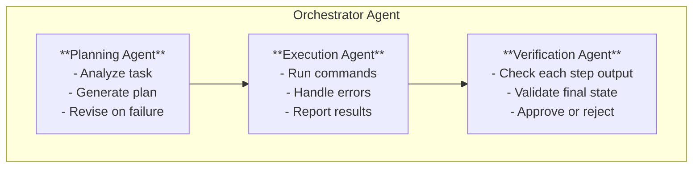
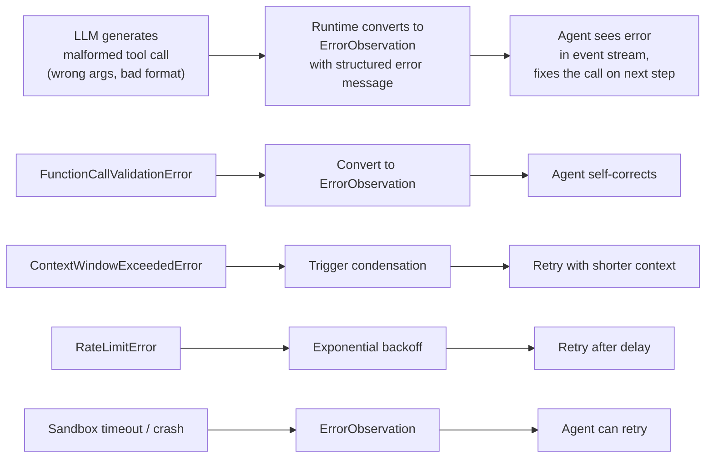
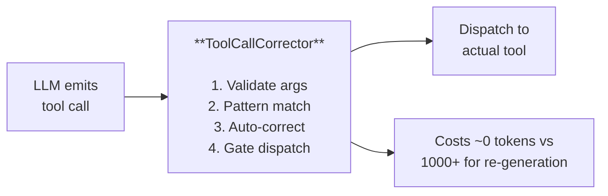
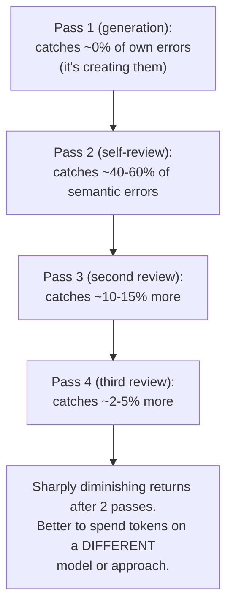

# Self-Review Patterns

> How coding agents review their own output — from re-reading generated code to dedicated
> reviewer agents — and why self-review is the verification layer that catches what tests,
> linters, and type checkers cannot.

## Overview

External verification tools — test suites, linters, type checkers — catch **syntactic and
structural** errors. A missing import, a type mismatch, a failing assertion: these are
objective, mechanically detectable problems. But a large class of defects lives beyond the
reach of automated tools:

- **Logic errors**: the code runs without errors but computes the wrong result
- **Incorrect algorithms**: an O(n³) solution where O(n log n) was needed
- **Wrong business logic**: the feature works but doesn't match the requirement
- **Missed edge cases**: null inputs, empty arrays, concurrent access, Unicode
- **Incomplete implementations**: the happy path works but error handling is absent
- **Semantic misunderstandings**: the agent misread the task and solved the wrong problem

Self-review is how agents catch these **semantic** mistakes. It is the verification layer
that sits above automated tooling and below human review — filling the gap where machines
can check syntax but only reasoning can check intent.

Among the 17 agents studied, self-review ranges from nonexistent to architecturally
enforced. The spectrum is wide, and the impact on code quality is measurable.

---

## The Self-Review Spectrum

Not all agents treat self-review equally. The approaches fall along a spectrum of
increasing formality and enforcement:



| Level | Description | Agents | Failure Mode |
|-------|-------------|--------|--------------|
| **No self-review** | Generate code, submit immediately | Mini SWE Agent, Ante, Pi Coding Agent | All semantic errors reach the user |
| **Implicit** | LLM naturally pauses to reflect before finishing | All LLMs (varying degree) | Reflection is shallow, inconsistent |
| **Prompted** | System prompt instructs review before completion | Claude Code, Gemini CLI, Goose, OpenCode | Model may skip review under token pressure |
| **Enforced** | Runtime requires verification pass; blocks completion | ForgeCode, Junie CLI | Adds latency; can loop on false negatives |
| **Dedicated reviewer** | Separate agent or model reviews the primary output | TongAgents, Capy, Aider (Architect), Droid | Doubles cost; reviewer may echo generator |

The critical insight: **prompted self-review is unreliable under pressure.** When the
context window is filling up, when the task seems straightforward, when the model is
confident — prompted review gets skipped. Enforced and dedicated-reviewer patterns pay
a cost in latency and tokens but deliver more consistent quality.

---

## Re-Reading Generated Code

The simplest form of self-review: after generating or editing a file, read it back
and verify correctness.

### The Pattern



### Claude Code: Verify Phase as Architecture

Claude Code's three-phase loop makes re-reading structural:

```
Phase 1: GATHER CONTEXT
  • Grep, Read, Glob, LSP → understand the codebase

Phase 2: TAKE ACTION
  • Edit, Bash → make changes

Phase 3: VERIFY RESULTS          ← Self-review happens here
  • Read edited files            ← Re-read what was just written
  • Run test suite again
  • Check for type errors (LSP)
  • Run linters
  • Compare before/after
  • Search for related issues
```

The tool-chaining pattern shows explicit re-verification after every edit:

```
1. Grep("error message")           → finds the relevant file
2. Read("src/auth/session.ts")     → understands the code
3. Bash("npm test -- session")     → sees the failing test
4. Edit("src/auth/session.ts")     → fixes the issue
5. Bash("npm test -- session")     → verifies the fix passes    ← re-verify
6. Read("src/auth/session.ts")     → confirms the edit is clean ← re-read
```

Anthropic's finding: Claude performs **"dramatically better"** when it can verify
its own work. Without verification criteria, the user becomes the only feedback loop.

### The "Fresh Eyes" Problem

Re-reading has a fundamental limitation: **the same model reviewing its own output
tends to confirm rather than critique.** The LLM generated the code moments ago —
its hidden state is primed to see the output as correct. This is analogous to a
writer proofreading immediately after writing: they see what they intended, not
what they typed.

Mitigations observed across agents:
- **Different model for review** (Aider's Architect mode, evaluator-optimizer pattern)
- **Structured review criteria** (ForgeCode's enforcement questions)
- **Time delay / context reset** (Goose's conversation reset on retry)
- **External grounding** (running tests, checking types — objective signals)

---

## Diff Review Before Commit

Rather than re-reading entire files, several agents review the **diff** — the
precise set of changes — before committing or submitting.

### Why Diffs Are Better Than Full Re-Reads

```
Full re-read:  4,000 lines of code → 4,000 tokens to review
Diff review:   12 lines changed     → 12 tokens to review (focused attention)
```

Reviewing the diff concentrates the model's attention on exactly what changed,
reducing the chance of missing errors in the modified lines while avoiding
distraction from the (presumably correct) unchanged code.

### Codex: Op::Review as First-Class Operation

Codex treats review as a first-class operation in its event system, not an
afterthought:

```rust
// Codex's operation enum includes Review alongside core operations
enum Op {
    UserMessage { .. },
    AgentMessage { .. },
    ExecApproval  { id: String, decision: ReviewDecision },
    PatchApproval { id: String, decision: ReviewDecision },
    Review { .. },           // ← Dedicated review operation
    Undo { num_turns },
    ThreadRollback { .. },
}

// The ReviewDecision enum gates whether changes proceed
match decision {
    ReviewDecision::Denied  => return Err(ToolError::Rejected(..)),
    ReviewDecision::Abort   => return Err(ToolError::Aborted),
    ReviewDecision::Approved => { /* proceed with change */ }
    ReviewDecision::ApprovedExecpolicyAmendment(amendment) => {
        // Update execution policy for future commands
    }
}
```

The `/review` slash command supports three modes:
- **Branch diff**: compare current branch against base
- **Uncommitted changes**: review working directory modifications
- **Commit review**: review specific commits

However, Codex's review is **human-facing**, not agent-self-review. The `Op::Review`
operation presents changes to the user for approval, rather than the agent reviewing
its own work autonomously.

### Droid: Automated Diff Review with Guidelines

Droid has the most mature **automated** diff-review pattern among the 17 agents.
Its auto-review loop runs on every PR:



The `.droid.yaml` configuration makes review criteria explicit and path-specific:

```yaml
review:
  guidelines:
    - path: "**/api/**"
      guideline: "All API endpoints must have input validation"
    - path: "**/models/**"
      guideline: "Database models must have proper indexes"
    - path: "**/*.test.*"
      guideline: "Tests should cover edge cases, not just happy path"
  auto_review:
    enabled: true
    draft: false        # skip draft PRs
    bot: false          # skip bot-generated PRs
```

Review output includes:
- PR summary (what changed and why)
- Per-file summaries
- Actionable review comments matching path-specific guidelines
- CI failure analysis and suggested fixes (`github_action_repair: true`)
- Skip-reason transparency (why a review was omitted)

### Warp: GPU-Rendered Interactive Diff Review

Warp's GPU-rendered terminal enables a visual diff review experience impossible in
text-only terminals:

```
┌──────────────────────────────────────────────────────────────┐
│  Interactive Code Review                                      │
│  File: src/auth/login.ts                                     │
│  ┌────────────────────────────────────────────────────────┐  │
│  │  - const token = jwt.sign(payload, secret);            │  │
│  │  + const session = await createSession(user.id);       │  │
│  │  + await session.setSecure(true);                      │  │
│  └────────────────────────────────────────────────────────┘  │
│  💬 "Should we also set the SameSite attribute?"             │
│  [Accept] [Reject] [Edit] [Comment]                          │
└──────────────────────────────────────────────────────────────┘
```

Key capabilities:
- Syntax-highlighted diffs with rich color (beyond 256-color)
- Per-hunk accept/reject (granular control, not all-or-nothing)
- Inline comment annotations
- Agent can revise changes based on review feedback
- Batch operations (accept all, reject all)

Warp's Full Terminal Use (FTU) also enables a form of self-verification: the agent
observes its own command output in the live terminal buffer, effectively reading
back the results of its actions.

---

## Multi-Pass Generation

Rather than generating code once and hoping it's correct, several agents use
multiple passes — each with a different focus.

### The General Pattern



### Aider's Architect Mode: Reasoning + Editing as Separate Passes

Aider's Architect mode is the clearest multi-pass pattern among the 17 agents.
It splits generation into two phases handled by different models:

```
Pass 1: REASONING MODEL (o1, o3, R1, Claude)
  └─► Describes the solution in natural language
  └─► "Change function X to handle null inputs by adding a guard clause..."

Pass 2: EDITING MODEL (Sonnet, GPT-4o, DeepSeek)
  └─► Translates the plan into concrete file edits
  └─► Produces search/replace blocks or unified diffs

Pass 3: AUTOMATED VERIFICATION
  └─► Lint (tree-sitter built-in + custom linters)
  └─► Test (--auto-test runs test suite, feeds failures back)
  └─► Fix (LLM attempts to fix any lint/test failures)
```

The benchmark evidence is striking — even pairing a model with **itself** improves
results by splitting reasoning from editing:

| Configuration | SWE-Bench Score |
|---------------|-----------------|
| o1-preview alone | 79.7% |
| o1-preview architect + o1-mini editor | **85.0%** |
| Sonnet alone | 77.4% |
| Sonnet architect + Sonnet editor | **80.5%** |

The improvement comes from **forcing the model to articulate its reasoning** before
committing to code. The natural-language plan serves as an intermediate
representation that the editing model can verify against.

### ForgeCode: Thinking Budget as Multi-Pass Control

ForgeCode controls the depth of reasoning per phase through a **progressive
thinking policy**:



This is multi-pass by resource allocation: the agent is cheap and fast during
implementation, then expensive and careful during review. The switch from low to
high thinking budget during verification effectively creates a "second opinion"
from a more deliberate version of the same model.

### Droid: Specification Mode

Droid separates planning from execution using different models:

1. **Reasoning model** (Claude Opus, o3) generates a detailed implementation spec:
   technical details, file changes, edge cases, test requirements
2. **Execution model** (potentially cheaper) implements the spec

The spec acts as an intermediate verification artifact — the implementation can
be checked against it, and the spec itself can be reviewed before execution begins.

---

## Critic / Reviewer Agent Patterns

The most sophisticated self-review approach: a **separate agent** whose sole job
is to evaluate the primary agent's output.

### The Evaluator-Optimizer Pattern



Using a different model for evaluation mitigates the "fresh eyes" problem.
The evaluator was not primed by the generation process, so it approaches the
output with genuine scrutiny rather than confirmation bias.

### TongAgents: Dedicated Verifier in Multi-Agent Pipeline

TongAgents implements the clearest separation between execution and verification
among the 17 agents (architecture is inferred — no public source code):

```
Orchestrator: "Configure nginx with SSL"
  → Planner:   "Steps: 1) install nginx, 2) generate cert, 3) configure, 4) test"
  → Executor:  runs step 1, returns output
  → Verifier:  "nginx installed successfully ✓ — proceed"
  → Executor:  runs step 2, returns error
  → Planner:   "Revise step 2: install certbot first"
  → Executor:  runs revised step 2
  → Verifier:  "cert generated ✓ — proceed"
```

The Verifier agent checks **each step's output** before the pipeline advances.
This is finer-grained than reviewing the final result — errors are caught at
the earliest possible point.



### ForgeCode: Three-Agent Architecture

ForgeCode's Muse/Forge/Sage split creates review through architectural separation:

| Agent | Role | Access | Self-Review Function |
|-------|------|--------|---------------------|
| **Forge** | Implementation | Read + Write | Builder — produces code |
| **Muse** | Planning | Read-only | Plans without side effects; reviews Forge's approach |
| **Sage** | Research | Read-only (internal) | Deep analysis engine; returns summaries |

Muse's read-only constraint is key: because it **cannot modify files**, it is forced
to think before acting. This architectural constraint prevents the common failure
mode where agents rush to implementation without adequate planning.

### Capy: Captain / Build Split

Capy enforces review through role separation:

- **Captain** (Planning): *"You are a technical architect who PLANS but never
  IMPLEMENTS."* Can read codebases, ask questions, write specifications.
  **Cannot write code.**
- **Build** (Execution): *"You are an autonomous AI agent..."* Can edit files,
  run tests, open PRs. **Cannot ask clarifying questions.**

The architectural enforcement creates a natural quality gate:

> Because Build cannot request clarification, Captain must produce thorough specs.
> Because Captain cannot write code, it doesn't skip ahead to implementation.

The trade-off: rigidity adds overhead for simple tasks. Creating a specification
for a one-line bug fix is wasteful. But for complex, multi-file changes, the
forced planning-then-execution split catches misunderstandings before they become
code.

---

## Reflection Prompts

The content of self-review prompts matters enormously. Vague instructions
("review your code") produce shallow review. Specific, evidence-demanding
questions force genuine verification.

### ForgeCode's Enforcement Question

The single most impactful reflection prompt observed across all 17 agents:

```
"What evidence proves this objective is actually complete?"
```

This question demands **evidence**, not assertion. The agent cannot simply say
"I believe it's done" — it must point to test results, output comparisons,
or other concrete proof. This was reportedly **"the biggest single improvement"**
to ForgeCode's quality, particularly with GPT 5.4, which would implement
solutions, express confidence, and stop before the task was actually complete.

The enforcement flow:

```python
# ForgeCode verification enforcement (pseudocode)
def check_completion(agent_state):
    if not agent_state.verification_skill_called:
        # Runtime blocks completion — no opt-out
        inject_reminder(agent_state)
        agent_state.require_verification()
        return False

    # Verification skill asks the critical question
    verification_result = agent_state.run_verification(
        prompt="""
        Before marking this task complete, answer:
        1. What was requested?
        2. What was actually done?
        3. What evidence exists that it worked?
        4. What is still missing?
        """
    )

    if verification_result.has_gaps:
        return False  # Agent must address gaps before completing

    return True
```

### Categories of Effective Reflection Prompts

```
EVIDENCE-DEMANDING:
  "What test output proves this works?"
  "Show me the diff that addresses the requirement."
  "What error did you fix, and how do you know it's fixed?"

EDGE-CASE PROBING:
  "What happens with empty input?"
  "What happens with null/undefined?"
  "What happens under concurrent access?"
  "What happens when the file doesn't exist?"

SCOPE-CHECKING:
  "Does this change affect other parts of the codebase?"
  "Are there callers of this function that need updating?"
  "Does the documentation still match the implementation?"

REQUIREMENT-MATCHING:
  "Restate the original requirement in your own words."
  "Does every part of the requirement have corresponding code?"
  "What requirement am I NOT addressing, and why?"
```

### How System Prompts Shape Self-Review Behavior

Claude Code's system prompt shapes verification behavior through guidelines rather
than enforcement. The best-practices documentation emphasizes providing **verification
criteria** in the task description:

```
WEAK (no verification criteria):
  "Fix the login bug."

STRONG (verification criteria embedded):
  "Fix the login bug. Verify by running the test suite.
   Confirm that the session token is set correctly by
   checking the response headers."
```

The difference in outcome is measurable: with verification criteria, the model
runs tests, checks outputs, and catches its own errors. Without them, it often
stops after the first edit that "looks right."

---

## How Agents Catch Their Own Mistakes

Beyond high-level review patterns, agents have specific mechanisms for detecting
and correcting errors at the tool-call level.

### OpenHands: Error → Observation → Self-Correction

OpenHands converts malformed tool calls into structured error observations that
the agent can act on:



The key design choice: errors are **not fatal**. They become observations in the
event stream, giving the agent a chance to self-correct. Every `Observation` links
to its causing `Action` via a `cause` field, maintaining causal traceability:

```python
class Event:
    _id: int                   # monotonic sequence number
    _cause: int                # ID of the event that triggered this one
    source: EventSource        # AGENT, USER, ENVIRONMENT
```

### OpenHands: StuckDetector — Breaking Self-Reinforcing Loops

When self-correction fails and the agent enters a loop, OpenHands' `StuckDetector`
intervenes. It runs after **every step** with four detection strategies:

| Strategy | Detection Rule | Recovery |
|----------|---------------|----------|
| **Identical repetition** | `action[n] == action[n-1] == action[n-2]` | Terminate or nudge |
| **Alternating pattern** | `action[n] == action[n-2] && action[n-1] == action[n-3]` | Terminate or nudge |
| **Error loop** | Last K observations are all `ErrorObservation` | Force condensation |
| **Empty response** | Last K actions have empty/near-empty content | Terminate |

Recovery options escalate: `LoopRecoveryAction` (nudge to try different approach)
→ force condensation (compress history to break pattern) → `AgentStuckInLoopError`
(terminate). This is meta-self-review: the system reviews whether the agent's
self-correction is actually making progress.

### ForgeCode: ToolCallCorrector — Fix Before Failing

ForgeCode's tool-call correction layer intercepts **every** tool call before
dispatch and attempts automatic repair:



Correction strategies:
- **Alias inference**: model uses `file` instead of `file_path` → corrected
- **Type coercion**: string `"42"` where number expected → converted to `42`
- **Fuzzy enum matching**: `"read_File"` where `"read_file"` expected → matched
- **Structural repair**: wrong nesting depth → flattened

The key insight: fixing a tool call **costs ~0 extra tokens** compared to
1,000+ tokens for rejecting the call, generating an error message, having the
model re-read the error, and re-generating the call. This is self-correction
at the infrastructure layer, invisible to the model.

### Goose: Argument Coercion

Goose implements a similar pattern through `coerce_arguments()` in
`crates/goose/src/agents/reply_parts.rs`:

```rust
// Goose's argument coercion handles common LLM type mistakes
// String "42" → Number 42
// String "true" → Boolean true
// String "null" → Null
```

Beyond type coercion, Goose's 4-inspector pipeline provides layered self-review
at the tool-call level:

1. **SecurityInspector** — pattern-matching for dangerous commands
2. **AdversaryInspector** — prompt injection detection in tool arguments
3. **PermissionInspector** — per-tool permission rules
4. **RepetitionInspector** — detects tools called repeatedly without progress

The RepetitionInspector is particularly relevant to self-review: it catches the
case where the agent is "trying" but not making progress — a form of failed
self-correction that needs external intervention.

### Structured Errors Yield Better Self-Correction

Across all agents, a consistent finding: **structured error messages yield ~90%
self-correction rates vs ~50% for vague errors.**

```
VAGUE ERROR (low self-correction rate):
  "Error: command failed"

STRUCTURED ERROR (high self-correction rate):
  "Error: FileNotFoundError
   File: src/auth/session.ts
   Line: 42
   Expected: existing file path
   Received: src/auth/sessions.ts (note: 'sessions' vs 'session')
   Suggestion: Did you mean 'src/auth/session.ts'?"
```

Agents that invest in structured error formatting — OpenHands' `ErrorObservation`,
ForgeCode's `ToolCallCorrector`, Aider's fuzzy edit matching — consistently
recover from errors more efficiently than agents that surface raw error strings.

### Aider: Fuzzy Edit Matching as Self-Correction

Aider implements a progressive fuzzy-matching system when the LLM's search/replace
edits don't exactly match the file contents:

```
Level 1: Exact match                          ← fastest
Level 2: Strip trailing whitespace
Level 3: Ignore leading/trailing blank lines
Level 4: Normalized whitespace comparison
Level 5: Partial line matching                ← most tolerant
```

This is self-correction at the **edit-application layer**: rather than failing and
asking the model to regenerate, Aider adapts the edit to match reality. It handles
the common case where the model's mental model of the file is slightly stale.

---

## The Limits of Self-Review

### Confirmation Bias

The fundamental challenge: **a model reviewing its own output tends to confirm
rather than critique.** The generation process primes the model's hidden state
toward the solution it just produced. Asking it to find flaws in that solution
is asking it to overcome its own conditioning.

Evidence: ForgeCode found that without enforced verification, GPT 5.4 would
implement solutions, "sound confident," and stop — genuinely believing the task
was complete when it wasn't. The model's self-assessment was systematically
over-optimistic.

### Diminishing Returns of Multiple Passes



The empirical evidence from Aider's Architect mode confirms this: splitting
across two models (even two instances of the same model) outperforms
additional passes with a single model. **Diversity of perspective matters more
than depth of review.**

### When Self-Review Fails

Self-review is least effective for:
- **Novel algorithms**: the model has no training-data precedent to compare against
- **Subtle concurrency bugs**: require reasoning about interleaved execution paths
- **Security vulnerabilities**: models often don't flag insecure patterns as errors
- **Performance regressions**: "correct" code that is dramatically slower

For these categories, external verification (benchmarks, security scanners,
profilers) or human review remains essential.

### The Cost-Quality Tradeoff

| Approach | Extra Tokens | Error Reduction | Best For |
|----------|-------------|-----------------|----------|
| No review | 0 | 0% | Trivial changes |
| Single self-review pass | ~500–2000 | ~40–60% | Most edits |
| Enforced verification (ForgeCode) | ~1000–3000 | ~60–80% | Complex tasks |
| Dedicated reviewer agent | ~2000–5000 | ~70–85% | High-stakes changes |
| Different model as reviewer | ~2000–5000 | ~75–90% | Critical production code |

The sweet spot for most agents: **one enforced self-review pass with structured
verification criteria**, supplemented by automated tools (tests, lints, types).
Going beyond this is justified only for high-stakes changes.

---

## Goose: Conversation Reset as Nuclear Self-Correction

Goose implements a unique self-review escape hatch: when self-correction fails
repeatedly, it **resets the entire conversation** and retries from scratch.

```rust
pub struct RetryManager {
    attempts: Arc<Mutex<u32>>,
    repetition_inspector: Option<Arc<Mutex<Option<RepetitionInspector>>>>,
}
```

The flow:
1. Execute task
2. Run success checks
3. If failed and attempts < max: **reset conversation to initial state**
4. Retry from scratch with a clean context

This is the most extreme form of self-correction: acknowledging that the current
line of reasoning is irrecoverable and starting over. It trades accumulated
context for a fresh perspective — an architectural solution to confirmation bias.

Goose also proactively manages its own context through background tool-pair
summarization:

```rust
pub fn maybe_summarize_tool_pairs(
    provider: Arc<dyn Provider>,
    conversation: &Conversation,
    tool_call_cut_off: usize,
) -> JoinHandle<Vec<(usize, Message)>>
```

Old tool-call/response pairs are summarized and replaced, keeping the context
window focused on current work rather than historical details that might
anchor the model to failed approaches.

---

## Design Recommendations

1. **Enforce verification, don't just prompt for it.** ForgeCode's runtime-enforced
   verification was "the biggest single improvement" to their quality. Prompted
   review is unreliable — the model skips it when it feels confident. Make
   verification a gate, not a suggestion.

2. **Demand evidence, not assertions.** "What evidence proves this is complete?"
   is dramatically more effective than "Review your changes." The model must point
   to test output, diff contents, or command results — not just claim correctness.

3. **Invest in structured error messages.** The difference between ~50% and ~90%
   self-correction rates comes down to error message quality. Include file paths,
   line numbers, expected vs actual values, and suggestions.

4. **Fix tool calls at the infrastructure layer.** ForgeCode's ToolCallCorrector
   and Goose's `coerce_arguments()` fix common mistakes for ~0 tokens. Letting
   errors reach the model costs 1,000+ tokens per correction cycle.

5. **Use a different model for review when stakes are high.** Same-model review
   suffers from confirmation bias. Even using two instances of the same model
   (Aider's Architect pattern) improves quality measurably.

6. **Two passes is the sweet spot.** Generate, then review once. Additional
   passes show sharply diminishing returns. Spend the token budget on diverse
   verification (tests + lint + type check) rather than repeated self-review.

7. **Detect stuck loops and break them.** OpenHands' StuckDetector pattern is
   essential: self-correction can become self-reinforcing failure. Monitor for
   repeated actions and escalate to conversation reset or termination.

8. **Separate planning from execution architecturally.** Capy's Captain/Build
   split, Aider's Architect mode, and ForgeCode's Muse/Forge separation all
   force review through role constraints, not prompt instructions.

---

## Key Takeaways

1. **Self-review catches what automation cannot.** Tests verify behavior, linters
   verify syntax, type checkers verify structure — but only self-review catches
   logic errors, missed requirements, and semantic misunderstandings. It is the
   verification layer between tooling and human review.

2. **Enforcement beats prompting.** Agents that programmatically require
   verification (ForgeCode, Junie CLI) consistently outperform agents that merely
   suggest it. The model's self-assessment is systematically over-optimistic.

3. **The biggest wins come from architectural separation.** Splitting generator
   and reviewer — whether through different models (Aider), different agents
   (TongAgents, Capy), or different thinking budgets (ForgeCode) — outperforms
   having a single model review itself more thoroughly.

4. **Infrastructure-level correction is nearly free.** Type coercion, alias
   matching, and fuzzy edit application handle common mistakes at ~0 token cost.
   Every error that reaches the model costs 1,000+ tokens to resolve.

5. **Self-review has hard limits.** Confirmation bias, diminishing returns, and
   blind spots for novel/concurrent/security issues mean self-review supplements
   but never replaces external verification and human judgment.

---

## Real-World Implementations

| Agent | Self-Review Strategy | Key Mechanism | Reference |
|-------|---------------------|---------------|-----------|
| **Aider** | Multi-model Architect mode; fuzzy edit matching; lint-test-fix cycle | Two-pass generation with separate reasoning and editing models | [`../agents/aider/unique-patterns.md`](../agents/aider/unique-patterns.md) |
| **Ante** | No dedicated self-review | — | [`../agents/ante/agentic-loop.md`](../agents/ante/agentic-loop.md) |
| **Capy** | Captain/Build architectural split | Planning agent cannot code; coding agent cannot ask questions | [`../agents/capy/architecture.md`](../agents/capy/architecture.md) |
| **Claude Code** | Gather→Act→Verify three-phase loop; prompted verification | Re-reads files after editing; runs tests as verification | [`../agents/claude-code/agentic-loop.md`](../agents/claude-code/agentic-loop.md) |
| **Codex** | Op::Review with ReviewDecision enum; human-facing review | `/review` command for branch diff, uncommitted changes, commits | [`../agents/codex/architecture.md`](../agents/codex/architecture.md) |
| **Droid** | Automated PR review with path-specific guidelines | `.droid.yaml` review rules; CI failure analysis | [`../agents/droid/agentic-loop.md`](../agents/droid/agentic-loop.md) |
| **ForgeCode** | Runtime-enforced verification; ToolCallCorrector; thinking budget | Blocks completion without evidence; ~0-token tool-call repair | [`../agents/forgecode/unique-patterns.md`](../agents/forgecode/unique-patterns.md) |
| **Gemini CLI** | Prompted self-review via GEMINI.md guidelines | Verification criteria in system prompt | [`../agents/gemini-cli/agentic-loop.md`](../agents/gemini-cli/agentic-loop.md) |
| **Goose** | Argument coercion; RepetitionInspector; conversation reset on retry | `coerce_arguments()` + RetryManager with full context reset | [`../agents/goose/agentic-loop.md`](../agents/goose/agentic-loop.md) |
| **Junie CLI** | Dedicated Verify phase in execution pipeline | JetBrains inspections as verification step | [`../agents/junie-cli/agentic-loop.md`](../agents/junie-cli/agentic-loop.md) |
| **Mini SWE Agent** | No self-review | Single-pass generation | [`../agents/mini-swe-agent/agentic-loop.md`](../agents/mini-swe-agent/agentic-loop.md) |
| **OpenCode** | Prompted review via system instructions | Verification suggested but not enforced | [`../agents/opencode/agentic-loop.md`](../agents/opencode/agentic-loop.md) |
| **OpenHands** | ErrorObservation self-correction; StuckDetector loop breaking | Malformed calls → structured errors → agent retries | [`../agents/openhands/agentic-loop.md`](../agents/openhands/agentic-loop.md) |
| **Pi Coding Agent** | No dedicated self-review | — | [`../agents/pi-coding-agent/agentic-loop.md`](../agents/pi-coding-agent/agentic-loop.md) |
| **Sage Agent** | No dedicated self-review | — | [`../agents/sage-agent/agentic-loop.md`](../agents/sage-agent/agentic-loop.md) |
| **TongAgents** | Dedicated Verifier agent in multi-agent pipeline | Per-step verification before pipeline advances | [`../agents/tongagents/agentic-loop.md`](../agents/tongagents/agentic-loop.md) |
| **Warp** | GPU-rendered interactive diff review; FTU terminal observation | Per-hunk accept/reject; agent reads its own terminal output | [`../agents/warp/unique-patterns.md`](../agents/warp/unique-patterns.md) |