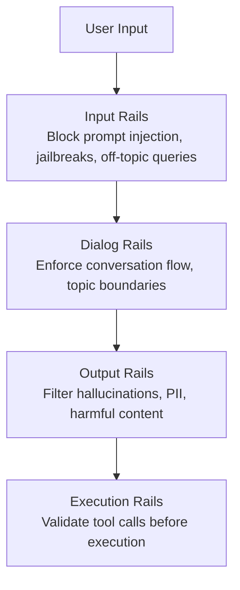

# Tools and Projects

Open-source ecosystem powering the tool layer of modern coding agents — protocols, sandboxing primitives, function calling libraries, code editing tools, and safety frameworks.

The infrastructure beneath coding agents is a rich, rapidly evolving ecosystem. While the agents themselves get the headlines, it is these foundational projects — protocol specs, sandbox runtimes, parsing libraries, and guardrail frameworks — that determine what an agent can actually *do*, how safely it can do it, and how extensible it is for new use cases. This document catalogs the most important open-source projects in each layer.

---

## 1. MCP Protocol & SDKs

### Model Context Protocol (MCP)

- **URL**: <https://modelcontextprotocol.io>
- **Spec**: <https://spec.modelcontextprotocol.io>
- **GitHub**: <https://github.com/modelcontextprotocol>
- **Steward**: Linux Foundation (donated by Anthropic, Nov 2024)
- **License**: MIT (SDKs), open spec
- **Stars**: 40 K+ (aggregate across repos)

MCP is an open protocol for connecting LLM-powered applications to external data sources, tools, and services. It is built on **JSON-RPC 2.0** and defines three core primitives:

| Primitive     | Direction       | Description                                      |
|---------------|-----------------|--------------------------------------------------|
| **Tools**     | Model-controlled | Functions the LLM can invoke (e.g., run shell)   |
| **Resources** | App-controlled   | Context the host app exposes (e.g., file content) |
| **Prompts**   | User-controlled  | Templated interactions (e.g., code review prompt) |

MCP eliminates the **N×M integration problem**: instead of every agent writing custom integrations for every tool, both sides implement one protocol. This is conceptually identical to what USB did for peripherals or LSP did for editor–language-server pairs.

**Transport modes**: stdio (local), Streamable HTTP (remote, SSE-based), and the older SSE transport (deprecated in favor of Streamable HTTP).

**Who uses it**: Claude Code, Cursor, Windsurf, GitHub Copilot CLI, VS Code Copilot Chat, Zed, OpenCode, Cline, Continue, Amazon Q Developer, and 50+ other clients listed at <https://modelcontextprotocol.io/clients>.

### Official SDKs

| SDK | URL | Language | Runtime | Notes |
|-----|-----|----------|---------|-------|
| TypeScript | <https://github.com/modelcontextprotocol/typescript-sdk> | TypeScript | Node, Bun, Deno | v1 stable; v2 pre-alpha with Streamable HTTP |
| Python | <https://github.com/modelcontextprotocol/python-sdk> | Python 3.10+ | CPython | High-level `FastMCP` decorator API; `pip install "mcp[cli]"` |
| Rust | <https://github.com/modelcontextprotocol/rust-sdk> | Rust | Native | Async, tokio-based |
| Go | <https://github.com/modelcontextprotocol/go-sdk> | Go 1.22+ | Native | Official; also see community `mcp-golang` |
| Java | <https://github.com/modelcontextprotocol/java-sdk> | Java 17+ | JVM | Spring AI integration |
| Kotlin | <https://github.com/modelcontextprotocol/kotlin-sdk> | Kotlin | JVM / Multiplatform | Coroutine-based |
| C# | <https://github.com/modelcontextprotocol/csharp-sdk> | C# | .NET 8+ | Microsoft-contributed |
| Swift | <https://github.com/modelcontextprotocol/swift-sdk> | Swift 6 | Apple / Linux | Actor-based concurrency |

Community SDKs also exist for **Ruby** (`mcp-rb`), **PHP** (`php-mcp`), **Elixir**, and **Zig**.

### MCP Server Registry

- **URL**: <https://registry.modelcontextprotocol.io>
- Centralized, searchable catalog of MCP servers
- Enables `npx @modelcontextprotocol/create-server` scaffolding
- Categories: databases, dev tools, cloud providers, search, productivity

---

## 2. Sandboxing & Isolation

Coding agents execute arbitrary code. Without sandboxing, a single hallucinated `rm -rf /` can be catastrophic. The ecosystem offers solutions at every level — kernel primitives, container runtimes, and cloud-hosted sandboxes.

### bubblewrap (bwrap)

- **URL**: <https://github.com/containers/bubblewrap>
- **Language**: C
- **License**: LGPL-2.0+
- **Stars**: ~4 K
- **Dependencies**: Nearly zero (just Linux kernel ≥ 3.8 with user namespaces)

Bubblewrap creates lightweight sandboxes using **Linux user namespaces** and **bind mounts**. It requires no root privileges and no daemon — it is a single `bwrap` binary that sets up a restricted filesystem view, drops capabilities, and exec's the target process.

**Key properties**:
- Unprivileged: no setuid, no root
- Minimal attack surface (< 3,000 lines of C)
- Used by **Flatpak** for desktop app sandboxing
- Used by **OpenAI Codex** as the primary confinement layer
- Configurable: read-only bind mounts, tmpfs overlays, blocked network

### Landlock LSM

- **URL**: <https://landlock.io>
- **Kernel**: Linux 5.13+ (merged 2021)
- **License**: GPL-2.0 (kernel module)
- **Type**: Linux Security Module

Landlock lets **unprivileged processes voluntarily restrict their own filesystem access**. Unlike AppArmor or SELinux, it requires no admin configuration — a process simply declares "I only need read access to `/src` and write access to `/tmp`" and the kernel enforces it.

**Key properties**:
- Zero container overhead — just syscalls (`landlock_create_ruleset`, `landlock_add_rule`, `landlock_restrict_self`)
- Stackable with other LSMs
- Used by **OpenAI Codex** as **Layer 3** (filesystem access control)
- ABI versioning ensures forward compatibility

### seccomp-bpf

- **URL**: Linux kernel built-in (since 3.5)
- **License**: GPL-2.0

seccomp-bpf (Secure Computing Mode with Berkeley Packet Filter) allows processes to install **syscall filters** as BPF programs. Each filter inspects syscall numbers and arguments, returning allow/deny/trap decisions.

**Key properties**:
- Foundational layer for Docker, bubblewrap, Chrome, Firefox, systemd
- Used by **OpenAI Codex** as **Layer 2** (syscall restriction)
- Extremely low overhead (BPF runs in kernel, no context switches)
- Cannot be loosened once installed (security invariant)

### gVisor

- **URL**: <https://github.com/google/gvisor>
- **Language**: Go
- **License**: Apache-2.0
- **Stars**: ~16 K

gVisor is an **application kernel** — it re-implements the Linux syscall interface in userspace via a component called the Sentry. Guest applications think they are talking to a Linux kernel, but every syscall is intercepted and handled by gVisor's Go implementation.

**Key properties**:
- OCI-compatible runtime (`runsc`) — drop-in replacement for `runc`
- ~5–15% CPU overhead vs bare metal
- Strong isolation: bugs in the guest kernel don't affect the host
- Used by **Google Cloud Run**, **GKE Sandbox**
- Supports both ptrace and KVM interception modes

### E2B (Environment-to-Bot)

- **URL**: <https://e2b.dev>
- **GitHub**: <https://github.com/e2b-dev/e2b>
- **License**: Apache-2.0
- **Stars**: ~5 K

E2B provides **cloud sandboxes purpose-built for AI agents**. Each sandbox is a lightweight Firecracker microVM that boots in ~150ms with its own filesystem, network, and process tree.

**Key properties**:
- Python and JavaScript SDKs
- Instant sandbox creation via REST API
- Built-in code interpreter sandbox
- Self-hostable on GCP (Terraform modules provided)
- Used by **Vercel v0**, **CrewAI**, **LangChain** tool execution

### Daytona

- **URL**: <https://daytona.io>
- **GitHub**: <https://github.com/daytonaio/daytona>
- **License**: AGPL-3.0
- **Stars**: ~15 K

Daytona is a **sandbox infrastructure platform** designed for coding agents and development environments.

**Key properties**:
- Sub-90ms sandbox creation
- Built-in **LSP** support (language intelligence inside sandboxes)
- Python, TypeScript, and Go SDKs
- File system snapshots and volume persistence
- Used by agent frameworks needing full dev environments

### Modal

- **URL**: <https://modal.com>
- **GitHub**: <https://github.com/modal-labs/modal-client>
- **License**: Apache-2.0 (client)

Modal provides **serverless, sandboxed function execution** with strong isolation.

**Key properties**:
- GPU support (A100, H100) for ML workloads
- Function-level isolation (each call runs in its own container)
- Snapshot-and-restore for fast cold starts
- Python-native API with `@modal.function` decorator
- Used by AI teams for batch inference and tool execution

### Firejail

- **URL**: <https://github.com/netblue30/firejail>
- **Language**: C
- **License**: GPL-2.0
- **Stars**: ~6 K

Firejail is a **SUID sandboxing program** that uses Linux namespaces, seccomp, and capabilities to restrict applications.

**Key properties**:
- Ships with 1,000+ pre-built security profiles
- More desktop-focused than bubblewrap (Firefox, VLC, etc.)
- SUID root requirement is a trade-off vs bubblewrap's unprivileged model
- Useful for sandboxing desktop apps agents might launch

### Sandboxing Comparison

| Solution    | Isolation Level  | Overhead    | Root Required? | Best For                        |
|-------------|------------------|-------------|----------------|---------------------------------|
| bubblewrap  | Namespace + bind | Negligible  | No             | Local agent sandboxing          |
| Landlock    | Kernel LSM       | Negligible  | No             | Fine-grained FS access control  |
| seccomp-bpf | Syscall filter   | Negligible  | No             | Syscall allow-listing           |
| gVisor      | App kernel       | 5–15% CPU   | No (rootless)  | Cloud workloads, strong isolation |
| E2B         | MicroVM (cloud)  | ~150ms boot | N/A (cloud)    | Stateless AI code execution     |
| Daytona     | Container (cloud)| ~90ms boot  | N/A (cloud)    | Full dev environments           |
| Modal       | Container (cloud)| ~100ms boot | N/A (cloud)    | GPU + serverless execution      |
| Firejail    | Namespace + SUID | Negligible  | Yes (SUID)     | Desktop app sandboxing          |

---

## 3. Function Calling Libraries

Function calling is the mechanism by which an LLM selects and invokes tools. These libraries handle the plumbing: schema generation, validation, retries, and type safety.

### Instructor

- **URL**: <https://github.com/jxnl/instructor>
- **Language**: Python (also TypeScript, Ruby, Go, Elixir ports)
- **License**: MIT
- **Stars**: ~10 K
- **Downloads**: 3M+ monthly (PyPI)

Instructor patches LLM client libraries (OpenAI, Anthropic, etc.) to return **validated Pydantic models** instead of raw strings. It is the most widely used structured-output library in the Python ecosystem.

**Key properties**:
- Automatic retries with validation feedback (model sees its own errors)
- Streaming support for partial objects
- Multi-provider: OpenAI, Anthropic, Gemini, Mistral, Ollama, llama-cpp
- `instructor.from_openai(client)` — one-line patching
- Handles tool-call and JSON-mode extraction transparently

### Magentic

- **URL**: <https://github.com/jackmpcollins/magentic>
- **Language**: Python
- **License**: MIT
- **Stars**: ~2 K

Magentic uses Python decorators to turn **ordinary functions into LLM calls**.

**Key properties**:
- `@prompt` decorator: function signature becomes the prompt, return type becomes the schema
- `FunctionCall` type: model can choose which function to invoke from a list
- `@prompt_chain`: automatically resolves tool call loops (model calls tool → gets result → continues)
- Type-safe: uses Python type hints as the schema source
- Async support, streaming, multi-provider

### Tool Schema Standards

Most function-calling flows use one of these schema formats:

| Format | Used By | Description |
|--------|---------|-------------|
| OpenAI function calling | GPT-4, GPT-4o | JSON Schema in `tools[]` array |
| Anthropic tool use | Claude 3+ | JSON Schema in `tools[]`, similar to OpenAI |
| MCP tool schema | MCP servers | JSON Schema with `inputSchema` field |
| Google function declarations | Gemini | Subset of OpenAPI 3.0 |

---

## 4. Code Editing Tools

Agents must read, understand, and modify code. These tools provide the low-level primitives for parsing, diffing, patching, and navigating codebases.

### diff-match-patch

- **URL**: <https://github.com/google/diff-match-patch>
- **Language**: C++, JavaScript, Python, Java, Dart, Lua, C#, Objective-C
- **License**: Apache-2.0
- **Stars**: ~8 K
- **Created**: 2006 (Google)

Google's battle-tested library implements three algorithms:
1. **Diff**: Myers' O(ND) algorithm for computing minimal edit sequences
2. **Match**: Bitap (shift-or) fuzzy string matching
3. **Patch**: Best-effort patch application that succeeds even when context has shifted

**Why it matters for agents**: LLM-generated patches often target code that has been slightly modified since the model last saw it. diff-match-patch's fuzzy matching and best-effort application means patches land correctly even with minor drift — a critical property for multi-step editing workflows.

### tree-sitter

- **URL**: <https://github.com/tree-sitter/tree-sitter>
- **Language**: Rust (core), C (generated parsers)
- **License**: MIT
- **Stars**: ~20 K

Tree-sitter is an **incremental parser generator** that produces concrete syntax trees for source code. It is the backbone of syntax-aware tooling in the agent ecosystem.

**Key properties**:
- **200+ language grammars** maintained by the community
- **Per-keystroke parsing speed**: parses only the changed region, not the entire file
- **Error recovery**: produces useful trees even for syntactically broken code
- Query language (S-expressions) for structural pattern matching
- Bindings for Python, Node.js, Rust, Go, WASM

**Agent usage**:
- **Aider**: uses tree-sitter to build "repo maps" — compressed structural summaries of entire codebases that fit in context
- **Claude Code**: syntax-aware code navigation and symbol extraction
- **Cursor**: incremental parsing for real-time code understanding
- **OpenHands**: structural edits and code analysis

### Language Server Protocol (LSP)

- **URL**: <https://microsoft.github.io/language-server-protocol/>
- **Spec version**: 3.17
- **Created by**: Microsoft (2016)
- **License**: CC-BY-4.0 (spec), MIT (implementations)

LSP defines a JSON-RPC protocol between an editor (client) and a language server that provides:

| Capability | Description |
|------------|-------------|
| Diagnostics | Errors, warnings, hints |
| Go-to-definition | Jump to symbol definition |
| Find references | All usages of a symbol |
| Rename | Safe cross-file rename |
| Completion | Autocomplete suggestions |
| Hover | Type information and docs |
| Code actions | Quick fixes, refactorings |

**Historical note**: LSP directly inspired MCP. Both use JSON-RPC 2.0, both solve an N×M problem (editors × languages for LSP, agents × tools for MCP), and both use a capability negotiation handshake.

**Agent usage**: OpenCode, OpenHands, Warp, Daytona sandboxes (built-in LSP), and any agent that needs precise type-aware navigation rather than regex-based search.

### Universal Ctags

- **URL**: <https://github.com/universal-ctags/ctags>
- **Language**: C
- **License**: GPL-2.0
- **Stars**: ~7 K

Universal Ctags is a **symbol indexer** that scans source files and produces a tags database mapping symbol names to file locations.

**Key properties**:
- 200+ language parsers (many regex-based, some tree-sitter-based)
- Fast batch indexing (entire repos in seconds)
- Used by **Aider** for building repository maps when tree-sitter grammars are unavailable
- Output formats: ctags, etags, JSON, Xref

### Code Editing Comparison

| Tool            | Type              | Speed         | Languages | Incremental | Primary Agent Use               |
|-----------------|-------------------|---------------|-----------|-------------|---------------------------------|
| diff-match-patch | Diff/Patch       | O(ND)         | Any text  | N/A         | Fuzzy patch application         |
| tree-sitter     | Parser generator  | Per-keystroke | 200+      | Yes         | Repo maps, structural edits     |
| LSP             | Protocol          | Real-time     | 100+      | Yes         | Diagnostics, navigation, rename |
| Universal Ctags | Symbol indexer    | Batch (fast)  | 200+      | No          | Symbol lookup, repo mapping     |

---

## 5. Safety & Guardrails

As agents gain more autonomy — executing code, modifying files, making API calls — safety frameworks become essential. These tools enforce constraints on what an agent can say, do, and access.

### NeMo Guardrails

- **URL**: <https://github.com/NVIDIA/NeMo-Guardrails>
- **Language**: Python 3.10–3.13
- **License**: Apache-2.0
- **Stars**: ~5 K
- **Created by**: NVIDIA

NeMo Guardrails is a programmable safety framework that adds **rails** (constraints) to LLM-powered applications. It introduces **Colang**, a domain-specific language for defining conversational and execution policies.

**Layered rail architecture**:



**Key properties**:
- Colang 2.0 DSL for declarative policy definition
- Built-in scanning for LLM vulnerabilities (prompt injection, jailbreak)
- Integration with LangChain, LlamaIndex, and custom pipelines
- Retrieval-augmented generation (RAG) rails for factual grounding
- Real-time monitoring and logging of rail activations

---

## 6. Additional Notable Projects

### Anthropic Computer Use Tools

- **URL**: <https://docs.anthropic.com/en/docs/agents-and-tools/computer-use>
- Claude models can control a desktop environment: mouse, keyboard, screenshots
- Three built-in tools: `computer`, `text_editor`, `bash`
- The `text_editor` tool (view, create, str_replace, insert) has become the de facto standard — adopted by OpenAI and others
- Currently in beta; best paired with sandboxed environments

### OpenAI Code Interpreter

- **URL**: <https://platform.openai.com/docs/assistants/tools/code-interpreter>
- Sandboxed Python execution environment within the Assistants API
- File upload/download support
- Stateful sessions (variables persist across calls)
- Used for data analysis, visualization, and code execution

### LangChain Tools Framework

- **URL**: <https://github.com/langchain-ai/langchain>
- **License**: MIT
- **Stars**: ~105 K
- Defines `BaseTool` and `@tool` decorator pattern
- Extensive pre-built tool catalog (search, math, APIs, databases)
- LangGraph adds stateful, graph-based tool orchestration
- MCP integration via `langchain-mcp-adapters`

### CrewAI Tools

- **URL**: <https://github.com/crewAIInc/crewAI>
- **License**: MIT
- **Stars**: ~25 K
- Role-based agent framework where each agent has assigned tools
- `@tool` decorator for custom tools, plus pre-built tool packages
- Supports MCP servers as tool providers

### AutoGen Tool Calling

- **URL**: <https://github.com/microsoft/autogen>
- **License**: CC-BY-4.0 (v0.4+), MIT (v0.2)
- **Stars**: ~40 K
- Microsoft's multi-agent conversation framework
- `FunctionTool` wraps any Python callable with automatic schema generation
- Tool results flow through the multi-agent conversation loop
- AutoGen v0.4 (AgentChat) supports MCP tool integration

### Semantic Kernel (Microsoft)

- **URL**: <https://github.com/microsoft/semantic-kernel>
- **License**: MIT
- **Stars**: ~25 K
- SDK for integrating LLMs into applications (.NET, Python, Java)
- "Plugins" are the tool abstraction — each plugin contains "kernel functions"
- Built-in planners that decompose goals into tool sequences
- Deep Azure OpenAI integration
- MCP support via `semantic-kernel-mcp` connector

---

## Agent–Project Matrix

Which agents use which infrastructure projects:

| Project              | Codex | Claude Code | Cursor | Aider | OpenHands | Cline | OpenCode | DeerFlow |
|----------------------|-------|-------------|--------|-------|-----------|-------|----------|----------|
| MCP Protocol         | —     | ✓           | ✓      | —     | ✓         | ✓     | ✓        | ✓        |
| bubblewrap           | ✓     | —           | —      | —     | —         | —     | —        | —        |
| Landlock             | ✓     | —           | —      | —     | —         | —     | —        | —        |
| seccomp-bpf          | ✓     | —           | —      | —     | —         | —     | —        | —        |
| gVisor               | —     | —           | —      | —     | —         | —     | —        | —        |
| E2B                  | —     | —           | —      | —     | ✓         | —     | —        | —        |
| Docker sandbox       | —     | —           | —      | —     | —         | —     | —        | ✓        |
| tree-sitter          | —     | ✓           | ✓      | ✓     | ✓         | —     | —        | —        |
| LSP                  | —     | —           | ✓      | —     | ✓         | —     | ✓        | —        |
| Universal Ctags      | —     | —           | —      | ✓     | —         | —     | —        | —        |
| diff-match-patch     | —     | —           | ✓      | ✓     | —         | —     | —        | —        |
| NeMo Guardrails      | —     | —           | —      | —     | —         | —     | —        | —        |
| Instructor           | —     | —           | —      | —     | —         | —     | —        | —        |
| LangChain Tools      | —     | —           | —      | —     | ✓         | —     | —        | ✓        |
| LangGraph            | —     | —           | —      | —     | —         | —     | —        | ✓        |
| Semantic Kernel      | —     | —           | —      | —     | —         | —     | —        | —        |

**Legend**: ✓ = confirmed usage, — = not used or not confirmed.

---

## 7. Skills-as-Markdown (DeerFlow Pattern)

DeerFlow introduces a novel tool-system pattern: **skills as Markdown capability modules**.

### What Makes It Different

In every other tool system covered in this document, tools are code:
- TypeScript functions (Claude Code)
- Rust trait implementations (Codex, Goose)
- Python classes with `@tool` decorators (LangChain)
- MCP server functions (Goose, Claude Code)

DeerFlow's skills are **Markdown files that define workflows**. The LLM reads the skill file directly as part of its context. There is no parsing, no function registry, no schema — just structured Markdown that describes how to approach a class of tasks.

```
/mnt/skills/public/
├── research/SKILL.md          ← how to do deep research
├── report-generation/SKILL.md ← how to write structured reports
├── slide-creation/SKILL.md    ← how to create slide decks
├── web-page/SKILL.md          ← how to generate web pages
└── image-generation/SKILL.md  ← how to generate images

/mnt/skills/custom/
└── your-skill/SKILL.md        ← drop any .md here
```

### Progressive Loading

Skills load on-demand, not at startup. A task classifier infers which skills are relevant and loads only those:

```
User: "Research X"   → loads research/SKILL.md only (~2K tokens)
User: "Make slides"  → loads slide-creation/SKILL.md only (~2K tokens)
User: "Both"         → loads both (~4K tokens)
```

For agents with 5–50+ skills, this saves meaningful context budget compared to loading all skills at startup.

### Trade-offs vs. Code-Based Tools

| Aspect | Code-Based Tools | Markdown Skills |
|--------|-----------------|-----------------|
| Enforcement | Strict (function signature) | Soft (LLM follows guidance) |
| Authoring | Requires code | Any Markdown editor |
| Versioning | Git diff of code | Git diff of text |
| Flexibility | Limited to function API | Nuanced prose guidance |
| Schema validation | Yes | No |
| Best for | Concrete operations (search, file I/O) | Workflow orchestration guidance |

**The pattern in practice**: DeerFlow uses both. Markdown skills for high-level workflow guidance; Python tools (web_search, bash, file_write) for concrete operations. Skills tell the agent *how* to use tools; tools do the actual work.

---

## Key Takeaways

1. **MCP is becoming the standard tool protocol**. With Linux Foundation stewardship, 10+ official SDKs, and adoption by every major agent, it is the closest thing to a universal tool interface.

2. **Sandboxing is a spectrum**. Local agents (Codex) stack kernel primitives (seccomp → Landlock → bubblewrap). Cloud agents (OpenHands, v0) use hosted sandboxes (E2B, Daytona). The choice depends on trust model and deployment context.

3. **Tree-sitter is the parser of choice**. Its incremental parsing, error recovery, and 200+ grammars make it indispensable for agents that need to understand code structure rather than just text.

4. **LSP and MCP are siblings**. Both use JSON-RPC, both solve N×M problems, and agents increasingly use both — LSP for code intelligence, MCP for tool integration.

5. **Safety is still early**. NeMo Guardrails is the most mature open-source option, but most agents still rely on ad-hoc permission systems rather than formal guardrail frameworks.
